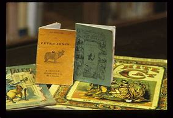
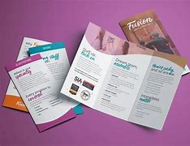
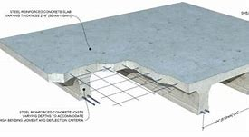

= step 3- Lesson 8
:toc: left
:toclevels: 3
:sectnums:
:stylesheet: ../../+ 000 eng选/美国高中历史教材 American History ： From Pre-Columbian to the New Millennium/myAdocCss.css

'''

https:www.kekenet.comArticle201803544729.shtml

`主` Two years of sensitive negotiations `谓` paid off 还清;(某行动) 取得成功; 带来好结果 today as `主` seventy former Cuban political prisoners 政治犯 `谓` arrived in the United States.

[.my2]
今天，70名古巴前政治犯抵达美国，为期两年的敏感谈判终见成效。 +

All of the prisoners had served least (在数量上) 至少 ten years in Cuban jails, and some had been in prison since Fidel Castro came to power in 1959.  +

The release was arranged in part by French underwater explorer, Jacques Cousteau, and a delegation 代表团 of American Roman Catholic bishops. 

[.my2]
他们此次获释，部分是由法国水下探险家，雅克·库斯托，和美国天主教主教的代表团安排。 +

President Reagan today unveiled （首次）展示，介绍，推出；将…公之于众 plans for nine hundred million dollar plan (n.) to reduce drug abuse in the United States.  +

It includes half a billion 十亿 dollars for stepping up 增加 drug enforcement along US borders, especially in the southwest.  +

[.my1]
====
.billion
(abbr. bn) 1 000 000 000; one thousand million 十亿 +
( old-fashioned) ( BrE ) 1 000 000 000 000; one million million 一万亿 +

在美国英语（American English）中，billion是我们熟知的“十亿”的意思，而在英国英语（British English）中，billion最先是指“万亿”。不过，从1974年开始，尽管仍有少数地区沿用着“万亿”的意思，大多数的英国官方媒体（比如BBC）开始使用“十亿”这个意思。 +
因此现在说到billion，一般是指美国的billion，也就是“十亿”。

billion 的值都是 latexmath:[ 10^9]（十亿） +
billion的意义也影响了 trillion、quadrillion、quintillion等的值。由此，trillion 目前在英语世界表示 latexmath:[10^{12}]

billion 等词语意义的变化, 对科学家和数学家来说从来就不是难题；他们通常以10的N次方来表示超大数值。
====

The plan also calls for mandatory 强制的；法定的；义务的 drug testing for some federal workers. 

[.my2]
该计划还要求对一些联邦工作人员, 进行强制性药物测试。  +

NPR's Brenda Wilson reports.  +

'''

"As part of his national crusade  （长期坚定不移的）斗争，运动; （中世纪的）十字军东征 against drugs, President Reagan signed an executive order 行政命令 today requiring federal workers in sensitive positions to undergo 经历，经受（变化、不快的事等） drug tests.  +

The order covers employees who have access to classified 机密的；保密的 information, presidentially appointed officials, law enforcement  执法(机关或官员) officials, and any federal worker engaged 从事 in activities which affect public health and safety or national security.  +

[.my2]
该命令涵盖了涉密雇员，
总统任命的官员，执法官员，
以及从事影响公共卫生和安全或国家安全活动的任何联邦工作人员。 +

But heads of government agencies 政府机构 may order additional workers to take the test.  +

`主` Federal employees who are found to have continued to use illegal drugs after a second test `谓` will be automatically fired.  +

The overall rug testing program is expected to cost fifty-six million dollars, but administration officials could not get even a ballpark （数额的）变动范围；可量范围 figure of how many workers may be included in the mandatory 强制的；法定的；义务的 program.  +

[.my2]
整个药物检测计划预计要花费5600万美元，但政府官员甚至无法拿出一个大概数字，说清有多少雇员会被列入强制性检测计划。 +

I'm Brenda Wilson."

'''

== 以色列与美国的领导人会谈

Israeli Prime Minister Shimon Peres is in Washington for talks with US leaders, including President Reagan.  +

Earlier Peres met with Secretary of State George Shultz.  +

Afterwards, the two told (v.) reporters that the Soviet Union will have no role in Middle East peace talks, because it has no diplomatic ties 外交关系 with Israel and does not permit 允许；准许 free emigration of Soviet Jews 犹太人.  +

[.my2]
随后，两人对记者表示，苏联不会在中东和谈中扮演任何角色，因为它与以色列没有外交关系，也不允许苏联犹太人自由移民。

Israel's Prime Minister Shimon Peres is in Washington D. C.  +

this week to confer  (v.)商讨；协商；交换意见 with high-level US officials.  +

His visit (n.) follows his summit （政府间的）首脑会议；峰会 with Egyptian President Mubarak last week.  +

This afternoon, the Israeli leader and President Reagan met at the White House.  +

NPR's Elizabeth Colton reports.  +

'''

Israel's Peres comes to Washington only weeks before he is scheduled (a.)(根据节目、时间表等)事先安排的; 事先计划的 to step down 退位，辞职 from the Prime Minister's post 职位；（尤指）要职 and exchange roles with the current Foreign Minister, Yitzhak Shamir.  +

[.my2]
以色列总理佩雷斯来华盛顿后短短几周，他就按计划辞去总理职位，
转而接任外交部长，而现任外交部长伊扎克·沙米尔将接任总理一职。 +

This rotation 轮换；交替；换班 was arranged two years ago as part of Israel's coalition 联合；结合；联盟 national unity 团结一致；联合；统一 government.  +

[.my2]
这次职位交换早在两年前就已经安排，作为以色列民族团结政府的一部分。 +

But `主` what was expected 预料；预期；预计 to be little more than 仅仅是,只是……而已 a farewell 告别；辞行 visit for Prime Minister Peres `谓` has now taken on 呈现,具有（特征、外观等） a new importance because of Peres' recent achievements (n.)  towards bringing peace between Israelis and Arabs.  +

[.my2]
但是，本想总理佩雷斯的访问不过是个告别仪式，但现在看来却有了新的重要意义。
由于佩雷斯最近在实现"阿以和平"上, 取得了成就。 +

[.my1]
====
.little more than
和…无差别（一样），仅仅是，比...好不了多点, 差不多 +
- The President will be little more than a figurehead. 总统将不过是个傀儡而已。
====

At the White House this afternoon President Reagan said that the Middle East peace process was the major topic for discussion.  +

And he praised Prime Minister Peres' efforts (n.) in that direction.  +

[.my2]
他赞扬佩雷斯总理在这个方向上所做出的努力。 +

"We noted 注意；留意 favorable 有利的；有助于…的 trends in the Middle East, not just the longing (n.)（对…的）渴望，热望 for peace by the Israeli and Arab peoples, but constructive actions taken by leaders in the region to breathe new life into 向…注入新生命,给予生气 the peace process.

[.my2]
我们注意到中东趋势向好，
这不仅仅是以色列和阿拉伯人民对和平的渴望，
同时也是该地区领导人为和平进程注入新力量，而采取的建设性行动。 +

No one has done more than Prime Minister Peres to that end. 

[.my2]
佩雷斯总理为此所付出的努力堪称之最。 +

His vision, his statesmanship 政治才能；治国才干, and his tenacity 顽强，执着，坚持；黏性 are greatly appreciated here."  +
他的远见卓识，他的政治才干，他的坚韧不拔，在此受到高度欣赏。” +

President Reagan said that `主` other items on the agenda of his meeting with Prime Minister Peres `系` were American economic aid to Israel, international terrorism, and Soviet 苏联的 Jewry 犹太人.  +

[.my2]
里根总统说, 他会议议程上还会与佩雷斯首相就美方对以经济援助，国际恐怖主义，以及苏联犹太问题展开讨论。 +

The President assured the Israeli leader that the plight 苦难；困境；苦境 of Soviet Jewry will remain an important topic in all the talks between the US and the Soviets.  +

[.my2]
总统向以色列领导人保证，苏联犹太人的困境, 将仍是美国和苏联之间谈判的重要内容。 +

I'm Elizabeth Colton in Washington.  +

'''

== 医学生的诗

A chapbook  (旧)畅销故事书;廉价的小册子 arrived in the mail a while back from the Northeastern Ohio University's College of Medicine.  +

[.my2]
从东北俄亥俄大学医学院回来后不久，我收到了一本小册子。 +

[.my1]
====
.chapbook

====

The chapbook, a small pamphlet 小册子；手册 of collected poetry, contains works by students, part of the school's "Human Values 人类价值观 in Medicine" program.  +

[.my2]
这本小册子是一本学生创作的诗歌集，是学校“医学人文价值”计划的一部分。 +

[.my1]
====
.pamphlet

====

NPR's Susan Stanberg leafed through 匆匆翻阅；浏览 the poems.  +

The selected works by finalists 参加决赛者 in the "William Carlos Williams Poetry Competition," named for America's great poet-physician 医师；（尤指）内科医生, the New Jersey country doctor who used to scroll (v.)滚屏；滚动 drafts of poems on pages of his prescription 处方；药方 pads 便笺本；拍纸簿.  +

[.my2]
入围作品由“威廉卡洛斯威廉姆斯诗歌大赛”的决赛选手创作，该大赛以美国伟大诗人命名，
这位新泽西乡村医生, 经常在他的处方页上创作诗稿。 +

William Carlos Williams wrote short, sometimes, and to the quick 触及要害；触及痛处.  +

This is just to say I have eaten the plums 李子；梅子 That were in the ice box, And which you were probably saving for breakfast.  +

Forgive me; they were delicious, So sweet and so cold.  +

"Let me read it again." And he did.  +

William Carlos Williams, who died in 1963, has been an inspiration 启发灵感的人（或事物）；使人产生动机的人（或事物）;鼓舞人心的人（或事物） to patients and physicians.  +

So, it's fitting (a.)适合（某场合）的；恰当的 that the Northeastern Ohio University's College of Medicine should name (v.) its poetry competition for him.  +

Now, at the beginning of its fifth year, the competition is open to all medical students in this country, but just one percent of them, a few hundred or so 大约，左右, entered the competition.  +

"I'm sure a lot more are closet (a.)隐藏（身份等）的；不公开（个人信息）的 poets 诗人 and aren't willing yet to submit  提交，呈递（文件、建议等）. We hope they do." Martin Cohn, director of the Human Values in Medicine's program at the College of Medicine, says that students' poetry centers (v.) around 把…当作中心；（使）成为中心 several themes  （演讲、文章或艺术作品的）题目，主题，主题思想. 

[.my2]
学生的诗歌围绕着几个主题 +

"I guess it falls into  可以分为；能够分成 categories  种类; 范畴 that all poets write about, including lovers and friends and sorrowful 悲伤的；悲痛的；悲哀的 kinds of situations, but then there is also the experience that they're most intimate (a.)亲密的；密切的;有性关系的；暧昧的 with, which is medical school itself, which is also a theme, and also relationships with patients." Poetry by ten medical students is presented in the chapbook, accompanied by biographical (a.)传记的，生平的 notes on each of the poets.  +

[.my2]
我猜它是所有诗人的创作范畴，包括爱人和朋友以及悲伤的种种情况，
但（这些主题中）也包含有他们至亲的经历，那就是医学院本身，
这也是一个主题，还有医患关系。
医学院10名学生的诗歌收录在集，附着每位诗人的传记。 +

Kurt Beal, at the University of Texas Health Science Center at Houston, describes himself this way.  +

"I write to remember, to find, to uncover, to unfold （使）逐渐展现；展示；透露. 

[.my2]
我写作是为了去铭记，去发现，去揭示，去展开。 +

I have learned that poetry is music.  +

And I write because I cannot sing." Martin Cohn has some samples of poems from the chapbook. 

[.my2]
马丁·科恩已经从诗集中找了一些样篇。 +

P.C. Bowman of the Medical College of Virginia School of Medicine wrote "Cartographer 制图员；地图绘制员 about his Wife." When I watch you watching yourselves in the mirror, Undress (v.)（给…）脱衣服 not with caution 谨慎；小心；慎重 but with care, Peeling (v.) 剥掉；揭掉；剥落 the swimsuit from shoulders and breasts （女子的）乳房, Exposing (v.) the belly  腹部；肚子 flat (ad.)（尤指贴着另一表面）平直地，平躺地 from its vortex  低涡；涡旋 to the ribs, Ordered  (a.)精心安排的；组织有序的 as architecture 建筑学;体系结构；（总体、层次）结构.  The hip 臀部；髋 swell (v.)（使）凸出，鼓出 That breaks (v.) my geometer's  几何学家 heart.  +

[.my1]
====
.vortex +
--> 来自拉丁语 vertere,转，旋转，词源同 versus,convert.引申词义漩风，漩涡，涡流。 +

====

[.my2]
====
+

当我看你照见镜中的自己，宽衣时没有小心翼翼，有的只是呵护与关爱，
剥下泳衣，从肩膀及胸部，露出平坦的腹部，从肚脐到肋骨，
动作有序，宛如一座建筑。
臀部隆起，荡漾了我几何学者般的内心。 +

chatGpt : 弗吉尼亚医学院医学院的P.C.鲍曼（P.C. Bowman）写了《关于他妻子的地图绘制者》。当我看着你在镜子前自己观察时，脱衣不是谨慎而是小心翼翼，从肩膀和胸部剥下泳衣，暴露出从腹部的漩涡到肋骨的平坦，井然有序如建筑结构。臀部的膨胀让我的测绘者之心破碎。

====

It is a map of some impossible country, Whose turns (n.)（异乎寻常或意外的）变化，转变 widen (v.)（使）变宽；加宽；拓宽；放宽 to vistas （农村、城市等的）景色，景观 and stations So sudden that I cannot breathe or comprehend 理解；领悟；懂 How I have wandered there and kept my life.  +

[.my2]
它是一幅地图，描绘着一个不可能出现的国度，它的拐弯处突然扩大为远景和车站，使我无法呼吸，也无法理解我是如何在那里游荡并维持生命的。 +

"Wonderful poem." "Ya." "But he doesn't have to be a doctor to have written it." "No.  +
That's true." "Give us one that could only be written by a doctor." "OK.  +

[.my2]
“好诗”。“是的。”
“但即便不是医生，也可以写出来。”
“是的，的确。”“给我们看一篇只有医生才能写出来的吧。” +

There is a poem, another one on anatomy 剖析；解析;解剖学, that was written by Diane Roston, who, as the other poets, has a very interesting background.  +

[.my2]
还有一首关于解剖学的诗，是黛安·罗斯顿写的，她和其他诗人一样，有着非常有趣的背景。 +

She danced for a number of years in a regional company and also had taken courses in journalism 新闻业；新闻工作.  +

And she writes of 写,记述 an experience with a cadaver 死尸；尸体, and the life of this cadaver.  

[.my2]
她写了一段与尸体相处的经历，还写到了这具尸体的生活。 +

[.my1]
====
.cadaver
-> 来自词根cid, 掉落，此处抽象为死亡。词源同case, accident.
====

And she ends (v.) the poem with the following verse 韵文.  +

Now student to anatomy.  +

Cleave (v.)劈开；砍开；剁开 and mark this slab 厚片；厚块;（石、木等坚硬物质的）厚板 Of thirty-one-year-old caucasian 白种人；高加索人 female flesh （动物或人的）肉,（人体的）皮肤, Limbs, thorax 胸；胸腔, cranium 颅骨；头盖骨, muscle by rigid 坚硬的；不弯曲的；僵直的 muscle.  +

[.my2]
劈开并标记这个三十一岁白人女性的身体，四肢、胸部、颅骨和肌肉。  +

[.my1]
====
.slab

.cranium
( anatomy 解) the bone structure that forms the head and surrounds and protects the brain 颅骨；头盖骨
====

Disassemble (v.)拆卸；拆开 this motorcycle victim's every part, As if so gray a matter never wore (v.)穿；戴；佩戴 a flashing ruby dress.  +

[.my2]
拆开这个摩托车受害者身体的每一部分，就好像如此灰暗的物质从未穿着过一袭闪烁的红宝石裙一样。 +
将这位摩托车（事故）受害者的全部解剖，就像一种灰暗物件从未身着过华服。 +

"I notice there's so much of that in this poetry by the medical students, the reminders (n.) to themselves of humanity here.  +

[.my2]
我注意到这首诗中有很多内容, 是在提醒医学界的学生们注重人性。 +

It's not just arteries 动脉; it's not just anatomy 解剖学. There are humans."  +

[.my2]
这不仅仅是动脉，不仅仅是解剖学，还有人类。  +

"That's right. And we feel we're just trying to do our part 尽我们的一份力量 to encourage them to remember.  +

Many students shuck 剥…的壳（或荚）；去…的外皮 off the  arts and humanities 人性;人道；仁慈 when they enter medical school, and even if we can keep them involved, even if it's a thread 线索；脉络；思绪；思路；贯穿的主线 of involvement, or vicarious (a.)间接感受到的 involvement by reading, not necessarily writing — that's what we are trying to do."

[.my1]
====
.vicarious
vaɪˈkeriəs +
(a.)[ only before noun] felt or experienced by watching or reading about sb else doing sth, rather than by doing it yourself 间接感受到的 +
=> He got a vicarious thrill out of watching his son score the winning goal. 他看着儿子射入获胜的一球，也同样感到欣喜若狂。 +
-> 来自拉丁语 vicis,改变，交流，继任，来自 PIEweik,弯，转，词源同 week,winch.引申词义 感同身受的。

====

[.my2]
====
+

许多学生，当他们步入医学院，就脱去了人文艺术的外衣，
即使我们能让他们参与进来，即使这是参与的一个途径，
或者是通过阅读而不是写作的方式参与进来，这正是我们所要做的。

chatGpt :许多学生进入医学院时放弃了文学和人文科学，即使我们能够让他们参与其中，即使是一丝参与的线索，或者通过阅读而非必须写作的虚拟参与，这正是我们正在努力做的。
====

At the Northeastern Ohio University's College of Medicine, Martin Cohn says there's no evidence that `主` the making of poetry `谓` produces (v.) better medicine, but he has to believe it helps the students understand themselves and their patients better.  +

[.my2]
没有证据表明，诗歌可以催生更好的医疗，
但他必须相信，诗歌可以帮助学生更好地了解自己和病人。 +

And so `主` the William Carlos Williams Poetry Competition `谓` continues.  +

[.my2]
因此，威廉·卡洛斯·威廉姆斯诗歌竞赛, 继续进行。 +

I'm Susan Stanberg.
This is just to say I have eaten the plums That were in the ice box And which you were probably saving for breakfast.  +

Forgive me; they were delicious, So sweet and so cold.

'''

