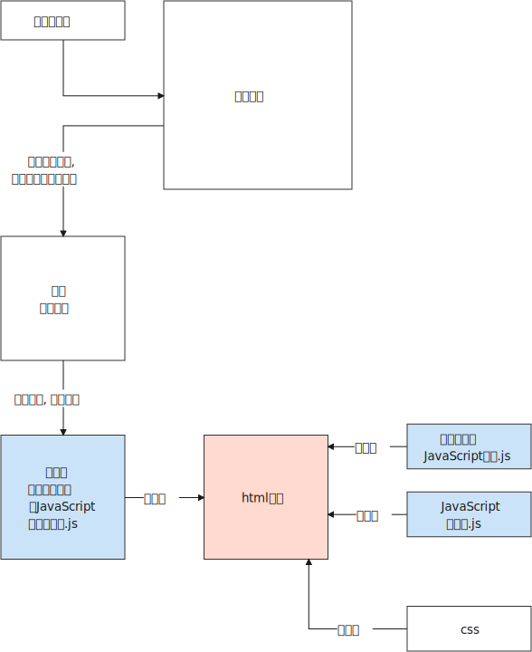
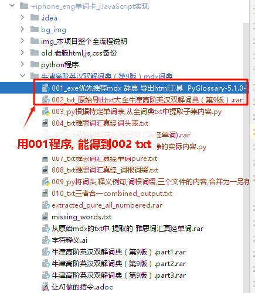
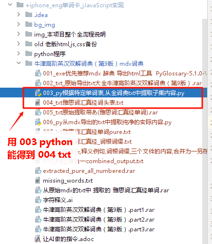
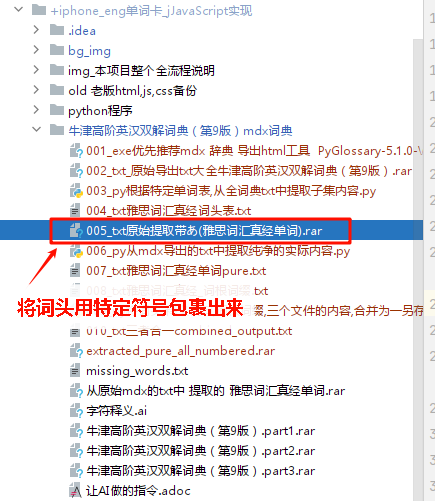
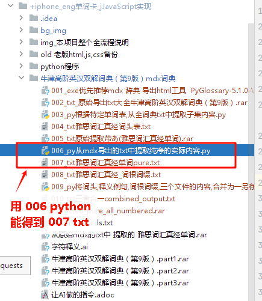
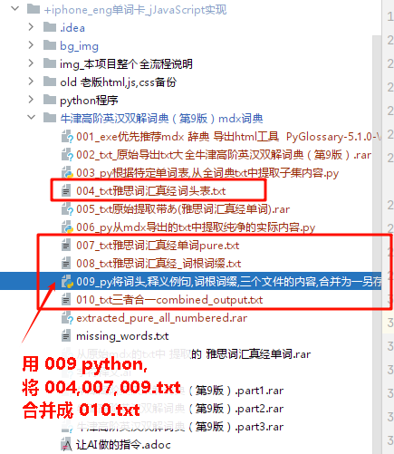
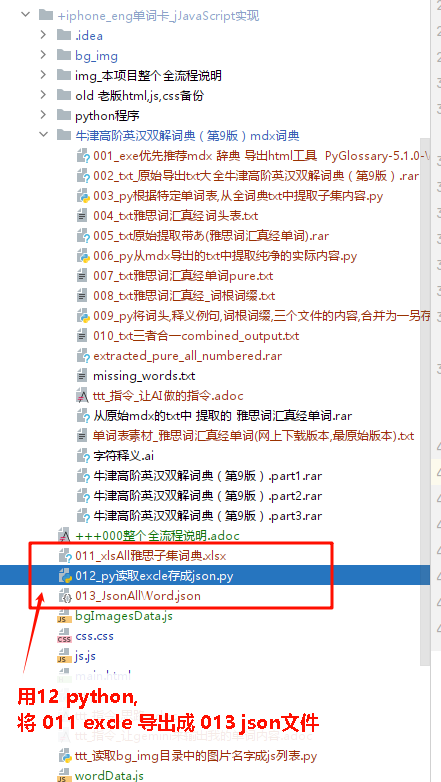
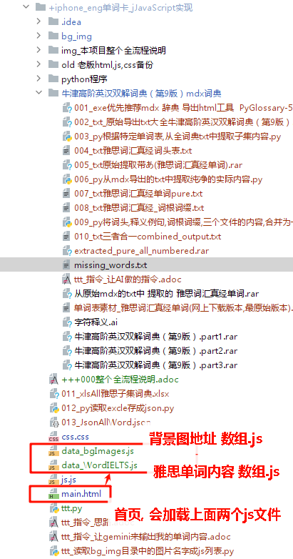

= 本前端整个全流程 使用说明
:toc: left
:toclevels: 3
:sectnums:
:stylesheet: myAdocCss.css

'''

== 全流程快速预览

'''

== 从mdx制作 JavaScript词典数据库

[.small]
[cols="1a,1a"]
|===
|步骤 |Header 2

|1.将mdx词典, 用  PyGlossary 软件导出成 txt
|

|2.根据雅思单词表, 从全词典txt中, 提取出只含有雅思单词的词典子集.
|

|3.对雅思子集词典txt, 进行处理,给词头加上识别符号 (比如用 【】 括起来), 方便后期用正则表达式 或 python程序 处理.
|

|4.对雅思子集txt词典, 纯净化处理, 即去除所有 <> 标签
|

|5.将雅思词头, 雅思子集词典, 和词根词缀(需要预先让ai来生成), 合并成一个单一的txt. +
注意有格式要求, 格式即:

....
ID	A部分(词头)	B部分(词典释义例句)	C部分(词根词缀)
....

|
|===

'''

== 前端制作, html,  外链 js, css

[.small]
[cols="1a,1a"]
|===
|步骤 |Header 2

|6.将雅思子集词典的txt, 里面的内容拷贝到 excle中, 然后将它用python 变成 json格式.  +
(*其实也可以不用借助excle, 直接在上面第5步时, 就直接将 词头,词典内容,词根词缀  这三者, 合并成一个符合格式要求的 json文件, 甚至一步到位直接生成 JavaScript文件.*)
|

|7.html中, 需要外链 js 和 css.
但是, #*在iphone的浏览器中, 无法在js中读取本手机中的json文件, 因为ios有限制. 所以, 我们只能把雅思词典子集内容的 json, 存到一个JavaScript文件中, 让 html来载入这个 雅思词典子集的 JavaScript文件来使用.*#

*同样, 背景图的地址列表, 也只能写到一个 JavaScript文件中(而非json文件中),来 在 html中加载这个 js 文件使用.*

|

|===

'''