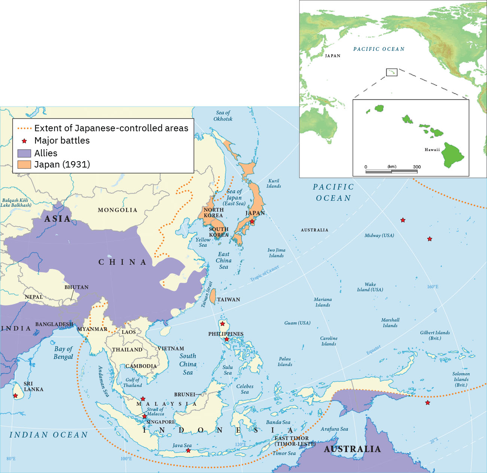

= 2-04. 国际秩序 (二战)
:toc: left
:toclevels: 3
:sectnums:
:stylesheet: myAdocCss.css

'''

== 二战过程

=== 为获得”生存空间”, 德国吞并波兰, 二战正式开始 (1939.9)

To the east of Germany, the Treaty of Versailles had created an independent Poland and awarded parts of Germany to Poland in the process. This “Polish Corridor,” in an area where many Polish people already lived, was intended to give Poland access to a port, and the German city of Danzig (Gdańsk), bordering it, was made a semi-independent city-state with its own parliament. Poland was a prime target of the Nazis as they looked for Lebensraum.

在德国东部，"凡尔赛条约"建立了一个独立的波兰，并在此过程中将德国的部分领土划归波兰。这条“波兰走廊”位于许多波兰人已经居住的地区，旨在让波兰能够进入一个港口，而与其接壤的德国城市"但泽"（Gdańsk）则成为一个半独立的城邦，其自己的议会。 波兰是纳粹寻找"生存空间"的首要目标。

Access to the Sea. The twenty-mile-wide Polish Corridor was meant to give Poland access to a port after World War I, separating two parts of Germany in order to do so.

出海通道。二十英里宽的波兰走廊, 原本是为了让波兰在第一次世界大战后能够进入港口，从而将德国分为两部分。

image:img/0054.jpg[,100%]

The lessons learned from Hitler’s violation of the Munich Pact spurred Britain and France to take action to protect Poland.

They have also been invoked by world leaders ever since, whenever the aggression of one nation threatens the sovereignty or the territorial integrity of another. Using the example of Munich to warn against the perils of allowing one nation to invade another without opposition, whether it be Hitler’s Germany or Putin’s Russia, is known as invoking the Munich Analogy.

希特勒违反"慕尼黑条约"的教训, 促使英国和法国采取行动, 保护波兰。

从那时起，每当一个国家的侵略威胁到另一个国家的主权或领土完整时，世界领导人就会援引这些原则。以慕尼黑事件为例来警告，不管一个国家是希特勒的德国, 还是普京的俄罗斯，允许一个国家侵略另一个国家而不反对它, 是很危险的，这被称为"援引慕尼黑类比"。

The key to whether Germany could be boxed in was the attitudes of Stalin and the Soviet Union. As early as the summer of 1938, Stalin began to think of making some sort of deal with Germany.

Stalin, aware of Hitler’s musings in his book Mein Kampf, understood the long-term threat Germany posed and sought to buy time to prepare for possible war. For his part, Hitler wanted to avoid Germany’s World War I mistake of fighting on two fronts simultaneously. The result was the German- Soviet Nonaggression Pact of August 23, 1939.

In this pact, Germany and the USSR agreed not to attack one another or to assist other nations in attacking the other. Included in the agreement were secret protocols that essentially divided eastern Europe between Germany and the Soviet Union. Lithuania, Latvia, Estonia, and parts of eastern Poland were allocated to the USSR as a reward for cooperating with Germany in the dismemberment of Poland.

Seeing the pact as an ominous green light for a German eastward thrust, two days later Britain signed a mutual defense agreement with Poland.

德国能否被围困，关键在于斯大林和苏联的态度。早在1938年夏天，斯大林就开始考虑与德国达成某种协议。斯大林从希特勒的著作《我的奋斗》中, 认识到德国将构成长期威胁，并寻求争取时间, 为可能的战争做好准备。

就希特勒而言，他希望避免德国在一战中"同时在两条战线上作战"的错误。结果就是 1939 年 8 月 23 日签订了"德苏互不侵犯条约"。

在该条约中，德国和苏联同意互不攻击，也不协助其他国家攻击对方。该协议中包含的秘密协议, 基本上将东欧划分为德国和苏联。立陶宛、拉脱维亚、爱沙尼亚, 和波兰东部部分地区, 被分配给苏联，作为"与德国合作来瓜分波兰"的奖励。

两天后，英国与波兰签署了共同防御协议，该协议为德国东进打开了不祥的绿灯。

All things seemed ready for the German onslaught, which was launched on September 1, 1939. Britain and France fulfilled their commitment to Poland and declared war on Germany, forming the partnership known as the Allies, but not on the Soviet Union.

About two weeks later, Soviet forces invaded Poland from the east. Crushed from two sides, Poland essentially ceased to exist. The European fires of World War II had been ignited.

1939 年 9 月 1 日， 德国发起猛烈的进攻，一切似乎都准备好了。英国和法国履行了对波兰的承诺，向德国宣战，形成了被称为"同盟国"的伙伴关系，但没有对苏联宣战。

大约两周后，苏联军队从东部入侵波兰。波兰从两侧被压垮， 基本上不复存在。第二次世界大战的欧洲战火已被点燃。

'''

=== 法德边境, 静坐战争 (1939-1940冬)

The British quickly discovered there was no practical way to render much assistance to the Poles. Instead, they relied on the French to engage the Germans. But the French felt they could not sustain an offensive against Germany’s western front. They preferred to prepare their defenses for an eventual German offensive against France. Britain joined the French by deploying the British Expeditionary Force (BEF) to defend the French-Belgian border. By then, Poland was already lost and had been folded into Hitler’s plans of dominating Europe.

During the winter of 1939–1940, little action took place on the French-German border save for a few clashes of patrols and reconnaissance units. That period of waiting has sometimes been referred to as the Phony War or, derisively, as the sitzkrieg (“sitting war”).

英国人很快发现, 没有切实可行的方法能向波兰人提供大量援助。取而代之，他们依靠法国人来与德国人交战。 但是法国人觉得他们无法维持对德国西线的进攻。他们更愿意为德国对法国的最终进攻做好防御准备。英国加入了法国的行列，部署了英国远征军（BEF）来保卫法国和比利时的边界。那时，波兰已经失守，并被纳入希特勒称霸欧洲的计划之中。

1939 年至 1940 年冬季，除了巡逻和侦察部队的几次冲突外，法德边境几乎没有什么行动。这段等待时期, 有时被称为“虚假战争”，或者被嘲笑为“静坐战争”。

'''

=== 德国进军挪威, 丹麦 (1940.4.09)

The German advance westward began with some forays into Norway and Denmark to the north on April 9, 1940. Not wanting to provoke German invasions, both Belgium and the Netherlands declared neutrality. This disadvantaged the British and French, since they were then not allowed to coordinate defenses with Dutch and Belgian forces or station troops in their territory.

德国向西进军, 始于 1940 年 4 月 9 日对北部的挪威和丹麦的进攻。为了避免德国的入侵，比利时和荷兰都宣布中立。这使英国和法国处于不利地位，因为他们不被允许与荷兰和比利时军队协调防御，也不允许在他们的领土上驻军。

'''

=== 奥斯威辛集中营 (1940.4)

Auschwitz in western Poland was the largest of the death camps, originally constructed in 1940 to hold Polish political prisoners. It became a death camp in 1941 when Polish and Soviet prisoners were executed there.

That same year, a new camp (known as Auschwitz II or Birkenau) was built nearby. Its main purpose was to kill Jewish people who were brought on freight trains from all over Europe. Other camps also existed at Auschwitz, including labor camps where prisoners worked for the chemical company I.G. Farben.

Some 1.3 million people were sent to Auschwitz-Birkenau before Heinrich Himmler, the leader of the SS, ordered the camp closed and evacuated in January 1945 as the Soviet army rapidly advanced on it. Of these 1.3 million, 1.1 million would die there. The vast majority, nearly one million, were Jewish.

波兰西部的"奥斯威辛集中营"是最大的死亡营，最初建于 1940 年，用于关押波兰政治犯。 1941 年，波兰和苏联囚犯被处决，这里成为死亡营。

同年，附近建立了一个新营地（称为"奥斯威辛二号"或"比克瑙"）。其主要目的是杀害从欧洲各地通过货运火车运来的犹太人。奥斯威辛集中营还存在其他营地， 包括劳改营，囚犯在那里为化学公司I.G.法本（I.G. Farben）工作。

1945 年 1 月，随着苏联军队迅速向该集中营推进，党卫军领导人海因里希·希姆莱(Heinrich Himmler) 下令关闭并清空该集中营. 而在此之前，有约 130 万人被送往奥斯威辛-比克瑙集中营。这130万人中，有110万人会死在那里。其中绝大多数（近百万）是犹太人。

'''

=== 德国进军法国 (1940.5)

The Germans then launched their full westward offensive on May 10, 1940. Within a matter of weeks, German troops had overrun western Europe, storming through the Netherlands, Luxembourg, and Belgium and into France, avoiding the Maginot Line, a system of fortifications and weapons installations that had been built on the French border in the 1930s in order to protect France from another German invasion.

1940年5月10日，德国人开始全面向西进攻。在几周内，德国军队占领了西欧，突袭了荷兰、卢森堡和比利时，进入法国，避开了马其诺防线。马其诺防线是20世纪30年代为保护法国免遭德国再次入侵而, 在法国边境修建的防御工事和武器设施系统。

'''

=== 英法 敦刻尔克撤退, 保留住军队主力 (1940.6)

Early in the morning of May 23, 1940, the British commander in France, seeing the perils of his position, gave the order to begin a withdrawal toward Dunkirk on the French coast. Eventually, this culminated in the extraordinary evacuation across the English Channel of much of the BEF and thousands of French and other Allied forces between June 15 and 25 using every British boat capable of crossing the Channel. The retreat saved 200,000 troops.

1940年5月23日清晨，在法国的英国指挥官，看到了自己的处境的危险，下令开始向法国海岸的敦刻尔克撤退。最终，6 月 15 日至 25 日期间， 英国远征军的大部分人员, 以及数千名法国和其他盟军部队, 使用每艘能够穿越英吉利海峡的英国船只， 从英吉利海峡进行了非同寻常的疏散。这次撤退拯救了20万军队。(保存有生力量，而不是像国民党在淞沪会战中被日军吃掉精锐主力)

'''

=== 贝当出任法国总理, 与德国合作 (1940.6)

French prime minister Paul Reynaud resigned rather than sign the armistice agreement with Germany in June 1940. Instead, Marshall Philippe Pétain, a hero of World War I, became the prime minister of a truncated French government based in Vichy, France, that, although nominally independent, cooperated with Germany.

1940 年 6 月，法国总理保罗·雷诺, 没有与德国签署停战协定，而是选择辞职。取而代之，第一次世界大战英雄菲利普·贝当元帅, 出任法国维希政府的总理. 这个政府虽然名义上是独立的，但与德国合作。

'''

=== 德意日 <三国公约> (1940.9)

The remarkable success of the German blitzkrieg in Europe during the summer of 1940 presented the Japanese military with some significant strategic opportunities. For instance, the isolation of European colonies in Asia might make them ripe for seizing. Consequently, to provide for mutual defense and perhaps to frighten the United States away from giving more substantial assistance against them, Japan joined Germany and Italy in the defensive military alliance called the Tripartite Pact in September 1940.

(Japan and Germany had earlier signed the Anti-Comintern Pact against the Soviet Union, which Japan saw as a rival for dominance in Asia, in 1936, and Italy had joined in a year later. Japan had parted ways with Germany in 1939, however, when the German-Soviet Nonaggression Pact was signed, and a new agreement was thus in order.)

1940 年夏天，德国在欧洲的闪电战取得了巨大成功，为日本军队提供了一些重要的战略机遇。例如， 欧洲在亚洲的殖民地被孤立，可能会让它们成为被夺取的时机。因此，为了提供共同防御，或许也是为了吓唬美国，使其不再向他们提供更多实质性援助，日本于 1940 年 9 月与德国和意大利一起组成了防御性军事联盟，称为“三国公约” 。

(早在1936年，日本和德国曾签署了反共产国际协定, 以对抗苏联——日本认为苏联是其在亚洲称霸的竞争对手，而意大利则于一年后加入。然而，在1939年德国与苏联签署《德苏互不侵犯条约》后，日本与德国分道扬镳，因此需要达成一项新的协议。)

'''

=== 英德空战 (1940 秋), 使德国终究无法入侵英国本土

Hitler planned to finish off Britain with a cross-channel invasion using air and submarine bases in both Norway, which had surrendered in June 1940, and northern France. Through the late summer and into the fall of 1940, the Battle of Britain raged in the skies over Britain as a duel between the German Luftwaffe and the Royal Air Force (RAF). The Germans initially focused their attacks on shipping in the English Channel and then began to bomb weapons-production facilities.

Aided in part by the innovation of radar, which gave some advance warning of German onslaughts, the RAF prevailed.

When the Luftwaffe shifted its focus from military to civilian targets, particularly the bombing of London, it inadvertently gave the British the opportunity to rebuild their airfields and defense plants and assemble more planes.

希特勒计划利用 1940 年 6 月投降的挪威和法国北部的空军和潜艇基地，通过跨海峡入侵, 来消灭英国。 从夏末, 到 1940 年秋天，不列颠之战在英国上空激烈进行，是德国空军和英国皇家空军(RAF) 之间的对决。德国人最初将攻击重点放在英吉利海峡的航运上，然后开始轰炸武器生产设施. 英国皇家空军取得了胜利，这在一定程度上得益于雷达的创新. 当德国空军将重点从军事目标, 转向民用目标时，特别是对伦敦的轰炸，无意中给了英国人重建机场和国防工厂, 以及组装更多飞机的机会。

'''

=== 德国空军失败后, 德国转向用潜艇封锁英国 (1940夏开始)

With the Luftwaffe struggling in the summer of 1940, the responsibility for subduing England increasingly fell to the German submarine fleet, on the theory that England could be starved to death.

1940 年夏天，德国随着其空军陷入困境，征服英国的责任越来越多地落到了德国潜艇舰队身上，因为他们认为英国可能会被封锁饿死。

'''

=== 美国的战略, 先击败意大利和德国, 再对付日本 → D计划 (欧洲优先, 1940)

Britain and the United States planned early in the war to focus on defeating Italy and Germany before Japan but left the Soviet Union to battle Germany alone.

Beginning in 1938 and through the spring of 1941, U.S. military leaders produced several plans of action in the event of war with the Axis powers. Immediately after winning an unprecedented third term in 1940, Roosevelt was briefed by his chief of naval operations, Admiral Harold R. Stark, who advised him that the best military strategy was “Plan D”—a Europe First plan. This focused the United States and Britain on defeating Germany and Italy first and adopting a defensive posture against Japan if it entered the war.

英国和美国在战争初期, 计划集中精力在日本之前先击败意大利和德国，但让苏联只与德国作战。

从 1938 年开始一直到 1941 年春，美国制定了数项对轴心国的行动计划。 1940 年史无前例地赢得第三个任期后，罗斯福立即听取了海军作战部长"哈罗德·R·斯塔克"上将的简报，后者建议他最好的军事战略是“D 计划”——欧洲优先计划。这使得美国和英国的重点, 是首先击败德国和意大利，如果日本参战，则对日本采取防御姿态。

'''

=== 苏联的备战 (1939-1941)

The defeat of Poland removed a buffer between German-occupied and Soviet territory. When Germany invaded Poland on September 1, 1939, Stalin began to take steps to prepare the USSR for what might happen next.

At the end of 1939, he launched the “Winter War” against Finland to obtain territory near Leningrad (the city formerly known as St. Petersburg or Petrograd) that would bolster Soviet defenses.

In April 1941, the Soviets signed a Neutrality Pact with Japan, freeing both nations from the prospect of a multiple-front war.

The Kremlin in Moscow received a continuous stream of intelligence warning of an impending invasion. After receiving one such report outlining German battle plans, Stalin called up half a million reservists. Yet, fearing to provoke the Germans into action, he was cautious with his forces.

波兰的失败, 消除了德国占领区和苏联领土之间的缓冲区。 1939 年 9 月 1 日德国入侵波兰时，斯大林开始采取措施, 让苏联做好应对接下来可能发生的事情的准备:

1939年底，他对芬兰发动了“冬季战争”， 以获得"列宁格勒"（该城市以前称为"圣彼得堡"或"彼得格勒"）附近的领土，以加强苏联的防御。

1941 年 4 月，苏联与日本签署了中立条约，使两国摆脱了多线战争的前景。

莫斯科克里姆林宫不断收到有关即将发生入侵的情报警告。在收到一份概述德国作战计划的报告后，斯大林召集了五十万预备役军人。 然而，由于担心激怒德国人采取行动，他对使用自己的部队非常谨慎。

'''

=== 意大利入侵非洲, 英国反击, 德国帮忙意大利 (1940-1941)

Mussolini decided to expand his African holdings and in August 1940 occupied British Somaliland, threatening the British in Egypt. The British counterattacked. Losing ground in Africa from June through December 1940, Mussolini turned his eyes on the Balkans. In October 1940, expecting an easy victory, Italian units invaded Greece but were badly defeated.

To forestall further disaster, Hitler dispatched General Erwin Rommel and his Afrika Korps to duel with the British in northeast North Africa. Not only did Germany wish to support its Italian ally, but it also sought to gain control of the Suez Canal and guarantee its access to Middle Eastern oil, which would be crucial in winning the war. To further aid his faltering ally and deal with an anti-German uprising in Yugoslavia, Hitler postponed his invasion of the Soviet Union by several weeks and invaded Greece on April 6, 1941.

墨索里尼决定扩大其非洲领土，并于 1940 年 8 月占领"英属索马里兰"，威胁埃及的英国人。英国人发起反击。 1940 年 6 月至 12 月，墨索里尼在非洲节节败退，他将目光投向了巴尔干地区。 1940 年 10 月，意大利军队本以为能轻松获胜，于是入侵希腊，但遭到惨败。

为了防止进一步的灾难，希特勒派埃尔文·隆美尔将军和他的非洲军团, 在北非东北部与英国人决斗。德国不仅希望支持其盟友意大利， 还寻求控制苏伊士运河, 并保证其获得中东石油，这对赢得战争至关重要。为了进一步援助他摇摇欲坠的盟友(意大利), 并应对南斯拉夫的反德起义，希特勒将入侵苏联的时间推迟了几周，并于 1941 年 4 月 6 日入侵希腊。

'''

=== 德国入侵苏联 (1941.6) → 巴巴罗萨行动

Betraying the German-Soviet Nonaggression Pact, he assembled the largest land-invasion force in world history, more than three million troops, including contributions from countries with their own grievance against the Soviet Union such as Finland, Romania, Hungary, Yugoslavia, Italy, Slovakia, and Spain. Operation Barbarossa began on June 22, 1941, leading the Soviet Union to formally join the Allies in opposing Germany.

(希特勒)他背叛《德苏互不侵犯条约》，组建了世界历史上规模最大的陆地入侵部队，超过300万军队，其中包括芬兰、罗马尼亚、匈牙利、南斯拉夫、意大利、斯洛伐克和西班牙等对苏联有不满的国家的军队。巴巴罗萨行动于1941年6月22日开始，导致苏联正式加入同盟国对抗德国。

The speed of the German attack was greater than anticipated, and within weeks, Belorussia, Lithuania, Latvia, and Estonia had been occupied by the German army, which was called the Wehrmacht (“defense power”).

By August, the Germans had captured Kyiv, an industrial center that contained a large portion of the Soviet economic infrastructure at that time. By November, Hitler had gone farther into Russia than Napoleon had. The German army stood at the gates of Leningrad, on the outskirts of Moscow, and on the Don River.

德国进攻的速度比预想的要快，几周之内， 白俄罗斯、立陶宛、拉脱维亚, 和爱沙尼亚, 就被德国军队占领，这支军队被称为国防军（“国防力量”）。

到八月，德国人占领了基辅，这是一个工业中心，其中包含了当时苏联大部分经济基础设施。到了十 一月，希特勒已经比拿破仑更深入地进入俄罗斯了。德军驻扎在"列宁格勒"城门、"莫斯科"郊区, 和"顿河"河畔。

But serious problems arose that came back to haunt the Germans. The speed of the advance had strained the delivery of supplies. The force advancing on Moscow needed nearly thirty train shipments of fuel each day to maintain its pace, but by November, it was receiving only three. In August, a shortage of clean water had spread dysentery and cholera among the troops. When the late summer rains came, German soldiers found that they could neither drive fast (because of mud) nor keep themselves and their equipment dry. Once the Russian winter began, it became so cold that bread rations froze and had to be chopped into portions with axes.

但严重的问题再次困扰着德国人。前进的速度, 使得"物资的运送"变得紧张。向莫斯科挺进的部队, 每天需要近三十列火车运送燃料, 才能维持其速度，但到了 11 月，它只收到了三列。八月份，由于清洁水的短缺，痢疾和霍乱在部队中蔓延。当夏末的雨来临时，德国士兵发现他们既不能开快车（因为泥泞）， 也不能保持自己和装备干燥。俄罗斯的冬天一开始，天气就变得非常寒冷，口粮面包都结冰了，必须用斧头切成小块。

The siege of Leningrad lasted 872 days and was one of the longest and deadliest in world history. In early 1942, nearly 100,000 people in the city starved to death each month, and some of the remaining residents resorted to cannibalism to survive. Overall, a million and a half people perished. Facing this, Stalin seems to have momentarily faltered. By the end of 1941, his head of security was instructed to send feelers to the Germans through the Bulgarian ambassador to Moscow, broaching the possibility of peace.

"列宁格勒"围困持续了 872 天，是世界历史上持续时间最长、伤亡最惨重的围困之一。 1942年初，该市每个月有近10万人饿死，一些剩下的居民靠吃人肉来生存。总共有150万人丧生。面对这一点， 斯大林似乎一时动摇了。 1941 年底，他的安全负责人, 奉命通过"保加利亚"驻莫斯科大使, 向德国人发出试探，提出和平的可能性。

'''

=== 大西洋宪章 (丘吉尔, 罗斯福, 1941.8)

With the war expanding into the plains of Russia, Churchill requested a face-to-face meeting with Roosevelt, who secretly sailed to Newfoundland in August 1941 for the purpose. This conference was the first of what have since become commonplace events in diplomacy—summit meetings of the heads of state.

The two leaders produced the Atlantic Charter, a recasting of the principles articulated in Woodrow Wilson’s Fourteen Points (1918) into eight major points that reflected British and U.S. goals for a postwar world, though not the Soviet Union’s goals for Europe. It insisted on the unconditional surrender of the Axis nations—Germany, Italy, and Japan—renounced any territorial expansion, and affirmed the right of self-determination. There would be freedom of the seas, reduced barriers to free trade, and promotion of social welfare through economic cooperation. Peace would be promoted through the disarmament of aggressor nations.

随着战事扩展到俄罗斯平原，丘吉尔要求与罗斯福进行面对面的会面，罗斯福为此于 1941 年 8 月秘密航行至纽芬兰。这次会议, 是后来成为外交领域司空见惯的"国家元首峰会"的第一次会议。

两位领导人制定了《大西洋宪章》 ，将伍德罗·威尔逊的十四点（1918）中阐述的原则重新改写为八个要点，反映了英国和美国对战后世界的目标，但不是苏联对欧洲的目标。它坚持轴心国——德国、意大利和日本 ——无条件投降，放弃任何领土扩张行为，并承认"自决权"。令航海自由、降低贸易壁垒、通过经济合作促进社会福利。通过解除侵略国的武装,促进和平。

'''

=== 德国在占领莫斯科前, 却将军力转向中东和中亚的石油. (1941.8)

In August 1941, given the initial success of the German invasion and poised to capture Moscow, Hitler delayed the advance to decide strategy. The German general staff wanted to drive directly for Moscow and take it before winter. Hitler, however, diverted a significant part of his forces to the south.

Both Allied and Axis thinkers had long recognized the strategic military importance of oil. For some time prior to the war, the British government had interjected itself into the politics of Iraq, Persia, Afghanistan, and Egypt for this reason. The Germans too had taken a keen interest in the Middle East and central Asia in the 1930s.

1941年8月，鉴于德国入侵取得了初步成功，并准备占领莫斯科，希特勒推迟了进攻，以决定战略。德国总参谋部想直接开车去莫斯科，在冬天来临之前占领它。然而，希特勒却把他的大部分部队调往南方。

同盟国和轴心国的思想家, 很早就认识到石油的战略军事重要性。战前一段时间，英国政府也因此插手伊拉克、波斯、阿富汗和埃及的政治。德国人在 20 世纪 30 年代也对中东和中亚产生了浓厚的兴趣。

To block potential German access to Iranian oil, the British first demanded the possibly pro-German Shah expel Germans and sever ties with Berlin. Taking no chances, British and Soviet forces then invaded Iran in August 1941. Iranian resistence collapsed in a couple of days, and Reza Shah was forced to abdicate in favor of his son Mohammad Reza Pahlavi. The Germans were expelled, and the Allied occupation lasted until 1946.

During those years, Iran became a funnel through which much Allied aid, especially from the United States, was delivered to Stalin as he struggled to hold out against the Wehrmacht.

为了阻止德国获得伊朗的石油，英国首先要求可能亲德的国王, 驱逐德国人, 并断绝与柏林的关系。英国和苏联军队不顾一切地于 1941 年 8 月入侵伊朗。几天之内伊朗的抵抗就崩溃了，礼萨·沙阿被迫退位， 让位给他的儿子穆罕默德·礼萨·巴列维。德国人被驱逐，盟军的占领一直持续到 1946 年。

在那些年里，伊朗成为一个漏斗，许多盟军的援助，特别是来自美国的援助，通过这个漏斗被运送到斯大林， 当他正在努力抵抗德国国防军时。

By 1939, the global supply of oil was in the hands of seven oil conglomerates—none of which were German. Consequently, Germany was heavily reliant on Romanian and Soviet oil between 1939 and 1941. The oil fields in the Soviet Republic of Azerbaijan, one thousand kilometers from Stalingrad, looked like a possible solution, so the German army moved to capture the city of Baku, the center of the Soviet oil-drilling industry. Thus, both winter and the German drive for oil saved Moscow.

到 1939 年，全球石油供应, 掌握在七家石油集团手中，里面没有一家是德国石油集团。因此，德国在 1939 年至 1941 年间, 严重依赖"罗马尼亚"和"苏联"土地上的石油。距离斯大林格勒 1000 公里的"阿塞拜疆"苏维埃共和国的油田, 看起来是一个可能的解决方案，因此德军转而去夺取苏联石油钻探工业中心"巴库市"。因此，"冬天的来临"和"德国转向对石油的渴求", 拯救了莫斯科。

'''

=== ★(美国宣战) 美国对日本禁运能源, 日本即启动南进政策 → 美国参战 (1941.12.08)

Trying to pressure the Japanese into ceasing their aggression, in August 1941 the United States imposed sanctions including an embargo on oil and gas sales to Japan. This action further reinforced Japan’s plan to turn to the South Pacific to absorb the natural resources of the crumbling European imperial regimes and the Philippines, a U.S. colony. Seeing the United States as a soft enemy unwilling to make the sacrifices needed to win a war, Japan planned a surprise assault on the naval base at Pearl Harbor, Hawaii, while last-ditch efforts at a diplomatic settlement between Tokyo and Washington were taking place. The United States wanted Japan to ultimately withdraw from China, to which it would not agree, and Japan felt the United States would not be open to further negotiations. Its leaders decided they had to move against the United States while they still could.

为了迫使日本停止侵略，美国于 1941 年 8 月实施了制裁，禁止向日本销售石油和天然气。日本即向南洋夺取资源.

The following day, Congress voted unanimously to declare war on Japan. A few days later, following Germany’s and Italy’s declarations of war against the United States, the country entered the war in Europe as well on the side of the Allies. Following the attack on Pearl Harbor, China also joined the Allies, but it did not join in the fighting in Europe.

Leadership of the troops fell to Dwight D. Eisenhower, who was rapidly promoted through the ranks to become a key aide to Chief of Staff George C. Marshall and commanding general of the European theater of operations.

(日本偷袭珍珠港后)第二天，美国国会一致投票决定对日宣战。几天后，德国和意大利对美国宣战，美国即加入同盟国一边的欧洲战争。珍珠港事件后，中国也加入了同盟国。

(美国)军队的领导权落到了"德怀特·D·艾森豪威尔"的肩上，他迅速晋升为参谋长"乔治·C·马歇尔"的重要助手, 和欧洲战区的总司令。

'''

=== 日本入侵菲律宾 (1941.12)

When the Japanese invaded the Philippines beginning in December 1941, the limited U.S. and Filipino forces put up stiff resistance in jungle fighting. Outnumbered, however, they surrendered their positions on the Bataan Peninsula on April 9, 1942. The command headquarters surrendered at Corregidor Island nearly a month later. The resulting sixty-mile forced march to an internment camp led to the deaths of more than a quarter of the estimated eighty thousand Allied prisoners and became known as the Bataan Death March.

Over the course of the war, the Japanese held approximately 140,000 Allied troops under severe conditions at various camps in the Greater East Asia Co-Prosperity Sphere and on the Japanese home islands. By the end of the war, as many as thirty thousand had perished there.

1941 年 12 月，日本入侵菲律宾时，美国和菲律宾有限的军队, 在丛林战斗中进行了顽强抵抗。然而， 由于寡不敌众，他们于1942年4月9日放弃了在巴丹半岛的阵地。近一个月后，指挥部在科雷希多岛投降。由此导致的60英里被迫行军到一个拘留营，导致约8万盟军囚犯中超过四分之一的人死亡，并被称为"巴丹死亡行军"。

在整个战争过程中，日本在大东亚共荣圈和日本本土的各个营地中, 关押了约 14 万盟军，条件十分恶劣。到战争结束时，多达三万人在那里丧生。

'''

=== 德国"万湖会议" (1942.1) → 讨论了“犹太人问题”的解决方案

The concentration camps were simultaneously labor and death camps. In January 1942 at the Wannsee Conference, the Final Solution to the “Jewish question” was discussed. It was decided that German state policy would be to eliminate European Jewish people by working them to death, starving them, or otherwise exterminating them. They were persecuted in place or sent to death camps.

集中营同时是劳工营和死亡营。1942年1月，"万湖会议"讨论了“犹太人问题”的最终解决方案。会议决定，德国的国家政策将是消灭欧洲犹太人，方法是把他们劳动致死、饿死, 或以其他方式消灭他们。他们被"就地迫害", 或送往"死亡集中营"。

'''

=== 毒气室 (1942)

Other gas chambers were constructed at Belzec, Sobibor, and Treblinka in 1942, and arriving prisoners deemed unsuitable for work were usually sent almost directly to the “showers,” actually gas chambers. The systematic implementation of these policies required the collaboration of tens of thousands of people from across Europe, which culminated in the murder of more than six million Jewish people and at least three million members of other minority groups, including gay and Roma people, communists, socialists, and Jehovah’s Witnesses, before the war was over.

Historians disagree about how many died in the camps, and the true number will likely never be known.

1942 年，贝乌热茨、索比堡, 和特雷布林卡, 还修建了其他毒气室，抵达后被认为不适合工作的囚犯, 通常几乎直接被送往“淋浴室”，实际上是毒气室。这些政策的系统实施, 需要欧洲各地数万人的合作，最终导致在战争结束前，超过600万犹太人, 以及至少300万其他少数群体成员被杀害，这些群体包括同性恋者、罗姆人、共产主义者、社会主义者, 和耶和华见证人。

历史学家对于集中营中究竟有多少人死亡, 存在分歧，而真实数字可能永远无法得知。

'''

=== 大东亚共荣圈

Five months into 1942, the Japanese had gathered a significant portion of Burma, Malaya and the Straits Settlements, Indonesia, French Indochina, and the Philippines into the Greater East Asia Co- Prosperity Sphere.

Japan in the Pacific Theater. Between 1937 and 1942, Japan launched attacks against and gained control of far-flung territory throughout East Asia, Southeast Asia, and the Pacific.

1942 年 5 个月后，日本人将缅甸、马来亚和海峡殖民地、印度尼西亚、法属印度支那和菲律宾的大部分地区, 纳入大东亚共荣圈。

日本在太平洋战区。 1937 年至 1942 年间，日本对东亚、东南亚和太平洋地区的广大领土发动攻击并控制了这些领土。

The extent of the area under control and the size of the captive population presented governance issues, while geography severely strained communication and transportation networks. Puppet regimes were an attempt to solve some of these problems, such as the collaborationist regime in China under Wang Jingwei in 1940, the Ba Maw government in Burma during the Japanese occupation, and the administration of José P. Laurel in the defeated Philippines.

控制区域的范围和圈养人口的规模, 带来了治理问题; 而地理因素也给通讯和交通网络, 带来了严重的压力。傀儡政权就是解决其中一些问题的尝试，例如 1940 年汪精卫领导下的中国通敌政权、日本占领期间的缅甸巴莫政府, 以及战败菲律宾的若泽·P·劳雷尔政府。

'''

=== ★ (转折点) 中途岛海战 (1942.6) → 是日本”由攻转守”的转折点

Successes were short-lived, however, because in June 1942, the United States decisively won what became the turning point of the war in the Pacific—the Battle of Midway, which stopped Japan’s advance across the Pacific. The balance of power clearly shifted toward the Allies, and the Japanese navy never recovered its momentum.

'''

=== 美军的 Island hopping 跳岛战术

Pursuing an island-hopping campaign to roll back Japanese seizures of land, the United States frequently had to engage the Japanese in dense jungle terrains.

'''

=== 英美从北非开始推进, 以将进攻苏联的德军, 调离出来,减轻苏联崩溃的危险 → 体操运动员行动 (1942.11),  哈士奇行动(1943)

Fearing that any substantial British effort against the Germans in Norway or northern France would become a slaughter, Winston Churchill conceived Operation Gymnast, a plan to engage the Germans in northwest Africa instead. On a military mission to London in July 1942, General Eisenhower was deeply disappointed in Churchill’s approach, considering how badly the Soviets were suffering from German offensives. General George C. Marshall favored opening a front in northern Europe in order to draw German resources away from its attack on the Soviet Union before the Soviets collapsed. But Churchill prevailed, and the Allies, now including the United States, invaded French North Africa (Algeria, Morocco, and Tunisia) in November 1942.

Key British possessions Egypt and the Suez Canal were saved, and in a January 1943 summit meeting at Casablanca in French Morocco, Churchill and Roosevelt planned the next phase of the war, Operation Husky, the invasion of Sicily. This choice disappointed Stalin, who had been hoping for an invasion of western Europe instead, to draw German troops away from the fighting in the east and the Soviet Union.

由于担心英国在挪威或法国北部针对德国人的任何实质性行动, 都会变成一场屠杀，温斯顿·丘吉尔构想了“体操运动员行动” ，这是一项在西北非与德国人交战的计划。 1942 年 7 月，艾森豪威尔将军在前往伦敦执行军事任务时，考虑到苏联在德国进攻中遭受的损失有多么严重，他对丘吉尔的做法深感失望。乔治·c·马歇尔将军赞成在北欧开辟战线，以便在苏联崩溃前, 将德国的资源从对苏联的进攻中转移出来。但丘吉尔占了上风，1942年11月，包括美国在内的盟军入侵了"法属北非"（阿尔及利亚、摩洛哥和突尼斯）。英国的重要属地埃及和苏伊士运河被拯救。

1943年1月，丘吉尔和罗斯福在"法属摩洛哥"的"卡萨布兰卡"举行的首脑会议上，计划了战争的下一阶段——“哈士奇行动”，即入侵西西里岛。这一选择令斯大林失望，他一直希望盟军进攻西欧，以吸引德国军队远离东部和苏联的战斗。

Operation Gymnast 体操运动员行动 [https://codenames.info/operation/gymnast/](https://codenames.info/operation/gymnast/)

'''

=== ★ (转折点) 德军进攻”斯大林格勒” (1942. 07.17日 -1943 .02.02) → 是”欧战场”的转折点, 此后德国”由攻转守”

In the summer of 1942, the Germans resumed the offensive on all fronts but were unable to get far, except for approaching Stalingrad. Hitler was determined to take the city and Stalin to hold it. In July, Stalin issued Order No. 227 forbidding Soviet troops from retreating: “Not one step backwards!” By the fall of 1942, German troops had actually broken into Stalingrad, but their progress thereafter was gruesomely slow and difficult. For more than two months, the Battle of Stalingrad raged with ferocity.

1942年夏天，德军在各条战线上恢复进攻，但除了逼近"斯大林格勒"外，无法走得太远。希特勒决心占领这座城市，而斯大林则要守住它。 7月，斯大林发布第227号命令，禁止苏军撤退：“寸步不让！” 1942 年秋，德国军队实际上已攻入"斯大林格勒"，但此后的进展极其缓慢且艰难。在两个多月的时间里，斯大林格勒战役异常激烈.

Having assembled sufficient forces, in November 1942 the Soviet Red Army counterattacked at Stalingrad and managed to trap the Germans in a noose. The only way for the Germans to resupply was by air, which was far too limited to sustain them for very long.

Despite being specifically forbidden to do so, on January 31, 1943, German field marshal Friedrich Paulus surrendered what was left of his Sixth Army. The Soviets captured close to 100,000 German troops. Total casualties in the battle had reached nearly two million, including substantial numbers of civilians.

1942 年 11 月，苏联红军集结了足够的兵力，在"斯大林格勒"发起反攻，成功将德军困在绞索中。德国人补给的唯一途径是空中，但空中运输的能力太有限，无法维持很长时间。

尽管被明确禁止这样做， 德国陆军元帅弗里德里希·保卢斯还是在 1943 年 1 月 31 日交出了他的第六集团军的残部。苏联俘虏了近10万德军。战斗中的总伤亡人数已接近两百万，其中包括大量平民。"

The Battle of Stalingrad stopped the German advance into the Soviet Union. It was the first clear defeat for Hitler’s Germany and the turning point of the war in Europe, setting the Nazis on a defensive course for the remainder of the war.

斯大林格勒战役"阻止了德国向苏联的进军。这是希特勒德国的第一次明显失败，也是欧洲战争的转折点，使纳粹在战争的剩余时间里, 走上了防御路线。

'''

=== 苏军反攻, 开始打入德国 (1943夏)

From the time of his first meeting with Churchill in August 1942, a frustrated Stalin had been calling for a second front against the Nazis in Europe. In the summer of 1943, the Soviets, fresh from saving Stalingrad, went on the offensive against the Germans. The ensuing Battle of Kursk was the biggest land battle of the war and the largest tank battle in history.

从 1942 年 8 月第一次与丘吉尔会面起，沮丧的斯大林就一直呼吁在欧洲建立第二条战线来对抗纳粹。 1943 年夏天，刚刚拯救了"斯大林格勒"的苏联人, 开始对德国人发起进攻。随后的"库尔斯克战役"是战争中规模最大的陆战，也是历史上规模最大的坦克战。

'''

=== 意大利墨索里尼, 被罢免 (1943.7)

Mussolini had insisted on contributing 200,000 troops to the invasion of the Soviet Union, and by early 1943, half of them had become casualties. Allied victories in North Africa and Sicily, along with the Allied bombing of Rome in July 1943, further humiliated Mussolini.

In Italy, a coalition of former fascist supporters, military officers, the few surviving liberal politicians, and the king himself reached the conclusion that Mussolini must go. The Grand Fascist Council met for the first time in three years on July 24, 1943, and voted overwhelmingly to remove him from power and place him under arrest.

A government was formed under Marshal Pietro Badoglio, who initiated secret negotiations with the Allies.

墨索里尼坚持派遣20万军队入侵苏联，到1943年初，其中一半人伤亡。盟军在北非和西西里岛的胜利，以及 1943 年 7 月盟军对罗马的轰炸，进一步羞辱了墨索里尼。

在意大利，由前法西斯支持者、军官、少数幸存的自由派政治家, 和国王本人组成的联盟, 得出了"墨索里尼"必须下台的结论。 1943 年 7 月 24 日，法西斯大委员会, 三年来首次召开会议，以压倒性多数投票决定, 罢免墨索里尼,并逮捕他。

"彼得罗·巴多格里奥"元帅领导的意大利政府成立，他发起了与盟军的秘密谈判。

The Allied invasion of the mainland of Italy at the beginning of September provided the impetus for Italy’s surrender on September 8, 1943. Four days later, Hitler had German special forces rescue Mussolini. German troops already in Italy then moved to disarm the remnants of the Italian army and established a government called the Republic of Salo in northern Italy, with Mussolini as its figurehead. However, Italian communist partisans captured and executed Mussolini in April 1945.

9月初盟军入侵意大利本土，为1943年9月8日意大利投降, 提供了动力。四天后，希特勒派德国特种部队营救墨索里尼。随后，已经驻扎在意大利的德国军队, 解除了意大利军队残部的武装，并在意大利北部建立了一个名为"萨罗共和国"的政府，以墨索里尼为傀儡。然而，1945年4月，意大利共产党游击队抓获了墨索里尼,并处决了他。

'''

=== 开罗会议 (罗斯福, 丘吉尔, 蒋介石, 1943.11.22 日 - 26日)

The western Allied powers hoped China could play a major role in defeating the Axis powers. To that end, Chiang Kai-shek was invited to a conference in Cairo along with other Allied leaders in 1943. In the last phase of the war, Chinese forces were able to advance through Burma and reopen the major road between China and India.

西方同盟国希望中国在击败轴心国方面发挥重要作用。为此，蒋介石与其他盟军领导人于 1943 年受邀参加在开罗举行的会议。在战争的最后阶段，中国军队得以挺进缅甸，重新开辟了中印之间的主要道路。

'''

=== 德黑兰会议 (罗斯福, 丘吉尔, 斯大林, 1943.11.28 - 12.01)

Earlier, with Iran secured through the Allied invasion, Tehran had been the site of the first of the World War II conferences between the “Big Three”: Churchill, Roosevelt, and Stalin. From November 28 to December 1, 1943, the Tehran conference addressed relations between the Allies, relations between Turkey and Iran, operations in Yugoslavia, the fight against Japan, and plans for the postwar settlement.

- A protocol signed at the conference pledged the Big Three’s recognition of Iran’s independence.

- The Big Three also agreed on a cross-channel invasion of Europe scheduled for May 1944, in conjunction with a Soviet attack on Germany’s eastern border.

- Stalin dominated the conference, using Soviet victories to get preliminary agreements on the borders of Poland after the war.

- Churchill and Roosevelt also consented to the USSR setting up governments sympathetic to itself in the Baltic states.

- Roosevelt and Stalin continued their discussions of a general international organization that had been proposed a few months earlier.

早些时候，随着盟军入侵伊朗，"德黑兰"成为丘吉尔、罗斯福和斯大林“三巨头”之间第一次二战会议的举办地。 1943年11月28日至12月1日，"德黑兰会议"讨论了盟国关系、土耳其与伊朗关系、南斯拉夫行动、对日作战, 以及"战后解决计划"等问题。

- 会议上签署的一项协议, 承诺三巨头承认伊朗的独立。
- 三巨头还同意定于 1944 年 5 月跨海峡入侵(登陆)欧洲，同时苏联也进攻德国东部边境。
- 斯大林主导了这次会议，利用苏联的胜利, 就"波兰战后的边界"达成了初步协议。
- 丘吉尔和罗斯福还同意, 苏联在波罗的海国家建立同情自己的政府。
- 罗斯福和斯大林继续讨论几个月前提议的"综合性国际组织"(联合国)。

'''

=== 诺曼底登陆 (1944.6.6)

Finally, several months after the Soviet victory at Kursk, General Eisenhower prepared to open a second front in the European theater of the war. By May 1944, the German military was facing a dilemma. The Soviet Red Army was relentlessly rolling back German positions in the east, and it seemed obvious that the British and U.S. troops were preparing for an invasion of the continent. Given the brutality of the battles on the eastern front, the Germans chose to retain 228 divisions to counter the Soviets and assigned the defense of Europe to fifty-eight divisions, only fifteen of which were in the vicinity of Normandy, France.

最后，苏联在"库尔斯克"取得胜利几个月后，艾森豪威尔将军准备在欧洲战区开辟"第二条战线"。到1944 年5月，德国军队面临两难境地。苏联红军正无情地击退德军在东部的阵地，英美军队显然正在为入侵欧洲大陆做准备。鉴于东线战斗的残酷性，德军选择保留228个师来对抗苏联，并将欧洲的防御任务分配给58个师，其中只有15个师位于法国诺曼底附近。

Normandy, however, was the secret site of the coming invasion. After months of assembling and training troops, the Allies began their invasion of France at 2 a.m. on June 6, 1944—D-Day. Having assumed responsibility for nearly every detail but not convinced he had done enough, Eisenhower wrote a letter of resignation the night before in case things did not go well. But they did. By the second day of the operation, approximately 160,000 Allied troops with considerable armor were linking up in a continuous line through Europe and punching holes in German defenses. Paris was liberated just two months later.

然而，诺曼底是即将到来的入侵的秘密地点。经过几个月的集结和训练部队，盟军于1944年6月6日凌晨2点开始入侵法国。艾森豪威尔承担了几乎所有细节的责任，但不相信自己做得足够，因此在前一天晚上写了一封辞职信，以防事情进展不顺利。但他们做到了。到行动第二天，大约 160,000 名拥有大量装甲的盟军部队, 在整个欧洲连成一线，不断突破德军的防御。仅仅两个月后，巴黎就获得了解放。

A race to capture Berlin then began, with Allied generals vying for the honor of getting there first. As British and U.S. troops approached from the west, the Soviets closed in on the city from the east.

随后，一场攻占柏林的竞赛开始了，盟军将军们争夺"第一个占领柏林"的荣誉。当英美军队从西边逼近时，苏联人从东边逼近这座城市。

'''

=== 日本首相东条英机, 辞职 (1944.7)

The Japanese military made many missteps across the Pacific.

An early attempt to capture part of the Aleutian Islands failed.

The defensive perimeters of Japan’s home islands were constantly redrawn over 1942 and 1943. Without reevaluating its strategies, Japan transferred forces from China to plug holes punched in this perimeter. Its total losses in the China campaign, from its initial invasion in 1937 to its surrender in 1945, approached 500,000. (The Chinese lost as many as ten million. Historians disagree regarding how many millions of people were displaced by the war.)

An attempted Japanese invasion of India beginning in March 1944 was called off after massive losses in July 1944.

Because Prime Minister Hideki Tojo was the face of the war party both abroad and at home, it seemed clear that no peace settlement with the Allies was conceivable if he were in power. Therefore, in July 1944, having lost the support of the emperor for the failure of his strategies, Tojo was forced to resign.

日本军队在太平洋上犯下了许多错误。

早期夺取"阿留申群岛"部分地区的尝试失败了。

1942年和1943年间，日本本土的防御周线, 不断重新划定。日本在没有重新评估其战略的情况下，就从中国调集兵力来填补防御周线中的漏洞。从1937年首次入侵到1945年投降，其在中国战役中的总损失接近50万人。（中国损失了多达 1000 万人。对于有多少万人因战争而流离失所，历史学家们意见不一。）

日本于 1944 年 3 月开始入侵印度，但在 1944 年 7 月损失惨重后，计划被取消。

由于首相东条英机在国内外都是"主战派"的代表，因此，如果他掌权，显然不可能与盟国达成和平协议。因此，1944年7月，东条因策略失败, 而失去了天皇的支持，被迫辞职。

'''

=== 英苏百分比协定 (1944.10) → 在东欧划分各自的势力范围

On a visit to Stalin late in 1944, Churchill signed the Percentages Agreement in which the two decided to divide up eastern Europe into spheres of influence, with Britain getting a 90 percent share of Greece, the USSR getting 90 percent of Romania, and both holding 50 percent of the political power in Hungary and Yugoslavia. Churchill thought Stalin should burn the document afterward because “it might be thought rather cynical if it seemed we had disposed of these issues, so fateful to millions of people, in such an offhand manner.”

1944年底，丘吉尔在访问斯大林时签署了《百分比协议》 ，双方决定将东欧划分为势力范围，英国获得希腊90%的份额，苏联获得罗马尼亚 90%的份额，双方都拥有匈牙利和南斯拉夫50%的政治权力。丘吉尔认为斯大林应该在事后烧掉这份文件，因为“如果我们以如此漫不经心的方式处理了这些对数百万人来说至关重要的问题，可能会被认为是相当愤世嫉俗的。”

'''

=== 雅尔塔会议 (罗斯福, 丘吉尔, 斯大林, 1945.2.4日-11日) → 提议建立”联合国”

With the conflict nearing its end, the Big Three met again to plan the peace at the Yalta Conference in the Soviet Crimea from February 4 to 11, 1945.

Roosevelt’s agenda asked for Soviet support in the U.S. Pacific War against Japan, specifically in invading Japan. He also hoped for support for the creation of a new institution—the United Nations—that would be modeled on the premise of collective security but would be a stronger body than the League of Nations had been.

Churchill pressed for free elections and democratic governments in eastern and central Europe (specifically Poland), while Stalin demanded a Soviet sphere of political influence in eastern and central Europe.

Stalin promised free elections in Poland, despite having recently installed a government in Polish territories occupied by the Red Army. His preconditions for the Soviet Union’s declaring war against Japan were U.S. recognition of Mongolian independence from China and of Soviet interests in the Manchurian railways and Port Arthur. These were agreed upon without Chinese representation or consent, and Stalin promised that the Soviet Union would enter the Pacific War three months after the defeat of Germany.

Roosevelt met Stalin’s price in the hope that the USSR could be dealt with after the war via the United Nations, which the Soviets had agreed to join.

随着冲突接近尾声，三巨头于1945年2月4日至11日, 在苏联克里米亚举行的"雅尔塔会议"上再次会面，谋划和平。

罗斯福的议程要求, 苏联支持美国对日本的太平洋战争，特别是入侵日本。他还希望获得支持建立一个新机构——联合国——该机构将以"集体安全"为前提，但比"国际联盟"更强大。

丘吉尔敦促东欧和中欧（特别是波兰）实行"自由选举"和"民主政府"，而斯大林则要求苏联在东欧和中欧拥有政治影响力。

斯大林承诺在波兰举行自由选举，尽管在最近红军占领的波兰领土上, 已经建立起了共产主义政府。他提出,苏联向日本宣战的先决条件是: 美国承认蒙古从中国独立, 以及承认"苏联在满洲铁路和旅顺口的利益"。这些协议是在没有中国代表或同意的情况下达成的，斯大林承诺, 苏联将在德国战败三个月后加入太平洋战争。

罗斯福满足了斯大林的条件，希望战后可以通过"联合国"来对付苏联，而苏联也同意加入联合国。

(在达成每个人的这些想法之前，需要用人命堆出有利于自己的形势，才能因势利导。如果不需要形势来支撑自己，那每个人对世界的规划都能迅速实现，这个世界社会就会变化很快。犹如在计算机模拟游戏中快速迭代一样。)

Germany was to undergo demilitarization and denazification and make reparations, partly in the form of forced labor by German prisoners of war and others who would work in agricultural and industrial roles in both Eastern and Western Europe after the war. At the same time, Nazi war criminals were to be hunted down and brought to justice. Stalin insisted that given the pain and destruction the Germans had visited upon the Soviet Union, reparations ought to go to the nation that had suffered the most. Resolution of this issue was postponed to a future conference.

德国将经历"非军事化"和"去纳粹化", 并进行赔偿，部分形式是: 德国战俘和其他战后在东欧和西欧从事农业和工业工作的人, 进行强迫劳动。与此同时，纳粹战犯将被追捕, 并绳之以法。斯大林坚持认为，鉴于德国人给苏联带来的痛苦和破坏，赔偿应该给予受害最严重的国家。该问题的解决被推迟到未来的会议。

'''

=== 关于被解放的欧洲宣言 (1945.2)

In the Declaration on Liberated Europe, the three leaders agreed that all original governments would be restored in the invaded countries (except France, Romania, and Bulgaria and the Polish government-in-exile in London), and that all displaced civilians would be repatriated. Other key points of the meeting were reaffirmation of the unconditional surrender of Nazi Germany, and of the division of Germany and Berlin into three occupied zones (later expanded to four).

在《关于被解放的欧洲宣言》中, 三位领导人同意:
1.所有被入侵国家恢复原来的政府（法国、罗马尼亚、保加利亚, 和位于伦敦的波兰流亡政府除外），
2.并遣返所有流离失所的平民。
3.重申纳粹德国必须无条件投降,
4.德国和柏林划分为三个占领区（后来扩大到四个）。

'''

=== 希特勒自杀 (1945.4.30)

On April 30, 1945, Hitler and his wife of one day, Eva Braun, committed suicide. Various German commanders then began surrendering to Soviet or Allied forces. Hermann Göring surrendered on May 6, and the next day the chief of staff of German forces, General Alfred Jodl, unconditionally surrendered all German forces. Victory in Europe had been achieved.

1945 年 4 月 30 日，希特勒和他的妻子爱娃·布劳恩 (Eva Braun) 自杀。随后，许多德国指挥官开始向 苏联或盟军投降。赫尔曼·戈林于 5 月 6 日投降，第二天德军参谋长阿尔弗雷德·约德尔将军带所有德军"无条件投降"了。欧洲的胜利已经取得。

'''

=== 波茨坦会议 (1945.7.17-08.02)

Japan’s leaders, however, refused to consider an unconditional surrender that, among other things, may have led to the emperor’s being tried for war crimes. They came to the conclusion that an invasion of the home islands was inevitable.

然而，日本领导人拒绝考虑无条件投降，这可能导致天皇因战争罪而受到审判。他们得出的结论是，对本土岛屿的入侵是不可避免的。

Between July 17 and August 2, 1945, the final Allied summit conference took place at Potsdam, a suburb of Berlin. This time, Harry S. Truman replaced the late Franklin Roosevelt, and Winston Churchill was replaced by Britain’s newly elected prime minister Clement Attlee. Truman was already troubled by Soviet actions in Europe. He disliked the concessions Roosevelt had made that allowed the Soviets to install a communist government in Poland. He also disapproved of Stalin’s plans, made known at the Yalta Conference, to demand large reparations from Germany. Truman feared the resulting burden on Germany might lead to another cycle of rearmament and aggression.

最后一次盟军首脑会议, 在柏林郊区"波茨坦"举行 (1945年7月17日 - 8月2日)。

与会者:

哈里·S·杜鲁门 (罗斯福已去世) : ① 杜鲁门已经对苏联在欧洲的行动感到不安。他不喜欢罗斯福做出的让步，允许苏联在波兰建立共产主义政府。② 他反对斯大林在"雅尔塔会议"上提出的要求德国巨额赔偿的计划。担心由此给德国带来的负担, 可能会导致新一轮重新武装和侵略的循环。

克莱门特·艾德礼 (英国新当选的首相, 取代了丘吉尔)

斯大林

[.small]
[options="autowidth" cols="1a,1a"]
|===
|Header 1 |Header 2

|-> 对德国的占领划分

|After issuing a demand for the unconditional surrender of Japan, the conference turned toward the fate of postwar Europe. The Allied leaders agreed to demilitarize Germany and to divide the conquered nation and its capital of Berlin into four occupation zones: three in the west to be controlled by Britain, France, and the United States, and one in the east for the USSR. An Allied Control Council was created to administer occupied Germany, though the choice to make the council’s decisions unanimous later proved unrealistic.

在要求日本无条件投降后，会议转向了战后欧洲的命运。盟军领导人同意使德国"非军事化"，并将被征服的德国及其首都柏林, 划分为四个占领区：西部的三个, 由英国、法国和美国控制，东部的一个由苏联控制。成立了一个"盟军控制委员会"来管理被占领的德国，尽管后来证明, 让该委员会做出"一致决定的选择"是不现实的。

|-> 对德国经济的改造

|The German economy was to be decentralized and focused on agriculture and nonmilitary industries.

将德国"非军事化”. 令德国经济聚焦于农业和非军事工业。

|-> 德国如何支付赔款问题

|The debates about reparations stemming from the Yalta Conference were settled with a plan to exchange Germany’s western industrial production for its eastern agricultural production. In practice, however, this plan led to economic policies being instituted and managed by zones rather than for the nation as a whole, creating further disunity among the Allies.

雅尔塔会议引发的有关赔偿的争论, 最终以"德国西部工业生产"换取"东部农业生产"的计划(因为德国已经被铁幕一分为二), 来得到解决。然而，实际上，该计划导致经济政策由"地区"而非"整个国家"制定和管理，从而在盟国之间造成进一步的不团结。

|-> 波兰边界问题

|The settlement of the final borders of Poland was postponed, but Britain and the United States agreed to the transfer of designated German territory to Poland.
|===

'''

===  原子弹轰炸广岛 (1945.8.6), 长崎 (8.9)

The bomb was used, first against Hiroshima on August 6, 1945, and three days later on Nagasaki.

Keeping the promise made at Yalta, after the bombing of Hiroshima, the Soviets broke their nonaggression pact with Japan and invaded Manchukuo and Korea, ending any hope that they might act as an intermediary in a negotiated settlement with the Allies. Japan surrendered shortly after.

1945 年 8 月 6 日，这颗炸弹首先针对广岛，三天后又针对长崎.

在广岛轰炸后，苏联履行了在"雅尔塔"做出的承诺，破坏了与日本的互不侵犯条约，入侵了满洲国和朝鲜 (美国替他把重活累活干了, 苏联马上就开始抓紧抢夺胜利果实)。苏联可能充当日本与盟国谈判中间人的希望, 破灭了。不久日本就投降了.

'''

===  日本投降 (1945.8.10)

On August 10, 1945, in the wake of the atomic attacks and the Soviet invasion of Manchukuo, Japanese Emperor Hirohito had informed his Privy Council that he accepted the Potsdam Declaration regarding Japan’s unconditional surrender, and soon thereafter the Allies were informed to that effect. Hirohito himself followed up on August 15 with the first public broadcast any emperor had ever made to the Japanese people, saying he would bear the pain of defeat and accept the Allied terms. A month later on September 2, General Yoshijirō Umezu, the army’s chief of staff, signed a surrender document aboard the USS Missouri at anchor in Tokyo Bay.

1945 年 8 月 10 日，在原子弹袭击和苏联入侵满洲国之后，日本裕仁天皇通知枢密院，他接受有关日本无条件投降的"波茨坦公告"，不久之后盟军也获悉了这一消息。裕仁本人于 8 月 15 日向日本人民首次发表天皇公开广播，表示他将忍受失败的痛苦, 并接受盟军的条件。一个月后的 9月2日，陆军参谋长"梅津美治郎"将军, 在停泊于东京湾的密苏里号战列舰上, 签署了投降书.

'''

===  纽伦堡审判 (1945.11.21日 - 1946.10.01)

Following Germany’s surrender in May 1945, a military court was convened in the city of Nuremberg to try Germans accused of war crimes.

Efforts were also made to establish some measure of justice via war crimes trials. In August 1945, Britain, the Soviet Union, and the United States agreed to create the International Military Tribunal to try Germans accused of committing war crimes, crimes against peace, and crimes against humanity. The Nuremberg Trials sought justice for Germany’s crimes against humanity; they lasted through 1946. Twenty-two individuals and seven Nazi organizations were indicted. Nineteen defendants were convicted and received sentences ranging from fifteen years in prison to death by hanging. Three of the Nazi organizations were ruled to be criminal organizations.

1945 年 5 月德国投降后，纽伦堡市成立了一个军事法庭，审判被指控犯有战争罪的德国人。

还努力通过”战争罪”审判, 来建立某种程度的正义。 1945年8月，英国、苏联和美国同意成立国际军事法 庭，审判被指控犯有战争罪、危害和平罪, 和反人类罪的德国人。纽伦堡审判, 为"德国反人类罪"寻求正义；他们一直持续到 1946 年。有 22 个人和 7 个纳粹组织被起诉。十九名被告被定罪，被判处"十五年监禁"至"绞刑"不等的刑罚。其中三个纳粹组织被裁定为犯罪组织。

(Ohlendorf, thirty-eight years of age, who was head of the Nazi agency in charge of intelligence and security, was found guilty of war crimes and executed.)

OHLENDORF: The instructions were that in the Russian operational areas of the Einsatzgruppen the Jews, as well as the Soviet political commissars, were to be liquidated.

In the year between June 1941 to June 1942 the Einsatzkommandos [men working for the Einsatzgruppen] reported ninety thousand people liquidated.

（奥伦多夫，三十八岁，纳粹负责情报和安全的机构负责人，被判犯有战争罪并被处决。）

奥伦多夫：接到的指示是，在特别行动队的俄罗斯活动区域，犹太人以及苏联政治委员将被消灭。 1941 年 6 月, 至 1942 年 6 月期间，特别行动队（为特别行动队工作的人员）报告称, 有 9 万人被消灭。

COL. AMEN: On what pretext, if any, were they rounded up?

OHLENDORF: On the pretext that they were to be resettled.

上校阿门：他们是以什么借口（如果有的话）被围捕的？

奥伦多夫：借口是要重新安置他们。

'''

===  东京审判 (1946.4-1948.11) ← 远东国际军事法庭

In Tokyo, the International Military Tribunal for the Far East emerged from the Potsdam Declaration. (Since the Soviet Union had not declared war on Japan at that time, it was not a party to the agreement.) The trials began in 1946 and lasted until November 1948. Eighteen members of the Japanese military and nine senior politicians were indicted. All were found guilty but one, who was found mentally unfit to stand trial; six were executed and the rest sentenced to prison.

在东京，"远东国际军事法庭"根据《波茨坦宣言》诞生。 （由于当时苏联尚未对日宣战，因此不是该协议的缔约方。）审判从1946年开始，一直持续到1948年11月。18名日本军方人员和9名高级政治家被起诉。所有人都被判有罪，只有一人除外，他被认为精神上不适合接受审判；六人被处决，其余被判入狱。

'''

