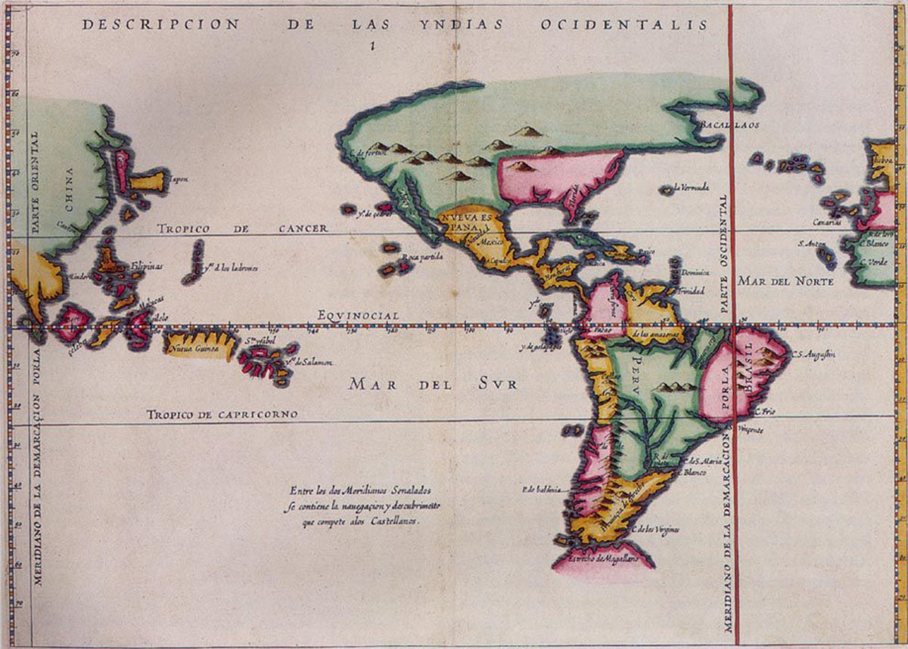
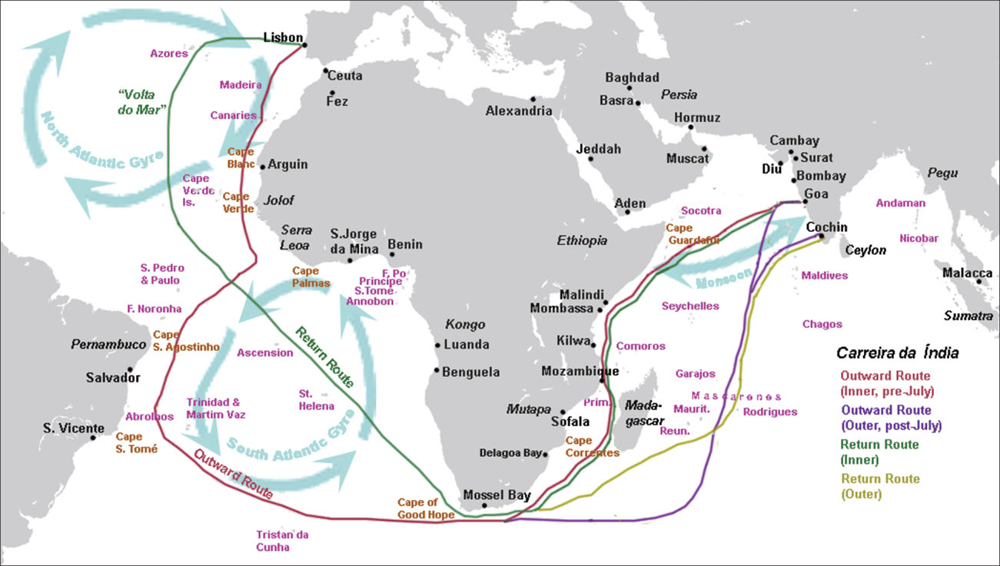

= 4-04 葡萄牙
:toc: left
:toclevels: 3
:sectnums:
:stylesheet: myAdocCss.css

'''

In 1341, the Portuguese sailed to the Canary Islands in the Atlantic. This was only the beginning of their exploration and conquest.

== 占领摩洛哥的休达城 (1415)

In 1415, John I, grandson of Afonso IV, dispatched Portuguese forces to capture the city of Ceuta in Morocco. John hoped that control of a port on the North African coast would open that continent to both conquest and trade. To further cement his control of the region, he requested papal recognition of his efforts.

'''

==  葡萄牙国王得到教皇认可, 夺取穆斯林在非洲的土地 (1418)

In April 1418, Pope Martin V granted the Portuguese king the right to all African lands taken from Muslim rulers.

'''

==  葡萄牙获得教皇认可, 拥有"博哈多尔角"以南非洲的独家贸易权. (1455)

The Portuguese claim to the riches of African trade was affirmed in 1455 in the Romanus Pontifex, a papal decree issued by Pope Nicholas V that granted Portugal exclusive rights to trade in Africa south of Cape Bojador, on the coast of Morocco.

'''

==  Treaty of Alcáçovas 条约 (1479)

Under the terms of the 1479 Treaty of Alcáçovas, Portugal had renounced any claim to the Spanish throne and granted Spain control of the Canary Islands. In exchange, Portugal received the coast of Guinea in Africa, which was rich in gold, and all islands in the Atlantic south of the Canaries. This included not only those territories Portugal already controlled (Madeira, the Azores, and Cape Verde) but also any that might be discovered in the future.

'''

==  the Treaty of Tordesillas 条约 (1494)

Word of Columbus’s discoveries on behalf of the Spanish alarmed and angered the Portuguese. Spain’s claim to the Caribbean islands Columbus had explored  seemed to violate both the treaty and the pope’s decree.

In 1494, following Columbus’s landing in the Caribbean, Spain and Portugal signed the Treaty of Tordesillas, ratifying Pope Alexander VI’s decision that all non-Christian lands west of a line drawn one hundred leagues west of the Cape Verde Islands off the coast of Africa, which Portugal already claimed, were to belong to Spain. Non-Christian lands east of the line were given to Portugal.

Treaty of Tordesillas. This Spanish map from 1622 shows in red the vertical dividing line described in the Treaty of Tordesillas. It cuts north to south through the Atlantic Ocean and across the eastern portion of Brazil. All land to the right of the line was deemed to belong to Portugal, and all land to the left to Spain.

Thus, when the explorer Pedro Álvares Cabral landed on the eastern coast of South America in 1500, he was able to claim it for Portugal.

'''

==  达伽马 → 绕过非洲南端"好望角"，到达印度 (1497出发, 1498到达印度)

In 1498, da Gama sailed north along the east coast of Africa and from there across the Indian Ocean to the southwestern coast of India, where he landed in the port of Calicut (Kozhikode) in what is today the state of Kerala.

The “India Run.” Working for Portugal, Vasco da Gama sailed north along the east coast of Africa and across the Indian Ocean to Calicut, in the southern Indian province of Kerala, establishing what became the typical sea route to India, the carreira da Índia, or “India Run.” Da Gama’s success in reaching India led to future expeditions.

Da Gama had come to India on a quest to find an all-water route to Southeast and East Asia, the source of spices, silks, porcelains, and other Asian goods. Europeans had had access to such luxuries for centuries, but they were expensive. They had to be carried overland, which limited the amounts that could be brought to Europe, and they also passed through the hands of many intermediaries between their point of origin and their European consumers.

Finding an all-water route to the source was intended to eliminate these problems, and the nation that did so stood to become very wealthy.

Before the voyages of the Portuguese, trade with Asia had been monopolized by northern Italian merchants, especially the Venetians, to the envy of merchants in other countries. Da Gama hoped to change this.

Reports of the marvelous wealth of India and the riches amassed by Portuguese merchants encouraged the Europeans of other nations to seek their fortunes in the Indian Ocean.

'''

==  Treaty of Zaragoza 条约 (1529)

Hoping to lay claim to the riches of Asia, Spain then argued that the line dividing the Atlantic continued to the other side of the globe, bisecting the Pacific and giving the Spanish the right to territories in Asia as well. Portugal objected and turned to the Vatican again for help. In 1514, Pope Leo X declared that the line described in the Treaty of Tordesillas allocated territories in the Atlantic but not the Pacific. Spain had no claim to the lands of Asia.

To settle their claims to the islands, in 1529 Portugal and Spain signed the Treaty of Zaragoza, dividing the Pacific Ocean between them. The treaty awarded the Maluku Islands to Portugal with the understanding that should Spain wish to claim them it could, but it would have to compensate Portugal for its loss. Spain did not have the money to do so, and this fact, along with a convenient marriage of the Spanish and Portuguese kings to one another’s sisters, led Spain to abandon its claim to the Malukus.

In the treaties of Zaragoza and Tordesillas, two of the world’s nations divided the globe between them, never questioning their right to do so and turning repeatedly to the pope to give God’s sanction to their claims.

Unsurprisingly, however, the world’s other nations ignored both treaties.

'''

==  到达日本 (1543)

In 1543, Portuguese ships arrived in Japan. It was the logical end point of a route that had taken them around the coast of Africa, eastward through the Indian Ocean, and into the Pacific. They wished to trade. They also wished to win converts for the Roman Catholic Church, as they had done elsewhere in Asia.

'''