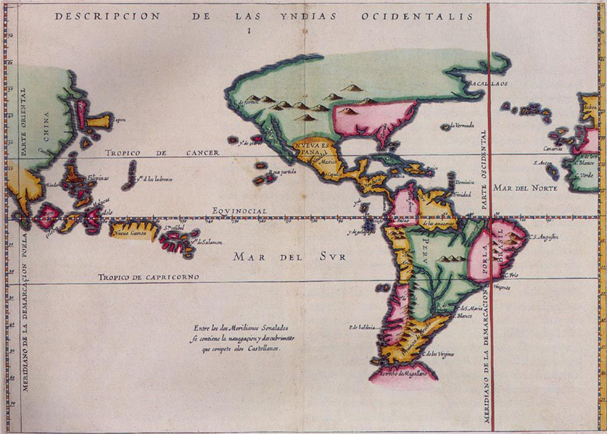
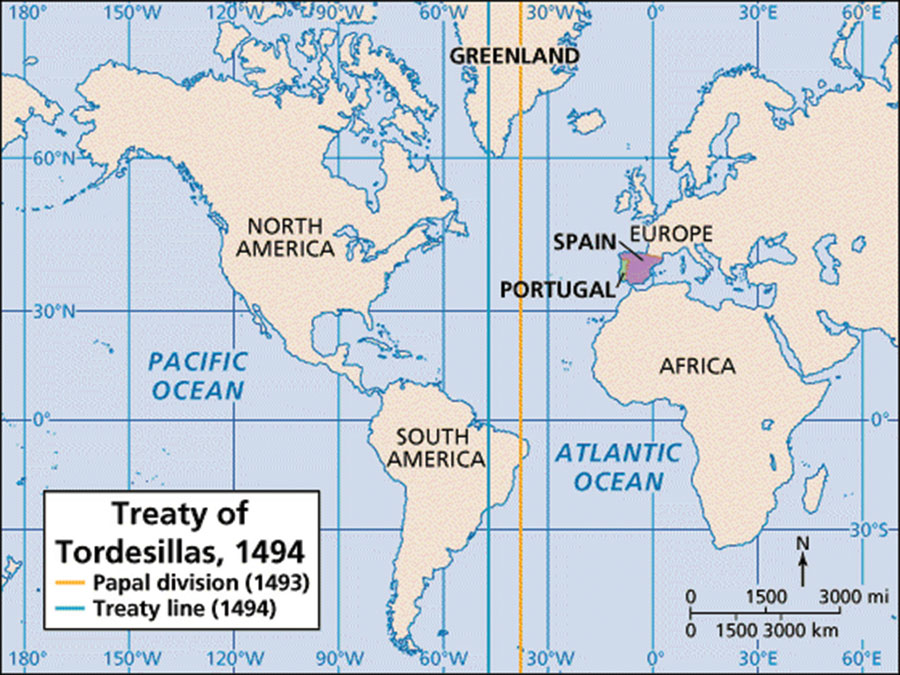
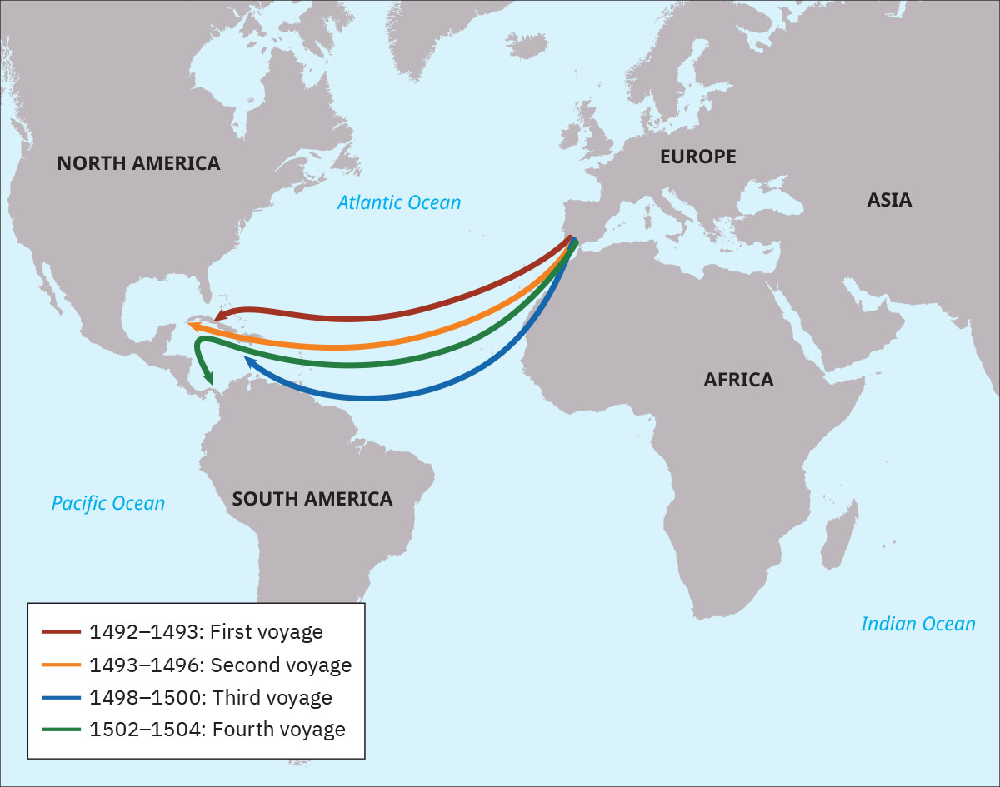
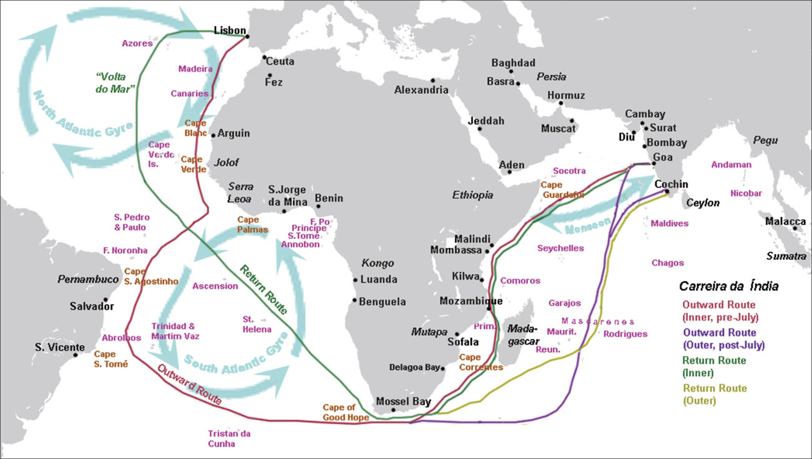

= 探索新航路 (16世纪)
:toc: left
:toclevels: 3
:sectnums:
:stylesheet: myAdocCss.css

'''

== 寻找新航路的原因 -> 跳过穆斯林中介 (去中间商), 直接获得原产地的商品

With the collapse of Constantinople and the fall of the Byzantine Empire to the Ottomans in 1453, many Europeans felt a sense of doom. Not only had they lost a bastion of Christian power, but Muslims now controlled their tenuous overland connections to South and East Asia. As a result, they now had to go through Muslim intermediaries to purchase valuable spices such as cinnamon, pepper, cloves, and nutmeg that grew in only a few key locations. European nations, therefore, wanted to find an all-water passage to India and the chain of sparsely populated Indonesian islands known as the Spice Islands.

随着 1453 年君士坦丁堡的崩溃, 和拜占庭帝国落入奥斯曼帝国手中，许多欧洲人感到了一种末日感。他们不仅失去了基督教权力的堡垒，而且穆斯林现在还控制了"欧洲人与南亚和东亚的脆弱的陆路联系"。结果，他们现在必须通过穆斯林中介, 来购买肉桂、胡椒、丁香和肉豆蔻等珍贵香料，而这些香料只生长在地球上少数几个关键地点。因此，欧洲国家希望找到一条通往"印度", 和"人口稀少的印度尼西亚群岛" （即香料群岛） 的全新水路。

'''

== 能远洋航海的技术, 逐渐具备

[.small]
[options="autowidth" cols="1a,1a"]

|===
|Header 1 |Header 2

|-> 能不管风向如何, 而向任何方向航行
|- In the first millennium CE, Arab sailors in the Middle East had created the lateen sail, a triangular sail that allowed ships to travel against the wind. The square European sail gave ships power, but the lateen sail increased their ability to maneuver. When Europeans combined the two kinds of sail on three-masted ships, they could navigate confidently in any direction.

公元第一个千年，中东的阿拉伯水手发明了三角帆，一种可以让船只逆风航行的三角帆。欧洲方帆给船只提供了动力，而三角帆则增加了船只的机动能力。当欧洲人将这两种风帆结合在三桅船上时，他们可以自信地向任何方向航行。

- The sternpost rudder, created in China in the thirteenth century, also allowed for steering against the currents.

十三世纪在中国发明的尾柱舵, 也可以逆流转向。

|-> 能指引方位
|- For directional guidance, the ancient Greek astrolabe, which used constellations as a guide and enabled mariners to find their north–south position on the earth’s surface, came to Europe after being refined in the Middle East.

为了引导方向，古希腊的星盘在中东经过完善后传入了欧洲，它以星座为向导，使航海者能够确定自己在地球表面的南北位置。

- The magnetic compass also came to Europe in the fifteenth century, making its way from China where it was guiding ships by 1100 CE.

磁罗盘也在 15 世纪从中国传入欧洲，并于公元 1100 年为船只导航。

|===

The adoption of these inventions allowed Europeans to abandon their long-standing practice of navigating by sailing along a coastline. Now they could venture into the open ocean, beyond sight of land.

这些发明的采用, 使欧洲人放弃了长期以来"沿海岸线航行"的做法。现在他们可以冒险进入看不见陆地的"公海"。

'''

== "风险投资"体系的建立

However, technological advancements and a desire for expanded trade and territory could take explorers only so far without financial backing.

The commercial empire that funded European overseas exploration began in the Italian city-states of the Middle Ages, but the investment system on which it was based did not originate there. This system, called commenda, established a sort of financial patronage by which investors funded merchants to expand their trading enterprises and earned a more extensive business network in the process.

Like many of the technologies that drove European ships, the commenda was first developed by Muslim merchants.

然而，如果没有财政支持的话，仅有"技术进步"以及"扩大贸易和领土的愿望", 也只能让探险者走这么远。

资助欧洲海外探险的商业帝国, 始于中世纪的意大利城邦，但其所依赖的投资体系, 却并非起源于那里。这个称为 commenda 的系统, 建立了一种金融赞助，投资者通过这种方式资助商人, 来扩大投资人自己的贸易企业，并在此过程中赢得了更广泛的商业网络。

与许多驱动欧洲船舶的技术一样，commenda 系统 最初是由穆斯林商人开发的。

By the late fifteenth century, Italian city-states were supporting a variety of small family-owned businesses and large companies. Capital was concentrated in land and commerce rather than in industrial pursuits, but credit was widely used. Across Europe, risk-sharing business ventures and joint investment schemes were already commonplace among merchants.

到十五世纪末，意大利城邦开始支持各种小型家族企业和大公司。资本集中在土地和商业上, 而不是工业领域，但信贷被广泛使用。在整个欧洲，风险共担的商业企业, 和联合投资计划, 在商人中已经很常见。

'''

The sixteenth century was a time of exploration and the beginning of global ocean trade. When European nations such as Spain, Portugal, the Netherlands, England, and France were just setting out on voyages of exploration and beginning to forge maritime trade networks, a thriving oceangoing commerce was already being carried on in the Indian Ocean.

十六世纪是探索的时代，也是全球海洋贸易的开端。当西班牙、葡萄牙、荷兰、英国、法国等欧洲国 家刚刚开始远洋探险、开始构建海上贸易网络时，印度洋上的远洋贸易已然蓬勃发展。

[.my1]
.案例
====
"just" 强调了行动处于一个刚刚开始的阶段。 "were setting out" 表示这些国家当时正在逐步开展航海探索和建立贸易网络，强调的是这个动作当时正处于进行中。 +
如果没有特别想强调这个过程或阶段性，改为简单过去时 "just set out on voyages" 也完全合理。
====

'''

== ★ #西班牙和葡萄牙之间的条约#

=== ▶ Treaty of Alcáçovas 条约 (1479)

Under the terms of the 1479 Treaty of Alcáçovas, Portugal had renounced any claim to the Spanish throne and granted Spain control of the Canary Islands. In exchange, Portugal received the coast of Guinea in Africa, which was rich in gold, and all islands in the Atlantic south of the Canaries. This included not only those territories Portugal already controlled (Madeira, the Azores, and Cape Verde) but also any that might be discovered in the future.

In 1481, the pope also issued a decree that granted Portugal territories in the Atlantic.

根据 1479 年《阿尔卡索瓦斯条约》的条款，葡萄牙放弃了对西班牙王位的任何要求，并授予西班牙对加那利群岛的控制权。但作为交换，葡萄牙获得了盛产黄金的非洲几内亚海岸, 以及加那利群岛以南的所有大西洋岛屿。这不仅包括葡萄牙已经控制的领土（马德拉、亚速尔群岛和佛得角），还包括未来可能发现的任何领土。

1481年，教皇还颁布法令，授予葡萄牙在大西洋的领土。

'''

=== ▶ the Treaty of Tordesillas 条约 (1494)

Word of Columbus’s discoveries on behalf of the Spanish alarmed and angered the Portuguese. Spain’s claim to the Caribbean islands Columbus had explored  seemed to violate both the treaty and the pope’s decree.

"哥伦布代表西班牙人进行发现"的消息震, 惊并激怒了葡萄牙人。西班牙对"哥伦布探索的加勒比岛屿"的主权主张, 似乎违反了该条约(即 Alcáçovas 条约)和教皇的法令。

Unable to challenge Portugal’s dominance at sea, Isabella and Ferdinand asked Pope Alexander VI to intercede. The pope, who was Spanish, decreed that all lands belonged to Spain that fell west of a line drawn one hundred leagues west of any of the Azores and Cape Verde Islands.

由于无法挑战葡萄牙的海上统治地位，(西班牙的)伊莎贝拉和费迪南德, 请求教皇亚历山大六世求情。西班牙教皇颁布法令，所有位于"亚速尔群岛"和"佛得角群岛"以西一百里格线以西的土地, 都属于西班牙。

Portugal accordingly began negotiations with Spain, which consented to move the line dividing Spanish from Portuguese possessions farther to the west. The new line cut across the eastern bulge of the South American continent (now part of Brazil) but left the rest of the Americas to Spain. This agreement, the Treaty of Tordesillas, was signed in 1494 and endorsed in 1506 by a decree of Pope Julius II.

Thus, when the explorer Pedro Álvares Cabral landed on the eastern coast of South America in 1500, he was able to claim it for Portugal.

葡萄牙因此开始与西班牙谈判，西班牙同意, 将西班牙与葡萄牙领地的分界线, 移至更西的地方。新线穿过南美大陆的东部隆起部（现在是巴西的一部分），但将美洲的其余部分留给了西班牙。该协议即 《托德西拉斯条约》, 于 1494 年签署，并于 1506 年由教皇尤利乌斯二世颁布法令认可。

因此，当探险家佩德罗·阿尔瓦雷斯·卡布拉尔(Pedro Álvares Cabral) 于 1500 年登陆南美洲东海岸时，他就能够为葡萄牙占领此地。

Treaty of Tordesillas. This Spanish map from 1622 shows in red the vertical dividing line described in the Treaty of Tordesillas. It cuts north to south through the Atlantic Ocean and across the eastern portion of Brazil. All land to the right of the line was deemed to belong to Portugal, and all land to the left to Spain.

托德西拉斯条约。这幅 1622 年的西班牙地图, 以红色显示了《托德西拉斯条约》中规定的垂直分界线。它从北向南穿过大西洋, 并穿过巴西东部。线右侧的所有土地, 均被视为属于葡萄牙; 线左侧的所有土地, 均属于西班牙。

In 1494, following Columbus’s landing in the Caribbean, Spain and Portugal signed the Treaty of Tordesillas, ratifying Pope Alexander VI’s decision that all non-Christian lands west of a line drawn one hundred leagues west of the Cape Verde Islands off the coast of Africa, which Portugal already claimed, were to belong to Spain. Non-Christian lands east of the line were given to Portugal.

1494年，哥伦布登上加勒比海岛屿后，西班牙和葡萄牙签署了《托尔德西里亚斯条约》，确认了教皇亚历山大六世的决定：即在非洲海岸佛得角群岛（Cape Verde Islands）以西100里格, 处划一条线.  该线以西的非基督教土地, 归西班牙所有， 除了葡萄牙已经宣称拥有的佛得角群岛外. 而该线以东的非基督教土地, 则归葡萄牙所有。

The Treaty of Tordesillas. Without reference to the sovereignty of the people who lived there, the Treaty of Tordesillas granted all lands in Africa and Asia to Portugal. Spain received the Americas except the easternmost portion of South America, which eventually became the Portuguese colony of Brazil.

托德西拉斯条约。 《托德西利亚斯条约》在不考虑当地人民主权的情况 下，将非洲和亚洲的所有土地授予葡萄牙。西班牙获得了除南美洲最东部部分之外的美洲，最终成为葡萄牙在巴西的殖民地。

'''

=== ▶ Treaty of Zaragoza 条约 (1529)

By the time Cabral made landfall in Brazil in 1500, Portuguese sailors had already rounded the Cape of Good Hope at the tip of southern Africa and sailed up that continent’s eastern coast and on to India.

Hoping to lay claim to the riches of Asia, Spain then argued that the line dividing the Atlantic continued to the other side of the globe, bisecting the Pacific and giving the Spanish the right to territories in Asia as well. Portugal objected and turned to the Vatican again for help. In 1514, Pope Leo X declared that the line described in the Treaty of Tordesillas allocated territories in the Atlantic but not the Pacific. Spain had no claim to the lands of Asia.

当卡布拉尔于 1500 年在巴西登陆时，葡萄牙水手已经绕过南部非洲一角的"好望角"，沿着该大陆的东海岸, 航行到印度。 +
为了获得亚洲的财富，西班牙随后辩称，大西洋的分界线, 一直延伸到地球的另一边， 将太平洋一分为二，西班牙也有权获得亚洲的领土。葡萄牙表示反对，并再次向梵蒂冈求助。 1514 年，教皇利奥十世宣布《托德西拉斯条约》中描述的分界线, 分配的是"大西洋"而非"太平洋"的领土。西班牙对亚洲土地没有任何主权要求。

Spain renewed its argument in 1522 when an expeditionary fleet that had been captained by Ferdinand Magellan returned to Europe after circumnavigating the globe. Magellan had been in the employ of Spain when he found a means of reaching Asia by sailing around the southern tip of South America. The expedition had reached the Maluku Islands (or the Moluccas, in modern Indonesia), the source of valuable spices, and Spain wished to claim this territory, which Portugal had already explored in 1512.

1522年，当斐迪南·麦哲伦率领的一支远征舰队, 绕地球一周返回欧洲时，西班牙再次提出了自己的论点。当麦哲伦找到绕"南美洲南端"航行, 到达"亚洲"的方法时，他曾受雇于西班牙。探险队已到达"马鲁古群岛"（或现代"印度尼西亚"的"摩鹿加群岛"），这里是珍贵香料的产地，西班牙希望对这片领土拥有主权， 而葡萄牙已于 1512 年对该地区进行了探索。

To settle their claims to the islands, in 1529 Portugal and Spain signed the Treaty of Zaragoza, dividing the Pacific Ocean between them. The treaty awarded the Maluku Islands to Portugal with the understanding that should Spain wish to claim them it could, but it would have to compensate Portugal for its loss. Spain did not have the money to do so, and this fact, along with a convenient marriage of the Spanish and Portuguese kings to one another’s sisters, led Spain to abandon its claim to the Malukus.

为了解决对这些岛屿的主权要求，葡萄牙于 1529 年, 与西班牙签订《萨拉戈萨条约》 ，瓜分了太平洋。该条约将"马鲁古群岛"授予葡萄牙，但有一项谅解，如果西班牙希望声称拥有这些群岛的主权，但必须赔偿葡萄牙的损失。西班牙没有钱这样做，这一事实， 加上西班牙和葡萄牙国王与彼此的姐妹的便利联姻，导致西班牙放弃了对"马鲁古群岛"的主权要求。

In the treaties of Zaragoza and Tordesillas, two of the world’s nations divided the globe between them, never questioning their right to do so and turning repeatedly to the pope to give God’s sanction to their claims.

在萨拉戈萨和托德西拉斯条约中，世界上的两个国家瓜分了地球，从不质疑自己这样做的权利，并一 再请求教皇批准他们的主张。

Unsurprisingly, however, the world’s other nations ignored both treaties.

England and the Netherlands, which had become Protestant nations during the Reformation, felt no need to abide by papal decrees, nor did France, though it remained Roman Catholic. As the French king Francis I explained, “The sun shines for me as it does for others.”

然而，毫不奇怪的是，世界上其他国家都无视这两项条约。 +
在宗教改革期间成为新教国家的英格兰和荷兰, 觉得没有必要遵守教皇的法令. +
法国也没有必要遵守，尽管它仍然是罗马天主教。正如法国国王弗朗西斯一世所解释的那样：“阳光照耀着我，也照耀着他人。”

'''

== 原住民的"万物有灵论"

For many Indigenous peoples, their religious belief systems were animistic, meaning the spiritual world resided not just in humans but also in animals, plants, and even rocks. This belief was very different from monotheism, in which all spiritual power resided in one single divine being.

对于许多原住民来说，许多宗教信仰体系, 都是"万物有灵论"的，这意味着精神世界不仅存在于人类之中，还存在于动物、植物, 甚至岩石中。这种信仰与"一神论"非常不同，"一神论"中所有的精神力量, 都存在于一个神圣的存在中。

Like humans, animals, and plants, the earth possessed sacred power; therefore, it could not be owned. The concept of owning land seemed nonsensical to many Indigenous groups, and their corresponding lack of emphasis on private property was one reason Europeans sometimes found it easy to lay claim to lands inhabited by native peoples.

和人类、动物、植物一样，大地也拥有神圣的力量。因此，它不能被拥有。对于许多原住民群体来说，"拥有土地"的概念似乎毫无意义，而他们相应地缺乏对私有财产的重视，这就是欧洲人有时发现"很容易对原住民居住的土地提出要求"的原因之一。

'''

== 西班牙

=== 寻找通往东方(香料)的新路线 (哥伦布, 1492)

[.small]
[options="autowidth" cols="1a,1a"]
|===
|Header 1 |Header 2

|原因
|After the fall of Constantinople to the Ottoman Empire in 1453, access to the known routes to spices and other Asian goods that Europeans desired lay entirely in Muslim hands. Now there was an even greater incentive to find new routes to the lands of the East.

1453 年君士坦丁堡落入奥斯曼帝国手中后，通往欧洲人想要的香料和其他亚洲商品的已知路线完全掌 握在穆斯林手中。现在，人们更有动力去寻找通往东方土地的新路线。

|执行任务者
|It was for this reason that, in 1492, Christopher Columbus, in the employ of Queen Isabella and King Ferdinand of Spain, ventured out into the Atlantic in search of an oceanic route to India.

正是出于这个 原因，1492年，克里斯托弗·哥伦布在西班牙女王伊莎贝拉和国王斐迪南的雇佣下，冒险进入大西洋， 寻找通往印度的海洋航线。

Columbus proposed that he could reach Asia by sailing westward across the Atlantic Ocean. Eager to find an all-water route to Asia to compete with the Portuguese, Isabella and Ferdinand agreed to his request.

哥伦布提出, 向西横渡大西洋可以到达亚洲。伊莎贝拉和费迪南德渴望找到一条通往亚洲的全水路航线, 与葡萄牙人竞争，因此同意了他的请求。

The Voyages of Columbus. Christopher Columbus made four voyages between 1492 and 1504, all to the Caribbean.

哥伦布的航行。克里斯托弗·哥伦布在 1492 年至 1504 年间, 进行了四次航行，全部到达加勒比海。

This was the beginning of European colonialism in the Americas.

这是欧洲在美洲殖民主义的开始。

|===

'''

=== 寻找通往东方(香料群岛)的航线, 但向西走. (麦哲伦, 1519)

[.small]
[options="autowidth" cols="1a,1a"]
|===
|Header 1 |Header 2

|原因
|Ferdinand Magellan also dreamed of finding a route to the Spice Islands. He planned, however, to discover a westward route by sailing west from Portugal, instead of taking the long route eastward around the tip of Africa and through the Indian Ocean.

费迪南德·麦哲伦(葡萄牙人)也梦想找到一条通往香料群岛的航线。然而，他计划从葡萄牙向西航行，探索一条向西的航线，而不是绕非洲一角、穿过印度洋向东走很长的航线。

|执行任务者
|When the Portuguese king declined to fund the exploratory voyage, Magellan approached the king of Spain, who provided him with the funds and ships he needed. The crew came from many countries, which was common aboard ships at that time.

当葡萄牙国王拒绝资助这次探险航行时，麦哲伦找到了西班牙国王，西班牙国王为他提供了所需的资金和船只。

In 1519, with a fleet of five ships and a crew of two hundred seventy, Magellan departed from Spain. He crossed the Atlantic and sailed around the southern tip of South America.

On March 6, 1521, with their fresh water nearly exhausted after three months spent crossing the Pacific, they sighted Guam, and not long after, they made landfall in the Philippines.

1519 年，麦哲伦率领一支由五艘船和 270 名船员组成的舰队离开西班牙。他横渡大西洋，绕过南美洲南端.  +
1521年3月6日，他们在横渡太平洋三个月后淡水几乎耗尽的情况下，看到了关岛，不久就在菲律宾登陆。
|===

'''

=== 探索美洲所采用的模式 -> encomendero

Spain’s exploration of the new continents continued, led by conquistadors. Some of these explorers were nobles or had military training and had fought against the Muslims in Spain; others were landless and wished to improve their lot in life.

西班牙在征服者的带领下, 继续探索(美洲)新大陆。这些探险家中有些是贵族，有些受过军事训练，曾在西班牙与穆斯林作战；有些则曾受过军事训练。其他人则没有土地，希望改善生活。

One instrument by which the Spanish government compensated conquistadors was the encomienda, a hereditary grant that entitled the holder, called an encomendero, to the labor of a specified number of conquered people, or to a tribute of precious metals or agricultural produce.

西班牙政府用来补偿征服者的一种手段是委托制度（encomienda），这是一种世袭的特权，授予持有人（称为委托领主，encomendero）从指定数量的被征服人民中获取劳动力的权利，或者获得贵金属或农产品的贡赋。

'''

=== 发现 (墨西哥)阿兹特克帝国 (1519)

The great prizes the Spanish hoped to find were soon discovered in Mexico. In 1519, the conquistador Hernán Cortés landed at Potonchan on the Yucatán Peninsula and marched north to the interior of Mexico, where he encountered the powerful Aztec Empire.

西班牙人希望找到的巨大战利品, 很快就在墨西哥被发现了。 1519年，征服者埃尔南·科尔特斯, 在尤卡坦半岛的波通昌登陆，向北进军墨西哥内陆，在那里遇到了强大的"阿兹特克帝国"。

'''

=== 发现 (南美洲) 印加帝国

Cortés’s exploits in Mexico were soon matched by those of another Spanish adventurer, Francisco Pizarro, who conquered the Inca Empire in South America.

科尔特斯在墨西哥(发现"阿兹特克帝国")的功绩, 很快被另一位西班牙冒险家弗朗西斯科·皮萨罗的功绩相媲美，后者征服了南美洲的"印加帝国"。

'''

=== 控制菲律宾 (1571)

In 1571, the Spanish established the city of Manila, which became their capital in the East Indies.

1571年，西班牙人建立了马尼拉市，成为他们在东印度群岛的首都。

'''

== 葡萄牙 -> 寻找通往东南亚和东亚的水路 (香料等)

In the late 1400s, both Portugal and Spain were emerging from centuries of rule by North African Muslim states.

1400 年代末，葡萄牙和西班牙, 都摆脱了北非穆斯林国家几个世纪的统治。

Portugal had become an independent country by the twelfth century. At the beginning of the fifteenth century, it was a small country with poor soil. However, it did have one advantage—a geographical location that lent itself to exploration, specifically down the African coastline and across the Atlantic. Portugal also had plenty of coves and natural harbors suited for shipping, and speedy crosswinds and currents that gave it a shipping superhighway of sorts between northern and southern Europe. Various nearby islands such as the Azores also teemed with untapped fishing potential.

葡萄牙到12世纪已成为独立国家。十五世纪初，它还是一个土地贫瘠的小国。然而，它确实有一个优势——适合远洋探索的地理位置，特别是沿着非洲海岸线和横跨大西洋(的探索)。葡萄牙还拥有大量适合航运的海湾和天然港口，以及快速的侧风和洋流，使其成为北欧和南欧之间的"航运高速公路"。亚速尔群岛等附近的各个岛屿, 也充满了未开发的渔业潜力。

- In 1341, the Portuguese sailed to the Canary Islands in the Atlantic. This was only the beginning of their exploration and conquest.

1341年，葡萄牙人航行到大西洋的"加那利群岛"。这只是他们探索和征服的开始。

'''

=== 控制非洲

- In 1415, John I, grandson of Afonso IV, dispatched Portuguese forces to capture the city of Ceuta in Morocco. John hoped that control of a port on the North African coast would open that continent to both conquest and trade. To further cement his control of the region, he requested papal recognition of his efforts. In April 1418, Pope Martin V granted the Portuguese king the right to all African lands taken from Muslim rulers.

1415年，阿方索四世的孙子约翰一世, 派遣葡萄牙军队攻占摩洛哥的休达城。约翰希望, "控制北非海岸的一个港口"将使非洲大陆向征服和贸易开放。为了进一步巩固他对该地区的控制，他请求教皇承认他的努力。 1418 年 4 月，教皇马丁五世, 授予葡萄牙国王"从穆斯林统治者手中夺取的所有非洲土地"的权利。

-  1455 年，教皇尼古拉斯五世颁布的教皇法令《Romanus Pontifex 》, 确认了葡萄牙对非洲贸易财富的主张，该法令授予葡萄牙在摩洛哥海岸"博哈多尔角"以南的非洲, 进行贸易的专有权。

'''

=== 达伽马 -> 绕过非洲南端"好望角"，到达印度

Portuguese sailor, Vasco da Gama, became the first European to sail all the way to India after rounding the Cape of Good Hope.

葡萄牙水手瓦斯科·达·伽马, 成为第一个"绕过好望角，航行到印度"的欧洲人。

[.small]
[options="autowidth" cols="1a,1a"]
|===
|Header 1 |Header 2

|原因
|Da Gama had come to India on a quest to find an all-water route to Southeast and East Asia, the source of spices, silks, porcelains, and other Asian goods. Europeans had had access to such luxuries for centuries, but they were expensive. They had to be carried overland, which limited the amounts that could be brought to Europe, and they also passed through the hands of many intermediaries between their point of origin and their European consumers. Finding an all-water route to the source was intended to eliminate these problems, and the nation that did so stood to become very wealthy. Before the voyages of the Portuguese, trade with Asia had been monopolized by northern Italian merchants, especially the Venetians, to the envy of merchants in other countries. Da Gama hoped to change this.

达伽马来到印度是为了寻找一条通往东南亚和东亚的全水路 航线，那里是香料、丝绸、瓷器和其他亚洲商品的来源地。几个世纪以来，欧洲人一直能享受到这样 的奢侈品，但它们价格昂贵。它们必须通过陆路运输，这限制了可以带到欧洲的数量，而且它们还在 原产地和欧洲消费者之间经过了许多中间商之手。寻找一条通往水源的全水路的目的是为了消除这些 问题，而这样做的国家将会变得非常富有。在葡萄牙人远航之前，与亚洲的贸易一直被意大利北部商 人，尤其是威尼斯人垄断，令其他国家的商人羡慕不已。达伽马希望改变这一点。

|执行任务者
|In 1498, da Gama sailed north along the east coast of Africa and from there across the Indian Ocean to the southwestern coast of India, where he landed in the port of Calicut (Kozhikode) in what is today the state of Kerala.

1498年，达伽马沿非洲东海岸向北航行，穿过印度洋到达印度西南海岸，在卡利卡特（科泽科德）港 （即今天的喀拉拉邦）登陆 。

The “India Run.” Working for Portugal, Vasco da Gama sailed north along the east coast of Africa and across the Indian Ocean to Calicut, in the southern Indian province of Kerala, establishing what became the typical sea route to India, the carreira da Índia, or “India Run.”

“印度跑”。瓦斯科·达·伽马为葡萄牙工作，沿着非洲东海岸向北航行，穿过印度洋到达印度南部喀拉拉邦的卡利卡特，建立了通往印度的典型海上航线，即“印度航线” ”。

|===

=== 在印度获得了利益

[.small]
[options="autowidth" cols="1a,1a"]
|===
|Header 1 |Header 2

|对在印度洋进行贸易的船只, 收税
|Beginning in 1502, the Portuguese also attempted to increase their revenues by demanding that ships trading in the Indian Ocean carry a cartaz, a document bearing the Christian cross. Ships that did not carry the cartaz had their cargoes seized and were sunk. All non-Portuguese resented Portugal’s attempts to dominate Indian Ocean trade.

从 1502 年开始，葡萄牙人还试图通过要求在印度洋贸易的船只, 携带带有基督教十字架的文件“ cartaz” (相当于通行证), 来增加收入。没有携带卡塔兹的船只的货物,  将被扣押, 并被击沉。所有非葡萄牙人, 都对葡萄牙试图主导印度洋贸易, 表示不满。

|控制印度
|Establishing a pattern that they and other Europeans later replicated throughout India, the Portuguese sought to divide and conquer by entering into alliance with some local rulers to the disadvantage of others, a strategy made easier in later decades by the weakening of the Mughal Empire.

葡萄牙人建立了一种后来在印度各地复制的模式，他们试图通过与一些当地统治者结盟, 而不利于其他统治者, 来分而治之，这种策略在后来的几十年中, 随着莫卧儿帝国的衰弱, 而变得更加容易。

The Portuguese took possession of additional territory in India in subsequent years.

随后几年，葡萄牙人占领了印度的更多领土.
|===

'''

=== 激励了欧洲其他国家到印度洋获取财富

Da Gama’s success in reaching India led to future expeditions.

达伽马成功到达印度，为以后的探险活动奠定了基础。(因为为其他后来探险者, 指明了航路怎么走)

Reports of the marvelous wealth of India and the riches amassed by Portuguese merchants encouraged the Europeans of other nations to seek their fortunes in the Indian Ocean.

印度的惊人财富, 和葡萄牙商人积累的财富的报道, 鼓励其他国家的欧洲人到印度洋寻找财富。

'''

== 英国

=== (英国)东印度公司 -> 拥有"印度洋贸易垄断权"

In 1600, Queen Elizabeth I of England granted a monopoly on trade in the Indian Ocean to the British East India Company (also known as the English East India Company or the East India Company).

The British East India Company was a joint stock company in which numerous merchants pooled their money to fund trading voyages and share the profits. An expedition to India required an enormous outlay of money that few individuals could afford, and if they could, they might lose their entire fortunes if the expedition were unsuccessful. By pooling funds, none had to risk all they owned.

1600年， 英国女王伊丽莎白一世将印度洋贸易垄断权授予英国东印度公司（又称英国东印度公司或东印度公 司）。   +
英国东印度公司是一家股份公司，众多商人汇集资金为贸易航行提供资金并分享利润。远征印 度需要巨额开支，很少有人能负担得起，即使有能力，如果远征不成功，他们也可能会倾家荡产。通 过汇集资金，任何人都不必拿自己拥有的一切去冒险。

The political entity of Britain was formed after the union of England and Scotland following the death of Elizabeth I. The kingdom of Great Britain was officially formed in 1707. It is a bit anachronistic to refer to the British East India Company before the nation of Great Britain existed, but that is the name by which the company is most commonly known.

英国的政治实体, 是在伊丽莎白一世去世后, 英格兰和苏格兰联合后形成的。大不列颠王国于 1707 年正式成 立。在真正英国诞生前, 提及"英国东印度公司"其实有点不合时宜。但这的确是该公司最广为人知的名字。

'''

=== 控制印度

With both the Mughals and the Marathas weakened after years of combat with one another as well as with invading Afghans and encroaching Europeans, small states in northern India broke away from their control and recognized British authority in exchange for acknowledgment of their claims to rule. The chaos that ensued helped the British in their quest to gain control of India. In this way, through a combination of alliances and military victories and the use they made of existing divisions between its kingdoms and rulers, the British gradually gained control of India.

随着莫卧儿王朝和马拉塔人在多年的相互争斗, 以及入侵的阿富汗人, 和入侵的欧洲人对印度的削弱，印度北部的小国脱离了他们(莫卧儿王朝)的控制，承认了英国的权威，以换取对他们统治的承认。随之而来的混乱, 帮助英国人寻求对印度的控制。就这样，通过联盟和军事胜利的结合，以及他们利用其王国和统治者之间的现有分歧，英国逐渐获得了对印度的控制。

'''

== 法国

Dutch and French merchants also formed joint stock East India companies. While the Dutch focused most of their attention on the islands of Indonesia, France competed with England and Portugal to harvest the wealth of India.

荷兰和法国商人还组建了股份制东印度公司。当荷兰人将大部分注意力集中在印度尼西亚群岛时，法国则与英国和葡萄牙争夺印度的财富。

=== 英法竞争 (七年战争)

In their attempt to resist English expansion, the Mughals turned to the French for assistance. Already rivals in trade, beginning in 1754 France and Britain found themselves enmeshed in a war in North America for control of that continent. This conflict, called the French and Indian War, soon spread to Europe where fighting broke out in 1756. As part of this now-global conflict, called the Seven Years’ War, French and British armies and navies engaged in battle in India as well. France allied itself with the Mughal Empire.

为了抵抗英国的扩张，莫卧儿王朝转向法国寻求援助。从1754年开始，已经是贸易对手的法国和英国卷入了一场争夺北美大陆控制权的战争。这场被称为“法印战争”的冲突, 很快蔓延到欧洲，并于1756年爆发了战争。作为这场被称为“七年战争”的全球性冲突的一部分，法国和英国的陆军和海军也在印度参战。法国与莫卧儿帝国结盟。

'''

