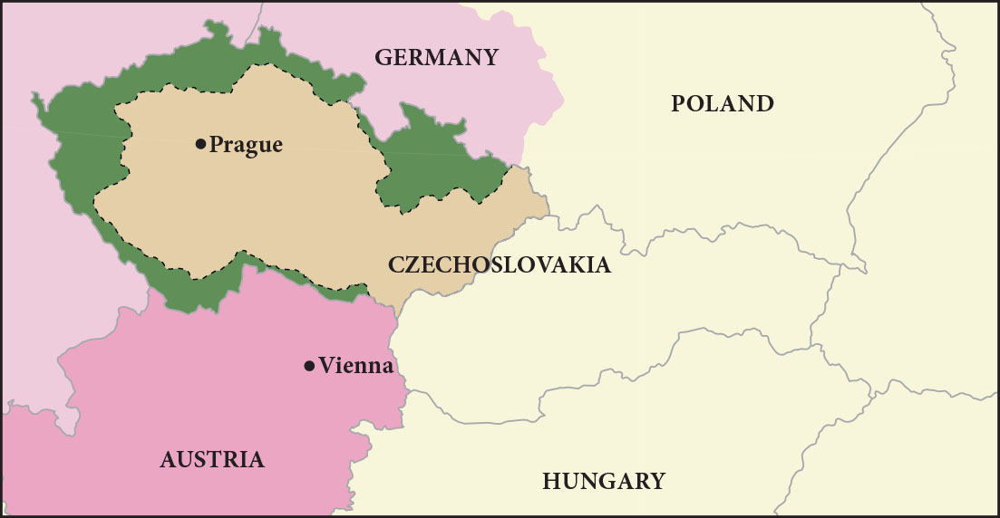
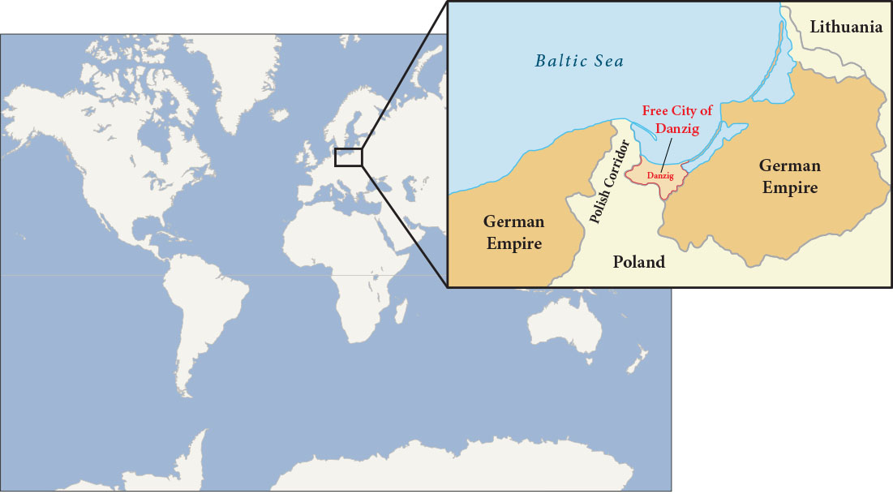

John Maynard Keynes, the creator of Keynesian economics, was a British economist at the Paris Peace Conference in 1919. He was so unsettled by the potential financial repercussions of the treaty’s terms that he wrote a book contending the large reparations would mean economic ruin for Germany, endangering the entire European economy. His predictions were soon borne out.

凯恩斯主义经济学的创始人约翰·梅纳德·凯恩斯 (John Maynard Keynes)是 1919 年巴黎和会的英国经 济学家。他对该条约条款可能造成的经济影响感到非常不安，因此写了一本书，认为巨额赔款将意味 着德国的经济毁灭，危及整个欧洲经济。他的预言很快就得到了证实。

Germany faced numerous problems as the 1920s began. It was not only blamed for the war, but its foreign financial assets had also been seized under the treaty, further compromising its economic power, and it had been physically diminished when many rich industrial areas were cut away from its territory. Thus, one of the immediate problems facing the new democratic Weimar Republic government was finding a way to pay the reparations.

20 年代伊始，德国面临着众多问题。它不仅被指责为战争的罪魁祸首，而且它的外国金融资产也根据 该条约被没收，进一步损害了它的经济实力，而且当许多富裕的工业区从其领土上被切断时，它的经 济实力也被削弱了。因此，新民主主义魏玛共和国政府面临的首要问题之一就是如何支付赔款。

The first payment came due in 1921, but Germany was unable to fund the full amount, and the unresolved issue about how to enforce the treaty terms resurfaced. The next year, 1922, Germany defaulted on its payments to France and Britain. In response, French and Belgian troops occupied the Ruhr Valley, the center of German iron, coal, and steel production, as a means to force repayment.

第一次付款于 1921 年到期，但德国无法全额提供资金，关于如何执行条约条款的悬而未决的问题再次 浮出水面。第二年，即 1922 年，德国拖欠了对法国和英国的付款。作为回应，法国和比利时军队占领 了德国钢铁、煤炭和钢铁生产中心鲁尔河谷，作为强制偿还的手段。

To reach an immediate solution, Germany began simply printing more money. But this created an inflationary cycle, and the economy soon proved incapable of keeping up with the hyperinflation that resulted. Holding a job seemed ludicrous when pay could not keep up with a rate of inflation that increased by the day. The entire German middle class saw their savings disappear, and with their money went their support of the government.

为了立即解决问题，德国开始印更多的钱。但这造成了通货膨胀周期，很快事实证明经济无法跟上由 此产生的恶性通货膨胀。当工资跟不上日益增长的通货膨胀率时，继续工作 似乎是可笑的。整个德国中产阶级的储蓄都消失了，他们对政府的支持也随之消失。

In 1924, the United States intervened by arranging the Dawes Plan, by which Germany’s installment payments were lowered but set to increase in the future as its economy rebounded. Foreign banks, many in the United States, also loaned Germany money to stabilize its inflationary economy. This enabled Germany to make its payments, but it also meant taking on more debt. In essence, U.S. banks were loaning money to Germany that it was using to pay Britain and France, which in turn used that money to pay back their own debts to the United States.

1924年，美国进行干预，制定了道斯计划，降低了德国的分期付款额，但随着经济反弹，未来分期付 款额将增加。外国银行（其中许多位于美国）也向德国提供贷款，以稳定其通货膨胀的经济。这使得 德国能够支付债务，但也意味着承担更多债务。从本质上讲，美国银行向德国借钱，德国用这些钱来 支付英国和法国的费用，而英国和法国又用这笔钱偿还自己欠美国的债务。(也就是说, 英法让德国去借入钱, 来还给英法. 就相当于德国要还两份钱, 分别给英法和美国. 给英法的那份也是从美国借入的, 就相当于德国要还给美国两份钱. )

Reparations continued to present an extreme economic hardship for Germany. In 1929, the United States announced a new proposal. The Young Plan stretched German reparations across a fiftynine– year payment schedule, slightly lowered the total to $29 billion, and arranged hundreds of millions of dollars’ worth of additional loans. Germany continued to make payments until 1932, when the worldwide Great Depression made it untenable to continue. Later agreements canceled more of the remaining debt, and the last payment was finally made in 2010. In all, Germany paid only about one-eighth of the total.

赔款继续给德国带来极度的经济困难。1929年，美国宣布了一项新提案。杨计划将德国的赔款延长到 了五十九年的付款期限，将总额略微降低至 290 亿美元，并安排了价值数亿美元的额外贷款。德国继 续付款直到 1932 年，当时全球范围内的大萧条使其无法继续下去。后来的协议取消了更多的剩余债 务，最后一次付款终于在2010年支付。总共，德国只支付了总额的八分之一左右。

Poor decisions by Germany’s Weimar Republic contributed to growing public frustration with the new democratic government. Many political groups attempted to use the country’s economic problems to catapult themselves to political power. Among these was the National Socialists or Nazi Party, whose members favored a more authoritarian government. One man who joined the group in the early 1920s was Adolf Hitler.

德国魏玛共和国的糟糕决定导致公众对新民主政府越来越不满。许多政治团体试图利用该国的经济问 题来夺取政治权力。其中包括国家社会主义者或纳粹党，其成员赞成更专制的政府。阿道夫·希特勒是 20 年代初加入该组织的人之一.

In 1923, he decided to launch a takeover of the state government in Munich. The planned Beer Hall Putsch (so named because the targeted politicians were to be kidnapped at a beer hall) failed, and Hitler and many supporters were arrested. Over the next year in jail, Hitler wrote the book Mein Kampf (“My Struggle”), in which he outlined his plan for the Nazis to achieve political power and their goals for the resurgence of Germany. These goals included the uniting of German-speaking peoples under one government and an expansion eastward in search of Lebensraum or “living space.”

1923 年，他决定接管慕尼黑州政府。计划中的啤酒馆政变（之所以如此命名，是因为目标政客将在啤酒馆 被绑架）失败，希特勒和许多支持者被捕。在狱中的第二年，希特勒写下了《我的奋斗》一书，在书 中他概述了纳粹获得政治权力的计划以及他们复兴德国的目标。这些目标包括将德语民族团结在一个 政府的领导下，以及向东扩张以寻找“生存空间”。

Still reeling from World War I in the 1920s, the governments of the major powers generally supported disarmament and limited military buildup. Many agreements reached in the 1920s reflected this commitment to goodwill among nations. In 1921, the Washington Naval Conference opened to address the issue of the naval arms race that had taken place before and during World War I. U.S. secretary of state Charles Evans Hughes proposed that the three major naval powers—Britain, the United States, and Japan—each scuttle a number of ships and restrict future construction. The Five-Power Treaty that emerged limited the construction of warships and the size of aircraft carriers. It established ratios for warships whereby Britain and the United States could have the same number, and for every five ships they had, Japan could have three and France and Italy 1.75 each. Britain and the United States were allowed more ships because they maintained fleets in both the Atlantic and the Pacific to protect their colonies.

20 年代，主要大国政府仍饱受第一次世界大战的影响，普遍支持裁军和有限的军事建设。1920 年代达成的许多协议都反映了国家间对善意的承诺。 1921年，华盛顿 海军会议开幕，旨在解决二战前和二战期间发生的海军军备竞赛问题，美国国务卿查尔斯·埃文斯·休斯 提出，三大海军强国——英国、美国和日本——每一次都击沉了一些船只并限制了未来的建造。随之 而来的五国条约限制了战舰的建造和航空母舰的规模。它 规定了英国和美国可以拥有相同数量的军舰的比例，每拥有5艘军舰，日本可以拥有3艘，法国和意大 利各拥有1.75艘。英国和美国被允许拥有更多船只，因为它们在大西洋和太平洋都拥有舰队来保护它们 的殖民地。

Japan often argued that it was not treated fairly by Western powers at either the Treaty of Versailles negotiations or the Washington Naval Conference in the 1920s.

日本经常辩称，无论是在《凡尔赛条约》谈判还是在 1920 年代的华盛顿海军会议上，它都没 有受到西方列强的公平对待。

By the late 1920s, optimism was high that the pain of war might be a thing of the past. It was in this spirit that the Kellogg-Briand Pact was written. The pact was a negotiation between U.S. secretary of state Frank Kellogg and Aristide Briand, the French foreign minister, renouncing war as an instrument of national policy. Fifteen nations signed it in 1928, and another forty-seven followed over the next years. However, there was no way to enforce it, and no repercussions for signatories that failed to live up to its ideals. Thus, it did little to curb the aggressive military policies of many nations during the following decade.

到 20 年代末，人们普遍乐观地认为战争的痛苦可能会成为过去(日本和苏联肯定不会这么想, 苏联还想赤化世界呢)。正是本着这种精神，制定了《凯洛 格-布里安条约》 。该协议是美国国务卿弗兰克·凯洛格和法国外交部长阿里斯蒂德·白里安之间的谈 判，放弃将战争作为国家政策的工具。 1928 年，有 15 个国家签署了该协议，接下来的几年里又有 47 个国家签署了该协议。然而，没有办法执行它，也没有对未能实现其理想的签署者产生任何影响。因 此，它在接下来的十年里几乎没有遏制许多国家的侵略性军事政策。

The same could be said of the League of Nations. Based on high ideals, the League could issue statements, restrictions, or condemnations, but it could not compel other countries to limit their activities. Assessing trade restrictions on a country might have some (minor) impact, but the League had no military arm that could physically intervene in a member country’s actions. Thus, as the 1930s began, it was regularly challenged by aggressive acts across the globe that it was powerless to influence. Japan invaded Manchuria in 1931. Italy invaded Libya in 1931 and Ethiopia in 1935. The League did protest, especially over the Ethiopian invasion, but it could do little more than impose economic sanctions against Italy, and even these were not upheld by all countries. It was clear the League had no real power and no country need fear it.

国际联盟也是如此。基于崇高理想，联盟可以发表声明、限制或谴责，但不能强迫其他国家限制其活 动。评估对一个国家的贸易限制可能会产生一些（较小的）影响，但联盟没有可以实际干预成员国行 动的军事力量。因此，随着 20 世纪 30 年代的开始，它经常受到全球范围内侵略行为的挑战，而它却 无力影响。日本于 1931 年入侵满洲里。意大利于 1931 年入侵利比亚，于 1935 年入侵埃塞俄比亚。 国际联盟确实提出了抗议，特别是针对埃塞俄比亚的入侵，但它除了对意大利实施经济制裁之外无能 为力，而且即使这些制裁也没有得到所有国家的支持。很明显，联盟没有实权，没有国家需要害怕 它。

Russia underwent massive political upheaval during the Bolshevik takeover in 1917. A bloody civil war was fought for the next three years before the Bolsheviks and their leader Vladimir Lenin were victorious. Russia was then reorganized as the Soviet Union in the early 1920s. Lenin’s early death created an opening exploited by Joseph Stalin.

1917 年布尔什维克掌权期间，俄罗斯经历了大规模的政治动荡。在接下来的三年里，布尔什维克及其 领导人弗拉基米尔·列宁取得了胜利，爆发了一场血腥的内战。俄罗斯随后于 1920 年代初改组为苏 联。列宁的早逝为独裁者约瑟夫·斯大林创造了一个机会

After the Bolshevik seizure of the government and Russia’s hasty departure from World War I, Lenin moved to consolidate power in Russia. Civil war raged from 1918 to 1921 between the Red Army of the Bolsheviks and the White Army representing all the groups that opposed them, including the Russian upper classes, forces loyal to the monarchy, and Lenin’s enemies within the Russian Social Democrats, such as the Menshevik faction. Members of the White Army disagreed on whether they sought an anti-Bolshevik communist government or the return of a tsarist government. The Red Army, though smaller, had a focused goal and was better organized.

在布尔什维克夺取政府和俄罗斯仓促退出第一次世界大战后，列宁开始巩固俄罗斯的权力。 1918年至 1921年，布尔什维克的红军和代表所有反对他们的群体的白军之间爆发了内战，其中包括俄罗斯上层 阶级、忠于君主制的势力以及列宁在俄罗斯社会民主党内部的敌人，例如孟什维克派。白军成员对于 是否寻求反布尔什维克的共产主义政府或沙皇政府的回归存在分歧。红军虽然规模较小，但目标明 确，组织较好。

British, French, Japanese, and U.S. troops all invaded Russia in support of the White Army and stayed until 1920, but they were unable to stop the Bolsheviks from seizing control. The civil war ended in 1921 with the Bolsheviks in control. Approximately 1.5 million soldiers had died in the fighting, but the civilian death toll was substantially higher—about eight million.

英国、法国、日本和美国军队纷纷入侵俄罗斯支持白军，并一直呆到1920年，但无法阻止布尔什维克 夺取政权。 1921 年，内战结束，布尔什维克掌权。大约有 150 万士兵在战斗中死亡，但平民死亡人数 要高得多，大约有 800 万。

During the civil war, Lenin and the Bolshevik leadership also sought to take over lands outside Russia that had been controlled by the now-deposed tsar. Lenin approached these regions with the goal of creating a federal state of republics governed by a soviet, an elected committee of workers’ representatives. Each republic in this new “Soviet Union” would represent an ethnicity and be nominally independent but ultimately under the central government’s control. Many of these areas fiercely resisted incorporation by the Bolsheviks.

内战期间，列宁和布尔什维克领导层还试图接管俄罗斯境外曾由现已废黜的沙皇控制的土地。列宁接 触这些地区的目标是建立一个由苏维埃（一个选举产生的工人代表委员会）统治的联邦共和国。这个 新“苏联”中的每个共和国都代表一个民族，名义上独立，但最终受中央政府控制。其中许多地区强烈抵 制布尔什维克的合并。

1919年，红军入侵乌克兰，遭到强大抵抗. 乌克兰和白俄罗斯都拥有一定的自治权，但必须依靠列宁政府 来指导外交政策。其他地区，如高加索地区，争议更大。1922年，苏维埃社会主义共和国联盟（苏联）成立。

In 1919, the Red Army invaded Ukraine and faced strong resistance. Both Ukraine and Belarus had some autonomy but had to rely on Lenin’s government to direct foreign policy. Other areas, like the Caucasus, proved more contentious. In 1922, the Union of Soviet Socialist Republics (USSR) was established.

Lenin’s death in 1924 opened a power vacuum and a debate over the future of policy in the Soviet Union. There were two very different paths the country could follow. Favoring one path were leaders such as Leon Trotsky, the man responsible for making the Red Army a dependable fighting force during the civil war. Stalin, then in his forties, strove to keep out of these specific debates. He and Trotsky held opposing views on communist ideology and the future of the Soviet Union.

1924 年列宁去世引发了权力真空和关于苏联政策未来的争论。该国可以走两条截然不同的道路。支持 一条道路的是托洛茨基等领导人，他在内战期间使红军成为一支可靠的战斗力量. 。当时四十多岁的斯大林竭力回避这些具体的争论。他和托洛茨基对共产主 义意识形态和苏联的未来持有相反的看法.

In 1927, Stalin expelled Trotsky from the Communist Party. In 1929, Trotsky was forced into exile. He was assassinated by a Soviet agent in Mexico in 1940.

1927年，斯大林将托洛茨基开除出共产党。 1929年，托洛茨基被迫流亡。 1940 年，他在墨西哥被一 名苏联特工暗杀。

Stalin speeded the drive to collectivization, and local officials did what they could to comply with the new targets for grain collection. By 1939, more than 90 percent of the peasants had been forced to live and work on collective farms. If they resisted, they could be arrested, and many were sent to labor camps in Siberia. While some poor peasants complied with collectivization because they had little of their own property to lose, middle-class peasants continued to oppose it, even killing their livestock rather than turning flocks over to the Soviet government. More than half the nation’s livestock was lost under collectivization in the 1930s, and the numbers did not recover until the 1950s. In some areas, spring planting did not occur due to the upheaval.

斯大林加快了集体化进程，地方官员也竭尽全力完成新的粮食征收目标。到1939年，90%以上的农民 被迫在集体农场生活和工作。如果他们反抗，他们可能会被逮捕，许多人被送往西伯利亚的劳改营。 虽然一些贫苦农民因为自己的财产几乎没有什么可损失而同意集体化，但中产阶级农民仍然反对集体 化，甚至杀死他们的牲畜，而不是把羊群交给苏维埃政府。 20世纪30年代集体化导致全国一半以上的 牲畜损失，直到1950年代这一数字才恢复。在一些地区，由于动乱，春季播种没有进行。

The failures of collectivization spelled deaths for millions in the Soviet Union. Approximately two million died resisting or in prison, and between five and ten million additional lives were lost in a famine caused by the chaos of the process, the peasants’ choice to slaughter their livestock, and government policies that took food from the peasants.

集体化的失败导致苏联数百万人死亡。大约有 200 万人死于抵抗或在监狱中，另外 5 至 1000 万人死 于饥荒，原因是过程的混乱、农民选择宰杀牲畜以及政府从农民手中夺走食物的政策。

The problems surrounding collectivization also led many within the Communist Party to question the wisdom of Stalin’s decisions. In 1934, the assassination of Sergei Kirov, a high-ranking Soviet politician, led to an investigation that uncovered what Stalin believed was a plot to kill him. Kirov’s death, together with the unrest caused by collectivization, the anti-Soviet rhetoric of Germany’s Nazi Party (which had taken control of Germany in 1933), and his knowledge that many Soviet politicians did not share his vision of the USSR’s future, fed Stalin’s growing feelings of paranoia. His belief that he was surrounded by enemies led to a reign of terror in which the Soviet secret police arrested millions of Soviet citizens on suspicion of disloyalty. Many were sent to prison camps in Siberia where they perished as a result of starvation and overwork. Some were executed immediately following brief trials. Some did not even receive trials. Historians disagree about how many Soviets died as a result of the political purges of the 1930s, but one million is a likely figure.

围绕集体化的问题也导致共产党内部许多人质疑斯大林决策的明智性。 1934 年，苏联高级政治家谢尔 盖·基洛夫 (Sergei Kirov)遇刺，引发了一项调查，揭露了斯大林认为的刺杀他的阴谋。基洛夫之死，加 上集体化引起的骚乱、德国纳粹党（1933年控制了德国）的反苏言论，以及他知道许多苏联政客并不 认同他对苏联未来的看法，助长了斯大林日益增长的偏执情绪。他相信自己被敌人包围，导致了恐怖 统治，苏联秘密警察以涉嫌不忠为由逮捕了数百万苏联公民。许多人被送往西伯利亚的战俘营，在那 里因饥饿和过度劳累而死亡。有些人在短暂审判后立即被处决。有些甚至没有接受审判。历史学家对于 1930 年代的政治清洗造成多少苏联人死亡的说法不一，但可能 有 100 万人死亡。。

Lenin had always seen it as dangerous and a competitor to socialism, so from the early days of the Soviet Union, religion was targeted by Communist leaders. Yet the history of Orthodox Christianity among the Russian people was long.

列宁一直认为宗教是危险的，是社会主义的竞争对手，因此从 苏联成立初期起，宗教就成为共产党领导人的攻击目标。然而，东正教在俄罗斯人民中的历史悠久

The decade of the 1930s was marked by economic collapse around the world. The Great Depression gripped numerous countries, causing widespread unemployment, immense poverty, and financial collapse. There were no easy solutions for any government trying to combat the misery, and different countries adopted different methods to alleviate the suffering of their people. The inability of capitalist countries to fully solve their economic problems made ideologies such as communism more attractive. Only the economic stimulation of the onset of World War II brought the world closer to a return of prosperity.

20 世纪 30 年代的十年以世界各地的经济崩溃为标志。大萧条席卷了许多国家，造成了广泛的失业、 巨大的贫困和金融崩溃。对于任何试图消除苦难的政府来说，都没有简单的解决办法，不同的国家采 取了不同的方法来减轻人民的苦难。资本主义国家无法完全解决其经济问题，使得共产主义等意识形 态更具吸引力。大萧条是由一场完美的问题风暴引发的，只有第二次世界大战开始的经济刺激才使世 界更接近繁荣的回归。

When the economic collapse that came to be known as the Great Depression began in the United States in 1929, it ended the postwar boom and sent the entire world’s economy reeling. No economic depression is caused by one element alone.

1929 年，美国开始经济崩溃，即后来的大萧条，它结束了战后的繁荣，并使整个世界经济陷入困境。 任何经济萧条都不是由某一因素单独造成的。

The lack of banking regulations meant that if a bank went bankrupt, those who had placed their money on deposit there lost all their savings.

。缺乏银行 监管意味着，如果银行破产，那些存入银行的人就会失去所有积蓄。

With consumers both at home and abroad unable to purchase, the twin problems of overproduction and underconsumption ground the economy to a halt. Contributing to this financial catastrophe was the unequal distribution of wealth. When the Depression began, the majority of American families (80 percent) had no savings at all, so a job loss quickly led to homelessness and hunger.

，由于国内外消费者无力购买，生产过剩 和消费不足的双重问题使经济陷入停滞。造成这场金融灾难的是财富分配不均。大萧条开始时，大多 数美国家庭（80%）根本没有积蓄，因此失业很快导致无家可归和饥饿. (裸泳者，没有储蓄后援，这种人只能活在非失业期，一遇失业即完蛋)

The Smoot-Hawley Tariff Act of 1930 was an example of the isolationist and protectionist policies the U.S. government followed in the 1920s. An increased tariff of nearly 40 percent had already been enacted in 1922. Smoot-Hawley raised tariff rates another 20 percent on more than twenty thousand kinds of imported goods, supposedly to protect American farmers and industries from foreign competition. These extreme rates caused other countries to institute their own retaliatory high tariff rates on U.S. goods. Its businesses were unable to recoup any of their monies by selling goods overseas. Smoot-Hawley was the highest tariff the U.S. government has ever enacted. It helped stifle world trade, which decreased 30 percent by the early 1930s.

1930 年的《斯穆特-霍利关税法案》是美国政府在 20 年代奉行的孤立主义和保护主义政策的一个例 子。 1922 年已经实施了近 40% 的关税上调。斯穆特-霍利法案将 2000 多种进口商品的关税税率又提 高了 20%，据称是为了保护美国农民和工业免受外国竞争。这些极端税率导致其他国家对美国商品征 收报复性高关税。其企业也无法通过向海外出售商品来收回任何资金。斯穆特-霍利关税是美国政府有史以来颁布的最 高关税。它抑制了世界贸易，到 20 世纪 30 年代初，世界贸易下降了 30%。

One of the key aspects of the Great Depression was the way it encumbered foreign trade around the globe. Worldwide gross domestic product (GDP)—the value of all the goods and services a country produces in one year—decreased by 15 percent between 1929 and 1932. With trade plummeting, many U.S. banks began recalling loans made to foreign businesses and countries, which caused crises in other places.

大萧条的关键方面之一是它阻碍了全球对外贸易。 1929 年至 1932 年间，全球国内生产总值 (GDP) ——一个国家一年内生产的所有商品和服务的价值——下降了 15%。随着贸易大幅下滑，许多美国银 行开始召回向外国企业和国家提供的贷款，这使得导致其他地方出现危机。

Hunger was a significant problem, particularly in urban areas where there was little chance of having a garden or finding other available foodstuffs. Homeless camps and shantytowns sprang up, but life in such a place was precarious because city officials might force the residents to leave.

饥饿是一个严重的问题，特别是在 城市地区，那里几乎没有机会拥有花园或找到其他可用的食物。无家可归者营地和棚户区如雨后春笋般涌现，但这些地方的生 活并不稳定，因为城市官员可能会强迫居民离开

Japan moved into Manchuria in 1931, setting up the state of Manchukuo there the following year. Seizing the region meant Japan would not have to pay for the items it wanted, such as rice, important during a depression that had limited its exports and thus its income from trade.

1931 年，日本迁入满洲，次年在那里建立满洲国。占领该地区意味着日本将不必支付其想要的物品的费 用，例如大米，这在经济萧条期间很重要，因为萧条限制了其出口，从而限制了其贸易收入。

Most countries went off the gold standard—a monetary system in which the value of a currency is tied directly to the value of gold—in the early 1930s, but there was no widespread banking collapse as there was in the United States.

大多数 国家在 20 世纪 30 年代初放弃了金本位制（一种货币价值与黄金价值直接挂钩的货币体系），但没有 像美国那样出现大范围的银行业崩溃。

It was only in the late 1930s that the French economy turned around, due to an increase in military equipment production.

直到20世纪30年代末，由于军事装 备生产的增加，法国经济才出现好转。

In the United States, new president Franklin D. Roosevelt unveiled a comprehensive reform plan in 1933. This New Deal was designed to restore faith in the banking system, create work-relief programs to put the unemployed to work, increase the bargaining and consumer power of industrial workers, and provide an overall enhanced quality of life. Overhauls to the banking system included more regulations on U.S. banks and regular audit controls. The creation of the Federal Deposit Insurance Corporation (FDIC) in 1933 meant that depositors could feel their money on deposit was safe. The United States also adopted programs that already existed elsewhere. For example, the Social Security Administration was created in 1935 to provide an old-age pension program for the country. Germany had such a program for several decades, and Britain had already enacted many programs as part of its welfare state that the United States was slow to adopt.

在美国，新任总统富兰克林·罗斯福于 1933 年公布了一项全面的改革计划。这项新政旨在恢复人们对 银行体系的信心，制定工作救济计划以帮助失业者就业，增强议价能力和消费能力产业工人，并提供 全面提高的生活质量。银行体系的改革包括对美国银行的更多监管和定期审计控制。 1933 年联邦存款 保险公司 (FDIC)的成立意味着储户可以感觉到他们的存款是安全的。美国还采用了其他地方已经存在 的计划。例如，社会保障管理局成立于 1935 年，旨在为国家提供养老金计划。德国实行这样的计划已 经有几十年了，英国也已经制定了许多计划作为其福利国家的一部分，而美国却迟迟没有采用。

The New Deal in a New Century

新世纪的新政

Numerous programs enacted during the New Deal era still assist people in the United States today. Here are some examples:

新政时期制定的许多计划仍然为今天的美国人民提供帮助。以下是一些示例：

The Federal Deposit Insurance Corporation (FDIC) was created in 1933 to insure depositor monies in banks. Originally it covered $5,000 per depositor, but it now covers $250,000 per depositor.

联邦存款保险公司 (FDIC) 成立于 1933 年，旨在为银行存款提供保险。最初它为每位储 户提供 5,000 美元的保障，但现在为每位储户提供 250,000 美元的保障。

The Social Security program was begun in 1935 to oversee Old-Age and Survivors Insurance (OASI), unemployment insurance, and aid to families.

社会保障计划始于 1935 年，旨在监督老年和遗属保险 (OASI)、失业保险和家庭援助。

The federal minimum wage was established in 1938 as an increase over the minimum wages in many industries, though some workers, such as domestic workers, were left out.

联邦最低工资于 1938 年制定，提高了许多行业的最低工资，但一些工人（例如家政工 人）被排除在外。

Some of these programs are the subject of intense debate today. Projections show that Social Security may not be able to meet all its obligations in coming decades, which could lead to curtailing of benefits. The minimum wage originally reflected increased buying power for workers, rather than setting the bottom threshold of pay as it does now. Many states have mandated minimum wages above the federal government’s requirement. Some argue that a higher minimum wage today will only increase the prices of products and services. Others contend that the increased buying power of workers with a higher minimum wage will stimulate the economy for all.

其中一些计划是当今激烈争论的主题。预测显示，未来几十年社会保障可能无法履行其所有 义务，这可能导致福利减少。最低工资最初反映了工人购买力的增加，而不是像现在那样设 定工资的最低门槛。许多州规定的最低工资高于联邦政府的要求。一些人认为，今天更高的 最低工资只会提高产品和服务的价格。其他人则认为，最低工资较高的工人购买力的增强将 刺激所有人的经济。

In countries with capitalist systems, the gap between the “haves” and “have-nots” was particularly stark in the 1930s. The appeal of communist ideology grew among some who felt abandoned by the capitalist system, and the prospect of economic equality was its most attractive feature. In other countries, the economic crisis became an opportunity for increased authoritarianism.

在资本主 义制度国家，“富人”与“穷人”之间的差距在20世纪30年代尤其明显。共产主义意识形态的吸引力在一些感到被资本主义制度抛弃 的人中越来越大，而经济平等的前景是其最有吸引力的特征。在其他国家，经济危机成为威权主义抬 头的机会。(要"改变原有制度"的想法，导致有病乱投医，极端思想和幻想，都会成为无知人们的选择)

The Communist Party experienced substantial growth in many Western democracies in the early 1930s. For some, communism offered not simply economic parity but the prospect of racial parity as well.

20 世纪 30 年代初，共产党在许多西方民主国家经历了大幅发展. 对于一些人来说， 共产主义不仅(为他们幻想)提供了经济平等，还提供了种族平等的前景。

In France, different cabinets were formed and repeatedly reorganized, and the disordered political realm threatened to become a vacuum that far-right politicians could exploit. In 1936, a coalition of leftist groups known as the Popular Front managed to win power in the government. They introduced progressive and pro-labor policies such as forty-hour workweeks and minimum wages, both hallmarks of Western democratic responses to the Great Depression. But as other countries had done, France found it could not resolve the Great Depression through policy changes alone.

。在法国，不同的内阁组建并反 复改组，混乱的政治领域有可能成为极右政客可以利用的真空。 1936 年，一个被称为“人民阵线”的左 翼团体联盟成功赢得了政府权力。他们推出了进步和有利于劳工的政策，例如每周工作四十小时和最 低工资，这都是西方民主应对大萧条的标志。但正如其他国家所做的那样，法国发现仅通过政策改变 无法解决大萧条。

On the pretext that certain actions were necessary for the good of the populace in this time of crisis, some leaders took advantage of the opportunity to impose authoritarian rule. This was particularly true in Italy, Spain, and Germany, which all embraced fascism in the 1930s. Fascism was a political movement focused on transforming citizens into committed nationalists striving for unity and racial purity, to remedy a perceived national decline. To forge a unified nation, fascists espoused using violence, abandoning democratic norms and the rule of law to eliminate enemies real or imagined, and employing totalitarianism, the total control by the government of all aspects of a person’s life. The interwar period and the problems of the 1920s gave rise to disillusionment with democratic and parliamentary governments worldwide.

一些领导人以在危机时刻为了民众的利益而必须采取某些行动为借口，利用这个机会实行独裁统治。 在意大利、西班牙和德国尤其如此，这些国家都在 20 世纪 30 年代拥抱了法西斯主义。法西斯主义是 一场政治运动，致力于将公民转变为坚定的民族主义者，努力争取团结和种族 纯洁，以纠正明显的国 家衰落。为了建立一个统一的国家，法西斯主义者主张使用暴力，放弃民主规范和法治来消除真实或 想象的敌人，并采用极权主义，即政府对一个人生活的各个方面进行完全控制。两次世界大战之间的 时期和 20 年代的问题引起了全世界(一些国家)对民主议会政府的幻灭。(事后证明, 是有点有病乱投医, 摸着石头过河, 有很多国家就掉坑里了, 陷入了极权主义的危害. )

In Spain, a military dictatorship was instituted in 1924. After it ended in 1930, a republic was established that quickly sought to modernize the nation. It tried to eliminate the Catholic Church’s dominant role in society and politics and attempted other changes such as land redistribution and the institution of voting rights for women and more liberal divorce laws. However, a serious military coup erupted in 1936. Fascists calling themselves Nationalists had co-opted much of the Spanish military.

西班牙于 1924 年建立了军事独裁统治。1930 年军事独裁统治结束后，建立了共和国，并迅速实现国 家现代化。它试图消除天主教会在社会和政治中的主导地位，并尝试其他变革，例如土地重新分配和 妇女投票权制度以及更自由的离婚法。然而，1936 年爆发了一场严重的军事政变。自称为民族主义者 的法西斯分子收编了大部分西班牙军队.

The popular general Francisco Franco, former head of Spain’s military academy, was opposed to Republican ideologies.

British, French, and other European powers pursued a policy of nonintervention. The League of Nations also failed to take action.

受欢迎的西班牙军事学院前院长弗朗西斯科·佛朗哥将军反对共和主义意识形态。然而，英国、法国和其他欧洲大国奉 行不干涉政策. 国际联盟也没有采取行动。

Franco’s brand of fascism and his revulsion of popular democracy, liberal ideals, secularism, feminism, and communism were similar to those of Mussolini and Hitler.

。佛朗哥的法西斯主义以及他对大众民主、自由主义理想、世俗主义、女 权主义和共产主义的厌恶与墨索里尼和希特勒相似。

The country’s political parties had forced the kaiser to abdicate in favor of a new constitutional government, the Weimar Republic. Many Germans therefore believed civilian politicians were responsible for their defeat in the war. In 1919, monarchists, socialists, and communists began to disrupt politics and violently contest for control of the streets in Berlin and elsewhere.

(第一次世界大战的失败, 德国) 该国的政党迫 使德皇退位，转而建立新的宪政政府——魏玛共和国。许多德国人因此认 为文职政客应对他们在战争中的失败负责。 1919 年，君主主义者、社会主义者和共产主义者开始扰乱 政治，并激烈争夺柏林和其他地方街道的控制权。

The Nazis adopted nineteenth-century theories of the hierarchy of races that proclaimed the Germanic Nordic or Aryan races to be master humans.

纳粹采用了十九世纪的种族等级理论，宣称日耳曼北欧或雅利安种族是人类的主人。(把人分成三六九等, 犹如蒙元将中国分成四等人, 汉人居底层.)

The Great Depression put as many as four million Germans out of work. Hitler and the Nazis claimed that Jewish bankers and business owners had caused the Great Depression. The Nazis were becoming the largest party in the legislature. President Paul von Hindenburg was therefore pressured to appoint Hitler chancellor in January 1933.

大萧条导致多达 400 万德国人失业，希特勒和纳粹声称犹太银行家和企业主造成了大萧条. 纳粹正在成为立法机构中 最大的政党。因此，保罗·冯·兴登堡总统被迫于 1933 年 1 月任命希特勒为总理。

Just a month after he became chancellor, an arsonist set the German Reichstag building in Berlin ablaze. The crime was falsely blamed on a Dutch communist and communist instigators in general. The climate of crisis convinced conservative members of parliament to temporarily grant Hitler emergency powers through the Enabling Act passed in March 1933. Hitler was then able to rule essentially without the involvement of parliament or any constitutional limitations. In 1934, he declared himself führer (“leader”), fusing the offices of president and chancellor into one all-powerful role.

在他就任总理一个月后，一名纵火犯纵火焚烧了柏林的德国国会大厦。这一罪行被错误地归咎于荷兰共产主义者和共产主义煽动者 (每一种政治意识形态都视所有其他政治意识形态为敌人)。危机气氛 促使保守派议会成员通过 1933 年 3 月通过的《授权法案》暂时授予希特勒紧急权力。随后希特勒基本 上可以在没有议会参与或任何宪法限制的情况下进行统治。 1934 年，他宣布自己为元首（“领袖”）， 将总统和总理的职位合并为一个全能的角色。

Hermann Göring became the second most powerful Nazi leader, in charge of organizing the national economy and commanding the German air force, the Luftwaffe. Heinrich Himmler transformed the paramilitary militia, the Schutzstaffel (SS), from a small force of 290 to over a million strong and was responsible for promoting German culture and institutions and overseeing the enforcement of Nazi racial policies.

赫尔曼·戈林，成为 纳粹第二大领导人，负责组织国民经济并指挥德国空军德国空军。海因里希·希姆莱 (Heinrich Himmler) 将准军事民兵党卫队(SS)从一支 290 人的小部队发展为超过 100 万人，负责推广德国文化和制度，并 监督纳粹种族政策的执行。

The various German security and secret police agencies were combined to create the Gestapo, which became the main dispatcher of violence and enforcer of order.

德国各个安全和秘密警察机构合并成立了盖世太保，它成为暴力的主要调度者和秩序的执行者。

The educational system was reorganized. All teachers were required to join the Nazi Teacher’s Alliance and use prescribed Nazi textbooks in their teaching. Outside the classroom, German children were organized into tiered levels of youth organizations, culminating in the Hitler Youth for boys and the League of German Girls. For boys, the focus was on militaristic training, while girls were taught racial hygiene (the perceived need to bear children with certain traits) and the domestic skills to be good housewives and mothers.

教育系统进行了重组. 所有教师都被要求加入纳粹教师联盟，并在教学中使用规定的纳粹教科书。在课堂之 外，德国儿童被组织成不同层次的青年组织，最终形成了男孩希特勒青年团和德国女孩联盟。对于男 孩来说，重点是军国主义训练，而女孩则接受种族卫生教育（认为需要生育具有某些特征的孩子）以 及成为好家庭主妇和母亲的家政技能。

Laws were passed limiting job opportunities and social activities for Jewish people. Hitler banned all political parties other than the Nazis, making Germany a oneparty state. All newspapers and media were Nazi controlled.

通过了限制犹太人就业机会和社会活动的法律. 希特勒取缔了纳粹以外的所有政党，使德国成为一党制国家。所 有报纸和媒体都受到纳粹控制

The Nazis assured the electorate that they were the only ones who could solve Germany’s economic problems and promised to restore its international prestige. Hitler set out to provide jobs to all who needed them with a massive infrastructure program. The work week was expanded to sixty hours; workers could not strike or even ask for raises, but unemployment declined.

纳粹向选民保证，他们是唯一能够解决德国经济问题的人，并承诺恢复其国际威望。希特勒着手通过 一项大规模的基础设施计划为所有需要的人提供就业机会。每周工作时间延长至六十小时；工人们不能罢工，甚至 不能要求加薪，但失业率却下降了。

Those not working in an industrial capacity could find a place in the ever-expanding Germany military. Ignoring the limits imposed by the Versailles Treaty, Hitler swelled the German Army to nearly a million soldiers, calling the need to provide employment an emergency that must be met. However, there was little international will for such intervention. It could very well mean military engagement, and in the throes of the Depression, none of the former Allied nations were interested. Nor was there any popular support in these nations for such actions.

那些不从事工业工作的人可以在不断扩张的德国军队中找到一席之地。希特勒无视《凡尔赛条约》的 限制，将德国军队扩充至近百万士兵，并称提供就业是必须满足的紧急需要。然而，国际社会并没有进 行此类干预的意愿。这很可能意味着军事介入，而在大萧条的阵痛中，没有一个前同盟国对此感兴 趣。这些国家的此类行动也没有得到任何民众的支持。

Through employment programs and deficit spending (spending based on borrowing money rather than on raising money through taxation), the economic problems in Germany did begin to turn around under Hitler’s government. The unemployment rate dropped from a high of approximately 30 percent to about 10 percent.

通过就业计划和赤字支出（基于借钱而不是通过税收筹集资金的支出），德国的经济问题在希特勒政 府的领导下确实开始得到扭转。失业率从约30%的高位下降至约10%。

It was not just Europe that underwent major changes in the interwar years. The Ottoman Empire ceased to exist, and the region it had dominated now became a multitude of various powers, of which Turkey retained the largest Ottoman legacy. The colonies Germany had held in Asia and Africa were distributed among the victorious countries and came under new governments. The rhetoric of self-determination of nations was not applied equally around the world, but its focus on nationalist ideologies filtered through many societies, spurring the growth of nationalist movements around the globe.

在两次世界大战期间经历重大变化的不仅仅是欧洲。奥斯曼帝国不复存在，它所统治的地区现在变成 了众多的强国，其中土耳其保留了最大的奥斯曼帝国遗产。德国在亚洲和非洲拥有的殖民地被分配给 战胜国并由新政府管辖。民族自决的言论并没有在世界各地得到平等的应用，但其对民族主义意识形 态的关注渗透到许多社会，刺激了全球民族主义运动的发展。(那个年代有创新的政治思想，能推动世界各国进步，如今的世界各国只关心经济赚钱，是不是缺乏政治上的新思想呢？)

The British complicated matters in another part of their mandate with the Balfour Declaration. This statement, one of many conflicting promises Britain made to various groups during the war, was issued by British foreign secretary Alfred Balfour in 1917. Balfour wrote that Britain supported a “national home” for Jewish people in Palestine. Ever since the nineteenth century, many European Jews had worked through Zionist organizations to encourage the return of Jews to their ancestral homeland in the Middle East. The Balfour Declaration marked the accomplishment of the goal that pro-Zionist groups had worked toward for years. Palestine was a British mandate after the war but mainly inhabited by Arab peoples; the move to introduce a substantial number of Jewish residents (with government support) promised to cause problems, and in fact it touched off religious and property disagreements that continue to this day.

英国通过《贝尔福宣言》使他们任务的另一部分的问题变得复杂。这一声明是英国在战争期间向不同 群体做出的众多相互矛盾的承诺之一，由英国外交大臣阿尔弗雷德·贝尔福(Alfred Balfour) 于 1917 年发 表。贝尔福写道，英国支持巴勒斯坦犹太人建立“民族家园”。自十九世纪以来，许多欧洲犹太人一直通 过犹太复国主义组织来鼓励犹太人返回他们在中东的祖先家园。 《贝尔福宣言》标志着支持犹太复国 主义团体多年来努力实现的目标的实现。战后巴勒斯坦成为英国托管地，但主要居住着阿拉伯人民； 引入大量犹太居民（在政府支持下）的举措注定会引起问题，事实上，它引发了至今仍在持续的宗教 和财产分歧。

The British began by summarily making an area of Palestine available to Jewish immigrants and, between 1922 and 1935, the Jewish population as a percentage of the total population increased threefold, from 9 percent to almost 27 percent. The Palestinians immediately complained of being treated as second-class citizens in their own land and about Britain’s failed promise to grant Arabs independence. Riots and protests became so common that Britain ultimately restricted immigration to Palestine, cutting off a route of escape for Jewish people fleeing the anti-Semitic policies of the Nazis.

英国一开始就草率地将巴勒斯坦地区开放给犹太移民，从 1922 年到 1935 年间，犹太人口占总人口的 比例增加了三倍，从 9% 增加到近 27%。巴勒斯坦人立即抱怨在自己的土地上被视为二等公民，并抱 怨英国未能承诺给予阿拉伯人独立。骚乱和抗议变得如此普遍，以至于英国最终限制了巴勒斯坦移 民，切断了逃离纳粹反犹太政策的犹太人的逃生路线。

The subject of a Jewish homeland in Palestine was quite controversial. Here are two voices on opposite sides of the issue. A Jewish politician opposed Britain’s support for a Jewish homeland in Palestine.

巴勒斯坦犹太人家园的话题颇具争议。对于这个问题，有两种相反的声音。(一位犹太政治家)他反对英国支持巴勒斯坦的犹太家园。(理由是:)

When the Jews are told that Palestine is their national home, every country will immediately desire to get rid of its Jewish citizens.

当犹太人被告知巴勒斯坦是他们的民族家园时，每个国家都会立即希望摆脱其犹太公 民.

I claim that the lives that British Jews have led, that the aims that they have had before them, that the part that they have played in our public life and our public institutions, have entitled them to be regarded, not as British Jews, but as Jewish Britons.

我声称，英国犹太人的生活、他们的目标、他们在我们的公共生活和公共机构中所扮 演的角色，使他们有资格被视为英国犹太人，而不是英国犹太人，但作为犹太英国人。

The Asian and African holdings of the German Empire were also divided among the victors. Some of Germany’s Asian lands had been relinquished early in the war, such as Samoa, which New Zealand formally took over after the war. Australia took German New Guinea and Nauru. The Japanese Empire gained German-held islands north of the equator, such as the Marshall Islands and the Caroline Islands.

德意志帝国的亚洲和非洲领土也被胜利者瓜分。德国在战争初期就放弃了一些亚洲领土，例如战后新 西兰正式接管的萨摩亚。澳大利亚占领了德属新几内亚和瑙鲁。日本帝国获得了德国控制的赤道以北 岛屿，例如马绍尔群岛和加罗林群岛

Most of Germany’s Asian colonies were occupied by the Allied nations early in the war.

。战争初期，德国的大部分亚洲殖民地被同盟国占领。

No one consulted the African peoples in making these divisions, and in fact the borders cut through ethnic groups, leaving some groups divided between two governments. Self-determination of nations was clearly not at work in Africa, and increasingly louder voices questioned whether Europe had any real moral authority over African colonies.

在进行(非洲的)这些划分时，没有人征求非洲人民的意见，事实上，边界划分 了不同的民族群体，导致一些群体在两个政府之间分裂。国家自决显然在非洲不起作用，越来越多的 声音质疑欧洲对非洲殖民地是否拥有真正的道德权威。

Most Africans were not considered citizens of the empires of which they were part. However, participation in World War I changed things for many Africans. More than one million Africans had fought in the war. The sense that their contribution should be rewarded with new political power was one result. Another was their exposure to international issues and the recognition that the principle of self-determination applied directly to themselves.

大多数非洲人不被视为他们所属帝国的公民。然 而，参加第一次世界大战改变了许多非洲人的生活。超过一百万非洲人参加了这场战争。结果之一就 是他们的贡献应该得到新的政治权力的回报。另一个原因是他们接触国际问题并认识到自决原则直接 适用于他们自己。

A number of groups had begun to argue for more African involvement in colonial governments beginning in the late 1800s.

从 1800 年代末开始，一些团体开始主张非洲更多地参与殖民政府。

With the Great Depression came increasing pressure to “do more” with African colonies, as a way for imperial countries to deal with their economic problems. Those that could cultivate greater economic development in the colonies would benefit from increased resources and develop a colonial population with greater buying power for its own goods. Such development was a slow process in the 1930s, however (Figure 12.16). The British government enacted a Colonial Development Act at the end of the 1920s that funneled small amounts of money into its African colonies. But larger investments did not flow into Africa until after World War II.

随着大萧条的到来，对非洲殖民地“采取更多行动”的压力越来越大，以此作为帝国主义国家解决经济问 题的一种方式。那些能够在殖民地促进更大的经济发展的国家将受益于更多的资源，并培养对自己的 商品具有更大购买力的殖民地人口。然而，这种发展在 20 世纪 30 年代是一个缓慢的过程（图 12.16 ）。英国政府在 20 年代末颁布了《殖民地发展法案》，向其非洲殖民地注入少量资金。但直到第二次 世界大战后，更大的投资才流入非洲。(让人家富裕起来，他们才有钱买你的商品)

Women won the right to vote in the United States in 1920, though it was couched as a reward for their war service. Britain adopted a phase-in approach. First, women over thirty who met a property qualification were given the right to vote in 1918. Then in 1928, the vote was extended to women twenty-one and older. The property qualifications for men were abolished in 1918, and all men twenty-one and older were allowed to vote. For those in the military, the age limit was lowered to nineteen.

1920 年，美国女性赢得了投票权，尽管这被表述为对她们战争服务的奖励。英国采取了分阶段实 施的方式。首先，1918年，三十岁以上符合财产资格的女性获得了投票权。然后在1928年，投票权扩 大到了21岁及以上的女性。 1918年废除了男性的财产资格，所有二十一岁及以上的男性都被允许投 票。对于军人来说，年龄限制降低至十九岁。

Other countries joined the trend. German women won the right to vote in 1918. The new country of Poland extended the vote to women immediately. Other countries still imposed limitations, such as property qualifications or the need to be a war widow in order to vote. France and Italy lagged behind; women could not vote in either country until 1945. In Japan, female activist groups argued for a role in politics throughout the 1920s and 1930s. Japanese law changed to allow women to attend political rallies, but women did not receive the right to vote until after World War II. Rising feminism in China linked to the May Fourth Movement helped women obtain individual property rights under the law.

其他国家也加入了这一趋势。 1918年，德国妇女赢得了选举权。新国家波兰立即将选举权扩大到妇 女。其他国家仍然施加限制，例如财产资格或必须成为战争寡妇才能投票。法国和意大利落后；直到 1945 年，女性才可以在这两个国家投票。在日本，女性活动团体在 20 世纪 20 年代和 1930 年代一直 主张在政治中发挥作用。日本法律修改，允许女性参加政治集会，但女性直到二战后才获得投票权。 与五四运动相关的中国女权主义的兴起帮助妇女依法获得了个人财产权。

Several minority groups in the United States hoped military service would gain them wider acceptance and rights. More than eleven thousand Native Americans served in the military during the war, and many hoped this volunteer service would provide them U.S. citizenship. Native Americans were in fact granted citizenship in 1924. Another group hoping for change were African Americans. Long subject to discriminatory laws and racial segregation, African Americans felt World War I offered them an opportunity to prove themselves loyal citizens. The United States operated a segregated military, and all-Black service member units serving overseas had a unique chance to see how other places treated them. Those in France, in particular, were struck by the freedom of movement and acceptance they found there. They were allowed in combat, while U.S. units kept them largely in support roles. There was genuine optimism that life in the United States would be different after the war.

美国的一些少数群体希望服兵役能让他们获得更广泛的接受和权利。战争期间，超过一万名美洲原住 民在军队服役，许多人希望这种志愿服务能让他们获得美国公民身份。事实上，美洲原住民在 1924 年 就获得了公民身份。另一个希望改变的群体是非裔美国人。长期受到歧视性法律和种族隔离的影响， 非裔美国人认为第一次世界大战为他们提供了证明自己忠诚公民的机会。美国实行种族隔离的军队， 在海外服役的全黑人军人部队有独特的机会了解其他地方如何对待他们。尤其是法国人，他们对那里 的行动自由和接受程度感到震惊。他们被允许参加战斗，而美军部队则让他们主要担任支援角色。人 们真正乐观地认为战后美国的生活将会有所不同。

However, after 1918, many found that little had changed. Discriminatory laws remained in place, and poor treatment even of veterans was commonplace. In 1917, the lure of good-paying industrial jobs producing items for the war began drawing African American workers and families north. By 1920, more than a million African Americans had left the south in a Great Migration, which continued through the next decades as well. Northern racism seemed mild compared to what African Americans’ southern experience had been.

然而，1918 年之后，许多人发现情况几乎没有改变。歧视性法律仍然存在，甚至对退伍军人的恶劣待 遇也很常见。1917 年，为战争生产物品的高薪工业工作岗位的诱惑开始吸引 非裔美国工人和家庭向北迁移。到 1920 年，超 过一百万非裔美国人在一场大迁徙中离开了南方，这场大迁徙也持续了接下来的几十年。与非洲裔美国人南方的经历相比，北方的种族主义似乎温 和.

The dismantling of empires at the end of the war was clearly a boon for democracy, but it was not always easy for fledgling countries to adopt new political systems.

战争结束时帝国的瓦解显然是民主的福音，但对于新兴国家来说，采用新的政治制度并不总是那么容 易。

Japan also took steps toward becoming more democratic for a brief period after World War I. In 1912, a new emperor, Taisho, had ushered in a period of liberalism with democratic and progressive politics. For example, labor strikes became increasingly common as workers fought for better wages and working conditions. Women became active in labor unions and politics for the first time, and the number of unions more than tripled in the 1910s. During this period, Japan was viewed as a triumph of constitutional government.

日本在第一次世界大战后的短暂时期内也采取了变得更加民主的措施。1912年，新天皇大正开创了一 个政治民主进步的自由主义时期。例如，随着工人们争取更好的工资和工作条件，劳工罢工变得越来 越普遍。妇女首次积极参与工会 和政治，工会数量在 1910 年代增加了两倍多。这一时期的日本被视为宪政的胜利。

However, the progressive period did not last long. In 1923, the Great Kanto Earthquake, measuring 7.8 on the Richter scale, destroyed two major cities, Yokohama and Tokyo. Rumors quickly spread that Koreans in the area were taking advantage of the chaos, were plotting political insurrection, and had already poisoned wells to contaminate the drinking water. The devastation also provided an opportunity for the conservative and pro-military forces in the Japanese government to exercise increased control over society. Martial law was declared, and the repression of radicals was stepped up. Political activists who questioned government policies disappeared.

然而，进步时期并没有持续多久。 1923年，里氏7.8级关东大地震摧毁了横滨和东京两个主要城市。。谣言很快传开，称该地区的朝鲜人正在 趁乱策划政治叛乱，并已在水井中投毒污染了饮用水。这 次灾难还为日本政府中的保守派和亲军势力提供了加强对社会控制的机会。宣布戒严，加强镇压激进 分子。质疑政府政策的政治活动人士消失了。

When the emperor died in 1926, his son Hirohito ascended to power, and the Shöwa period began. Japan’s political system now became increasingly dominated by the military, and the emperor’s role was shrouded in secrecy and worship. The country’s military leaders believed more aggressive actions were needed for Japan to control the Pacific as they wanted to.

1926 年天皇去世，其子裕仁继位，昭和时代开始。日本的政治体系现在越来越由军队主导，天皇的角 色被笼罩在秘密和崇拜之中。该国军事领导人认为，日本需要采取更积极的行动才能按照他们的意愿 控制太平洋。(战狼派，鹰派)

Japan’s military establishment and certain factions of its army became increasingly contemptuous of civilian leaders. By the late 1920s, they saw these politicians as incapable of solving domestic issues or addressing challenges from China and the Soviet Union. Some disaffected Japanese field commanders in China and the Japanese colony of Korea began to engage in direct actions.

日本军队及其军队的某些派系越来越蔑视文职领导人。到了 1920 年代 末，他们认为这些政客没有能力解决国内问题或应对来自中国和苏联的挑战。一些不满的日本驻中国 和日本殖民地朝鲜战地指挥官开始采取直接行动

Manchuria was a semiautonomous province of China. In 1931, to precipitate a political crisis that would enable Japan to intervene, hyper-patriots in the Japanese army conspired to blow up a portion of the South Manchurian Railway near the Manchurian city of Mukden (Shenyang) and blamed the incident on Chinese nationalists. The local Japanese commander took the opportunity to occupy Mukden, and field commanders in Korea dispatched reinforcements without any orders from Tokyo to do so. Japanese public opinion supported the army’s action.

满洲是中国的一个半自治省。 1931年，为了引发一场政治危机，以便日本能够进行干 预，日本军队中的超级爱国者密谋炸毁了满洲城市奉天（沉阳）附近的南满铁路的一部分，并将这一 事件归咎于中国民族主义者。日本当地指挥官趁机占领了奉天，朝鲜战地指挥官在没有得到东京命令 的情况下就派出了增援部队。日本舆论支持军队的行动。

As the Chinese government called for the League of Nations to intervene and pledged to accept its rulings, a British diplomat in Japan warned of “an atmosphere of gun-grease” in Japan.

当中国政府呼吁国际联盟进行干预并承诺接受其裁决时，一名英国驻日本外交 官对日本的“油脂气氛”发出警告。

In the fall of 1931, the League established the Lytton Commission to look into the situation. In January 1932, U.S. secretary of state Henry Stimson announced the Stimson Doctrine, which refused to recognize Manchukuo as an independent state.

1931 年秋，联盟成立了利顿委员会来调查这一情况。 1932年1月，美国国务卿史汀生宣布“史汀生主 义” ，拒绝承认满洲国为独立国家。

Chinese public opinion was aroused, and in January 1932, clashes erupted between Japanese marines and Chinese troops in the outskirts of Shanghai.

Japan formally recognized the establishment of Manchukuo, its client state (a subordinate and dependent area), as a theoretically free, completely sovereign, and independent nation. The Lytton Report, published in October 1932, found fault on both sides but did not recommend full autonomy for Manchukuo. Japan responded by withdrawing from the League in March 1933.

中国舆论被激起，1932年1月，日本海军陆战队与中国军队在上海郊区爆发冲突。日本正式承认满洲国的建立，其 附属国（附属地区） ，作为一个理论上自由、完全主权、独立的国家。 1932 年 10 月发 表的《利顿报告》指出双方都有过错，但没有建议满洲国完全自治。作为回应，日本于 1933 年 3 月退 出了同盟。

The Japanese secret societies within the military were animated by an exaggerated sense of Japan’s destiny. They began a campaign of violence against the Japanese civilian government. Elements of the Imperial Navy launched a coup in March 1932 by executing Japan’s former finance minister, Junnosuke Inoue, and Baron Dan, the head of Mitsui Corporation, as traitors to the Japanese people. On May 15, Prime Minister Inukai Tsuyoshi was shot to death by eleven young naval officers. Between 1930 and 1935, the Japanese witnessed twenty terrorist incidents, the assassination of four political leaders, the attempted murders of five others, and four coup attempts.

日本军队内部的秘密社团因对日本命运的夸张认识而活跃起来。他们开始了针对日本文官政府的暴力 运动。 1932年3月，帝国海军发动政变，将日本前财务大臣井上淳之介和三井物产公司总裁丹男爵作 为日本人民的叛徒处决。 5月15日，首相犬养刚被11名年轻海军军官枪杀。 1930 年至 1935 年间，日 本目睹了 20 起恐怖事件、四名政治领导人被暗杀、另外五人被谋杀未遂以及四次政变企图。

In the first half of the twentieth century, the dominant political party in Japan was a fusion of Meiji oligarchs, government bureaucrats, and recruits from other political parties. The Seiyukai, as it was named, consistently supported a march toward authoritarian government. Beginning in 1932, “national unity” governments dominated by high-ranking military officers increasingly assumed power and repressed threats and enemies. Authoritarian government took hold from the top down in the mid-1930s, as the military intimidated and overpowered civilian governance and created a military dictatorship.

二十世纪上半叶，日本的主导政党是明治寡头、政府官僚和其他政党新成员的融合体。正如其名称所 示，政友会始终支持走向独裁政府。从 1932 年开始，由高级军官主导的“民族团结”政府越来越多地掌 握权力并镇压威胁和敌人。 20 世纪 30 年代中期，独裁政府自上而下掌权，军队威吓和压制文官政 府，建立了军事独裁政权。

The devastation and dislocations of World War I were so profound that much of Europe was hardpressed to recover in its aftermath. Through the tumultuous 1920s, voters worldwide looked to authoritative leaders and parties to solve their country’s problems. This tendency spawned a new approach to governance in the form of fascism and totalitarianism. The resulting regimes propelled the world to a bloodier and more devastating sequel to World War I—World War II. The second global conflict in less than half a century began with Germany’s invasion of Poland in 1939 and Britain and France’s decision to oppose it. By the summer of 1940, western Europe had fallen to German armies, and in 1941, Germany invaded the Soviet Union.

第一次世界大战造成的破坏和混乱是如此严重，以至于欧洲大部分地区都难以在战后恢复。在动荡的 20 年代，世界各地的选民都指望权威领导人和政党来解决国家的问题。这种趋势催生了法西斯主义和 极权主义形式的新治理方式。由此产生的政权将世界 推向第一次世界大战的更血腥、更具破坏性的续集——第二次世界大战。不到半个世纪的第二次全球 冲突始于1939年德国入侵波兰，英国和法国决定反对。到1940年夏天，西欧已落入德国军队之手， 1941年，德国入侵苏联。

The attempts by Western nations to build a structure of world peace with the Treaty of Versailles and the League of Nations ultimately unraveled during the 1930s. National and international grievances, competing ideologies, and economic self-interest all hammered away at the fragile international order.

西方国家通过《凡尔赛条约》和国际联盟建立世界和平架构的尝试最终在20世纪30年代破裂。国内和 国际的不满、意识形态的竞争以及经济自身利益都对脆弱的国际秩序造成了沉重打击。

On May 22, 1933, the Japanese and China’s Guomindang government (GMD, also spelled “Kuomintang”) concluded the Tanggu Truce, forming a demilitarized zone that stretched one hundred kilometers south of the Great Wall and essentially detached Manchukuo from the nation of China.

1933 年 5 月 22 日，日本和中国国民党政府（GMD，也拼写“国民党”）缔结了 《塘沽停战协定》 ，形成了一个绵延长城以南 100 公里的非军事区，基本上将满洲国从这个国家中分 离出来。

The nationalist GMD government and the Chinese Communist Party (CCP) had been fighting a civil war since 1927.

In December 1936, during the so-called Xian Incident, Chiang Kai-shek was taken prisoner in Xian, China, by Manchurian forces and forced to negotiate a cessation of the Civil War and the creation of the Second United Front—unifying the GMD and the CCP against Japan.

国民党政府和中国共产党自 1927 年以来一直在打内战。1936 年 12 月，在所 谓的西安事变期间，蒋介石在中国西安被满洲军队俘虏，并被迫谈判停止内战和建立第二统一战线 ——统一国民党和国民党。中共针对日本。

Tensions in North China escalated early in July 1937, as Japanese troops were conducting night exercises near the Marco Polo Bridge ten miles west of Beijing and firefights erupted between them and Chinese troops. The Japanese quickly overcame the Chinese forces and secured their control of the area around Beijing and Tianjin.

1937 年 7 月，华北的紧张局势升级，当时日本军队正在北京以西 10 英里的卢沟桥附近进行夜间演 习，他们与中国军队之间爆发了交火。日本人很快就战胜了中国军队，并控制了北京和天津周边地 区。

Chiang Kai-shek then decided to shift the fighting to the Shanghai region, where he had better forces and a seeming numerical advantage. The Japanese responded by mounting a major offensive, and by November 1937, the GMD forces had been badly mauled. After losing 250,000 troops, they retreated westward to China’s capital in Nanjing. Japanese forces closed in on Nanjing, and Chinese troops continued to retreat westward. On December 12, 1937, Chinese resistance at Nanjing ceased, and Japanese troops entered the defenseless city, commencing a terrifying sevenweek reign of terror and plunder. The tragedy became known as the “Rape of Nanking” (the older spelling of Nanjing) and was taken up at the Tokyo War Crimes trials after the war.

蒋介石随后决定将战斗转移到上海地区，因为他在那里拥有更好的兵力和表面上的数量优势。作为回 应，日本发动了大规模进攻，到 1937 年 11 月，国民党军队已遭到严重打击。在损失25万军队后，他 们向西撤退到中国首都南京。日军逼近南京，中国军队继续向西撤退。 1937 年 12 月 12 日，中国在 南京的抵抗停止，日军进入这座毫无防备的城市，开始了长达七周的恐怖和掠夺统治. 这场悲剧被称为“南京大屠杀”（南京的旧拼写），并在 东京战争罪审判中受到关注。战争。

Having retreated farther west to defend the GMD’s new provisional capital at Chongqing, some GMD armies put up stiff resistance in places, but by 1938, they had been pushed back significantly. To prevent further Japanese advances, Chiang Kai-shek ordered the opening of the dikes on the Yellow River, flooding large portions of central China, killing an estimated 400,000 people and dislocating ten million more.

为保卫国民党在重庆的新陪都重庆后，部分国民党军队向西撤退，在一些地 方进行了顽强抵抗，但到了1938年，他们已被大幅击退。为了阻止日本进一步进攻，蒋介石下令打开 黄河堤坝，洪水淹没了中国中部的大部分地区，估计造成 40 万人死亡，1000 万人流离失所。

Through all this, public opinion in the United States, while increasingly shifting in favor of China, was still undecided about entering any war.

经过这一切，美国的公众舆论虽然越来越有利于中国，但仍未决定是否参加任何战 争。

Eventually, finding themselves in a stalemate in China and needing more natural resources to sustain the war and the goal of creating the Greater East Asia Co-Prosperity Sphere, the Japanese military and civilian governments began to consider a thrust into Southeast Asia. Such a move would inevitably mean a confrontation with the United States and its colony the Philippines.

最终，由于发现自己在中国陷入了僵局，需要更多的自然资源来维持战争和创建大东亚共荣圈的目 标，日本军民政府开始考虑进军东南亚。此举将不可避免地意味着与美国及其殖民地菲律宾的对抗。

In furtherance of his promise to revive Italian glory, Benito Mussolini (popularly known as Il Duce, “the leader”) sought to expand the Italian protectorate of Somali in East Africa. A border dispute with Ethiopia, which Italy had long sought to colonize, arose in November 1934, and the Ethiopians took the matter to the League of Nations on January 5, 1935. When a full-scale Italian invasion of Ethiopia began on October 3 of that year, the League Council immediately declared Italy the aggressor, and fifty-one member nations approved sanctions against Italy. Unwilling to defy Mussolini, however, the British and French undermined the League in a secret agreement permitting Italy to absorb Ethiopia into a special economic zone. In May 1936, Italian forces took the Ethiopian capital Addis Ababa, and shortly thereafter, Italy formally annexed the country. In Italy, Mussolini’s popularity grew, especially among Italian youth.

为了兑现重振意大利辉煌的承诺，贝尼托·墨索里尼（俗称“领袖”）寻求扩大意大利在东非的索马里保 护国。 1934 年 11 月，与意大利长期寻求殖民的埃塞俄比亚发生边界争端，埃塞俄比亚人于 1935 年 1 月 5 日将此事提交国际联盟。意大利于 10 月 3 日开始全面入侵埃塞俄比亚。那一年，国联理事会立即 宣布意大利为侵略者，五十一个成员国批准对意大利实施制裁。然而，英国和法国不愿反抗墨索里 尼，而是通过一项允许意大利将埃塞俄比亚纳入经济特区的秘密协议破坏了国联。 1936年5月，意大 利军队占领埃塞俄比亚首都亚的斯亚贝巴，不久后，意大利正式吞并该国。在意大利，墨索里尼的受 欢迎程度不断上升，尤其是在意大利年轻人中。

Britain and France were even more reluctant to confront Germany. Adolf Hitler had often pledged to scrap the Treaty of Versailles. His first step came just nine months after becoming chancellor when he conducted referenda to let the German people decide whether they wanted to remain in the League of Nations. The result was predictable, and in October 1933, Germany withdrew from the League.

英国和法国更不愿意与德国对抗。阿道夫·希特勒经常承诺废除《凡尔赛条约》。他的第一步是在就任 总理九个月后举行的，当时他进行了全民公投，让德国人民决定是否留在国际联盟。结果是可以预见 的，1933年10月，德国退出了国联。

By the 1930s, some in Britain and elsewhere had come to view Hitler as a deeply patriotic German seeking merely to serve the interests of his battered nation. Others saw him and his politics as potentially dangerous and unsettling to European stability. The British government did, however, negotiate with Germany to contain the size of the German navy, and France sought a Treaty of Mutual Assistance with the Union of Soviet Socialist Republics (USSR). Using the French-Soviet cooperation as an excuse, in March 1935 Hitler publicly announced that Germany had already secretly begun to rearm in defiance of the Treaty of Versailles. On March 2, 1936, about three thousand German troops reoccupied the Rhineland, a part of Germany demilitarized by the Treaty. France feared protesting this too strongly because it did not want and was not ready to fight another war. The British public did not see the move as overtly hostile.

到了 20 世纪 30 年代，英国和其他地方的一些人开始将希特勒视为一位深深爱国的德国人，只想为饱 受摧残的国家的利益服务。其他人则认为他和他的政治对欧洲稳定具有潜在危险和不安。然而，英国 政府确实与德国进行了谈判，以遏制德国海军的规模，而法国则寻求与苏维埃社会主义共和国联盟 （苏联）签订互助条约 (资本主义与共产主义都视法西斯主义为竞争对手)。 1935年3月，希特勒以法苏合作为借口，公开宣布德国已无视《凡尔赛条 约》，秘密开始重新武装。 1936 年 3 月 2 日，大约三千名德国军队重新占领了莱茵兰，这是德国根据 条约非军事化的一部分。法国担心抗议过于强烈，因为它不想也没有准备好打另一场战争。英国公众 并不认为此举具有明显的敌意。

Though the Versailles Treaty specifically prohibited unification of Austria with Germany, Hitler moved to accomplish this anyway. Austria’s prime minister attempted to stave off unification by calling for a referendum in March, but the next day Hitler preemptively sent troops into Austria. When the referendum was held, the people voted for union with Germany. Flush with his victory over Austria, Hitler continued to “gather the German people,” and his eyes turned to those portions of Czechoslovakia called the Sudetenland, containing some three million ethnic Germans, including many who had been folded into that nation by the Treaty of Versailles.

尽管《凡尔赛条约》明确禁止奥地利与德国统一，但希特勒还是采取了行动来实现这一目标。奥地利 总理试图在三月份呼吁举行全民公投来阻止统一，但第二天希特勒就先发制人地向奥地利派遣军队。 公投举行时，人们投票支持与德国合并。希特勒因战胜奥地利而红红火火，他继续“聚集德国人民”，他 的目光转向了捷克斯洛伐克的苏台德地区，那里居住着大约三百万德意志人，其中许多人是根据《捷 克斯洛伐克条约》并入该国的。凡尔赛宫。(都占领该国了，当然支持公投合并了)

The Sudetenland. Inhabited largely by German speakers, the Sudetenland wrapped around the northern, western, and southern edges of Czechoslovakia, where that nation bordered Germany and Poland.

苏台德区。苏台德地区主要居住着讲德语的人，环绕着捷克斯洛伐克的北 部、西部和南部边缘，该国与德国和波兰接壤。

The Czechoslovaks, in the only real democracy created by the Treaty of Versailles, pinned their hopes for defense against Germany on the western nations and on treaties for mutual defense signed with France in the 1920s and early 1930s. Sudeten Germans had organized their own Nazi Party, however, and began agitating to join Germany. By 1938, it seemed that Britain and France were most concerned with avoiding another major war, so to defuse the situation, the Czechoslovak government granted the Sudeten Germans self-government. Tensions grew. As Hitler pressed for full inclusion of the Sudetenland in Germany and war seemed on the horizon, British prime minister Neville Chamberlain flew to Germany to meet with him. Hitler seemed prepared for war. Instead, Chamberlain proposed to hold a general conference to address the crisis over the Sudetenland, and Hitler agreed.

捷克斯洛伐克人在《凡尔赛条约》所创造的唯一真正的民主国家中，将防御德国的希望寄托在西方国 家以及1920年代和1930年代初与法国签署的共同防御条约上。然而，苏台德德国人组织了自己的纳粹 党，并开始鼓动加入德国。到了 1938 年，英国和法国似乎最关心的是避免另一场重大战争，因此为了 缓和局势，捷克斯洛伐克政府授予苏台德德国人自治权。紧张局势加剧。当希特勒敦促将苏台德地区 完全纳入德国，战争似乎一触即发时，英国首相内维尔·张伯伦飞往德国与他会面。希特勒似乎已经做 好了战争准备。相反，张伯伦提议召开一次大会来解决苏台德地区的危机，希特勒同意了。

The Munich Conference was attended by Chamberlain, Hitler, French prime minister Édouard Daladier, and Mussolini (ostensibly a neutral party but one who had already assured Hitler of his support). On September 30, they produced the Munich Pact, in which Czechoslovakia granted territorial concessions to Germany, Poland, and Hungary in what has since been called appeasement. The hope of Great Britain and France was that Hitler would be satisfied and cease to be aggressive. The alternative meant fighting Germany, which neither government wanted.

张伯伦、希特勒、法国总理爱德华·达拉第和墨索里尼（表面上是中立党，但已经向希特勒保证支持） 出席了慕尼黑会议。 9 月 30 日，他们制定了《慕尼黑条约》 ，捷克斯洛伐克在其中向德国、波兰和匈 牙利授予领土让步，此后称为绥靖政策。英国和法国的希望是希特勒会满意并停止侵略。 另一种选择意味着与德国作战，而这正是两国政府都不希望发生的。

The Western world had not yet decided which was the greater threat to world peace, a fascist Germany or the communist Soviet Union. Some political conservatives in England and France hoped for a German alliance against the Soviets, as did Hitler. The British military was not confident of its preparedness for war, and the isolationist policy of the United States diminished the hope of any aid from Washington. With anxiety growing in London over Britain’s possessions in Asia and Japanese aggressions there, domestic support for negotiated solutions was widespread among liberals, and a bargain with Hitler seemed a reasonable policy. In the ensuing weeks, German troops entered the relinquished areas, and by the spring of 1939, Germany had gone on to absorb the rest of Czechoslovakia.

西方世界尚未决定法西斯德国和共产主义苏联哪个对世界和平构成更大的威胁。英国和法国的一些政 治保守派希望德国结盟对抗苏联，希特勒也是如此。英国军方对其战备能力缺乏信心，而美国的孤立 主义政策也削弱了华盛顿提供援助的希望。随着伦敦对英国在亚洲的领土和日本在亚洲的侵略的焦虑 日益加剧，国内自由派普遍支持通过谈判解决问题，与希特勒讨价还价似乎是一个合理的政策。在接 下来的几周内，德国军队进入了被放弃的地区，到 1939 年春天，德国已经吞并了捷克斯洛伐克的其余 地区。

During these years, the Nazis were progressively implementing increasingly severe persecutions of Jewish people. First, a law enacted on April 7, 1933, banned them from positions in the civil service. That same year, the first and longest-surviving Nazi concentration camp, Dachau, was set up near Munich, intended for political prisoners. Several laws collectively known as the Nuremberg Laws were promulgated in 1935, institutionalizing Nazi racial theories and discrimination against Jewish people. A Jewish person was defined as anyone with three Jewish grandparents, regardless of whether they were active in the Jewish religious community or how deeply they identified as German. Jewish people were denied citizenship in the new Nazi-led German empire, called the Third Reich, and were forbidden to marry or have sexual relations with ethnic Germans, designated as “Aryans.” They lost the right to vote and most other political rights.

这些年来，纳粹对犹太人的迫害日益严厉。首先，1933 年 4 月 7 日颁布的一项法律禁止他们担任公务 员职务。同年，第一个也是现存时间最长的纳粹集中营达豪集中营在慕尼黑附近建立，用于关押政治 犯。 1935 年颁布了几部统称为《纽伦堡法》的法律，将纳粹种族理论和对犹太人的歧视 制度化。犹太人被定义为具有三个犹太祖父母的任何人，无论他们是否活跃于犹太宗教社区，或者他 们对德国人的认同程度如何。在纳粹领导的新德意志帝国（称为第三帝国）中，犹太人被剥夺了公民 身份，并被禁止与被称为“雅利安人”的德国人结婚或发生性关系。他们失去了投票权和大多数其他政治 权利。

Two days of violent attacks on them in November 1938, ignited by the assassination of a German diplomat in Paris by a Polish Jewish man, became known as Kristallnacht, the “Night of Broken Glass.” Almost every synagogue in Germany was torched during the rampage, as well as 90 percent of Jewish-owned businesses. Some thirty thousand Jewish males were taken into custody and sent to Dachau.

1938 年 11 月，一名德国驻巴黎外交官被一名波兰犹太人暗杀，引发了为期两天的暴力袭击，被称为“水晶 之夜”。德国几乎所有的犹太教堂以及 90% 的犹太人拥有的企业都在这场暴乱中被烧毁。大约三万名 犹太男性被拘留并送往达豪(集中营)

Kristallnacht caused a severe deterioration in Germany’s international standing. In Britain, an outraged public pressured Parliament into allowing unaccompanied Jewish children under seventeen to take refuge in England. During the nine months before the war, this Kindertransport may have rescued as many as ten thousand children. Across Europe, many Jewish people became refugees as they fled the oppressive politics of the Nazis. A thirty-two-nation international conference was held in France during the summer of 1938 to solve the Jewish refugee crisis, but no country stepped forward to accept any such immigrants. In February 1939, a bill was introduced into the U.S. Congress to allow ten thousand Jewish children to enter the country in 1939 and another ten thousand in 1940. Though popular, the bill failed due to lukewarm political support.

水晶之夜导致德国的国际地位严重恶化。在英国，愤怒的公众向议会施压，要求允许十七岁以下无人 陪伴的犹太儿童在英国避难。在战前的九个月里，这个幼儿园运输可能已经拯救了多达一万名儿童。 在整个欧洲，许多犹太人因逃离纳粹的压迫政治而成为难民。 1938年夏天，法国召开了一次三十二国 国际会议来解决犹太难民危机，但没有一个国家站出来接受此类移民。 1939 年 2 月，美国国会提出一 项法案，允许 1939 年允许 1 万名犹太儿童进入美国，并在 1940 年再允许 1 万名犹太儿童进入美国。 该法案虽然很受欢迎，但由于政治支持冷淡而失败。

In Asia, Shanghai was an option for Jewish refugees looking for a new home. The city, along with Franco’s Spain, was unconditionally open to Jewish migration. Nominally still a German ally in 1939, the Nationalist government in the southwestern corner of China formulated a plan to provide a haven for European Jewish refugees. It had multiple reasons for doing so, including attracting international Jewish support and gaining favor with Britain and the United States against Japan. A number of schemes were hatched, both by members of the GMD government and by private individuals, one even gaining the support of scientist Albert Einstein. GMD diplomats in Europe like Feng Shan Ho, consul general in Vienna, issued visas to Jewish refugees seeking to relocate to Shanghai. A Jewish community of more than twenty thousand displaced persons had reached the city by the end of the war.

在亚洲，上海是犹太难民寻找新家的一个选择。这座城市与佛朗哥统治下的西班牙一样，无条件地向 犹太人移民开放。 1939 年，中国西南角的国民党政府名义上仍是德国盟友，制定了一项为欧洲犹太难 民提供避难所的计划。它这样做有多种原因，包括吸引国际犹太人的支持以及赢得英国和美国对日本 的青睐。国民党政府成员和私人策划了一系列计划，其中一项计划甚至得到了科学家阿尔伯特·爱因斯 坦的支持。国民党驻欧洲外交官，如驻维也纳总领事何凤山，向寻求移居上海的犹太难民发放了签 证。战争结束时，由两万多名流离失所者组成的犹太社区已抵达该市。

The ambition to expand eastward had motivated Germany for some time. The hunt for Lebensraum, or living space, had fueled its search for overseas colonies in the late 1800s and was an express goal of World War I. In the lands seized from countries in eastern Europe, Hitler envisioned German families settling and producing large numbers of children, supplanting the native Slavic populations. In this way, physically and culturally “superior” Germans would reclaim Europe from “inferior” Jewish and Slavic peoples. Similar ideologies meant to rationalize the displacement of a territory’s residents by a supposedly superior population have appeared in history before, like Manifest Destiny in the United States and Japan’s expansionist policies in Korea and Manchuria. To the east of Germany, the Treaty of Versailles had created an independent Poland and awarded parts of Germany to Poland in the process. This “Polish Corridor,” in an area where many Polish people already lived, was intended to give Poland access to a port, and the German city of Danzig (Gdańsk), bordering it, was made a semi-independent city-state with its own parliament. Poland was a prime target of the Nazis as they looked for Lebensraum.

一段时间以来，向东扩张的雄心一直激励着德国。对“生存空间”（Lebensraum ）（即生存空间）的 追求推动了 1800 年代末期对海外殖民地的寻找，也是第一次世界大战的明确目标。希特勒设想德国家 庭在从东欧国家夺取的土地上定居并生产大量的土地。儿童，取代了当地的斯拉夫人口。通过这种方 式，在身体和文化上“优越”的德国人将从“劣等”的犹太民族和斯拉夫民族手中夺回欧洲。历史上也曾出 现过类似的意识形态，旨在合理化所谓的优越人口对领土居民的流离失所，例如美国的“天命论”以及日 本在朝鲜和满洲的扩张主义政策。在德国东部，凡尔赛条约创建了一个独立的波兰，并在此过程中将 德国的部分领土授予波兰。这条“波兰走廊”位于许多波兰人已经居住的地区，旨在让波兰能够进入港 口，而与其接壤的德国城市但泽（格但斯克）则成为一个半独立的城邦，其自己的议会。 波兰是纳粹寻找生存空间的首要目标。

Access to the Sea. The twenty-mile-wide Polish Corridor was meant to give Poland access to a port after World War I, separating two parts of Germany in order to do so.

出海通道。二十英里宽的波兰走廊原本是为了让波兰在第一次世界大战后 能够进入港口，从而将德国分为两部分。

The lessons learned from Hitler’s violation of the Munich Pact spurred Britain and France to take action to protect Poland. They have also been invoked by world leaders ever since, whenever the aggression of one nation threatens the sovereignty or the territorial integrity of another. Using the example of Munich to warn against the perils of allowing one nation to invade another without opposition, whether it be Hitler’s Germany or Putin’s Russia, is known as invoking the Munich Analogy.

希特勒违反慕尼黑条约的教训促使英国和法国采取行动保护波兰。从那时起，每当一个国家的侵略威 胁到另一个国家的主权或领土完整时，世界领导人就会援引这些原则。用慕尼黑的例子来警告不要允 许一个国家在没有反对的情况下入侵另一个国家的危险，无论是希特勒的德国还是普京的俄罗斯，被 称为援引慕尼黑类比。

The key to whether Germany could be boxed in was the attitudes of Stalin and the Soviet Union. As early as the summer of 1938, Stalin began to think of making some sort of deal with Germany.

Stalin, aware of Hitler’s musings in his book Mein Kampf, understood the long-term threat Germany posed and sought to buy time to prepare for possible war. For his part, Hitler wanted to avoid Germany’s World War I mistake of fighting on two fronts simultaneously. The result was the German- Soviet Nonaggression Pact of August 23, 1939. In this pact, Germany and the USSR agreed not to attack one another or to assist other nations in attacking the other. Included in the agreement were secret protocols that essentially divided eastern Europe between Germany and the Soviet Union. Lithuania, Latvia, Estonia, and parts of eastern Poland were allocated to the USSR as a reward for cooperating with Germany in the dismemberment of Poland.

德国能否被围困，关键在于斯大林和苏联的态度。早在1938年夏天，斯大林就开始考虑与德国达成某 种协议。斯大林在他的著作《我的奋斗》中意识到希 特勒的沉思，了解德国构成的长期威胁，并寻求争取时间为可能的战争做好准备。就希特勒而言，他 希望避免德国在第一 次世界大战中同时在两条战线上作战的错误。结果是 1939 年 8 月 23 日签订了德 苏互不侵犯条约。在该条约中，德国和苏联同意互不攻击，也不协助其他国家攻击对方。该协议中包 含的秘密协议基本上将东欧划分为德国和苏联。立陶宛、拉脱维亚、爱沙尼亚和波兰东部部分地区被 分配给苏联，作为与德国合作瓜分波兰的奖励。

Seeing the pact as an ominous green light for a German eastward thrust, two days later Britain signed a mutual defense agreement with Poland. All things seemed ready for the German onslaught, which was launched on September 1, 1939. Britain and France fulfilled their commitment to Poland and declared war on Germany, forming the partnership known as the Allies, but not on the Soviet Union. About two weeks later, Soviet forces invaded Poland from the east. Crushed from two sides, Poland essentially ceased to exist. The European fires of World War II had been ignited.

两天后，英国与波兰签署了共同防御协议，该协议为德国东进打开了不祥的绿灯。 1939 年 9 月 1 日， 德国发起猛攻，一切似乎都已做好准备。英国和法国履行了对波兰的承诺，向德国宣战，形成了被称 为同盟国的伙伴关系，但没有对苏联。大约两周后，苏联军队从东部入侵波兰。波兰从两侧被压垮， 基本上不复存在。第二次世界大战的欧洲战火已经被点燃。

