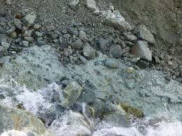

= 21天突破托福词汇 (003)
:toc: left
:toclevels: 3
:sectnums:
:stylesheet: ../../../myAdocCss.css

'''

==== (0204)→ abnormal

.. abnormal (a.) weather patterns +
  异常天气模式 ((a.) different from what is usual or expected, especially in a way that is worrying, harmful or not wanted 反常的，异常的，变态的（尤指令人担忧或有害的） ▶ ab-, 偏离，脱离。normal, 正常的。)

.. _an abnormal level_ of anxiety +
  异常水平的焦虑  +

.. abnormal behavior in animals +
  动物的异常行为  +

'''

==== (0205)→ acid

.. _citric (a.)柠檬的；采自柠檬的 acid_ (n.)酸 in lemons +
  柠檬中的柠檬酸 ((n.) a chemical, usually a liquid, that contains hydrogen and has a pH of less than seven. Acids have a sour taste and can destroy things they touch. 酸 ▶ 源自拉丁语 acidus, 酸的，来自 acere, 变酸，词源同 acrid, acerbic。)

.. _sulfuric (a.)硫磺的；含多量硫磺的 acid_ is highly corrosive (a.)腐蚀的；侵蚀性的  +
  硫酸具有高度腐蚀性  +

[.my3]
.案例
====
.corrosive +
(a.) 腐蚀的；侵蚀性的 +
-> 来自corrode, 腐蚀。

====

.. _acid rain_ damages (v.) forests +
  酸雨破坏森林 ((a.) having a pH of less than 7 酸性的)  +

.. acid soil +
  酸性土壤  +

.. an acid (a.)尖刻（或尖酸）的言语（或语调） remark 言论，评述  +
(sharp and unkind) +
  尖酸刻薄的评论 ((a.) (of a person's remarks) critical and unkind 尖刻的，尖酸的)  +

'''

==== (0206)→ aesthetic(al)

.. from an aesthetic (a.)审美的，美学的 point of view +
  从美学角度来看 ((a.) concerned with beauty and art and the understanding of beautiful things 美学的，审美的，有审美观点的 ▶ 源自希腊语 aisthetikos, 感知的，审美的。来自 aisthanesthai, 感知，感觉，词源同 anesthesia。)

.. aesthetic value +
  美学价值  +

.. the _aesthetic appeal_ of the design +
  设计的美学吸引力  +

.. an aesthetically pleasing 使满意，使愉快;令人高兴的，令人满意的 arrangement +
  一个美观的布置  +
((a.) (also aesthetical) pleasing to look at; artistic; beautiful 悦目的，艺术的，美的)  +

'''

==== (0207)→ amendment

.. *propose* (v.) an amendment 修正，修订之处；美国宪法修正案 *to* the constitution 宪法，章程 +
  提出宪法修正案 ((n.) a small change or improvement that is made to a law or a document; the process of changing a law or a document （法律、文件的）修正条款，修正案；修改，修订 ▶ amend, 修改。-ment, 名词后缀。)

.. pass (v.) the first amendment +
  通过第一修正案  +

.. make several amendments (n.)修正；修正案 to the draft +
  对草案做了几处修改  +

'''

==== (0208)→ aquatic

.. _aquatic (a.)水生的，水栖的 plants_ like _water lilies_ (百合花) 睡莲 +
  像睡莲这样的水生植物 ((a.) growing or living in, on or near water 水生的，水栖的 ▶ 源自拉丁语 aquaticus, 水生的。#来自 aqua, 水#，词源同 aquarium, -ic。)

[.my3]
.案例
====
.water lilies
image:/img/water lilies.jpg[,20%]
====

.. aquatic (a.) ecosystems  +
(oceans, rivers, lakes) +
  水生生态系统（海洋、河流、湖泊）  +

.. aquatic (a.) sports  +
(swimming, diving, water polo) +
  水上运动（游泳、跳水、水球） ((a.) connected with water 水上的，水中的)  +

'''

==== (0209)→ assess

.. assess (v.)评价，评定；估价，估计 the damage after the flood +
  评估洪水后的损失 ((v.) to make a judgement about the nature or quality of somebody/something 评估，评定（性质、质量） ▶ 源自拉丁语 assidere, 坐在旁边（协助法官）。来自 ad-, 朝向。sedere, 坐，词源同 sit, session。)

.. assess (v.) the student's performance +
  评估学生的表现  +

.. assess (v.) the value of the property for tax purposes +
  为征税而评估房产价值 ((v.) to calculate the amount or value of something 估价，估算)  +

'''

==== (0210)→ awkward

.. feel awkward at _social gatherings_ (聚会) 社交聚会 +
  在社交聚会上感到尴尬 ((a.) making you feel embarrassed 令人尴尬的，使人难堪的 ▶ 源自中古英语 awkeward, 方向错误的。来自 awk, 错误的。ward, 方向。)

.. an awkward silence +
  令人尴尬的沉默  +

.. be in an awkward position +
  处于尴尬的境地  +

.. _an awkward (a.)不方便的；笨拙的 tool_ to use +
  一件使用不便的工具 ((a.) difficult to use or handle 难用的，难操作的)  +

.. an awkward shape to carry +
  一个不便携带的形状  +

.. an awkward movement +
  笨拙的动作 ((a.) (of a person) not moving in an easy way; not comfortable （人）动作笨拙的，不灵活的)  +

'''

==== (0211)→ basic

.. basic principles 原则，原理 of mathematics +
  数学的基本原理 ((a.) forming the part of something that is most necessary and from which other things develop 基本的，基础的 ▶ base, 基础。-ic, 形容词后缀。)

.. basic human needs  + 
(food, water, shelter) +
  基本人类需求（食物、水、住所）  +

.. have a basic understanding 基本理解 of the subject +
  对该学科有基本的了解  +

.. basic training 基础训练 for new recruits 新兵；新成员 +
  新兵的基本训练 ((a.) [usually before noun] of the simplest kind or at the simplest level 最简单的，初步的)  +

'''

==== (0212)→ bipedal

.. humans are bipedal (a.)两足动物的；二足的 creatures +
  人类是两足动物 ((a.) (of an animal) using only two legs for walking （动物）两足行走的 ▶ #bi-, 二，两。pedal, 脚的，来自 ped, 脚。#)

.. bipedal (a.) locomotion 移动（力）；运动（力） +
(walking on two legs) +
  两足运动（用两条腿行走）  +

[.my3]
.案例
====
.locomotion
[ U] ( formal ) movement or the ability to move 移动（力）；运动（力）
====

.. the evolution of bipedal hominids 人科动物 +
  两足人科动物的进化  +

[.my3]
.案例
====
.hominid
( technical 术语) a human, or a creature that lived in the past which humans developed from 人科动物 +
-> homin-,人，-id,相似，外观。引申词义人科。

image:/img/hominid.jpg[,30%]
====

'''

==== (0213)→ boundary

.. mark the boundary between the two properties  不动产；房地产;<正式>房屋及周围的土地 +
  标记两处地产之间的边界 ((n.) a real or imagined line that marks the limits or edges of something and separates it from other things or places; a dividing line 边界，界限，分界线 ▶ bound, 边界。-ary, 名词后缀，表场所或相关。)

.. cross (v.) the national boundary +
  越过国界  +

.. push (v.) the boundaries of science +
  推动科学的边界（拓展科学领域） ((n.) (usually boundaries) the furthest limits of something, especially of what is acceptable or thought to be possible （尤指可以或可能达到的）极限，界限)  +

'''

==== (0214)→ bumblebee

.. a bumblebee 大黄蜂 `后定说明` *pollinating (v.)授粉 a flower* +
  正在给花授粉的大黄蜂 ((n.) a large hairy bee that makes a loud noise as it flies 大黄蜂 ▶ #bumble, 发出嗡嗡声,笨手笨脚；跌跌撞撞。bee, 蜜蜂#。) +
-> pollinate: 来自pollen,花粉，-ate,使。

.. watch a bumblebee *gather (v.) nectar* 花蜜；果汁；（希腊罗马诸神饮用的）神酒，琼浆；甘美的饮料 +
  观察大黄蜂采集花蜜  +

.. _the distinctive (a.)独特的，与众不同的 buzz_ 嗡嗡声，蜂鸣声 of a bumblebee +
  大黄蜂独特的嗡嗡声  +

'''

==== (0215)→ candidate

.. a presidential candidate 候选人，申请者 in the election +
  选举中的总统候选人 ((n.) a person who is trying to be elected or is applying for a job 候选人，求职者 ▶ 源自拉丁语 candidatus, 穿白衣者（古罗马寻求公职者穿白衣）。来自 candidus, 白色的，词源同 candid, -ate。)

.. interview (v.)面试，面谈；采访，访问 several candidates for the position +
  面试该职位的几位候选人  +

.. a strong candidate for the promotion (n.)提拔，晋升 +
  晋升的强有力候选人 ((n.) a person or thing that is considered suitable for something or that is likely to get something 有望…的人（或物），合适的人选)  +

'''

==== (0216)→ cater

.. a restaurant that caters (v.)提供餐饮服务，承办酒席；满足，迎合 to vegetarians 素食者  +
  一家为素食者提供服务的餐厅 ((v.) to provide the things that a particular person or situation needs or wants 满足需要，适合 ▶ 可能源自中古英语 catour, 买办，提供食物者。)

.. magazines that cater (v.) to different interests +
  迎合不同兴趣的杂志  +

.. cater (v.) for large weddings +
  承办大型婚宴 ((v.) to provide food and drinks for a social event （为社交活动）提供饮食，承办酒席)  +

'''

==== (0217)→ chaos

.. the room was in complete chaos (n.) after the party +
  派对后房间一片混乱 ((n.) a state of complete confusion and disorder 混乱，紊乱，杂乱无章 ▶ 源自希腊语 khaos, 混沌，深渊。)

.. *cause (v.) chaos* on the roads +
  在道路上造成混乱  +

.. _economic chaos_ following the war +
  战后的经济混乱  +

'''

==== (0218)→ claw

.. a cat `后定说明` sharpening (v.)（使）变得锋利 its claws +
  磨爪子的猫 ((n.) one of the sharp curved nails on the end of an animal's or a bird's foot （动物或鸟类的）爪，脚爪 ▶ 源自古英语 clawu, 爪。)

.. the crab's powerful claws +
  螃蟹强有力的钳  +

.. *claw (v.)（用爪子或手指甲）抓，撕，挠 at the door* to get in +
  用爪子抓门想进来 ((v.) to scratch or tear somebody/something with claws or with your fingernails （用爪子或指甲）抓，撕)  +

'''

==== (0219)→ comet

.. Halley's Comet 彗星 appears (v.) every 76 years +
  哈雷彗星每76年出现一次 ((n.) a mass of ice and dust that moves around the sun and looks like a bright star with a tail 彗星 ▶ 源自希腊语 kometes, 长发的（星星）。##来自 kome, 头发。##因其彗尾而得名。)

.. observe (v.) a comet through a telescope +
  通过望远镜观察彗星  +

.. the orbit of a comet +
  彗星的轨道  +

'''

==== (0220)→ conclusive

.. _conclusive (a.) 结论性的，毫无疑问的 evidence_ of his guilt +
  证明他有罪的确凿证据 ((a.) proving something, and allowing no doubt or confusion 结论性的，确凿的，令人信服的 ▶ conclude, 下结论。-ive, 形容词后缀。)

.. reach a conclusive decision +
  做出明确的决定  +

.. the results are not yet conclusive  (a.)  +
  结果尚无定论  +

'''

==== (0221)→ conservation

.. wildlife conservation 保护，保存 efforts +
  野生动物保护工作 ((n.) the protection of the natural environment （对自然环境的）保护 ▶ conserve, 保存，保护。-ation, 名词后缀。)

.. energy and water conservation 节约，防止浪费 +
  能源和水资源保护  +

.. a conservation area  保护区 +
(for historic buildings) +
  保护区（用于历史建筑） ((n.) the act of preventing something from being lost, wasted, damaged or destroyed 保存，保持，保护)  +

.. the conservation of ancient manuscripts 手稿；草稿  +
  古代手稿的保存  +

'''

==== (0222)→ converse

.. *converse (v.)谈话，交谈 with friends* over coffee +
  边喝咖啡边与朋友交谈 ((v.) (formal) to have a conversation with somebody （与…）交谈，谈话 ▶ con-, 一起，共同。verse, 转向，词源同 versatile, -verse。)

.. find it difficult to converse (v.) in a foreign language +
  发现用外语交谈很困难  +

.. the converse (n.)相反的事物，反面说法 is also true  +
(the opposite statement) +
  反之亦然 ((a.) opposite to something 相反的，逆向的)  +

.. hold the converse (a.)相反的，颠倒的，逆向的 opinion +
  持相反意见  +

.. the converse (a.) argument +
  相反的论点 ((n.) the opposite or reverse 相反的事物，反面说法)  +

'''

==== (0223)→ cranial

.. cranial (a.)颅的，与颅骨有关的 nerves  +
(nerves emerging from the brain) +
  脑神经（从大脑发出的神经） ((a.) (anatomy) connected with the skull 颅骨的，头盖骨的 ▶ ##cranio-, 颅，头。-al, 形容词后缀。##源自希腊语 kranion, 头骨。)

.. a cranial injury +
  颅骨损伤  +

.. study (v.) cranial anatomy 解剖学 +
  研究颅骨解剖学  +

image:/img/cranial.jpg[,30%]

'''

==== (0224)→ curve

.. draw a smooth curve (n.)曲线，弧线 on the graph +
  在图表上画一条平滑的曲线 ((n.) a line or surface that bends gradually; a smooth bend 曲线，弧线，弯曲处 ▶ 源自拉丁语 curvus, 弯曲的。)

.. the curve of the road +
  道路的弯道  +

.. a steep _learning curve_ 学习曲线 +
(metaphor for difficulty) +
  陡峭的学习曲线（形容困难）  +

.. the road curves (v.)弯曲；使弯曲 to the left +
  道路向左弯曲 ((v.) to move or make something move in the shape of a curve; to be in the shape of a curve （使）弯曲，呈曲线形)  +

.. *curve (v.) the ball* in soccer 英式足球，足球 (在足球比赛中,使球弯曲) +
  在足球中踢出弧线球  +

'''

==== (0225)→ definite

.. have _a definite (a.)清晰的，明晰的；确定的，不会改变的 plan_ for the future +
  对未来有明确的计划 ((a.) sure or certain; unlikely to change 肯定的，确定的，不会改变的 ▶ 源自拉丁语 definitus, 限定的，明确的。来自 de-, 表强调。finire, 限制，结束，词源同 finite, finish, -ite。)

.. give a definite (a.) answer +
  给出明确的答复  +

.. a definite improvement in his health +
  他健康状况的明显好转 ((a.) [usually before noun] easy to see or understand; obvious 清楚的，明显的)  +

'''

==== (0226)→ deteriorate

.. his health began to deteriorate (v.)恶化，变坏 +
  他的健康状况开始恶化 ((v.) to become worse 变坏，恶化，退化 ▶ 源自拉丁语 deterior, 更坏的。来自 #de-, 向下。# -terior, 比较级后缀。-ate, 动词后缀。)

.. the political situation deteriorated (v.) rapidly +
  政治局势迅速恶化  +

.. deteriorate (v.) into violence +
  恶化成暴力冲突  +

'''

==== (0227)→ dismay

.. to his dismay (n.)担忧；失望，沮丧；惊愕 , the project was canceled +
  令他沮丧的是，项目被取消了 ((n.) a worried, sad feeling after you have received an unpleasant surprise 沮丧，失望，惊愕 ▶ #dis-, 剥夺，丧失。may, 可能，能力#（古义），词源同 might。原指失去勇气。)

.. *look at* the mess *with dismay* +
  沮丧地看着一团糟  +

.. dismay (v.)使诧异；使惊愕；使失望 at the news of the defeat +
  对失败消息的沮丧  +

.. be dismayed by the high cost +
  被高昂的成本吓到 ((v.) to make somebody feel shocked and disappointed 使震惊，使失望，使沮丧)  +

'''

==== (0228)→ dogged

.. succeed (v.) through _dogged (a.)顽强的，坚持不懈的 determination_ 决心，坚定  +
  凭借顽强的决心取得成功 ((a.) (of a person) very determined to do something, even if it is very difficult （人）顽强的，坚持不懈的 ▶ #来自 dog, 狗。形容像狗一样紧追不舍。#-ed, 形容词后缀。)

.. a dogged refusal (n.) to give up +
  顽固地拒绝放弃  +

.. work (v.) with _dogged persistence_ 继续存在，维持；坚持不懈，执意 +
  以顽强的毅力工作  +

'''

==== (0229)→ earnest

.. speak (v.) in an earnest (a.)认真的，诚挚的，真诚的 tone +
  以诚恳的语气说话 ((a.) very serious and sincere 非常认真的，真诚的，严肃的 ▶ 源自古英语 eornost, 热忱，严肃。)

.. an earnest attempt to improve +
  改进的认真尝试  +

.. an earnest young man +
  一位认真的年轻人  +

.. in earnest  + 
(seriously and with determination) +
  认真地，郑重地 ((n.) seriousness and sincerity 认真，诚挚)  +

'''

==== (0230)→ embody

.. the constitution 宪法，章程 embodies (v.)具体表现，体现 the ideals of the nation +
  宪法体现了国家的理想 ((v.) to include or contain something 包括，包含，收录 ▶ em-, 使成为。body, 身体，实体。)

.. a building that embodies (v.) modern architectural principles +
  一座体现现代建筑原则的建筑  +

.. embody (v.) the spirit of the age +
  体现时代精神 ((v.) to express or represent an idea or a quality 体现，具体表现，代表（思想或品质）)  +

'''

==== (0231)→ enthusiasm

.. show (v.) great enthusiasm 热情，热忱 for the project +
  对这个项目表现出极大的热情 ((n.) a strong feeling of excitement and interest in something and a desire to become involved in it 热情，热忱，热心 ▶ 源自希腊语 enthousiasmos, 神灵附体，狂热。来自 en-, 进入。theos, 神，词源同 theology, -asm。)

.. full of youthful 年轻人的，青春的 enthusiasm +
  充满青春的热情  +

.. dampen (v.)弄湿；使潮湿;抑制，控制，减弱（感情、反应等） one's enthusiasm +
  打击某人的热情  +

'''

==== (0232)→ evaporate

.. water evaporates (v.)蒸发；消失 when heated +
  水加热时会蒸发 ((v.) to change from a liquid or solid state into vapour (and disappear) 蒸发，挥发 ▶ e-, 向外。vapor, 蒸汽。-ate, 动词后缀。)

.. the morning dew 露水；（似露珠的）小水珠 evaporated (v.) in the sun +
  晨露在阳光下蒸发了  +

.. _my enthusiasm_ quickly evaporated (v.)   +
(disappeared) +
  我的热情很快就消失了 ((v.) to disappear, especially by gradually becoming less and less （逐渐）消失，消散)  +

'''

==== (0233)→ expose

.. *expose* (v.) the film *to* light +
  将胶卷曝光 ((v.) to show something that is usually hidden 暴露，露出，显露 ▶ ex-, 向外。pose, 放置，词源同 position, impose。)

.. expose (v.) one's skin to the sun +
  将皮肤暴露在阳光下  +

.. expose (v.) a secret to the public +
  将秘密公之于众 ((v.) to make something known; to tell the truth about something 揭露，揭发，曝光)  +

.. expose (v.) corruption in the government +
  揭露政府腐败  +

'''

==== (0234)→ fashion

.. *fashion (v.)（尤指用手工）制作，使成形；塑造 a tool* from a piece of wood +
  用一块木头制作工具 ((v.) (formal or literary) to make or shape something, especially with your hands （尤指用手工）制作，使成形，塑造 ▶ 源自拉丁语 facere, 做，词源同 fact, -tion。)

.. fashion (v.) a response to the criticism (n.)批评，批判；意见  +
  对批评做出回应  +

.. the latest fashion in clothing +
  服装的最新潮流 ((n.) a popular style of clothes, hair, etc. at a particular time or place; the state of being popular 流行款式，时兴式样)  +

.. follow (v.) the fashion +
  赶时髦  +

.. come into/go out of fashion +
  开始流行/过时  +

'''

==== (0235)→ flat

.. a flat (a.) surface like a table top +
  像桌面一样的平坦表面 ((a.) smooth and level; without raised or hollow areas, and not sloping or curving 平坦的，平的 ▶ 源自古诺尔斯语 flatr, 平坦的。)

.. live in a flat 公寓，单元房 on the third floor +
  住在三楼的一套公寓里 ((n.) (British English) a set of rooms for living in that are part of a larger building and are usually all on one floor 公寓，单元房)  +

.. rent (v.) a furnished 配备家具的 flat +
  租一套带家具的公寓  +

.. a flat (a.)瘪了的；撒了气的 tire  +
(deflated) +
  瘪了的轮胎 ((a.) (of a tire) having lost air （轮胎）瘪了的)  +

'''

==== (0236)→ forge

.. forge (v.)  a sword from iron +
  用铁锻造一把剑 ((v.) to shape metal by heating it in a fire and hitting it with a hammer; to make an object in this way 锻造，打制 ▶ 源自拉丁语 fabricare, 制作，词源同 fabric。)

.. the blacksmith forges (v.) horseshoes 马蹄铁  +
  铁匠锻造马蹄铁  +

[.my3]
.案例
====
.horseshoe
马蹄铁（Horseshoe）是一种钉在马蹄底部的U形金属板，用于保护马蹄免受磨损.  +
马蹄铁固定在马蹄的掌面（接触地面的一侧），**通常用钉子穿过不敏感的蹄壁固定 ，其解剖结构类似于人类的脚趾甲 。**在某些情况下，马蹄铁也可以用胶水粘合 。

-> ##horse,马，shoe,鞋。##即马蹄铁，在民间传说中为带来好运的吉祥物。

image:/img/horseshoe.jpg[,20%]
====

.. forge (v.) a strong friendship +
  建立牢固的友谊 ((v.) to put a lot of effort into making something successful or strong so that it will last 努力加强，缔造)  +

.. forge (v.) a new identity 身份；本身；本体 for oneself +
  为自己塑造一个新的身份  +

.. forge (v.)锻造；伪装，假冒 someone's signature 签名，署名  +
(illegally copy) +
  伪造某人的签名 ((v.) to make an illegal copy of something in order to cheat people 伪造，仿造)  +

'''

==== (0237)→ fundamental

.. _the fundamental 基础的；基本的 principles_ of democracy +
  民主的基本原则 ((a.) serious and very important; affecting the most central and important parts of something 基本的，根本的，基础的 ▶ fund, 基础。-ment, 名词后缀。-al, 形容词后缀。)

.. a fundamental change in attitude +
  态度的根本转变  +

.. fundamental human rights +
  基本人权  +

.. be fundamental 十分重大的；根本的 to the process +
  对这一过程至关重要 ((a.) central; forming the necessary basis of something 核心的，必要的)  +

'''

==== (0238)→ genuine

.. a genuine (a.)真正的，非伪造的 leather wallet +
  真皮钱包 ((a.) real; exactly what it appears to be; not artificial 真的，非伪造的，名副其实的 ▶ 源自拉丁语 genuinus, 天生的，真正的。)

.. a genuine diamond +
  真钻石  +

.. show _genuine (a.)真诚的，真心的 concern_ for others +
  表现出对他人真诚的关心 ((a.) sincere and honest; that can be trusted 真诚的，诚实的，真心的)  +

.. a genuine apology +
  真诚的道歉  +

'''

==== (0239)→ grand

.. a grand 壮丽的，堂皇的 palace with many rooms +
  一座有许多房间的宏伟宫殿 ((a.) magnificent and imposing in appearance, size, or style 宏伟的，壮丽的，堂皇的 ▶ 源自拉丁语 grandis, 大的，伟大的。)

.. have grand ambitions 宏伟的抱负 for the future +
  对未来有宏伟的抱负  +

.. the Grand Canyon +
  大峡谷  +

.. _a grand total 总计 of_ $1,000  +
(final and impressive amount) +
  总计1000美元（最终且可观的数额） ((a.) [only before noun] (used in official names) most important （用于官方名称）最重要的，重大的)  +

'''

==== (0240)→ harden

.. the concrete 混凝土 will harden (v.) in a few hours +
  混凝土将在几小时内变硬 ((v.) to become or make something become firm, stiff or solid （使）变硬，硬化 ▶ hard, 坚硬的。-en, 动词后缀，表“使变得”。)

.. *harden (v.) one's heart* against pity 同情，怜悯  +
(become unsympathetic) +
  硬起心肠，不再怜悯（变得冷酷） ((v.) to become or make somebody become less sensitive to something （使）变得冷酷，（使）变得坚强)  +

.. harden (v.) one's resolve 决心，坚定的信念 /attitude +
  坚定决心/使态度强硬  +

.. harden (v.) one's position in negotiations +
  在谈判中使立场变得强硬  +

'''

==== (0241)→ heritage

.. protect our cultural heritage 遗产，传统 +
  保护我们的文化遗产 ((n.) the history, traditions and qualities that a country or society has had for many years and that are considered an important part of its character 遗产（指国家或社会长期形成的历史、传统和特色） ▶ 源自法语 heritage, 继承物。#来自 heriter, 继承，词源同 heir,# -age。)

.. a rich architectural heritage +
  丰富的建筑遗产  +

.. _world heritage_ 世界遗产 sites 地点，位置  +
(like the Great Wall) +
  世界遗产地（如长城）  +

.. his family heritage  + 
(property passed down) +
  他的家族遗产（传承的财产） ((n.) property that is or may be inherited; an inheritance 继承物，遗产（指财产）)  +

'''

==== (0242)→ humanity

.. crimes against humanity 人类（总称）；人性 +
  反人类罪 ((n.) people in general 人，人类（总称） ▶ human, 人。-ity, 名词后缀，表性质或状态。)

.. advances that benefit (v.) all humanity +
  造福全人类的进步  +

.. show great humanity 人道，仁慈 in treating (v.) prisoners +
  在对待囚犯时表现出极大的人道精神 ((n.) the quality of being kind to people and animals by making sure that they do not suffer more than is necessary; the quality of being humane 人道，仁慈)  +

.. an act of humanity +
  人道之举  +

.. study the humanities 人文学科 +
(subjects like literature, history) +
  学习人文学科（如文学、历史） ((n.) (the humanities) [pl.] the subjects of study that are about the way people think and behave, for example literature, language, history and philosophy 人文学科)  +

'''

==== (0243)→ immediate

.. demand (v.) an immediate response +
  要求立即回应 ((a.) happening or done without delay 立即的，即刻的 ▶ im-, 不，无。mediate, 居间的，间接的。)

.. *take immediate action* to solve the problem +
  立即采取行动解决问题  +

.. _the immediate cause_ of the accident +
  事故的直接原因 ((a.) [only before noun] existing now and needing urgent attention 目前的，当前的，迫切的)  +

.. our immediate concern is safety +
  我们当前关注的是安全  +

.. his immediate (a.)（关系或级别）最接近的，直系的 family  +
(parents, children, siblings) +
  他的直系亲属（父母、子女、兄弟姐妹） ((a.) [only before noun] next to or very close to a particular place or time （时空上）最接近的，紧接的)  +

'''

==== (0244)→ inclination

.. have an inclination 倾向，意愿 towards arts *rather than* sciences +
  倾向于艺术而非科学 ((n.) a feeling that makes you want to do something 倾向，意愿，爱好 ▶ incline, 倾向于。-ation, 名词后缀。)

.. follow one's natural inclinations +
  遵循自己的天性  +

.. show little inclination to help +
  几乎不愿帮忙  +

.. a steep inclination 倾斜度 of the hill +
  山坡的陡峭倾斜度 ((n.) a tendency to think or behave in a particular way; a disposition 趋势，趋向)  +

image:/img/inclination.png[,30%]

'''

==== (0245)→ inject

.. inject (v.) the patient with a vaccine 疫苗 +
  给病人注射疫苗 ((v.) to put a drug or other substance into a person's or an animal's body using a syringe 注射（药物或其他物质） ▶ in-, 进入。ject, 投掷，词源同 project, reject, -ject。)

.. inject (v.) insulin 胰岛素 for diabetes 糖尿病，多尿症 +
  注射胰岛素治疗糖尿病  +

.. inject (v.) new ideas into the discussion +
  为讨论注入新想法 ((v.) to introduce something new or different that adds excitement or interest 引入，增添（新思想、感情等）)  +

.. inject (v.) humor into a speech +
  在演讲中加入幽默  +

'''

==== (0246)→ integral

.. _an integral 必需的，必要的，不可或缺的；作为组成部分的 part_ of the machine +
  机器不可或缺的组成部分 ((a.) being an essential part of something 构成整体所必需的，不可或缺的 ▶ integer, 完整的，整体的。-al, 形容词后缀。)

.. *play an integral role* in the team's success +
  在团队成功中扮演不可或缺的角色  +

.. integral (a.) to the process +
  对这一过程至关重要  +

'''

==== (0247)→ invertebrate

.. insects, worms, and other invertebrates 无脊椎动物  +
  昆虫、蠕虫和其他无脊椎动物 ((n.) any animal with no backbone, for example a worm or an insect 无脊椎动物 ▶ #in-, 无，非。vertebrate, 脊椎动物。 来自PIE*wer,#转，弯，词源 convert,toward,#-bra,工具格后缀， #)

.. study (v.) marine (a.)海洋的，海产的 invertebrates +
  研究海洋无脊椎动物  +

.. invertebrate (n.a.) zoology 动物学 +
  无脊椎动物学  +

.. invertebrate (a.) species +
  无脊椎动物物种 ((a.) 无脊椎的)  +

image:/img/invertebrate.png[,60%]

'''

==== (0248)→ jumble

.. a jumble (n.)混乱；杂乱的一堆东西 of old books in the attic 阁楼，顶楼  +
  阁楼里一堆杂乱无章的旧书 ((n.) an untidy or confused mixture of things 杂乱的一堆，混乱的一团 ▶ 可能源自中古英语 jumbelen, 笨拙地移动。) +
-> 词源不详，#可能来自 jump,跳，#-le,表反复。引申词义跳来跳去，忙乱，混乱。

.. a jumble of ideas in his mind +
  他脑海中一团混乱的想法  +

.. *jumble (v.) up* 使乱堆；使混乱；使杂乱 all the pieces of the puzzle +
  把拼图的所有碎片弄乱 ((v.) to mix things together in a confused or untidy way 使混乱，使杂乱)  +

.. the papers were all jumbled (v.) together in a drawer +
  文件都乱七八糟地堆在一个抽屉里  +

'''

==== (0249)→ latter

.. in _the latter (a.n.)（两者之中的）后者的；末期的，后期的 part_ of the century +
  在本世纪后半期 ((a.) [only before noun] being the second of two things, people or groups that have just been mentioned, or the last in a list （刚提及的两者中）后者的；（列举中）最后的 ▶ 源自古英语 lætra, 更慢的，较晚的，#来自 læt, 晚的，词源同 late。#)

.. choose (v.) the latter option  +
(the second one mentioned) +
  选择后者（提到的第二个）  +

.. _the latter point_ is more important +
  后一点更重要  +

'''

==== (0250)→ lighthouse

.. a lighthouse 灯塔 guiding (v.) ships to safety +
  引导船只安全航行的灯塔 ((n.) a tower or other building containing a beacon light to warn or guide ships at sea 灯塔 ▶ light, 光。house, 房屋。)

.. the beam from the lighthouse +
  灯塔的光束  +

.. *build a lighthouse* on the cliff +
  在悬崖上建造灯塔  +

'''

==== (0251)→ lone

.. a lone (a.) traveler on the road +
  路上的孤独旅人 ((a.) without any other people or things 单独的，独自的，孤单的 ▶ 源自中古英语 alone 的缩略，来自 all one。)

.. a lone figure in the distance +
  远处的一个孤独身影  +

.. a lone survivor of the crash +
  事故的唯一幸存者 ((a.) [only before noun] used to describe the only person or thing that is in a particular situation 唯一的)  +

.. make a lone decision +
  独自做出决定  +

'''

==== (0252)→ maize

.. fields of maize 玉米 swaying (v.)（使）摇摆，摇动 in the wind +
  风中摇曳的玉米田 ((n.) (British English) a tall plant grown for its large yellow grains that are used for making flour or eaten as a vegetable; the grains of this plant 玉米，玉蜀黍 ▶ 源自西班牙语 maíz, 来自泰诺语 mahiz。)

.. maize flour 面粉，（谷物磨成的）粉 `后定说明` used for making tortillas 墨西哥薄馅饼 +
  用于制作玉米饼的玉米粉  +

[.my3]
.案例
====
.tortilla
image:/img/tortilla.jpg[,30%]
====

.. maize is a _staple (a.)主要的；基本的；重要的 food_ in many regions +
  玉米是许多地区的主食  +

'''

==== (0253)→ mature

.. a mature oak tree +
  一棵成熟的橡树 ((a.) fully grown and developed 成熟的，成年的，发育完全的 ▶ 源自拉丁语 maturus, 成熟的，及时的。)

.. physically and emotionally mature (a.)成熟的，理智的；成年的，发育完全的  +
  身心成熟的  +

.. a mature student  + 
(older than usual) +
  成年学生（年龄偏大的）  +

.. let the wine mature in the cellar 地下室，地窖  +
  让酒在地窖中陈酿 ((v.) to become mature 成熟，长成)  +

.. the plan has matured over the years +
  这个计划经过多年已臻成熟  +

.. mature (v.) into a responsible adult +
  成长为有责任感的成年人  +

'''

==== (0254)→ methane

.. methane 甲烷，沼气 gas `后定说明` produced by cows +
  牛产生的甲烷气体 ((n.) a gas without colour or smell, that burns easily and is used as fuel. It is the main gas that is found in natural gas and that is produced when vegetable matter decays. 甲烷，沼气 ▶ 源自希腊语 methy, 酒。hyle, 物质。因其最初由木材干馏制得而得名。)

.. methane is a potent greenhouse gas +
  甲烷是一种强效温室气体  +

.. capture (v.) methane from landfills  废物填埋地（或场） +
  从垃圾填埋场捕获甲烷  +

'''

==== (0255)→ mock

.. mock (v.) his poor pronunciation +
  嘲笑他糟糕的发音 ((v.) to laugh at somebody/something in an unkind way, especially by copying what they say or do 嘲笑，（模仿着）嘲弄 ▶ 源自古法语 mocquer, 嘲笑。)

.. feel mocked by his classmates +
  感觉被同学嘲笑了  +

.. a _mock (a.)（考试、作战等）模拟的，演习的 interview_ to practice (v.) for the real one +
  为真实面试准备的模拟面试 ((a.) [only before noun] not sincere or serious 模拟的，模仿的，非真实的)  +

.. a mock (a.)  battle/exam +
  模拟战斗/考试  +

'''

==== (0256)→ moth

.. a moth 飞蛾，蛾 `后定说明` attracted to the light +
  被灯光吸引的蛾子 ((n.) a flying insect with a long thin body and four large wings, like a butterfly, but less brightly coloured. Moths fly mainly at night and are attracted to lights. 蛾，蛾子 ▶ 源自古英语 moththe, 蛾。)

.. clothes damaged by clothes moths 衣蛾 +
  被衣蛾损坏的衣服  +

.. the moth's lifecycle  + 
(egg, caterpillar, pupa, adult) +
  蛾的生命周期（卵、幼虫、蛹、成虫）  +

'''

==== (0257)→ neck

.. have a pain in the neck +
  脖子疼 ((n.) the part of the body between the head and the shoulders 颈，脖子 ▶ 源自古英语 hnecca, 颈，脖子。)

.. wrap (v.) a scarf 围巾，披巾，头巾 around one's neck +
  在脖子上围一条围巾  +

.. the neck of a bottle  + 
(the narrow part) +
  瓶颈（狭窄部分） ((n.) the narrow part of something, especially a bottle or musical instrument （尤指瓶子或乐器的）颈状部分，细长部分)  +

.. the neck of a guitar/violin +
  吉他/小提琴的琴颈  +

'''

==== (0258)→ notable

.. a notable achievement in science +
  科学上的一项显著成就 ((a.) deserving to be noticed or to receive attention; important 值得注意的，显著的，重要的 ▶ note, 注意。-able, 形容词后缀，表“可...的”。)

.. a _notable 显要的，值得注意的 exception_ 例外，除外 to the rule +
  该规则的一个显著例外  +

.. notable (a.)值得注意的；显著的；重要的 for its beautiful architecture +
  以其美丽的建筑而闻名 ((a.) (of a person) important and deserving attention, usually because of being very successful or skilled （人）显要的，著名的)  +

.. a notable figure in history +
  历史上的著名人物  +

'''

==== (0259)→ odd

.. an _odd number_ 奇数 like 1, 3, 5 +
  像1、3、5这样的奇数 ((a.) (of numbers) that cannot be divided exactly by two （数字）奇数的 ▶ 源自古 Norse oddr, 三角形的点，突出部分。)

.. odd and even numbers +
  奇数和偶数  +

.. odd behavior that worried his friends +
  令朋友们担忧的古怪行为 ((a.) strange or unusual 奇怪的，反常的，不寻常的)  +

.. an odd coincidence +
  奇怪的巧合  +

.. at odd (a.)可得到的；可用的 moments  +
(occasionally) +
  在偶尔的空闲时间 ((a.) [only before noun] happening or appearing occasionally; not very often or regular 偶尔发生的，不规律的)  +

'''

==== (0260)→ ore

.. mine (v.)采（煤等矿物）_iron ore_ 铁矿石 from the hills +
  从山里开采铁矿石 ((n.) rock, earth, etc. from which metal can be obtained 矿石，矿砂 ▶ 源自古英语 ōra, 矿石。)

.. a rich deposit 沉积物，沉积层 of copper ore 铜矿石 +
  丰富的铜矿矿床  +

.. *process (v.) the ore* to extract (v.) the metal +
  加工矿石以提取金属  +

'''

==== (0261)→ oxygen

.. *breathe (v.) in* oxygen and *exhale* (v.)呼（气），呼出 carbon dioxide +
  吸入氧气，呼出二氧化碳 ((n.) a chemical element. Oxygen is a gas without colour, taste or smell that is present in air and is necessary for most animals and plants to live. 氧，氧气 ▶ 源自法语 oxygène, 来自希腊语 oxys, 酸。-gen, 产生者。最初被误认为是酸的形成要素。)

.. oxygen mask `后定说明` used in airplanes +
  飞机上使用的氧气面罩  +

.. plants produce (v.) oxygen through photosynthesis 光合作用 +
  植物通过光合作用产生氧气  +

'''

==== (0262)→ pasture

.. cattle `后定说明` grazing (v.) in the pasture 牧场，牧草地 +
  在牧场上吃草的牛 ((n.) land covered with grass that is suitable for feeding animals on 牧场，牧草地 ▶ 源自古法语 pasture, 食物，牧场。来自拉丁语 pascere, 喂养，放牧。)

.. move the sheep to a new pasture +
  把羊赶到新牧场  +

.. rich _pasture land_ +
  肥沃的牧场  +

'''

==== (0263)→ percentage

.. a high percentage of students passed (v.) the exam +
  很高比例的学生通过了考试 ((n.) the number, amount, rate, etc. of something, expressed as if it is part of a total which is 100; a part or share of a whole 百分比，百分率 ▶ per cent, 每百。-age, 名词后缀，表状态或比率。)

.. calculate (v.) the percentage 百分比，百分率；部分，比例 of votes +
  计算得票百分比  +

.. what percentage of the budget 预算的百分比 is spent on research? +
  预算的百分之几用于研究？  +

.. a small percentage of the total +
  总量的一小部分 ((n.) [U] (business) an amount of something that is given to somebody as a commission 佣金，提成)  +

'''

==== (0264)→ physician

.. consult (v.)  a physician 医生，（尤指）内科医生 about the illness +
  就疾病咨询内科医生 ((n.) (especially North American English) a doctor, especially one who is a specialist in general medicine and not surgery 医生；（尤指）内科医生 ▶ 源自拉丁语 physica, 自然科学。来自希腊语 physis, 自然。)

.. a _practicing physician_ +
  执业医师  +

.. the patient was examined by the _attending (a.)（医生）主治的 physician_ +
  病人接受了主治医生的检查  +

[.my3]
.案例
====
.attending physician
主治医师是一位获得委员会认证、持有执照的医生，已完成住院医师培训，并在医院或诊所对患者的医疗护理负有最终责任。 他们领导医疗团队，指导治疗方案，并监督住院医师、专科医师和医学生。

Distinction from Other Roles +
与其他角色的区别

[.my3]
[options="autowidth" cols="1a,1a"]
|===
|Header 1 |Header 2

|#Attending# (a.) （医生）主治的 vs. #Resident# (a.) （在某地）居住的，居留的；常驻的:
|A resident is a doctor in training, while an attending has finished training and is qualified to practice independently.

主治医师与住院医师 ： #*"住院医师"是正在接受培训的医生，而"主治医师"已完成培训并有资格独立执业。*#

|#Attending# vs. #Fellow#:
|A fellow is a doctor completing sub-specialty training, often supervised by an attending, though they may function as an attending in some contexts.

主治医师与专科医师 ： #*"专科医师"是指正在完成"亚专科培训"的医生，通常由"主治医师"监督，但在某些情况下，他们也可以担任主治医师的角色。*#
|===

====

'''

==== (0265)→ plentiful

.. a plentiful (a.)丰富的，众多的 supply of fresh water +
  充足的淡水供应 ((a.) available or existing in large amounts or numbers 丰富的，充足的，多的 ▶ plenty, 丰富。-ful, 形容词后缀，表“充满...的”。)

.. a land where resources are plentiful +
  资源丰富的土地  +

.. a plentiful harvest 收获；收获量 this year +
  今年的丰收  +

'''

==== (0266)→ portrait

.. paint (v.) a portrait （尤指只刻画脸、头和肩部的）肖像，照片，雕像；描绘，描述 of the king +
  为国王画一幅肖像画 ((n.) a painting, drawing or photograph of a person, especially of the head and shoulders 肖像，肖像画，人像照片 ▶ portraire, 描绘，描绘。来自 por-, 向前。traire, 拉，画，词源同 draw, trace。)

.. a family portrait on the wall +
  墙上的全家福  +

.. a portrait gallery +
  肖像画廊 ((n.) a detailed description of somebody/something （人或事物的）详细描述，描绘)  +

.. the book gives a vivid portrait of life in the 19th century +
  这本书生动描绘了19世纪的生活  +

'''

==== (0267)→ precursor

.. a precursor （事物）先驱，先兆 to modern computers +
  现代计算机的先驱 ((n.) a person or thing that comes before somebody/something similar and that leads to or influences its development 先驱，先锋，先导 ▶ #pre-, 前。cursor, 奔跑者，来自 currere, 跑，词源同 course, current。#)

.. the precursor of modern jazz +
  现代爵士乐的先驱  +

.. dark clouds are often a precursor to rain +
  乌云常常是下雨的先兆 ((n.) something that happened or existed before something else and influenced its development 前兆，先兆)  +

'''

==== (0268)→ primitive

.. primitive (a.)原始的，远古的 tools made of stone +
  用石头制成的原始工具 ((a.) belonging to a very simple society with no industry, etc. 原始的，远古的 ▶ 源自拉丁语 primitivus, 最初的。来自 primus, 第一，词源同 prime, -itive。)

.. primitive tribes living in the jungle +
  生活在丛林中的原始部落  +

.. a primitive form of communication 表达，交流，交际 +
  一种原始的沟通方式 ((a.) (of a feeling or a desire) very strong and not based on reason, as if from the earliest period of human life （感情或欲望）本能的，原始的)  +

.. primitive (a.) instincts [生物]本能；[心理]直觉  +
(like fear) +
  原始本能（如恐惧）  +

.. the software has a rather primitive （器物等）粗糙的，简陋的 interface  +
(very basic) +
  该软件的界面相当简陋（非常基本） ((a.) very simple and old-fashioned, especially when something is also not convenient and comfortable 简陋的，落后的)  +

'''

==== (0269)→ prompt

.. his curiosity 好奇心，求知欲 prompted (v.) him to ask questions +
  好奇心促使他提问 ((v.) to make somebody decide to do something; to cause something to happen 促使，导致，激起 ▶ 源自拉丁语 promptus, 准备好的，迅速的。来自 pro-, 向前。emere, 拿，取。)

.. the incident prompted (v.) a review 审查，检查 of safety procedures 程序；规程 +
  该事件促使对"安全程序"进行审查  +

.. prompt (v.) the audience to applaud +
  引导观众鼓掌 ((v.) to encourage somebody to speak by asking them questions or suggesting words that they could say 提示，鼓励（某人发言）)  +

.. prompt (v.)（给演员）提词，提白 an actor who has forgotten a line +
  为忘词的演员提词  +

.. a _prompt (a.)迅速的，立刻的 reply_ to the letter +
  对信件的迅速回复 ((a.) done without delay 迅速的，及时的)  +

'''

==== (0270)→ psychologist

.. consult (v.) a psychologist 心理学家  about stress +
  就压力问题咨询心理学家 ((n.) a scientist who studies and is trained in psychology 心理学家，心理学研究者 ▶ psycho-, 心理，灵魂。-logy, ...学。ist, ...者。)

.. a clinical 临床的；临床诊断的 psychologist +
  临床心理学家  +

[.my3]
.案例
====
.clinical:
(a.) [ only before noun] relating to the examination and treatment of patients and their illnesses 临床的；临床诊断的

•clinical research (= #*done on patients, not just considering theory*#) 临床研究 +
•clinical training (= the part of a doctor's training done in a hospital) 临床培训 +
•_clinical trials_ 临床试验 of a drug 药物的临床试验

====

.. the research of a cognitive psychologist +
  认知心理学家的研究  +

'''

==== (0271)→ quotation

.. begin the essay （学生为某门课程所写的）短文，论说文 with a quotation 引语，引文 from Shakespeare +
  以一句莎士比亚的引文开始文章 ((n.) a group of words or a short piece of writing taken from a book, play, speech, etc. and repeated because it is interesting or useful 引文，引语，语录 ▶ quote, 引用。-ation, 名词后缀。)

.. use a direct quotation 直接引语 to support your argument +
  使用直接引语来支持你的论点  +

[.my3]
.案例
====
direct quotation :直接引语：在引用别人的话时，直接将其原话用引号括起来的方式呈现出来。
====

.. a book of famous quotations +
  名言录  +

.. ask for a quotation before hiring the service +
  在雇佣服务前要求报价 ((n.) a statement of how much money a particular piece of work will cost 报价，估价)  +

'''

==== (0272)→ rattle

.. the baby enjoys (v.) shaking a rattle 发连续短促尖利声的器具；拨浪鼓 +
  婴儿喜欢摇拨浪鼓 ((n.) a baby's toy that makes a series of short loud sounds when it is shaken （幼儿玩的）拨浪鼓，摇铃 ▶ 拟声词，模仿快速连续敲击的声音。)

.. a wooden rattle +
  木制拨浪鼓  +

.. the windows rattle (v.)（使）发出咔嗒咔嗒的声音 in the wind +
  窗户在风中格格作响 ((v.) to make a series of short loud sounds when shaking or hitting against something hard （使）发出格格声，（使）碰撞作声)  +

.. rattle (v.) the door handle +
  把门把手弄得格格响  +

'''

==== (0273)→ recording

.. make a recording of the interview +
  为采访录音 ((n.) sound or pictures that have been recorded on tape, video, etc. 录制的音像，录音，录像 ▶ record, 记录。-ing, 名词后缀，表行为或产物。)

.. listen to an old recording of a speech +
  听一段旧演讲录音  +

.. a studio recording (n.)录音，录像；录制；（正式的）记录，记载 of the song +
  这首歌的录音室录音  +

.. a collection of jazz recordings +
  爵士乐唱片收藏 ((n.) the process of making a record, film, etc. or the state of being recorded 录制，录音，录像)  +

'''

==== (0274)→ regional

.. regional differences in cuisine (n.)烹饪，风味；饭菜，菜肴 +
  烹饪上的地区差异 ((a.) of or relating to a region 地区的，区域的，地方的 ▶ region, 地区。-al, 形容词后缀。)

.. a regional dialect 方言，土话/accent +
  地区方言/口音  +

.. regional cooperation among neighboring countries +
  邻国之间的区域合作  +

'''

==== (0275)→ renaissance

.. the Italian Renaissance 文艺复兴（欧洲14至17世纪） in art and literature 文学，文学作品 +
  意大利艺术与文学的文艺复兴 ((n.) the period in Europe during the 14th, 15th and 16th centuries when people became interested in the ideas and culture of ancient Greece and Rome and used these influences in their own art, literature, etc. （欧洲14至16世纪的）文艺复兴，文艺复兴时期 ▶ 源自法语 renaissance, 再生。来自 re-, 再。naissance, 出生，词源同 native。)

.. a painter of the Renaissance +
  文艺复兴时期的画家  +

.. experience a renaissance in popularity (n.)流行，普及，受欢迎 +
(revival) +
  经历人气的复兴（复兴） ((n.) a situation when there is new interest in a particular subject, form of art, etc. after a period when it was not very popular 复兴，再生)  +

'''

==== (0276)→ resemble

.. the child closely resembles (v.) her mother +
  这个孩子长得非常像她母亲 ((v.) to look like or be similar to another person or thing 看起来像，像，与…相似 ▶ re-, 强调。sembler, 像，类似，来自拉丁语 simulare, 相似，词源同 similar, semblance。)

.. the two species resemble (v.) each other +
  这两个物种彼此相似  +

.. the situation resembles (v.) that of a decade ago +
  情况与十年前相似  +

'''

==== (0277)→ retreat

.. order (v.) the troops to retreat from the battlefield +
  命令部队从战场撤退 ((v.) to move away from a place or an enemy because you are in danger or because you have been defeated 撤退，退却，后退 ▶ re-, 向后。treat, 拉，处理，词源同 treat, tract。)

.. retreat to a safer position +
  撤退到更安全的位置  +

.. a mountain retreat (n.)僻静处；隐居处 for meditation 冥想，打坐；沉思，深思 +
  用于冥想的山中静修处 ((n.) a quiet, private place that you go to in order to get away from your usual life 静居处，隐居处)  +

.. *go on* 进行,发生 a spiritual retreat 静修期间（或活动） +
  进行一次灵修静修  +

'''

==== (0278)→ rival

.. two rival companies `后定说明` competing (v.) for market share +
  两家争夺市场份额的竞争对手公司 ((n.) a person, company or thing that competes with another in business, sport, etc. 竞争对手，敌手 ▶ 源自拉丁语 rivalis, 共用一条河流的人（可能因水源而竞争）。来自 rivus, 河流，词源同 river。)

.. _a fierce （动作或情感）强烈的，激烈的 rival_ (n.)竞争对手，敌手 in the tennis tournament 锦标赛，联赛 +
  网球锦标赛中的一个劲敌  +

.. surpass (v.)超过，胜过，优于  all its rivals (n.) in quality  质量，品质  +
  在质量上超越所有竞争对手 ((v.) to be as good, impressive, etc. as somebody/something else 与…相匹敌，比得上)  +

.. a view that rivals (v.)与...相匹敌，比得上 the best in the world +
  可与世界上最佳景色媲美的景色  +

'''

==== (0279)→ rush

.. rush (v.)  to catch (v.) the bus +
  冲过去赶公交车 ((v.) to move or to do something with great speed, often too fast 冲，奔，匆忙行事 ▶ 源自中古英语 ruschen, 猛冲。)

.. don't rush (v.)赶紧做，仓促做 your decision; take your time +
  别匆忙做决定，慢慢来  +

.. the morning rush hour 早高峰时段 +
(busy time) +
  早高峰时间 ((n.) a sudden fast movement of something; a situation in which you are in a hurry and need to do things quickly 急促的动作；匆忙，繁忙)  +

.. a rush of water from the broken pipe +
  从破裂管道涌出的水流  +

.. feel a rush of adrenaline 肾上腺素  +
(sudden strong feeling) +
  感到一阵肾上腺素激增（突然的强烈感觉） ((n.) a sudden feeling or experience of something （感觉的）一阵，迸发)  +

[.my3]
.案例
====
adrenaline :  肾上腺素 +
-> 前缀ad-, 去，往。词根ren, 肾，见renal, 肾的。-ine, 化学名词后缀。

====

'''

==== (0280)→ scent

.. the sweet scent 香味，芳香；（动物或人的）气味，臭迹 of flowers in the garden +
  花园里花朵的甜香 ((n.) the pleasant smell that something has 香味，芬芳 ▶ 源自拉丁语 sentire, 感觉，闻到。)

.. the scent of pine  松树；松木 in the forest +
  森林里的松树清香  +

.. follow (v.) the scent of the animal  +
(track by smell) +
  追踪动物的气味（凭气味追踪） ((v.) (especially of an animal) to discover something by using the sense of smell （尤指动物）嗅出，闻到)  +

.. dogs scenting (v.)（动物）嗅出，闻到 prey 猎物，捕获物；受害者 +
  嗅到猎物的狗  +

'''

==== (0281)→ secure

.. secure (v.)（尤指经过努力而）获得，得到 a loan from the bank +
  从银行获得贷款 ((v.) to obtain or achieve something, especially when this means using a lot of effort （尤指经过努力）获得，取得，实现 ▶ 源自拉丁语 securus, 安全的，无忧虑的。来自 se-, 没有。cura, 担心，词源同 cure, accurate。)

.. secure (v.) a good job after graduation 毕业；毕业典礼 +
  毕业后找到一份好工作  +

.. secure (v.)使安全，保护  the building against intruders 入侵者；闯入者 +
  保护大楼免遭入侵者闯入 ((v.) to protect something so that it is safe and difficult to attack or damage 保护，保卫，使安全)  +

.. secure (v.) the doors and windows before leaving +
  离开前关好门窗  +

.. feel secure (a.)安全的，稳妥的 in one's home +
  在家中感到安全 ((a.) not likely to be lost or to fail; safe 牢固的，可靠的，安全的)  +

.. a secure investment/job +
  可靠的投资/工作  +

'''

==== (0282)→ shade

.. sit in the shade of a large tree +
  坐在一棵大树的树荫下 ((n.) [U] an area that is dark and cool under or behind something, for example a tree or building, because the sun's light does not get to it 荫，背阴处 ▶ 源自古英语 sceadu, 阴影，荫凉。)

.. provide some shade 背阴处，阴凉处 from the hot sun +
  提供一些荫凉以躲避烈日  +

.. different shades 浓淡深浅；色度 of blue  +
(light blue, dark blue) +
  不同的蓝色色调（浅蓝、深蓝） ((n.) [C] a particular form of a colour, that is, how dark or light it is （色彩的）浓淡，色度)  +

.. paint (v.) the wall in a _pale （颜色）浅的，淡的 shade_ of green +
  把墙刷成淡绿色  +

image:/img/shade.webp[,100%]
image:/img/shade 2.jpg[,49%]

'''

==== (0283)→ shut

.. shut the door quietly, please +
  请轻声关门 ((v.) to make something close; to become closed （使）关闭，关上，合上 ▶ 源自古英语 scyttan, 关闭，闩上。)

.. shut the book after reading +
  读完书后合上书本  +

.. the factory was shut down last year  + 
(closed permanently) +
  这家工厂去年关闭了（永久关闭） ((v.) to stop opening to the public; to stop operating for business 停止营业，关门，打烊)  +

.. the store shuts at 8 pm +
  商店晚上8点关门  +

'''

==== (0284)→ slip

.. slip (v.) on the wet floor and fall (v.) +
  在湿滑的地板上滑倒 ((v.) to slide a short distance by accident so that you fall or nearly fall 滑倒，滑跤 ▶ 源自古英语 slippan, 滑倒。)

.. the glass slipped from his hand and broke +
  玻璃杯从他手中滑落摔碎了  +

.. make a slip 差错；疏漏；纰漏 of the tongue  +
(say something by mistake) +
  说走了嘴（失言） ((n.) a small mistake, usually made by being careless or not paying attention 小错误，疏漏)  +

.. _a costly 昂贵的，值钱的；造成严重损失的，代价大的 slip_ (n.) in the calculations 计算，运算；估算，预测 +
  计算中一个代价高昂的失误  +

.. the slip of the wheels 车轮 on ice  +
(loss of grip) +
  车轮在冰上打滑（抓地力丧失） ((n.) [U] the act of slipping or the amount that something slips 滑动，滑行；滑移量)  +

'''

==== (0285)→ sort

.. different sorts 种类，品种 of birds in the forest +
  森林里不同种类的鸟 ((n.) a group or type of people or things that are similar in a particular way 种类，类别，品种 ▶ 源自拉丁语 sors, 命运，种类。)

.. what sort of music do you like? +
  你喜欢哪种音乐？  +

.. all sorts of people attended the event +
  各种各样的人都参加了这个活动  +

.. sort (v.)整理，把……分类 the mail by _zip code_ 邮政编码 +
  按邮政编码分拣邮件 ((v.) to arrange things in groups or in a particular order according to their type, etc.; to separate things of one type from others 整理，把…分类，分拣)  +

.. *sort (v.) out* the good apples *from* the bad ones +
  把好苹果和坏苹果分开  +

'''

==== (0286)→ spine

.. an injury to the spine 脊髓，脊柱 +
  脊柱受伤 ((n.) the row of small bones that are connected together down the middle of the back 脊柱，脊椎 ▶ 源自拉丁语 spina, 刺，脊柱。)

.. protect your spine when lifting heavy objects +
  提重物时保护好你的脊柱  +

.. the spine of a book  + 
(the part where the pages are attached) +
  书脊（装订页面的部分） ((n.) the narrow part of the cover of a book that the pages are joined to 书脊)  +

.. read the title on the spine +
  阅读书脊上的书名  +

.. the cactus 仙人掌科植物，仙人掌 has sharp spines （动植物的）刺，刺毛  +
(needles) +
  仙人掌有尖锐的刺 ((n.) any of the sharp pointed parts like needles on some plants and animals （植物和动物的）刺，棘刺)  +

'''

==== (0287)→ stabilize

.. medication 药物，药品；药物治疗 `后定说明` to stabilize (v.) his heart rate +
  稳定他心率的药物 ((v.) to become or to make something become firm, steady and unlikely to change; to make something stable （使）稳定，（使）稳固 ▶ stable, 稳定的。-ize, 动词后缀，表“使成为”。)

.. stabilize (v.)（使）稳定，稳固 the economy after the crisis +
  危机后稳定经济  +

.. the patient's condition has stabilized +
  病人的状况已经稳定  +

'''

==== (0288)→ stem

.. _the stem （植物、灌木的）茎，干 of a rose_ supports (v.)  the flower +
  玫瑰的花梗支撑着花朵 ((n.) the main long thin part of a plant above the ground from which the leaves or flowers grow; a smaller part that grows from this and supports flowers or leaves （植物的）茎，干，梗 ▶ 源自古英语 stemn, stefn, 树干，茎。)

.. cut the stem of the plant +
  剪下植物的茎  +

.. _the stem of the problem_ *lies (v.) in* poor communication +
  问题的根源在于沟通不畅 ((n.) the main part of a word that stays the same when endings are added to it （单词的）词干)  +

.. from a wealthy merchant (a.n.)商人;商业的，商人的 stem <古，文>血统  +
(family background) +
  出身于富商家庭 ((n.) (literary) the main part of something that other parts develop from 起源，根由)  +

.. stem (v.) from 是…的结果；起源于；根源是 a lack of experience  +
(originate from) +
  源于缺乏经验（起源于） ((v.) to develop as a result of something else 起源于，由…造成)  +

.. the conflict *stems (v.) from* territorial disputes 争论，辩论，纠纷 +
  冲突源于领土争端  +

'''

==== (0289)→ strategy

.. develop a marketing strategy 营销策略 for the new product +
  为新产品制定营销策略 ((n.) a plan that is intended to achieve a particular purpose 策略，计策，行动计划 ▶ 源自希腊语 strategia, 将军的指挥艺术。来自 strategos, 将军，司令官。)

.. a long-term 长期的 business strategy +
  长期商业战略  +

.. military strategy during the war +
  战争期间的军事战略  +

'''

==== (0290)→ subsequent

.. in the days `后定说明` subsequent (a.)随后的，接着的 to the accident +
  事故发生后的几天里 ((a.) happening or coming after something else 随后的，后来的，接下去的 ▶ sub-, 在下。sequi, 跟随，词源同 sequence, -ent。)

.. subsequent (a.) events proved him right +
  随后的事件证明他是对的  +

.. the subsequent (a.) chapter of the book +
  书的后续章节  +

'''

==== (0291)→ superb

.. give a superb (a.)极佳的，质量极高的 performance on stage +
  在舞台上献上精彩的表演 ((a.) excellent; of very good quality 极佳的，卓越的，质量极高的 ▶ 源自拉丁语 superbus, 骄傲的，极好的。#来自 super, 在上。#)

.. a superb view from the mountaintop +
  从山顶看到的壮丽景色  +

.. the food was absolutely superb +
  食物绝对棒极了  +

'''

==== (0292)→ swallow

.. swallow a pill with water +
  用水吞服药片 ((v.) to make food, drink, etc. go down your throat into your stomach 吞下，咽下 ▶ 源自古英语 swelgan, 吞，咽。)

.. chew your food well before you swallow it +
  把食物好好嚼碎再咽下去  +

.. swallow (v.)抑制（感情、言语）；默默忍受（侮辱、批评等） one's pride 自豪（感）；自尊（心）；傲慢，自负 and apologize +
  放下自尊道歉 ((v.) to accept an insult, criticism, etc. without protesting or complaining 默默忍受（侮辱、批评等）)  +

.. swallow (v.) hard  +
(to control one's emotions) +
  强忍住（控制情绪）  +

.. the small boat *was swallowed up* 吞噬,吞没 by the waves  +
(engulfed) +
  小船被海浪吞没了（吞没） ((v.) to make something disappear completely, especially so that it cannot be seen separately （完全）吞没，淹没)  +

.. the huge corporation 社团，公司，法人（团体） *swallowed up* 吞并,吞噬 many small businesses  +
(took over) +
  这家大公司吞并了许多小企业（接管）  +

'''

==== (0293)→ tale

.. tell a fascinating 极有吸引力的，迷人的 tale of adventure +
  讲一个引人入胜的冒险故事 ((n.) a story created using the imagination, especially one that is full of action and adventure （尤指充满惊险的）故事，叙述 ▶ 源自古英语 talu, 叙述，计算。)

.. a fairy (a.)仙女的 tale for children +
  给孩子们的童话故事  +

.. the tale of his travels 旅行 around the world +
  他周游世界的故事  +

'''

==== (0294)→ temperate

.. a _temperate (a.)温带的，（气候）温和的 climate_ with mild winters +
  冬季温和的温带气候  +
((a.) (of a climate or region) having a mild temperature without extremes of heat or cold （气候或地区）温带的，温和的 ▶ 源自拉丁语 temperatus, 适度的，温和的。来自 temperare, 混合，调节，词源同 temper, temperature, -ate。)

.. _temperate (a.) zones_ 温带 of the earth  +
(between tropics and polar circles) +
  地球的温带（位于热带和极圈之间）  +

.. temperate (a.)（行为）温和的，有节制的 in one's habits  +
(moderate) +
  习惯上很有节制（适度的） ((a.) (formal) behaving in a calm and controlled way 克制的，心平气和的)  +

'''

==== (0295)→ thereafter

.. he moved to New York /and thereafter 其后，此后 worked as a journalist +
  他搬到了纽约，此后便当了一名记者 ((adv.) (formal) after the time or event mentioned 此后，之后 ▶ there, 那里。after, 之后。)

.. she graduated in 2010 and thereafter traveled for a year +
  她于2010年毕业，此后旅行了一年  +

.. the contract expires (v.)到期,期满；断气 three years thereafter +
  合同三年后到期  +

'''

==== (0296)→ till

.. wait (v.) till 直到，到……为止 the rain stops +
  等到雨停 ((conj.) (also until) up to the point in time or the event mentioned 直到…为止 ▶ 源自古英语 til, 直到。)

.. work (v.) from morning till night +
  从早工作到晚  +

.. study the glacial (a.)冰的；冰冷的；冰河时代的 till (n.)（地质）冰碛（物） +
(soil deposited by a glacier) +
  研究冰碛土（冰川沉积的土壤） ((n.) (geology) the material that is carried and left behind by a moving glacier （地质）冰碛物，冰碛土)  +

.. layers of till (n.) in the valley +
  山谷中的冰碛土层  +

'''

==== (0297)→ tow

.. *tow* (v.)拖，牵引（车、船等） a broken-down (a.)故障的；衰弱的 car *to* the garage 车库；加油站，汽车修理厂 +
  把一辆抛锚的汽车拖到修理厂 ((v.) to pull a car, boat, etc. along behind another vehicle, using a rope or chain （用绳索）拖，拉，牵引 ▶ 源自古英语 togian, 拉，拖。)

.. a truck 卡车，载重汽车 `后定说明` towing a trailer 拖车，挂车 +
  拖着一辆拖车的卡车  +

image:/img/trailer.jpg[,30%]

.. have one's car towed away by the police  + 
(for illegal parking) +
  车因违章停车被警察拖走  +

'''

==== (0298)→ trap

.. trap (v.)设陷阱（或夹子、捕捉器）捕捉 mice with _a baited 装饵的 trap_ 陷阱 +
  用带诱饵的陷阱捕捉老鼠 ((n.) a piece of equipment for catching animals 陷阱，罗网，夹子 ▶ 源自古英语 træppe, 陷阱。)

.. fall into a trap  + 
(be tricked) +
  落入圈套（被欺骗） ((n.) a clever plan designed to trick somebody, either by capturing them or by making them do or say something that they did not mean to do or say 圈套，诡计)  +

.. set a trap for the thief +
  为小偷设下圈套  +

.. be trapped in a burning building +
  被困在着火的大楼里 ((v.) to keep somebody in a dangerous place or bad situation that they cannot escape from 使陷入困境，使受限制)  +

.. feel trapped in a dead-end (a.)无前途的,无出路的；死胡同 job +
  感觉被困在一份没有前途的工作里  +

'''

==== (0299)→ troupe

.. a traveling 旅行（用）的；移动的 theater troupe 巡回演出团 +
  巡回剧团 ((n.) a group of singers, actors, dancers, etc. who work together （歌唱、表演、舞蹈等的）剧团，戏班子，表演团体 ▶ 源自法语 troupe, 一群人，队伍。##词源同 troop.##引申词义演员团队，表演队伍，表演团。)

.. a troupe of acrobats `后定说明` performing at the circus 马戏团，马戏演员；马戏表演 +
  在马戏团表演的一班杂技演员  +

.. join a dance troupe +
  加入一个舞蹈团  +

.. a troupe of monkeys  + 
(group of animals) +
  一群猴子（动物群） ((n.) (informal) a group of people or animals 一群，一伙)  +

'''

==== (0300)→ underlie

.. the principles that underlie (v.)构成……的基础，为……的起因；位于……的下面 our legal system +
  构成我们法律制度基础的原则 ((v.) (formal) to be the basis or cause of something 构成…的基础（或起因），作为…的说明 ▶ under-, 在下。lie, 位于，躺。)

.. the assumptions underlying his theory +
  他理论背后的假设  +

.. many factors underlie (v.) the decision +
  许多因素构成了这个决定的基础  +

'''

==== (0301)→ utter

.. utter (v.)说，讲；发出（声音） a cry of pain +
  发出痛苦的喊叫 ((v.) (formal) to make a sound with your voice; to say something 发出（声音）；说，讲 ▶ 源自古英语 ūtian, 说出。#来源于out的比较级。 同源词：out, outer#)

.. unable to utter (v.) a single word +
  一个字也说不出来  +

.. an utter (a.)完全的，彻底的 fool  +
(complete fool) +
  一个十足的傻瓜（彻头彻尾的傻瓜） ((a.) [only before noun] used to emphasize how complete something is 完全的，彻底的，十足的)  +

.. utter (a.) nonsense/rubbish +
  一派胡言/废话  +

'''

==== (0302)→ verse

.. memorize (v.)记住，熟记 a few lines of verse 诗，韵文；诗节 +
  背诵几行诗 ((n.) writing that is arranged in short lines with a regular rhythm; poetry, especially poetry with a pattern of beats and rhymes 诗，韵文 ▶ 源自拉丁语 versus, 诗行，转向。来自 vertere, 转，词源同 versus, convert。因犁地时“转向”形成犁沟，引申为诗行。)

.. compose (v.)组成，构成；作曲；撰写 a poem in _blank verse_ 无韵诗 +
(unrhymed verse) +
  创作一首无韵诗  +

[.my1]
.案例
====
.blank verse
无韵诗：一种不押韵的诗歌形式，通常每行有十个音节。 +
其特点是**诗行不押韵，**节奏严格而统一，最常见的是抑扬格五音步。 每行十个音节，节奏模式为非重读音节后接重读音节

image:/img/blank verse.jpg[,49%]
====

.. the song has three verses 诗节；歌曲的段落 and a chorus 副歌,合唱曲 +
  这首歌有三段歌词和一个合唱部分 ((n.) a group of lines that form a unit in a poem or song （诗或歌的）节，段)  +

[.my3]
.案例
====

Verse（主歌）与 Chorus（副歌）是流行歌曲的两个核心结构。Verse 负责铺陈故事和情绪，通常歌词每段不同，旋律较平缓；Chorus 是歌曲的高潮与精华，旋律记忆点强，歌词重复且感情抒发最强烈。歌曲通常交替出现这两个部分，常带主歌-副歌-主歌-副歌的结构。

[.my3]
[options="autowidth" cols="1a,1a"]
|===
|Header 1 |Header 2

|Verse (主歌)
|**Verse 是歌曲中负责叙述情节、**描述细节**的部分。通常一首歌会有好几段 Verse，**它们的旋律通常是一样或非常相似的，但歌词每一段都不一样。

它的作用： 推进故事，告诉听众发生了什么，为什么要唱这首歌。

通俗比喻： *就像是电影的情节叙述。第一幕交代背景，第二幕发生冲突，第三幕走向结局。*

具体例子： 在泰勒·斯威夫特（Taylor Swift）的《Love Story》中： +
- Verse 1: 描写她在阳台上看到罗密欧，描述当时的聚会背景。 +
- Verse 2: 描写他们偷偷见面，父亲不准他们在一起的压力。  +
这两段的曲调是一样的，但讲的事情在不断推进。

|Chorus (副歌)
|Chorus 是歌曲中最重要的部分，通常是一首歌的标题所在，##**也是最洗脑、最容易让人跟着唱的部分。**##在一首歌里，Chorus 的旋律和歌词通常在每次出现时都是一模一样的。

它的作用： 总结整首歌的主题，#*抒发最强烈的情感。*#

通俗比喻： 就像是文章的中心思想，或者电影里的高潮口号。

具体例子： 还是以《Love Story》为例： +
Chorus: "Romeo, take me somewhere we can be alone..." (罗密欧，带我去一个只有我们的地方...) 无论前面的 Verse 讲到哪了，只要到了这里，旋律就会变得非常宏大且朗朗上口。
|===

歌曲的常见结构流程通常是： Verse 1 → Chorus → Verse 2 → Chorus → Bridge (桥段) → Chorus

====

'''

==== (0303)→ vivid

.. a vivid (a.)  blue sky +
  鲜艳的蓝天 ((a.) (of colours, light, etc.) very bright （颜色、光线等）鲜艳的，鲜明的，强烈的 ▶ 源自拉丁语 vividus, 充满活力的，生动的。来自 vivere, 生活，词源同 vivid, -id。)

.. paint the walls in vivid colors +
  用鲜艳的颜色粉刷墙壁  +

.. a vivid description of the event  + 
(very clear and detailed) +
  对事件的生动描述（非常清晰详细的） ((a.) (of memories, a description, etc.) producing very clear pictures in your mind （记忆、描述等）清晰的，生动的，逼真的)  +

.. have a vivid imagination +
  有生动的想象力  +

'''

==== (0304)→ weary

.. feel weary (a.)疲劳的，疲倦的 after a long day's work +
  漫长的一天工作后感到疲倦 ((a.) very tired, especially after you have been working hard or doing something for a long time （尤指长时间工作或活动后）疲惫的，疲倦的 ▶ 源自古英语 wērig, 疲倦的。)

.. a weary traveler +
  疲惫的旅行者  +

.. *weary (a.)  of* all the political arguments  +
(tired of) +
  对所有政治争论感到厌倦（厌倦） ((a.) ~ of something : no longer interested in or enthusiastic about something 感到厌烦的，厌倦的)  +
(a.v.) *~ of sth/of doing sth* : ( formal ) no longer interested in or enthusiastic about sth（对…）不再感兴趣，不再热心，感到不耐烦 +

.. grow (v.) *weary (a.) of* wait**ing** +
  等得不耐烦了  +

'''

==== (0305)→ witness

.. witness (v.) a car accident on the highway +
  目击高速公路上的车祸 ((v.) to see something happen 当场看到，目击 ▶ 源自古英语 witnes, 证据，证人。来自 witan, 知道，词源同 wit, -ness。)

.. witness the signing of the historic (a.)历史上重要的；过去的，与历史（或过去）有关的  agreement +
  见证历史性协议的签署  +

.. a key witness 目击者；（法庭等的）证人 in the trial  +
(person who gives evidence) +
  审判中的关键证人（提供证据的人） ((n.) a person who sees something happen and is able to describe it to other people; a person who gives evidence in a court of law 目击者，证人)  +

.. call a witness to the stand 法庭 +
  传唤证人到证人席  +

.. bear witness to the changes  + 
(serve as evidence) +
  见证了这些变化（作为证据） ((v.) (formal) to provide or be evidence that something exists or is true 证明，表明，作为…的证据)  +

'''