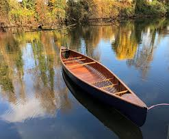
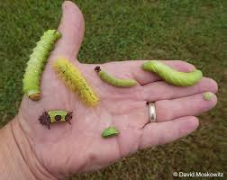
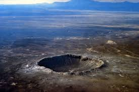
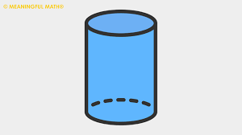
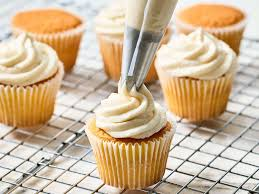
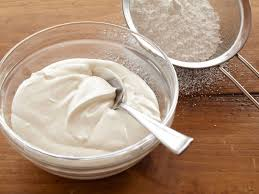
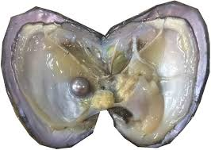
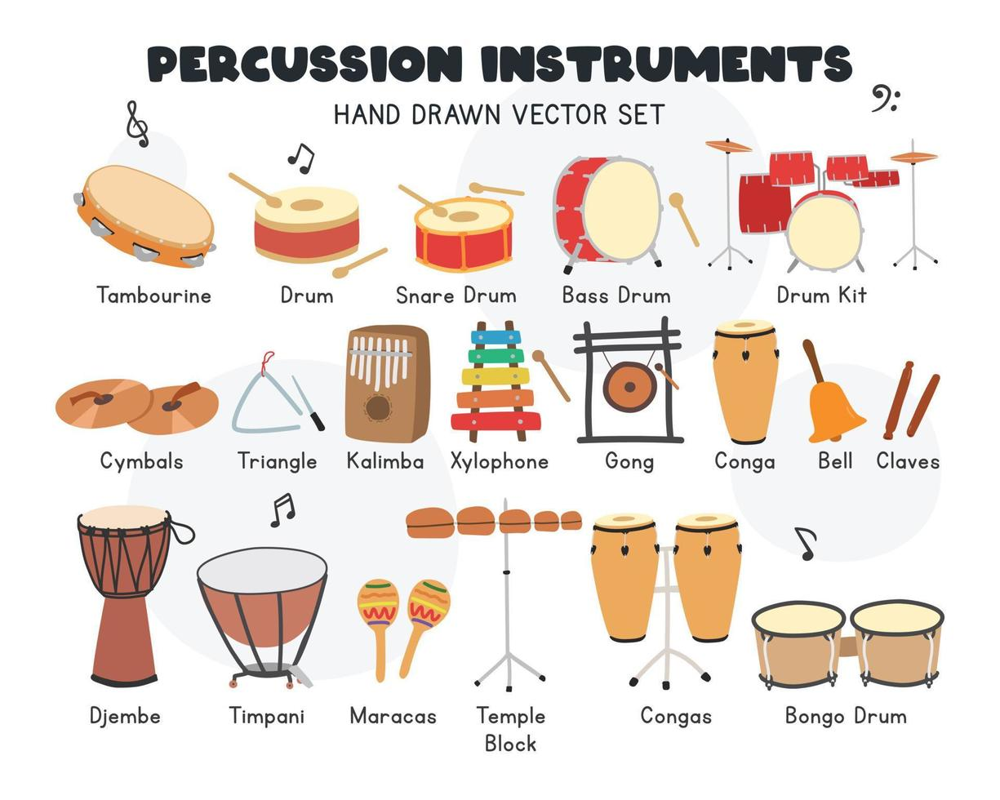
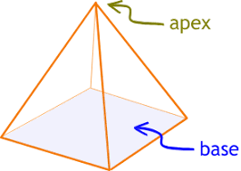
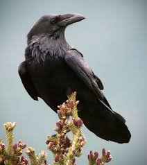

= 21天突破托福词汇 (004)
:toc: left
:toclevels: 3
:sectnums:
:stylesheet: ../../../myAdocCss.css

377开始

'''

==== (0306)→ abroad

.. study abroad (adv.) for a year +
  出国留学一年 ((adv.) to or in a foreign country 在国外，到国外 ▶ a-, 在，向。broad, 宽阔的。)

.. travel abroad frequently +
  经常出国旅行  +

.. have relatives living abroad +
  有亲戚住在国外  +

.. goods from abroad (n.)  +
  来自国外的商品 ((n.) [singular] (formal or old-fashioned) all the countries in the world except your own 外国，海外)  +

.. news from abroad +
  来自海外的消息  +

'''

==== (0307)→ acoustic(al)

.. the acoustic (a.)声音的，听觉的  properties 性质，性能 of a concert 音乐会，演奏会 hall +
  音乐厅的声学特性 ((a.) (especially of music) not using electrical equipment to make the sound louder （尤指音乐）原声的（不使用电声设备扩音） ▶ 源自希腊语 akoustikos, 听觉的，来自 akouein, 听。)

.. an acoustic guitar  + 
(as opposed to an electric one) +
  原声吉他（与电吉他相对）  +

.. acoustic (a.)（音乐）原声的，不经过电声设备放大的 performance +
  原声表演  +

.. acoustic nerve  + 
(the auditory nerve) +
  听觉神经 ((a.) (technical) relating to sound or to the sense of hearing 声音的，听觉的)  +

.. acoustic science +
  声学科学  +

'''

==== (0308)→ affair

.. a complicated legal affair +
  复杂的法律事务 ((n.) an event that you are talking about or describing （需要处理的）事情，事件 ▶ af-, 去，朝向。fair, 做，来自法语 faire。)

.. the Watergate affair  + 
(political scandal) +
  水门事件（政治丑闻）  +

.. mind your own affairs  + 
(business) +
  管好你自己的事  +

.. the Ministry （政府的）部，部办公楼 of Foreign Affairs +
  外交部 ((n.) [pl.] public or political events and activities 公共事务，政治活动)  +

.. current affairs +
  时事  +

.. a state of affairs  + 
(situation) +
  事态，情况 ((n.) [singular] a situation or set of circumstances 状况，事态)  +

'''

==== (0309)→ arbitrary

.. an arbitrary (a.) 任意的，随心所欲的；专横的，武断的 decision with no clear reason +
  一个没有明确理由的武断决定 ((a.) (of an action, a decision, a rule, etc.) not seeming to be based on a reason, system or plan and sometimes seeming unfair （行为、决定、规定等）任意的，武断的，专制的 ▶ 源自拉丁语 arbitrarius, 任意的，来自 arbiter, 仲裁者，词源同 arbiter, -ary。)

.. arbitrary (a.) rules that everyone dislikes +
  人人讨厌的专断规定  +

.. an arbitrary choice +
  随意的选择  +

'''

==== (0310)→ assign

.. assign (v.) homework to the students +
  给学生布置家庭作业 ((v.) to give somebody a particular job or task; to give a particular time, value, place, etc. to something 分配，分派，指派（工作、任务） ▶ as-, 去，朝向。sign, 标记。)

.. assign (v.) roles for the group project +
  为小组项目分配角色  +

.. assign (v.) a cause 原因；事业；理由 to the phenomenon  +
(attribute) +
  把原因归于这个现象（归因于） ((v.) to say that something is caused by a particular thing or person 把…归因于，把…归属于)  +

.. assign the success to hard work +
  将成功归因于努力工作  +

'''

==== (0311)→ axe

.. chop (v.) wood with an axe +
  用斧头劈柴 ((n.) (also ax) a tool with a wooden handle and a heavy metal blade, used for chopping wood, cutting down trees, etc. 斧，斧子 ▶ 源自古英语 æx, 斧。)

.. swing the axe +
  挥动斧头  +

.. the axe fell (v.) on the branch  +
(idiom: to be dismissed from a job) +
  斧头落在树枝上（习语：被解雇）  +

'''

==== (0312)→ basin

.. wash your face in the basin (n.)盆；洗涤槽；流域；盆地 +
  在脸盆里洗脸 ((n.) a large bowl that has taps and is fixed to the wall in a bathroom, used for washing your hands and face in 洗脸池，洗手盆 ▶ 源自拉丁语 bacchinon, 盆，碗。)

.. a basin of water +
  一盆水  +

.. the Amazon basin  + 
(area drained by the river) +
  亚马孙河流域（河流的流域） ((n.) an area of land around a large river with streams running down into it 流域)  +

.. the _drainage (n.) 排水系统；排水 basin_ 流域 of the Yangtze River +
  长江流域  +

'''

==== (0313)→ bison

.. a herd of bison 北美野牛；欧洲野牛 `后定说明` grazing on the plain +
  在平原上吃草的一群野牛 ((n.) a large wild animal of the cow family that is covered with hair. There are two types of bison, the North American (also called buffalo) and the European. （北美或欧洲的）野牛 ▶ 源自拉丁语 bison, 野牛。来自PIE *weis, ##流，散发臭味，词源同virus, 病毒。##指野牛身上流出的腥味。字母r,s音变。

)

.. the American bison  + 
(buffalo) +
  美洲野牛  +

.. _conservation efforts_ to protect the bison +
  保护野牛的努力  +

image:/img/bison.jpg[,20%]

'''

==== (0314)→ bow

.. shoot (v.) an arrow with a bow 弓 and arrow +
  用弓箭射箭 ((n.) a weapon for shooting arrows, consisting of a long curved piece of wood with a tight string joining its ends 弓 ▶ 源自古英语 boga, 弓，拱。)

.. a violin bow 小提琴弓 +
(used to play the strings) +
  小提琴的琴弓（用于拉弦） ((n.) a long thin piece of wood with tight string stretched along it, used for playing musical instruments such as the violin or cello （小提琴等的）弓)  +

image:/img/violin bow.jpg[,20%]

.. draw the bow across the strings +
  用琴弓拉弦  +

.. take a bow 鞠躬，点头；低下（头）  +
(on stage after a performance) +
  鞠躬谢幕（演出结束后在舞台上） ((v.) to move your head or the top half of your body forwards and downwards as a sign of respect or to say hello or goodbye 鞠躬，点头致意)  +

'''

==== (0315)→ bunch

.. a bunch of grapes +
  一串葡萄 ((n.) a number of things of the same type which are growing or fastened together （生长在一起的）束，串，扎 ▶ 词源不确定，可能源自中古英语 bunche, 凸起，捆。)

.. a bunch of flowers/bananas/keys +
  一束花/一串香蕉/一串钥匙  +

.. a great bunch 一伙，一群；大量 of friends  +
(informal: group) +
  一大群好朋友（非正式：一群） ((n.) (informal) a group of people 一群人，一伙人)  +

.. the whole bunch of them +
  他们那一大帮人  +

'''

==== (0316)→ canoe

.. paddle (v.)用桨划（船） a canoe 独木舟，小划子 across the lake +
  划着独木舟穿过湖面 ((n.) a narrow boat with pointed ends that is moved through the water using a paddle 独木舟，小划子 ▶ 源自西班牙语 canoa, 来自加勒比海阿拉瓦克语。)

.. go canoeing (v.)划独木舟，乘独木舟 on the river +
  在河上划独木舟  +

.. a traditional wooden canoe +
  传统的木制独木舟  +

'''

==== (0317)→ caterpillar

.. a green caterpillar 毛虫,蠋（蝴蝶或蛾的幼虫） on a leaf +
  叶子上的绿色毛毛虫 ((n.) a small creature like a worm with legs, that develops into a butterfly or moth. Caterpillars eat the leaves of plants. 毛虫，蠋（蝴蝶或蛾的幼虫） ▶ 源自拉丁语 catta pilosa, 毛茸茸的猫，后演变为现在的形式。#cat, 猫。-pil, 毛，词源同peel, depilatory(脱毛)。因其毛如猫毛而得名。#)

.. watch a caterpillar turn into a butterfly +
  观察毛毛虫变成蝴蝶  +

.. caterpillar damage to crops +
  毛虫对作物的损害  +

'''

==== (0318)→ chapel

.. get married in a small chapel 小礼拜堂，小教堂 +
  在一座小教堂里结婚 ((n.) a small building or room used for Christian worship, for example in a school, prison, large private house, or large church （学校、监狱、私人住宅或大教堂内的）小教堂，祈祷室 ▶ 源自拉丁语 cappella, 小教堂，原指圣马丁斗篷保存处。) +
-> 来自拉丁语cappella（小斗篷），#是cappa（斗篷）的指小形式 同源词：cape（斗篷、披肩）# 单词chapel的本意是“存放圣马丁的斗篷残片的地方”。

.. the college chapel +
  学院的小教堂  +

.. attend (v.) chapel services +
  参加小教堂的礼拜  +

'''

==== (0319)→ clay

.. make pottery out of clay +
  用黏土制作陶器 ((n.) a type of heavy, sticky earth that becomes hard when it is baked and is used to make things such as pots and bricks 黏土，陶土 ▶ 源自古英语 clæg, 黏土。)

.. model (v.)（用黏土、木头等）做……的模型，塑造 the clay into a figure +
  把黏土塑造成人像  +

.. clay soil 泥土，土壤 +
  黏质土壤  +

'''

==== (0320)→ commerce

.. international commerce 贸易，商业 between nations +
  国家间的国际贸易 ((n.) the activity of buying and selling, especially on a large scale 商业，贸易 ▶ 源自拉丁语 commercium, 贸易，商业。来自 com-, 一起。merx, 商品，货物，词源同 merchant, -merce。)

.. electronic commerce  + 
(e-commerce) +
  电子商务  +

.. promote (v.) commerce and industry +
  促进工商业  +

'''

==== (0321)→ concrete

.. a path made of concrete +
  混凝土铺成的小路 ((n.) a very hard building material made by mixing together cement, sand, small stones and water 混凝土，水泥 ▶ con-, 一起。crescere, 生长，词源同 crescent, -ete。)

.. pour (v.) concrete for the foundation 地基，基础 +
  为地基浇筑混凝土  +

.. have _concrete evidence_ to support the claim  +
(solid, definite) +
  有具体证据支持这一说法（确凿的，明确的） ((a.) based on facts, not on ideas or guesses 具体的，确实的，有形的)  +

.. a concrete proposal/plan +
  具体的提议/计划  +

'''

==== (0322)→ conservative

.. hold conservative political views +
  持有保守的政治观点 ((a.) opposed to great or sudden social change; showing that you prefer traditional styles and values 保守的，守旧的 ▶ conserve, 保存。-ative, 形容词后缀。)

.. a conservative 保守的；保守派的 dress style +
  保守的着装风格  +

.. a conservative estimate  + 
(cautious and perhaps low) +
  保守的估计（谨慎的，可能偏低的） ((a.) (of an estimate) lower than what is probably the real amount or number （估计）保守的，低估的)  +

.. make a conservative guess about the cost +
  对成本做一个保守的猜测  +

'''

==== (0323)→ convert

.. convert (v.) sunlight into electricity using solar panels 太阳能电池板  +
  用太阳能电池板将阳光转化为电能 ((v.) to change or make something change from one form, purpose, system, etc. to another （使）转变，转换，转化 ▶ con-, 共同，一起。vertere, 转，词源同 verse, -vert。)

.. *convert* (v.) pounds *to* dollars +
  将英镑兑换成美元  +

.. convert to a different religion  + 
(change one's beliefs) +
  改信不同的宗教（改变信仰） ((v.) to change your religion or beliefs 改变宗教（或信仰），皈依)  +

.. convert to Buddhism +
  皈依佛教  +

'''

==== (0324)→ crater

.. look into the crater （撞击或爆炸形成的）坑，弹坑；火山口；穴，洞 of an active volcano +
  看向一个活火山的火山口 ((n.) a large hole in the top of a volcano 火山口 ▶ 源自希腊语 kratēr, 大碗，混合器，来自 kerannynai, 混合。)

.. the moon's surface is covered with craters +
  月球表面布满了环形山  +

.. a bomb crater left by the explosion +
  爆炸留下的弹坑  +

'''

==== (0325)→ cylinder

.. a gas cylinder 圆柱体，圆筒；汽缸 for cooking +
  烹饪用的煤气罐 ((n.) a solid or hollow figure with round ends and long straight sides 圆柱体，圆筒 ▶ 源自希腊语 kylindros, 滚动物，滚筒。来自 kylindein, 滚动。)

.. the engine's cylinders  + 
(in a car) +
  发动机的气缸（汽车中）  +

.. a cylinder of oxygen +
  氧气瓶  +

'''

==== (0326)→ degrade

.. plastic that degrades (v.) slowly in the environment +
  在环境中缓慢降解的塑料 ((v.) to become or make something become worse, especially in quality （尤指质量）降低，下降，退化 ▶ de-, 向下。grade, 等级，级别。)

.. degrade (v.) the performance of the system +
  降低系统的性能  +

.. feel degraded 降低…身份；侮辱…的人格；使受屈辱 by the humiliating  丢脸的；羞辱性的 treatment  +
(lower in dignity) +
  因受辱而感到尊严受损（降低尊严） ((v.) to treat somebody in a way that makes them lose respect for themselves 侮辱，贬低)  +

.. degrade oneself by lying +
  因撒谎而贬低自己  +

'''

==== (0327)→ determine

.. determine (v.) the cause of the problem +
  确定问题的原因 ((v.) to discover the facts about something; to calculate something exactly 查明，测定，准确算出 ▶ de-, 表强调。terminare, 限定，结束，词源同 term, terminate。)

.. determine the _exact location_ 准确位置 using GPS +
  用GPS确定精确位置  +

.. be determined 下定决心的，坚决的 to succeed  +
(have a firm decision) +
  决心要成功（下定决心） ((v.) to make a firm decision to do something 决定，决心)  +

.. determine to finish the project on time +
  决心按时完成项目  +

'''

==== (0328)→ disperse

.. police *dispersed the crowd* with tear gas +
  警察用催泪瓦斯驱散了人群 ((v.) to move apart and go away in different directions; to make somebody/something do this （使）分散，散开，驱散 ▶ dis-, 分开。spargere, 散播，词源同 sparse, -perse。)

.. the clouds dispersed and the sun came out +
  云散了，太阳出来了  +

.. disperse (v.) seeds over a wide area +
  将种子撒播到广阔的区域 ((v.) to spread or to make something spread over a wide area 散布，散发，传播)  +

'''

==== (0329)→ domain

.. a famous domain 领域，范围；领土，势力范围 in history  +
(territory) +
  历史上著名的领地 ((n.) (formal) an area of territory owned or controlled by a particular ruler or government （领土）领域，领地，势力范围 ▶ 源自拉丁语 dominium, 所有权，领土。来自 dominus, 主人，词源同 dominate, -ain。)

.. the king's domain +
  国王的领土  +

.. the domain of science  + 
(field of knowledge) +
  科学领域（知识领域） ((n.) an area of knowledge or activity; especially one that somebody is responsible for （知识或活动的）领域，范围)  +

.. outside my domain of expertise 专长，专门技能（知识） +
  超出我的专业领域  +

'''

==== (0330)→ earthenware

.. an earthenware (a.)陶制的 pot used for cooking +
  用于烹饪的陶罐 ((n.) pots, dishes, etc. made of baked clay 陶器，瓦器 ▶ earthen, 土制的。ware, 物品，器皿。 -> #earth, 土。ware, 器具。#)

.. decorate (v.) the house with colorful earthenware 陶器 +
  用彩色的陶器装饰房子  +

.. fragile (a.) earthenware plates +
  易碎的陶盘  +

'''

==== (0331)→ embrace

.. embrace an old friend warmly +
  热情地拥抱一位老朋友 ((v.) to put your arms around somebody as a sign of love or friendship 抱，拥抱 ▶ em-, 进入。brace, 手臂，来自拉丁语 bracchium。)

.. the couple 两个，几个；一对夫妇，一对情侣 embraced each other +
  那对恋人彼此拥抱  +

.. embrace new technologies  + 
(accept enthusiastically) +
  欣然接受新技术（热情地接受） ((v.) to accept an idea, a proposal, a set of beliefs, etc., especially when it is done with enthusiasm 欣然接受，乐意采纳（思想、建议等）)  +

.. embrace the opportunity to study abroad +
  欣然接受出国留学的机会  +

'''

==== (0332)→ entity

.. a separate legal entity 实体，独立存在体 +
(like a corporation) +
  独立的法人实体（如公司） ((n.) something that exists separately from other things and has its own identity 独立存在物，实体 ▶ 源自拉丁语 ens, 存在的东西，来自 esse, 是，存在。-ity, 名词后缀。)

.. *regard* (v.) mind and body *as* distinct 不同的，有区别的；清楚的，明显的 entities +
  将心灵和身体视为不同的实体  +

.. a political entity +
  一个政治实体  +

'''

==== (0333)→ evenly

.. *spread* (v.) the icing 糖霜（用以装饰糕饼等）;结冰；糖衣；酥皮 *evenly* (adv.)平均地，均等地 over the cake +
  把糖霜均匀地涂抹在蛋糕上 ((adv.) in a smooth, flat or equal way 平滑地；平坦地；均匀地 ▶ even, 平坦的，均匀的。-ly, 副词后缀。)

[.my3]
.案例
====
.icing
( especially BrE ) ( NAmE usuallyfrost·ing ) [ U]a sweet mixture of sugar and water, milk, butter or egg white that is used to cover and decorate cakes 糖霜（用以装饰糕饼等）

====

.. distribute (v.) the resources evenly among the teams +
  在各队之间平均分配资源  +

.. breathe (v.) evenly and deeply +
  均匀而深长地呼吸  +

'''

==== (0334)→ expressive

.. _an expressive (a.)富于表情的，富于表现力的 face_ that shows many emotions +
  一张表情丰富的脸，能表现出许多情感 ((a.) showing your feelings or thoughts in a clear and obvious way 富于表情的，有表现力的 ▶ express, 表达。-ive, 形容词后缀，表“具有...性质的”。)

.. use _expressive gestures_ while speaking +
  说话时使用富有表现力的手势  +

.. her eyes were expressive (a.) of sadness  +
(showed sadness) +
  她的眼睛里流露出悲伤（显示出悲伤） ((a.) ~ of something (formal) showing something; representing something 表现的，表达的)  +

'''

==== (0335)→ fatal

.. suffer a fatal injury in the accident +
  在事故中遭受致命伤 ((a.) causing or ending in death 致命的，导致死亡的 ▶ 源自拉丁语 fatalis, 命运的，致命的。来自 fatum, 命运，词源同 fate, -al。)

.. a fatal disease/error +
  致命的疾病/错误  +

.. prove fatal to his career  + 
(ruin it completely) +
  对他的职业生涯造成毁灭性打击（彻底毁掉）  +

'''

==== (0336)→ flattering

.. wear _a flattering (a.)奉承的；谄媚的 dress_ that suits (v.)相配；合身;适合；适宜；有利于 her figure +
  穿一件合身且显得漂亮的连衣裙 ((a.) making somebody look more attractive 使人显得更漂亮的 ▶ flatter, 奉承，使显得好看。-ing, 形容词后缀。)

.. a flattering photograph +
  一张拍得好看的照片  +

.. _flattering remarks_ `后定说明` intended to gain (v.) favor 较喜欢；偏袒；有利于 +
  旨在获得好感的奉承话 ((a.) saying nice things about somebody, often in a way that is not sincere, in order to please them or get something from them 奉承的，讨好的，谄媚的)  +

.. ignore (v.)忽视，对…不予理会 his flattering comments +
  无视他奉承的评论  +

'''

==== (0337)→ formation

.. watch the formation of crystals under a microscope +
  在显微镜下观察晶体的形成 ((n.) the action of forming something; the process of being formed 形成，构成，组成 ▶ form, 形成。-ation, 名词后缀。)

.. the formation of a new government +
  新政府的组成  +

.. in _battle formation_ 战斗队形  +
(arrangement of soldiers) +
  以战斗队形（士兵的排列） ((n.) a particular arrangement or pattern 队形，排列方式)  +

.. fly in a V formation  + 
(like geese) +
  以V字形编队飞行（像大雁一样）  +

'''

==== (0338)→ fungus

.. mold is a type of fungus 真菌 that grows on food +
  霉菌是生长在食物上的一种真菌 ((n.) ([pl] fungi /ˈfʌŋɡaɪ/, funguses) any plant without leaves, flowers or green colouring, usually growing on other plants or on decaying matter. Mushrooms and mould are both fungi. 真菌（如蘑菇、霉菌） ▶ 源自拉丁语 fungus, 蘑菇，真菌。)

.. a poisonous (a.) fungus +
  有毒真菌  +

.. fungus infections of the skin +
  皮肤真菌感染  +

'''

==== (0339)→ genus

.. classify (v.) the animal within its genus 类，种；[生物] 属 and species +
  将这种动物按属和种进行分类 ((n.) (biology) a group into which animals, plants, etc. that have similar characteristics are divided, smaller than a family and larger than a species （生物分类上的）属 ▶ 源自拉丁语 genus, 种类，类别，出生。)

.. the genus Panthera 豹属 includes lions, tigers, and leopards 豹 +
  豹属包括狮子、老虎和豹子  +

.. a _new genus of insects_ was discovered +
  发现了一个新的昆虫属  +

'''

==== (0340)→ granite

.. a kitchen countertop 工作台面 made of granite 花岗岩；坚毅；冷酷无情 +
  花岗岩做的厨房台面 ((n.) a type of hard grey stone, often used in building 花岗岩，花岗石 ▶ 源自意大利语 granito, 颗粒状的，来自 grano, 谷物，词源同 grain, -ite。)

.. the mountains are composed of granite +
  这些山是由花岗岩构成的  +

.. a granite monument +
  花岗岩纪念碑  +

'''

==== (0341)→ hardness

.. test (v.) the hardness of the metal with a special tool +
  用特殊工具测试金属的硬度 ((n.) the quality of being difficult to bend, cut or break 坚硬，硬度 ▶ hard, 坚硬的。-ness, 名词后缀，表性质或状态。)

.. the hardness of a diamond +
  钻石的硬度  +

.. the hardness [物] 硬度；坚硬；困难；冷酷 of his heart  +
(lack of sympathy) +
  他心肠的冷酷（缺乏同情心） ((n.) the quality of being severe and unfeeling 冷酷，严厉)  +

'''

==== (0342)→ hesitate

.. *hesitate (v.) for a moment* before answering +
  在回答前犹豫了一下 ((v.) to be slow to speak or act because you feel uncertain or nervous 犹豫，踌躇 ▶ 源自拉丁语 haesitare, 粘着，犹豫。来自 haerere, 粘着，词源同 adhere, -ate。)

.. don't hesitate *to ask for help* if you need it +
  如果你需要帮助，请不要犹豫  +

.. hesitate between two choices +
  在两个选择间犹豫不决  +

'''

==== (0343)→ humidity

.. high humidity (n.)潮湿，湿气；湿度 makes the heat feel worse +
  高湿度使炎热感觉更难受 ((n.) the amount of water in the air 湿度，潮湿 ▶ humid, 潮湿的。-ity, 名词后缀。)

.. measure (v.) the humidity in the room +
  测量房间的湿度  +

.. _tropical 热带的，热带地区的 climate_ with high humidity +
  湿度高的热带气候  +

'''

==== (0344)→ immigrant

.. an immigrant (n.)（外来）移民，侨民 from Europe `后定说明` seeking a better life +
  来自欧洲寻求更好生活的移民 ((n.) a person who has come to live permanently in a country that is not their own （外来）移民，侨民 ▶ im-, 进入。migrate, 迁移。-ant, 表示“人”。)

.. illegal (a.) immigrants +
  非法移民  +

.. the immigrant population in the city +
  城市中的移民人口  +

.. immigrant (a.)移民的，迁入的 communities +
  移民社区 ((a.) 移民的)  +

'''

==== (0345)→ incongruous

.. modern furniture looks incongruous (a.)不协调的；不一致的；不和谐的 in a classical building +
  现代家具放在古典建筑里显得不协调  +
((a.) strange, and not suitable in a particular situation 不合适的，不协调的，不一致的 ▶ in-, 不。congruous, 一致的，协调的，来自 con-, 共同。gruere, 同意，一致。)

.. an incongruous (a.) mix of styles +
  不协调的风格混合  +

.. his _casual clothes_ were incongruous (a.) at the formal dinner +
  他的便装在正式晚宴上显得格格不入  +

'''

==== (0346)→ injury

.. suffer (v.)  a serious injury in a car crash +
  在车祸中受重伤 ((n.) harm done to a person's or an animal's body, for example in an accident （对躯体的）伤害，损伤 ▶ 源自拉丁语 injuria, 错误，伤害。来自 in-, 不。jus, 法律，权利，词源同 just, -jury。)

.. head/back injury +
  头部/背部损伤  +

.. do oneself an injury  + 
(hurt oneself) +
  使自己受伤  +

.. *add* insult 侮辱，冒犯 *to* injury  +
(make a bad situation worse) +
  雪上加霜，伤害之外又加侮辱（使情况更糟） ((n.) harm or damage to somebody's feelings or to their reputation （对感情的）伤害，挫伤)  +

'''

==== (0347)→ integrate

.. *integrate* (v.)（使）合并，成为一体 theory *with* practice +
  将理论与实践相结合  +
((v.) to combine two or more things so that they work together; to combine with something else in this way （使）合并，成为一体 ▶ integer, 完整的。-ate, 动词后缀。)

.. integrate (v.) immigrants into society  +
(make them part of it) +
  使移民融入社会（使他们成为社会的一部分） ((v.) ~ sb (into/with sth) |~ A and B
 |~ A with B :to become or make somebody become accepted as a member of a social group, especially when they come from a different culture （使）加入，融入群体)  +

.. the school integrates (v.) students `后定说明` with and without disabilities +
  这所学校融合了有残疾和没有残疾的学生  +

'''

==== (0348)→ investigate

.. police investigate (v.) the cause of the fire +
  警方调查火灾原因 ((v.) to carefully examine the facts of a situation, an event, a crime, etc. to find out the truth about it or how it happened 调查，审查 ▶ in-, 进入。vestigare, 追踪，调查。来自 vestigium, 足迹，词源同 vestige, -ate。)

.. investigate (v.) a complaint +
  调查投诉  +

.. scientists investigate (v.) the effects of the drug +
  科学家研究药物的效果 ((v.) to try to find out information about somebody's character, activities, etc. 调查（某人）)  +

'''

==== (0349)→ Jupiter

.. Jupiter is the largest planet in our solar system +
  木星是我们太阳系中最大的行星 ((n.) the planet that is fifth in order from the sun and is the largest in the solar system 木星 ▶ 源自拉丁语 Jupiter, 朱庇特（罗马神话中的主神）。)

.. observe (v.) Jupiter through a telescope +
  通过望远镜观察木星  +

.. the moons of Jupiter +
  木星的卫星  +

.. in Roman mythology, Jupiter was the king of the gods  + 
((n.) (in Roman mythology) the king of the gods 朱庇特（罗马神话中的主神）)  +

'''

==== (0350)→ launch

.. launch (v.) a satellite into orbit +
  将卫星发射入轨 ((v.) to send something such as a spacecraft, weapon, etc. into space, into the sky or through water 发射，投射（航天器、武器等） ▶ 源自盎格鲁-诺曼语 launcher, 投掷。)

.. launch a missile from a submarine +
  从潜艇发射导弹  +

.. launch a new product on the market  + 
(introduce) +
  向市场推出一款新产品（推出） ((v.) to start an activity, especially an organized one 开始从事，发起，发动（尤指有组织的活动）)  +

.. launch an attack/an investigation/a campaign +
  发动攻击/展开调查/发起运动  +

'''

==== (0351)→ limb

.. stretch one's limbs /after sitting for hours +
  坐了几个小时后伸展一下四肢 ((n.) an arm or a leg; a similar part of an animal, such as a wing 肢，臂，腿，翼 ▶ 源自古英语 lim, 肢。)

.. an artificial limb  + 
(prosthetic) +
  假肢（义肢）  +

.. break a limb in a fall +
  跌倒时摔断一条肢体  +

.. climb out 爬升 on a limb of the tree  +
(also: take a risk) +
  爬到一根树枝上（也指：冒险） ((n.) a large branch of a tree 大树枝，粗枝)  +

'''

==== (0352)→ longing

.. a longing (n.)渴望，热望 for home  +
(feeling of wanting to be back home) +
  对家乡的思念（想要回家的感觉） ((n.) a strong feeling of wanting something or someone 渴望，盼望，向往 ▶ long, 渴望。-ing, 名词后缀。)

.. a deep longing (n.) for peace +
  对和平的深切渴望  +

.. with longing (n.) in his eyes +
  眼中带着渴望  +

.. a longing (a.)渴望的 look at the chocolate cake  +
(showing desire) +
  渴望地看着巧克力蛋糕（显示出渴望） ((a.) (literary) having or showing a strong desire 渴望的，热望的)  +

'''

==== (0353)→ majestic

.. a majestic (a.)雄伟的，壮丽的，威严的 _mountain range_ 山脉 against the sky +
  衬托着天空的雄伟山脉 ((a.) impressive because of size or beauty 雄伟的，庄严的，壮丽的 ▶ majesty, 雄伟，庄严。-ic, 形容词后缀。)

.. a majestic (a.)  eagle soaring overhead +
  在头顶翱翔的雄鹰  +

.. _the majestic sound_ of a symphony 交响乐 orchestra （大型的）管弦乐队 +
  交响乐团雄壮的声音  +

'''

==== (0354)→ maximum

.. reach the maximum speed `后定说明` allowed on the highway +
  达到高速公路允许的最高速度  +
((a.) as large, fast, etc. as is possible; the greatest that is possible or allowed 最高的，最大的，顶点的 ▶ 源自拉丁语 maximus, 最大的。)

.. the maximum temperature `后定说明` recorded today +
  今天记录到的最高温度  +

.. achieve (v.) maximum efficiency +
  达到最高效率  +

.. a maximum of three guests are allowed  + 
(the greatest amount) +
  最多允许三位客人（最大数量） ((n.) the greatest amount, size, speed, etc. that is possible, recorded or allowed 最大量，最大限度，最高极限)  +

'''

==== (0355)→ meticulously

.. meticulously 细致地；一丝不苟地；拘泥地 clean every corner of the room +
  一丝不苟地打扫房间的每个角落 ((adv.) in a way that pays careful attention to every detail 一丝不苟地，细致地，小心翼翼地 ▶ meticulous, 一丝不苟的。-ly, 副词后缀。 #来自拉丁语metus,恐惧，害怕，忧虑。即充满恐惧的，后引申词义谨慎的，小心翼翼的。#
 )

.. plan (v.) the project meticulously +
  细致地规划这个项目  +

.. meticulously organized (a.) files +
  整理得井井有条的文件  +

'''

==== (0356)→ mode

.. *switch* the camera *to* manual mode +
  将相机切换到手动模式 ((n.) a particular way of doing something; a particular type of something 方式，风格，样式 ▶ 源自拉丁语 modus, 方式，尺度。)

.. a mode of transportation 运输，运送；交通运输系统；运输工具，交通方式  +
(bus, train, etc.) +
  一种交通方式（巴士、火车等）  +

.. _the most popular mode_ of communication +
  最流行的沟通方式  +

.. be in a happy mode  + 
(mood or state) +
  处于开心的状态 ((n.) (formal) the way somebody is feeling or the way they behave at a particular time 状态，状况)  +

'''

==== (0357)→ motif

.. a floral motif (n.)装饰图案；装饰图形 on the wallpaper +
  墙纸上的花卉图案 ((n.) a design or a pattern used as a decoration 装饰图案，装饰图形 ▶ 源自法语 motif, 动机，主题。#来自motive的法语拼写形式。# )

.. _a recurring  反复出现，再次发生 motif_ （文学作品或音乐的）主题， 主旨， 动机 in the artist's work  +
(repeated theme) +
  艺术家作品中反复出现的主题（反复出现的主题） ((n.) a subject, an idea or a phrase that is repeated and developed in a work of literature or a piece of music （文学、艺术的）主题，中心思想)  +

.. the love motif in the novel +
  小说中的爱情主题  +

'''

==== (0358)→ nectar

.. bees collect (v.) nectar 花蜜；果汁 from flowers to make honey +
  蜜蜂从花朵中采集花蜜来酿蜜 ((n.) the sweet liquid that is produced by flowers and collected by bees for making honey 花蜜 ▶ 源自希腊语 nektar, 神饮。)

.. hummingbirds 蜂鸟 feed (v.)饲养，喂养，为…提供食物；以…为食物，吃食 on nectar +
  蜂鸟以花蜜为食  +

.. the nectar of a peach  +
(sweet juice) +
  桃子的甜美汁液  +

'''

==== (0359)→ notice

.. *take notice 注意,留心 of* the warning signs +
  注意警告标志 ((n.) the fact of somebody paying attention to somebody/something or knowing about something 注意，察觉，理会 ▶ 源自拉丁语 notitia, 认识，消息，来自 noscere, 知道，词源同 note, notion。)

.. bring something to someone's notice  + 
(make them aware of it) +
  使某人注意到某事  +

.. *give notice 通知，告知 of* one's resignation  +
(announce formally) +
  发出辞职通知（正式宣布） ((n.) a formal letter or statement saying that you will or must leave your job or house at the end of a particular period of time 通知，预告，辞呈)  +

.. *hand in* 提交 one's notice +
  提交辞呈  +
(*#hand sth←→ˈin (to sb)#* : ( BrE also also ˌ##**give sth ˈin (to sb)**## ) to give sth to a person in authority, especially a piece of work or sth that is lost 提交，呈交，上交（尤指书面材料或失物）)

.. notice (v.) a small change in his behavior  +
(see or become aware of) +
  注意到他行为上的细微变化（看到或意识到） ((v.) to see or become aware of somebody/something 看（或听）到，注意到，意识到)  +

'''

==== (0360)→ odor

.. a pleasant odor 气味；名声 of fresh bread +
  新鲜面包的怡人气味 ((n.) (especially American English) a smell, especially one that is unpleasant （尤指难闻的）气味，臭味 ▶ 源自拉丁语 odor, 气味。)

.. the odor of garbage from the alley 小巷，胡同 +
  从小巷传来的垃圾臭味  +

.. body odor +
  体味  +

.. be in good odor with someone  + 
(be in favor) +
  受到某人好评（受青睐） ((n.) [U] (formal) reputation 名声，声誉)  +

'''

==== (0361)→ organic

.. buy organic 有机的，绿色的 vegetables from the farm +
  从农场购买有机蔬菜 ((a.) (of food, farming methods, etc.) produced or practised without using artificial chemicals （食物、耕作方式等）有机的，不使用化肥的，绿色的 ▶ organ, 器官。-ic, 形容词后缀。)

.. organic farming +
  有机农业  +

.. the _organic 有机物的；生物的,器官的 structure_ of the body  +
(related to organs) +
  身体的有机结构（与器官相关的） ((a.) (of a living thing or its parts) produced by or coming from living things （生物或其组成部分）有机的，生物的)  +

.. organic matter 有机物 in the soil +
  土壤中的有机质  +

.. the growth was organic 逐渐的；演进的；自然的, not planned  +
(developing naturally) +
  这种增长是自然的，而非计划的（自然发展的） ((a.) [usually before noun] happening or developing in a natural and continuous process 自然发展的，演进的)  +

'''

==== (0362)→ oyster

.. eat (v.) fresh oysters 牡蛎 on the half shell +
  吃新鲜的生蚝 ((n.) a large flat shellfish. Some types of oyster are eaten as food, and others produce shiny white jewels called pearls. 牡蛎，蚝 ▶ 源自希腊语 ostreon, 牡蛎。)

.. cultivate (v.) pearls in oysters +
  在牡蛎中养殖珍珠  +

.. the world is your oyster  + 
(idiom: you can achieve anything) +
  世界是你的牡蛎（习语：你可以成就任何事, 世界是属于你的）  +

'''

==== (0363)→ patch

.. sew (v.) a patch on the torn 撕碎，撕裂；撕破，划破 jeans +
  在破洞的牛仔裤上缝一块补丁 ((n.) a small area of something, especially one which is different from the area around it （与周围不同的）斑，小块 ▶ 词源不确定，可能与 piece 有关。)

.. a damp patch on the wall +
  墙上的一块湿斑  +

.. _a patch of blue sky_ between the clouds +
  云层间的一小块蓝天  +

.. *go through* a rough patch 一段（艰难）岁月；一段（痛苦）日子  +
(difficult period) +
  经历一段困难时期（困难时期） ((n.) (informal) a difficult or unhappy period of time 一段（艰难或不幸的）时期)  +

.. a bad patch in his life +
  他人生中的一段低潮期  +

'''

==== (0364)→ percussion

.. play percussion 打击乐器，敲击乐器 in the band  +
(drums, etc.) +
  在乐队中演奏打击乐器（鼓等） ((n.) musical instruments that you play by hitting them with your hand or with a stick, for example drums 打击乐器 ▶ 源自拉丁语 percutere, 敲击。来自 per-, 完全。quatere, 摇动，打击。)

.. the percussion section of the orchestra +
  管弦乐队的打击乐组  +

.. a percussion instrument  + 
(like a tambourine) +
  一件打击乐器（如铃鼓）  +

'''

==== (0365)→ physicist

.. a theoretical physicist `后定说明` working on quantum mechanics +
  研究量子力学的理论物理学家 ((n.) a scientist who studies physics 物理学家，物理学研究者 ▶ physics, 物理学。-ist, 表示“从事...的人”。)

.. a nuclear physicist +
  核物理学家  +

.. consult (v.) with a physicist about the experiment 实验，试验 +
  就实验咨询物理学家  +

'''

==== (0366)→ plot

.. uncover (v.) a plot to assassinate the leader +
  揭露刺杀领导人的阴谋 ((n.) a secret plan by a group of people to do something harmful or illegal 密谋，阴谋 ▶ 词源不确定，可能与 complot 有关。)

.. hatch (v.) 孵化，孵出；密谋，策划 a plot against the government +
  策划反政府的阴谋  +

.. the plot 阴谋，密谋；情节 of the novel  +
(storyline) +
  小说的情节（故事情节） ((n.) the series of events which form the story of a novel, play, film, etc. （小说、戏剧、电影等的）情节)  +

.. a complicated plot with many twists 转动；旋转;（故事或情况的）转折，转变，突然变化 +
  有许多转折的复杂情节  +

.. *plot (v.)（在地图上）画出，标出；构思（情节）；绘制（曲线） a graph* on paper  +
(mark points and draw lines) +
  在纸上绘制图表（标点连线） ((v.) to mark something on a map, for example the position or course of something 绘制（曲线图），在图上标出)  +

.. *plot (v.)  a course* across the ocean +
  绘制横渡海洋的航线  +

.. *plot with others* to steal the money  +
(plan secretly) +
  与他人密谋偷钱（秘密计划） ((v.) to make a secret plan to harm somebody 密谋，暗中策划)  +

'''

==== (0367)→ portray

.. portray (v.) 描绘，描写 a historical figure in a movie +
  在电影中饰演一位历史人物 ((v.) to show somebody/something in a picture; to describe somebody/something in a piece of writing 描绘，描画，描写 ▶ por-, 向前。traire, 拉，画，词源同 draw, trace。)

.. the painting portrays (v.) a peaceful village scene +
  这幅画描绘了一个宁静的村庄景象  +

.. portray (v.) him as a hero  +
(represent or describe in that way) +
  把他描绘成英雄（那样表现或描述） ((v.) ~ sb/sth (as sb/sth) to describe or show somebody/something in a particular way, especially when this does not give a complete or accurate impression of what they are like （尤指以不准确或带有偏见的方式）描绘，描述，表现)  +

.. the media `谓` often portrays (v.) immigrants negatively +
  媒体常常负面地描绘移民  +

'''

==== (0368)→ predator

.. the lion is _an apex 顶点，最高点 predator_ at the top of the food chain +
  狮子是位于食物链顶端的顶级捕食者 ((n.) an animal that kills and eats other animals 捕食性动物，食肉动物 ▶ 源自拉丁语 praedator, 掠夺者。来自 praedari, 掠夺，词源同 prey, -or。)

[.my3]
.案例
====
.apex
the top or highest part of sth 顶点；最高点

发音释义：['eɪpeks] n. 顶点；尖端 词源解析：apex←拉丁语apex（顶点） 趣味记忆：apex→联想APEC（亚太经济合作组织）→APEC峰会→顶点 衍生词：apical（顶点的、舌尖音）

====

.. birds of prey 猛禽,食肉鸟类 are predators +
  猛禽是捕食者  +

[.my3]
.案例
====
.Birds of prey

- prey​ = 猎物（名词）/ 捕食（动词）
- of prey​ = 介词短语作定语，字面是“属于猎物的”或“*涉及猎食的*”，用来形容这类鸟的特性。 +
#*使用 “of + 抽象名词” 的结构，来定义这类鸟的核心属性是“捕食”。*#

- “#Birds of prey#” 字面直译是：
“#*涉及猎食的, 以猎物为食的鸟*#”​ 或 “捕猎的鸟”。

#*“Birds of prey” 这个结构，相当于 “birds that take/catch prey”​ （捕食猎物的鸟）。介词 “of”​ 在这里表示 “具有……特性”​ 或 “关于……”。*#

类似的英文短语结构还有：
- Beast of burden​ = 负担重物的野兽 → 役畜（如牛、马）
- Man of honor​ = 具有荣誉的人 → 君子
- A matter of importance​ = 具有重要性的事情 → 要事

_Birds of prey_, or raptors, are carnivorous birds—including eagles, hawks, falcons, and owls—defined by their hunting prowess, using keen eyesight, sharp talons, and hooked beaks to hunt vertebrates or scavenge.

猛禽，或称猛禽，是食肉鸟类——包括鹰、隼、猎鹰和猫头鹰 ——它们以卓越的狩猎能力著称，利用敏锐的视力、锋利的爪子, 和钩状的喙, 来捕猎脊椎动物, 或以腐肉为食。
====

.. protect (v.) the sheep from predators +
  保护羊群免受捕食者侵害  +

.. a corporate (a.)公司的；法人的；共同的，全体的 predator  +
(company that takes over others) +
  企业掠夺者（收购其他公司的企业）  +
((n.) (disapproving) a person or an organization that uses weaker people for their own advantage 剥削者，掠夺者)  +

'''

==== (0369)→ principal

.. _the principal 最重要的，首要的；本金的，母金的 reason_ for the failure was lack of funding  专款，拨款 +
  失败的主要原因是缺乏资金 ((a.) [only before noun] most important; main 最重要的，主要的 ▶ 源自拉丁语 principalis, 主要的，第一的。来自 princeps, 第一的，词源同 prince, -al。)

.. the principal character 主要角色 in the story +
  故事中的主角  +

.. one of the country's principal cities +
  该国的主要城市之一  +

.. the school principal (n.)<美>（美国公立中小学的）校长 +
(head teacher) +
  学校校长（校长） ((n.) the person who is in charge of a school or college 校长，院长)  +

.. meet (v.) with the principal to discuss the issue +
  与校长会面讨论这个问题  +

'''

==== (0370)→ pronounced

.. have a _pronounced (a.)显著的；很明显的；表达明确的 accent_ from the South +
  带有明显的南方口音 ((a.) very obvious, easy to notice or strongly expressed 明显的，显著的，明确的 ▶ pronounce, 发音。-ed, 形容词后缀。引申为“说出来的”，即明显的。)

.. _a pronounced difference_ in their opinions +
  他们意见上的明显差异  +

.. _a pronounced tendency_ to exaggerate (v.)夸大，言过其实；使扩大 +
  明显的夸张倾向  +

'''

==== (0371)→ publication

.. the monthly publication of the magazine +
  杂志的每月发行 ((n.) [U] the act of printing a book, a magazine, etc. and making it available to the public; the process of being published 出版，发表，公布 ▶ public, 公开的。-ation, 名词后缀。)

.. the _publication date_ of the new novel +
  新小说的出版日期  +

.. a list of his academic publications 出版物 +
(books, papers, etc.) +
  他的学术出版物清单（书籍、论文等） ((n.) [C] a book, magazine, etc. that has been published 出版物，书刊)  +

.. a respected scientific publication +
  一本受人尊敬的科学刊物  +

'''

==== (0372)→ race

.. win (v.) the 100-meter race in the Olympics +
  赢得奥运会100米赛跑 ((n.) a competition between people, animals, vehicles, etc. to see which one is the faster or fastest 赛跑，速度竞赛 ▶ 源自古 Norse rās, 奔跑，急流。)

.. a horse race +
  赛马  +

.. enter the race 竞争，角逐 for mayor  +
(competition) +
  参加市长竞选（竞争） ((n.) a situation in which a number of people, groups, organizations, etc. are competing, especially for political power （尤指对政治权力的）竞争，角逐)  +

.. the _arms 武装；配备 race_ 军备竞赛 between nations +
  国家间的军备竞赛  +

.. people of different races and cultures +
  不同种族和文化的人们 ((n.) [C, U] one of the main groups that humans can be divided into according to their physical differences, for example the colour of their skin 人种，种族)  +

.. racial discrimination 歧视，区别对待；区分 +
  种族歧视  +

'''

==== (0373)→ raven

.. a large black raven 渡鸦（羽毛黑色，鸣声刺耳） `后定说明` perched (v.)栖息 on the fence 篱笆，栅栏，围栏 +
  一只停栖在篱笆上的黑色大乌鸦  +
((n.) a large bird of the crow family, with shiny black feathers and a rough, unpleasant call 渡鸦，大乌鸦 ▶ 源自古英语 hræfn, 乌鸦。  ##-rav-抓 + -en动词词尾. 来自 rapere,抓走，夺走，词源同 rape,##ravish.后引申词义饥饿，狼吞虎咽。 )

.. in some cultures, the raven is a symbol of wisdom 智慧，才智 or death +
  在一些文化中，渡鸦是智慧或死亡的象征  +

.. the raven's croak 呱呱叫声；低沉沙哑的说话声 +
  渡鸦的叫声  +

'''

==== (0374)→ recover

.. recover (v.)找回；寻回；找到 stolen goods from the thief +
  从小偷那里追回被盗物品 ((v.) to get back something that was lost or stolen 找回，重新得到（丢失或被盗之物） ▶ re-, 重新。cover, 覆盖，获得。)

.. recover the lost data from the damaged hard drive +
  从损坏的硬盘中恢复丢失的数据  +

.. recover from a serious illness  + 
(get better) +
  从重病中康复（好转） ((v.) ~ (from something) to get well again after being ill, hurt, etc. 恢复健康，康复)  +

.. recover (v.) from the shock of the news +
  从那个消息的震惊中恢复过来  +

.. the economy is recovering from the recession （经济的）衰退（期） +
  经济正在从衰退中复苏 ((v.) (of a country, economy, etc.) to return to a normal state after a period of trouble or difficulty （国家、经济等）恢复，复苏)  +

'''

==== (0375)→ regular

.. keep _regular hours_ 正常工作时间 +
(same time every day) +
  作息规律（每天同一时间）;过有规律的生活   +
((a.) happening or doing something often, especially at the same time each week, day, etc. 定时的，定期的，规律的 ▶ 源自拉丁语 regularis, 规则的。来自 regula, 直尺，规则，词源同 rule, -ar。)

.. have a regular check-up 检查，核对；体格检查 with the doctor +
  定期做身体检查  +

.. a regular customer 常客 at the café  +
(frequent) +
  咖啡馆的常客（频繁的） ((a.) happening or doing something often 经常的，频繁的)  +

.. a regular pulse 规则脉，整齐脉 /rhythm 节奏，韵律，节拍 +
(steady and even) +
  规律的脉搏/节奏（平稳均匀的） ((a.) following a pattern, especially with the same time and space in between each thing and the next 匀称的，均匀的)  +

.. regular 规则的；有规律的；间隙均匀的；定时的 teeth +
  整齐的牙齿  +

'''

==== (0376)→ render

.. render (v.)使成为；使变得；使处于某状态 the building in a modern style  +
(depict in art) +
  以现代风格, 描绘这栋建筑（用艺术描绘）  +
((v.) (formal) to cause somebody/something to be in a particular state or condition 使成为，使变得，使处于某状态 ▶ 源自古法语 rendre, 归还，给予。来自拉丁语 reddere。)

.. the shock rendered 使成为；使变得；使处于某状态 him speechless +
  震惊使他哑口无言  +

.. render the fat 脂肪 from the meat  +
(melt it) +
  从肉中熬出油脂（融化它） ((v.) to give somebody something, especially in return for something or because it is expected 给予，提供，提交)  +

.. *render* (v.)递交；呈献；提交 assistance 帮助，援助 *to* those in need +
  向需要帮助的人提供援助  +

.. render (v.)表达；表演；演示 _an account 描述，报道 of_ the events  +
(give a description) +
  描述事件的经过（给出描述） ((v.) (formal) to express or perform something 表达，表演，演奏)  +

'''

==== (0377)→ reserve

.. a nature reserve 自然保护区 for protecting wildlife +
  保护野生动物的自然保护区 ((n.) a piece of land that is a protected area for animals, plants, etc. （动植物）保护区，自然保护区 ▶ re-, 回，向后。servare, 保持，词源同 serve, conserve。)

.. a forest reserve 自然保护区 +
  森林保护区  +

.. keep some money in reserve 储备（量），储藏（量） for emergencies 紧急情况 +
(as a backup) +
  留一些钱以备不时之需（作为备用） ((n.) [C, usually pl., U] a supply of something that is available to be used in the future or when it is needed 储备（量），储藏（量）)  +

.. oil reserves 储量 +
  石油储量  +

.. reserve 预订，预约 a table at the restaurant 餐厅 +
(book in advance) +
  在餐厅预订一张桌子（提前预订） ((v.) to ask for a seat, table, room, etc. to be available for you or somebody else at a future time 预订，预约)  +

.. reserve 保留，预留 judgment 判断 until more facts 事实 are known +
(delay) +
  在了解更多事实之前暂不做出判断（延迟） ((v.) to keep something for somebody/something, so that it cannot be used by any other person or for any other reason 保留，预留)  +

'''

==== (0378)→ retrieve

.. retrieve 取回，索回，找回 a lost file 文件 from the computer 电脑 +
  从电脑中检索丢失的文件 ((v.) to bring or get something back, especially from a place where it should not be 取回，索回，找回 ▶ re-, 重新。trieve, 找到，来自古法语 trover。)

.. dogs 狗 are trained 训练 to retrieve 捡回 game 猎物 for hunters 猎人 +
  狗被训练为猎人捡回猎物  +

.. retrieve 捡回 the ball 球 that went over the fence 篱笆 +
  捡回越过篱笆的球  +

.. retrieve 扭转颓势，挽回 the situation 局面 +
(make it right again) +
  挽回局面（使其恢复正常） ((v.) to make a bad situation better; to get back something that was lost 扭转颓势，挽回)  +

'''

==== (0379)→ roam

.. roam 漫步，闲逛，游荡 the streets 街道 at night 夜晚 +
  在夜晚的街道上游荡 ((v.) to walk or travel around an area without any definite aim or direction 漫步，闲逛，游荡 ▶ 词源不确定，可能与 ramble 有关。)

.. cattle 牛 roaming 漫步 freely 自由地 in the field 田野 +
  在田野里自由漫步的牛  +

.. let your imagination 想象力 roam 漫游 +
(wander freely) +
  让你的想象力自由驰骋（自由漫游） ((n.) an act of roaming 漫步，漫游)  +

'''

==== (0380)→ rust

.. iron 铁 gates 大门 that have begun 开始 to rust 生锈 +
  开始生锈的铁门 ((v.) to become covered with rust 生锈 ▶ 源自古英语 rūst, 锈。)

.. the old bicycle 自行车 rusted 生锈 in the rain 雨 +
  旧自行车在雨中生了锈  +

.. a rust-colored 铁锈色的 stain 污渍 +
(reddish-brown color) +
  铁锈色的污渍（红褐色） ((n.) a reddish-brown substance 物质 that is formed 形成 on some metals 金属 by the action 作用 of water 水 and air 空气 锈，铁锈)  +

.. covered 覆盖 in rust 锈 +
  锈迹斑斑  +

'''

==== (0381)→ schedule

.. schedule 安排，为…安排时间 a meeting 会议 for next Monday 下周一 +
(plan for a time) +
  为下周一安排一次会议（计划时间） ((v.) to arrange for something to happen at a particular time 安排，为…安排时间 ▶ 源自拉丁语 schedula, 小纸片，来自希腊语 skhidē, 纸莎草纸。)

.. the train 火车 is scheduled 定于 to arrive 到达 at 3 p.m. 下午三点 +
  火车定于下午3点到达  +

.. a busy 繁忙的 work schedule 工作计划，日程安排 +
(timetable) +
  繁忙的工作日程表（时间表） ((n.) a plan that lists all the work that you have to do and when you must do each thing 工作计划，日程安排)  +

.. ahead of/behind schedule 计划 +
  提前/落后于计划  +

.. the conference 会议 schedule （公共汽车、火车等的）时刻表 +
(list of events) +
  会议日程表（活动清单） ((n.) a list of the times when events 事件 are planned 计划 to happen 发生，especially 尤其 the times when buses 公共汽车, trains 火车, etc. leave 离开 and arrive 到达 （公共汽车、火车等的）时刻表)  +

'''

==== (0382)→ sediment

.. sediment 沉淀物 settles 沉淀 at the bottom 底部 of the wine bottle 酒瓶 +
  沉淀物沉淀在酒瓶底部 ((n.) the solid 固体的 material 物质 that settles 沉降 at the bottom 底部 of a liquid 液体 沉淀物，沉渣 ▶ 源自拉丁语 sedimentum, 沉降物。来自 sedere, 坐，词源同 sedentary, -ment。)

.. river 河流 sediment 沉积物 +
(silt, sand) +
  河流沉积物（淤泥、沙子）  +

.. layers 层 of sediment 沉积物 in the rock 岩石 +
(geological deposits) +
  岩石中的沉积层（地质沉积物）  +

'''

==== (0383)→ shaft

.. a shaft 光束，光柱 of sunlight 阳光 breaking through 穿透 the clouds 云层 +
  一道阳光穿透云层 ((n.) a narrow 狭窄的 beam 光束 of light 光 光束，光柱 ▶ 源自古英语 sceaft, 杆，矛，光束。)

.. a mine 矿井 shaft （电梯的）升降机井，（煤矿的）竖井 +
(vertical tunnel) +
  矿井（垂直隧道） ((n.) a long 长的, narrow 狭窄的, usually 通常 vertical 垂直的 passage 通道 in a building 建筑物 or underground 地下, for example 例如 for a lift 电梯 or a mine 矿井 （电梯的）升降机井，（煤矿的）竖井)  +

.. descend 下降 into the shaft 竖井 +
  下降到竖井里  +

'''

==== (0384)→ shuttle

.. a shuttle 穿梭航班（或班车、火车） bus 公共汽车 service 服务 between the airport 机场 and the hotel 酒店 +
  机场和酒店之间的穿梭巴士服务 ((n.) a plane 飞机, bus 公共汽车 or train 火车 that travels 行驶 regularly 定期地 between two places 两个地方 穿梭航班（或班车、火车） ▶ 源自古英语 scytel, 飞梭，来自 scēotan, 投掷，射击。)

.. take 乘坐 the shuttle 穿梭巴士 to the city center 市中心 +
  乘坐穿梭巴士去市中心  +

.. the space 太空 shuttle 航天飞机 +
(reusable spacecraft) +
  航天飞机（可重复使用的航天器） ((n.) (also space shuttle) a spacecraft 航天器 that can travel 航行 into space 太空 and return 返回 to earth 地球 several times 多次 航天飞机)  +

.. shuttle 频繁往来（于两地之间） between New York 纽约 and Boston 波士顿 +
(travel frequently) +
  频繁往返于纽约和波士顿之间（频繁旅行） ((v.) to travel 出行 frequently 频繁地 between two places 两个地方 频繁往来（于两地之间）)  +

.. shuttle 来回运送 the kids 孩子 to school 学校 +
(transport them back and forth) +
  接送孩子们上学（来回运送他们）  +

'''

==== (0385)→ slope

.. climb 攀登 a steep 陡峭的 mountain 山 slope 斜坡，斜面，坡地 +
  攀登陡峭的山坡 ((n.) a surface 表面 or piece 片 of land 土地 that is high 高的 at one end 一端 and low 低的 at the other 另一端 斜坡，斜面，坡地 ▶ 源自古英语 slupan, 滑。)

.. a gentle/slight 平缓的/轻微的 slope 缓坡 +
  缓坡  +

.. ski 滑雪 down the slope 斜坡 +
  滑下斜坡  +

.. the land 土地 slopes 倾斜 down to the river 河流 +
(inclines) +
  土地向河流方向倾斜（倾斜） ((v.) to be at an angle 角度 so that it is higher 高的 at one end 一端 than the other 另一端 倾斜，有坡度)  +

.. the roof 屋顶 slopes 倾斜 sharply 急剧地 +
  屋顶倾斜得很厉害  +

'''

==== (0386)→ soul

.. believe 相信 in the immortality 不朽 of the soul 灵魂 +
  相信灵魂不灭 ((n.) the spiritual 精神的 part 部分 of a person 人, believed 相信 to exist 存在 after death 死亡 灵魂 ▶ 源自古英语 sāwol, 灵魂，生命。)

.. the search 寻找 for one's soul 心灵，内心，精神 +
(inner self) +
  寻找自我的灵魂（内心） ((n.) the part 部分 of a person 人 that contains 包含 their character 性格, thoughts 思想 and feelings 情感, and is not their body 身体 心灵，内心，精神)  +

.. put 投入 one's heart 心 and soul 灵魂 into the work 工作 +
(with great effort) +
  全身心投入工作（付出巨大努力）  +

.. the soul （某种类型的）人 of the party 派对 +
(the liveliest person) +
  派对中最活跃的人 ((n.) a person 人 of a particular 特定的 type 类型 （某种类型的）人)  +

.. a kind 善良的 soul 人 +
  一个好心人  +

'''

==== (0387)→ spiral

.. a spiral 螺旋形的，盘旋的 staircase 楼梯 leading to 通向 the top 顶部 +
  通向顶部的螺旋楼梯 ((a.) moving 移动 in a continuous 连续的 curve 曲线 that winds 缠绕 around a central 中心的 point 点 螺旋形的，盘旋的 ▶ 源自拉丁语 spiralis, 螺旋的。来自 spira, 线圈，来自希腊语 speira。)

.. a spiral 螺旋形的 shell 贝壳 +
  螺旋形的贝壳  +

.. prices 价格 spiraled 急剧上升 out of control 失控 +
(rose quickly and uncontrollably) +
  价格失控般飞涨（迅速且无法控制地上涨） ((v.) to increase 增长 rapidly 迅速地 急剧上升)  +

.. the plane 飞机 spiraled 螺旋式下降 down to the ground 地面 +
(descended in a spiral) +
  飞机盘旋着坠落到地面（螺旋式下降） ((v.) to move 移动 in a continuous 连续的 curve 曲线 that gets nearer 更近 to or further 更远 from its central 中心的 point 点 as it goes round 环绕 螺旋式上升（或下降），盘旋)  +

'''

==== (0388)→ staff

.. the teaching 教学的 staff （一个机构的）全体职员，全体雇员 of the university 大学 +
  大学的全体教职员工 ((n.) [often sing.] the group 群体 of people 人 who work 工作 for an organization 机构 （一个机构的）全体职员，全体雇员 ▶ 源自古英语 stæf, 棍棒，杆。引申为支撑机构的人。)

.. a member 成员 of staff 员工 +
  一名员工  +

.. be on the staff 职员 +
  是职员之一  +

.. lean 倚靠 on a wooden 木制的 staff 拐杖，棍棒 +
(walking stick) +
  倚靠着一根木杖（手杖） ((n.) a long 长的 stick 棍子 used 用作 as a support 支撑 when walking 行走 or as a weapon 武器 拐杖，棍棒)  +

'''

==== (0389)→ stereotype

.. break 打破 the stereotype 模式化观念，刻板印象，老套 of the lazy 懒惰的 teenager 青少年 +
  打破懒惰青少年的刻板印象 ((n.) a fixed 固定的 idea 想法 or image 形象 that many people 人 have of a particular 特定的 type 类型 of person 人 or thing 事物, but which is often 经常 not true 真实的 in reality 现实 模式化观念，刻板印象，老套 ▶ stereo-, 立体的，坚固的。type, 类型。原指印刷用的铅版，引申为固定的模式。)

.. conform to 符合 racial 种族的 stereotypes 刻板印象 +
  符合种族刻板印象  +

.. the film 电影 challenges 挑战 gender 性别的 stereotypes 成见 +
  这部电影挑战了性别成见  +

.. stereotype 对…形成模式化的看法，使成陈规 people 人 based on 基于 their appearance 外表 +
(judge them in that fixed way) +
  根据外表对人产生刻板印象（以那种固定的方式判断他们） ((v.) to form 形成 a fixed 固定的 idea 看法 about a person 人 or thing 事物 which may not really be true 真实的 对…形成模式化的看法，使成陈规)  +

'''

==== (0390)→ streamline

.. streamline （尤指为提高效益而）使成流线型，使简化，使有效率 the production 生产 process 流程 to reduce 降低 costs 成本 +
  简化生产流程以降低成本 ((v.) to make 使 a system 系统, an organization 机构, etc. work 运转 better 更好, especially 尤其 in a way 方式 that saves 节省 money 钱 （尤指为提高效益而）使成流线型，使简化，使有效率 ▶ stream, 流。line, 线。)

.. a streamlined 流线型的 car 汽车 design 设计 +
(smooth and efficient) +
  流线型的汽车设计（流畅而高效） ((a.) (of a vehicle 车辆, etc.) having 具有 a smooth 流畅的, curved 弯曲的 shape 形状 so that it can move 移动 quickly 快速地 and easily 容易地 through air 空气 or water 水 （车辆等）流线型的)  +

.. streamlined 精简的 management 管理 structure 结构 +
  精简的管理结构  +

'''

==== (0391)→ subsidize

.. the government 政府 subsidizes 资助，补助，给…发津贴 public 公共的 transportation 交通 to keep 保持 fares 票价 low 低的 +
  政府补贴公共交通以保持低票价 ((v.) to give 给予 money 钱 to somebody 某人 or an organization 机构 to help 帮助 pay for 支付 something 某物; to give 发放 a subsidy 补贴 资助，补助，给…发津贴 ▶ subsidy, 补贴。-ize, 动词后缀。)

.. subsidize 补贴 farmers 农民 to grow 种植 certain 特定的 crops 作物 +
  补贴农民种植特定作物  +

.. art 艺术 programs 项目 subsidized 资助 by private 私人的 donations 捐款 +
  由私人捐款资助的艺术项目  +

'''

==== (0392)→ superficial

.. a superficial 表皮的，表面的 wound 伤口 +
(not deep) +
  表皮伤（不深） ((a.) (of a wound 伤口 or damage 损害) only 仅 affecting 影响 the surface 表面 and therefore 因此 not serious 严重的 （伤或损害）表皮的，表面的 ▶ super-, 在上。ficial, 面的，来自 facies, 面。)

.. superficial 肤浅的，浅薄的 knowledge 知识 of the subject 学科 +
(not thorough) +
  对该学科的肤浅知识（不深入） ((a.) (often 经常 disapproving 不赞成的) not studying 研究 or looking at 审视 something 某物 thoroughly 彻底地; seeing 看到 only 仅 what is obvious 明显的 肤浅的，浅薄的)  +

.. a superficial 肤浅的 analysis 分析 +
  肤浅的分析  +

.. superficial 表面（上）的，乍一看的 similarities 相似性 between the two cases 案例 +
(on the surface only) +
  两个案例之间表面的相似性（仅在表面上） ((a.) appearing 显得 to be true 真实的, real 实际的 or important 重要的 until you look at 审视 it more carefully 仔细地 表面（上）的，乍一看的)  +

'''

==== (0393)→ swamp

.. walk 行走 through a muddy 泥泞的 swamp 沼泽，湿地 +
  走过泥泞的沼泽 ((n.) an area 区域 of ground 地面 that is very 非常 wet 湿的 or covered 覆盖 with water 水 and in which plants 植物, trees 树木, etc. are growing 生长 沼泽，湿地 ▶ 可能源自德语 Schwamm, 海绵。)

.. a crocodile 鳄鱼 in the swamp 沼泽 +
  沼泽中的鳄鱼  +

.. the boat 船 got stuck 卡住 in the swamp 沼泽 +
  船陷在沼泽里了  +

.. be swamped 使不堪承受，使疲于应付，使应接不暇 with work 工作 +
(overwhelmed) +
  被工作压得喘不过气（不堪重负） ((v.) to give 给予 somebody 某人 so much 太多 of something 某物 that they cannot 不能 deal with 处理 it all 全部 使不堪承受，使疲于应付，使应接不暇)  +

.. swamp 使瘫痪 the system 系统 with requests 请求 +
  用大量请求使系统瘫痪  +

'''

==== (0394)→ talent

.. show 展现 a natural 天生的 talent 天才，天资，天赋 for music 音乐 +
  展现出音乐天赋 ((n.) a natural 天生的 ability 能力 to do something 某事 well 出色地 天才，天资，天赋 ▶ 源自希腊语 talanton, 天平，重量单位，后引申为才能。)

.. a young 年轻的 actor 演员 with great 卓越的 talent 才华 +
  一位才华横溢的年轻演员  +

.. recruit 招聘 new 新的 talent 人才，有天资的人 for the company 公司 +
(skilled people) +
  为公司招聘新人才（有技能的人） ((n.) [U] people 人 or a person 人 with a natural 天生的 ability 能力 to do something 某事 well 出色地 人才，有天资的人)  +

.. a pool 库 of local 当地的 talent 人才 +
  当地的人才库  +

'''

==== (0395)→ temple

.. visit 参观 an ancient 古老的 Greek 希腊的 temple 庙宇，寺院，神殿 +
  参观一座古希腊神庙 ((n.) a building 建筑物 used 用于 for the worship 崇拜 of a god 神 or gods 诸神 in some religions 宗教 庙宇，寺院，神殿 ▶ 源自拉丁语 templum, 神圣区域，庙宇。)

.. a Buddhist 佛教的 temple 寺庙 +
  佛教寺庙  +

.. the side 侧面 of the head 头部 above the cheekbone 颧骨 +
(anatomy) +
  太阳穴（颧骨上方的头部侧面）（解剖学） ((n.) [usually pl.] the flat 平坦的 part 部分 at each side 侧面 of the head 头部, at the same level 水平 as the eyes 眼睛 and higher 更高处 太阳穴)  +

'''

==== (0396)→ thereby

.. he became 成为 a citizen 公民, thereby 因此，由此，从而 gaining 获得 the right 权利 to vote 投票 +
  他成为了公民，从而获得了投票权 ((adv.) (formal 正式的) used 用于 to introduce 引出 the result 结果 of the action 行为 or situation 情况 mentioned 提及的 因此，由此，从而 ▶ there, 那里。by, 通过。)

.. reduce 减少 expenses 开支, thereby 从而 increasing 提高 profits 利润 +
  减少开支，从而提高利润  +

.. she signed 签署 the contract 合同, thereby 从而 agreeing 同意 to the terms 条款 +
  她签署了合同，从而同意了条款  +

'''

==== (0397)→ timber

.. cut down 砍伐 timber （用于建筑或制作物品的）林木，用材林 for construction 建筑 +
  为建筑砍伐木材 ((n.) trees 树木 that are grown 种植 to be used 用于 in building 建筑 or for making 制造 things 物品 （用于建筑或制作物品的）林木，用材林 ▶ 源自古英语 timber, 建筑，木材。)

.. a house 房子 built 建造 of timber 木材 +
  木屋  +

.. the timber 木材 industry 工业 +
  木材工业  +

.. a load 装载量 of timber 木材，木料 +
(processed wood) +
  一批木材（加工过的木材） ((n.) [U] wood 木材 that is prepared 准备 for use 使用 in building 建筑, etc. 木材，木料)  +

'''

==== (0398)→ towel

.. dry 擦干 your hands 手 with a clean 干净的 towel （尤指擦身体的）毛巾，纸巾 +
  用干净的毛巾擦干手 ((n.) a piece 片 of cloth 布 or paper 纸 used 用于 for drying 擦干 things 物品, especially 尤其 your body 身体 （尤指擦身体的）毛巾，纸巾 ▶ 源自古法语 toaille, 布，毛巾。)

.. a bath 沐浴 towel 浴巾 +
  浴巾  +

.. throw in the towel 认输 +
(idiom: admit defeat) +
  扔毛巾（习语：认输） ((v.) to dry 擦干 yourself 你自己 with a towel 毛巾 after washing 清洗 用毛巾擦干（身体）)  +

.. towel 用毛巾擦干 oneself 自己 dry 干的 after a shower 淋浴 +
  淋浴后用毛巾擦干身体  +

'''

==== (0399)→ treasure

.. pirates 海盗 buried 埋藏 treasure （金、银、珠宝等）财宝，珍宝 on the island 岛屿 +
  海盗在岛上埋了宝藏 ((n.) a collection 收藏 of valuable 珍贵的 things 物品 such as 例如 gold 黄金, silver 白银 and jewellery 珠宝 （金、银、珠宝等）财宝，珍宝 ▶ 源自希腊语 thesauros, 宝库，珍藏。)

.. hunt for 寻找 hidden 隐藏的 treasure 宝藏 +
  寻找隐藏的宝藏  +

.. a treasure 宝库 trove 收藏 of ancient 古代的 artifacts 文物 +
  大量古代文物的宝库  +

.. treasure 珍爱，珍视，珍藏 the time 时间 spent 度过 with family 家人 +
(value highly) +
  珍视与家人共度的时光（高度重视） ((v.) to have 拥有 or keep 保存 something 某物 that you love 喜爱 and that is very 非常 valuable 珍贵的 to you 你 珍爱，珍视，珍藏)  +

.. a treasured 珍贵的 memory 回忆 +
  一段珍贵的回忆  +

'''

==== (0400)→ trumpet

.. play 演奏 the trumpet 小号，喇叭 in a jazz 爵士的 band 乐队 +
  在爵士乐队中吹小号 ((n.) a brass 黄铜制的 musical 音乐的 instrument 乐器 made of 由…制成 a curved 弯曲的 metal 金属 tube 管 that you blow into 吹奏, with three 三个 buttons 按钮 for changing 改变 the note 音符 小号，喇叭 ▶ 源自古法语 trompette, 小号，来自 trompe, 号角。)

.. the sound 声音 of a trumpet 小号 +
  小号的声音  +

.. blow one's own trumpet 自吹自擂 +
(idiom: boast) +
  自吹自擂（习语：吹嘘）  +

'''

==== (0401)→ undermine

.. constant 持续的 criticism 批评 undermined 逐渐削弱（信心、权威等），暗中损害 his confidence 信心 +
  持续的批评削弱了他的信心 ((v.) to make 使 something 某物, especially 尤其 somebody's 某人的 confidence 信心 or authority 权威, gradually 逐渐地 weaker 更弱 or less effective 低效 逐渐削弱（信心、权威等），暗中损害 ▶ under-, 在下。mine, 挖掘。)

.. undermine 破坏，在…下面挖，削弱…的基础 the foundations 地基 of the building 建筑物 +
(dig under) +
  破坏建筑物的地基（在下挖掘） ((v.) to dig 挖掘 under something 某物 so that it falls 倒塌 or becomes 变得 weaker 更弱 在…下面挖，削弱…的基础)  +

.. undermine 损害 the government's 政府的 credibility 公信力 +
  损害政府的公信力  +

'''

==== (0402)→ vacant

.. a vacant 空着的，未被占用的 seat 座位 on the bus 公共汽车 +
(empty) +
  公交车上的一个空座位（空的） ((a.) (of a seat 座位, hotel room 酒店房间, house 房屋, etc.) empty 空的; not being used 未被使用 （座位、旅馆房间、房屋等）空着的，未被占用的 ▶ 源自拉丁语 vacans, 空的，来自 vacare, 空着，词源同 vacation, -ant。)

.. the position 职位 is still 仍然 vacant 空缺的 +
(unfilled job) +
  这个职位仍然空缺（未填补的工作） ((a.) (of a job 工作) available 可获得的 for somebody 某人 to do 做 （职位）空缺的)  +

.. a vacant 茫然的，失神的 expression 表情 on his face 脸 +
(showing no interest) +
  他脸上茫然的表情（显得不感兴趣） ((a.) (of a look 神情, an expression 表情, etc.) showing 显示 no sign 迹象 that the person 人 is thinking 思考 of anything 任何事 茫然的，失神的)  +

'''

==== (0403)→ version

.. the English 英语的 version （同一种物体稍有不同的）样式，型号，版本 of the book 书 +
  这本书的英文版本 ((n.) a form 形式 of something 某物 that is slightly 稍微 different 不同 from an earlier 更早的 form 形式 or from other forms 形式 of the same thing 同一事物 （同一种物体稍有不同的）样式，型号，版本 ▶ 源自拉丁语 versio, 转向，翻译。来自 vertere, 转，词源同 verse, -ion。)

.. the latest 最新的 version 版本 of the software 软件 +
  软件的最新版本  +

.. give 给出 your version （个人或群体的）说法，描述 of the events 事件 +
(your account) +
  说说你对事件的描述（你的说法） ((n.) a description 描述 of an event 事件 from the point of view 视角 of a particular 特定的 person 人 or group 群体 of people 人 （个人或群体的）说法，描述)  +

'''

==== (0404)→ vocal

.. the vocal 嗓音的，发声的 cords 声带 +
(in the throat) +
  声带（在喉咙里） ((a.) [usually before noun 通常用于名词前] connected with 与…相关 the voice 嗓音 嗓音的，发声的 ▶ 源自拉丁语 vocalis, 声音的，发音的。来自 vox, 声音，词源同 voice, -al。)

.. vocal 声乐的 music 音乐 +
(singing) +
  声乐（歌唱）  +

.. be very 非常 vocal 大声表达的，直言不讳的 about his opinions 观点 +
(expressing them loudly) +
  对他的意见直言不讳（大声表达） ((a.) telling 告诉 people 人 your opinions 观点 or protesting 抗议 about something 某事 loudly 大声地 and with confidence 自信地 大声表达的，直言不讳的)  +

.. a vocal 直言不讳的 critic 批评者 of the government 政府 +
  一位对政府直言不讳的批评者  +

.. vowels 元音 and consonants 辅音 are vocal 元音的 sounds 声音 +
((n.) [C] (phonetics 语音学) a speech 言语 sound 声音 in which the breath 呼吸 is not obstructed 阻碍 as it passes through 穿过 the mouth 嘴 元音)  +

'''

==== (0405)→ weather

.. withstand 承受 all kinds of 各种 weather 天气，气象 conditions 条件 +
(rain, sun, wind, etc.) +
  承受各种天气条件（雨、太阳、风等） ((n.) the condition 状况 of the atmosphere 大气 at a particular 特定的 place 地方 and time 时间, such as 例如 the temperature 温度, and if there is wind 风, rain 雨, sun 太阳, etc. 天气，气象 ▶ 源自古英语 weder, 天气，风暴。)

.. the weather 天气 forecast 预报 for tomorrow 明天 +
  明天的天气预报  +

.. weathered 风化的 wood 木材 +
(changed by wind, rain, sun) +
  风化的木材（被风、雨、阳光改变） ((v.) to change 变化, or make 使 something 某物 change 变化, colour 颜色 or shape 形状 because of 由于 the effect 影响 of the sun 太阳, rain 雨 or wind 风 （因受风吹、日晒、雨淋等）褪色，变形)  +

.. rocks 岩石 weathered 风化 by centuries 世纪 of erosion 侵蚀 +
  经过几个世纪侵蚀而风化的岩石  +

.. weather 平安渡过（困境），经受住 the storm 风暴 +
(idiom: survive a difficult period) +
  度过风暴（习语：度过困难时期） ((v.) to come safely 安全地 through 度过 a difficult 困难的 period 时期 or experience 经历 平安渡过（困境），经受住)  +

'''

==== (0406)→ wonder

.. the seven 七 wonders 奇迹，奇观，奇事 of the ancient 古代的 world 世界 +
  古代世界七大奇迹 ((n.) a thing 事物 or event 事件 that causes 引起 a feeling 感觉 of surprise 惊讶 and admiration 钦佩 奇迹，奇观，奇事 ▶ 源自古英语 wundor, 奇迹。)

.. a natural 自然的 wonder 奇观 like the Grand Canyon 科罗拉多大峡谷 +
  像大峡谷这样的自然奇观  +

.. do wonders 大有裨益 for one's confidence 信心 +
(be very effective) +
  对某人的信心大有裨益（非常有效）  +

.. wonder 想知道，想弄明白 why he left 离开 so suddenly 突然地 +
(think and want to know) +
  想知道他为什么突然离开（思考并想知道） ((v.) to think about 思考 something 某物 and try to decide 决定 what is true 真实的, what will happen 发生, what you should do 应该做, etc. 想知道，想弄明白)  +

.. I wonder 想知道 if she got 收到 my message 信息. +
  我想知道她是否收到了我的信息。  +

.. a wonder 非凡的，奇妙的，神奇的 drug 药物 +
(extremely effective medicine) +
  特效药（极其有效的药物） ((a.) [only before noun 仅用于名词前] (informal 非正式的) causing 引起 surprise 惊讶 or admiration 钦佩 非凡的，奇妙的，神奇的)  +

.. feel 感到 wonder 惊奇，惊叹，惊讶 at the beauty 美丽 of the scene 景色 +
(amazement) +
  对景色的美丽感到惊叹（惊奇） ((n.) [U] a feeling 感觉 of surprise 惊讶 and admiration 钦佩 that you have when you see 看见 or experience 体验 something 某物 beautiful 美丽的, unusual 不寻常的 or unexpected 意外的 惊奇，惊叹，惊讶)  +

'''