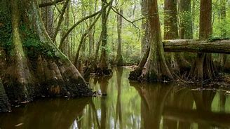
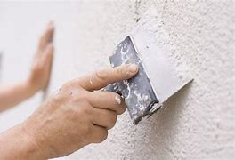
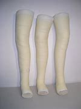
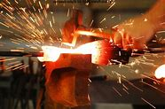
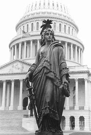

title:: 033 Built, Burned, Bakery: A Short History of the US Capitol Building

- # 033 Built, Burned, Bakery: A Short History of the US Capitol Building
- pure
  collapsed:: true
	- The United States Capitol is one of the most famous buildings in Washington.
	- The Capitol building is also one of the best-known symbols of the U.S. government. And it has been around for almost as long.
	- The country’s first president, George Washington, set the cornerstone for the building in 1793. At the time, the country’s government was only about five years old. And the capital city was Philadelphia, in Pennsylvania.
	- But national leaders were preparing to move the capital to the District of Columbia. They identified a hill on which to build a new home for the U.S. Senate and House of Representatives. The area around it was mostly grass, trees and water – in other words, a swamp. But the country’s leaders imagined that one day it would be crowded with people and buildings. And they were right.
	- A slow beginning, then a fire
	- Yet efforts to set up the Capitol building were slow. Several architects were asked to work on the project and later dismissed. The design of the building kept changing. Finally, lawmakers began meeting in one side in 1800, and in the other side in 1807. They passed from one side to the other on a wooden walkway.
	- Then, in 1814, British troops set fire to the Capitol building. Only rain from an unexpected storm put out the fire.
	- After the war with the British ended, workers made repairs and began to improve the building. They enclosed the center of the Capitol and added a dome on top. It was made of wood and covered in copper.
	- As the nation grows, so does the Capitol
	- For some years, improvements to the Capitol were small: running water, then gas lighting. But major changes to the country were taking place. New states were joining. The United States was expanding. And more lawmakers needed to meet in the Capitol.
	- By 1850, lawmakers agreed that the building was too small. Architects and builders set to work again. In time, they would double the length of the two sides of the Capitol. But the increase caused a new problem: now the dome looked too small.
	- However, the nation was facing more serious troubles. The southern states were threatening to withdraw from the Union. They objected to the power of the federal government, especially its efforts to control – or end – slavery.
	- By 1861, the country was fighting a civil war. Most work on the Capitol came to a stop. At times during the Civil War, the building served as a place for soldiers to sleep, a hospital, and even a place where baked goods were made.
	- But even before the war ended, then-President Abraham Lincoln urged that improvements to the Capitol be finished. He reportedly said if people saw work continue on the Capitol, they would accept that the Union would go on.
	- In 1863, a formerly enslaved man helped add a statue to the top of the new dome. Philip Reid was one of many enslaved workers who had built the Capitol. Over the years, they dug the stone, cut pieces of wood, and laid down the bricks, among other jobs. Reid was an expert in shaping metal. He was able to solve the problem of how to get a large statue out of its plaster cast so it could be forged. The figure, called the Statue of Freedom, still stands on top of the Capitol’s white, iron dome.
	- Modernization
	- The Civil War ended in 1865. As Lincoln hoped, the Union continued. And the Capitol building was slowly modernized. Elevators, electric lighting, and more rooms were added.
	- In the 20th century, the Capitol was equipped with televisions, computers, and a voting machine. And a large visitor center was added so the public can learn more about its history.
	- Today, the area around the Capitol is completely different than it was in 1793. Washington, D.C. is now a major city. And other government buildings stand near the Capitol. They include the U.S. Supreme Court, the Library of Congress, and even the Voice of America.
	- But the Capitol remains the seat of U.S. lawmaking, and a well-known symbol of the federal government.
- ---
- ## def
	- The United States Capitol /is one of the most famous buildings in Washington.
	- The Capitol building /is also one of the best-known symbols of the U.S. government. And it has been around for almost as long.
	- The country’s first president, George Washington, set the cornerstone for the building in 1793. At the time, the country’s government /was only about five years old. And the capital city /was Philadelphia, in Pennsylvania.
		- > ▶ cornerstone  ( especially NAmE ) a stone at the corner of the base of a building, often laid in a special ceremony 基石；奠基石 /the most important part of sth that the rest depends on 最重要部分；基础；柱石
	- But national leaders /were preparing to move the capital to the District of Columbia. They identified a hill /on which to build a new home /for the U.S. Senate and House of Representatives. The area around it /was mostly grass, trees and water – in other words, a swamp. But the country’s leaders imagined that /one day it would be crowded with people and buildings. And they were right.
		- > ▶ swamp [ CU ] an area of ground that is very wet or covered with water and in which plants, trees, etc. are growing 沼泽（地） /(v.)to fill or cover sth with a lot of water 淹；淹没
		  {:height 67, :width 114}
	- ## A slow beginning, then a fire
	- Yet /efforts to set up the Capitol building /were slow. Several architects /were asked to work on the project /and later dismissed. The design of the building /kept changing. Finally, lawmakers began meeting in one side /in 1800, and in the other side /in 1807. They passed from one side to the other /on a wooden walkway.
		- > ▶ dismiss (v.)**~ sb (from sth)** : to officially remove sb from their job 解雇；免职；开除 /**~ sb/sth (as sth)** : to decide that sb/sth is not important and not worth thinking or talking about 不予考虑；摒弃；对…不屑一提
		  -> I think we can safely dismiss their objections. 我认为我们对他们的异议完全可以不予理会。
		- 然而，建造国会大厦的努力进展缓慢。几个 建筑师被要求参与这个项目，但后来被解雇了。建筑的设计一直在变化。最后，立法者在1800年开始在一边开会，1807年在另一边开会。他们在一条木制走道上, 从一边走到另一边。
	- Then, in 1814, British troops /**set fire to** the Capitol building. Only rain from an unexpected storm /put out the fire.
	- After **the war with the British** ended(v.), workers made repairs /and began to improve the building. They enclosed the center of the Capitol /and added a dome on top. It was made of wood /and covered in copper.
	- ## As the nation grows, so does the Capitol
	- For some years, improvements to the Capitol were small: running water, then gas lighting. But major changes to the country /were taking place. New states were joining. The United States was expanding. And more lawmakers /needed to meet in the Capitol.
		- > ▶ running water 自来水；活水
		- > ▶  gas lighting 煤气灯, 气体照明
		- > ▶ **take ˈplace** : to happen, especially after previously being arranged or planned （尤指根据安排或计划）发生，进行
		  -> We may never discover **what took place that night**. 我们可能永远不会知道那一夜发生了什么事。
		- 随着国家的发展，国会大厦也在发展.  有几年，国会大厦的改善很小: 自来水，然后是煤气照明。但这个国家正在发生重大变化。新的州加入了。美国扩张了。更多的议员需要在国会大厦开会。
	- By 1850, lawmakers agreed that /the building was too small. Architects and builders /set to work again. In time, they would double(v.) the length of the two sides of the Capitol. But the increase /caused a new problem: now the dome looked too small.
		- > ▶ set (v.)**~ sth (for sb) |~ sb (to do sth)** : to give sb a piece of work, a task, etc. 布置；分配；指派
		  -> I've set myself /to finish the job /by the end of the month. 我要求自己在月底以前完成这项工作
		- > ▶ double (v.)to become, or make sth become, twice as much or as many （使）加倍；是…的两倍
	- However, the nation was facing more serious troubles. The southern states /were threatening to withdraw from the Union. They **objected(v.) to** the power of the federal government, especially its efforts /to control – or end – slavery.
	- By 1861, the country was fighting a civil war. Most work(n.) on the Capitol /came to a stop. At times during the Civil War, the building /**served(v.) as** a place /for soldiers to sleep, a hospital, and even a place /where **baked goods** were made.
		- 甚至是制作烘焙食品的地方。
	- But even before the war ended, then-President Abraham Lincoln /urged that /improvements to the Capitol **be finished**. He reportedly said /if people saw(v.) work continue(v.) on the Capitol, they would accept that /the Union would go on.
		- 但甚至在战争结束之前，时任总统亚伯拉罕·林肯, 就敦促国会大厦的改善工作完成。据报道，他说，如果人们看到国会大厦的工作在继续进行，他们就会接受"这个联邦继续存在"的事实。
	- In 1863, a formerly enslaved man /helped **add** a statue **to** the top of the new dome. Philip Reid was one of many enslaved workers /who had built the Capitol. Over the years, they dug the stone, cut(v.) pieces of wood, and **laid down** the bricks, among other jobs. Reid was an expert /in shaping metal. He was able to solve the problem of /how to get a large statue /out of its **plaster cast** /so it could be forged. The figure, called the Statue of Freedom, still stands /on top of the Capitol’s white, iron dome.
		- > ▶ Over the years 多年以来
		- > ▶ plaster  : [ U ] a substance made of lime , water and sand, that is put on walls and ceilings to give them a smooth hard surface 灰泥 
		  /( also less frequent also ˌplaster of ˈParis ) [ U ] a white powder that is mixed with water and becomes very hard when it dries, used especially for making copies of statues or holding broken bones in place 熟石膏
		  {:height 63, :width 125}
		- > ▶ cast :[ C ] a shaped container used to make an object 模子；铸模
		  = plaster cast (1)
		  -> Her leg's in a cast . 她的一条腿打上了石膏。
		- > ▶  **plaster cast** ( also cast ):  a copy of sth, made from plaster of Paris 石膏模型 / a case made of plaster of Paris that covers a broken bone and protects it （固定骨折部位的）石膏绷带，石膏夹
		  {:height 109, :width 85}
		- > ▶ forge [ VN ] to shape metal /by heating it in a fire /and hitting it with a hammer; to make an object in this way 锻造；制作
		  {:height 102, :width 153}
		- > ▶  the Statue of Freedom
		  {:height 115, :width 108}
		- 1863年，一名曾经的奴隶, 帮助在新圆顶顶上加了一尊雕像。Philip Reid 是建造国会大厦的众多奴隶工人之一。多年来，他们挖石头、切木头、铺砖，还有干其他工作。Reid 是铸造金属的专家。他能够解决如何从石膏模中取出一座大型雕像的问题，这样它就可以被锻造了。这尊雕像被称为自由女神像，仍然矗立在国会大厦白色的铁圆顶上。
		-
	- ## Modernization
	- The Civil War /ended in 1865. As Lincoln hoped, the Union continued. And the Capitol building /was slowly modernized. Elevators, electric lighting, and more rooms were added.
		- > ▶ modernize (v.)[ VN ] to make a system, methods, etc. more modern and more suitable for use at the present time 使（制度、方法等）现代化
		-
	- In the 20th century, the Capitol **was equipped with** televisions, computers, and a voting machine. And a large **visitor center** was added /so the public can learn more about its history.
		- > ▶ visitor center 游客中心
	- Today, the area around the Capitol /is completely different /than it was in 1793. Washington, D.C. is now a major city. And other government buildings /stand near the Capitol. They include the U.S. Supreme Court, the Library of Congress, and even the Voice of America.
		- > ▶ library  图书馆；藏书楼
	- But the Capitol /remains **the seat of U.S. lawmaking**, and a well-known symbol of the federal government.
		- > ▶ seat (n.)~ of sth ( formal ) a place where people are involved in a particular activity, especially a city that has a university or the offices of a government （尤指大学或政府机关）所在地；中心 / 座位，坐处（如椅子等）
		  -> Washington is **the seat of government of the US.** 华盛顿是美国政府所在地。