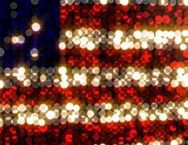

title:: 037 Can the Media Criticize Government Officials?

- # 037 Can the Media Criticize Government Officials?
- pure
  collapsed:: true
	- Clashes between the media and government officials are nothing new.
	- One clash goes back to 1960, when The New York Times newspaper published an advertisement from a civil rights group.
	- The ad objected to violence against peaceful protesters. It said that student activists in Montgomery, Alabama. had gathered at the State Capitol and sung “My Country ‘Tis of Thee” to call attention to African-Americans’ rights under the U.S. Constitution.
	- In answer, the ad said, student leaders of the protest were expelled from school and armed police circled the grounds of a local college.
	- A city official from Montgomery criticized the newspaper ad for misleading information. L.B. Sullivan launched a case against The Times for libel – publishing information that damaged his reputation.
	- The Supreme Court ruled against him. Yes, the justices said, the ad did not have all the details right. The students had song a different patriotic song, “The Star-Spangled Banner.” And the police did not technically surround the college campus.
	- But, the court said, these mistakes were minor and harmless. More important was the First Amendment’s right to free speech.
	- In this case, the Supreme Court protected people’s right to speak up against government officials, even if the attacks are unpleasant.
- ---
- ## def
	- Clashes between the media and government officials /are nothing new.
		- > ▶ clash (n.)**~ (with sb) |~ (between A and B)** a short fight between two groups of people （两群人之间的）打斗，打架，冲突
		  -> Clashes broke out between police and demonstrators. 警方与示威者发生了冲突。
		  /**~ (with sb) (over sth) |~ (between A and B) (over sth)** an argument between two people or groups of people who have different beliefs and ideas 争论；辩论；争执
		  /(v.)**~ (with sb)** to come together and fight or compete in a contest 打斗；冲突；比赛
	- One clash goes back to 1960, when The New York Times newspaper /published an advertisement /from a civil rights group.
		- 当时《纽约时报》刊登了一则民权组织的广告。
	- The ad **objected to** violence against peaceful protesters. It said that /student activists(n.) in Montgomery, Alabama. had gathered at the State Capitol /and sung “My Country ‘**Tis of Thee**” /to call(v.) attention to African-Americans’ rights /under the U.S. Constitution.
		- ((621436bd-0b8d-4a9e-b5fd-1593de031859))
		- > ▶ activist : a person who works to achieve political or social change, especially as a member of an organization with particular aims 积极分子；活跃分子
		- ((6232bc67-de6d-4b57-bce6-49281bda091c))
		- > ▶ tis  =  it is
		- > ▶ thee = you
		-
		- 该广告反对对和平抗议者使用暴力。阿拉巴马州蒙哥马利的学生中的积极分子。聚集在州议会大厦，高唱《我的祖国是你》(My Country ' Tis of Thee)，呼吁人们关注美国宪法赋予非洲裔美国人的权利。
	- In answer, the ad said, student leaders(n.) of the protest /were expelled from school /and armed police circled(v.) the grounds of a local college.
		- > ▶ expel (v.) to officially make sb leave a school or an organization 把…开除（或除名） /驱逐出境 /to force air or water out of a part of the body or from a container 排出；喷出
	- A city official from Montgomery /**criticized** the newspaper ad **for** misleading information. L.B. Sullivan /launched a case against The Times for libel – publishing(v.) information that damaged his reputation.
		- > ▶ misleading (a.)giving the wrong idea or impression and making you believe sth that is not true 误导的；引入歧途的
		  -> misleading information/advertisements 使人产生误解的信息╱广告
		- > ▶ libel (n.)[ UC ] the act of printing a statement about sb that is not true and that gives people a bad opinion of them （文字）诽谤，中伤 / (v.)发表文字诽谤（某人）
		  => 来自拉丁语liber,书，来自PIE*leup,剥下，削皮，词源同leaf,library,-el,小词后缀。即小书，引申词义小册子，诽谤书。
		  在英语中，“诽谤”分为“文字诽谤”和“口头诽谤”，libel是“文字诽谤”，slander是“口头诽谤“。
		- l·b·沙利文对《纽约时报》提起诉讼，称其发布的信息诽谤他人，损害了他的声誉。
	- The Supreme Court /**ruled against** him. Yes, the justices said, the ad did not **have** all the details **right**. The students had song(v.) a different **patriotic song**, “The Star-Spangled Banner.” And the police did not technically surround the college campus.
		- > ▶ rule (v.)~ (on sth) to give an official decision about sth 决定；裁定；判决
		  -> The judge **ruled against/in favour of** the plaintiff. 法官判原告败诉╱胜诉。
		- > ▶ patriotic (a.)having or expressing a great love of your country 爱国的
		- > ▶ spangled /ˈspæŋgəld/ ADJ Something that is spangled /is covered with small shiny objects. 缀满闪光的饰片的
		  => 来自中古英语 spang,闪光装饰，闪光金属片，来自古英语 spang,扣子，夹子，词源同 span, 扎牢，绑紧。-le,小词后缀。
		  {:height 187, :width 233}
		- 最高法院判他败诉。是的，法官说，广告的所有细节都不正确。学生们唱了一首不同的爱国歌曲，《闪亮星条旗》。严格来说，警察并没有包围大学校园。
	- But, the court said, these mistakes were minor and harmless. More important was **the First Amendment’s right** to **free speech**.
	- In this case, the Supreme Court /protected people’s right /**to speak up against** government officials, even if the attacks are unpleasant.
		- > ▶ **SPEAK UP**
		  usually used in orders to tell sb to speak more loudly 大声点说
		  ▶ **SPEAK UP (FOR SB/STH)**
		  to say what you think clearly and freely, especially in order to support or defend sb/sth 明确表态；（尤指为…）说好话，辩护
	-
-