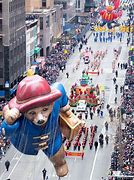
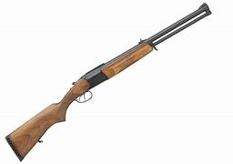
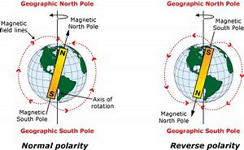
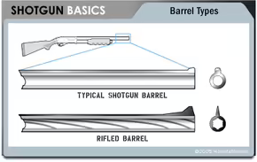

title:: 038 What Does the US Supreme Court Say About Guns?

- # 038 What Does the US Supreme Court Say About Guns?
- pure
  collapsed:: true
	- The Second Amendment of the U.S. Constitution says: “A well regulated Militia, being necessary to the security of a free State, the right of the people to keep and bear Arms, shall not be infringed.”
	- What these words mean, exactly, is disputed in the United States. Even the Supreme Court, whose job it is to interpret the Constitution, has disagreed. The issue is whether the federal government can place restrictions on who owns guns and how people use them.
	- In the Court’s 200-plus-year history, it has ruled on cases related to the Second Amendment several times – and its answer to what the Amendment means has recently changed.
	- ## U.S. v. Cruikshank, 1876
	- The Second Amendment was adopted in 1791, along with the rest of the Bill of Rights. About 80 years later, an event prompted the Supreme Court to clarify it. A group of white supremacists in Louisiana attacked and killed more than 100 African American men.
	  Later, the white supremacists were charged -- not with murder, but with violating the victims’ constitutional rights.
	- In time, the Supreme Court heard the case. The lawyers’ arguments covered many issues. But in deciding the case, the justices said something important about the Second Amendment. They said the Constitution did not guarantee every person the right to have a gun.
	- Instead, the justices agreed, state laws could regulate gun ownership, as long as citizens could form a militia if they needed to.
	- The white supremacists won their case and were not punished.
	- ## Presser v. Illinois, 1886; Miller v. Texas, 1894; U.S. v. Miller, 1939
	- In the next decades, the Supreme Court affirmed its earlier decision. It said the state of Illinois had the right to prevent ordinary citizens from carrying weapons in a parade.
	- In another case, a man in Texas argued that his state law could not prevent him from carrying a hidden weapon. The Supreme Court said it could.
	- And in the early 20th century, two men said the Second Amendment protected their right to bring an unregistered, sawed-off shotgun from one state to another. The justices disagreed. They said the “obvious purpose” of the Second Amendment was to support a state’s volunteer army, its militia. A sawed-off shotgun did not have a “reasonable relationship” to the militia, the justices said. And, as such, policies restricting the weapon were just fine.
	- ## District of Columbia v. Heller, 2008
	- More than 70 years passed. Then, in 2008, the Supreme Court ruled again on a gun-related case. And this time, its answer was very different.
	- The case involved a man named Dick Heller. He lived in Washington, D.C., and was permitted to carry a gun at his job as a security guard. At the time, Washington, D.C., was considered very dangerous. Heller wanted to keep a handgun in his home for self-defense. District lawmakers said no.
	- They pointed to a 1975 district law that banned most people from having handguns. Lawmakers said the goal of the law was to prevent an increase in gun violence. But Heller argued that the district’s ban on handguns violated his Second Amendment rights.
	- This time, the Supreme Court agreed. Five out of nine justices said the Second Amendment said the Constitution did guarantee most people the right to have a gun, at least for protection in their homes. Guns did not have to be connected to a militia, after all.
	- ## McDonald v. City of Chicago, 2010
	- Two years later, the Supreme Court ruled on a similar case. This time, a man argued that the city of Chicago could not prevent him from having a handgun. Five out of nine justices agreed with him, too.
	- ## So what changed?
	- The recent Supreme Court decisions show a major change in thinking about the Second Amendment. Gun ownership in the U.S. is now considered the individual right of each person, rather than the collective right of militias.
	- And the Second Amendment now protects gun owners from many state and local laws that restrict gun ownership and use.
	- Michael Trachtman is a lawyer and the author of a book about the Supreme Court. He points out that, over time, the Supreme Court has reversed decisions on a number of issues, including same-sex marriage and abortion.
	- Trachtman says, “The history of the law is the evolution of the law.”
	- He notes that over time, decisions the public accepted in the 1800s may not fit with ideas in the 20th or 21st century.
	- “Or there may simply be disagreements between justices today and justices five or 10 years ago,” Trachtman says.
	- In the case of the Second Amendment, gun rights activists have also played an important part. Scholars Eric Ruben and Darrell Miller wrote in 2016 about the issue. They say that in the 1970s, researchers looked for historical sources supporting a different understanding of the Second Amendment. At the time, their ideas were not widely accepted. But eventually some other scholars adopted the view. And gun rights activists began challenging cases related to the Second Amendment in court.
	- In the early 2000s, activists focused some of their political efforts on the Heller case. The National Rifle Association – or NRA – especially organized supporters to explain to the Supreme Court justices why they should defend a constitutional right to gun ownership.
	- The NRA’s efforts were combined with activism from libertarians – people who want to severely limit the role of government.
	- Their arguments, along with some of the justices’ own understanding of the Constitution, helped change more than 130 years of legal history.
- ---
- ## def
	- The Second Amendment of the U.S. Constitution says: “A well regulated Militia, being necessary to the security of a free State, `主` the right of the people /to keep and bear Arms, `谓` shall not be infringed.”
		- > ▶ regulate (v.)to control sth by means of rules （用规则条例）约束，控制，管理
		- > ▶ militia /məˈlɪʃə/  [ sing.+sing./pl.v. ] a group of people who are not professional soldiers /but who have had military training /and can act as an army 民兵组织；国民卫队
		- > ▶ infringe (v.)[ VN ] ( of an action, a plan, etc. 行动、计划等 ) to break a law or rule 违背，触犯（法规） /~ (on/upon) sth to limit sb's legal rights 侵犯，侵害（合法权益）
		  -> She refused to answer questions **that infringed on her private affairs**. 她拒绝回答侵犯她隐私的问题。
		  => 由前缀in-(向内)和基本动词frangere(打破,打碎)组成的复合词infringere。 词根词缀： in-入,向内 + fring( = -frag-)打破,打碎 + -e
		- 美国宪法第二修正案规定:“规范的民兵, 是保障自由州安全的必要条件，人民持有和携带武器的权利, 不得被侵犯。”
		-
	- What these words mean, exactly, is disputed in the United States. Even the Supreme Court, whose job it is to interpret the Constitution, has disagreed. The issue is /whether the federal government can place restrictions on who owns guns /and how people use them.
		- > ▶ disputed  adj. 有争议的
		- > ▶ dispute (v.)to question whether sth is true and valid 对…提出质询；对…表示异议（或怀疑） /to argue or disagree strongly with sb about sth, especially about who owns sth 争论；辩论；争执
		  -> to dispute a decision/claim 对某项决定╱权利要求提出异议
		- > ▶ disagree (v.)[ V ] ~ (with sb) (about/on/over sth) if two people disagree or one person disagrees with another about sth, they have a different opinion about it 不同意；持不同意见；有分歧
		- 这些话到底是什么意思，在美国是有争议的。甚至负责解释宪法的最高法院内部, 也互相持有不同意见。问题是, 联邦政府是否可以限制谁拥有枪支, 以及人们如何使用枪支.
		-
	- In the Court’s 200-plus-year history, it has ruled on cases /related to the Second Amendment /several times – and its answer to what the Amendment means /has recently changed.
		- 在最高法院200多年的历史中，它曾多次裁决与第二修正案有关的案件——它对修正案含义的回答最近发生了变化。
	- ## U.S. v. Cruikshank, 1876
	- The Second Amendment was adopted in 1791, along with the rest of **the Bill of Rights**. About 80 years later, an event prompted(v.) the Supreme Court /to clarify it. A group of **white supremacists** in Louisiana /attacked and killed more than 100 African American men.
		- > ▶ adopt (v.)[ VN ] to start to use a particular method or to show a particular attitude towards sb/sth 采用（某方法）；采取（某态度） / to formally accept a suggestion or policy by voting 正式通过，表决采纳（建议、政策等）
		  -> All three teams **adopted different approaches** to the problem. 三个队处理这个问题的方法各不相同。
		- > ▶ supremacist : a person who believes that /their own race is better than others /and should be in power 种族优越论者
		  -> a white supremacist 白人至上主义者
		- 《第二修正案》和《权利法案》的其他部分于1791年通过。大约80年后，一件事促使最高法院作出澄清 -- 路易斯安那州的一群白人至上主义者, 袭击并杀害了100多名非洲裔美国人。
		-
	- Later, the white supremacists were charged -- not with murder, but with violating(v.) the victims’ **constitutional rights**.
		- 白人至上主义者被指控——不是谋杀，而是侵犯了受害者的宪法权利。
		-
	- In time, the Supreme Court heard the case. The lawyers’ arguments covered(v.) many issues. But in deciding the case, the justices said something important /about the Second Amendment. They said /the Constitution did not guarantee(v.) every person the right /to have a gun.
		- > ▶  **in time** : after a period of time /when a situation has changed 经过一段时间之后；迟早；最后；终于 SYN eventually
		  -> They learned to accept their stepmother **in time**. 过了一段时间之后他们学会了接受他们的继母。
		- 最后，最高法院审理了这个案子。律师们的辩论涉及许多问题。但在裁决此案时，大法官们谈到了第二修正案的一些重要内容。他们说，宪法并没有保证每个人都有拥有枪支的权利。
		-
	- Instead, the justices agreed, **state laws** could regulate(v.) gun ownership, **as long as** citizens could form a militia /if they needed to.
	- The white supremacists /won their case /and were not punished.
	- ## Presser v. Illinois, 1886; Miller v. Texas, 1894; U.S. v. Miller, 1939
	- In the next decades, the Supreme Court **affirmed its earlier decision**. It said /the state of Illinois /had the right **to prevent** ordinary citizens **from** carrying weapons in a parade.
		- > ▶ affirm (v.)[ V speech ] ( formal ) **to state firmly or publicly that** sth is true /or that you support sth strongly 肯定属实；申明；断言
		  ->  I can affirm that /no one will lose their job. 我可以肯定，谁都不会丢掉工作。
		- > ▶ parade  /pəˈreɪd/  (n.)(v.) [ C ] a public celebration of a special day or event, usually with bands in the streets and decorated vehicles 游行 /[ CU ] a formal occasion when soldiers march or stand in lines so that they can be examined by their officers or other important people 检阅；阅兵
		  => [ CU ] a formal occasion when soldiers march or stand in lines so that they can be examined by their officers or other important people 检阅；阅兵
		  
		- 最高法院维持了先前的判决。它说，伊利诺伊州有权阻止普通公民在游行中携带武器。
		-
	- In another case, a man in Texas argued that /his state law could not prevent him from carrying a hidden weapon. The Supreme Court said it could.
	- And in the early 20th century, two men said /the Second Amendment protected their right /to bring an unregistered, sawed-off(a.) shotgun /from one state to another. The justices disagreed. They said `主` the “obvious purpose” of the Second Amendment `系` was /to support(v.) a state’s **volunteer army**, its militia. A sawed-off shotgun /did not have a “reasonable relationship” to the militia, the justices said. And, as such, `主` policies 后定 restricting the weapon `系` were just fine.
		- > ▶ sawed-off  adj. 个子矮的；枪身锯短的
		- > ▶ shotgun  : a long gun that fires a lot of small metal bullets, (called shot ), and is used especially for shooting birds or animals 猎枪；火枪
		  
		- 有两个人说，《第二修正案》保护了他们从一个州到另一个州, 携带未注册的截短猎枪的权利。法官们不同意。他们说，第二修正案的“明显目的”是支持一个州的志愿军，即它的民兵。法官们说，一支截短的猎枪, 与民兵组织没有“合理的关系”。因此，限制武器的政策, 才是好的。
	- ## District of Columbia v. Heller, 2008
	- More than 70 years passed. Then, in 2008, the Supreme Court **ruled again** on a gun-related case. And this time, its answer was very different.
	- The case involved a man /named Dick Heller. He lived in Washington, D.C., and was permitted to carry a gun /at his job /as **a security guard**. At the time, Washington, D.C., was considered very dangerous. Heller wanted to keep a handgun in his home /for self-defense. District lawmakers said no.
		- 作为一名保安，他被允许在工作中携带枪支。当时，华盛顿特区被认为是非常危险的地方。Heller 想在家里保留一把手枪用于自卫。地区议员却说不。
		-
	- They pointed to a 1975 **district law** /that banned most people from having handguns. Lawmakers said /`主` the goal of the law `系` was to prevent an increase in gun violence. But Heller argued that /the district’s ban(n.) on handguns /violated(v.) his Second Amendment rights.
	- This time, the Supreme Court agreed. Five out of nine justices said /the Second Amendment said /the Constitution did guarantee(v.) most people the right to have a gun, at least for protection /in their homes. Guns did not have to be connected to a militia, after all.
		- 这一次，最高法院同意了原告。九名大法官中有五名表示，第二修正案表示，宪法确实保障了大多数人拥有枪支的权利，至少是为了在家中得到保护。毕竟，枪支并不一定与民兵有关。
	- ## McDonald v. City of Chicago, 2010
	- Two years later, the Supreme Court ruled on a similar case. This time, a man argued that /the city of Chicago /could not prevent him from having a handgun. Five out of nine justices /agreed with him, too.
	- ## So what changed?
	- The recent Supreme Court decisions /show a major change /in thinking about the Second Amendment. Gun ownership in the U.S. /is now considered **the individual right** of each person, rather than **the collective right** of militias.
		- > ▶ collective  (a.)done or shared by all members of a group of people; involving a whole group or society 集体的；共有的；共同的 /used to refer to all members of a group 全体成员的；总体的
		  -> collective leadership/decision-making/responsibility 集体领导╱决策；共同责任
		- 最高法院最近的裁决表明，人们对第二修正案的看法发生了重大变化。在美国，拥有枪支现在被认为是每个人的个人权利，而不是民兵的集体权利。
		-
	- And the Second Amendment /now **protects** gun owners **from** many state and local laws /that restrict(v.) gun ownership and use.
		- 第二修正案现在保护着枪支拥有者, 免受"许多州和地方法律限制枪支拥有和使用"的影响。
		-
	- Michael Trachtman is a lawyer /and the author of a book /about the Supreme Court. He points out that, over time, the Supreme Court /has reversed(v.) decisions on a number of issues, including same-sex marriage /and abortion.
		- > ▶ reverse (v.) **to change sth completely** so that it is the opposite of what it was before 颠倒；彻底转变；使完全相反 /**to change** a previous decision, law, etc. **to the opposite one** 撤销，废除（决定、法律等）
		  / to turn sth the opposite way around or change the order of sth around 使反转；使次序颠倒
		  -> The Court of Appeal **reversed the decision**. 上诉法庭撤销了这项裁决。
		  
		- 随着时间的推移，最高法院在一些问题上推翻了裁决，包括同性婚姻和堕胎。
		-
	- Trachtman says, “The history of the law /is the evolution of the law.”
	- He notes that /over time, decisions the public accepted in the 1800s /may not fit with ideas in the 20th or 21st century.
		- 公众在19世纪接受的决定, 可能不符合20世纪或21世纪的理念。
		-
	- “Or **there may simply be** disagreements /**between** justices today /**and** justices five or 10 years ago,” Trachtman says.
		- 或者, 也可能只是源于今天的大法官, 与5年或10年前的大法官之间, 存在分歧。
		-
	- In the case of the Second Amendment, gun rights activists /have also played an important part. Scholars Eric Ruben and Darrell Miller /wrote in 2016 about the issue. They say that /in the 1970s, researchers **looked for** historical sources /supporting(v.) a different understanding of the Second Amendment. At the time, their ideas /were not widely accepted. But eventually /some other scholars /adopted the view. And gun rights activists /began challenging cases /related to the Second Amendment in court.
		- 在20世纪70年代，研究人员寻找历史资料, 来支持对第二修正案的不同阐释。当时，他们的想法并没有被广泛接受。但最终，其他一些学者采纳了这一观点。持枪权利活动人士开始在法庭上质疑与第二修正案有关的案件。
		-
	- In the early 2000s, activists **focused** some of their political efforts **on** the Heller case. The National _Rifle Association_ – or NRA – especially organized(v.) supporters /to explain to the Supreme Court justices /why they should defend **a constitutional right** to gun ownership.
		- > ▶ Rifle : a gun with a long barrel which you hold to your shoulder to fire 步枪；来复枪
		  
		- 活动人士, 把他们的一些政治努力集中在Heller 案上。全国步枪协会(简称NRA, )特别组织了(v.)支持者, 来向最高法院大法官解释, 为什么他们应该捍卫"宪法所赋予的应拥有枪支"的权利。
		-
	- The NRA’s efforts /**were combined with** activism(n.) from libertarians – people who want to severely limit(v.) the role of government.
		- > ▶ activism  N-UNCOUNT Activism is the process of campaigning in public /or working for an organization /in order to bring about political or social change. 行动主义
		- > ▶ libertarian (n.)a person /who strongly believes that /people should have the freedom /to do and think /as they like 自由论者
		- NRA组织的努力, 与自由论者的行动主义, 结合了起来.
		-
	- `主` Their arguments, along with some of the justices’ own understanding of the Constitution, `谓` helped change(v.) more than 130 years of legal history.
		- 他们的论点，加上一些法官自己对宪法的理解，帮助改变了130多年的法律历史。
		-
	- ---
	- 背景分析:
		- 美国联邦宪法第二修正案:
			- > Awell regulated Militia, **being necessary to** the security of a free State, `主` the right of the people /to keep and bear Arms, `谓` shall not be infringed.
			- 鉴于一支管理良好的民兵, 对一个自由州的安全实属必要，人民存贮与佩用武器的权利, 不得受到侵犯。
		-
		- 自其问世以来，在如何解读第二修正案上, 一直存在诸多重大分歧.
		- 2008年 District of Columbia v. Heller, 与 2010 年 McDonald v. Chicago这两个里程碑判决, 极富争议性.  反对者则指责多数派大法官们出于个人政治立场, 而扭曲宪法原意.
			-
		- 1.
		  collapsed:: true
			- 首先，与其它修正案相比，第二修正案的语法结构别具一格, **being necessary to... 是作为原因状语（即“鉴于……”）. 通过谓词的动名词化来表示原因，在制宪时代是常见的文法，相当于说 “As /Since /Given that /Consideringthat/** … a well regulated Militia is necessary to... ——这一点争论各方均有共识。
			- 问题在于，**前半句对后半句构成了怎样的限制？引导从句(前半句)所述原因，是操作从句(后半句)的唯一原因吗？抑或仅仅是诸多原因中随意选取出来的一条？**这与司法解释的大方向密切相关：**引导从句是不是操作从句的唯一原因，影响到武器权在多大程度上必须奠基于民兵身份。**
		- 2.第二修正案的几乎每处措辞, 都比较含混, 会引发司法解释上的一团混战：
		  collapsed:: true
			- -> 管理良好（well regulated）”, 是指向的什么客体? 包括对枪支的管理吗？
			- -> 说民兵是“州（State）”的必要安全保障，意思是说, 要把管理民兵以及武器的权力交给各州——既不是联邦政府也不是个人——吗？
			- -> 武器权是“人民（the people）”的权利，那么这个"the people"是指人民这个集体，还是属于构成人民的每位个体公民？
			- -> 这里所谓“武器（Arms）”, 涵盖古往今来任何类型的武器吗，还是只涵盖那些民兵训练或作战时会用到的武器？
			- ...
		-
		- **围绕这些分歧，宪法学界形成了两大基本的解读流派：“个体权利派”（individual right interpretation）与“集体权利派”（collective right interpretation）。**
		  collapsed:: true
			- 2008年的Heller案, 是“个体权利派”的胜利，如高院的5：4判决所言：The Second Amendment /protects **an individual right** /to possess a firearm /unconnected with service in a militia,and to use that arm /for traditionally lawful purposes, such as self-defense /within the home. 第二修正案保护这样一种个体权利：拥有一款与在民兵中服役没有关联的火器，以及将该武器用于传统上合法的目的，比如在家中自卫。
			- 与此相反，“ 集体权利派”认为, 第二修正案并没有将武器权直接落实到每个个体头上，而是将其划归于特定的集体。根据所认定的集体不同，又可以分为:
				- -> “ 州权模式”（第二修正案旨在防止联邦政府侵犯州权，但并不对州政府的行为构成约束，各州可以自行立法限制甚至取消本州居民的武器权）、
				- -> “ 现役民兵模式”（武器权, 属于所有**正式参与民兵训练或作战任务者**，且武器类型与使用目的, 必须与民兵活动有关）、
				- -> “民兵资格模式”（武器权, 属于所有**具备民兵资格者**，且武器类型与使用目的, 必须与民兵活动有关）
				- 等等许多不同的路数。
				-
			-
			-