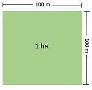
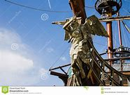
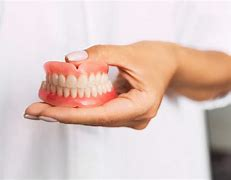

title:: 041 George Washington: Reluctant

- # 041 George Washington: Reluctant
- pure
  collapsed:: true
	- VOA Learning English presents America's Presidents.
	- Today we are talking about George Washington.
	- He was the first president of the United States. He served from 1789 to 1797.
	- But he had many other accomplishments, too.
	- He owned thousands of hectares of land in his home state of Virginia.
	- He was a famous general, who led the American colonists to freedom from British rule.
	- And he presided over the convention that created the U.S. Constitution.
	- For Washington, that was enough. He said he wanted to retire from public service and return home.
	- But the country’s new electors had other ideas. They wanted him to move to New York and invent the American presidency.
	- Washington accepted the job as his duty.
	- ## Washington as president
	- Washington was sworn in as president in 1789. At the time, a truly united states was still just an idea. Americans were unconnected groups. They came from different countries, had different religions, and spoke different languages. For example, a quarter of the people in the state of Pennsylvania spoke only German.
	- Doug Bradburn is the founding director of the Washington Library at Mount Vernon. He says when Washington took office, the country was “fragile.”
	- “The chances that it would even survive were probably very, very slim.”
	- Bradburn explains that Washington had to establish social and political unity. But the Constitution did not say how the president could do that.
	- So, Bradburn says, George Washington invented the job for all future presidents.
	- He established a group of advisors — called the cabinet—as well as the nation’s official money. He appointed a six-member Supreme Court. And he created the Department of Foreign Affairs, now called the State Department.
	- However, Washington said it was the president’s responsibility to set foreign policy.
	- Historian Doug Bradburn explains that Washington established the president not just as a figurehead, but as a decision maker.
	- But he always used the Constitution as his guide.
	- “He wasn’t just trying to establish an office and then figure out a way to justify it, he was trying to work with his Constitution.”
	- ## Washington as a young man
	  George Washington was born in 1732 in the colony of Virginia. His father died when George was 11 years old. As a boy, he learned reading, writing and math. Then he worked as a land surveyor in western Virginia.
	- Historian Joseph Ellis points out that Washington did not have a formal education. Instead of going to college, Ellis says, Washington went to war. He fought against the French and Indians as a British Army officer.
	- That experience informed Washington’s world view. Ellis describes the first president as “a realist.” At the same time, Washington was a “very passionate man” with “extremely strong emotions.” He was known to get angry, but he showed his temper to only a few people.
	- Washington not only acted like a great leader – he looked like one. George Washington stood about 1.9 meters tall. That was a head taller than the average man of his time.
	- He was very strong, and very graceful. He was known as one of the best horseback riders and best dancers in Virginia.
	- But he had a problem: bad teeth.
	- Unlike his wife, Martha, who was known for her lovely smile, George Washington began losing his teeth in his twenties. When he was sworn in as president, he had only one tooth left.
	  ​
	- ## Washington as a myth
	- Washington remains an important figure in the American imagination. Even today people tell stories about him.
	- One popular story, that he had wooden teeth, is not true. But he did wear dentures. They were made, in part, from hippopotamus ivory.
	- And he did not chop down a cherry tree as a child and then admit it by saying, “I cannot tell a lie.” In fact, historian Joseph Ellis says George Washington “lied many times.”
	- But it is true that as Washington became more famous, his reputation grew. People thought of him as a man who always did the right thing.
	- Joseph Ellis says even Washington understood people would look at his writings and judge him.
	- “Washington went from being a man to a monument. He was aware of the fact that he had a role to play and that all emerging nations need mythical heroes.”
	- Washington became very protective of his personal thoughts. His wife burned most of their letters.
	- Yet we know a little bit about George Washington’s thoughts from other writing. One of his regrets, he said, was that he had not done something to end slavery.
	- Like many plantation owners, Washington was a slave holder. More than 300 enslaved people lived on his property.
	- By the end of his life, Washington opposed slavery. He left a will ordering his survivors to free his slaves after his wife’s death.
	- Washington’s will became relevant sooner than he might have liked.
	- Three years after he finished his second term as president, Washington fell ill. He had been outside riding his horse on a cold, wet day. When he came home, he complained of a sore throat.
	- Over the next two days, his condition became worse. On December 14, 1799, he died in his bed, surrounded by his wife, enslaved maids, and friends. He was 67.
	- ## Washington’s legacy
	- Historian Joseph Ellis says one of the best things about George Washington was his ability to give up power. At the end of the Revolutionary War, General Washington returned his sword. And at the end of his administration, President Washington simply returned home.
	- “You could trust Washington with power because he was so conspicuously willing to give it up.”
	- Doug Bradburn says Washington was the right man at the right time. Bradburn, like many historians, calls George Washington the “indispensable man.”
	- In other words, Washington was essential to the American experiment in self-government. He made ideas about American freedom real, and he showed that even the president would operate under the rule of law.
- ---
- ## def
	- VOA Learning English presents(v.) America's Presidents.
	- Today we are talking about George Washington.
	- He was the first president of the United States. He served from 1789 to 1797.
	- But he had many other accomplishments, too.
		- > ▶ accomplishment : an impressive thing that is done or achieved after a lot of work 成就；成绩 / 才艺；技艺；专长 / the successful completing of sth 完成；成就
	- He owned thousands of hectares of land /in his **home state** of Virginia.
		- id:: 62429239-b6f3-43b8-8e86-53782de77411
		  > ▶ hectare /ˈhekter/ ( abbr. ha ) a unit for measuring an area of land; 10 000 square metres or about 2.5 acres 公顷（土地丈量单位，等于1万平方米或约2.5英亩）
		  
	- He was a famous general, who led the American colonists /to freedom from British rule.
		- > ▶ freedom (n.)~ from sth :  the state of not being affected by the thing mentioned 没有…的情况；不受…影响的状态
		  -> freedom from fear/pain/hunger, etc. 免于恐惧、痛苦、饥饿等
	- And he **presided(v.) over** the convention /that created the U.S. Constitution.
		- > ▶ preside [ V ] ~ (at/over sth) : to lead or be in charge of a meeting, ceremony, etc. 主持（会议、仪式等）；担任（会议）主席
		- ((62428ab0-f7be-431d-8775-35d4381e80a7))
	- For Washington, that was enough. He said /he wanted to retire from public service /and return home.
	- But the country’s new electors /had other ideas. They wanted him /to move to New York /and invent the American presidency.
	- Washington accepted the job /as his duty.
	- ## Washington as president
	- Washington was **sworn in** as president in 1789. At the time, a truly united states /was still just an idea. Americans were unconnected groups. They came from different countries, had different religions, and spoke different languages. For example, a quarter of the people in the state of Pennsylvania /spoke only German.
		- > ▶ swear (v.) to make a serious promise to do sth 郑重承诺；发誓要；表示决心要
		  ▶ **SWEAR SB INˌ | SWEAR SB INTO STH** :
		  [ often passive ] to make sb promise to do a job correctly, to be loyal to an organization, a country, etc. 使某人宣誓就职；使某人宣誓忠于某组织（或国家等）
		  -> He was sworn in as president. 他宣誓就任总统。
		  -> The new prime minister was sworn into office. 新首相宣誓就职。
	- Doug Bradburn is **the founding director** of _the Washington Library_ at Mount Vernon. He says /when Washington took office, the country was “fragile.”
		- > ▶ found (v.)to start sth, such as an organization or an institution, especially by providing money 创建，创办（组织或机构，尤指提供资金）
	- “The chances /that it would even survive /were probably very, very slim.”
		- > ▶ slim (a.)not as big as you would like or expect 微薄的；不足的；少的；小的 /苗条的；纤细的
		  -> a slim chance of success 成功的可能性不大
		- 它存活下来的机会, 可能非常非常小。
	- Bradburn explains that /Washington had to establish social and political unity. But the Constitution did not say /how the president could do that.
		- > ▶ unity (n.) the state of being in agreement and working together; the state of being joined together to form one unit 团结一致；联合；统一 /a single thing that may consist of a number of different parts 统一体；联合体；整体
	- So, Bradburn says, George Washington /invented the job /for all future presidents.
	- He established a group of advisors — called the cabinet—as well as the nation’s official money. He appointed a six-member Supreme Court. And he created the Department of Foreign Affairs, now called the State Department.
		- 他建立了一个顾问团——称为内阁——以及国家的官方资金。他任命了一个六人组成的最高法院。他还创建了外交部，也就是现在的国务院。
	- However, Washington said /it was the president’s responsibility /to set foreign policy.
	- Historian Doug Bradburn explains that /Washington established the president /not just as a figurehead, but as a decision maker.
		- > ▶ figurehead (n.)a person who is in a high position in a country or an organization but who has no real power or authority 有名无实的领导人；傀儡 /a large wooden statue, usually representing a woman, that used to be fixed to the front end of a ship （过去的）艏饰像
		  -> figure, 雕像，象征。head,首领。
		  
	- But he always **used** the Constitution **as** his guide.
	- “He wasn’t just trying to establish an office /and then **figure out** a way /to justify it, he was trying to work with his Constitution.”
		- > ▶ **figure sb/sth out** :
		  (1) to think about sb/sth until you understand them/it 弄懂；弄清楚；弄明白
		  (2) to calculate an amount or the cost of sth 计算（数量或成本）
		- 他不只是试图建立一个办公室，然后想办法证明它是正当的，他还试图与他的宪法合作。
	- ## Washington as a young man
	  George Washington was born in 1732 /in the colony of Virginia. His father died /when George was 11 years old. As a boy, he learned reading, writing and math. Then he worked as a land surveyor /in western Virginia.
		- > ▶ surveyor : a person whose job is to examine and record the details of a piece of land （土地）测量员，勘测员
		  
	- Historian Joseph Ellis /points out that /Washington did not have a formal education. Instead of going to college, Ellis says, Washington went to war. He fought against the French and Indians /as a British Army officer.
		- > ▶ Indian = Native American = 印第安人 /印度人
		  => 哥伦布发现美洲大陆时，误把美洲当做东方的亚洲，并把美洲的土著人称为Indian，即印度人。由于同样印度人也翻译为Indian，两者很容易混淆，为了区分，英语中把印度人称East Indian，而把美洲土著人称为West Indian。即分别称为东印度人和西印度人. 事实上，中文还是在一些地方保留了英文表述的特点，比如“东印度公司”。
	- That experience /informed(v.) Washington’s world view. Ellis **describes** the first president **as** “a realist.” At the same time, Washington was a “very passionate man” /with “extremely strong emotions.” He was known to get angry, but he **showed** his temper **to** only a few people.
		- ((62428e4d-0bdb-4b12-9527-a2dd8e450e9a))
		- > ▶ realist (n.)a person who accepts and deals with a situation as it really is and does not try to pretend that it is different 现实主义者；务实的人
		- > ▶ temper  [ C ] [ usually sing.U ] if sb has a temper , they become angry very easily 脾气；易怒的性情
		  /[ Cusually sing. ] a short period of feeling very angry 怒气；火气；阵怒 
		  /[ C ] the way that you are feeling at a particular time 心情；情绪；心境
		  -> to be in a bad, foul, etc. temper 心情不好、很坏等
		- 这一经历影响了华盛顿的世界观。Ellis 形容第一任总统是一个“现实主义者”。与此同时，华盛顿是一个“非常有激情的人”，有着“极其强烈的情感”。大家都知道他很生气，但他只对少数人发过脾气。
	- Washington not only **acted like** a great leader – he **looked like** one. George Washington stood(v.) about 1.9 meters tall. That was a head /taller than the average man of his time.
		- 华盛顿不仅表现得像一位伟大的领袖，他看起来也像一位伟大的领袖。乔治·华盛顿身高约1.9米。这比他那个时代的平均身高高出一头。
	- He was very strong, and very graceful. He was known as /one of the best horseback riders /and best dancers in Virginia.
		- 他被认为是弗吉尼亚州最好的骑马者和最好的舞者之一。
	- But he had a problem: bad teeth.
	- Unlike his wife, Martha, who was known for her lovely smile, George Washington began losing his teeth /in his twenties. When he was sworn in as president, he had only one tooth left.
	  ​
	- ## Washington as a myth
	- Washington remains an important figure /in the American imagination. Even today people /tell stories about him.
		- > ▶ myth 神话；神话故事 /something that many people believe but that does not exist or is false 虚构的东西；荒诞的说法；不真实的事
	- One popular story, that he had wooden teeth, is not true. But he did wear dentures. They were made, in part, from hippopotamus ivory.
		- > ▶ dentures [ pl. ] artificial teeth on a thin piece of plastic (= a plate ) , worn by sb who no longer has all their own teeth 托牙；假牙
		  {:height 187, :width 231}
		- > ▶ hippopotamus  河马
		- > ▶ ivory 象牙；（某些其他动物的）长牙 / 象牙色；乳白色
		  => 来自拉丁语ebur,象牙。
	- And he did not **chop down** a cherry tree /as a child /and then admit it by saying, “I cannot tell a lie.” In fact, historian Joseph Ellis says /George Washington “lied many times.”
	- But it is true that /as Washington became more famous, his reputation grew. People **thought of** him **as** a man /who always did the right thing.
	- Joseph Ellis says /even Washington understood /people would look at his writings /and judge him.
		- 即使是华盛顿也明白, 人们会看着他的作品, 并对他进行评判。
	- “Washington went /**from** being a man **to** a monument. He was aware of the fact that /he had a role to play /and that all **emerging nations** need(v.) mythical heroes.”
		- > ▶ monument (n.)~ (to sb/sth) a building, column, statue, etc. built to remind people of a famous person or event 纪念碑（或馆、堂、像等） /丰碑；永久的典范 / 历史遗迹；有历史价值的建筑
		- 华盛顿从一个男人变成了一座纪念碑。他知道自己要扮演一个角色，所有新兴国家都需要神话英雄。
	- Washington became very **protective(v.) of** his personal thoughts. His wife burned most of their letters.
		- > ▶ protective  (a.)~ (of/towards sb/sth):  having or showing a wish to protect sb/sth 出于（对…的）保护 /保护的；防护的
		  -> Parents can easily become **over-protective(a.) of** their children (= want to protect them too much) . 父母容易过度保护孩子。
		- 华盛顿变得非常保护他的个人思想。
	- Yet we know **a little bit** about George Washington’s thoughts /from other writing. One of his regrets, he said, was that /he had not done something /to end slavery.
		- > ▶ regret (n.)(v.)to feel sorry about sth you have done or about sth that you have not been able to do 感到遗憾；惋惜；懊悔
		- 然而，我们从其他著作中了解了一点乔治·华盛顿的思想。他说，他的遗憾之一是，他没有做太多什么来结束奴隶制。
	- Like many plantation owners, Washington was a slave holder. More than 300 enslaved people /lived on his property.
		- id:: 62429aca-e61a-4d1e-9349-ab2e5814dd2d
		  > ▶ plantation : a large area of land, especially in a hot country, where crops such as coffee, sugar, rubber, etc. are grown 种植园，种植场（尤指热带国家种植咖啡、甘蔗、橡胶等的大庄园） /a large area of land that is planted with trees to produce wood 木材林地；人造林
		- > ▶ holder : a person who has or owns the thing mentioned 持有者；拥有者
		-
	- By the end of his life, Washington opposed slavery. He left a will /ordering his survivors to free his slaves /after his wife’s death.
		- > ▶ survivor : a person who continues to live, especially despite being nearly killed or experiencing great danger or difficulty 幸存者；生还者；挺过困难者
	- Washington’s will(n.) became relevant sooner /than he might have liked.
		- 他的遗愿, 可能比他所喜欢的时间, 还要早生效. (其实就出说, 华盛顿死得太早了)
	- Three years /after he finished **his second term as president**, Washington fell ill. He **had been** outside **riding** his horse /on a cold, wet day. When he came home, he **complained of** a sore throat.
	- Over the next two days, his condition became worse. On December 14, 1799, he died in his bed, surrounded by his wife, enslaved maids, and friends. He was 67.
		- > ▶ enslave (v.)to make sb a slave 使成为奴隶；奴役 /~ sb/sth (to sth) ( formal ) to make sb/sth completely depend on sth so that they cannot manage without it 使受控制；征服；制伏
		- > ▶ maid ( often in compounds 常构成复合词 ) a female servant in a house or hotel 女仆；侍女；（旅馆里的）女服务员
	- ## Washington’s legacy
	- Historian Joseph Ellis says /one of the best things about George Washington was /his ability to give up power. At the end of the Revolutionary War, General Washington returned his sword. And at the end of his administration, President Washington simply returned home.
		- id:: 62429c7e-eb1e-419a-9ffc-b99d6b7b98e4
		  > ▶ historian   史学工作者；历史学家
		- > ▶ administration (n.) the process or act of organizing the way that sth is done 施行；执行 /( often Administration ) [ C ] the government of a country, especially the US （尤指美国）政府
		  -> the administration of justice 司法
	- “You could trust Washington with power /because he was so conspicuously willing(a.) to give it up.”
		- > ▶ conspicuous (a.)easy to see or notice; likely to attract attention 易见的；明显的；惹人注意的
		  -> Mary's red hair always made her conspicuous at school. 玛丽的红头发在学校里总是很惹眼。
		  => con-, 强调。-spic, 看，词源同special, spectator.
	- Doug Bradburn says /Washington was the right man /at the right time. Bradburn, like many historians, calls George Washington /the “indispensable man.”
		- > ▶ indispensable (a.)~ (to sb/sth) |~ (for sth/for doing sth) : too important to be without 不可或缺的；必不可少的
		  -> She made herself **indispensable to the department**. 她成为这个部门不可缺少的一分子。
		  ->  A good dictionary is **indispensable /for learning a foreign language**. 一本好词典是学习外语必备的。
		  =>  in-不,无 + dis-否定 + -pens-支付 + -able形容词词尾,被动意义 → 不可不花费的
	- In other words, Washington was essential to the American experiment /in self-government. He **made** ideas about American freedom **real**, and he showed that /even the president /would operate under the rule of law.
		- 华盛顿在美国的自治实验中是必不可少的。他让美国自由的理念成为现实，他证明了，即使是总统也能在法治下运作。