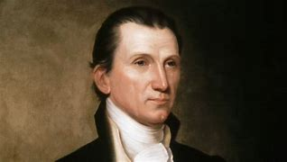

title:: 045  PRESIDENTS James Monroe: Likeable

- #  045 James Monroe: Likeable
- pure
  collapsed:: true
	- VOA Learning English presents America’s Presidents.
	- James Monroe easily won election in 1816. He had a relaxed, likeable personality and was popular with voters. In addition, many saw him as a last connection to the country’s founding generation.
	- Monroe had fought in George Washington’s army during the Revolutionary War against British rule.
	- He was a diplomat during Thomas Jefferson’s presidency and helped complete the Louisiana Purchase.
	- Monroe served as James Madison’s secretary of state — and briefly as his secretary of war, as well – during the War of 1812.
	- Voters’ positive feelings carried Monroe into office and defined his presidency.
	- ## Era of Good Feelings
	- When Monroe became president, the United States had just declared victory against British forces in the War of 1812. The American economy also was doing well, at least at first. And the government was mostly united under a single party.
	- But Monroe did have one immediate problem: He and his wife, Elizabeth, could not move into the president’s house right away. The British had burned it badly in an attack on Washington, D.C. Workers were busy making repairs.
	- So, Monroe decided to go on a trip. He spent the first weeks of his presidency traveling.
	- He went north into New England, visiting important places from the Revolutionary War or the War of 1812. Everywhere he went he reminded Americans of their shared, proud history. He even wore clothes in the old colonial style. One of Monroe’s nicknames is “the last of the cocked hats.”
	- Then President Monroe turned west, toward lands that white migrants were increasingly settling. They were able to move west in part because American soldiers had defeated a powerful alliance of Native American tribes.
	- What had been a victory for the U.S. government was a crushing loss for Native Americans. Many tribes moved farther west. Others began to lose their languages and their customs as white settlers took control.
	- For Monroe, however, the visit west was a positive sign of the country’s expansion.
	- By the time he returned to Washington, Monroe had met many Americans. He had learned for himself the geography of the country. And he had demonstrated that all parts of the U.S. could be connected by patriotism and a common federal government.
	- One newspaper called Monroe’s presidency the beginning of an “Era of Good Feelings.”
	- Four years later, Monroe won a second term even more easily than his first.
	- ## The Missouri Compromise
	- Yet James Monroe’s presidency had several crises.
	- One was the country’s first economic depression in more than 30 years.
	- Another was over slavery. The country had been divided over the issue since its founding. By the end of 1819, eleven states, all in the South, permitted slavery. Eleven states, all in the North, did not.
	- The question became: Would the new states in the West permit it?
	- Monroe had to face the question when settlers asked Congress permission for Missouri Territory to become a state. Many enslaved people already lived there. White settlers expected to bring more.
	- But a member of Congress from a Northern state proposed that Missouri could become a state only if it banned slavery. That proposal started a debate that lasted more than a year.
	- For the most part, the debate was not based on the moral problems with people owning other people. Instead, it involved economic and political concerns.
	- Northerners argued that slave-holding states had an unfair economic advantage. In addition, if Missouri entered the Union as a slave state, its lawmakers would move the balance of power toward the South.
	- The debate continued so long that another area asked to enter the Union. People in northern Massachusetts wanted to organize into an independent state called Maine.
	- After some time, lawmakers offered a compromise. They said Maine could be admitted as a free state and Missouri as a slave state. But they also made a line across a map of the country. They said Congress would not admit another slave state north of that line.
	- James Monroe signed into law what became known as the Missouri Compromise. It settled the issue of slavery, at least officially, in the U.S. for more than 20 years. But everyone knew that the peace between pro-slavery and anti-slavery groups was only temporary.
	- ## The Monroe Doctrine
	- In 1823, Monroe made one of the most important foreign policy decisions in American history. It became known as the Monroe Doctrine. It related to Spain’s colonies in Latin America.
	- Monroe had dealt with Spain before. In his first term, he and his secretary of state, John Quincy Adams, successfully negotiated with Spain to buy Florida for the United States.
	- By Monroe’s second term, Spain had also lost control of some of its former colonies in Latin America. The president became concerned that Spain’s European allies would try to help the country re-gain power. He did not want European powers interfering in areas so close to U.S. territory and so important to U.S. trade.
	- So Monroe gave a speech to Congress. He said the U.S. would stay out of Europe’s affairs. But he said Europe should also stay out of Latin America’s affairs.
	- And, Monroe declared that European powers would not be permitted to begin colonizing any area in the Western Hemisphere.
	- In other words, Monroe declared that the U.S. considered the entire Western Hemisphere its sphere of influence.
	- Historians note that Monroe did not aim for the declaration to be a major statement. But it became a base of American foreign policy and supported U.S. expansion throughout the 19th century.
	- ## Final years
	- James Monroe was the fourth and last president in the “Virginia Dynasty.” Except for John Adams, four of the first five American presidents were from Virginia.
	- ​Monroe and his wife returned to their home there after he left office. They had a close relationship with each other, as well as with their two surviving children, both daughters.
	- Unlike many politicians of his time, Monroe had brought his family with him on his travels. He also believed strongly in education for girls. When the Monroes lived in France, young Eliza Monroe attended the best school for girls in Paris.
	- This loving family spent as much time together as possible. So, when Elizabeth Monroe died, James Monroe was filled with sorrow. His health also began to fail.
	- He moved to the house of his younger daughter, Maria, in New York City. James Monroe died there one year later, at age 73.
	- Like two other former presidents, Monroe died on the 4th of July – America’s birthday.
- ---
- ## def
	- VOA Learning English presents America’s Presidents.
	- James Monroe /easily won election in 1816. He had a relaxed, likeable personality /and was popular with voters. In addition, many **saw** him **as** a last connection /to the country’s founding generation.
		- > ▶ James Monroe
		  
		- > ▶ relaxed (a.)~ (about sth) ( of a person 人 ) calm and not anxious or worried 放松的；冷静的；镇定的 /~ (about sth) not caring too much about discipline or making people follow rules 不加以拘束的
		- > ▶ likeable  ( especially BrE ) ( NAmE BrE lik·able ) pleasant and easy to like 可爱的；讨人喜欢的
	- Monroe /had fought in George Washington’s army /during the Revolutionary War against British rule.
	- He was a diplomat /during Thomas Jefferson’s presidency /and helped complete(v.) the Louisiana Purchase.
		- ((6242a810-42ee-40e9-84ad-6fc9fd95c282))
		- 他是一名外交官，帮助完成了路易斯安那州的购买。
	- Monroe **served as** James Madison’s **secretary of state** — and briefly **as** his secretary of war, **as well** – during the War of 1812.
		- 门罗曾担任詹姆斯·麦迪逊的国务卿，也曾短暂担任他的战争部长。
	- Voters’ positive feelings /**carried** Monroe **into** office /and **defined** his presidency.
		- > ▶ **carry (v.)~ sth/sb to/into sth**  : to take sth/sb to a particular point or in a particular direction 向…前进；推进到
		  -> Her abilities **carried her to** the top of her profession. 她的才能使她在本行业中出类拔萃。
		  (v.)to support the weight of sb/sth /and take them or it /from place to place; to take sb/sth /from one place to another 拿；提；搬；扛；背；抱；运送
		  -> The injured were carried away on stretchers. 伤员用担架抬走了。
		  => 来自car, 车，携带，运输。
		- 选民的积极情绪将门罗推上了白宫，并决定了他的总统任期。
	- ## Era of Good Feelings
	- When Monroe became president, the United States /had just declared victory against British forces /in the War of 1812. The American economy /also was doing well, at least at first. And the government /was mostly united /under a single party.
	- But Monroe did have one immediate problem: He and his wife, Elizabeth, could not move into the president’s house right away. The British had burned it badly /in an attack on Washington, D.C. Workers were busy(a.) /making repairs.
		- > ▶ busy (a.)~ (doing sth): spending a lot of time on sth 忙于（做某事）
		- 但是门罗确实有一个紧迫的问题 ... 工人们正忙着修复它。
	- So, Monroe decided to go on a trip. He spent the first weeks of his presidency traveling.
		- > ▶ trip (a.)a journey to a place and back again, especially a short one for pleasure or a particular purpose （尤指短程往返的）旅行，旅游，出行
	- He went north /into New England, visiting important places /from the Revolutionary War or the War of 1812. Everywhere he went /he **reminded** Americans **of** their shared, proud history. He even wore clothes /in the old colonial style. One of Monroe’s nicknames is /“the last of the cocked hats.”
		- > ▶ cocked  adj. 竖起的；翘起的 / cock 公鸡；雄鸡 ; a penis 鸡巴
		  
		- 他去了北部的新英格兰，参观了独立战争或1812年战争时期的重要地方。无论他走到哪里，他都让美国人想起他们共同的、值得骄傲的历史。他甚至穿旧殖民风格的衣服。门罗的绰号之一是“最后一顶三角帽”。
	- Then President Monroe turned west, toward lands /that white migrants were increasingly settling. They were able to move west in part /because American soldiers had defeated a powerful alliance of Native American tribes.
		- 然后门罗总统转向西部，前往白人移民越来越多定居的地方。他们能够向西移动，部分原因是美国士兵打败了一个强大的美国土著部落联盟。
	- What had been a victory /for the U.S. government /was `表` **a crushing(a.) loss** for Native Americans. Many tribes /moved farther west. Others /began to lose their languages /and their customs /as white settlers took control.
		- > ▶ crushing  (a.)used to emphasize how bad or severe sth is （强调糟糕或严重的程度）惨重的，毁坏性的
		  -> a crushing defeat in the election 在选举中的惨败
		- 美国政府的胜利对印第安人来说是毁灭性的损失。许多部落向西迁移。另一些土著在白人定居者掌权后, 开始失去他们的语言和习俗。
	- For Monroe, however, the visit west /was **a positive sign** of the country’s expansion.
	- By the time he returned to Washington, Monroe had met many Americans. He had learned for himself /the geography of the country. And he had demonstrated that /all parts of the U.S. /could be connected by patriotism /and a common federal government.
		- > ▶ **demonstrate (v.)~ sth (to sb)** : **to show sth clearly/ by giving proof or evidence** 证明；证实；论证；说明 /to show by your actions that you have a particular quality, feeling or opinion 表达；表露；表现；显露
		  -> Let me demonstrate to you /some of the difficulties we are facing. 我来向你说明一下我们面临的一些困难。
		  /**~ (against sth) |~ (in favour/support of sth)** : to take part in a public meeting or march, usually as a protest or to show support for sth 集会示威；游行示威
		  => de-加强意义 + -mon-提醒,警告 + -ster名词词尾(e略) + -ate动词词尾
		  
		- > ▶ patriotism [ U ] love of your country /and willingness to defend it 爱国主义；爱国精神
	- One newspaper /called Monroe’s presidency /the beginning of an “Era of Good Feelings.”
	- Four years later, Monroe won a second term /even more easily than his first.
	- ## The Missouri Compromise
	- Yet James Monroe’s presidency /had several crises.
		- > ▶ compromise  (n.)(v.)[ C ] an agreement /made between two people or groups /in which /each side gives up some of the things they want /so that both sides are happy at the end 妥协；折中；互让；和解
		  -> a compromise solution/agreement/candidate 折中的解决方案╱协议╱候选人
		  / the act of reaching a compromise 达成妥协（或和解）
		  /(v.)**~ (with sb) (on sth)**  : to give up some of your demands after a disagreement with sb, in order to reach an agreement （为达成协议而）妥协，折中，让步
		  => com-共同 + pro-前 + mis(-mit-)送,派 + -e动词词尾
	- One /was the country’s first economic depression /in more than 30 years.
	- Another was over slavery. The country had been divided /over the issue /since its founding. By the end of 1819, eleven states, all in the South, permitted slavery. Eleven states, all in the North, did not.
		- > ▶ over : because of or concerning sth; about sth 由于；关于
		  -> an argument over money 为了钱的争吵
		  -> a disagreement /over the best way to proceed 在如何采用最好的方法上出现的分歧
		- 另一个是关于奴隶制的。自建国以来，这个国家在这个问题上一直存在分歧。到1819年底，南方的十一个州都允许奴隶制。但在北方的11个州，则不允许。
	- The question became: Would the new states in the West /permit it?
	- Monroe had to face the question /when settlers asked Congress permission /for **Missouri Territory** to become a state. Many enslaved people already lived there. White settlers expected to bring more.
		- > ▶ territory  [ CU ] land that is under the control of a particular country or ruler 领土；版图；领地 /( also **Territory** ) [ C ] a country or an area that is part of the US, Australia or Canada /but is not a state or province （美国）准州；（澳大利亚）地区；（加拿大）地区
		- 当移民者要求国会允许密苏里地区成为一个州时，门罗不得不面对这个问题。许多被奴役的人已经生活在那里。白人定居者希望能有更多的奴隶。
	- But a member of Congress /from a Northern state /proposed that /Missouri could become a state /only if it banned slavery. That proposal /started a debate /that lasted more than a year.
		- ((6242c135-fc95-4e26-a53f-e58b617588d2))
	- For the most part, the debate /was not based on the moral problems /with people owning other people. Instead, it involved economic and political concerns.
	- Northerners argued that /slave-holding states /had an unfair economic advantage. In addition, if Missouri entered the Union /as a slave state, its lawmakers would **move the balance of power /toward** the South.
		- > ▶ northerner : a person who comes from or lives in the northern part of a country 北方人
		- 如果密苏里州以奴隶州的身份加入联邦，它的立法者就会让力量的天平倾向南方。(意思就是说, 本来美国南北各11个州正在对立, 新州如果施行奴隶制, 则南方势力就会加强)
	- The debate continued(v.) **so** long /**that** another area /asked to enter the Union. People in northern Massachusetts /wanted to organize into an independent state /called Maine.
		- 辩论持续了很长时间，以至于另一个地区要求加入联邦。麻萨诸塞州北部的人想要组成一个独立的州，叫做缅因州。
	- After some time, lawmakers offered a compromise. They said /Maine could **be admitted as** a free state /and Missouri **as** a slave state. But they also made a line /across a map of the country. They said /Congress would not admit another slave state /north of that line.
		- 一段时间后，议员们提出了一个妥协方案。他们说，缅因州可以被承认为自由州，密苏里可以被承认为奴隶州。但他们也在这个国家的地图上画了一条线。他们说，国会不会接纳这条线以北的另一个蓄奴州。
	- James Monroe signed into law /what became known as /the Missouri Compromise. It settled the issue of slavery, at least officially, in the U.S. for more than 20 years. But everyone knew that /the peace between pro-slavery and anti-slavery groups /was only temporary.
		- James Monroe签署了后来被称为密苏里妥协案的法律。
	- ## The Monroe Doctrine
	- In 1823, Monroe made one of the most important foreign policy decisions /in American history. It became known as /the Monroe Doctrine. It **related to** Spain’s colonies in Latin America.
		- id:: 6243cc60-8bee-4809-a76b-f8cc7f4c6bf5
		  > ▶ doctrine (n.)[ CU ] **a belief** or set of beliefs /held and taught by a Church, a political party, etc. 教义；主义；学说；信条
		  /**Doctrine** [ C ] ( US ) **a statement** of government policy （政府政策的）正式声明
		  -> the Monroe Doctrine 门罗主义
		  => 来自doctor, 教导，后主要指宗教教义，教条。与词根-doc-, -doct-(教)同源
		- 这就是众所周知的门罗主义。它与西班牙在拉丁美洲的殖民地有关。
	- Monroe had dealt with Spain before. In his first term, he and his secretary of state, John Quincy Adams, successfully negotiated with Spain /to buy Florida for the United States.
	- By Monroe’s second term, Spain **had also lost(v.) control of** some of its former colonies in Latin America. The president became concerned that /Spain’s European allies /would try to help the country re-gain power. He did not want European powers /**interfering in** areas /**so close to** U.S. territory /and **so important to** U.S. trade.
		- 到门罗的第二任期，西班牙已经失去了对拉丁美洲一些前殖民地的控制。美国总统开始担心西班牙的欧洲盟友, 会试图帮助该国(指西班牙)重新掌权(重新让西班牙掌握拉美)。他不希望欧洲势力干涉这些地区 -- 它们如此靠近美国领土, 和对美国贸易如此重要。
	- So Monroe **gave a speech to** Congress. He said /the U.S. would **stay out of** Europe’s affairs. But he said /Europe should also **stay out of** Latin America’s affairs.
		- > ▶ speech  [ C ] ~ (on/about sth) a formal talk that a person gives to an audience 演说；讲话；发言
		- > ▶ **stay out of sth** :
		  (1) to not become involved in sth that does not concern you 不介入；不干预
		  (2) to avoid sth 避开；远离
		  -> to stay out of trouble 避免惹麻烦
	- And, Monroe declared that /European powers would not be permitted /to begin colonizing any area in the Western Hemisphere.
	- In other words, Monroe declared that /the U.S. considered **the entire Western Hemisphere** /宾补 its **sphere of influence**.
		- 门罗还宣布，不允许欧洲列强在西半球的任何地区进行殖民。
		  换句话说，门罗宣称, 美国将整个西半球视为自己的势力范围。
	- Historians note that /Monroe did not aim for the declaration /to be a major statement. But it became a base /of American foreign policy /and supported U.S. expansion /throughout the 19th century.
		- 历史学家指出，门罗的目标, 并不是让宣言成为一个重要的声明。但它的确成为美国外交政策的基础，并支持美国在整个19世纪的扩张。
		- > ▶ Monroe Doctrine : 门罗主义. 是美国总统詹姆斯·门罗的一种思想观点，是一项关于美洲大陆控制权的美国外交政策。内容是:
		  -> 美国政府认为欧洲列强不应再殖民美洲，或涉足美国与墨西哥等美洲国家之主权相关事务。
		  -> 而对于欧洲各国之间的争端，或各国与其美洲殖民地之间的战事，美国保持中立。相关战事若发生于美洲，美国将视为具敌意之行为。
		  这是美国涉外事务之转捩点，直到世界大战的爆发才有所改变。直到19世纪末，门罗的声明被视为定义美国基本外交政策的起始点，也是持续时间最长的意识形态之一。门罗主义目的和影响持续超过一个世纪的时间，其间只有很小的变化。
		  其主旨在于让拉丁美洲刚独立的殖民地免受欧洲的干预，避免新世界沦为旧世界列强的战场，从而使美国能够不受干扰的施加影响力。该主义宣称，新旧世界两者的势力范围需要保持清晰的区隔。
	- ## Final years
	- James Monroe /was the fourth and last president /in the “Virginia Dynasty.” Except for John Adams, four of the first five American presidents /were from Virginia.
		- > ▶ dynasty : a series of rulers of a country /who all belong to the same family 王朝；朝代
		- 詹姆斯·门罗是“弗吉尼亚王朝”的第四任也是最后一任总统。除了约翰·亚当斯，美国前五位总统中有四位来自弗吉尼亚。
	- ​Monroe and his wife /returned to their home there /after he left office. They had a close relationship /with each other, as well as with their two surviving children, both daughters.
	- Unlike many politicians of his time, Monroe **had brought** his family **with** him /on his travels. He also believed strongly /in education for girls. When the Monroes lived in France, young Eliza Monroe /attended the best school for girls /in Paris.
		- ((6243aee7-55d4-46d8-ad80-d2cdb2c81c87))
		- 与同时代的许多政治家不同，门罗旅行时带着家人。他还强烈支持女孩的教育。当门罗一家住在法国时，年轻的伊丽莎·门罗就读于巴黎最好的女子学校。
	- This loving family /spent **as much** time together **as possible**. So, when Elizabeth Monroe died, James Monroe was filled with sorrow. His health also began to fail.
		- ((6242bdd1-6430-4853-9468-3920e5e1e04e))
	- He moved to the house of his younger daughter, Maria, in New York City. James Monroe died there /one year later, at age 73.
	- Like two other former presidents, Monroe died /on the 4th of July – America’s birthday.
-