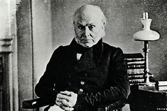
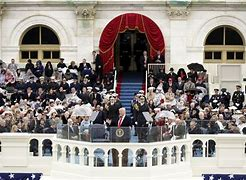

title:: 046 John Quincy Adams: Independent

- # 046 John Quincy Adams: Independent
- pure
  collapsed:: true
	- VOA Learning English presents America’s Presidents.
	- Today we are talking about John Quincy Adams. Does his name sound familiar? John Quincy Adams, the sixth president, was the son of John Adams, the second president.
	- John Quincy Adams portrait by Gilbert Stuart. Quincy Adams was president from 1825-1829.
	  John Quincy Adams portrait by Gilbert Stuart. Quincy Adams was president from 1825-1829.
	  Like his father, Quincy Adams had a sharp mind and a difficult personality. And, like his father, Quincy Adams served only one four-year term in office.
	- But Quincy Adams went on to have many successful years working in a different job. He is the only former president (so far) to serve in the House of Representatives.
	- ## Great expectations
	- The parents of John Quincy Adams, John and Abigail, were strong patriots. Theirs was one of the founding families of America.
	- Abigail Adams especially raised her son to serve his country. She expected him to become president. She told him that, with his good education and training, if he did not serve in a high public office it would be his own fault.
	- Quincy Adams did not disappoint his mother. As a child, he learned to speak at least four languages and read Greek and Latin. He also studied Shakespeare’s plays.
	- At age 10, he traveled with his father to Europe. As a young man, he worked alongside John Adams in American diplomatic offices in Paris, Amsterdam and St. Petersburg.
	- Finally, Quincy Adams returned to his home in Boston in time to graduate from Harvard. He was working as a lawyer by the age of 23.
	- Stories confirm that Quincy Adams was a brilliant boy and young man. But he rarely compromised his ideas. His inability to work with other lawmakers and to consider public opinion were partly to blame for his difficult presidency.
	- ## Poor politician. Excellent diplomat
	- Quincy Adams may have been a poor politician, but he was an excellent diplomat. In the early part of his career, he served as the American ambassador to the Netherlands, Germany, Russia and Britain.
	- He helped lead the negotiations that ended the War of 1812.
	- And he served for eight years as secretary of state under James Monroe.
	- Some of that president’s accomplishments owe a lot to Quincy Adams. He helped negotiate the purchase of Florida from Spain.
	- And, he was of the people responsible for the Monroe Doctrine. It warned Europe not to interfere in the Western Hemisphere.
	- But Quincy Adams could be impatient, especially with lawmakers. Many of them, he believed, did not care much about the country and wanted to help only themselves.
	- Quincy Adams also avoided political battles. As secretary of state, he appointed people whom he thought were capable, even if they did not support his political party.
	  Similarly, when he became president, he tried to bring political opponents -- along with representatives of different parts of the country -- together in his cabinet.
	- His opponents, however, refused to serve.
	- And, although his cabinet included southerners, he did not really have the support of the South.
	- ## Presidency
	- Yet Quincy Adams talked about unity in his presidential inaugural speech. Adams said the Constitution and the representative democracy of the United States had proved a success. The nation was free and strong and stretched across the continent, from the Atlantic Ocean to the Pacific.
	- He noted that political divisions had eased. So now, he said, it was time for the people to settle their differences and make a truly national government.
	- In his first message to Congress, President Adams described his ideas.
	- The chief purpose of the government, he said, was to improve the lives of the people it governed. To do this, he offered a national program of building roads and canals. He also proposed a national university and a national scientific center.
	- Adams said Congress should not be limited to making laws only to improve the nation's economic life. He said it should make laws to improve the arts and sciences, too.
	- But many people of the West and South did not believe that the Constitution gave the federal government the power to do all these things. They believed these powers belonged to the states.
	- Their representatives in Congress rejected the president’s proposals.
	- In addition, a new opposition party was trying to weaken support for Quincy Adams. They supported a general from Tennessee named Andrew Jackson.
	- Historian Harlow Giles Unger says John Quincy Adams was never able to meet the high expectations many people had for him.
	- “His presidency was a complete failure,” Unger told VOA. “He was able to accomplish nothing.”
	- ## Retirement … sort of
	- Quincy Adams lost the presidential election of 1828 in a landslide.
	- He refused to attend the inauguration of Andrew Jackson. He returned to his home in Quincy, Massachusetts depressed and worried about the country.
	- His wife, Louisa Catherine Johnson Adams, believed they were returning to Massachusetts to stay. She was an American, but was born in England. Her mother was British. She was, at the time, the first foreign-born first lady.
	- John and Louisa had four children, but their only daughter had died as a baby. Their sons were grown by the time Quincy Adams retired from the presidency.
	- Soon he became restless.
	- Some neighbors asked if Quincy Adams would consider representing the district as a member of the U.S. Congress. He agreed – but only if voters would let him act as he believed was right, instead of as what would be politically popular.
	- Apparently they agreed, too, because voters elected Quincy Adams to the House of Representatives nine times.
	- In Congress, Quincy Adams often fought for citizen’s individual liberty. He strongly opposed slavery. His ideas were not widely popular at the time, especially among other lawmakers. They had created a rule that said Congress would not even consider any measures against slavery.
	  Yet Quincy Adams defended the rights of enslaved people -- frequently, and sometimes successfully.
	- He died at the age of 88, a few days after suffering a stroke on the floor of the House of Representatives.
	- At the time, lawmakers were considering a proposal. And, as usual, John Quincy Adams was loudly voting no.
- ---
- ## def
	- VOA Learning English presents America’s Presidents.
	- Today we are talking about John Quincy Adams. Does his name sound familiar? John Quincy Adams, the sixth president, was the son of John Adams, the second president.
		- > ▶ John Quincy Adams
		  
	- Like his father, Quincy Adams had a sharp mind /and a difficult personality. And, like his father, Quincy Adams served only one four-year term in office.
		- > ▶ difficult  ( of people 人 ) not easy to please; not helpful 难以讨好的；难以取悦的；不愿帮助的
	- But Quincy Adams went on /to have many successful years /working in a different job. He is the only former president (so far) /to serve in **the House of Representatives**.
		- 和他的父亲一样，昆西·亚当斯(Quincy Adams)也只担任了四年任期。
		  但昆西·亚当斯在另一份工作中取得了多年的成功。他是(到目前为止)唯一一位在众议院任职的前总统。
	- ## Great expectations
	- The parents of John Quincy Adams, John and Abigail, were strong patriots. Theirs was one of the founding families of America.
		- id:: be19803d-cb2c-468a-87da-67f4ac252d56
		  > ▶ expectation [ C ] [ usually pl.U ] **a hope** that sth good will happen 希望；盼望
		  ->The results exceeded our expectations. 结果比我们希望的还好。
		  /[ Cusually pl. ] **a strong belief** about the way sth should happen /or how sb should behave 期望；指望
		  /[ UC ] ~ (of sth)~ (that...) : **a belief** that sth will happen /because it is likely 预料；预期；期待
		  => ex-出,向外(x发音为ks) + -spect-看(s因和x发音重复而省略) + -ation名词词尾
	- Abigail Adams especially raised her son /to serve his country. She expected him /to become president. She told him that, with his good education and training, if he did not serve in a high public office /it would be his own fault.
		- > ▶ **public office** N-UNCOUNT Someone who is in public office is in a job that they have been elected to do by the public. 公职
		- 如果他不担任高级公职，那将是他自己的过错。
	- Quincy Adams did not disappoint his mother. As a child, he learned to speak at least four languages /and read Greek and Latin. He also studied Shakespeare’s plays.
	- At age 10, he traveled with his father to Europe. As a young man, he worked alongside John Adams /in American diplomatic offices /in Paris, Amsterdam and St. Petersburg.
	- Finally, Quincy Adams returned to his home in Boston in time /to graduate from Harvard. He was working as a lawyer /by the age of 23.
	- Stories confirm that /Quincy Adams was a brilliant boy and young man. But he rarely compromised his ideas. His inability /to work with other lawmakers /and to consider public opinion /**were partly to blame for** his difficult presidency.
		- > ▶ blame (v.)[ VN ] ~ sb/sth (for sth) |~ sth on sb/sth : to think or say that sb/sth is responsible for sth bad 把…归咎于；责怪；指责
		  ▶ **be to blame (for sth)** :
		  to be responsible for sth bad （对坏事）负有责任
		  -> Which driver /was to blame for the accident? 哪位司机是此次事故的肇事者？
		- 但他很少妥协自己的观点。他无法与其他议员合作，也不考虑公众舆论，这在一定程度上导致了他在总统任期内的困境。
	- ## Poor politician. Excellent diplomat
	- Quincy Adams may have been a poor politician, but he was an excellent diplomat. In the early part of his career, he served as the American ambassador to the Netherlands, Germany, Russia and Britain.
		- ((62313b00-775d-416d-9414-a9d60cd66f76))
	- He helped lead the negotiations /that ended the War of 1812.
	- And he **served** for eight years **as** secretary of state under James Monroe.
	- Some of that president’s accomplishments /owe(v.) a lot to Quincy Adams. He helped negotiate the purchase of Florida /from Spain.
		- 这位总统的一些成就在很大程度上要归功于昆西·亚当斯。他参与了从西班牙购买佛罗里达的谈判。
	- And, he was of the people /responsible(a.) for the Monroe Doctrine. It warned Europe not to **interfere(v.) in** the Western Hemisphere.
		- > ▶ responsible (a.) ~ (for sb/sth) |~ (for doing sth) : having the job or duty of doing sth or taking care of sb/sth, so that you may be blamed if sth goes wrong 有责任；负责；承担义务 /~ (for sth) being the cause of sth 作为原因；成为起因
		  -> Cigarette smoking is responsible for about 90% of deaths from lung cancer. 因患肺癌而死亡者，约90%是吸烟所致。
		- 他是门罗主义的支持者。
	- But Quincy Adams could **be impatient**, especially **with** lawmakers. Many of them, he believed, did not **care much about** the country /and wanted to help only themselves.
		- > ▶ **impatient (a.)~ (with sb/sth) |~ (at sth)** : annoyed or irritated by sb/sth, especially because you have to wait for a long time 不耐烦的；没有耐心的
		- 但昆西·亚当斯(Quincy Adams)可能会失去耐心，尤其是对议员们。他认为，他们中的许多人并不关心国家，只想帮助自己。
	- Quincy Adams also avoided political battles. As secretary of state, he appointed people /whom he thought were capable, even if they did not support his political party.
	  Similarly, when he became president, he tried **to bring** political opponents -- **along with** representatives(n.) of different parts of the country -- **together** in his cabinet.
		- 同样，当他成为总统时，他试图把政治对手——以及国家不同地区的代表——召集到他的内阁中。
	- His opponents, however, refused to serve.
	- And, although his cabinet included southerners, he did not really have the support of the South.
		- 尽管他的内阁中有南方人，但他并没有得到南方的支持。
	- ## Presidency
	- Yet Quincy Adams talked about unity /in his **presidential inaugural(a.) speech**. Adams said /the Constitution and **the representative democracy** of the United States /had proved a success. The nation was free and strong /and stretched across the continent, from the Atlantic Ocean to the Pacific.
		- id:: ac1ba830-4dcf-4812-abd0-461ee5bee81c
		  > ▶ inaugural (a.)( of an official speech, meeting, etc. 正式讲话、会议等 ) **first, and marking the beginning of sth important,** for example the time when a new leader or parliament starts work, when a new organization is formed or when sth is used for the first time 就职的；开幕的；成立的；创始的
		  -> the President's **inaugural address** 总统的就职演说
		  -> **the inaugural flight** of the space shuttle 航天飞机的首次飞行
		  =>  in-向内 + -augur-占卜 + -ate动词词尾 → 古代占卜时是很庄严的 → 使进入庄严状态
		  
		- 然而，昆西·亚当斯在他的总统就职演说中谈到了团结。亚当斯说，美国宪法和代议制民主, 被证明是成功的。
	- He noted that /political divisions had eased. So now, he said, it was time /for the people to settle their differences /and make a truly national government.
		- > ▶ ease (v.) to become or to make sth less unpleasant, painful, severe, etc. （使）宽慰；减轻；缓解 SYN alleviate / to make sth easier 使…容易些
		  -> This should help ease the pain. 这该有助于减轻痛苦。
		- 他指出，政治分歧已经缓解。
	- In his first message to Congress, President Adams /described his ideas.
	- The chief purpose of the government, he said, was to improve the lives of the people /it governed. To do this, he offered a national program /of building roads and canals. He also proposed a national university /and a national scientific center.
	- Adams said /Congress should not be limited /to making laws /only to improve the nation's economic life. He said /it should make laws /to improve the arts and sciences, too.
		- 亚当斯说，国会不应该仅仅为了改善国家的经济生活而制定法律。他说，政府也应该制定法律来改善艺术和科学。
	- But many people of the West and South /did not believe that /the Constitution gave the federal government the power /to do all these things. They believed /these powers belonged to the states.
	- Their representatives in Congress /rejected the president’s proposals.
	- In addition, a new opposition party /was trying to weaken support for Quincy Adams. They supported a general /from Tennessee /named Andrew Jackson.
	- Historian Harlow Giles Unger says /John Quincy Adams was never able to meet the high expectations /many people had /for him.
		- 约翰·昆西·亚当斯从来没有能够满足许多人对他的高期望。
	- “His presidency was a complete failure,” Unger told VOA. “He was able to accomplish nothing.”
		- 他一事无成。
	- ## Retirement … sort of
	- Quincy Adams lost(v.) the presidential election of 1828 /in a landslide.
		- id:: c5ea4b73-acac-4f76-950f-4ba35562aeec
		  > ▶ landslide (n.)( also land·fall ) a mass of earth, rock, etc. that falls down the slope of a mountain or a cliff （山坡或悬崖的）崩塌，塌方，滑坡，地滑 /an election in which one person or party gets very many more votes than the other people or parties 一方选票占压倒多数的选举；一方占绝对优势的选举
	- He refused to attend the inauguration of Andrew Jackson. He returned to his home in Quincy, Massachusetts /depressed(v.) and worried about the country.
		- 他拒绝参加 Andrew Jackson的就职典礼。他沮丧地回到马萨诸塞州昆西的家中，为这个国家担忧。
	- His wife, Louisa Catherine Johnson Adams, believed /they were returning to Massachusetts to stay. She was an American, but was born in England. Her mother was British. She was, at the time, the first foreign-born first lady.
	- John and Louisa /had four children, but their only daughter had died /as a baby. Their sons were grown(a.) /by the time Quincy Adams retired from the presidency.
		- > ▶ grown (a.)( of a person 人 ) mentally and physically an adult 成熟的；成年的；长大的
		  -> It's pathetic /that **grown men** have to resort to violence like this. 成年人还得这样诉诸暴力，真可悲。
		- 昆西·亚当斯从总统职位退休时，他们的儿子已经长大成人。
	- Soon he became restless.
		- restless (a.)unable to stay still or be happy where you are, because you are bored or need a change 坐立不安的；不耐烦的 /without real rest or sleep 没有真正休息的；没有睡眠的
	- Some neighbors asked /if Quincy Adams would consider(v.) /**representing** the district **as** a member of the U.S. Congress. He agreed – but **only if** /voters would let him **act as** he believed was right, instead of **as** what would be politically popular.
		- 一些邻居问昆西·亚当斯, 是否会考虑作为美国国会议员, 代表该地区。他同意了，但前提是, 选民允许他按照自己认为正确的方式行事，而不是按照在政治上受欢迎的方式行事。
	- Apparently they agreed, too, because voters **elected** Quincy Adams **to** the House of Representatives /nine times.
	- In Congress, Quincy Adams often **fought for** citizen’s individual liberty. He strongly opposed slavery. His ideas were not widely popular /at the time, especially among other lawmakers. They had created a rule /that said Congress would not even consider any measures against slavery.
		- 他强烈反对奴隶制。他的想法当时并不受欢迎，尤其是在其他议员中。他们制定了一项规定，规定国会甚至不会考虑任何反对奴隶制的措施。
	- Yet Quincy Adams defended the rights of enslaved people -- frequently, and sometimes successfully.
	- He died at the age of 88, a few days /after **suffering a stroke** /on the floor of the House of Representatives.
		- > ▶ stroke : a sudden serious illness /when **a blood vessel (= tube) in the brain /bursts or is blocked**, which can cause death /or the loss of the ability /to move or to speak clearly 中风
		  -> to have/suffer a stroke 患中风
	- At the time, lawmakers were considering a proposal. And, as usual, John Quincy Adams was loudly voting no.
		- 当时，议员们正在考虑一项提案。和往常一样，约翰·昆西·亚当斯大声地投了反对票。
-