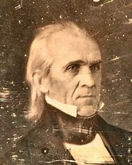

title:: 051 James K. Polk: Dark Horse

- ## 051 James K. Polk: Dark Horse
- ## pure
  collapsed:: true
	- VOA Learning English presents America's Presidents.
	- James Knox Polk moved into the White House as the 11th president of the United States in 1845.
	- Few had predicted that Polk would become president. Even he was surprised.
	- Polk had come to his party's presidential nominating convention nearly a year earlier with low expectations. But the top politicians, including former president Martin Van Buren, failed to win a majority of votes.
	- Convention delegates tried again and again to agree on a candidate. Eventually, Polk was nominated. A small number of delegates supported him. Then the delegates voted again.
	- This time, Polk received all 266 votes. He became the first dark horse candidate in U.S. history to be nominated by a major party. In other words, he was someone no one thought would win. But he did.
	- ## Early life
	- Polk was born in the southeastern state of North Carolina. When he was a child, his family moved west, to Tennessee. At the time, Tennessee had few white settlers. Some considered it the wilderness.
	- Polk's family did well there. His father became wealthy, buying land and enslaved people.
	- His mother Jane, who followed strict, Christian religious teachings, gave her 10 children a good education. James was the oldest. He went to college, then studied law.
	- When he was 25, he married an intelligent and wealthy young woman named Sarah Childress. The two never had children. But they worked together to launch Polk's political career.
	- In time, Polk was elected to the Tennessee House of Representatives, then the national House of Representatives.
	- There, he developed a close relationship with President Andrew Jackson. Since Jackson was called "Old Hickory," Polk became known as "Young Hickory."
	- When Polk left Congress and returned to Tennessee to become governor, he supported Jackson's banking reforms. But soon the U.S. economy collapsed. Tennessee voters failed to re-elect Polk as governor – not once, but twice.
	- So Polk returned to his plantations and waited for a chance to re-enter national politics.
	- In 1844, Polk traveled to the city of Baltimore to attend the Democratic Party's national convention. He thought he could perhaps win the nomination for vice president. Instead, he became the Democrats' candidate for president.
	- Several months later, he narrowly defeated the opposing party's candidate in the national election.
	- ## Why Polk won
	- Historian Robert Merry wrote a book about Polk's presidency. Merry says one reason Polk won the election was the issue of Texas. Polk wanted to make Texas a state. He thought the United States could take possession of the area peacefully. The other leading candidates did not.
	- Merry says the other candidates were right – the United States eventually went to war with Mexico. But Polk spoke for the American people.
	- In the 1840s, many Americans liked the idea of expanding the country. They believed in "manifest destiny" -- the idea that God wanted America to expand west, all the way to the Pacific Ocean, and take control of the continent.
	- As a result, many voters supported Polk and his promise to add Texas to the United States.
	  Polk took another unusual position in the 1844 election. He said if he won the presidency, he would serve only one term -- that is, four years. (Several previous presidents had served two terms.)
	- Polk told voters presidents might abuse their power if they held office too long. One term, he said, would be enough for him.
	- But Robert Merry says there was more to Polk's one-term promise. It was a political bet.
	- Polk thought if he said he would serve as president for only one term, other party leaders might help him win. Then, those politicians could try again to win the presidency in four years, instead of waiting eight.
	- He was probably right. If Polk had not made the campaign promise, Merry says, Young Hickory would not have won.
	- ## Presidency
	- During the first days of his administration, James K. Polk famously listed the four things he planned to do as president.
	- He wanted to reduce taxes on imports. He wished to establish an independent treasury. He hoped to settle the dispute with Britain over the Oregon border. And he wanted to get California for the United States.
	- Less than four years later, Polk had realized each item on his list.
	- He is remembered for greatly expanding the size of the United States. He successfully negotiated with Britain for U.S. control over territory in the west up to the 49th parallel. The agreement gave the U.S. the current states of Oregon, Idaho, and Washington.
	- Below those states lay California.
	- An American government minister once described California as the richest, the most beautiful, and the healthiest country in the world. The official said the port of San Francisco was big enough to hold all the navies of the world. He said someday San Francisco would control the trade of all the Pacific Ocean.
	- There was only one problem, from the point of view of the U.S. government. California was part of Mexico.
	- At first, U.S. officials attempted to buy California from Mexico. But Mexican officials refused even to talk about selling California to the United States.
	- Shortly after the U.S. Congress approved statehood for Texas in early 1845, Mexico broke relations with the U.S. all together.
	- The following year, Mexican troops crossed the Rio Grande and clashed with American soldiers.
	- In answer, President Polk asked Congress to declare war.
	- He did not think the conflict would last long. He believed the U.S. declaration would quickly force Mexico to sell him the territory he wanted.
	- Polk was wrong. Historian Robert Merry says the war with Mexico lasted longer, was more expensive, and cost more lives than he expected.
	- But in the 1848 treaty that ended the war, Polk got the land he had wanted.
	- Mexico recognized the independence of Texas, and it sold the areas that are now all or part of the states of Arizona, Utah, Nevada, New Mexico, Wyoming, Colorado and, yes, California.
	- ## Legacy
	- President Polk kept his promise to serve only one term. After four years, he retired from the presidency, traveled for a few weeks, and then returned to Tennessee to settle in a new home.
	- James Polk, about 1849
	  James Polk, about 1849
	  Only three months after he left the White House, Polk died.
	- He left behind a much larger country, but a divided one.
	- The issue was again slavery. Southerners argued that they had the right to take enslaved people into California and other former Mexican lands. Northerners opposed any further spread of slavery.
	- The question was this: did Congress have the power to control – or even ban – slavery in the new territories?
- ---
- ## def
	- VOA Learning English presents America's Presidents.
	- James Knox Polk moved into the White House /as the 11th president of the United States /in 1845.
		- > ▶ James Knox Polk
		  
	- Few had predicted that /Polk would become president. Even he was surprised.
	- Polk had come to his party's **presidential nominating convention** /nearly a year earlier /with low expectations. But the top politicians, including former president Martin Van Buren, failed to win a majority of votes.
		- 波尔克在近一年前参加民主党总统候选人提名大会时，对他的期望值很低。但是，包括前总统马丁·范布伦在内的高层政界人士, 都未能赢得多数选票。
	- Convention delegates(n.) tried again and again /**to agree on** a candidate. Eventually, Polk was nominated. A small number of delegates supported him. Then the delegates(n.) voted again.
		- ((62428a6d-86df-4487-9b13-bee617f8ce07))
		- 大会代表们, 一次又一次地试图就候选人达成一致。最终，波尔克获得了提名。少数代表支持他。然后，代表们再次投票。
	- This time, Polk received all 266 votes. He became the first **dark horse** candidate /in U.S. history /to be nominated by a major party. In other words, he was someone /no one thought would win. But he did.
	- ## Early life
	- Polk was born /in the southeastern state of North Carolina. When he was a child, his family moved west, to Tennessee. At the time, Tennessee had few white settlers. Some considered it /the wilderness.
		- > ▶ wilderness (n.)a large area of land that has never been developed or used for growing crops because it is difficult to live there 未开发的地区；荒无人烟的地区；荒野 /荒芜的地方；杂草丛生处
		- 当时，田纳西州几乎没有白人定居者。有些人认为它是荒野。
	- Polk's family /did well there. His father became wealthy, buying land and enslaved(a.) people.
	- His mother Jane, who followed strict, Christian religious teachings, gave her 10 children /a good education. James was the oldest. He went to college, then studied law.
		- 他的母亲, 简, 遵循严格的基督教教义
	- When he was 25, he married an intelligent and wealthy young woman /named Sarah Childress. The two never had children. But they worked together /to launch Polk's political career.
		- 但他们共同努力，开启了波尔克的政治生涯。
	- In time, Polk was elected to the Tennessee **House of Representatives**, then the national **House of Representatives**.
	- There, he **developed a close relationship /with** President Andrew Jackson. Since Jackson was called "Old Hickory," Polk became known as "Young Hickory."
	- When Polk left Congress /and returned to Tennessee /to become governor, he supported Jackson's **banking reforms**. But soon /the U.S. economy collapsed. Tennessee voters /failed to re-elect Polk as governor – not once, but twice.
	- So Polk returned to his plantations /and waited for a chance /to re-enter national politics.
	- In 1844, Polk **traveled to** the city of Baltimore /to attend the Democratic Party's national convention. He thought /he could perhaps win the nomination for vice president. Instead, he became the Democrats' candidate for president.
	- Several months later, he narrowly defeated the opposing party's candidate /in the national election.
	- ## Why Polk won
	- Historian Robert Merry /wrote a book about Polk's presidency. Merry says /one reason Polk won the election /was the issue of Texas. Polk wanted to make Texas a state. He thought /the United States could **take possession of** the area peacefully. The other leading candidates did not.
		- id:: 6256765d-ffc8-43c4-803e-0f484d686687
		  > ▶ possession  [ U ] ( formal ) the state of having or owning sth 具有；拥有
		  -> You cannot legally **take possession of** the property (= start using it after buying it) until three weeks after the contract is signed. 契约签署三周以后，你才能合法取得这份产业的所有权。
		  ->  On her father's death, she **came into possession of** (= received) a vast fortune. 她父亲死后，她继承了一大笔财产。
		- 波尔克赢得选举的一个原因是德克萨斯州的问题。波尔克想让德克萨斯成为一个州。他认为美国可以和平占领该地区。而其他领先的候选人则不认为。
	- Merry says /the other candidates were right – the United States eventually went to war with Mexico. But Polk spoke for the American people.
	- In the 1840s, many Americans liked the idea of expanding the country. They believed in "manifest(a.) destiny(n.)" -- the idea /that God wanted America to expand west, all the way to the Pacific Ocean, and take control of the continent.
		- > ▶ manifest (a.)~ (to sb) (in sth)~ (in sth) ( formal ) easy to see or understand 明显的；显而易见的
		  -> His nervousness was manifest(a.) to all those present. 所有在场的人都看出了他很紧张。
		  => His nervousness was manifest to all those present. 所有在场的人都看出了他很紧张。
		- > ▶ destiny (n.)[ C ] what happens to sb or what will happen to them in the future, especially things that they cannot change or avoid 命运；天命；天数
		  => 词源同destination, 目的的。用于神学名词命运。
	- As a result, many voters supported Polk /and his promise /to add Texas to the United States.
	  Polk took another unusual position /in the 1844 election. He said /if he won the presidency, he would serve only one term -- that is, four years. (Several previous presidents had served two terms.)
	- Polk told voters /presidents might **abuse(v.) their power** /if they **held office** too long. One term, he said, would be enough for him.
	- But Robert Merry says /there was more to Polk's one-term promise. It was a political bet.
		- 波尔克的任期承诺, 还有更多内容。这是一个政治赌注。
	- Polk thought /if he said /he would serve as president /for only one term, other party leaders /might help him win. Then, those politicians /could try again /to win the presidency /in four years, instead of waiting eight.
		- 然后，这些政治家可以在四年后再次尝试赢得总统选举，而不是等待8年。
	- He was probably right. If Polk had not made the campaign promise, Merry says, Young Hickory would not have won.
	- ## Presidency
	- During the first days of his administration, James K. Polk famously listed(v.) the four things /he planned to do as president.
	- He wanted to **reduce(v.) taxes** on imports. He wished to establish an independent treasury. He hoped **to settle the dispute with** Britain /over the Oregon border. And he wanted to get California for the United States.
		- > ▶ treasury : the Treasury [ sing.+sing./pl.v. ] (in Britain, the US and some other countries) the government department that controls public money （英国、美国和其他一些国家的）财政部  /a place in a castle, etc. where valuable things are stored （城堡等中的）金银财宝库，宝库
		- 他想减少进口税。他希望建立一个独立的金库。他希望解决与英国关于俄勒冈州边界的争端。他想让加州成为美国的一部分。
	- Less than four years later, Polk had realized each item /on his list.
	- He is remembered /for greatly expanding the size of the United States. He successfully **negotiated with** Britain /for U.S. control(n.) /over territory in the west /**up to** the 49th parallel. The agreement /gave the U.S. /**the current states** of Oregon, Idaho, and Washington.
		- > ▶ parallel （地球或地图的）纬线，纬圈 /[ CU ] a person, a situation, an event, etc. that is very similar to another, especially one in a different place or time （尤指不同地点或时间的）极其相似的人（或情况、事件等）
		  -> This is an achievement /**without parallel** in modern times. 这是现代无可比拟的成就。
		- 他成功地与英国谈判，争取到了美国在西线49度以北地区的控制权。根据该协议，美国拥有目前的俄勒冈州、爱达荷州和华盛顿州。
	- Below those states /lay(v.) California.
		- 这些州的下面是加利福尼亚。
	- An American government minister /once **described** California **as** the richest, the most beautiful, and the healthiest country in the world. The official said /the port of San Francisco /was big enough /to hold all the navies of the world. He said /someday San Francisco would control the trade of all the Pacific Ocean.
		- > ▶ minister  ( often Minister ) ( BrE ) (in Britain and many other countries) a senior member of the government who is in charge of a government department or a branch of one （英国及其他许多国家的）部长，大臣
		- 一位美国政府部长曾形容加州是世界上最富有、最美丽、最健康的地区。这位官员说，旧金山港口足够容纳世界上所有的海军。他说，有一天旧金山将控制整个太平洋的贸易。
	- There was only one problem, from **the point of view** of the U.S. government. California was part of Mexico.
		- 从美国政府的角度来看，只有一个问题。加利福尼亚是墨西哥的一部分。
	- At first, U.S. officials /attempted to buy California from Mexico. But Mexican officials refused even to talk about selling California to the United States.
	- Shortly after the U.S. Congress **approved**(v.) statehood **for** Texas /in early 1845, Mexico **broke(v.) relations with** the U.S. all together.
		- > ▶ statehood (n.)the fact of being an independent country and of having the rights and powers of a country 独立国家地位 /the condition of being one of the states within a country such as the US or Australia 州（或邦）的地位
		- 1845年初，美国国会批准德克萨斯成为美国的一个州后不久，墨西哥就与美国断绝了关系。
	- The following year, Mexican troops crossed(v.) the Rio Grande /and clashed(v.) with American soldiers.
		- Rio Grande 河名
	- In answer, President Polk asked Congress to declare war.
	- He did not think /the conflict would last long. He believed the U.S. declaration /would quickly force Mexico to sell him the territory he wanted.
	- Polk was wrong. Historian Robert Merry says /the war with Mexico lasted longer, was more expensive, and cost(v.) more lives than he expected.
	- But in the 1848 treaty /that ended the war, Polk got the land he had wanted.
	- Mexico recognized the independence of Texas, and it sold the areas /that are now all or part of the states of Arizona, Utah, Nevada, New Mexico, Wyoming, Colorado and, yes, California.
	- ## Legacy
	- President Polk /kept his promise /to serve only one term. After four years, he retired from the presidency, traveled for a few weeks, and then returned to Tennessee /to settle in a new home.
	- Only three months after he left the White House, Polk died.
	- He left behind a much larger country, but a divided one.
	- The issue was again slavery. Southerners argued that /they had the right /to take enslaved people into California and other former Mexican lands. Northerners opposed(v.) any further spread of slavery.
	- The question was this: did Congress have the power /to control – or even ban(v.) – slavery /in the new territories?
-