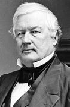

title:: 053 Millard Fillmore: Forgotten

- ## 053 Millard Fillmore: Forgotten
- ## pure
  collapsed:: true
	- VOA Learning English presents America's Presidents.
	- Today we are talking about Millard Fillmore, the 13th president of the United States.
	- Fillmore is also likely the least remembered president. He has been called "uninspiring" and having only "some competence."
	- But Fillmore provided an example of the American dream come true. He rose from a poor family to become a wealthy man. He was elected to Congress four times and nominated for vice president under Zachary Taylor. When Taylor unexpectedly died in office in 1850, Fillmore took his place.
	- ## Early life
	- Other presidents' campaigns, such as Andrew Jackson's, had spoken proudly of their candidates' modest beginnings. William Henry Harrison's supporters especially linked him with the image of a simple house called a log cabin – even though William Henry Harrison was a wealthy man.
	- But Millard Fillmore really was born in a log cabin. His family was poor. They raised him and his seven brothers and sisters in a rural part of New York State.
	- Fillmore did not receive much education as a child. However, he was very interested in learning – so interested that he fell in love with his teacher, Abigail Powers.
	- The two married after he launched his career as a lawyer. They had two children, a son and a daughter.
	- Millard Fillmore soon entered politics. He won elections to the New York State Assembly, and then to the U.S. House of Representatives.
	- After eight years in Washington, DC, Fillmore returned to New York. He failed to be elected governor, but succeeded to become comptroller of New York. In other words, he oversaw the state's finances.
	- At that time, Americans were preparing for another presidential election. President James Polk was retiring from the White House after only one term, as he had promised.
	- The opposition party, the Whigs, nominated Zachary Taylor as their presidential candidate.
	- Taylor, a popular war hero from the South, owned slaves. But the Whigs realized that many anti-slavery voters in the North would not support Taylor. Party leaders were looking for someone to balance the ticket – a Northerner voters would consider a friend of business.
	- They found Millard Fillmore.
	- In 1847, the Whigs nominated Fillmore as Taylor's vice president. The two men had never met. And, when they did meet, they did not like each other very much.
	- Taylor was short-legged, poorly educated, and rarely seemed concerned about his physical appearance. Fillmore was taller, learned, and elegant. Their personalities did not fit together any better than their appearances did.
	- But a majority of voters liked them. The Whigs won the election, and Fillmore returned to Washington.
	- ## A vice president without a voice
	- As vice president, Millard Fillmore was the leader of the Senate. But President Taylor did not seek his advice on the major political issue of the day.
	- At the time, both lawmakers and the public were debating whether the government should – and could – ban slavery in the territories the U.S. had gained after the war with Mexico.
	- In general, Northerners did not want to permit slavery in new states. But many Southerners did. The debate was so heated that one of the Southern states, South Carolina, threatened to leave the Union.
	- President Taylor did not want to expand slavery. To restrict it, he proposed a change to the rules so California and New Mexico could enter the Union quickly as slave-free states.
	- But before Taylor's idea could get too far, he became sick. Fillmore learned the president was not well and prepared for the worst. It came.
	- Taylor died after being in office for only 16 months. The following day, Fillmore was sworn-in as president.
	- ## Presidency
	- One of Fillmore's first acts as president was to show where he stood on the slavery issue. He appointed a man who opposed Taylor to secretary of state.
	- That man, Daniel Webster – and others – wanted to pass a compromise bill on slavery. With Fillmore's support, they succeeded.
	- The Compromise of 1850 included several measures related to slavery. Two measures limited it: California was admitted as a free state, and the slave trade in Washington, DC ended.
	- On the other hand, New Mexico and Utah were left open to slavery, and both the federal government and ordinary citizens were required to return suspected escaped slaves to their owners. That last measure, the Fugitive Slave Act of 1850, targeted even free African-Americans and enslaved people who had escaped to free states.
	- The Compromise aimed to end the conflict between pro-slavery and anti-slavery forces. But neither side was really satisfied.
	- And President Fillmore did not help matters. He was personally opposed to slavery. However, he did not act on his beliefs. Instead, he tried to keep the South in the Union by strongly enforcing the Fugitive Slave Act.
	- By the end of Fillmore's three years in the White House, many members of his Whig party were angry with him. Party leaders did not nominate him again for the next election.
	- But their chosen candidate was not successful either. Fillmore turned out to be the last Whig president.
	- ## Legacy
	- The end of Fillmore's presidency included difficulty in his private life, too. His wife, Abigail, became sick on the day the next president was sworn-in. She died within a month. Soon after, Fillmore's daughter died, too.
	- To help deal with their loss, Fillmore tried to stay active in politics. In the presidential election of 1856, Fillmore served as the candidate for a new party -- the Know-Nothing Party.
	- The Know-Nothings were strongly opposed to immigration. They especially wanted to limit the number of Irish Catholics who could come to the United States.
	- Fillmore did not agree with the party's anti-immigration policies. But he did not have a chance to put his opinions into policy. Fillmore finished third out of the three major candidates in the election.
	- After that loss, he finally retired to the city of Buffalo, New York. There, Fillmore married a second time -- to a wealthy widow named Caroline McIntosh. He remained an important figure in the city's charities and other causes.
	- But the political situation in the country grew only more intense. Americans continued to be divided over the issue of slavery. Fillmore's time in office and his compromise bill may have delayed but did not stop the American Civil War.
- ---
- ## def
	- VOA Learning English presents America's Presidents.
	- Today we are talking about Millard Fillmore, the 13th president of the United States.
		- > ▶  Millard Fillmore
		  
	- Fillmore is also likely the least remembered president. He has been called "uninspiring" /and having only "some competence."
		- > ▶ least  ( usually the least ) smallest in size, amount, degree, etc. 最小的；最少的；程度最轻的
		  -> How others see me /is the least of my worries (= I have more important things to worry about) . 别人怎么看我，我一点都不在乎。
		- > ▶ uninspiring (a.)not making people interested or excited 不吸引人的；不令人鼓舞的
		- > ▶ competence (n.)[ UC ] ( also less frequent also com·pe·ten·cy ) **~ (in sth) |~ (in doing sth)** : the ability to do sth well 能力；胜任 /技能；本领
		  -> professional/technical competence 专业╱技术能力
		  /( law 律 ) the power that a court, an organization or a person has to deal with sth （法庭、机构或人的）权限，管辖权
		  -> **outside sb's area of competence** 超出某人的权限范围
		- Fillmore 尔也可能是最不被人记住的总统。他被称为“无趣”和“有些能力”。
	- But Fillmore provided an example of **the American dream come true**. He rose **from** a poor family /**to** become a wealthy man. He was elected to Congress four times /and nominated for vice president /under Zachary Taylor. When Taylor unexpectedly died in office in 1850, Fillmore took his place.
		- 但是菲尔莫尔提供了一个美国梦成真的例子。他从一个贫穷的家庭成长为一个富人。
	- ## Early life
	- Other presidents' campaigns, such as Andrew Jackson's, **had spoken** proudly **of** their candidates' **modest beginnings**. William Henry Harrison's supporters /especially **linked** him **with** /the image of a simple house /called a log cabin – even though William Henry Harrison was a wealthy man.
		- > ▶ modest :  (a.)( approving ) not talking much about your own abilities or possessions 谦虚的；谦逊的 /not very large, expensive, important, etc. 些许的；不太大（或太贵、太重要等）的
		  -> He charged a relatively modest fee. 他收取的费用不算高。
		- 其他总统的竞选活动，如安德鲁·杰克逊的竞选活动，都曾自豪地谈到他们的候选人出身卑微。威廉·亨利·哈里森的支持者, 尤其将他与一幢被称为小木屋的简单房子, 联系在一起——尽管威廉·亨利·哈里森是一个富有的人。
	- But Millard Fillmore /really was born in a log cabin. His family was poor. They raised him /and his seven brothers and sisters /in a rural part of New York State.
		- > ▶ rural (a.)connected with or like the countryside 乡村的；农村的；似农村的
	- Fillmore did not receive much education /as a child. However, he was very interested in learning – **so** interested /**that** he fell in love with his teacher, Abigail Powers.
	- The two married /after he launched his career as a lawyer. They had two children, a son and a daughter.
	- Millard Fillmore soon entered politics. He won elections to the New York State Assembly, and then /to the U.S. House of Representatives.
		- > ▶ assembly : ( As·sem·bly ) [ C ] **a group of people** who have been elected to meet together regularly /and make decisions or laws /for a particular region or country 立法机构；会议；议会 
		  /[ UC ] the meeting together of a group of people for a particular purpose; a group of people who meet together for a particular purpose 集会；（统称）集会者
		  -> **State/legislative/federal/local assemblies** 州众议院；立法会议；联邦╱地方议会
	- After eight years in Washington, DC, /Fillmore returned to New York. He failed to be elected governor, but succeeded /to become comptroller(n.) of New York. In other words, he oversaw the state's finances.
		- > ▶ comptroller = controller  /kənˈtroʊlər/ (n.)a person who manages or directs sth, especially a large organization or part of an organization （尤指大型机构或部门的）管理者，控制者，指挥者
		  /( also comp·trol·ler ) a person who is in charge of the financial accounts of a business company （公司的）财务总管
		  /( technical 术语 ) a device that controls or regulates a machine or part of a machine （机器的）控制器，调节器
		  => control
		- 他未能当选州长，但成功地成为纽约的审计长。换句话说，他监督着国家的财政。
	- At that time, Americans were preparing for another presidential election. President James Polk /was retiring from the White House /after only one term, as he had promised.
	- The opposition party, the Whigs, **nominated** Zachary Taylor **as** their presidential candidate.
	- Taylor, a popular war hero from the South, owned slaves. But the Whigs realized that /many anti-slavery voters(n.) in the North /would not support Taylor. Party leaders were looking for someone /to balance the ticket – a Northerner voters /would consider a friend of business.
		- ((62566033-a86a-4549-b075-10c4e122a8a2))
		- 政党领导人正在寻找一个人来平衡候选人名单—— 一个北方选民会考虑一个生意上的朋友。
	- They found Millard Fillmore.
	- In 1847, the Whigs nominated Fillmore as Taylor's vice president. The two men had never met. And, when they did meet, they did not like each other very much.
	- Taylor was short-legged, poorly educated, and rarely seemed **concerned about** his physical appearance. Fillmore was taller, learned, and elegant. Their personalities /did not fit together /**any better** than their appearances did.
		- > ▶ short-legged adj. 腿短的
		- > ▶ personality [ CU ] the various aspects of a person's character that combine to make them different from other people 性格；个性；人格
		  /the qualities of a person's character that make them interesting and attractive 魅力；气质；气度
		  -> His wife **has a strong personality**. 他妻子的个性很强。
		  /the qualities of a place or thing that make it interesting and different 特色；特征
		- > ▶ any better 好一些, 更好, 略好一些
		  -> Are their ideas /any better than yours? 他们的想法比你的想法更好吗？
		- 他们的性格并不比外表更适合。
	- But a majority of voters /liked them. The Whigs won the election, and Fillmore returned to Washington.
	- ## A vice president without a voice
	- As vice president, Millard Fillmore was the leader of the Senate. But President Taylor /did not seek his advice /on the major political issue of the day.
		- 一个没有声音的副总统.
		  作为副总统，米勒德·菲尔莫尔是参议院的领袖。但是泰勒总统并没有就当时的重大政治问题征求他的意见。
	- At the time, both lawmakers and the public /were debating /whether the government should – and could – ban slavery /in the territories /the U.S. had gained /after the war with Mexico.
	- In general, Northerners did not want to permit slavery /in new states. But many Southerners did. The debate was **so** heated /**that** one of the Southern states, South Carolina, threatened to leave the Union.
	- President Taylor did not want to expand slavery. To restrict it, he proposed a change to the rules /so California and New Mexico /could enter the Union quickly /as slave-free states.
	- But before Taylor's idea could get too far, he became sick. Fillmore learned the president was not well /and **prepared for** the worst. It came.
		- 菲尔莫了解到总统的情况并不好，并作了最坏的打算。最糟的情况终于来了.
	- Taylor died /after being in office /for only 16 months. The following day, Fillmore was sworn-in as president.
	- ## Presidency
	- One of Fillmore's first acts as president /was to show /where he stood on the slavery issue. He **appointed** a man /who opposed Taylor /**to** secretary of state.
		- 菲尔莫尔就任总统后的第一件事, 就是表明他在奴隶制问题上的立场。他任命了一个反对泰勒的人, 来担任国务卿。
	- That man, Daniel Webster – and others – wanted to pass a compromise bill /on slavery. With Fillmore's support, they succeeded.
	- The Compromise of 1850 /included several measures /related to slavery. Two measures limited it: California was admitted as a free state, and **the slave trade** in Washington, DC ended.
		- 两项措施限制了它:加州被承认为一个自由州，华盛顿特区的奴隶贸易结束。
	- On the other hand, New Mexico and Utah /were **left open to** slavery, and **both** the federal government **and**  ordinary citizens /were required /**to return** suspected escaped slaves **to** their owners. That last measure, the Fugitive(a.) Slave Act of 1850, targeted even free African-Americans and enslaved people /who had escaped to free states.
		- > ▶ measure (n.)~ (to do sth) an official action that is done in order to achieve a particular aim 措施；方法 
		  /[ sing. ] a sign of the size or the strength of sth 尺度；标准；程度 /a way of judging or measuring sth 判断；衡量
		  -> Sending flowers is a measure of how much you care. 你派人送花就说明你是多么关心。
		- > ▶ fugitive  /ˈfjuːdʒətɪv/  (n.)~ (from sb/sth) a person who has escaped or is running away from somewhere and is trying to avoid being caught 逃亡者；逃跑者；亡命者 /(a.)trying to avoid being caught 逃亡的；逃跑的 /( literary ) lasting only for a very short time 短暂的；易逝的
		  -> a fugitive criminal 逃犯
		  =>  -fug-逃离 + -itive形容词词尾
		- 另一方面，新墨西哥州和犹他州, 对奴隶制开放，联邦政府和普通公民, 都被要求将涉嫌逃跑的奴隶, 归还给他们的主人。最后一项措施是1850年的《逃亡奴隶法案》(Fugitive Slave Act)，其目标甚至包括自由的非裔美国人, 和逃到自由州的奴隶。
	- The Compromise /aimed to end the conflict /between pro-slavery and anti-slavery forces. But neither side /was really satisfied.
	- And President Fillmore /**did not help matters**. He was personally opposed to slavery. However, he did not act on his beliefs. Instead, he tried to keep the South in the Union /by strongly enforcing the Fugitive Slave Act.
		- > ▶ **do not help matters** 无补于事
	- By the end of Fillmore's three years /in the White House, many members of his Whig party /were angry with him. Party leaders /did not nominate him again /for the next election.
	- But their chosen candidate /was not successful either. Fillmore **turned out to be** the last Whig president.
	- ## Legacy
	- The end of Fillmore's presidency /included difficulty in his private life, too. His wife, Abigail, became sick /on the day the next president was sworn-in. She died within a month. Soon after, Fillmore's daughter died, too.
		- 菲尔莫总统任期的结束, 也给他的私生活带来了困难。
	- To help **deal with** their loss, Fillmore tried to **stay active** in politics. In the presidential election of 1856, Fillmore served as the candidate /for a new party -- the Know-Nothing Party.
		- > ▶ Know-Nothing n. 无知者；不可知论者
		- 为了帮助处理他们的损失，菲尔莫尔试图在政治上保持活跃。在1856年的总统选举中，菲尔莫尔作为一个新政党——无知党的候选人。
	- The Know-Nothings /were strongly opposed to immigration. They especially wanted /to limit the number of Irish Catholics /who could come to the United States.
	- Fillmore did not agree with the party's anti-immigration policies. But he did not have a chance /to put his opinions into policy. Fillmore finished third /out of the three major candidates /in the election.
		- > ▶ out~ of sth : from a particular number or set 从（某个数目或集）中
		  -> You scored six /out of ten. 总分十分你得了六分。 
		  -> Two out of three people /think the President should resign. 有三分之二的人认为总统应当辞职。
		- 但他没有机会将自己的观点付诸政策。在这次选举中，菲尔莫尔在三个主要候选人中名列第三。
	- After that loss, he finally retired to the city of Buffalo, New York. There, Fillmore married a second time -- to a wealthy widow /named Caroline McIntosh. He remained an important figure /in the city's charities and other causes(n.).
		- > ▶ charity [ C ] an organization for helping people in need 慈善机构（或组织） /[ U ] the aim of giving money, food, help, etc. to people who are in need 慈善；赈济；施舍
		  /[ U ] ( formal ) kindness and sympathy towards other people, especially when you are judging them 慈善；仁爱；宽容；宽厚
		  => 来自PIE*karo, 珍爱，爱，词源同caress, whore. 后指对穷人的仁爱或善举。
		- > ▶ cause (n.)[ C ] an organization or idea that people support or fight for （支持或为之奋斗的）事业，目标，思想 /[ C ] the person or thing that makes sth happen 原因；起因
		- 他仍然是该市慈善事业和其他事业的重要人物。
	- But the political situation in the country /grew only more intense. Americans continued to be divided /over the issue of slavery. Fillmore's time in office /and his compromise bill /may have delayed /but did not stop the American Civil War.
		- 菲尔莫尔的执政时间, 和他的妥协法案, 可能只是推迟了但没有阻止美国的内战。
-