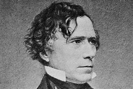
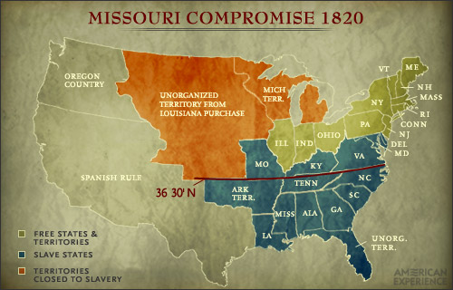
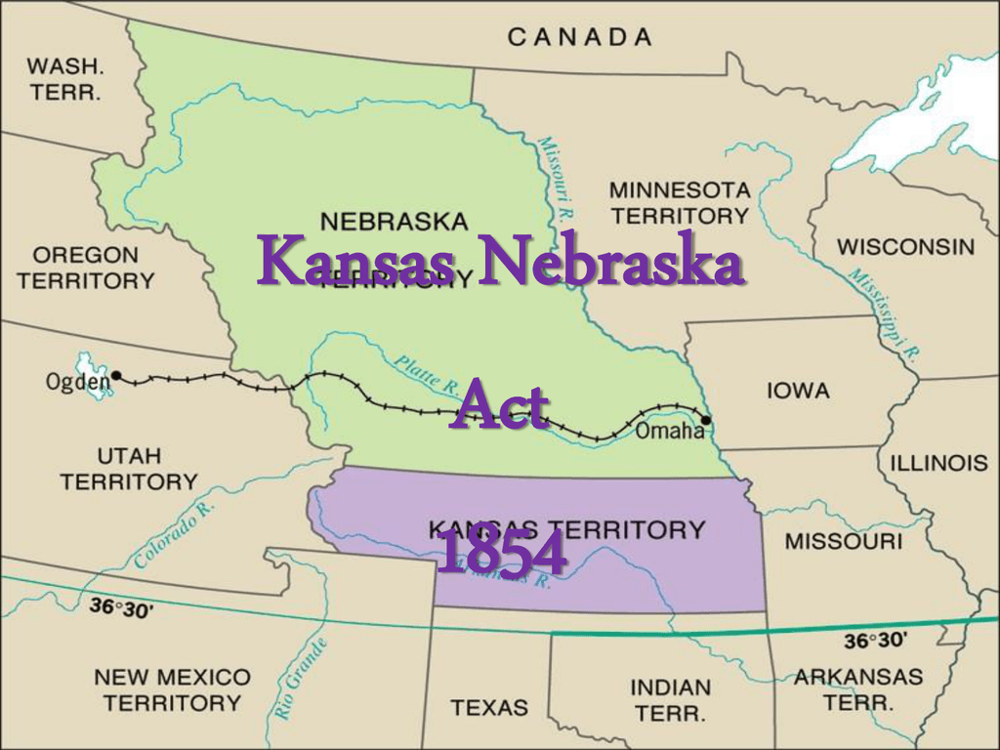
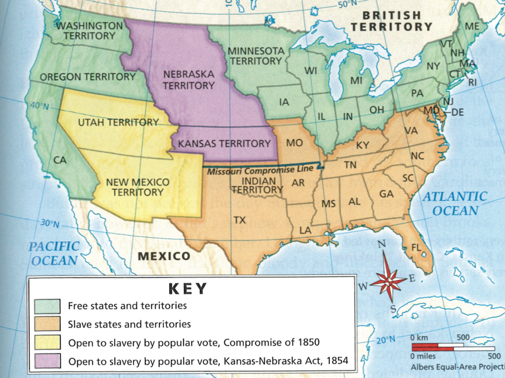

title:: 054 Franklin Pierce: Ineffective

- ## 054 Franklin Pierce: Ineffective
- ## pure
  collapsed:: true
	- VOA Learning English presents America's Presidents.
	- Today we are talking about Franklin Pierce, the 14th president of the United States. He took office in 1853 at age 48. At that time, he was the youngest person elected to the White House.
	- Pierce was known for being social – and for his good looks. But his personal life was full of tragedy, and he was not an effective chief executive.
	- Over time, he has come to be remembered as one of the country's worst presidents.
	- ## Early life
	- Franklin Pierce was born in the northern state of New Hampshire. He was one of eight children.
	- He attended school regularly as a child, and he went on to Bowdoin College in Maine. There, he developed his skills as an excellent public speaker. He also became an able lawyer.
	- Pierce's abilities carried him far. But his personal connections helped, too.
	- His father became the governor of New Hampshire. Shortly after, Pierce was elected to the state legislature. He soon became a member of the U.S. Congress – first as a member of the House of Representatives, and then as a senator.
	- Several important things happened in Pierce's personal life during those years in Washington, DC. He married Jane Means Appleton. They soon had a son, but the child died after only three days. The couple went on to have two more boys.
	- In Washington, Franklin Pierce also developed friendships with many people from the South. They defended the right of states to permit slavery. Although he was from the North, Pierce came to share the opinions of his Southern friends. He grew to dislike anti-slavery activists, who were known as abolitionists.
	- As a politician, Pierce was a member of the Democratic Party and strongly supported the ideas of President Andrew Jackson. But politics did not appeal to his wife. She also did not like her husband's habit of drinking alcohol with his friends. Jane Pierce belonged to the temperance movement, which urged Americans to avoid the use of alcoholic drinks.
	- So Pierce resigned his job in the Senate and moved back to New Hampshire.
	- There, he stopped drinking alcohol and earned fame as a lawyer and public speaker. But tragedy struck again: his second son became sick and died.
	- ## Fainting Frank
	- Pierce remained active in politics in New Hampshire. He helped the Democratic candidate for president at the time, James K. Polk, win votes in the state.
	- When Polk entered the White House, he gave Pierce a position as a general in the Mexican-American War.
	- Pierce did not earn the respect of his troops. In one battle, he passed out after he fell off his horse and crushed his leg. Some of his men, seeing what happened, fled the battlefield. Others called him "Fainting Frank."
	- Although Pierce had his critics, he returned to New Hampshire as a leader in the state's Democratic Party. Yet no one expected him to become president of the United States.
	- Pierce's nomination came during the Democratic national convention in 1852. Party leaders could not agree on a candidate. They were split among the three top choices.
	- So the party turned to Pierce. They liked the fact that he was not well known or had taken any strong positions as a lawmaker. As a result, fewer people could object to him, they reasoned.
	- Pierce did very little during the election campaign. He did not need to. Many voters, especially in the South, did not like his opponent.
	- When the election was held, Pierce won easily.
	- But before he took office, another terrible thing happened. Franklin and Jane Pierce were traveling by train with their youngest son Benjamin, who was 11-years-old. The train went off the rails. Bennie was killed instantly in front of his parents.
	- Neither Franklin nor Jane Pierce ever really recovered. Jane believed their son's death was a punishment from God for her husband becoming president.
	- ## Presidency
	- As president, Pierce faced an extremely difficult situation. The country's ongoing dispute about whether and where to permit slavery was becoming more intense. Under Pierce, the dispute centered on the areas of Kansas and Nebraska.
	- At the time, both areas were considered territories, not states. And each territory was above the line of the Missouri Compromise of 1820. That act, approved by lawmakers nearly 35 years before Pierce took office, banned slavery in northern areas, including what would become Kansas and Nebraska.
	- But pro-slavery settlers demanded that Kansas and Nebraska voters – a group comprised of white men – decide the issue for themselves. A majority of U.S. lawmakers agreed.
	- Under pressure, President Pierce signed the Kansas-Nebraska Act in 1854.
	- The measure was one of the most important in U.S. history. It overturned the Missouri Compromise and cancelled the ban on slavery. It incited years of intense of violence between pro-slavery and anti-slavery activists. And it pushed a divided nation even further apart.
	- The troubles also showed Pierce to be an ineffective president. He could not ease the tensions over slavery, nor unite the country behind the Kansas-Nebraska Act.
	- And he delayed using his power to stop the violence in Kansas until it was far too late.
	- Finally, his sympathy for pro-slavery groups angered many in the North, including people in his own party.
	- The Democrats did not nominate him again at the next election.
	- ## Legacy
	- After four years as president, Pierce returned to New Hampshire. He rarely socialized and began drinking alcohol again.
	- After his wife died in 1863, Pierce seemed to disappear from public life. Americans heard little about him until his death in 1869.
	- But he lived to see the ultimate tragedy of the Civil War that he – like other presidents before him – had failed to prevent.
- ---
- ## def
	- VOA Learning English presents America's Presidents.
	- Today we are talking about Franklin Pierce, the 14th president of the United States. He took office in 1853 /at age 48. At that time, he was the youngest person /elected to the White House.
		- > ▶ Franklin Pierce
		  
	- Pierce was known for being social(a.) – and for his good looks. But his personal life /was full of tragedy, and he was not an effective chief executive.
		- > ▶ social  (a.)[ only before noun ] connected with activities in which people meet each other for pleasure 社交的；交际的；联谊的 /[ only before noun ] connected with society and the way it is organized 社会的
		  -> Team sports /help to develop a child's **social skills** (= the ability to talk easily to other people and do things in a group) . 集体体育运动有助于培养孩子的交际能力。
		- > ▶ tragedy (n.)a very sad event or situation, especially one that involves death 悲惨的事；不幸；灾难；惨案
	- Over time, he has come **to be remembered as** /one of the country's worst presidents.
		- 随着时间的推移，他被认为是美国最糟糕的总统之一。
	- ## Early life
	- Franklin Pierce was born /in the northern state of New Hampshire. He was one of eight children.
	- He attended school regularly /as a child, and he went on to Bowdoin College in Maine. There, he developed his skills /as an excellent public speaker. He also became an able lawyer.
	- Pierce's abilities /carried him far. But his **personal connections** helped, too.
		- 个人关系
	- His father /became the governor of New Hampshire. Shortly after, Pierce was elected to the state legislature. He soon became /a member of the U.S. Congress – first /as a member of the House of Representatives, and then /as a senator.
	- Several important things happened /in Pierce's personal life /during those years in Washington, DC. He married Jane Means Appleton. They soon had a son, but the child died /after only three days. The couple went on /to have two more boys.
	- In Washington, Franklin Pierce also developed friendships /with many people from the South. They defended the right of states /to permit slavery. Although he was from the North, Pierce came to share the opinions of his Southern friends. He grew to dislike anti-slavery activists, who were known as abolitionists.
		- > ▶ grow [ V-ADJ ] to begin to have a particular quality or feeling over a period of time 逐渐变得；逐渐成为 /[ V to inf ] to gradually begin to do sth 逐渐开始
		  -> to grow old/bored/calm 变老；腻烦起来；平静下来
		  -> I'm sure /**you'll grow to like her** /in time. 我肯定你慢慢就会喜欢她了。
		- ((62566c78-534d-4200-af10-9375c2cfee83))
		- 但他逐渐开始认同南方朋友的观点。他开始讨厌反奴隶制活动人士，他们被称为废奴主义者。
	- As a politician, Pierce was a member of the Democratic Party /and strongly supported the ideas of President Andrew Jackson. But politics did not appeal to his wife. She also did not like her husband's habit /of drinking alcohol with his friends. Jane Pierce belonged to the temperance movement, which urged Americans /to avoid the use of alcoholic drinks.
		- > ▶ temperance (n.)( old-fashioned ) the practice of not drinking alcohol because of your moral or religious beliefs （由于道德或宗教信仰而实行的）戒酒，禁酒，滴酒不沾 
		  /( formal ) the practice of controlling your behaviour, the amount you eat, etc., so that it is always reasonable 自我克制；克己；节欲；节食
		  => 来自 temper,管控，调节，-ance,名词后缀。引申词义自我节制，克制等。
	- So Pierce resigned his job /in the Senate /and moved back to New Hampshire.
	- There, he stopped drinking alcohol /and earned fame as a lawyer and public speaker. But tragedy struck again: his second son /became sick and died.
	- ## Fainting Frank
	- Pierce remained active(n.) in politics in New Hampshire. He helped the Democratic candidate for president /at the time, James K. Polk, win votes in the state.
		- > ▶ faint  (v.)[ V ] to become unconscious when not enough blood is going to your brain, usually because of the heat, a shock, etc. 昏厥 /(a.) that cannot be clearly seen, heard or smelt （光、声、味）微弱的，不清楚的
		  -> to faint from hunger 饿昏过去
		  -> **I almost fainted** (= I was very surprised) when she told me. 她告诉我时我吃惊得差点昏过去。
		- 帮助当时的民主党总统候选人, 詹姆斯·k·波尔克(James K. Polk), 在该州赢得选票。
	- When Polk entered the White House, he gave Pierce a position /as a general in the Mexican-American War.
	- Pierce did not earn the respect of his troops. In one battle, he **passed out** /after he fell off his horse /and crushed his leg. Some of his men, seeing what happened, fled the battlefield. Others called him "Fainting Frank."
		- > ▶ **pass out** : to become unconscious 昏迷；失去知觉
	- Although Pierce had his critics, he returned to New Hampshire /as a leader in the state's Democratic Party. Yet no one expected him /to become president of the United States.
		- 尽管有人批评皮尔斯，但他还是回到了新罕布什尔州，成为该州民主党的领袖。
	- Pierce's nomination came /during the Democratic **national convention** in 1852. Party leaders /could not agree on a candidate. They were split(v.) /among the three top choices.
		- > ▶ split (v.)to divide, or to make a group of people divide, into smaller groups that have very different opinions 分裂，使分裂（成不同的派别）/**~ (sth) (into sth)** to divide, or to make sth divide, into two or more parts 分开，使分开（成为几个部分）
		  -> a debate /that has split the country /down the middle 使全国分成两大派的一场争论
		  /**~ sth (between sb/sth) |~ sth (with sb)** : to divide sth into two or more parts and share it between different people, activities, etc. 分担；分摊；分享
		  -> She **split** the money she won /**with** her brother. 她把得到的钱与弟弟分了。
	- So the party **turned to** Pierce. They liked the fact /that he was not well known /or had taken any strong positions as a lawmaker. As a result, fewer people could object to him, they reasoned.
	- Pierce did very little /during the election campaign. He did not need to. Many voters, especially in the South, did not like his opponent.
	- When the election was held, Pierce won easily.
	- But before he took office, another **terrible thing** happened. Franklin and Jane Pierce /were traveling by train /with their youngest son Benjamin, who was 11-years-old. The train went off the rails. Bennie was killed instantly /in front of his parents.
	- Neither Franklin nor Jane Pierce /ever really recovered. Jane believed their son's death /was a punishment from God /for her husband becoming president.
	- ## Presidency
	- As president, Pierce faced an extremely difficult situation. The country's ongoing dispute /about whether and where to permit slavery /was becoming more intense. Under Pierce, the dispute centered(v.) on the areas of Kansas and Nebraska.
		- > ▶ ongoing (a.)[ usually before noun ] continuing to exist or develop 持续存在的；仍在进行的；不断发展的
		  -> an ongoing debate/discussion/process 持续的辩论╱讨论╱过程
		- 作为总统，皮尔斯面临着极其困难的局面。这个国家关于是否允许奴隶制, 以及在哪里允许奴隶制的争论, 越来越激烈。在皮尔斯的任期中，争论集中在堪萨斯和内布拉斯加地区。
	- At the time, both areas /were considered territories, not states. And each territory /was above the line of **the Missouri Compromise** of 1820. That act, approved by lawmakers /nearly 35 years before Pierce took office, banned slavery in northern areas, including what would become Kansas (KS) and Nebraska (NE).
		- 当时，这两个地区都被认为是领土地区，而不是州。每一块领土都在1820年的密苏里妥协线之上。这项法案是在皮尔斯上任近35年前通过的，禁止在北部地区蓄奴，包括后来的堪萨斯和内布拉斯加州。
		- > the Missouri Compromise of 1820:
		  1790年，南北双方的统治者, 就为新州变为自由州还是蓄奴州的问题, 达成一个协议，规定在**北纬39度43分处**, 划一界线，线以北为自由州，线以南为蓄奴州.
		  可是到了1820年，在国会讨论密苏里 Missouri  加入联邦问题的时候，南北双方又发生了争吵。密苏里中有大量奴隶主，但**密苏里的土地在界线以北**. 
		  后来，南北双方签订了一项协议，规定从马萨诸塞州划出一个缅因州，作为自由州加入合众国，而**密苏里则作为蓄奴州**加入合众国；并且**将蓄奴州和自由州划分, 改为北纬36度30分为分界线**，这条线以南的领土允许奴隶制存在，线以北的领土禁止奴隶制。
		  这个协议表明，北部的资产阶级向南部的种植奴隶主做了让步，因此这个协议被称为“密苏里妥协案”。但是，由于南北双方这一制度的根本矛盾没有解决，所以妥协只能取得暂时的平衡。
		  
		-
	- But pro-slavery settlers /demanded that /Kansas and Nebraska voters – a group /**comprised of** white men – decide the issue for themselves. A majority of U.S. lawmakers agreed.
		- > ▶ comprise (v.)( also be comprised of ) to have sb/sth as parts or members 包括；包含；由…组成  SYN **consist of** 
		  /to be the parts or members that form sth 是（某事物的）组成部分；组成；构成 SYN **make sth up**
		  -> The committee **is comprised of** representatives /from both the public and private sectors. 委员会由政府和私人部门的双方代表组成。
		  -> Older people **comprise a large proportion of** those living in poverty. 在那些生活贫困的人中，老年人占有很大的比例。
		  =>  com-共同 + -pris-抓住,包含 + -e → 抓到一起
		- 但是, 支持奴隶制的定居者, 要求由堪萨斯和内布拉斯加州的选民——一个由白人组成的团体——自己来决定这个问题。大多数美国国会议员同意这一观点。
		-
	- Under pressure, President Pierce signed _the Kansas-Nebraska Act_ in 1854.
		- > ▶ the Kansas-Nebraska Act in 1854
		  19世纪以后，美国领土迅速扩张，**在密苏里河以西的堪萨斯-内布拉斯加地区 ，**前往垦殖的人日益增多，要求建立新州。**该地区在北纬36°30′以北，按密苏里妥协案（1820）规定，应以自由州加入联邦**，但奴隶主凭借在政府和参议院中的优势, 主张实行奴隶制。
		  1853年国会开会，通过一项法案: **不再将内布拉斯加这一广大地区作为一个整体，而是一分为二，北部称之为内布拉斯加，而南部则称之为堪萨斯。由当地居民自行决定为蓄奴州或自由州。**
		  
		  
	- The measure /was one of the most important /in U.S. history. It overturned the Missouri Compromise /and cancelled the ban on slavery. It incited years of intense of violence /between pro-slavery and anti-slavery activists. And it pushed a divided nation /even further apart.
		- > ▶ incite (v.)~ sb (to sth) |~ sth : to encourage sb to do sth violent, illegal or unpleasant, especially by making them angry or excited 煽动；鼓动
		  -> to incite crime/racial hatred/violence 教唆犯罪；煽动种族仇恨╱暴力
		  => 词根词缀： in-入,向内 + -cit-呼喊 + -e
		- 这是美国历史上最重要的措施之一。它推翻了密苏里妥协案，取消了奴隶制禁令。它在支持奴隶制和反对奴隶制的活动人士之间, 引发了多年的激烈暴力冲突。它使这个分裂的国家, 更加分裂。
	- The troubles /also showed Pierce to be an ineffective president. He could not **ease(v.) the tensions** over slavery, nor unite(v.) the country /behind the Kansas-Nebraska Act.
	- And he delayed using his power /to stop the violence in Kansas /until **it was far too late**.
		- 他推迟使用他的权力来阻止堪萨斯的暴力，直到为时已晚。
	- Finally, his sympathy for pro-slavery groups /angered many in the North, including people in his own party.
		- > ▶ sympathy  (n.)[ U ] [ Cusually pl. ] the feeling of being sorry for sb; showing that you understand and care about sb's problems 同情 
		  /[ U ] [ Cusually pl. ] the act of showing support for or approval of an idea, a cause, an organization, etc. 赞同；支持
		  -> to express/feel sympathy for sb 向某人表示体恤；对某人感到同情
		  -> The seamen went on strike /**in sympathy with** (= to show their support for) the dockers. 海员举行罢工，以表示对码头工人的支持。
		  => 词根词缀： sym-共同 + -path-痛苦 + -y名词词尾
	- The Democrats /did not nominate him again /at the next election.
	- ## Legacy
	- After four years as president, Pierce returned to New Hampshire. He rarely socialized /and began drinking alcohol again.
		- > ▶ socialize (v.)[ V ] ~ (with sb) : to meet and spend time with people in a friendly way, in order to enjoy yourself （和他人）交往，交际 /[ VN ] [ often passive ] ( formal ) to teach people to behave in ways that are acceptable to their society 使适应社会
	- After his wife died in 1863, Pierce seemed to disappear from public life. Americans heard little about him /until his death in 1869.
	- But he lived to see **the ultimate(a.) tragedy** of the Civil War /that he – like other presidents before him – had failed to prevent.
		- > ▶ ultimate (a.)happening at the end of a long process 最后的；最终的；终极的 
		  /most extreme; best, worst, greatest, most important, etc. 极端的；最好（或坏、伟大、重要等）的
		  /from which sth originally comes 根本的；基本的；基础性的
		  -> our **ultimate goal/aim/objective/target** 我们最终的目的╱目标
		  -> This race will be **the ultimate test** of your skill. 这次竞赛将是对你的技能的最大考验。
		  -> **the ultimate truths** of philosophy and science 哲学与科学的终极原理
		  =>ulter-,词源同 ultra-,那边的，-im,最高级后缀，词源同 prime,extreme.引申词义最那边的，最终的。