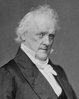

title:: 055 James Buchanan: Passive

- ## 055 James Buchanan: Passive
- ## pure
  collapsed:: true
	- VOA Learning English presents America's Presidents.
	- Today we are talking about James Buchanan, the 15th president of the United States.
	- He was the third in a series of unsuccessful presidents. Millard Fillmore and Franklin Pierce had failed to resolve the country's increasing division over slavery.
	- Democratic Party officials hoped Buchanan could do better.
	- After all, he was a gifted lawyer and had been a member of the U.S. Congress, a secretary of state, and a diplomat.
	- But Buchanan was not so sure he could resolve the country's problems. He was right. He was the last president before the American Civil War.
	- ## Early life
	- James Buchanan was born in the northern state of Pennsylvania.
	- His father was a businessman, and his family was financially successful.
	- Buchanan – the oldest son in a family with 11 children – received a good education. He attended Dickinson College in Pennsylvania and soon began working as a lawyer.
	- His abilities earned him a good deal of money and a place in the state's legislature. But they were not able to win him a wife.
	- As a young man, Buchanan fell in love with and proposed marriage to a young woman from a wealthy family. She accepted. But her father opposed the union.
	- One day, his fiancée wrote Buchanan a letter saying she had reconsidered and decided not to marry him after all. Three days later, she unexpectedly died.
	- Buchanan was heartbroken. He promised never to marry anyone else. And he did not.
	- To date, James Buchanan is the only U.S. president who never married. When he entered the White House, his niece served as his first lady.
	- ## Election of 1856
	- Even with problems in his personal life, Buchanan went on to have a strong career as a national politician. He hoped his party would nominate him as its candidate for president.
	- But in the 1840s and early 1850s, the Democrats nominated other candidates. Finally, in 1856, the party chose Buchanan. But by then, he was no longer sure he wanted to be president. He believed the country would soon be at war.
	- Violence had already broken out in the western territory of Kansas. White settlers there had clashed over whether Kansas would enter the Union as a slave or free state.
	- In one dramatic event, an anti-slavery activist named John Brown had murdered several pro-slavery settlers.
	- President Buchanan had clear ideas about slavery. He said in his inaugural speech that voters in the territories – a group made up of white men – should be able to decide the issue for themselves.
	- In the same speech, Buchanan urged Americans to support an important Supreme Court ruling that became known as the Dred Scott decision.
	- Two days later, the court's justices announced the majority opinion in that case. The opinion said the federal government did not have the power to control slavery in the territories.
	- In addition, the court declared that enslaved people were not U.S. citizens. They were property, it said. Enslaved people did not have any more rights than a horse or a chair.
	- Buchanan hoped the decision would stop the country's debate over slavery. Instead, it made the debate more intense.
	- ## Presidency
	- During his presidency, Buchanan took two other actions that increased tensions and damaged his public image.
	- First, he tried to persuade Congress to accept a state constitution for Kansas. The constitution permitted slavery, although a majority of Kansas voters had not agreed to it.
	- The U.S. House of Representatives decided not to follow President Buchanan's wishes. They permitted Kansans to vote again on the constitution.
	- This time, Kansas voters rejected it. A majority agreed instead to seek admission into the Union as a free state.
	- Buchanan's image also suffered because of an event known as the raid on Harper's Ferry.
	- The raid was led by John Brown, the anti-slavery activist who had murdered pro-slavery settlers in Kansas. This time, Brown hoped to create an armed rebellion of anti-slavery activists and freed slaves.
	- To get weapons, Brown and his men attacked a federal arsenal about 110 kilometers northwest of Washington, D.C. The armory was in the town of Harper's Ferry, in today's state of West Virginia.
	- President Buchanan answered the raid by permitting federal troops to use force. The U.S. Marines surrounded Brown and his forces. They killed some and captured others, including Brown.
	- A few weeks later, Brown was brought to trial, found guilty, and hanged.
	- The event further divided Americans. Anti-slavery Northerners believed Brown was a hero. Pro-slavery Southerners believed he was a traitor.
	- In general, Buchanan agreed with the Southerners. He said in a speech that Northerners should not tell Southerners what they could do in their states.
	- But his words did not satisfy either side. For one thing, a main issue was whether slavery should be permitted in any new states. Buchanan did not comment on that point.
	- ## Election of 1860
	- At the end of his single term, Buchanan kept an earlier promise not to seek re-election. His party did not urge him to. Instead, Northern Democrats and Southern Democrats split. They nominated two different candidates.
	- The Democrats' lack of unity provided an opening for a candidate from a new party. The Republican Party was comprised of northerners who were against slavery. Their candidate was a lawyer without much experience in government. His name was Abraham Lincoln.
	- Lincoln won the presidential election of 1860.
	- In answer, the Southern state of South Carolina withdrew from the Union.
	- Buchanan – who was in the last weeks of his presidency – did not support the move. But he did not act to stop South Carolina, either. He said the Constitution did not give him the power to force a state to stay in the Union.
	- Following Buchanan's inaction, six other slave-holding Southern states also seceded.
	- ## Legacy
	- Today many historians agree James Buchanan was one of the worst American presidents.
	- Buchanan had many good personal qualities, and he did not want to harm the country. Instead, a common belief is that he did not have the right skills to unite a divided nation.
	- His behavior appeared to be guided by conflicting ideas. Buchanan said he opposed slavery and supported the Union. But he often took actions to protect slavery and help the South.
	- Buchanan largely blamed anti-slavery activists and opposition politicians for the problems during his administration.
	- But the public did not accept Buchanan's position. He was not respected after he left office, and he did not appear in public very often.
	- Instead, the former president withdrew to his home in Pennsylvania until his death in 1868.
- ---
- ## def
	- VOA Learning English presents America's Presidents.
	- Today we are talking about James Buchanan, the 15th president of the United States.
		- > ▶ James Buchanan
		  
	- He was the third /in a series of unsuccessful presidents. Millard Fillmore and Franklin Pierce /had failed to resolve the country's increasing division over slavery.
		- > ▶ 他是一系列失败的(未能解决南北冲突)总统中的第三位。
	- Democratic Party officials /hoped Buchanan could do better.
	- After all, he was a gifted lawyer /and had been a member of the U.S. Congress, a secretary of state, and a diplomat.
		- > ▶ After all 毕竟；终究
	- But Buchanan was not so sure /he could resolve the country's problems. He was right. He was the last president /before the American Civil War.
	- ## Early life
	- James Buchanan was born /in the northern state of Pennsylvania.
	- His father was a businessman, and his family was financially successful.
	- Buchanan – the oldest son /in a family with 11 children – received a good education. He attended Dickinson College in Pennsylvania /and soon began working as a lawyer.
	- His abilities /earned him a good deal of money /and a place in the state's legislature. But they were not able to win him a wife.
		- > ▶ place  [ C ] a particular position, point or area 位置；地点；场所；地方 /[ sing. ] ~ (in sth) the role or importance of sb/sth in a particular situation, usually in relation to others 身份；地位；资格
	- As a young man, Buchanan **fell in love with** and **proposed marriage to** a young woman from a wealthy family. She accepted. But her father /opposed the union.
	- One day, his fiancée wrote Buchanan a letter /saying she had reconsidered /and decided not to marry him after all. Three days later, she unexpectedly died.
		- > ▶ fiancée (n.)the woman that a man is engaged to 未婚妻
	- Buchanan was heartbroken. He promised /never to marry anyone else. And he did not.
	- To date, James Buchanan is the only U.S. president /who never married. When he entered the White House, his niece served as his first lady.
		- > ▶ to date 至今；迄今为止; 到目前为止
		- > ▶ niece (n.)the daughter of your brother or sister; the daughter of your husband's or wife's brother or sister 侄女；甥女
		- > ▶ the First Lady :  (in the US) the wife of the President 第一夫人（美国的总统夫人）
	- ## Election of 1856
	- Even with problems in his personal life, Buchanan went on /to have a strong career as a national politician. He hoped /his party would **nominate** him **as** its candidate for president.
		- 尽管布坎南的个人生活存在问题，但作为一名全国性的政治家，他的事业仍然很成功。他希望他所在的党提名他为该党的总统候选人。
	- But in the 1840s and early 1850s, the Democrats nominated other candidates. Finally, in 1856, the party chose Buchanan. But by then, he was no longer sure /he wanted to be president. He believed /the country would soon be at war.
	- Violence had already broken out /in the western territory of Kansas. White settlers there /**had clashed over** /whether Kansas would enter the Union /as a slave or free state.
		- > ▶ **clash (v.)~ (with sb) (over sth) |~ (between A and B) (over sth)** : an argument between two people or groups of people who have different beliefs and ideas 争论；辩论；争执
		  -> a head-on **clash**(v.) between the two leaders /**over** education policy 两位领导人, 就教育政策进行的针锋相对的争论
		  /**~ (with sb) |~ (between A and B)** : a short fight between two groups of people （两群人之间的）打斗，打架，冲突
		- 那里的白人定居者, 曾就堪萨斯是作为一个蓄奴州还是自由州加入联邦的问题, 发生过冲突。
	- In one dramatic event, an anti-slavery activist /named John Brown /had murdered several pro-slavery settlers.
	- President Buchanan /had clear ideas about slavery. He said in his inaugural speech that /voters in the territories – a group /**made up of** white men – should be able to decide the issue for themselves.
		- Buchanan 总统, 对奴隶制有明确的看法。
	- In the same speech, Buchanan urged Americans /to support an important Supreme Court ruling(n.) /that became known as the Dred Scott decision.
		- > ▶ ruling (n.)~ (on sth) : an official decision made by sb in a position of authority, especially a judge 裁决；裁定；判决
		  -> The court will make its ruling /on the case /next week. 法庭下周将对本案件作出裁决。
		  /(a.) [ only before noun ] having control over a particular group, country, etc. 统治的；支配的；占统治地位的
		  -> the ruling party 执政党
		- > ▶ Dred Scott v. Sandford
		  是美国最高法院于1857年判决的一个关于奴隶制的案件，该案的判决严重损害了美国最高法院的威望，更成为南北战争的关键起因之一。
		  黑人奴隶德雷德·斯科特随主人到过自由州伊利诺伊和自由准州（Territory）威斯康星，并居住了两年，随后回到蓄奴州密苏里。主人死后，斯科特提起诉讼要求获得自由，案件在密苏里州最高法院, 和联邦法院被驳回后，斯科特上诉到美国最高法院。最终9位大法官以7：2的票数维持原判.
	- Two days later, the court's justices /announced the majority opinion in that case. The opinion said /the federal government did not have the power /to control slavery in the territories.
	- In addition, the court declared that /enslaved people were not U.S. citizens. They were property, it said. Enslaved people did not have any more rights /than a horse or a chair.
	- Buchanan hoped the decision would stop the country's debate over slavery. Instead, it made the debate more intense.
	- ## Presidency
	- During his presidency, Buchanan took two other actions /that increased tensions /and damaged his public image.
	- First, he tried to persuade Congress /to accept **a state constitution** for Kansas. The constitution permitted slavery, although a majority of Kansas voters /had not agreed to it.
		- 他试图说服国会接受堪萨斯的州宪法。宪法允许奴隶制，尽管大多数堪萨斯选民不同意。
	- The U.S. House of Representatives /decided not to follow President Buchanan's wishes. They permitted Kansans to vote again /on the constitution.
		- 美国众议院决定不遵从布坎南总统的意愿。他们允许堪萨斯人再次就宪法进行投票。
	- This time, Kansas voters rejected it. A majority agreed instead(ad.) /to seek admission /into the Union /as a free state.
		- > ▶ instead (ad.) in the place of sb/sth 代替；顶替；反而；却
		- 大多数人同意以自由州的身份加入联邦。
	- Buchanan's image also suffered /because of an event /known as the raid on Harper's Ferry.
		- > ▶ raid (n.)(v.) a short surprise attack on an enemy by soldiers, ships or aircraft 突然袭击 / 突击检查；突然搜查 /an attack on a building, etc. in order to commit a crime 抢劫；打劫
	- The raid was led by John Brown, the anti-slavery activist /who had murdered pro-slavery settlers in Kansas. This time, Brown hoped to create **an armed rebellion** of anti-slavery activists and freed(v.) slaves.
		- > ▶ rebellion (n.)[ UC ] an attempt by some of the people in a country to change their government, using violence 谋反；叛乱；反叛 /opposition to authority; being unwilling to obey rules or accept normal standards of behaviour, dress, etc. 不顺从；叛逆
		  =>  re-相反,反对 + -bell-战斗,战争 + -ion名词词尾
		- 这一次，布朗希望发动反奴隶制活动人士和解放奴隶的武装叛乱。
	- To get weapons, Brown and his men /attacked a federal arsenal(n.) /about 110 kilometers northwest of Washington, D.C. The armory was in the town of Harper's Ferry, in today's state of West Virginia.
		- > ▶ arsenal (n.)**a collection of weapons** such as guns and explosives （统称）武器 /**a building** where military weapons and explosives are made or stored 兵工厂；武器库；军火库
		  -> Britain's nuclear arsenal 英国的核武器
		- > ▶ armory = armoury : **a place** where weapons and armour are kept 军械库 SYN **arsenal**  
		  / **all the weapons and military equipment** that a country has （一国的）军事装备 /（美国或加拿大国民卫队等的）总部大楼 
		  /( formal ) **the things** that sb has available to help them achieve sth 锦囊；宝库
	- President Buchanan answered the raid /by permitting federal troops to use force. The U.S. Marines /surrounded Brown and his forces. They killed some /and captured others, including Brown.
		- 布坎南总统允许联邦军队使用武力作为回应。
	- A few weeks later, Brown was brought to trial, found guilty, and hanged.
		- > ▶ trial (n.)(v.)[ UC ] a formal examination of evidence in court by a judge and often a jury , to decide if sb accused of a crime is guilty or not （法院的）审讯，审理，审判
		  /[ CU ] the process of testing the ability, quality or performance of sb/sth, especially before you make a final decision about them （对能力、质量、性能等的）试验，试用
		  -> The new drug **is undergoing clinical trials**. 这种新药正在进行临床试验。
	- The event further divided Americans. Anti-slavery Northerners /believed Brown was a hero. Pro-slavery Southerners /believed he was a traitor.
		- ((625520c9-7e86-476c-afd0-8e99d67a7415))
	- In general, Buchanan agreed with the Southerners. He said in a speech that /Northerners should not tell Southerners /what they could do in their states.
	- But his words did not satisfy either side. For one thing, a main issue was /whether slavery should be permitted in any new states. Buchanan did not **comment on** that point.
		- > ▶ **comment (v.)~ (on/upon sth)** : to express an opinion about sth 表达意见
	- ## Election of 1860
	- At the end of his single term, Buchanan kept an earlier promise /not to seek re-election. His party did not urge him to. Instead, Northern Democrats and Southern Democrats split. They nominated two different candidates.
	- The Democrats' lack of unity /**provided** an opening **for** a candidate from a new party. The Republican Party /**was comprised(v.) of** northerners /who were against slavery. Their candidate was a lawyer /without much experience in government. His name was Abraham Lincoln.
		- > ▶ unity (n.) [ Using. ] the state of being in agreement and working together; the state of being joined together to form one unit 团结一致；联合；统一
		  -> European unity 欧洲的统一
		  /( in art, etc. 艺术等 ) the state of looking or being complete in a natural and pleasing way 完整；完美；和谐；协调
		- id:: 6258f7b2-2eb8-4edd-ba7a-520ee1be46f7
		  > ▶ opening (n.) a space or hole that sb/sth can pass through 孔；洞；缺口 
		  + / [ Cusually sing. ] the beginning or first part of sth 开始；开端 
		  -> Winning the competition /was **the opening** /she needed for her career. 在这次比赛中获胜, 是她未来事业发展的良好开端。
		  + /**a good opportunity for sb** 良机
		- 民主党的缺乏团结, 为新党(--共和党)的候选人提供了机会。共和党是由反对奴隶制的北方人组成的。
	- Lincoln won the presidential election of 1860.
	- In answer, the Southern state of South Carolina /withdrew from the Union.
	- Buchanan – who was in the last weeks of his presidency – did not support the move. But he did not act(v.) /to stop South Carolina, either. He said /the Constitution did not give him the power /to force(v.) a state /to stay in the Union.
	- Following Buchanan's inaction, six other slave-holding Southern states /also seceded.
		- > ▶ inaction (n.)[ U ] ( usually disapproving ) lack of action; the state of doing nothing about a situation or a problem 无行动；不采取措施
		- > ▶ secede  /sɪˈsiːd/ (v.)( formal ) [ V ] ( of a state, country, etc. 州、邦、国家等 ) ~ (from sth) to officially leave an organization of states, countries, etc. and become independent 退出，脱离（组织等）
		  => se-,分开，-ced,走，词源同 cede,accede.引申词义退出，脱离。
	- ## Legacy
	- Today /many historians agree /James Buchanan was one of the worst American presidents.
	- Buchanan had many good personal qualities, and he did not want to harm the country. Instead, a common belief is that /he did not have the right skills /to unite a divided nation.
	- His behavior /appeared to be guided by conflicting ideas. Buchanan said /he opposed slavery /and supported the Union. But he often took actions /to protect slavery /and help the South.
	- Buchanan largely **blamed** anti-slavery activists /and opposition politicians /**for** the problems /during his administration.
		- > ▶ **blame (v.)[ VN ] ~ sb/sth (for sth) |~ sth on sb/sth** : to think or say that sb/sth is responsible for sth bad 把…归咎于；责怪；指责
		  -> She doesn't **blame** anyone **for** her father's death. 她没把她父亲的死归罪于任何人。
		  ▶ **be to blame (for sth)** : to be responsible for sth bad （对坏事）负有责任
		- 布坎南将他的政府会议上出现的问题, 主要归咎于反奴隶制活动人士, 和反对派政客。
	- But the public did not accept Buchanan's position. He was not respected /after he left office, and he did not appear in public /very often.
		- 也不常在公共场合露面。
	- Instead, the former president /withdrew to his home in Pennsylvania /until his death in 1868.