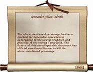

-
- ## 057 Abraham Lincoln: Martyr (Part Two)
- ## pure
  collapsed:: true
	- VOA Learning English presents America's Presidents.
	- Today we are continuing our story about Abraham Lincoln.
	- He led the United States during the Civil War, which lasted from 1861-1865. In that conflict, the Southern Confederacy battled the Union – the states that supported the federal government.
	- Southern states wanted to make their own laws, including those that protected slavery. They were afraid that President Lincoln would use the power of the federal government to ban slavery in their states, as well as in other areas.
	- So 11 Southern states withdrew from the rest of the country. They stopped recognizing the power of the central government.
	- President Lincoln did not think states had the right to withdraw. He said he was fighting to reunite the country.
	- But in time, he accepted that the Civil War would also be a fight to end slavery.
	- ## Commander-in-chief
	- Lincoln is known for several qualities as a wartime president. One was how he led the military campaign.
	- As president, Lincoln worked with top military officials to create a plan. They realized that the Union had more resources and more men who could fight than the Confederate forces. So, they planned to surround the Southern states, cut off their supplies, and prevent foreign powers from helping the Confederacy.
	- Lincoln hoped the Union's generals could execute the plan quickly and end the war as soon as possible.
	- But the generals were guarded. They did not want to harm their soldiers if they did not have to. They also knew the Confederacy had a skilled commander in General Robert E. Lee.
	- Troops under another Confederate general, Thomas "Stonewall" Jackson, also defeated the Union army in several early battles.
	- Lincoln was frustrated with the war effort. He wanted generals who would not only win battles, but chase after the opposing forces and destroy them so they could not fight again.
	- In one famous telegram, he wrote to his top general, George McClellan. Lincoln said, "If General McClellan does not want to use the Army, I would like to borrow it for a time..."
	- Finally, Lincoln replaced McClellan. Then he replaced McClellan's replacements.
	- ## Executive power
	- Lincoln changed the presidency by being actively involved as a commander-in-chief of the military. He also greatly expanded the powers of the chief executive.
	- Lincoln believed that, during war, the president had powers that were greater than those of Congress and the Supreme Court. As a result, he took many actions that critics – and even some supporters – considered illegal under the U.S. Constitution.
	- For example, Lincoln spent millions of dollars in federal money without getting permission from Congress. He also limited freedom of the press, restricted mail service, and declared martial law in some places, even when the situation did not require military action.
	- Most notably, Lincoln temporarily suspended the writ of habeas corpus. Habeas corpus is an important right in the American legal tradition. It means that people who are under arrest have the right to appear personally in court.
	- But, at some periods, Lincoln ignored that right.
	- He said the Confederacy's "rebellion" justified his actions. And, he said, extreme measures were necessary to re-unite the country.
	- ## Emancipation Proclamation
	- One of Lincoln's most important legacies relates to slavery. The issue was at the heart of the American Civil War.
	- For most of his career, Lincoln spoke against slavery. But he did not try to bar the custom in states where it already existed. He agreed to leave slavery in the South alone.
	- Lincoln also did not really believe in racial equality. And he worried that if slavery ended in the United States, blacks and whites would not be able to live peacefully together.
	- But as the war continued, Lincoln changed his mind about how to deal with the issue.
	- For one thing, anti-slavery activists were urging Lincoln to end slavery for moral reasons.
	  Lincoln also considered tactical reasons -- those related to the war.
	- He saw that enslaved people in the South were escaping to join Union armies in the North. Their actions helped the Union effort.
	- Lincoln also wanted to prevent England or France from helping the South. The Southern states were important trading partners for Europe. But the English and French people had rejected slavery. Lincoln hoped that if the Union also rejected slavery, European countries would support the North – or at least not support the South.
	- So Lincoln waited until the Union won a major battle in Antietam, Maryland. Then he announced that he was using his power as a wartime president to order the end of slavery in the Confederate states.
	- He produced a document called the Emancipation Proclamation. It said that enslaved people in the rebelling states were "forever free."
	- Historians note that the act was important and revolutionary. But it was mostly symbolic. The federal government was not able to enforce the order at the time. And it did not deal with enslaved people in other areas.
	- But the Emancipation Proclamation was the beginning of the end of legal slavery in the country. During the rest of his presidency, Lincoln worked in support of an anti-slavery amendment to the Constitution. That amendment – the Thirteenth – was approved in 1865. It officially outlawed slavery across the country.
	- Next week we will finish the story of Abraham Lincoln and the Civil War.
- ---
- ## def
	- VOA Learning English presents America's Presidents.
	- Today we are continuing our story /about Abraham Lincoln.
	- He led the United States /during the Civil War, which lasted from 1861-1865. In that conflict, the Southern Confederacy /battled the Union – the states /that supported the federal government.
	- Southern states /wanted to make their own laws, including those /that protected slavery. They were afraid that /President Lincoln would use the power of the federal government /to ban slavery in their states, as well as in other areas.
	- So 11 Southern states /withdrew from the rest of the country. They stopped recognizing the power of the central government.
	- President Lincoln did not think /states had the right to withdraw. He said /he was fighting to reunite the country.
	- But in time, he accepted that /the Civil War would also be a fight /to end slavery.
	- ## Commander-in-chief
	- Lincoln is known for several qualities /as a wartime president. One was how he led the military campaign.
		- > ▶ Commander-in-chief : ( abbr. C.-in-C. ) the officer who commands all the armed forces of a country or all its forces in a particular area 总司令；最高统帅
		- id:: 625908f6-f5cc-42ed-a354-52a7f9aa8d4e
		  > ▶ campaign : V-I If someone **campaigns for** something, they carry out a planned set of activities /over a period of time /in order to achieve their aim. 从事运动
		  /N-COUNT A campaign is a planned set of activities that people carry out over a period of time in order to achieve something such as social or political change. (有计划的) 活动; 运动 / In a war, a campaign is a series of planned movements carried out by armed forces. 一系列军事行动; 战役
		  => 来自camp, 平地，战场。原指两军交战。
	- As president, Lincoln worked with top military officials /to create a plan. They realized that /the Union had more resources /and more men /who could fight than the Confederate forces. So, they planned to surround the Southern states, cut off their supplies, and **prevent** foreign powers **from** helping the Confederacy.
	- Lincoln hoped /the Union's generals could execute the plan quickly /and **end(v.) the war** as soon as possible.
	- But the generals were guarded(a.). They did not want to harm their soldiers /if they did not have to. They also knew /the Confederacy had a skilled commander in General Robert E. Lee.
		- > ▶ guarded (a.)( of a person or a remark they make 人或言语 ) careful; not showing feelings or giving much information 谨慎的；有保留的；不明确表态的
	- Troops /under another Confederate general, Thomas "Stonewall" Jackson, also defeated the Union army /in several early battles.
		- > ▶ defeat (v.)to win against sb in a war, competition, sports game, etc. 击败；战胜 /to stop sth from being successful 使失败；阻挠；挫败
	- Lincoln was frustrated with the war effort. He wanted generals /who would not only win battles, but chase after the opposing forces /and destroy them /so they could not fight again.
		- id:: 62590ab9-a10c-4c66-9eb6-34be19b8ba89
		  > ▶ effort (n.)[ C ] **the result** of an attempt to do sth 努力的结果；成就
		  -> I'm afraid /this essay is a poor effort. 很抱歉，这篇文章写得不好。
		  /[ C ] ( usually after a noun 通常置于名词后 ) **a particular activity** that a group of people organize in order to achieve sth 有组织的活动
		  -> the Russian space effort 俄罗斯航天计划
		- 林肯对战争的结果感到失望。他希望有这样的将军存在 --  他们不仅能赢得战斗，而且能追击并消灭敌人，使他们不能再战斗。
	- In one famous telegram, he wrote to his top general, George McClellan. Lincoln said, "If General McClellan does not want to use the Army, I would like to borrow it for a time..."
		- > ▶ telegram : a message /sent by telegraph /and then printed and given to sb 电报（用电信号传递的信息）
		- 在一封著名的电报中，他给他的最高将领乔治·麦克莱伦写了一封信。林肯说:“如果麦克莱伦将军不想使用这支军队，我愿意暂时借用一下。”
	- Finally, Lincoln replaced McClellan. Then he replaced McClellan's replacements.
		- 最后，林肯替换了麦克莱伦。然后他替换了麦克莱伦的替代者。
	- ## Executive power
	- Lincoln changed the presidency /by **being actively involved** as a commander-in-chief of the military. He also greatly expanded the powers /of the chief executive.
		- > ▶ executive : the executive [ sing.+sing./pl.v. ] **the part of a government** responsible for putting laws into effect （政府的）行政部门 /**a person** who has an important job as a manager of a company or an organization （公司或机构的）经理，主管领导，管理人员
		- 林肯以军队总司令的身份积极参与，从而改变了总统职位。他还大大扩大了行政长官的权力。
	- Lincoln believed that, during war, the president had powers /that were greater than those of Congress and the Supreme Court. As a result, he took many actions /that critics – and even some supporters – considered illegal /under the U.S. Constitution.
	- For example, Lincoln spent millions of dollars in federal money /without getting permission from Congress. He also limited freedom of the press, restricted mail service, and declared martial law /in some places, even when the situation did not require military action.
		- > ▶ martial :  /ˈmɑːrʃ(ə)l/ (a.)( formal ) [ only before noun ] connected with fighting or war 战争的；军事的
		  => 来自拉丁语martialis,与战神Mars相关的。引申词义战斗的，武术的。
		- 并在一些地方宣布戒严令，甚至在不需要采取军事行动的情况下。
	- Most notably, Lincoln temporarily suspended the writ of **habeas corpus**. **Habeas corpus** is an important right /in the American legal tradition. It means that /people who are under arrest /have the right to appear personally in court.
		- > ▶ writ  /rɪt/   (n.)**~ (for sth) (against sb)** : a legal document from a court /telling sb to do or not to do sth （法庭的）令状，书面命令
		  -> The company has been served with a writ /for breach of contract. 这家公司因违约, 已接到法院令状。
		  => 来自 write 的古体 writan 的过去分词形式，已写好的，写成的，引申词义令状，文书。
		   
		  ▶ **writ large**
		  (1) **easy to see or understand** 显而易见的；公然
		  -> Mistrust was writ large on her face. 她脸上明显流露出不信任的神情。
		  (2) ( used after a noun 用于名词后 ) **being a large or obvious example of the thing mentioned** 明摆着；典型
		  -> This is deception writ large. 这是明目张胆的欺骗。
		- > ▶ habeas corpus  :  /ˌheɪbiəs ˈkɔːpəs/  ( law 律 ) a law /that states that /a person who has been arrested /should not be kept in prison /longer than a particular period of time /unless a judge in court has decided that /it is right 人身保护法（对被拘禁者的羁押期予以限制）
		  + 人身保护令（拉丁语：Habeas Corpus， 英语发音：/heɪbiːəs ˈkɔrpəs/，中世纪拉丁文，**字面意思为：“有身体”、“现身”；法律意思为：“（我们法庭命令你向我们）呈现（被拘押者）本人”** ，是在普通法系下**对抗非法拘禁的补救措施，使人有机会向法庭控诉, 并请求法庭命令被拘押者之看管人（通常为监狱官员）, 将被拘押者交送至法庭审查，以决定该人的拘押是否合法。**
		  + 威廉·布莱克斯通 (William Blackstone) 描述其为“**适用于各种非法拘禁的, 伟大而有效的令状”。这是具有法院命令效力的传票；它是写给看管人（例如监狱官员）的，要求将囚犯带到法庭，并要求看管人出示授权证明，以便法庭确定看管人是否具有拘禁囚犯的合法权力。如果看管人越权，则囚犯必须获释。**
		  + **任何囚犯, 或为其奔走的其他人, 都可以向法院或法官请求"人身保护令"。** 
		  + 囚犯以外的人寻求令状的一个原因是, 被拘禁者可能被与外界隔离。
		- 最值得注意的是，林肯暂时中止了人身保护令。人身保护令是美国法律传统中的一项重要权利。这意味着被逮捕的人有权亲自出庭。
	- But, at some periods, Lincoln ignored that right.
	- He said /the Confederacy's "rebellion" justified his actions. And, he said, extreme measures /were necessary(a.) to re-unite(v.) the country.
		- 他说南部联盟的“叛乱”证明他的行动是正当的。他说，为了让国家重新统一，采取极端措施是必要的。
	- ## Emancipation Proclamation
	- One of Lincoln's most important legacies /relates to slavery. The issue was /at the heart of the American Civil War.
		- ((6243ba91-7e48-4114-af04-0a23ad511235))
		- > ▶ emancipation   /ɪˌmænsɪˈpeɪʃn/  解放, 释放, 脱离, 解脱
		- 这个问题是美国内战的核心问题。
	- For most of his career, Lincoln spoke against slavery. But he did not try to bar the custom /in states where it already existed. He agreed to leave slavery /in the South alone.
		- > ▶ leave (v.)to make or allow sb/sth to remain in a particular condition, place, etc. 使保留，让…处于（某种状态、某地等）
		  -> Leave the rice /to cook for 20 minutes. 把大米煮20分钟。
	- Lincoln also did not really **believe in** racial equality. And he worried that /if slavery ended in the United States, blacks and whites /would not be able to live peacefully together.
	- But as the war continued, Lincoln changed his mind /about how to deal with the issue.
	- For one thing, anti-slavery activists /were urging Lincoln /to end slavery /for moral reasons.
	  Lincoln also considered tactical reasons -- those related to the war.
		- > ▶ tactical (a.)[ usually before noun ] connected with the particular method you use to achieve sth 战术上的；策略上的 SYN strategic 
		  /[ usually before noun ] carefully planned in order to achieve a particular aim 有谋略的；手段高明的；善于谋划的
		  -> a tactical decision 高明的决策
		- 一方面，反奴隶制活动人士敦促林肯出于道德原因结束奴隶制。林肯还考虑了战术上的原因——那些与战争有关的原因。
	- He saw that /enslaved people in the South /were escaping /to join Union armies in the North. Their actions helped the Union effort.
	- Lincoln also wanted **to prevent** England or France **from** helping the South. The Southern states /were important **trading partners** for Europe. But the English and French people /had rejected slavery. Lincoln hoped that /if the Union also rejected slavery, European countries would support the North – or at least not support the South.
	- So Lincoln waited /until the Union won a major battle in Antietam, Maryland. Then he announced that /he was using his power as a wartime president /to order the end of slavery in the Confederate states.
	- He produced a document /called the Emancipation Proclamation. It said that /enslaved people in the rebelling states /were "forever free."
		- > ▶ Emancipation Proclamation 解放(黑奴)宣言
	- Historians note that /the act was important and revolutionary. But it was mostly symbolic. The federal government was not able to enforce the order /at the time. And it did not **deal with** enslaved people in other areas.
		- > ▶ enforce (v.) ~ sth (on/against sb/sth) : to make sure that people obey a particular law or rule 强制执行，强行实施（法律或规定） /~ sth (on sb) to make sth happen or force sb to do sth 强迫；迫使
		- 这一法案是重要的和革命性的。但它主要只能做到象征性, 因为当时联邦政府未能执行该命令。它也没有处理其他地区的奴隶。
	- But the Emancipation Proclamation /was the beginning of the end of legal slavery in the country. During the rest of his presidency, Lincoln worked /**in support of** an anti-slavery amendment to the Constitution. That amendment – the Thirteenth – was approved in 1865. It officially outlawed(v.) slavery /across the country.
		- > ▶ outlaw (v.) to make sth illegal 宣布…不合法；使…成为非法
		- 在他余下的总统任期内，林肯致力于支持反奴隶制的宪法修正案。宪法第十三修正案, 于1865年通过。它在全国范围内正式宣布奴隶制为非法。
	- Next week /we will finish the story of Abraham Lincoln /and the Civil War.