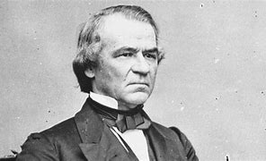
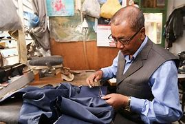
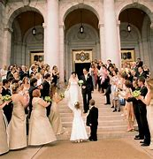

title:: 059 Andrew Johnson: Impeached

- ## 059 Andrew Johnson: Impeached
- ## pure
  collapsed:: true
	- Today we are talking about Andrew Johnson. Johnson was vice president under Abraham Lincoln, and became president in 1865 after Lincoln was killed.
	- His name sounds like that of an earlier president, Andrew Jackson, and also like a later president, Lyndon Johnson.
	- But Andrew Johnson served in the years just after the Civil War. You can remember Johnson this way: He was the first U.S. president to be impeached.
	- ## Early life
	- Andrew Johnson grew up in a poor family in the southern state of North Carolina.
	- As a child, Johnson had little formal education. Instead, he trained to be a tailor.
	- When he was a young man, Johnson moved to Tennessee, another southern state. He opened a tailoring business, where he made, repaired and sold clothing.
	- When he was 18 years old, he married. His wife, Eliza McCardle, was only 16. They went on to have five children together.
	- Eliza McCardle Johnson did not come from a wealthy family, either. But she was better educated than her husband, and she helped him develop his reading and writing skills.
	- She also supported his gift for public speaking. Johnson's speeches were especially popular with workers in their community. They liked his criticism of the state's wealthy planters.
	- The workers also liked his politics. At the time, Johnson supported measures that permitted slavery to expand across the country. He was clear in his speeches that he did not support equality between whites and African-Americans, whether enslaved or free.
	- In time, Johnson held many political offices: mayor, Tennessee's governor, state legislator, and member of the U.S. House of Representatives. When the Civil War began, he was a member of the U.S. Senate.
	- Although he was a Southerner, he did not believe the Southern states had a right to withdraw from the Union. When the other Southern senators resigned from the U.S. Congress, Johnson stayed.
	- As a result, most Southerners considered him a traitor. But most Northerners considered him a hero.
	- ## Election of 1864
	- By 1864, the American Civil War was three years old. The conflict was becoming increasingly fierce and bloody. That year, the states that remained in the Union held their presidential election.
	- The president, Abraham Lincoln, wanted to win re-election and continue directing the Union's war effort. But he was not sure that voters in the opposition Democratic Party would support him.
	- So he turned to Andrew Johnson to be his choice for vice president.
	- Johnson was a pro-slavery Democrat. Lincoln was an anti-slavery Republican. In the U.S. tradition, presidential candidates do not usually choose someone from a different party to serve as vice president.
	- But in this case, Lincoln's Republicans did. They called the Lincoln-Johnson partnership the National Union Party.
	- Political leaders hoped Johnson would appeal to Democrats who supported the war effort, to workers and to small farmers. The plan – along with several military successes for the Union – helped carry the National Union Party to victory.
	- The swearing-in ceremony the following March, however, suggested some of the difficulties ahead. Johnson was sick. To feel better, he had a lot of alcoholic drinks the night before the ceremony. The next morning, he drank some more.
	- When Johnson stood to give his speech, he appeared unsteady. He talked about his poor family and his simple beginnings. Then he spoke angrily about wealthy Southern planters who had withdrawn from the Union. He became increasingly confused.
	- Other people in the crowd wrote later that they felt embarrassed by Johnson's behavior. And some Republicans began calling already for his resignation – or even impeachment.
	- Those critics could not have predicted that in a few weeks, Johnson would be the president.
	- ## Presidency
	- A few very important events happened in the weeks after Lincoln and Johnson were sworn-in.
	- In April, Lincoln was shot and killed. Johnson took office as the new president.
	- The following month, the Civil War officially ended. The Confederate States of America was no more.
	- And that December, a majority of states approved the 13th Amendment to the U.S. Constitution. That amendment ended slavery across the country.
	- President Johnson, therefore, guided the process of re-uniting the North and South, and supervised the transition of many African-Americans from slavery to freedom. That period in U.S. history is called Reconstruction.
	- Members of Congress from the Northern states had been thinking for a long time about how to carry out Reconstruction. The most extreme lawmakers, the Radical Republicans, wanted to punish former Confederate officials and extend political and civil rights to African-Americans.
	- Johnson had different ideas. In the first months of his presidency, before Congress had met, Johnson pardoned many former Confederate officials.
	- He also let Southerners rebuild their state governments as they wished. Those governments quickly passed laws called Black Codes.
	- Black Codes restricted the freedom and rights of African-Americans. They permitted white land owners to control African-Americans' labor, much as they had when the workers were slaves. The laws were enforced by all-white police and militia.
	- Radical Republicans in Congress – as well as African-Americans – objected strongly to the Black Codes. When Congress finally did meet, Republican lawmakers voted for a measure to help and protect formerly enslaved people.
	- But Johnson vetoed the measure. He said the bill would give the federal government too much power.
	- Johnson's veto was one move in a political war between the president and many Republicans.
	- In time, lawmakers got the upper hand. The Republican Congress soon took control of Reconstruction. Against Johnson's wishes, they succeeded in passing several major pieces of legislation.
	- One was the Civil Rights Act of 1866. It recognized that everyone born in the United States – including African-Americans, although not Native Americans – was a citizen.
	- Another was the extension of the Freedman's Bureau Act, the measure that Johnson had earlier vetoed. For two more years, the federal government was authorized to help people displaced by the Civil War.
	- Finally, lawmakers passed a measure barring the president from dismissing any top officials without the approval of Congress.
	- President Johnson ignored the measure. When he believed the secretary of war did not treat him respectfully, the president ordered that man's dismissal.
	- In answer, members of the U.S. House of Representatives voted to impeach Johnson. In other words, they charged him with a crime. It was the first time in U.S. history that a president has been impeached.
	- But "impeached" does not always mean removed from office. The case moves to the Senate. There, senators act as a jury. They decide whether the president is guilty. Two-thirds of the Senate must agree to convict the president.
	- In the case of Andrew Johnson, 54 senators considered his case. For him to be removed from office, 20 would need to find him guilty. But only 19 did. His position was saved by a single vote.
	- ## Legacy
	- Although Johnson survived impeachment, he was not nominated as a candidate for president in the next election. Instead, he returned to his home in Tennessee, then competed for a seat back in Congress.
	- On the third try, he succeeded. Johnson is the first and only – so far – former president to serve as a senator.
	- He did not stay in the position long, however. A few months after returning to Congress, Johnson died suddenly after suffering a stroke. He was 66 years old.
	- Today historians have mixed feelings about his presidency. Johnson's supporters approve of his limits on the federal government and belief in a firm separation of powers among Congress, the president and Supreme Court.
	- But most historians believe Johnson's Reconstruction policies were extremely damaging. They did not help re-unite the North and South. And they extended the suffering of African-Americans and the country's history of racial oppression.
- ---
- ## def
	- Today we are talking about Andrew Johnson. Johnson was vice president under Abraham Lincoln, and became president in 1865 /after Lincoln was killed.
		- > ▶ Andrew Johnson
		  
	- His name **sounds like** that of an earlier president, Andrew Jackson, and also like a later president, Lyndon Johnson.
	- But Andrew Johnson served in the years /just after the Civil War. You can remember Johnson this way: He was the first U.S. president /to be impeached.
		- > ▶ impeach (v.) ~ sb (for sth) ( of a court or other official body, especially in the US 法庭或其他官方团体，尤指美国的 ) to charge an important public figure with a serious crime 控告（显要公职人员）犯重大罪行；弹劾 /( formal ) to raise doubts about sth 怀疑 SYN question
		  -> to impeach sb's motives 怀疑某人的动机
		  => 来自拉丁语impedicare,抓住，锁上脚链，im-,进入，使，pedica,脚链，词源同foot,expedite.原义为阻止，防止，后引申词义控告，弹劾。
	- ## Early life
	- Andrew Johnson grew up /in a poor family /in the southern state of North Carolina.
	- As a child, Johnson had little formal education. Instead, he trained /to be a tailor.
		- > ▶ tailor (n.)a person whose job is to make men's clothes, especially sb who makes suits, etc. for individual customers （尤指为顾客个别定制男装的）裁缝 
		  / (v.) ~ sth to/for sb/sth : to make or adapt sth for a particular purpose, a particular person, etc. 专门制作；订做
		  =>  tail切 + -or名词词尾,人
		  
	- When he was a young man, Johnson moved to Tennessee, another southern state. He opened a tailoring business, where he made, repaired and sold clothing.
		- > ▶ tailoring  (n.)**the style or the way** in which a suit, jacket, etc. is made 裁剪式样；裁缝手艺 /**the job** of making men's clothes （男装）裁缝业，成衣活
		  -> Clever tailoring can flatter your figure. 巧妙的裁剪可以使你的身材显得优美。
	- When he was 18 years old, he married. His wife, Eliza McCardle, was only 16. They went on /to have five children together.
	- Eliza McCardle Johnson /did not come from a wealthy family, either. But she was better educated /than her husband, and she helped him develop **his reading and writing skills**.
	- She also supported his gift /for public speaking. Johnson's speeches /were especially popular with workers /in their community. They liked his criticism of the state's wealthy planters.
		- ((6242b599-a974-4351-9967-6be0477055ae))
		- 他们喜欢他对该州富有的种植园主的批评。
	- The workers also liked his politics. At the time, Johnson supported measures /that permitted slavery to expand across the country. He was clear in his speeches that /he did not support equality /between whites and African-Americans, whether enslaved or free.
		- > ▶ politics [ pl. ] a person's political views or beliefs （个人的）政治观点，政见，政治信仰
		- 当时，约翰逊支持"允许奴隶制在全国扩张"的措施。他在演讲中明确表示，他不支持白人和非裔美国人之间的平等，无论是被奴役的还是自由的。
	- In time, Johnson held many political offices: mayor, Tennessee's governor, state legislator, and member of the U.S. House of Representatives. When the Civil War began, he was a member of the U.S. Senate.
		- > ▶ mayor  : the head of the government of a town or city, etc., elected by the public （民选的）市长，镇长
		  =>  来源于拉丁语形容词magnus(大的)的比较级major。 词根词缀： -magn- →maj大的→mayor市长
		- 后来，约翰逊担任过许多政治职务
	- Although he was a Southerner, he did not believe /the Southern states had a right /to withdraw from the Union. When the other Southern senators /resigned from the U.S. Congress, Johnson stayed.
		- id:: 625cc208-7ad2-4660-8293-79ebd4291782
		  > ▶ **resign (v.) ~ (from sth) |~ (as sth)**: to officially tell sb that you are leaving your job, an organization, etc. 辞职；辞去（某职务）
		  -> He resigned as manager /after eight years. 八年后，他辞去了经理的职务。
		  > ▶ **REˈSIGN YOURSELF TO STH** :
		  to accept sth unpleasant that cannot be changed or avoided 听任；只好接受；顺从
		  -> She resigned herself to her fate. 她只好听天由命了。
		  => 来自 re-,相反，signare,作记号，作标记，词 源同 sign.比喻用法，引申诸相关词义。
		- 当其他南方参议员从美国国会辞职时，约翰逊留下来了。
	- As a result, most Southerners /considered him a traitor. But most Northerners considered him a hero.
		- ((625520c9-7e86-476c-afd0-8e99d67a7415))
	- ## Election of 1864
	- By 1864, the American Civil War was three years old. The conflict was becoming increasingly fierce and bloody. That year, the states /that remained in the Union /held their presidential election.
	- The president, Abraham Lincoln, wanted to win re-election /and continue directing the Union's war effort. But he was not sure that /voters in the opposition Democratic Party /would support him.
	- So he turned to Andrew Johnson /to be his choice for vice president.
	- Johnson was a pro-slavery Democrat. Lincoln was an anti-slavery Republican. In the U.S. tradition, presidential candidates /do not usually choose someone from a different party /to serve as vice president.
	- But in this case, Lincoln's Republicans did. They called the Lincoln-Johnson partnership /the National Union Party.
		- > ▶ republican :  (n.)(a.) Republican (abbr. [ "R", "Rep." ] ) a member or supporter of the Republican Party 共和党党员；共和党的支持者 / 拥护共和政体的人；共和主义者
	- Political leaders /hoped Johnson would **appeal to** Democrats /who supported the war effort, **to** workers and **to** small farmers. The plan – along with several military successes for the Union – helped **carry** the National Union Party **to** victory.
		- ((62590ab9-a10c-4c66-9eb6-34be19b8ba89))
		- 政治领袖们, 希望约翰逊能够吸引支持战争的民主党人、工人和小农场主。这个计划，连同联邦的几次军事胜利，帮助国家联盟党取得了胜利。
	- The swearing-in ceremony /the following March, however, suggested some of the difficulties ahead. Johnson was sick. To feel better, he had a lot of alcoholic drinks /the night before the ceremony. The next morning, he drank some more.
		- > ▶ ceremony (n.)  **a public or religious occasion** that includes a series of formal or traditional actions 典礼；仪式 /**formal behaviour; traditional actions and words** used on particular formal occasions 礼节；礼仪；客套
		  
		- 然而，次年3月的宣誓就职仪式, 表明今后将面临一些困难。约翰逊生病。为了让自己感觉好点，他在就职仪式前一晚喝了很多酒。第二天早上，他又喝了一些。
	- When Johnson stood /to give his speech, he appeared unsteady. He talked about his poor family /and his simple beginnings. Then he spoke angrily about wealthy Southern planters /who had withdrawn from the Union. He became increasingly confused.
	- Other people in the crowd /wrote later that /they felt embarrassed by Johnson's behavior. And some Republicans /began **calling** already **for** his resignation – or even impeachment.
		- > ▶ resignation (n.)[ UC ] **the act** of giving up your job or position; the occasion when you do this 辞职 /**a letter**, for example to your employers, to say that you are giving up your job or position 辞职信；辞呈
		- 一些共和党人已经开始要求他辞职，甚至弹劾他。
	- Those critics /could not have predicted that /in a few weeks, Johnson would be the president.
		- 那些批评人士不可能预测到，几周后，约翰逊就会变成“正总统”(而非副总统)。
	- ## Presidency
	- A few very important events /happened in the weeks /after Lincoln and Johnson were sworn-in.
	- In April, Lincoln was shot and killed. Johnson took office as the new president.
	- The following month, the Civil War officially ended. The Confederate States of America /was no more.
		- > ▶ month 月；月份
		-
	- And that December, a majority of states /approved **the 13th Amendment to the U.S. Constitution**. That amendment /ended slavery across the country.
		- 同年12月，大多数州通过了美国宪法第13修正案。
	- President Johnson, therefore, guided the process of re-uniting(v.) the North and South, and supervised the transition of many African-Americans /from slavery to freedom. That period in U.S. history /is called Reconstruction.
		- > ▶ guide (v.) **to direct or influence** sb's behaviour 指导，影响（某人的行为）/~ sb (to/through/around sth) : **to show sb the way to a place**, often by going with them; to show sb a place that you know well 给某人领路（或导游）；指引
		  -> He was always guided /by his religious beliefs. 他的言行总是以自己的宗教信仰为依归。
		- ((625927ff-cad7-4846-9bca-8d32a4d16db9))
		- 因此，约翰逊总统领导了南北统一的进程，并监督了许多非裔美国人从奴隶制向自由的过渡。这个时期在美国历史上被称为重建时期。
	- Members of Congress /from the Northern states /had been **thinking** for a long time /**about** how to carry out Reconstruction. The most extreme lawmakers, the Radical Republicans, wanted to punish former Confederate officials /and extend political and civil rights to African-Americans.
		- > ▶ **carry out** PHRASAL VERB If you carry out a threat, task, or instruction, you do it or act according to it. 实行
		- ((6242ac46-a1aa-4a42-9c60-bc15cca40489))
		- 北方各州的国会议员, 对如何进行重建, 已经思考了很长时间。最极端的议员，激进共和党人，想要惩罚前邦联官员，并扩大非裔美国人的政治和公民权利。
	- Johnson had different ideas. In the first months of his presidency, before Congress had met, Johnson pardoned(v.) many former Confederate officials.
		- > ▶ pardon [ VN ] to officially allow sb who has been found guilty of a crime to leave prison and/or avoid punishment 赦免；特赦
		  /**~ sb (for sth/for doing sth)** to forgive sb for sth they have said or done (used in many expressions when you want to be polite) 原谅（表示礼貌时常用的词语）
		  => par,完全的，词源同per-,完全的，-don,给予，词源同donate.即完全的给予，引申词义赦免，免除惩罚，多用于感叹词”pardon me”,请原谅。
	- He also let Southerners /rebuild their state governments /as they wished. Those governments /quickly passed laws /called Black Codes.
		- > ▶ code : [ C ] a system of laws or written rules /that state how people in an institution or a country /should behave 法典；法规 /道德准则；行为规范
		  -> the penal code 刑法典
	- Black Codes /restricted the freedom and rights of African-Americans. They permitted white land owners /to control African-Americans' labor, much as they had /when the workers were slaves. The laws /were enforced by all-white police and militia.
		- > ▶ all-white  全部白种人的
		- 就像他们在工人还是奴隶时所做的那样。
	- Radical Republicans in Congress – as well as African-Americans – **objected**(v.) strongly **to** the Black Codes. When Congress finally did meet, Republican lawmakers /voted for a measure /to help and protect formerly enslaved people.
	- But Johnson vetoed the measure. He said /the bill would give the federal government too much power.
		- > ▶ veto (v.) to stop sth from happening or being done by using your official authority (= by using your veto ) 行使否决权；拒绝认可；禁止 /to refuse to accept or do what sb has suggested 拒不接受；反对；否定
	- Johnson's veto /was one move /in a political war /between the president and many Republicans.
		- 约翰逊的否决, 是总统和许多共和党人之间政治战争中的一个举动。
	- In time, lawmakers **got the upper hand**. The Republican Congress soon **took control of** Reconstruction. Against Johnson's wishes, they succeeded /in passing(v.) several major pieces of legislation.
		- > ▶ **gain, get, have, etc. the ˌupper hand**
		  to get an advantage over sb /so that you are in control of a particular situation 占上风；处于有利地位；有优势；有控制权
		- > ▶ major (a.) [ usually before noun ] very large or **important** 主要的；重要的；大的
		  -> to play a major role in sth 在某事中起重要作用
		- 共和党控制的国会, 很快控制了"重建工作"。他们不顾约翰逊的反对，成功地通过了几项重要的立法。
	- One was **the Civil Rights Act** of 1866. It recognized that /everyone born in the United States – including African-Americans, although not Native Americans – was a citizen.
		- 它承认每个在美国出生的人——包括非裔美国人，尽管不包括印第安人——都是美国公民。
	- Another was /the extension of **the Freedman's Bureau Act**, the measure /that Johnson had earlier vetoed. For two more years, the federal government was authorized /to help people /displaced by the Civil War.
		- > ▶ authorize [ VN to inf ] to give official permission for sth, or for sb to do sth 批准；授权
		- > ▶ displace (v.)to force people to move away from their home to another place 迫使（某人）离开家园 /to take the place of sb/sth 取代；替代；置换 /to move sth from its usual position 移动；挪开；转移
		- 另一个问题是延长《弗里德曼联邦调查局法案》(Freedman's Bureau Act)，约翰逊早些时候否决了该法案。在两年多的时间里，联邦政府被授权, 帮助因内战而流离失所的人们。
	- Finally, lawmakers /passed a measure /barring the president from dismissing any top officials /without the approval of Congress.
		- ((6255290d-c6d0-4975-b5e3-5f1e914163aa))
		- 最后，议员们通过了一项法案，禁止总统在未经国会批准的情况下解雇任何高级官员。
	- President Johnson /ignored the measure. When he believed /the secretary of war /did not treat him respectfully, the president ordered that man's dismissal(n.).
		- > ▶ dismissal (n.) [ UC ] the act of dismissing sb from their job; an example of this 解雇；开除；撤职 /[ U ] the failure to consider sth as important 不予考虑；不予理会；摒弃
		- 约翰逊总统无视这项措施。当他认为战争部长对他没有尊重时，他下令解雇了那个人。
	- In answer, members of the U.S. House of Representatives /voted to impeach Johnson. In other words, they charged him with a crime. It was the first time in U.S. history /that a president has been impeached.
	- But "impeached" does not always mean /removed from office. The case /moves to the Senate. There, senators /act as a jury. They decide /whether the president is guilty. Two-thirds of the Senate /must agree /to convict the president.
		- > ▶ jury ( especially in NAmE also panel ˈjury panel ) a group of members of the public who listen to the facts of a case in a court and decide whether or not sb is guilty of a crime 陪审团 /a group of people who decide who is the winner of a competition （比赛的）评判委员会，裁判委员会
		  =>  -jur-法律,公正 + -y
		- > ▶ convict (v.) [ VN ] [ often passive ] /kənˈvɪkt/  **~ sb (of sth)** : to decide and state officially in court that sb is guilty of a crime 定罪；宣判…有罪
		- 但“弹劾”并不总是意味着被撤职。此案将移交参议院。在那里，参议员充当陪审团。他们决定总统是否有罪。只有当三分之二的参议院议员必须同意给总统定罪, 总统才能被弹劾。
	- In the case of Andrew Johnson, 54 senators /considered his case. For him to be removed from office, 20 would need to find him guilty. But only 19 did. His position /was saved by a single vote.
		- 在安德鲁·约翰逊一案中，54名参议员审议了他的案件。如果他要被免职，20人将需要认定他有罪。但只有19人这样做。他以一票之差保住了职位。
	- ## Legacy
	- Although Johnson /survived impeachment, he was not nominated as a candidate for president /in the next election. Instead, he returned to his home in Tennessee, then **competed for** a seat back in Congress.
		- ((6258fd2a-1c18-4ed9-9594-1f973f337636))
	- On the third try, he succeeded. Johnson is the first and only – so far – former president /to serve as a senator.
	- He did not stay in the position long, however. A few months /after returning to Congress, Johnson died suddenly /after suffering a stroke. He was 66 years old.
	- Today /historians have mixed feelings about his presidency. Johnson's supporters approve of his limits(n.) /on the federal government /and belief(n.) in a firm separation of powers /among Congress, the president and Supreme Court.
	- But most historians believe /Johnson's Reconstruction policies /were extremely damaging. They did not help re-unite the North and South. And they extended the suffering of African-Americans /and the country's history of racial oppression.
		- > ▶ oppression n. 压迫，压制；压迫手段；郁闷，压抑
		- 他们扩大了非洲裔美国人的苦难, 和美国种族压迫的历史。
-