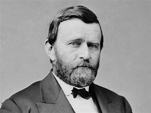
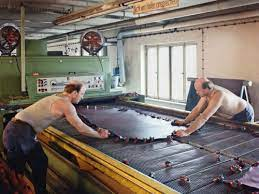
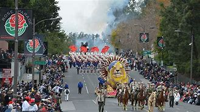

title:: 060 Ulysses S. Grant: Well-Meaning

- ## 060 Ulysses S. Grant: Well-Meaning
- ## pure
  collapsed:: true
	- VOA Learning English presents America's Presidents.
	- Today we are talking about Ulysses S. Grant. He took office in 1869.
	- But his presidency is not what made him famous. Grant is best remembered for being the commander of Union forces at the end of the Civil War. He led the United States to victory over the Confederate States of America.
	- Many Americans also remember Grant because of the unusual story about his middle initial.
	- When the future 18th president was born, his parents named him Hiram Ulysses Grant. But the boy was known as Ulysses.
	- When Grant was a young man, a member of Congress appointed him to a top college: the U.S. Military Academy at West Point, New York.
	- The congressman did not know Grant personally. He thought Grant used his mother's family name, Simpson, as his middle name. So the congressman called him Ulysses S. Grant.
	- The middle initial "S" became official. Years later, Grant joked that it did not mean anything.
	- During the Civil War, however, Grant's middle name did come to have a popular meaning. In a famous battle in the state of Tennessee, Grant's army overpowered their opponents.
	  The Confederate general sent a note asking for the terms of surrender -- in other words, what would the Union army require of them if they withdrew from the battle?
	- General Grant replied: "No terms except unconditional and immediate surrender."
	- The answer did not please the Confederate general, but he agreed.
	- In the North, people celebrated the victory. They began saying Grant's first two initials stood for "Unconditional Surrender."
	- ## Early life
	- Grant was born in the state of Ohio. He was the oldest of six children.
	- Grant's father worked as a tanner – a person who makes leather from animal skin.
	- As a boy, Grant helped his father. But he did not like the work. He said he would not do it when he was an adult.
	- So, when Grant was a young man, his father asked West Point officials to admit his son as a student. The Grants had little money to pay for the boy's college education. But they knew he was intelligent and skilled, and West Point was free. In exchange for their education, West Point graduates serve in the military.
	- Grant probably did not seem like a soldier. He was quiet and sensitive. He hated seeing men die in battle, and he questioned the value of war.
	- But he turned out to be an excellent military leader. After he graduated from West Point, he fought in the Mexican War and earned medals for bravery. He was given more power and added responsibilities.
	- However, Grant was lonely. Early in his career, he married Julia Dent, the sister of a college friend. He was devoted to Julia and their four children.
	- But his family could not come with Grant on all his deployments for the military. They were separated for years at a time.
	- Without his family nearby, Grant began having problems with money. Some people said he also drank too much alcohol.
	- One day, Grant resigned from the army.
	- He returned home to his family. At first, he tried to farm, but he could not make enough money. Then he tried other jobs.
	- Finally, he asked his father for help. His father gave him a job, but it was the one the young Grant swore he never wanted: working in a leather shop.
	- ## Civil War
	- Then things took a surprising turn. The Civil War began. The Union needed experienced military leaders.
	- Grant accepted a position leading a difficult group of troops. He was able to train them and earn their respect.
	- Quickly, Grant's public image as a military leader grew. He won major victories for the Union in battles at Fort Donelson, Tennessee, and Vicksburg, Mississippi.
	- The president at the time, Abraham Lincoln, liked the way Grant planned the battles. He also liked that Grant did everything he could to win. Grant permitted so many of his soldiers to die that his critics gave him a nickname: The Butcher.
	- Grant's methods were harsh, but effective. The Civil War effectively ended when the famous Confederate general Robert E. Lee surrendered to Grant at Appomattox Court House, Virginia.
	- The following year, Grant was named general of the U.S. armies. The only other person to hold that position was the military leader during the Revolutionary War, George Washington.
	- ## Presidency
	- Like George Washington, Grant became president although he did not really seek the position.
	- But Republican Party leaders realized that the former general was very popular. And they knew that Grant opposed the policies of the president at the time, Andrew Johnson.
	- So the Republicans nominated Grant as their candidate in 1868. He won easily.
	- But Grant's popularity and ability as a military leader did not make him a successful president.
	- Grant tried to work for the political and civil rights of African-Americans, many of whom had been enslaved. One of Grant's most important acts was to support the 15th Amendment to the U.S. Constitution. The measure gave African-American men the right to vote.
	- At the same time, Grant tried to give states control over their own laws. So, sometimes he used the power of the federal government to protect the rights of African-Americans. And he sometimes let states use violence to prevent African-Americans from exercising their rights.
	- Grant also spoke about treating Native Americans with greater respect. He used government resources to help native people become farmers.
	- But other government policies helped white settlers continue to push tribes off their lands.
	- Few Native Americans saw their lives really improve under Grant.
	- Finally, his administration suffered because of corrupt government officials. Grant himself did not get rich from their actions. But he remained loyal to people who worked for him, even when they profited from their position.
	- As a result of all this, many Americans lost interest in Reconstruction and lost faith in the federal government.
	- But Grant himself remained popular. He won a second term more easily than the first.
	- Shortly after, the country entered a bad economic depression. Grant tried to improve the situation by supporting the gold standard. But many Americans – of all backgrounds – continued to suffer.
	- ## Legacy
	- Because of the problems in his government, Grant is not remembered as one of the country's best presidents.
	- But he is remembered as a war hero and as a kind-hearted man with an interesting life.
	- In his last months, Grant worked nearly nonstop on writing his memoirs. Final images show him, covered in a blanket and with a pen in his hand, diligently working.
	- Grant died in 1885, a few days after the book was finished. It was a major success. It earned enough money to provide for his family for the rest of their lives.
	- People across the country mourned the loss of Grant. More than a million and a half watched his funeral parade in New York City. He is buried there, along with his beloved wife, in a well-known memorial popularly called Grant's Tomb.
- ---
- ## def
	- VOA Learning English presents America's Presidents.
	- Today we are talking about Ulysses S. Grant. He took office in 1869.
		- > ▶ Ulysses S. Grant
		  
	- But his presidency /is not what made him famous. Grant is best remembered for /being the commander of Union forces /at the end of the Civil War. He led the United States /to victory(n.) over the Confederate States of America.
		- > ▶ victory (n.)~ (over/against sb/sth) success in a game, an election, a war, etc. 胜利；成功
	- Many Americans also remember Grant /because of the unusual story /about his middle initial.
		- > ▶ initial [ C ] the first letter of a person's first name （名字的）首字母
		  /[ C ] the first letter of a person's first name （名字的）首字母
		- 因为他中间首字母的不寻常的故事。
	- When the future 18th president was born, his parents /named him Hiram Ulysses Grant. But the boy was known as Ulysses.
	- When Grant was a young man, a member of Congress /appointed him to a top college: the U.S. Military Academy /at West Point, New York.
	- The congressman /did not know Grant personally. He thought /Grant used his mother's family name, Simpson, as his middle name. So the congressman called him /Ulysses S. Grant.
	- The middle initial "S" /became official. Years later, Grant joked that /it did not mean anything.
	- During the Civil War, however, Grant's middle name /did come to have a popular meaning. In a famous battle /in the state of Tennessee, Grant's army /overpowered their opponents.
		- > ▶ overpower (v.)to defeat or gain control over sb completely by using greater strength （以较强力量）征服，制胜 /to be so strong or great that it affects or disturbs sb/sth seriously 压倒；令人折服；使难以忍受 SYN overwhelm
		  -> The flavour of the garlic /overpowered the meat. 大蒜的味道盖过了肉味。
	- The Confederate general /sent a note /asking for the terms of surrender -- in other words, what would the Union army **require of** them /if they withdrew from the battle?
		- ((6259266b-7a76-4ad0-906b-8e57df346b40))
	- General Grant replied: "No terms /except unconditional and immediate surrender."
	- The answer did not please the Confederate general, but he agreed.
	- In the North, people celebrated the victory. They began saying /Grant's first two initials /stood for "Unconditional Surrender."
	- ## Early life
	- Grant was born /in the state of Ohio. He was the oldest of six children.
	- Grant's father /worked as a tanner – a person who makes leather from animal skin.
		- > ▶ tanner :  a person whose job is to tan animal skins to make leather 鞣皮工；硝皮匠；制革工人
		  => 来自 tan,制革，-er,人。
		  
		- > ▶ leather [ UC ] **material** made by removing the hair or fur from animal skins and preserving the skins using special processes 皮革
		   ▶ leathers [ pl. ] **clothes** made from leather , especially those worn by people riding motorcycles （尤指骑摩托车人穿的）皮衣，皮外套
	- As a boy, Grant helped his father. But he did not like the work. He said /he would not do it /when he was an adult.
	- So, when Grant was a young man, his father asked West Point officials /to admit his son /as a student. The Grants had little money /to pay for the boy's college education. But they knew /he was intelligent and skilled, and West Point was free. **In exchange for** their education, West Point /graduates serve in the military.
		- 定冠词the + 人名复数 : 表『某夫妇或某一家人』. the Smiths"表『史密斯夫妇 /史密斯一家人』
	- Grant probably did not seem like a soldier. He was quiet and sensitive. He hated seeing men die in battle, and he questioned /the value of war.
	- But he **turned out to be** an excellent military leader. After he graduated from West Point, he fought /in the Mexican War /and earned medals(n.) for bravery. He was given more power /and added responsibilities.
		- 并获得了勇敢勋章。他被赋予了更多的权力和更多的责任。
	- However, Grant was lonely. Early in his career, he married Julia Dent, the sister of a college friend. He was devoted(a.) to Julia /and their four children.
		- > ▶ devoted (a.) ~ (to sb/sth) : having great love for sb/sth /and being loyal to them 挚爱的；忠诚的；全心全意的
		  -> They are devoted(a.) to their children. 他们深爱着自己的孩子。
	- But his family /could not come with Grant /on all his deployments for the military. They were separated for years /at a time.
		- > ▶ deployment N-VAR The deployment of troops, resources, or equipment /is the organization and positioning of them /so that they are ready for quick action. 部署
		- 他们曾一度分居多年。
	- Without his family nearby, Grant began having problems with money. Some people said /he also drank too much alcohol.
	- One day, Grant resigned from the army.
	- He returned home to his family. At first, he tried to farm, but he could not make enough money. Then he tried other jobs.
	- Finally, he **asked** his father **for help**. His father gave him a job, but it was the one /the young Grant swore he never wanted: working in a leather shop.
	- ## Civil War
	- Then things took a surprising turn. The Civil War began. The Union /needed experienced military leaders.
	- Grant accepted a position /leading a difficult group of troops. He was able to train them /and earn their respect.
	- Quickly, Grant's public image as a military leader /grew. He won major victories /for the Union /in battles at Fort Donelson, Tennessee, and Vicksburg, Mississippi.
		- 格兰特作为军事领袖的公众形象迅速提升。
	- The president at the time, Abraham Lincoln, liked the way /Grant planned the battles. He also liked that /Grant did everything he could /to win. Grant permitted **so** many of his soldiers to die /**that** his critics gave him a nickname: The Butcher.
		- > ▶ butcher 屠夫；肉贩
		- 当时，亚伯拉罕·林肯很喜欢格兰特计划战斗的方式。他也喜欢格兰特竭尽所能去赢得比赛。格兰特允许这么多他的许多士兵牺牲，以至于他的批评者给他起了一个绰号:屠夫。
	- Grant's methods were harsh, but effective. The Civil War effectively ended /when the famous Confederate general Robert E. Lee /surrendered to Grant /at Appomattox Court House, Virginia.
		- > ▶ harsh (a.) cruel, severe and unkind 残酷的；严酷的；严厉的 
		  /( of weather or living conditions 天气或生活环境 ) very difficult and unpleasant to live in 恶劣的；艰苦的 
		  /too strong and rough and likely to damage sth 粗糙的；毛糙的；刺激性强的
	- The following year, Grant was named /general of the U.S. armies. The only other person /to hold that position /was the military leader /during the Revolutionary War, George Washington.
		- 第二年，格兰特被任命为美国陆军将军。另一个担任这个职位的人是独立战争时期的军事领袖乔治·华盛顿。
	- ## Presidency
	- Like George Washington, Grant became president /although he did not really seek the position.
	- But Republican Party leaders /realized that /the former general was very popular. And they knew that /Grant opposed the policies of the president /at the time, Andrew Johnson.
		- 他们知道格兰特反对当时的总统，安德鲁·约翰逊的政策。
	- So the Republicans /**nominated** Grant **as** their candidate in 1868. He won easily.
	- But Grant's popularity and ability /as a military leader /did not make him a successful president.
		- 但是格兰特的声望, 和军事领袖的能力, 并没有使他成为一位成功的总统。
	- Grant tried to work for the political and civil rights /of African-Americans, many of whom /had been enslaved. One of Grant's most important acts was /to support the 15th Amendment to the U.S. Constitution. The measure /gave African-American men /the right to vote.
		- 格兰特试图为非洲裔美国人的政治权利和公民权利, 而努力，他们中的许多人都曾是奴隶。格兰特最重要的法案之一, 就是支持美国宪法第十五修正案。这项法案赋予了非洲裔美国人投票的权利。
	- At the same time, Grant tried to give states control /over their own laws. So, sometimes he used the power of the federal government /to protect the rights of African-Americans. And he sometimes let states /use violence /**to prevent** African-Americans **from** exercising their rights.
		- 有时，他还允许各州使用暴力, 来阻止非裔美国人行使自己的权利。
	- Grant also **spoke about** treating Native Americans /with greater respect. He used government resources /to help native people become farmers.
		- 格兰特还谈到要更加尊重印第安人。
	- But other government policies /helped white settlers /continue **to push** tribes **off** their lands.
		- 但其他政府政策, 帮助白人定居者继续将土著部落, 从他们的土地上赶走。
	- Few Native Americans /saw their lives really improve /under Grant.
		- 在格兰特的任下，几乎没有印第安人的生活真正得到了改善。
	- Finally, his administration suffered /because of corrupt government officials. Grant himself did not get rich /from their actions. But he remained loyal to people /who worked for him, even when they profited /from their position.
		- ((6258fc94-4e2d-4f8c-ba83-e2a8d61dab3e))
		- 最后，他的政府, 因官员腐败而遭受损害。虽然格兰特本人并没有从他们的腐败行动中致富, 但他仍然忠于为他工作的人，即使他们从自己的职位中获利。
	- As a result of all this, many Americans /lost interest in Reconstruction /and lost faith in the federal government.
	- But Grant himself /remained popular. He won a second term more easily /than the first.
	- Shortly after, the country /entered a bad economic depression. Grant tried to improve the situation /by supporting **the gold standard**. But many Americans – of all backgrounds – continued to suffer.
		- > ▶ **gold standard** : [ sing. ] an economic system in which the value of money is based on the value of gold 金本位制
		- 格兰特试图通过支持金本位制来改善这种状况。但许多美国人——各种背景的人——仍然在受苦。
	- ## Legacy
	- Because of the problems in his government, Grant is not **remembered /as** one of the country's best presidents.
		- 格兰特并不被认为是美国最好的总统之一。
	- But he is **remembered as** a war hero /and **as** a kind-hearted man /with an interesting life.
	- In his last months, Grant **worked** nearly nonstop(ad.) **on** writing his memoirs. Final images show him, covered in a blanket /and with a pen in his hand, diligently working.
		- > ▶ nonstop (a.) (ad.) ADJ Something that is nonstop continues without any pauses or interruptions. 不停的; 不间断的
		- > ▶ diligently  adv. 勤奋地；勤勉地
		  => di-, 分开，散开，来自dis-变体。-lig, 选择，词源同collect, eligible. 即选出，甄选，引申为勤勉，勤奋。
		- 在格兰特生命的最后几个月里，他几乎不间断地写回忆录。最后的照片显示，他裹着毯子，手里拿着笔，勤奋地工作。
	- Grant died in 1885, a few days /after the book was finished. It was a major success. It earned enough money /**to provide** for his family /**for** the rest of their lives.
		- 这是一个巨大的成功。这笔钱足以养活他的家人度过余生。
	- People across the country /mourned the loss of Grant. More than a million and a half /watched his funeral parade /in New York City. He is buried there, along with his beloved wife, in a well-known memorial popularly /called Grant's Tomb.
		- > ▶ parade (n.)(v.) a public celebration of a special day or event, usually with bands in the streets and decorated vehicles 游行 /检阅；阅兵
		  => 来自拉丁语parere,准备，安排，装饰，词源同pare,prepare.原指接受检阅的军队，后词义通俗化。
		  
		- 超过150万人在纽约市观看了他的葬礼游行。他和他深爱的妻子被合葬在一个著名的纪念碑下，称为格兰特墓。
-