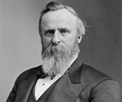

title:: 061 Rutherford B. Hayes: Middle-of-the-Road

- ## 061 Rutherford B. Hayes: Middle-of-the-Road
- ## pure
  collapsed:: true
	- VOA Learning English presents America's Presidents.
	- Today we are talking about Rutherford B. Hayes. He took office in 1877 and was president during the end of what Americans call Reconstruction – the period following the Civil War.
	- Hayes had a public image as an honest, dignified man. And even though he had ideas that were radical at the time, he supported moderate policies and measured change.
	- One exception was alcoholic drinks. Hayes banned wine and liquor from the White House.
	- ## Early Life
	- Before Rutherford Hayes was born, his father died. Not too long after that, his older brother died, too.
	- As a result, Hayes grew up mostly with just his mother and his older sister. Later, an uncle helped raise him, as well.
	- As a boy, Rutherford Hayes was called "Rud." He grew up on a farm in Ohio and spent his early years playing with his sister, who taught him to love books.
	- Hayes was an excellent student, and in time he attended Kenyon College and Harvard Law School.
	- Hayes started his career as a lawyer in the city of Cincinnati, Ohio. He did not go into a field that made much money. Instead, he defended people who were poor or in difficult situations.
	- He also courted the woman he would marry. Lucy Webb – like Hayes' mother and sister – strongly influenced the way Hayes thought.
	- Hayes' own views at the time were moderate. He drank alcohol, but not much. He opposed slavery, but he was not an anti-slavery activist.
	- His new wife, however, was strongly against alcohol and slavery. She was part of social movements at the time to ban alcoholic drinks entirely in the United States.
	- And she encouraged Hayes to defend not only the poor in his law business, but also runaway slaves.
	- Together, Rutherford and Lucy Hayes formed an equal marriage committed to helping others. They were known for being friendly, informal and welcoming.
	- They also went on to have eight children, five of whom survived to adulthood. Lucy Webb Hayes said her husband was "always calm" as a father, and took time even when he was president to care for his children.
	- ## Election of 1876
	- Because Hayes had such a positive public image, it is ironic that the contest that elected him president was one of the most hostile in U.S. history.
	- The full story is complex. But the general story is that Hayes was the Republican candidate, and Samuel Tilden was the Democratic candidate.
	- Tilden won more popular votes across the country. But in the U.S. system, the majority of voters do not choose the president. Instead, a few electors in each state cast votes. In a way, then, the states choose the president.
	- And in the election of 1876, three Southern states gave conflicting reports. It was not clear whether Tilden or Hayes had won South Carolina, Florida and Louisiana.
	- Even though the election was held in November, the debate over the winner lasted until the following March – days before the new president was to be sworn in.
	- One of the most serious accusations was that Democrats in the South had prevented many black men from voting. If those men had been able to vote, they almost certainly would have voted for Hayes.
	- In the end, a special commission in Congress gave the votes in all three disputed states to Rutherford Hayes.
	- His opponents pointed out that the majority of people on the commission were Republicans. As a result, they said, the new president had earned his position only because of party politics. They called him "Rutherfraud" and "His Fraudulancy."
	- But, in the end, Hayes was widely considered an independent president who operated outside of party loyalties.
	- ## Presidency
	- One of Hayes' first acts as president was probably his most important: He withdrew federal troops from Southern states.
	- The troops had been trying to protect the civil and political rights of African-Americans . But white Democrats disliked the federal government's involvement in their affairs. Also, the troops were not very effective.
	- So Hayes said that if Southern officials promised to obey the country's laws protecting all people equally, he would end the federal government's occupation of their states.
	- The officials agreed, and the period known as Reconstruction officially ended.
	- But, as the years went on, the rights of black Americans were increasingly violated.
	- As a result, part of Hayes' legacy is one of betrayal. His policy permitted systemic violence and racism to continue for decades.
	- Another of Hayes' important acts was to reform the country's civil service. For the most part, members of Congress offered their political allies government jobs with good pay. But Hayes sought to change the rules. He wanted to give government jobs to the most able workers.
	- While his goal was a good one, his action shocked and angered many members of Congress.
	- The Democrats especially sought to weaken Hayes' position by removing the president's ability to veto their bills. Hayes fought back – and won.
	- By the second half of his term, Hayes had restored some of Americans' trust in government that had been lost under the two presidents before him, Andrew Johnson and Ulysses S. Grant.
	- He had helped ease the tensions between the North and South.
	- He had stabilized the economy.
	- He had increased the power of the presidency in a mostly positive way.
	- And he had prepared the way for major civil service reform.
	- But Hayes is not remembered as an especially great president. He is often placed toward the middle – not one of the best, and not one of the worst.
	- Some historians suggest that Hayes would be better remembered if he had stayed a second term and supervised some of the gains begun in his first years.
	- But, Hayes had promised that he would serve only one term as president.
	- So, true to his word, Hayes did not seek re-election.
	- ## Final years
	- Hayes had always believed that the best way to solve the country's problems was to improve the education system.
	- So, in his retirement, Hayes became president of two social welfare organizations. One aimed to provide a Christian education to blacks in the South. One of the people helped by that organization was the well-known writer and activist W.E.B. DuBois.
	- Hayes also led a group aimed at reforming the country's prison system.
	- When he was 70 years old, Hayes fell ill. Although he had a big heart for children and for helping people, he died of heart failure.
	- Afterwards, one of his sons began a new tradition in honor of his father. He established the first presidential library.
- ---
- ## def
	- VOA Learning English presents America's Presidents.
	- Today we are talking about Rutherford B. Hayes. He took office in 1877 /and was president /during the end of what Americans call Reconstruction – the period /following the Civil War.
		- > ▶ Rutherford B. Hayes
		  
	- Hayes had a public image **as** an honest, dignified man. And even though he had ideas /that were radical /at the time, he supported moderate policies /and measured(a.) change.
		- > ▶ measured (a.)[ only before noun ] **slow and careful; controlled** 缓慢谨慎的；慎重的；克制的
		  -> She replied /in a measured(a.) tone /to his threat. 她以很有分寸的语气回答了他的威胁。
		- 海耶斯的公众形象是一个诚实、有尊严的人。尽管他的想法在当时很激进，但他支持温和的政策和有节制的改变。
	- One exception was **alcoholic drinks**. Hayes **banned** wine and liquor /**from** the White House.
		- 酒精饮料是个例外. 海耶斯禁止在白宫饮酒。
	- ## Early Life
	- Before Rutherford Hayes was born, his father died. Not too long after that, his older brother died, too.
	- As a result, Hayes grew up /mostly with just his mother /and his older sister. Later, an uncle helped raise him, as well.
		- > ▶ as well 也；同样地
	- As a boy, Rutherford Hayes was called "Rud." He grew up /on a farm in Ohio /and spent his early years /playing with his sister, who taught him /to love books.
	- Hayes was an excellent student, and in time /he attended Kenyon College /and Harvard Law School.
	- Hayes started his career as a lawyer /in the city of Cincinnati, Ohio. He did not go into a field /that made much money. Instead, he defended people /who were poor /or in difficult situations.
	- He also courted(v.) the woman /he would marry. `主` Lucy Webb – like Hayes' mother and sister – `谓` strongly influenced the way /Hayes thought.
		- > ▶ court :  (v.)[ VN ] to try to please sb /in order to get sth you want, especially the support of a person, an organization, etc. （为有所求，尤指寻求支持而）试图取悦，讨好，争取 
		  /[ VN ] ( formal ) to try to obtain sth 试图获得；博得 /（向女子）求爱，求婚 
		  /[ VN ] ( formal ) to do sth /that might result in sth unpleasant happening 招致，酿成，导致（不愉快的事）
		  -> **to court danger/death/disaster** 招致危险╱死亡╱灾难
		  -> He has never **courted(v.) popularity**. 他从不追求名望。
		  => 来自co-, 强调。-hort, 庭院，词源同yard, garden. 原指王室宫廷，后词义外延不断扩大。
		- 他还追求了他将要娶的女人。像海斯的母亲和姐姐一样，露西·韦伯强烈地影响了海斯的思维方式。
	- Hayes' own views at the time /were moderate. He drank alcohol, but not much. He opposed slavery, but he was not an anti-slavery activist.
		- 当时, 海耶斯的观点是温和的。
	- His new wife, however, was strongly against alcohol and slavery. She was part of social movements /at the time /to ban alcoholic drinks entirely /in the United States.
		- 然而，他的新妻子强烈反对酒精和奴隶制。她是当时在美国完全禁止酒精饮料的社会运动的一部分。
	- And she encouraged Hayes /to defend **not only** the poor /in his law business, **but also** runaway slaves.
		- > ▶ runaway (a.) ( of a person 人 ) having left without telling anyone 逃跑的；出走的
		- 她鼓励海耶斯不仅要在他的法律事业中为穷人辩护，还要为逃跑的奴隶辩护。
	- Together, Rutherford and Lucy Hayes /formed an equal marriage /committed to helping others. They were known for /being friendly, informal and welcoming.
		- > ▶ **commit (v.)~ (to sb/sth)** to be completely loyal to one person, organization, etc. or give all your time and effort to your work, an activity, etc. 忠于（某个人、机构等）；全心全意投入（工作、活动等）
		  /**~ a crime, etc.** to do sth wrong or illegal 做出（错或非法的事）；犯（罪或错等）
		- 拉瑟福和露西·海斯, 共同建立了一个平等的婚姻，致力于帮助他人。他们以友好、随意和热情著称。
	- They also went on /to have eight children, five of whom /survived to adulthood. Lucy Webb Hayes said /her husband was "always calm" as a father, and **took time** /even when he was president /**to care for** his children.
		- 他们还生了8个孩子，其中5个活到了成年。海斯(Lucy Webb Hayes)说，她的丈夫作为一个父亲“总是很冷静”，甚至在担任总统时也花时间照顾孩子。
	-
	- ## Election of 1876
	- Because Hayes had such a positive public image, it is ironic that /`主` the contest /that elected him president /`系` was one of the most hostile in U.S. history.
		- > ▶ contest (n.)(v.) a competition in which people try to win sth 比赛；竞赛 
		  /~ (for sth) : a struggle to gain control or power （控制权或权力的）争夺，竞争
		- 但他的总统竞选, 却是美国历史上最具敌意的竞选之一。
	- The full story is complex. But the general story is that /Hayes was the Republican candidate, and Samuel Tilden was the Democratic candidate.
	- Tilden won more popular votes /across the country. But in the U.S. system, the majority of voters /do not choose the president. Instead, a few electors in each state /cast votes. In a way, then, the states choose the president.
		- > ▶ elector : a person who has the right to vote in an election 有选举权的人；选民
		- 蒂尔登在全国赢得了更多的选票。但在美国的制度中，大多数选民不会选择总统。相反，每个州只有少数选举人投票。在某种程度上，各州选择了总统。
	- And in the election of 1876, three Southern states /gave conflicting reports. It was not clear /whether Tilden or Hayes /had won South Carolina, Florida and Louisiana.
		- > ▶ conflicting adj. 冲突的；相矛盾的；不一致的
	- Even though /the election was held in November, the debate over the winner /lasted until the following March – days /before the new president was to be sworn in.
		- 但关于获胜者的辩论, 一直持续到次年3月.
	- One of the most serious accusations was that /Democrats in the South /**had prevented** many black men **from** voting. If those men /had been able to vote, they almost certainly would have voted for Hayes.
		- > ▶ accusation (n.)~ (of sth) (against sb) |~ (that...) : a statement saying that you think a person is guilty of doing sth wrong, especially of committing a crime; the fact of accusing sb 控告；起诉；告发；谴责
	- In the end, a special commission in Congress /**gave** the votes in all three disputed states /**to** Rutherford Hayes.
		- 最后，国会的一个特别委员, 会把三个有争议州的选票, 都投给了拉瑟福德·海斯。
	- His opponents pointed out that /the majority of people on the commission /were Republicans. As a result, they said, the new president /had earned his position /only because of party politics. They called him "Rutherfraud" and "His Fraudulancy."
	- But, in the end, Hayes was widely considered /an independent president /who operated **outside of** party loyalties.
		- 但最后，海斯被广泛认为是一位不忠于党派的独立总统。
	- ## Presidency
	- One of Hayes' first acts as president /was probably his most important: He **withdrew** federal troops **from** Southern states.
	- The troops /had been trying to protect **the civil and political rights** /of African-Americans . But white Democrats /disliked the federal government's involvement /in their affairs. Also, the troops /were not very effective.
		- 军队一直在努力保护非裔美国人的公民和政治权利。但是白人民主党人不喜欢联邦政府介入他们的事务。而且，部队的战斗力也不是很好。
	- So Hayes said that /if Southern officials promised /to obey the country's laws /protecting all people equally, he would end the federal government's occupation /of their states.
	- The officials agreed, and the period /known as Reconstruction officially ended.
	- But, as the years went on, the rights of black Americans /were increasingly violated.
	- As a result, part of Hayes' legacy is one of betrayal. His policy /permitted systemic violence and racism /to continue(v.) for decades.
		- > ▶ betrayal (n.)[ UC ] the act of betraying sb/sth or the fact of being betrayed （被）背叛，出卖
		- 因此，海耶斯的遗产之一就是背叛。他的政策允许系统性暴力和种族主义持续数十年。
	- Another of Hayes' important acts was /to reform the country's civil service. For the most part, members of Congress /offered their **political allies** 双宾 government jobs /with good pay. But Hayes sought to change the rules. He wanted **to give** government jobs **to** the most able workers.
		- 海斯的另一项重要举措, 是改革国家的公务员制度。在大多数情况下，国会议员向他们的政治盟友提供高薪的政府工作。但海耶斯试图改变规则。他想把政府工作交给最有能力的工人。
	- While his goal was a good one, his action /shocked and angered many members of Congress.
		- 虽然他的目标很好，但他的行为震惊并激怒了许多国会议员。
	- The Democrats /especially sought to weaken Hayes' position /by removing the president's ability /to veto their bills. Hayes fought back – and won.
	- By the second half of his term, Hayes had restored some of Americans' trust in government /that had been lost /under the two presidents before him, Andrew Johnson and Ulysses S. Grant.
		- > ▶ restore (v.)~ sth (to sb) : to bring back a situation or feeling that existed before 恢复（某种情况或感受）
		  /~ sth : to repair a building, work of art, piece of furniture, etc. so that it looks as good as it did originally 修复；整修；使复原
	- He had helped ease(v.) the tensions /between the North and South.
	- He had stabilized the economy.
	- He had increased the power of the presidency /in a mostly positive way.
		- 他以一种积极的方式, 增加了总统的权力。
	- And he had prepared the way /for major civil service reform.
		- 他还为重大的公务员制度改革, 铺平了道路。
	- But Hayes is not remembered as an especially great president. He is often placed /toward the middle – not one of the best, and not one of the worst.
		- 他经常被置于中间位置——既不是最好的，也不是最差的。
	- Some historians suggest that /Hayes would be better remembered /if he had stayed a second term /and supervised some of the gains /begun in his first years.
	- But, Hayes had promised that /he would serve only one term as president.
	- So, **true to his word**, Hayes did not seek re-election.
		- >  ▶  true  (a.)~ (to sb/sth) :  showing respect and support for a particular person or belief in a way that does not change, even in different situations 忠诚的；忠心耿耿的；忠实的
		  -> She has always been true(a.) to herself (= done what she thought was good, right, etc.) . 她一贯坚持按自己的信念办事。
		  ▶  **true to his word** 说到做到, 说话算话; 遵守诺言（不失信）
	- ## Final years
	- Hayes had always believed that /the best way to solve the country's problems /was to improve the education system.
	- So, in his retirement, Hayes became president of two **social welfare** organizations. One /aimed to provide a Christian education to blacks in the South. One of the people /helped by that organization /was the well-known writer and activist W.E.B. DuBois.
		- 因此，在他退休后，海斯成为两个社会福利组织的主席。其中一个目标是为南方黑人提供基督教教育。该组织帮助过的人里面, 有一位就是著名作家和活动家 -- W.E.B.杜波依斯。
	- Hayes also led a group /aimed at reforming the country's prison system.
	- When he was 70 years old, Hayes fell ill. Although he had a big heart /for children and for helping people, he died of heart failure.
		- 尽管他对孩子们和帮助人们有一颗宽广的心，他死于心脏衰竭。
	- Afterwards, one of his sons /began a new tradition /in honor of his father. He established the first presidential library.
		- 他建立了第一个总统图书馆。