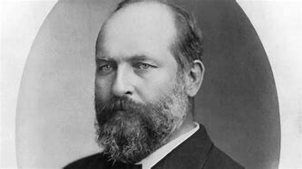

title:: 062 James Garfield: Assassinated

- ## 062 James Garfield: Assassinated
- ## pure
  collapsed:: true
	- VOA Learning English presents America's Presidents.
	- Today we are talking about James Garfield. He was the 20th president of the United States.
	- Garfield is not one of the best-known presidents. He served only 100 days before he was shot. Eleven weeks later, he died from his wounds.
	- But even during Garfield's short time in office, historians say his presidency had problems.
	- ## Early life
	- Like the president before him, Rutherford B. Hayes, Garfield was from the state of Ohio.
	- Garfield's father died when he was very young. The future president was raised largely by his mother, two older sisters and a brother.
	- Among all the presidents, Garfield probably was the most poor in his early years. Growing up, he worked as a farmer, a sailor, a carpenter, a teacher and a janitor.
	- Finally, he earned a position as a student at Williams College in western Massachusetts.
	- Garfield loved learning. He eventually taught at a school called the Eclectic Institute. Later, he became its president.
	- Garfield married one of his students at the Eclectic Institute, Lucretia Rudolph. She became a teacher, too.
	- The future president and his wife went on to have seven children. Four sons and a daughter survived to adulthood.
	- In time, Garfield moved out of education and into law and politics. He was an anti-slavery activist who did not think the Southern states had a right to withdraw from the Union. When the Civil War came, Garfield welcomed it.
	- During the war, Garfield served in the military as an officer. He won awards for his bravery. While still a young man, he was appointed to the position of major general.
	- His image as a war hero was so great that Garfield did not have to campaign for a seat in the U.S. House of Representatives. He was elected on his name alone.
	- ## Congress
	- Garfield's way of thinking changed while he was in Congress. He began as one of the most extreme Radical Republicans. He wanted to punish former Confederate officers severely.
	- But, in time, Garfield softened his positions. He learned to compromise with other groups in order to achieve results for his state.
	- But he did not always represent the interests of workers or farmers in Ohio. Garfield supported business interests that wanted to limit the country's money supply. He opposed labor unions and cooperative farm programs, called the Grange.
	- Garfield also became linked to a corruption case. He accepted stock shares in a company that was building a railroad across the country. In exchange, Garfield and other top officials eased government rules so businessman could earn higher profits for their work.
	- Although Garfield's political career sometimes drew criticism, he continued to rise in government.
	- ## Presidency
	- When Garfield became president in March 1881, he did not have what Americans call a mandate – the approval of a large part of the population.
	- Instead, he needed to make compromises with lawmakers to help win their support.
	- As a result, the first weeks of his presidency were a political struggle to appoint members to his cabinet of advisors.
	- Garfield also clashed with a powerful senator from New York State. The senator wanted to continue the tradition of permitting senators to choose who got government jobs in their states. But President Garfield wanted to put someone who shared his own beliefs in some of the top positions in New York.
	- Finally, the senator resigned in protest.
	- But the issue set the tone for Garfield's short time in office. Elected officials battled each other for advantages and financial gain. Officials in Garfield's party were accused of corruption and wrongdoing.
	- And before Garfield could really suggest any ideas for government reform, he was shot by someone seeking a government job in exchange for his political support.
	- ## Assassination
	- On July 2, 1881 – fewer than four months after he took office – Garfield was leaving for a short trip with two of his sons. They were going to take a train to Williams, the college Garfield had attended and loved. The president was supposed to give a speech there.
	- But as he walked through the train station, a man with a gun stepped behind Garfield and shot the president twice.
	- One bullet touched Garfield's arm. The other went into his lower back.
	- Garfield did not die immediately. Instead, he was taken back to the White House, where doctors tried to remove the bullet.
	- One of the men who tried was Alexander Graham Bell, the inventor of the telephone.
	- Bell tried to find the bullet by using a device like a metal detector that he had invented. But the springs on Garfield's bed interfered.
	- Neither Bell nor the doctors were able to remove the bullet. And, some historians say, their efforts may have made the situation worse.
	- Garfield suffered for more than two more months. At one point, he seemed to be recovering. But on September 19, he finally died. He was 49 years old.
	- As for the gunman, he was captured shortly after the shooting. His name was Charles Guiteau.
	- Guiteau was a lawyer with little money, but many mental problems.
	- During the election of 1880, he had first supported the candidacy of former president Ulysses S. Grant. When Garfield won the Republican nomination instead, Guiteau supported him.
	- Guiteau did not have an official role in the election campaign, and Garfield did not know him. But over time, Guiteau came to believe that he was responsible for Garfield winning the presidency. As a result, Guiteau thought Garfield owed him a government job.
	- Guiteau wrote the president several letters requesting positions as a diplomat in Europe. When Garfield did not write back, Guiteau grew angry. He believed Garfield was ruining the Republican Party and destroying the country.
	- For weeks, Guiteau followed the president and plotted to kill him. When he succeeded in shooting Garfield, Guiteau believed he had performed a great service.
	- At his trial, a jury decided that Guiteau was sane – in other words, he was not too mentally unbalanced to be responsible for his crime. Almost a year after he shot the president, Guiteau himself was hanged.
	- Thus the most dramatic event in James Garfield's presidency came to an end.
- ---
- ## def
	- VOA Learning English presents America's Presidents.
	- Today we are talking about James Garfield. He was the 20th president of the United States.
		- > ▶ James Garfield
		  
	- Garfield is not one of the best-known presidents. He served only 100 days /before he was shot. Eleven weeks later, he died from his wounds.
	- But even during /Garfield's short time in office, historians say /his presidency had problems.
	- ## Early life
	- Like the president /before him, Rutherford B. Hayes, Garfield /was from the state of Ohio.
	- Garfield's father died /when he was very young. The future president was raised /largely by his mother, two older sisters and a brother.
	- Among all the presidents, Garfield /probably was the most poor /in his early years. Growing up, he worked as a farmer, a sailor, a carpenter, a teacher and a janitor.
		- > ▶ carpenter 木工；木匠
		  => carpenter = carpent（马车）+er（的人）→制作马车的人→木匠
		- > ▶ janitor  /ˈdʒænɪtər/   N-COUNT A janitor is a person /whose job is to take care of a building. 看门人
		  => January（一月）来自古罗马的门户之神Janus的名字，而该神名则来自拉丁语ianua（门）；同样来自这个拉丁语的单词是janitor（门卫）。一月是一年的门户，通过理解January的本义得到词根-jan-“门”，这样janitor应该好记些。
		  
	- Finally, he earned a position as a student /at Williams College /in western Massachusetts.
	- Garfield loved learning. He eventually taught at a school /called the Eclectic(a.) Institute. Later, he became its president.
		- > ▶ eclectic  /ɪˈklektɪk/  (a.)not following one style or set of ideas but choosing from or using a wide variety 不拘一格的；兼收并蓄的
		  -> She has very eclectic(a.) tastes /in literature. 她在文学方面的兴趣非常广泛。
		  => ec-, 向外。-lect, 选，收集，词源同elect, collect.
	- Garfield married one of his students /at the Eclectic Institute, Lucretia Rudolph. She became a teacher, too.
	- The future president and his wife /went on /to have seven children. Four sons and a daughter /survived to adulthood.
		- > ▶ adulthood [ U ] the state of being an adult 成年
	- In time, Garfield moved out of education /and into law and politics. He was an anti-slavery activist /who did not think /the Southern states had a right /to withdraw from the Union. When the Civil War came, Garfield welcomed it.
	- During the war, Garfield served in the military /as an officer. He won awards /for his bravery. While still a young man, he was appointed to the position /of **major general**.
		- > ▶ major general : an officer of very high rank /in the army or the US air force 陆军少将；（美）空军少将
	- His image as a war hero /was **so** great /**that** Garfield did not have to campaign for a seat /in the U.S. House of Representatives. He was elected /on his name alone.
		- ((625908f6-f5cc-42ed-a354-52a7f9aa8d4e))
		- 他甚至不用竞选众议院议员。他仅以自己的名义当选。
	- ## Congress
	- Garfield's way of thinking /changed(v.) /while he was in Congress. He began /as one of the most extreme Radical Republicans. He wanted to punish former Confederate officers severely.
		- 加菲尔德在国会的时候，他的思维方式改变了。他最初是最极端的激进共和党人之一。他想严惩前邦联军官。
	- But, in time, Garfield softened his positions. He learned /to compromise with other groups /in order to achieve results for his state.
		- > ▶ state : ( also the State ) [ Using. ] the government of a country 政府
		- 以便为他的政府取得成果。
	- But he did not always represent(v.) /the interests of workers or farmers /in Ohio. Garfield supported business interests /that wanted to limit the country's **money supply**. He opposed **labor unions** and **cooperative farm programs**, called the Grange.
		- > ▶ cooperative (a.)[ usually before noun ] involving doing sth together /or working together /with others /towards a shared aim 合作的；协作的；同心协力的
		  /helpful by doing what you are asked to do 协助的；配合的
		  -> Employees will generally **be more cooperative**(a.) /if their views are taken seriously. 如果雇员的意见得到认真对待，他们一般都会更加配合。
		  /[ usually before noun ] ( business 商 ) owned and run by the people involved, with the profits shared by them 共同拥有共同经营利益共享的；合作的
		  -> a cooperative farm 合作农场
		- > ▶ grange : ( often as part of a name 常作名称的一部分 ) a country house with farm buildings 农庄；庄园
		  -> Thrushcross Grange 思拉什克罗斯庄园
		  => 来自拉丁语granica, 谷仓，粮仓，词源同grain, granary. 即种粮之地，农庄，庄园。
		  
		- 但他并不总是代表俄亥俄州工人或农民的利益。加菲尔德支持那些想要限制国家货币供应的商业利益。他反对工会和农场合作计划，称为田庄。
	- Garfield also became linked to a corruption case. He accepted **stock shares** /in a company /that was building a railroad /across the country. In exchange, Garfield and other top officials /eased government rules /so businessman could earn higher profits /for their work.
		- > ▶  stock shares  股份
		- Garfield 还与一起腐败案件有关。他接受了一家正在全国修建铁路的公司的股票。作为交换，Garfield 和其他高级官员, 放宽了政府规定，让商人可以从他们的工作中获得更高的利润。
	- Although Garfield's political career /sometimes drew criticism, he continued to rise in government.
		- > ▶ criticism (n.) [ UC ] ~ (of sb/sth) |~ (that...) : the act of expressing disapproval of sb/sth and opinions about their faults or bad qualities; a statement showing disapproval 批评；批判；责备；指责
		  -> Ben is very sensitive, he just can't **take criticism** . 本很敏感，简直接受不了批评。
		- 尽管Garfield 的政治生涯, 有时会招致批评，但他继续在政府中崛起。
	- ## Presidency
	- When Garfield became president in March 1881, he did not have /what Americans call a mandate(n.) – the approval /of a large part of the population.
		- > ▶ mandate (n.)(v.)~ (to do sth) |~ (for sth) : the authority to do sth, given to a government or other organization /by the people /who vote for it /in an election （政府或组织等经选举而获得的）授权
		  /the period of time /for which a government is given power （政府的）任期
		  -> The presidential mandate /is limited to two terms of four years each. 总统的任期不得超过两届，每届四年。
		  => 词根-man-指“手”，如manual（手册）、manicure（修指甲）等；词根-dat-、-dit-指“给”，如edit（编辑；字面义“对外给出，公之于众”，编辑的目的是出版）；该词字面义“亲手给出”，给出权力即“授权”，给出要求即“命令”。command（命令）同源。
		- 他没有得到美国人所说的“授权”——大部分美国人的批准。
	- Instead, he needed to make compromises with lawmakers /to help win their support.
	- As a result, the first weeks of his presidency /were a political struggle /**to appoint** members **to** his cabinet of advisors.
		- 因此，在他就任总统的头几个星期，他为任命顾问内阁成员, 而进行了一场政治斗争。
	- Garfield also clashed with a powerful senator /from New York State. The senator wanted to continue the tradition /of permitting senators /to choose /who got government jobs /in their states. But President Garfield /wanted to put someone /who shared his own beliefs /in some of the top positions in New York.
		- 这位参议员, 想要继续"允许参议员自己来选择, 谁能在他们所在州的政府中, 来工作"的传统。但是加菲尔德总统想让一个和他有共同信仰的人, 来担任纽约的一些高层职位。
	- Finally, the senator resigned /in protest.
		- ((625cc208-7ad2-4660-8293-79ebd4291782))
		- ((62319d24-63d2-4391-a5f1-ba755ae6b05d))
	- But the issue /**set the tone /for** Garfield's short time in office. Elected officials /battled each other /for advantages and financial gain. Officials in Garfield's party /were accused of /corruption and wrongdoing.
		- > ▶ wrongdoing [ UC ] ( formal ) illegal or dishonest behaviour 不法行为；坏事；作恶；欺骗行径
		- 但这个问题为Garfield 短暂的任期定下了基调。当选的官员为了利益和经济利益相互争斗。加菲尔德所在政党的官员, 被指控腐败和不法行为。
	- And before Garfield could really suggest any ideas /for government reform, he was shot /by someone /seeking a government job /in exchange for his political support.
		- 在Garfield 对政府改革提出任何建议之前
	- ## Assassination
	- On July 2, 1881 – fewer than four months /after he took office – Garfield was leaving /for a short trip /with two of his sons. They were going to take a train to Williams, the college /Garfield had attended and loved. The president was supposed to give a speech there.
		- 他们要乘火车去威廉姆斯大学，那是加菲尔德曾经就读并喜爱的大学。
	- But as he walked through the train station, a man with a gun /stepped behind Garfield /and shot the president twice.
	- One bullet touched Garfield's arm. The other went into his **lower back**.
		- > ▶  lower back 腰背部
	- Garfield did not die immediately. Instead, he was taken back to the White House, where doctors tried to remove the bullet.
	- One of the men who tried /was Alexander Graham Bell, the inventor of the telephone.
	- Bell tried to find the bullet /by using a device /like a metal detector /that he had invented. But the springs on Garfield's bed /interfered.
		- > ▶ spring 弹簧；发条
		- ((6243b236-13ae-418b-9bb8-3a964ff1aa96))
	- **Neither** Bell **nor** the doctors /were able to remove the bullet. And, some historians say, their efforts may have made the situation worse.
	- Garfield suffered for more than two more months. At one point, he seemed to be recovering. But on September 19, he finally died. He was 49 years old.
	- **As for** the gunman, he was captured shortly /after the shooting. His name was Charles Guiteau.
		- > ▶ as for 至于,关于,就,就……方面说
	- Guiteau was a lawyer /with little money, but many mental problems.
	- During the election of 1880, he had first supported the candidacy /of former president Ulysses S. Grant. When Garfield won the Republican nomination instead, Guiteau supported him.
		- > ▶ candidacy (n.)the fact of being a candidate in an election 候选人的资格（或身份）
		  -> to announce/declare/withdraw your candidacy for the post 宣布╱宣告╱撤销职位候选人资格
	- Guiteau did not have an official role /in the election campaign, and Garfield did not know him. But over time, Guiteau came to believe that /he was responsible for Garfield winning the presidency. As a result, Guiteau thought /Garfield owed him a government job.
		- 吉托在竞选活动中没有正式职务，加菲尔德也不认识他。但随着时间的推移，吉托开始相信他对加菲尔德赢得总统选举负有责任。因此，吉托认为加菲尔德欠他一份政府工作。
	- Guiteau wrote the president several letters /requesting positions as a diplomat in Europe. When Garfield did not write back, Guiteau grew angry. He believed Garfield was ruining the Republican Party /and destroying the country.
		- ((6242a810-42ee-40e9-84ad-6fc9fd95c282))
	- For weeks, Guiteau followed the president /and plotted to kill him. When he succeeded in shooting Garfield, Guiteau believed /he had performed a great service.
	- At his trial, a jury decided that /Guiteau was sane(a.) – in other words, he was not **too** mentally unbalanced(a.) **to** be responsible for his crime. Almost a year after he shot the president, Guiteau himself was hanged.
		- id:: 625f8da9-4ac8-4a57-973b-abb60da35213
		  > ▶ sane (a.) having a normal healthy mind; not mentally ill 精神健全的；神志正常的 /sensible and reasonable 明智的；理智的；合乎情理的
		  -> the sane way to solve the problem 解决问题的明智方法
		  => 词源同 sound,健全 的，明智的，身心健康的。
		- > ▶ unbalanced (a.)[ not usually before noun ] ( of a person 人 ) slightly crazy; mentally ill 心理不平衡；精神失常 /[ usually before noun ] giving too much or too little importance to one part or aspect of sth 不持平的；偏颇的；失衡的
		  -> an unbalanced diet 不均衡的饮食
		- 陪审团认定吉托是清醒的，换句话说，他并非是到 "精神太不正常，以至于他不能对他的罪行负责"的程度。
	- Thus the most dramatic event /in James Garfield's presidency /came to an end.
	-