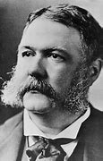

title:: 063 Chester A. Arthur: Surprisingly Good

- ## 063 Chester A. Arthur: Surprisingly Good
- ## pure
  collapsed:: true
	- VOA Learning English presents America's Presidents.
	- Today we are talking about Chester A. Arthur. (The letter "A" is for Alan, his middle name.)
	- Arthur took office because because of an unexpected event. He was sworn in as Vice President in March 1881 under James Garfield.
	- But only 100 days into Garfield's term, the president was shot. He suffered for months.
	- Arthur was not close to Garfield. The two men belonged to the same party, but they had different ideas on the issues of the day. They publicly disagreed on a number of subjects.
	- If Garfield lived, Arthur would probably not have much power in his administration.
	- But Garfield eventually died.
	- By this time, it was well-established that if the president of the United States dies in office, the vice president becomes the president.
	- So, in September 1881, Arthur became the country's chief executive. He served the remaining three and a half years of Garfield's term.
	- Historians say that, for the most part, Arthur performed ably and well.
	- ## Early life
	- Chester Arthur was raised in the northeastern states of Vermont and New York. He was one of eight children in his family. Their father was a religious leader and anti-slavery activist.
	- Arthur attended college in New York, then taught school and studied law. But he never wanted to stay in a small town and live modestly. He wanted to live in New York City, work as a lawyer and public official, become wealthy, and enjoy the lifestyle of a gentleman.
	- And that is what he did.
	- Arthur advanced from an entry-level job in a law office, to a leadership position in the military during the Civil War. After the fighting stopped, he worked in a good-paying job as a lawyer, and then accepted a top position in the government.
	- For seven years, Arthur served as the collector of the port of New York. His job involved supervising 1,300 people. They collected large amounts of money that came from taxes on imported goods.
	- The job had a political element, too. It was under the control of a U.S. senator from New York, Roscoe Conkling. Conkling was known as a Republican Party chief, who traded political support for financial and other benefits.
	- Arthur was never found guilty of accepting money or gifts in exchange for the help of his office. But he was closely linked to Conkling's political machine.
	- When Rutherford B. Hayes became president in 1878, he tried to fight corruption in government jobs. He targeted Conkling and Arthur.
	- ## Election of 1880
	- Arthur's position as the collector of the port of New York was one of the issues in the election of 1880.
	- President Hayes had suspended Arthur from the job. To get it back, Arthur and Conkling supported an effort to re-elect former president Ulysses S. Grant.
	- But another candidate won the Republican Party's presidential nomination: James Garfield.
	- Garfield and Arthur were not natural allies. Although they were both Republicans, they represented different points of view.
	- Political leaders hoped to unite the party. So, when Garfield was chosen as the presidential candidate, they added Arthur as the vice presidential nominee.
	- The effort to unite the party worked well enough to win the election. But relations between the two men were uneasy.
	- One of Garfield's first acts was to appoint someone for Arthur's old job in New York. The new president wanted someone who was not loyal to Conkling. So he gave the position to one of his supporters, instead.
	- In protest, Conkling resigned from the Senate.
	- But then events took an unexpected turn. Garfield was shot by a mentally unbalanced man who believed the president owed him a government job.
	- And Chester A. Arthur became president.
	- ## Presidency
	- When Arthur took office, he had the public image of being an experienced political operator. Most people believed he cared only about supporting the aims of a small part of the Republican Party.
	- Instead, President Arthur took an independent position on several issues. In opposition to most of his party, Arthur supported legislation to reform the country's civil service. It aimed to clean up corruption in government and took away some of the ability of politicians to give government jobs to their supporters.
	- (To be fair, in the short term, the act helped Arthur's party.)
	- Arthur also broke with the Republican Party leadership to support a reduction in tariffs. And he strongly argued to limit spending federal money on projects that helped only a few areas or businesses. Instead, he wanted to cut taxes so more people would profit from the government's surplus.
	- Finally, Arthur vetoed an anti-immigration act from Congress. The measure proposed banning Chinese immigrants for 20 years.
	- Arthur argued that the Chinese had improved the American economy by helping build a railroad across the country. He also did not want to hurt potential trade with China.
	- However, when Congress offered to ban Chinese immigrants for only 10 years, Arthur agreed. In addition, his administration banned immigrants who were considered poor, criminal, or mentally insane.
	- Perhaps Arthur's most memorable act as president, however, was to re-decorate the White House. He did not like its appearance inside. So he asked one of New York's top designers, Louis Tiffany, to make the home brighter and more stylish.
	- In the newly remodeled rooms, Arthur held parties, with fine food and drink, for elite guests. He was known as "The Gentleman Boss."
	- ## Legacy
	- Observers then and now say that Arthur served well as president. He was a solid leader after the difficult years of the Civil War and Reconstruction.
	- But Arthur did not live much beyond his presidency. Shortly into his term, he learned he had a serious kidney disease that would likely kill him.
	- As a result, he did not try hard to get re-elected.
	- Instead, after finishing his term he returned to his home in New York. Arthur tried to work as a lawyer, but he soon became too sick.
	- His wife had died of malaria before he became president. And he liked to spend his free time fishing or with friends instead of with his children. But, in his last months, he could not enjoy those activities either.
	- He died at home at the age of 57.
- ---
- ## def
	- VOA Learning English presents America's Presidents.
	- Today we are talking about Chester A. Arthur. (The letter "A" is for Alan, his middle name.)
		- > ▶ Chester A. Arthur
		  
	- Arthur took office /because of an unexpected event. He was sworn in /as Vice President /in March 1881 /under James Garfield.
		- 他在詹姆斯·加菲尔德(James Garfield)的领导下, 宣誓就任副总统。
	- But only 100 days into Garfield's term, the president was shot. He suffered for months.
	- Arthur was not close to Garfield. The two men /belonged to the same party, but they had different ideas /on the issues of the day. They publicly disagreed on /a number of subjects.
		- 但他们对当时的问题有不同的看法。
	- If Garfield lived, Arthur would probably not have much power /in his administration.
	- But Garfield eventually died.
	- By this time, it was well-established(a.) /that if the president of the United States /dies in office, the vice president /becomes the president.
		- > ▶ well-established ADJ If you say that something is well-established, you mean that it has been in existence for a long time and is successful. 确立已久的
		  -> The university has a well-established tradition /of welcoming postgraduate students from overseas.
		   该大学有由来已久的接收海外研究生的传统。
	- So, in September 1881, Arthur became the country's chief executive. He served the remaining **three and a half years** of Garfield's term.
	- Historians say that, for the most part, Arthur performed ably(ad.) and well.
		- > ▶ ably (ad.) skilfully and well 能干地
	- ## Early life
	- Chester Arthur was raised /in the northeastern states of Vermont and New York. He was one of eight children in his family. Their father was a religious leader /and anti-slavery activist.
	- Arthur attended college /in New York, then taught school /and studied law. But he never wanted to stay in a small town /and live modestly. He wanted to live in New York City, work as a lawyer and public official, become wealthy, and enjoy the lifestyle of a gentleman.
		- 过着简朴的生活。 ... 享受绅士的生活方式。
	- And that is what he did.
	- Arthur advanced /**from** an entry-level(a.) job in a law office, **to** a leadership position in the military /during the Civil War. After the fighting stopped, he worked in a good-paying job /as a lawyer, and then accepted a top position /in the government.
		- > ▶  entry-level (a.) ( of a job 工作 ) at the lowest level in a company （公司中）最初级的 
		  /( of a product 产品 ) basic and suitable for new users who may later move on to a more advanced product 适合初级用户的；入门级的
		- 然后接受了政府的一个高级职位。
	- For seven years, Arthur served as **the collector of the port** of New York. His job involved supervising 1,300 people. They collected large amounts of money /that came from taxes on imported goods.
		- > ▶ collector  收集者；收藏家
		  -> ticket/tax/debt collectors 收票员；收税员；讨债人
	- The job had **a political element**, too. It was under the control of a U.S. senator /from New York, Roscoe Conkling. Conkling was known as a Republican Party chief, who traded political support /for financial and other benefits.
		- > ▶ element (n.)~ (in/of sth) : a necessary or typical part of sth 要素；基本部分；典型部分
		  -> Cost was a key element /in our decision. 价钱是我们决策时考虑的主要因素。
		- 他以提供"政治上的支持", 来换取"对自己的经济利益和其他利益"。
	- Arthur was never found guilty(a.)  of accepting money or gifts /in exchange for the help of his office. But he was closely linked to Conkling's political machine.
		- > ▶ **guilty  (a.)~ (of sth)** : having done sth illegal; being responsible for sth bad that has happened 犯了罪；有过失的；有罪责的
		  -> The jury found /the defendant not guilty(a.) of the offence. 陪审团裁决被告无罪。
	- When Rutherford B. Hayes became president in 1878, he tried to fight corruption /in government jobs. He targeted Conkling and Arthur.
	- ## Election of 1880
	- Arthur's position /as the collector of the port of New York /was one of the issues /in the election of 1880.
	- President Hayes /had suspended Arthur from the job. To get it back, Arthur and Conkling /supported an effort /to re-elect former president Ulysses S. Grant.
	- But another candidate /won the Republican Party's presidential nomination: James Garfield.
	- Garfield and Arthur /were not natural allies. Although they were both Republicans, they represented different points of view.
		- 不是天生的盟友
	- Political leaders /hoped to unite the party. So, when Garfield was chosen as the presidential candidate, they added Arthur as the vice presidential nominee.
	- The effort to unite the party /worked well /enough to win the election. But relations between the two men /were uneasy.
		- > ▶ uneasy (a.)~ (about sth/about doing sth) **feeling worried or unhappy** about a particular situation, especially because you think that /sth bad or unpleasant may happen /or because you are not sure that /what you are doing is right 担心的；忧虑的；不安的
		  -> an uneasy laugh 不自然的大笑
		  /not certain to last; not safe or settled 不稳定的；靠不住的；不确定的
		  /that does not enable you to relax or feel comfortable 令人不安的；令人不舒服的；不安稳的
		  /used to describe a mixture of two things, feelings, etc. that do not go well together 不和谐的；不协调的；矛盾的
	- One of Garfield's first acts was /to appoint someone /for Arthur's old job in New York. The new president /wanted someone /who was not loyal to Conkling. So he **gave** the position **to** one of his supporters, instead.
	- In protest, Conkling resigned from the Senate.
	- But then /events took an unexpected turn. Garfield was shot by a mentally unbalanced(a.) man /who believed /the president owed him a government job.
	- And Chester A. Arthur became president.
	- ## Presidency
	- When Arthur took office, he had the public image /of being an experienced political operator. Most people believed /he **cared** only **about** /supporting the aims /of a small part of the Republican Party.
		- > ▶ experienced  (a.)~ (in sth) having knowledge or skill in a particular job or activity 有经验的；熟练的 /having knowledge as a result of doing sth for a long time, or having had a lot of different experiences 有阅历的；有见识的；老练的
	- Instead, President Arthur /took an independent position /on several issues. **In opposition to** most of his party, Arthur supported legislation /to reform the country's civil service. It aimed /to clean up corruption in government /and **took away** some of the ability of politicians /to give government jobs to their supporters.
		- > ▶ IN OPPOˈSITION TO SB/STH
		  (1) disagreeing strongly with sb/sth, especially with the aim of preventing sth from happening 强烈反对（或抵制）某人╱某事物
		  -> Protest marches were held /**in opposition to** the proposed law. 为抗议新提出的法规举行了示威游行。 
		  (2) contrasting two people or things /that are very different 对比；对照
		  -> Leisure is often defined **in opposition to** work. 休闲常被定义为工作的反面。
		- 然而，阿瑟总统在几个问题上采取了独立立场。与他所在政党的大多数人不同，亚瑟支持立法改革国家的公务员制度。它旨在清除政府中的腐败，并剥夺政客将政府职位授予其支持者的部分能力。
	- (To be fair, in the short term, the act helped Arthur's party.)
		- 公平地说，在短期内，该法案帮助了亚瑟的政党。
	- Arthur also **broke with** the Republican Party leadership /to support a reduction in tariffs. And he strongly argued /to limit **spending** federal money **on** projects /that helped only a few areas or businesses. Instead, he wanted to cut taxes /so more people would profit /from the government's surplus.
		- > ▶ **break with sth** : to end a connection with sth 和某事终止关联；破除
		  -> to break with tradition/old habits/the past 破除传统╱旧习惯╱过去的东西
		- 亚瑟还与共和党领导层决裂，支持降低关税。他还强烈主张限制将联邦资金用于只帮助少数地区或企业的项目。相反，他想要减税，这样更多的人就能从政府的盈余中获利。
	- Finally, Arthur vetoed an anti-immigration act from Congress. The measure proposed /banning(v.) Chinese immigrants for 20 years.
		- 亚瑟否决了国会的反移民法案。该措施提议禁止中国移民20年。
	- Arthur argued that /the Chinese had improved the American economy /by helping build a railroad across the country. He also did not want to hurt **potential trade** with China.
	- However, when Congress offered /to ban Chinese immigrants for only 10 years, Arthur agreed. In addition, his administration banned immigrants /who were considered poor, criminal, or mentally insane.
		- > ▶ insane (a.) seriously mentally ill and unable to live in normal society 精神失常的；精神错乱的
		- 此外，他的政府禁止那些被认为是穷人、罪犯或精神病患者的移民。
	- Perhaps Arthur's most memorable act /as president, however, was to re-decorate the White House. He did not like its appearance inside. So he asked one of New York's top designers, Louis Tiffany, to make the home brighter and more stylish.
	- In the newly remodeled rooms, Arthur held parties, with fine food and drink, for elite guests. He was known as "The Gentleman Boss."
		- > ▶ remodel (v.)[ VN ] to change the structure or shape of sth 改变…的结构（或形状）
		- 举办了宴会
	- ## Legacy
	- Observers **then and now** say that /Arthur served well as president. He was a solid leader /after the difficult years of the Civil War and Reconstruction.
		- 在经历了内战和重建的艰难岁月后，他是一位坚定的领导人。
	- But Arthur did not live much /beyond his presidency. Shortly into his term, he learned /he had a serious kidney disease /that would likely kill him.
		- 但亚瑟在担任总统后没活多久。任期不久，他就得知自己患有严重的肾病，可能会因此丧命。
	- As a result, he did not try hard /to get re-elected.
	- Instead, after finishing his term /he returned to his home in New York. Arthur tried to work as a lawyer, but he soon became too sick.
	- His wife /had died of malaria /before he became president. And he liked to spend his free time /fishing or with friends /instead of with his children. But, in his last months, he could not enjoy those activities either.
		- > ▶ malaria [ U ] a disease that causes fever and shivering (= shaking of the body) caused by the bite of some types of mosquito 疟疾
		- 他的妻子在他成为总统之前, 就死于疟疾。他喜欢把空闲时间花在钓鱼或和朋友一起，而不是和孩子们在一起。但是，在他生命的最后几个月，他也不能享受这些活动了。
	- He died at home /at the age of 57.
-