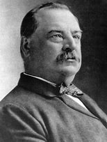
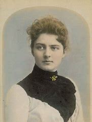

title:: 064 Grover Cleveland: Repeated

- ## 064 Grover Cleveland: Repeated
- ## pure
  collapsed:: true
	- VOA Learning English presents America's Presidents.
	- Today we are talking about Grover Cleveland. When Americans remember him, it is mostly because he makes writing presidential timelines difficult. Cleveland was the nation's 22nd president, and also its 24th.
	- He remains the only U.S. president to date whose second term did not immediately follow the first.
	- Cleveland is also notable because of his personal life, and because he held office during one of the country's worst economic crises.
	- ## Early life
	- Stephen Grover Cleveland was born in the northeastern state of New Jersey and grew up mostly in New York. He was a middle child in a family of nine children. His father was a minister, and the family did not have much money.
	- As a result, Cleveland had little formal education. He was one of the few presidents who did not go to college. But he was able to become a lawyer. He earned enough money and developed a good professional image.
	- In time, he became a sheriff, a mayor, and the governor of the state of New York.
	- In his early life, Cleveland did not marry and have children. Instead, he had many friends, with whom he enjoyed hunting, fishing, and eating and drinking in restaurants.
	- But Cleveland did have a relationship with a widow named Maria Halpin. She became pregnant and said Cleveland was the baby's father.
	- Cleveland said he was not sure if he was. However, he gave the child some financial support, the name of one of his closest friends, and his own family name. The child was called Oscar Folsom Cleveland.
	- Shortly after the boy was born, his mother was sent to an institution for the mentally unstable. Doctors quickly confirmed that her mental health was fine, but her son was taken from her and raised by another family.
	- The story about Halpin and the child became an issue in the election of 1884. The Democratic Party had nominated Cleveland as their candidate for president.
	- In general, voters liked his message of limiting federal spending, reducing the power of wealthy interests, and stopping political corruption. Some called him "Grover the Good."
	- But Cleveland's opponents said his history with Maria Halpin showed that he was an immoral man. At anti-Cleveland rallies, Republicans chanted, "Ma, ma, where's my Pa?" Pa is another word for father.
	- But Cleveland did not comment much on the matter. His defenders said Cleveland's honesty as a public official was more important than his bad judgment as a private citizen.
	- Voters seemed to agree. Cleveland narrowly won the election. His supporters answered the Republicans' chants of "where's my Pa?" by saying, "Gone to the White House, ha, ha, ha!"
	- ## First presidential term
	- Grover Cleveland's presidency was unusual because he did not want to use the office to propose laws. Instead, he mostly aimed to keep the federal government operating efficiently. He also wanted to limit lawmakers' power to help special interest groups.
	- As a result, Cleveland vetoed many bills in his first term. He set a record at that time for saying no to proposals from Congress.
	- One of the few ideas that he supported was reducing tariffs.
	- Many of his fellow Democrats liked that idea, too. But a number of Republicans did not. In the next election, their candidate, Benjamin Harrison, defeated Cleveland.
	- Cleveland returned to being a lawyer in New York.
	- In 1892, Cleveland was chosen to run against Benjamin Harrison again. The tariff issue returned: the Republicans' protective tariffs had hurt some industries, and voters answered this time by voting Harrison out of office.
	- Cleveland returned to the White House. But this time he was not alone.
	- ## White House Wedding
	- Two years into his first term as president, Cleveland married the daughter of his close friend, Oscar Folsom.
	- The bride's name was Frances Folsom. She was 21 years old at the time. The president was 49.
	- Cleveland was not the first president to get married while in office. But he was the first one to be married in the White House.
	- The event captivated the public. What's more, Americans adored the new first lady. She was known for being social, charming, and beautiful. Historians conclude that she was the most popular first lady since Dolley Madison. She remains the youngest.
	- ## Second presidential term
	- When the Clevelands returned to the White House, the country was entering a severe economic recession. Some of the country's biggest businesses were failing, including a railroad and many banks.
	- As a result, investors withdrew their money from the stock market. The withdrawal caused many other businesses to fail. The series of events is known as the Panic of 1893.
	- Soon, more and more Americans were out of work. Many could not afford houses or food. Some begged President Cleveland to intervene. But he declined. He did not think it was the role of the federal government to create jobs in order to reverse the depression.
	- However, Cleveland did use the power of the federal government to intervene during a famous labor strike. In that event, workers in Chicago who helped keep the trains operating walked out of their jobs. They were protesting a major decrease in their pay that did not include a decrease in their living expenses.
	- Since the owner of the company also controlled the price of housing and food, workers appealed to him to treat them more fairly. But the company owner refused even to meet with the workers.
	- Soon, the workers' boycott grew. Workers at other railyards stopped working. Farmers could not get their goods to market, and others could not get the supplies they needed. Even the mail stopped being delivered.
	- So Cleveland sent federal troops to break the strike.
	- In the short term, Cleveland's actions worked. The trains moved again, and both the courts and most of the public agreed with the president's decision.
	- But in the long term, Cleveland's handling of the panic, depression, and workers' strike lost the support of many voters. At the next opportunity, they voted him out of the White House again.
	- ## Cleveland's Legacy
	- Cleveland returned to New York, and later settled in a large house in Princeton, New Jersey.
	- There, he wrote, made speeches, sat on corporate boards, became a trustee of Princeton University and enjoyed the respect of the people who lived in the town.
	- He died at age 71 of problems with his stomach, heart, and kidneys. Several people said his final words were, "I have tried so hard to do right."
	- Then and now, many people agreed with that idea. Cleveland was generally an honest man who worked hard and tried to act independently as president.
	- But he is not considered one of America's best leaders. He did not have a clear idea about how to guide the country.
	- Yet the opposing party, at least, may have considered Cleveland's presidency a success. After Cleveland's final election defeat, six of the next seven presidents were Republicans.
- ---
- ## def
	- VOA Learning English presents America's Presidents.
	- Today we are talking about Grover Cleveland. When Americans remember him, it is mostly because /he makes writing presidential timelines difficult. Cleveland was the nation's 22nd president, and also its 24th.
		- id:: 625fac38-8d86-42ef-8fa4-cee6da4aa98f
		  > ▶ Grover Cleveland
		  
		- 美国人记得他，主要是因为他让写总统时间表变得困难。克利夫兰是美国第22任总统，也是第24任总统。
	- He remains the only U.S. president to date /whose second term /did not immediately follow the first.
	- Cleveland is also notable /because of his personal life, and because he held office /during one of the country's worst economic crises.
	- ## Early life
	- Stephen Grover Cleveland /was born /in the northeastern state of New Jersey /and grew up mostly in New York. He was a middle child /in a family of nine children. His father was a minister, and the family did not have much money.
		- > ▶ minister (n.) in some Protestant Christian Churches 某些新教教会的 ) a trained religious leader 牧师 
		  /( often Minister ) ( BrE ) (in Britain and many other countries) a senior member of the government who is in charge of a government department or a branch of one （英国及其他许多国家的）部长，大臣
	- As a result, Cleveland had little formal education. He was one of the few presidents /who did not go to college. But he was able to become a lawyer. He earned enough money /and developed a good professional image.
	- In time, he became a sheriff, a mayor, and the governor of the state of New York.
		- > ▶ sheriff (n.)(in the US) an elected officer /responsible for keeping law and order /in a county or town 县治安官，城镇治安官（美国民选地方官员）
	- In his early life, Cleveland did not marry and have children. Instead, he had many friends, with whom /he enjoyed hunting, fishing, and eating and drinking in restaurants.
	- But Cleveland did have a relationship with a widow /named Maria Halpin. She became pregnant /and said Cleveland was the baby's father.
	- Cleveland said /he was not sure if he was. However, he gave the child some financial support, the name of one of his closest friends, and his own family name. The child was called Oscar Folsom Cleveland.
		- 用了他最亲密朋友的名字, 和他自己的姓氏
	- Shortly after the boy was born, his mother was sent to an institution /for the mentally unstable. Doctors quickly confirmed that /her mental health was fine, but her son was taken from her /and raised by another family.
	- The story about Halpin and the child /became an issue /in the election of 1884. The Democratic Party /had nominated Cleveland as their candidate for president.
	- In general, voters liked his message /of limiting **federal spending**, reducing the power of **wealthy interests**, and stopping **political corruption**. Some called him "Grover the Good."
		- 总的来说，选民们喜欢他关于限制联邦开支、减少富有利益集团的权力、制止政治腐败的(演讲)信息要旨。有人称他为“格罗弗大善人”。
	- But Cleveland's opponents said /his history with Maria Halpin /showed that /he was an immoral man. At anti-Cleveland rallies, Republicans chanted, "Ma, ma, where's my Pa?" Pa is another word for father.
		- > ▶ chant (v.)to sing or shout the same words or phrases many times 反复唱；反复呼喊
	- But Cleveland did not **comment** much **on** the matter. His defenders said /`主` Cleveland's honesty /as a public official /`系` **was more important than** his bad judgment /as a private citizen.
		- 克利夫兰作为一名公职人员的诚实, 比他作为一名私人公民所作出的错误判断, 更重要。
	- Voters seemed to agree. Cleveland narrowly won the election. His supporters /answered the Republicans' chants of "where's my Pa?" by saying, "Gone to the White House, ha, ha, ha!"
		- 他的支持者回应共和党人“我爸爸在哪里?”的口号时说，“去白宫了，哈哈哈!”
	- ## First presidential term
	- Grover Cleveland's presidency /was unusual /because he did not want to use the office /to propose laws. Instead, he mostly aimed /to keep the federal government operating efficiently. He also wanted to limit lawmakers' power /to help special interest groups.
	- As a result, Cleveland vetoed many bills /in his first term. He set a record /at that time /for **saying no to** proposals from Congress.
	- One of the few ideas /that he supported /was reducing tariffs.
	- Many of his fellow Democrats /liked that idea, too. But a number of Republicans did not. In the next election, their candidate, Benjamin Harrison, defeated Cleveland.
		- > ▶ fellow  [ usually pl. ] a person that you work with or that is like you; a thing that is similar to the one mentioned 同事；同辈；同类；配对物
	- Cleveland returned /to being a lawyer in New York.
	- In 1892, Cleveland was chosen to run against Benjamin Harrison again. The tariff issue returned: the Republicans' protective tariffs /had hurt some industries, and voters answered /this time /by voting Harrison out of office.
	- Cleveland returned to the White House. But this time /he was not alone.
	- ## White House Wedding
	- Two years /into his first term as president, Cleveland married the daughter of his close friend, Oscar Folsom.
	- The bride's name /was Frances Folsom. She was 21 years old /at the time. The president was 49.
	- Cleveland was not the first president /to get married /while in office. But he was the first one /to be married in the White House.
		- 克利夫兰并不是第一个在任期间结婚的总统。但他是第一个在白宫结婚的人。
	- The event /captivated the public. What's more, Americans adored the new first lady. She was known for being social, charming, and beautiful. Historians conclude that /she was the most popular first lady /since Dolley Madison. She remains the youngest.
		- > ▶  Frances Folsom
		  
		- > ▶ captivate [ VN ] [ often passive ] to keep sb's attention /by being interesting, attractive, etc. 迷住；使着迷
	- ## Second presidential term
	- When the Clevelands returned to the White House, the country was entering a severe economic recession. Some of the country's biggest businesses /were failing, including a railroad and many banks.
	- As a result, investors **withdrew** their money **from** the stock market. The withdrawal /caused many other businesses to fail. The series of events /is known as the Panic of 1893.
	- Soon, more and more Americans /were out of work. Many could not afford houses or food. Some begged President Cleveland /to intervene. But he declined. He did not think /it was the role of the federal government /to create jobs /in order to reverse the depression.
		- ((6230164d-c724-44bd-bb13-1aa531300c9d))
		- > ▶ decline (v.) ( formal ) to refuse politely to accept or to do sth 谢绝；婉言拒绝 SYN refuse /[ V ] to become smaller, fewer, weaker, etc. 减少；下降；衰弱；衰退
	- However, Cleveland did use the power of the federal government /to intervene /during a famous labor strike. In that event, workers in Chicago /who helped keep the trains operating /**walked out of** their jobs. They were protesting a major decrease /in their pay /that did not include a decrease /in their living expenses.
		- > ▶ **walk out (on sth)** : ( informal ) to stop doing sth that you have agreed to do before it is completed 半途而废；半截撂挑子
		  -> I never walk out on a job half done. 我做工作从不半途而废。
		  ▶ **walk out** : ( informal ) ( of workers 工人 ) to stop working in order to go on strike （离开岗位）罢工
		  ▶ **walk out (of sth)** : to leave a meeting, performance, etc. suddenly, especially in order to show your disapproval 突然离去，退场，退席（尤为表示异议）
		- 帮助维持火车运行的芝加哥工人, 罢工了。他们抗议工资大幅下降，但生活费用却没有同时也下降。
	- Since the owner of the company /also controlled the price of housing and food, workers appealed to him /to treat them more fairly. But the company owner /refused even to meet with the workers.
	- Soon, the workers' boycott grew. Workers at other railyards /stopped working. Farmers could not get their goods to market, and others could not get the supplies they needed. Even the mail /stopped being delivered.
		- > ▶ boycott (n.)(v.)[ VN ] to refuse to buy, use or take part in sth as a way of protesting 拒绝购买（或使用、参加）；抵制
		- > ▶ railyard n. 铁路站场
	- So Cleveland sent federal troops /to break the strike.
	- In the short term, Cleveland's actions worked. The trains moved again, and **both** the courts /**and** most of the public /agreed with the president's decision.
		- > ▶ court [ CU ] the place where legal trials take place and where crimes, etc. are judged 法院；法庭；审判庭
	- But in the long term, Cleveland's handling /of the panic, depression, and workers' strike /lost the support of many voters. At the next opportunity, they voted him out of the White House again.
		- > ▶ handling (n.) the way that sb deals with or treats a situation, a person, an animal, etc. （形势、人、动物等的）处理，对付，对待 
		  /the action of organizing or controlling sth 组织；控制；管理
	- ## Cleveland's Legacy
	- Cleveland returned to New York, and later /settled in a large house in Princeton, New Jersey.
	- There, he wrote, made speeches, sat on **corporate boards**, became a trustee of Princeton University /and enjoyed the respect of the people /who lived in the town.
		- > ▶ trustee (n.)a person or an organization /that has control of money or property /that has been put into a trust for sb （财产的）受托人 
		  /a member of a group of people /that controls the financial affairs /of a charity or other organization （慈善事业或其他机构的）受托人
		- 在那里，他写作、发表演讲、担任公司董事会成员、成为普林斯顿大学的受托人，并受到镇上居民的尊敬。
	- He died /at age 71 /of problems with his stomach, heart, and kidneys. Several people said /his final words were, "I have tried so hard /to do right."
		- 他的遗言是:“我一直在努力做正确的事。”
	- Then and now, many people agreed with that idea. Cleveland was generally an honest man /who worked hard /and tried to act independently as president.
	- But he is not considered /one of America's best leaders. He did not have a clear idea about /how to guide the country.
		- 过去和现在，很多人都同意这个观点。克利夫兰通常是一个诚实的人，他工作努力，并试图作为总统独立行事。但他并不被认为是美国最好的领导人之一。他对如何领导这个国家没有一个清晰的概念。
	- Yet the opposing party, at least, may have considered /Cleveland's presidency 宾补 a success. After Cleveland's final election defeat, six of the next seven presidents /were Republicans.