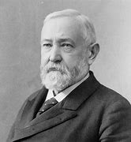
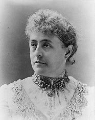
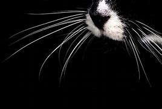

title:: 065 Benjamin Harrison: Grandson

- ## 065 Benjamin Harrison: Grandson
- ## pure
  collapsed:: true
	- VOA Learning English presents America's Presidents.
	- Today we are talking about Benjamin Harrison.
	- His family name may sound familiar. That is because he was the grandson of President William Henry Harrison. That situation is unique in U.S. history so far.
	- Harrison played an unusually active role as president at a time when most chief executives saw themselves as simply administrators. As a result, American writer and intellectual Henry Adams said Harrison was the best president since Lincoln.
	- But most Americans remember little about him, except his connection to the previous President Harrison, who himself died after only a month in office.
	- ## Early life
	- Benjamin Harrison grew up on a farm in the Midwestern state of Ohio as one of eight children.
	- His grandfather was not the only famous political Harrison.
	- His great-grandfather signed the Declaration of Independence. And his father had been a congressman.
	- Young Benjamin Harrison respected these men and believed he had a role to play in history, too. He received a good education, and even outside of school he read many books.
	- His hard work and intelligence carried him to Miami University in Ohio, and then to a career as a lawyer.
	- Along the way, he married a woman he had known since he was a teenager, Caroline Lavinia Scott. The couple settled in another Midwestern city, Indianapolis, Indiana, and had a son and daughter.
	- Over time, Harrison steadily built a career as a public official. But his political path was interrupted by the American Civil War.
	- Harrison rose to the rank of general in the Union Army. He fought under General William T. Sherman, and was one of the first soldiers to enter Atlanta, Georgia after the city surrendered.
	- After the war, he returned home to Indiana and continued his legal and political career. In 1881, he was elected to the U.S. Senate. But six years later he lost his seat when Democrats came to power in his state.Reports say that Harrison was an excellent soldier. But he did not enjoy fighting or find war romantic.
	- Harrison's loss of his Senate seat soon turned to a victory. The Republican Party nominated him as their candidate to run against Grover Cleveland in the 1888 presidential election.
	- Cleveland's economic policies had become unpopular, and Republicans worked hard to support their candidate. They succeeded. Although Cleveland won the popular vote, Harrison won the Electoral College.
	- In 1889, he followed his grandfather's footsteps all the way to the White House.
	- ## Presidency
	- Harrison's election was a major victory for his Republican Party. In addition to winning the White House, Republicans gained seats in the House of Representatives, held a majority in the Senate, and appointed several Republican justices to the Supreme Court.
	- Harrison and other Republican lawmakers used their power to take action on issues at home and internationally.
	- One act was to preserve forests. Harrison identified 17 protected natural areas, and helped create Yosemite National Park in California.
	- His government also established Ellis Island in New York to make immigration to the U.S. a more orderly process.
	- Internationally, Harrison's administration sought to build ties with Latin American countries. His government established what would, in time, become the Organization of American States.
	- His administration also increased the United States' global trade – as well as the country's navy.
	- But, for the most part, the most pressing issues of the day were economic. The federal government at that time had an unusually large surplus. Some argued that the surplus was hurting business. In answer, Harrison's government placed a high protective tariff on imported goods. The legislation was known as the McKinley Tariff of 1890.
	- Officials also aimed to limit the power of large corporations to control important markets in the U.S.
	- Finally, they agreed to require the government to buy silver to use as currency.
	- These actions pleased some of his supporters. But, they may have contributed to the severe economic depression that followed Harrison's term.
	- And in general, voters disapproved of the amount of money Republican lawmakers were spending. Although the country was at peace, the 51st Congress appropriated $1 billion. At the midterm elections, many lawmakers paid for all the spending with their seats.
	- Two years later, voters turned Harrison out of the White House, too. They returned Grover Cleveland to the presidency.
	- Harrison did not express much disappointment. He had worked hard to become president like his grandfather. But he found he did not like being the chief executive. He said when he left the White House, it was like being released from prison.
	- ## Legacy
	- Among U.S. presidents, Harrison does not have one of the most dramatic biographies. The facts of his life show an intelligent, disciplined man who tried to live by his beliefs.
	- But he was not considered passionate about many things, except perhaps his enjoyment of nature. And he did not have an easy way with people. Even his staff called him "the human iceberg" because he could be aloof and act coldly toward people.
	- Yet Harrison's family brought some warmth to his administration. His wife, Caroline, was known to be a lively, social person. She was the first to install a Christmas tree in the White House.
	- Some of Harrison's grandchildren also lived in the White House. Harrison permitted them to play on the grounds with their pet animals. During Harrison's term, the family kept a goat, which the children called "Old Whiskers."
	- Harrison's time in the White House saw sorrow, too. Toward the end of her husband's term, the first lady became seriously ill with tuberculosis. For months, Benjamin Harrison divided his attention between his wife and his job, and yet in the end lost both.
	- After his term as president ended, Benjamin Harrison returned to his home in Indianapolis. He did some work as a teacher and lawyer, and kept a good public image in his community.
	- He also re-married. His second wife was a widow herself, as well as his first wife's niece.
	- He and Mary Scott Lord Dimmick Harrison had a daughter together. The child was only four when Harrison died from pneumonia at age 67.
- ---
- ## def
	- VOA Learning English presents America's Presidents.
	- Today we are talking about Benjamin Harrison.
		- > ▶ Benjamin Harrison
		  
	- His **family name** /may sound familiar. That is because /he was the grandson of President William Henry Harrison. That situation is unique /in U.S. history so far.
		- > ▶ family name : the part of your name that shows which family you belong to 姓
		- > ▶ unique (a.) being the only one of its kind 唯一的；独一无二的 /very special or unusual 独特的；罕见的
		  /~ (to sb/sth) belonging to or connected with one particular person, place or thing （某人、地或事物）独具的，特有的
	- Harrison played an unusually active role /as president /at a time /when most chief executives saw themselves as simply administrators. As a result, American writer and intellectual(n.) Henry Adams said /Harrison was the best president /since Lincoln.
		- > ▶ intellectual (a.)(n.) a person who is well educated and enjoys activities in which they have to think seriously about things 知识分子；脑力劳动者
		- 哈里森在担任总统期间, 发挥了异常积极的作用，而当时大多数首席执行官, 只把自己视为管理者。因此，美国作家、知识分子亨利·亚当斯说, 哈里森是自林肯以来最好的总统。
	- But most Americans /remember(v.) little about him, except his connection to the previous President Harrison, who himself died /after only a month in office.
		- 哈里森上任仅一个月后就去世了。
	- ## Early life
	- Benjamin Harrison grew up on a farm /in the Midwestern state of Ohio /as one of eight children.
	- His grandfather was not the only famous political Harrison.
	- His great-grandfather /signed **the Declaration of Independence**. And his father had been a congressman.
		- > ▶ great-grandfather n. 曾祖父
	- Young Benjamin Harrison /respected these men /and believed /he had a role to play in history, too. He received a good education, and even outside of school /he read many books.
	- His hard work and intelligence /carried him to Miami University in Ohio, and then /to a career as a lawyer.
	- Along the way, he married a woman /he had known /since he was a teenager, Caroline Lavinia Scott. The couple /settled in another Midwestern city, Indianapolis, Indiana, and had a son and daughter.
		- > ▶  Caroline Lavinia Scott
		  
		- Along the way 在这个过程中, 一路上
	- Over time, Harrison steadily built a career /as a public official. But his political path /was interrupted /by the American Civil War.
		- > ▶ Over time 随着时间的过去, 久而久之
	- Harrison **rose to** the rank of general /in the Union Army. He fought /under General William T. Sherman, and was one of the first soldiers /to enter Atlanta, Georgia /after the city surrendered.
		- 他是在佐治亚州亚特兰大投降后, 第一批进入亚特兰大的士兵之一。
	- After the war, he **returned home to** Indiana /and continued his legal and political career. In 1881, he was elected to the U.S. Senate. But six years later /he lost his seat /when Democrats came to power /in his state.Reports say that /Harrison was an excellent soldier. But he did not enjoy fighting /or find(v.) war romantic.
		- 他回到印第安纳州的家乡，继续他的法律和政治生涯。... 但他不喜欢打仗，也不觉得战争浪漫。
	- Harrison's loss of his Senate seat /soon turned to a victory. The Republican Party /nominated him as their candidate /to run against Grover Cleveland /in the 1888 presidential election.
	- Cleveland's economic policies /had become unpopular, and Republicans /worked hard to support their candidate. They succeeded. Although Cleveland won **the popular vote**, Harrison won **the Electoral College**.
		- > ▶ popular vote 普选；直接投票, 选民票
		- id:: 6260af7c-cb61-4a69-8778-b87a59fbc12f
		  > ▶ electoral  (a.) [ only before noun ] connected with elections 有关选举的
		  > ▶  **the Electoral College** :  (in the US) a group of people who come together to elect the President and Vice-President, based on the votes of people in each state 总统选举团（在美国由各州选民投票推选组成，集中在一起选举总统和副总统）
		- > ▶  Electoral College : **the Electoral College** (in the US) a group of people /who come together /to elect the President and Vice-President, based on the votes of people /in each state 总统选举团（在美国由各州选民投票推选组成，集中在一起选举总统和副总统）
		- 虽然克利夫兰赢得了普选，但哈里森赢得了选举团。
	- In 1889, he followed his grandfather's footsteps /all the way to the White House.
	- ## Presidency
	- Harrison's election /was a major victory /for his Republican Party. **In addition to** winning the White House, Republicans gained seats /in the House of Representatives, held a majority /in the Senate, and **appointed** several Republican justices /**to** the Supreme Court.
		- 哈里森的当选是他所在的共和党的一次重大胜利。除了赢得白宫，共和党人还在众议院增加了席位，在参议院占多数，并任命了几名共和党人担任最高法院法官。
	- Harrison and other Republican lawmakers /used their power /to take action /on issues at home and internationally.
	- One act was /to preserve forests. Harrison identified 17 **protected natural areas**, and helped create **Yosemite National Park** in California.
		- 一项行动是保护森林。哈里森确定了17个受保护的自然区域，并帮助建立了加州的约塞米蒂国家公园。
	- His government /also established Ellis Island in New York /to make immigration to the U.S. /a more orderly process.
		- 他的政府还在纽约建立了埃利斯岛，使移民到美国的过程, 更加有序。
	- Internationally, Harrison's administration /sought **to build ties /with** Latin American countries. His government established what would, in time, become **the Organization of American States**.
		- 在国际上，哈里森政府寻求与拉丁美洲国家建立联系。他的政府建立了后来成为美洲国家组织的组织。
	- His administration also increased **the United States' global trade** – as well as the country's navy.
		- 他的政府还增加了美国的全球贸易，以及该国的海军。
	- But, for the most part, **the most pressing issues** of the day /were economic. The federal government /at that time /had an unusually large surplus. Some argued that /the surplus was hurting business. In answer, Harrison's government /**placed** a high protective tariff /**on** imported goods. The legislation was known as /the McKinley Tariff of 1890.
		- id:: 6260b123-a67a-4a08-907c-4c629b36394c
		  > ▶ surplus (n.)(a.) an amount /that is extra or more than you need 过剩；剩余；过剩量；剩余额 
		  /the amount /by which the amount of money received /is greater than the amount of money spent 盈余；顺差
		  -> a trade surplus of ￡400 million 4亿英镑的贸易盈余
		  **(a.) ~ (to sth)** more than is needed or used 过剩的；剩余的；多余的
		  -> These items /are surplus(a.) to requirements (= not needed) . 这几项不需要。
		- 但是，在大多数情况下，当时最紧迫的问题是经济问题。当时联邦政府有异常庞大的盈余。一些人认为，贸易顺差损害了商业。作为回应，哈里森政府对进口商品征收了高额的保护性关税。这项立法被称为1890年的麦金利关税。
	- Officials also aimed to limit /**the power** of large corporations /**to control** important markets in the U.S.
		- 官员们还旨在限制大公司控制美国重要市场的权力
	- Finally, they agreed /to require the government /to buy silver /to use as currency.
		- 他们同意要求政府购买白银, 作为货币使用。
	- These actions /pleased some of his supporters. But, they may have contributed to the severe economic depression /that followed Harrison's term.
	- And in general, voters **disapproved of** the amount of money /Republican lawmakers were spending. Although the country was at peace, the 51st Congress /appropriated $1 billion. At the midterm elections, many lawmakers /paid for all the spending /with their seats.
		- > ▶ appropriate (v.) to take sth, sb's ideas, etc. for your own use, especially illegally or without permission 盗用；挪用；占用；侵吞
		  /**~ sth (for sth)** : to take or give sth, especially money for a particular purpose 拨（专款等）
		  => 前缀ap-同ad-. proper, 自己的，合适的。该单词含两个意思: 1. 适合自己的。2. 占为己有的。
		- 总的来说，选民不赞成共和党议员的开支。尽管国家处于和平状态，第51届国会还是拨款10亿美元。在中期选举中，许多议员用他们的席位支付了所有开支。
	- Two years later, voters /turned Harrison out of the White House, too. They **returned** Grover Cleveland **to** the presidency.
	- Harrison did not express much disappointment. He had worked hard /to become president /like his grandfather. But he found /he did not like being the chief executive. He said /when he left the White House, it was like /being released from prison.
	- ## Legacy
	- Among U.S. presidents, Harrison does not have one of the most dramatic biographies. The facts of his life /show an intelligent, disciplined man /who tried to live by his beliefs.
		- > ▶ biography (n.)the story of a person's life written by sb else; this type of writing 传记；传记作品
		  => 词根bio, 生命。词根graph, 写。
	- But he was not considered **passionate about** many things, except perhaps his enjoyment of nature. And he did not **have an easy way with** people. Even his staff called him "the human iceberg" /because he could be aloof(a.) /and act coldly toward people.
		- > ▶ aloof  (a.) [ not usually before noun ] not friendly or interested in other people 冷漠；冷淡
		   ▶  **KEEP/HOLD (YOURSELF) ALOOF(a.) | REMAIN/STAND ALOOF(a.)**
		  to not become involved in sth; to show no interest in people 不参与；远离；无动于衷；漠不关心
		  => 来自航海术语。前缀a-同ad-. loof, 风向标。指迎船头向风以避开礁石，后指偏离，疏远。
		- 人们认为他对许多事情都没有热情，也许除了他对大自然的享受。他和人相处并不容易。他的工作人员甚至称他为“人类冰山”，因为他对人很冷漠。
	- Yet Harrison's family /**brought** some warmth **to** his administration. His wife, Caroline, was known to be a lively, social person. She was the first /to install a Christmas tree /in the White House.
	- Some of Harrison's grandchildren /also lived in the White House. Harrison permitted them /to play on the grounds /with their pet animals. During Harrison's term, the family /kept a goat, which the children called "Old Whiskers."
		- > ▶ whisker : (n.) any of the long stiff hairs /that grow near the mouth of a cat, mouse, etc. （猫、鼠等的）须
		  /whiskers [pl.] (old-fashioned or humorous) the hair growing on a man's face, especially on his cheeks and chin 络腮胡子；连鬓胡子
		  
	- Harrison's time /in the White House /saw sorrow, too. Toward the end of her husband's term, the first lady /became seriously ill with tuberculosis. For months, Benjamin Harrison /divided his attention /between his wife and his job, and yet in the end /lost both.
		- ((625654f2-dbb1-4f56-bd93-110e38153f4d))
		- 哈里森在白宫的日子里也经历了悲伤。在丈夫任期快结束时，第一夫人得了严重的肺结核。几个月来，本杰明·哈里森(Benjamin Harrison)把注意力分散在妻子和工作上，但最终两者都失去了。
	- After his term as president ended, Benjamin Harrison /returned to his home in Indianapolis. He did some work /as a teacher and lawyer, and kept a good public image /in his community.
	- He also re-married. His second wife /was a widow herself, as well as his first wife's niece.
		- 同时也是他第一任妻子的侄女。
	- He and Mary Scott Lord Dimmick Harrison /had a daughter together. The child was only four /when Harrison died from pneumonia at age 67.
- ---
- Benjamin Harrison
	- 是美国政治家兼律师，于1889至1893年出任第23任美国总统。他的祖父威廉·亨利·哈里森是第九任美国总统，两人是美国历史上仅有的爷孙总统。他的曾祖父本杰明·哈里森五世是美国开国元勋，曾签署《独立宣言》。
	- 美国在他担任总统期间, 通过许多史无前例的经济法案. 如:
		- 麦金莱关税的保护主义税率, 创历史新高.
		- 还有开创反垄断法先河的《休曼反垄断法》。
		- 他任内通过的《1891年土地修订法》所附修正案, 还推动建立国家森林保护区。
	- 哈里森担任总统期间，共六个西部新州加入联邦. 他还令美国海军朝现代化方向大步迈进，实力显著提升。哈里森实施积极外交政策.
	- 哈里森任内的联邦政府开支, 首次突破十亿美元大关，其中大部分来自保护主义关税收入。开支问题, 一定程度上导致共和党在1890年中期选举失利. 而且高关税和高联邦支出渐失民心，哈里森也在1892年美国总统选举中, 不敌克利夫兰。下台后回到印第安纳波利斯继续当律师.
	-
	- 公务员改革
	  collapsed:: true
		- 公务员改革是哈里森上台后的重要议题。哈里森竞选期间支持绩效制，反对 Spoils system (猎官制)。
			- > ▶ spoil : (n.) **the spoils** [ pl. ] ( formal ) ( literary ) goods /taken from a place /by thieves /or by an army /that has won a battle or war 赃物；战利品；掠夺物
			  /spoils [ pl. ] the profits or advantages that sb gets /from being successful 成功所带来的好处；权力地位的连带利益
			  -> the spoils of high office 身居高位的连带利益
			  => 来自拉丁语 spoliare,抢劫，打劫，剥落，剥除衣服，来自 spolium,战利品，原义为剥皮，来 自 PIE*spel,分开，劈开，词源同 spill,split.引申词义破坏，糟蹋等，后用于指家长对小孩的 溺爱，娇惯，纵容，即糟蹋小孩。
			- Spoils system , "猎官制"，又称"分赃制度"，**就是在选举获胜, 新党上任后, 新党把原来中央和地方的公务员, 都替换成自己人.**
			- 到后来, 猎官制的缺点愈来愈严重与明显，美国国会因此于1883年, 通过<彭德尔顿法案>，确定了文官职位, 是由"公开竞争性考试,  来择优录取"的原则。大多数联邦政府职位, 最终都适用该法，"猎官制"后来只限于少数联邦政府职位。
			- **spoils system**, also called **patronage system**, practice /in which `主` the political party winning an election /`谓` rewards its campaign workers /and other active supporters /by appointment to government posts /and with other favours.
				- > ▶ patronage /ˈpætrənɪdʒˌˈpeɪtrənɪdʒ/ (n.)**the support**, especially **financial**, that is given to a person or an organization /by a patron 资助；赞助
				  /**the system** /by which an important person gives help or a job to sb /in return for their support （掌权者给予提挈以换取支持的）互惠互利
			- The spoils system /involves political activity /by public employees /in support of their party /and the employees’ removal from office /if their party loses the election. `主` A change /in **party control** of government /`谓` necessarily **brings** new officials **to** high positions /carrying political responsibility, but **the spoils system** extends personnel turnover /**down to** routine(a.) or subordinate(a.) governmental positions.
				- > ▶  public employee 公职人员, 公共雇员
				- > ▶ subordinate  /səˈbɔːdɪnət/ (n.) a person who has a position with less authority and power than sb else in an organization 下级；部属
				  /(a.)~ (to sb) having less power or authority than sb else in a group or an organization 隶属的；从属的；下级的
				  => sub-,在下，-ordin,安排，顺序，词源同 order,ordinary.引申词义隶属的，从属的。
				- 分赃制度, 将人事变动, 延伸到了日常或下级的政府职位中。
		- 《彭德尔顿公务员改革法》已经规定部分公务员人事制度，但哈里森上任后第一个月的大部分时间还是用于拍板政治任命。
		-
	- 养老金
	  collapsed:: true
		- 哈里森在国会时, 就开始倡导的南北战争老兵养老金, 在他当上总统后，终于落实. Dependent and Disability Pension Act 于1890年颁布。该法向无论因何致残的内战老兵, 提供抚恤金，把联邦预算盈余耗尽。
		-
	- 关税
		- 高关税产生财政盈余.
			- -> 许多民主党人和越来越多的民粹主义者, 呼吁降低关税。
			- -> 但大部分共和党人, 倾向保持税率，把盈余资金用于境内改进，取消部分国内税。
		- 众议员威廉·麦金莱, 拟定法案, 后通过成为法律, 即1890年关税法案**(麦金莱关税), 对进口的平均税收上调近百分之五十，旨在保护国内产业免受外国竞争。但关税导致进口商品价格飞涨，许多选民因此转投改革阵营。**
		- 麦金莱关税于1894年被"威尔逊-戈尔曼关税法案"所取代，新法案及时降低了关税税率。
-