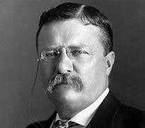
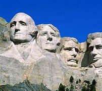
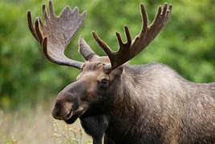
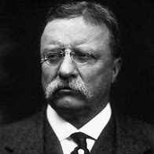

title:: 067 Theodore Roosevelt: Energetic

- ## 067 Theodore Roosevelt: Energetic
- ## pure
  collapsed:: true
	- VOA Learning English presents America's Presidents.
	- Today we are talking about Theodore Roosevelt, the 26th president of the United States.
	- Many Americans like to call him "Teddy" Roosevelt or even "T.R." These nicknames for the president show that Roosevelt was, in general, popular with the public. He is one of the four presidents whose face can be seen on Mount Rushmore, a memorial to famous U.S. leaders.
	- Historians note that Roosevelt's term in office marks the beginning of the modern presidency. In other words, he expanded the position, and used the media to connect with the public.
	- Among Americans, his public image is often linked to youth, energy, strength, courage, and playfulness. But his image has also been linked to a strong liking for military action – and for oneself.
	- ## Early life
	- Theodore Roosevelt is also often tied to the American West, but he was born and raised on the East Coast, in New York City. His father was a wealthy businessman. His mother was from a Southern planter family that owned slaves.
	- Theodore Roosevelt had two sisters and a brother. His family called him by another nickname: Teedie.
	- When he was a boy, young Theodore was often sick. He had asthma, a lung condition that could make physical activity difficult.
	- So, as he got older, Roosevelt strengthened his body. For the rest of his life, he strongly believed in physical exercise and vigorous activity – what he called "the strenuous life."
	- Young Roosevelt also had hunger for learning. He studied with private tutors, traveled overseas, and studied many subjects while in college at Harvard.
	- After his college years, he studied law briefly, and then began serving in public office in New York.
	- But tragedy halted his early government service.
	- Roosevelt had married Alice Hathaway Lee, who soon became pregnant.
	- But two days after the baby was born, Roosevelt's wife died of kidney disease.
	- And, as it happened, Roosevelt's mother died on the same day, in the same house. She suffered from Bright's Disease, another disorder affecting the kidneys.
	- The future president was struck by grief. He left his baby daughter with his sister and went to the American West. There, Roosevelt lived as a cowboy – hunting, riding horses, taking part in cattle drives, and even chasing people who broke the law. The experience helped define Roosevelt's life and beliefs.
	- But after two years, he was ready to return to the East Coast. There, he married Edith Kermit Carow, a woman he had known since childhood. They settled in a house on Long Island, New York and raised Roosevelt's daughter, Alice. He and Edith also had five other children.
	- His family supported Roosevelt's rise in Republican Party politics, including his campaign to become governor of New York.
	- But some of the party officials were not happy with Roosevelt. They did not like his independence, and they did not want him to be re-elected as governor. So, they plotted to have him nominated as U.S. vice president in the election of 1900. They believed Roosevelt would not be able to give them much trouble in that position.
	- As the Republican leaders hoped, Roosevelt and the sitting president, William McKinley, won both the popular and electoral vote in a landslide.
	- But less than a year later, McKinley was dead.
	- And with that, Republican leaders found that the man they wanted to get out of their way was now the country's 26th president.
	- ## Presidency
	- When he became president, Roosevelt was only 42 years old. He is still the youngest person to hold that office.
	- At first, Roosevelt promised to continue the policies of McKinley, who was, after all, the president voters had re-elected.
	- But Roosevelt quickly put his own mark on the presidency. He is known for trying to balance the needs of many groups in society, including business owners, farmers and workers.
	- Roosevelt called his program the "Square Deal." In other words, he suggested that everyone was treated fairly.
	- However, some Americans objected to Roosevelt reducing the power of big businesses. They said his use of government rules, in general, did not let market forces operate freely.
	- Roosevelt is also known for protecting the nation's wilderness areas. He set aside more than 800,000 square kilometers of land to protect nature and wildlife.
	- In his foreign policy, Roosevelt was energetic. He helped Panama win independence from Colombia in order to start building the Panama Canal. He also defended and even added to the Monroe Doctrine, an idea from the presidency of James Monroe.
	- Roosevelt confirmed that the United States would bar European powers from intervening in South America. And, more than that, that the U.S. would "police" the Western Hemisphere and make sure that countries honored their international obligations.
	- In other words, Roosevelt believed the United States had the right and responsibility to be a world power. If diplomatic negotiations did not work, he was not afraid to threaten the use of force. He famously said, "Speak softly and carry a big stick; you will go far."
	- Voters approved of Roosevelt's actions. Or, at least they enjoyed his leadership, and his young family that played all over the White House.
	- In 1904, Roosevelt easily won the presidency in his own right. He is the first vice president who took power after the death of a sitting president to earn his own term.
	- ## Legacy
	- Although he was permitted to seek another term as president, Roosevelt promised not to. He left the White House in 1909, still a very young man.
	- For a while, he traveled overseas. But when he returned home, he did not like the direction the new president and the Republican Party was going.
	- So Roosevelt created a new political group, called the Progressive Party – or, as some called it, the Bull Moose Party. Not surprisingly, the term "bull moose" was meant to suggest Roosevelt and his animal-like strength.
	- Although he earned many votes, Roosevelt did not win the 1912 election. Instead, he split the votes of the Republican Party, and permitted a Democrat to win the presidency.
	- Roosevelt's efforts were not entirely lost, however. Later presidents – including Franklin Roosevelt, Harry Truman, John Kennedy, and Lyndon Johnson – used many of his ideas for reform.
	- And, major U.S. political parties today often find lessons from Roosevelt's presidency they admire or support. Both Democrat Bill Clinton and Republican George W. Bush said Theodore Roosevelt was one of their role models.
	- In the years after the 1912 election, Roosevelt remained active. He traveled, campaigned, and continued to try to influence politics from his home in New York, where he died unexpectedly in his sleep at age 60.
	- One public official observed, "Death had to take Roosevelt sleeping, for if he had been awake, there would have been a fight."
- ---
- ## def
	- VOA Learning English presents America's Presidents.
	- Today we are talking about Theodore Roosevelt, the 26th president of the United States.
		- > ▶ Theodore Roosevelt
		  
	- Many Americans like to call him "Teddy" Roosevelt /or even "T.R." These nicknames for the president /show that /Roosevelt was, in general, popular with the public. He is one of the four presidents /whose face can be seen on Mount Rushmore, a memorial to famous U.S. leaders.
		- > ▶ Mount Rushmore
		  Rushmore 山名
		  
	- Historians note that /Roosevelt's term in office /marks the beginning of the modern presidency. In other words, he expanded the position, and used the media /to connect with the public.
	- Among Americans, his public image is often linked to youth, energy, strength, courage, and playfulness. But his image /has also been linked to a strong liking(n.) for military action – and for oneself.
		- > ▶ playfulness n. 玩笑；嬉闹
		- > ▶ liking (n.) ~ (for sb/sth) the feeling that you like sb/sth; the enjoyment of sth 喜欢；喜好；嗜好；乐趣 SYN fondness
		  -> He had a liking(n.) for fast cars. 他喜欢快车。
		- 但他的形象, 也与对军事行动以及对自己的强烈喜爱有关。
	- ## Early life
	- Theodore Roosevelt /is also often tied to the American West, but he was born and raised on the East Coast, in New York City. His father was a wealthy businessman. His mother was from a Southern planter family /that owned slaves.
	- Theodore Roosevelt had two sisters and a brother. His family called him /by another nickname: Teedie.
	- When he was a boy, young Theodore was often sick. He had asthma(n.), a lung condition /that could make physical activity difficult.
		- > ▶ asthma [ U ] a medical condition of the chest that makes breathing difficult 气喘；哮喘
		  => 来自希腊语，拟声词。
	- So, as he got older, Roosevelt strengthened his body. For the rest of his life, he strongly **believed in** physical exercise and vigorous activity – what he called "the strenuous(a.) life."
		- > ▶ strenuous  (a.) needing great effort and energy 费力的；繁重的；艰苦的 
		  /showing great energy and determination 劲头十足的；奋力的；顽强的
		  -> Avoid strenuous exercise /immediately after a meal. 刚吃完饭避免剧烈运动。
	- Young Roosevelt also had **hunger(n.) for** learning. He studied with private tutors, traveled overseas, and studied many subjects /while in college at Harvard.
		- > ▶ tutor :  a private teacher, especially one who teaches an individual student or a very small group 家庭教师；私人教师 /( NAmE ) an assistant lecturer in a college （大专院校的）助教
		- 年轻的罗斯福也渴望学习。他跟随私人导师学习
	- After his college years, he studied law briefly, and then began serving /in public office in New York.
	- But tragedy halted(v.) his early government service.
		- > ▶ halt (v.) to stop; to make sb/sth stop （使）停止，停下
	- Roosevelt had married Alice Hathaway Lee, who soon became pregnant.
	- But two days after the baby was born, Roosevelt's wife died of kidney disease.
	- And, as it happened, Roosevelt's mother died /on the same day, in the same house. She suffered from Bright's Disease, another disorder /affecting the kidneys.
		- > ▶ Bright's Disease N chronic inflammation of the kidneys; chronic nephritis 布赖特氏病; 慢性肾炎
		- ((6219af4a-8450-430f-9531-d28494e17c90))
	- The future president /was struck by grief. He **left** his baby daughter **with** his sister /and went to the American West. There, Roosevelt lived as a cowboy – hunting, riding horses, **taking part in** cattle drives, and even chasing people who broke the law. The experience /helped define(v.) Roosevelt's life and beliefs.
		- 未来的总统悲痛欲绝。他把襁褓中的女儿留给妹妹抚养，去了美国西部。在那里，罗斯福过着牛仔的生活——打猎、骑马、参加赶牛活动，甚至追赶触犯法律的人。这段经历塑造了罗斯福的人生和信仰。
	- But after two years, he was ready to return to the East Coast. There, he married Edith Kermit Carow, a woman /he had known since childhood. They settled in a house /on Long Island, New York /and raised Roosevelt's daughter, Alice. He and Edith /also had five other children.
	- His family /supported Roosevelt's rise /in Republican Party politics, including his campaign /to become governor of New York.
	- But some of the party officials /were not happy with Roosevelt. They did not like his independence, and they did not want him /to be re-elected as governor. So, they plotted /to have him nominated as U.S. vice president /in the election of 1900. They believed Roosevelt would not be able to give them much trouble /in that position.
		- > ▶ happy (a.) ~ (with/about sb/sth) : satisfied that sth is good or right; not anxious （对某人或事物）满意的，放心的
	- As the Republican leaders hoped, Roosevelt and the sitting president, William McKinley, won **both** the popular **and** electoral vote /in a landslide.
		- > ▶ sitting  现任的，在任期内的
	- But less than a year later, McKinley was dead.
	- And with that, Republican leaders found that /the man they wanted to get out of their way /was now the country's 26th president.
	- ## Presidency
	- When he became president, Roosevelt was only 42 years old. He is still the youngest person /to hold that office.
	- At first, Roosevelt promised /to continue the policies of McKinley, who was, after all, the president /voters had re-elected.
	- But Roosevelt quickly **put** his own mark /**on** the presidency. He is known for /trying to balance the needs of many groups in society, including business owners, farmers and workers.
	- Roosevelt called his program /**the "Square(a.) Deal."** In other words, he suggested that /everyone was treated fairly.
		- > ▶ square  (a.) 正方形的；四方形的 / fair or honest, especially in business matters （尤指在生意上）公平的，公正的，诚实的
		  -> a square deal 公平交易
		  -> Are you being square(a.) with me? 你对我是以诚相待吗？
		  => 它的前缀s-用于加强语气；词根quar来自拉丁词根quat、quad，表“四”；所以这个单词的根义是：“四”边形。掌握了它你就能很容易记住quarter（四分之一）了。同根词还有很多：quadrangle（四边形）、quadruped（四足动物）、quadrant（扇形体）等。
	- However, some Americans **objected(v.) to** Roosevelt /reducing the power of big businesses. They said /his use of government rules, in general, did not let market forces(n.) operate freely.
	- Roosevelt is also known /for protecting the nation's wilderness areas. He **set aside** more than 800,000 square kilometers of land /to protect nature and wildlife.
		- > ▶  set aside :  PHRASAL VERB If you set something aside /for a special use or purpose, you keep it available /for that use or purpose. 省出; 抽出
		  -> Some doctors advise /**setting aside a certain hour** each day /for worry. 
		   一些医生建议每天抽出一定时间思忧。
		  /PHRASAL VERB If you **set aside a belief, principle, or feeling**, you decide that you will not be influenced by it. 把…抛在脑后
		  •  He urged the participants /to set aside minor differences /for the sake of achieving peace. 
		   他敦促与会者把小分歧抛于脑后，以求实现和平。
	- In his foreign policy, Roosevelt was energetic. He helped Panama win(v.) independence from Colombia /in order to start building(v.) the Panama Canal. He also defended /and even **added to** the Monroe Doctrine, an idea /from the presidency of James Monroe.
		- ((6243cc60-8bee-4809-a76b-f8cc7f4c6bf5))
		- 他还为门罗主义辩护，甚至增加了门罗主义，门罗主义是詹姆斯·门罗总统时期提出的。
	- Roosevelt confirmed that /the United States would **bar** European powers /**from** intervening in South America. And, more than that, that /the U.S. would "police"(v.)  the Western Hemisphere /and make sure that /countries honored(v.) their international obligations.
		- > ▶ police (v.) ( of the police, army, etc. 警察、军队等 ) to go around a particular area /to make sure that /nobody is breaking the law there 巡查；维护治安
		  /( of a committee, etc. 委员会等 ) to make sure that /a particular set of rules /is obeyed 监督；管制
		- > ▶ honor (v.)~ sb (with sth) :to do what you have agreed or promised to do 信守，执行（承诺）
		  -> to honour a cheque (= to keep an agreement to pay it) 承兑支票
		  /to do sth that shows great respect for sb/sth 尊敬，尊重（某人）
		- 罗斯福证实，美国将禁止欧洲列强干预南美洲。更重要的是，美国将“监督”西半球，确保各国履行其国际义务。
	- In other words, Roosevelt believed /the United States had the right and responsibility /to be a world power. If **diplomatic negotiations** did not work, he was not afraid /to threaten the use of force. He famously said, "Speak softly /and carry a big stick; you will go far."
		- 换句话说，罗斯福认为美国有权利和责任成为一个世界强国。如果外交谈判不起作用，他不怕威胁使用武力。他有句名言:“轻声说话，手持大棒;你会走得很远的。”
	- Voters **approved of** Roosevelt's actions. Or, at least they enjoyed his leadership, and his young family /that played all over the White House.
		- 至少他们喜欢他的领导，喜欢他年轻的家庭在白宫的各个角落玩耍。
	- In 1904, Roosevelt easily won the presidency /**in his own right**. He is the first vice president /who took power /after the death of a sitting president /to earn his own term.
		- > ▶  **in your own right** :
		  because of your personal qualifications or efforts, not because of your connection with sb else 凭自身的资格（或努力）
		- 罗斯福凭借自己的实力轻松当选总统。他是第一位在现任总统去世后掌权, 并赢得自己任期的副总统。
	- ## Legacy
	- Although he was permitted /to seek another term as president, Roosevelt promised not to. He left the White House in 1909, still a very young man.
		- 虽然罗斯福被允许寻求连任，但他承诺不会这样做。
	- For a while, he traveled overseas. But when he returned home, he did not like the direction /the new president and the Republican Party was going.
	- So Roosevelt created a new political group, called the Progressive Party – or, as some called it, the Bull Moose Party. Not surprisingly, the term "bull moose" was meant to suggest Roosevelt and his animal-like strength.
		- > ▶ bull  公牛
		- > ▶ moose :  a large deer /that lives in N America. In Europe and Asia it is called an elk . 驼鹿（产于北美；在欧洲和亚洲称为麋鹿）
		  
		- 毫不奇怪，“公驼鹿”一词意在暗示罗斯福和他动物般的力量。
	- Although he earned many votes, Roosevelt did not win the 1912 election. Instead, he split the votes of the Republican Party, and permitted a Democrat to win the presidency.
	- Roosevelt's efforts /were not entirely lost, however. Later presidents – including Franklin Roosevelt, Harry Truman, John Kennedy, and Lyndon Johnson – used many of his ideas for reform.
		- 然而，罗斯福的努力并没有完全白费。
	- And, major U.S. political parties today /often find lessons from Roosevelt's presidency /they admire or support. **Both** Democrat Bill Clinton **and** Republican George W. Bush said /Theodore Roosevelt was one of their **role models**.
		- > ▶ role model : a person that you admire and try to copy 楷模；行为榜样
	- In the years after the 1912 election, Roosevelt remained active. He traveled, campaigned, and continued to try to influence politics /from his home in New York, where he died unexpectedly /in his sleep /at age 60.
		- 并继续试图从他在纽约的家中影响政治。
	- One public official observed, "Death had to take Roosevelt sleeping, for if he had been awake, there would have been a fight."
		- 一位政府官员说:“罗斯福死后一定会睡着，因为如果他醒着，就会有一场战斗。”
- ---
- Theodore Roosevelt
	- 
	- 西奥多·罗斯福在总统任期内，对国内的主要贡献是建立资源保护政策，保护了森林、矿物、石油等资源；建立公平交易法案，推动了劳工与资本家和解。对外奉行门罗主义，实行扩张政策，建设强大军队，干涉美洲事务。
	- 西奥多·罗斯福因成功调停了日俄战争，获得1906年的诺贝尔和平奖，是第一个获得此奖项的美国人。
	- 在调停过程中，他敏锐地察觉新崛起的日本对美国构成的潜在威胁，同时也认识到：巴拿马运河对美国不仅具有经济价值，而且能够使美国海军舰队在太平洋和大西洋之间的调动更加快捷，具有重要的军事战略意义。因此，他在任内竭力推动巴拿马运河工程，并且视其为自己最伟大的成就。
	- 1908年他放弃争取连任。
	- 西奥多·罗斯福的远房堂弟、民主党的富兰克林·德拉诺·罗斯福日后也当选为美国总统，故在中文环境里常称西奥多·罗斯福为“老罗斯福”总统。
	- 西奥多·罗斯福是总统山上四个总统雕像之中唯一的20世纪总统，与乔治·华盛顿、托马斯·杰斐逊和亚伯拉罕·林肯并驾齐驱。学者们普遍认为，他是现代美国的塑造者。也有人批评他的干涉主义和帝国主义政策。即便如此，历史学者评论美国总统时，他总在最出色的五位之中。
	-