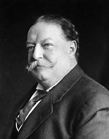
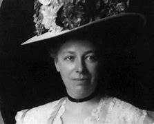

title:: 068 William Taft: Heavy

- ## 068 William Taft: Heavy
- ## pure
  collapsed:: true
	- VOA Learning English presents America's Presidents.
	- Today we are talking about William Howard Taft, who took office in 1909.
	- In some ways, the story of Taft's presidency is also a story about Theodore Roosevelt's presidency. Roosevelt had been president for the eight years before Taft. The two men were friends; Roosevelt was even a mentor to Taft.
	- But the two men were very different. Roosevelt was energetic, both in his physical abilities and in his use of executive power. His vision for the country was progressive.
	- In contrast, Taft was a more conservative, heavy man who fell asleep in meetings, and who did not make decisions quickly.
	- In fact, Americans often remember Taft because of his size. His weight changed frequently, but as president Taft usually weighed about 135 kilograms.
	- One popular story claims that Taft got stuck in a White House bathtub. This story is not true. However, it is true that Taft had a special bathtub made for him. Several men could sit comfortably in it.
	- As president, Taft did continue some of Roosevelt's reforms, but in a more orderly way. He also took some actions that contradicted Roosevelt's wishes.
	- In four years, the two men had gone from political allies to competitors for the White House.
	- ## Early life
	- Taft was another president who was born in the state of Ohio. He grew up in the city of Cincinnati, along with five siblings.
	- Taft's father was a well-known lawyer, public official and diplomat. He was an advisor to President Ulysses Grant.
	- His mother was an intelligent, independent woman who also worked for the public good.
	- The Tafts had high expectations for their son. He became an excellent student, who went on to study at Yale and then the University of Cincinnati Law School.
	- Taft sought a career path that he hoped would lead him one day to the U.S. Supreme Court. He worked as a lawyer, and then as a judge in Ohio. Along the way, he met Theodore Roosevelt. Roosevelt helped Taft advance his career as a judge.
	- But one person was not happy about the career move: Taft's wife.
	- Taft had married an intelligent, independent woman named Helen Herron, known as Nellie. She had always wanted to be first lady, and she urged her husband to follow a path toward the White House.
	- In time, Nellie Taft had her wish. In 1900 President William McKinley offered Taft a position in the Philippines. The islands had come under the control of the United States after the Spanish-American War.
	- McKinley wanted Taft to help prepare the Philippines to be ruled by civilians, instead of by soldiers. Taft worried he would not like the job; however, he knew that it was a good chance to build a political career.
	- Taft was right about that. But he was wrong about disliking the job. He enjoyed it so much that he turned down two offers to return to the U.S. and serve on the Supreme Court.
	- In the Philippines, Taft successfully established courts, schools, a transportation network, and a health care system.
	- Taft did have pejorative views about the people who lived there – he did not think they were yet capable of governing themselves. But he performed his job as governor general effectively.
	- Taft might have even stayed in the Philippines if it were not for his friend Theodore Roosevelt. In 1901, Roosevelt became president. He asked Taft to become his secretary of war.
	- Taft agreed, partly so he could continue to supervise the Philippines. But the job also put him in a position to become president himself.
	- ## Presidency
	- William Taft did not really want to be president. But Theodore Roosevelt and Nellie Taft wanted him to be.
	- During the election of 1908, Taft permitted Roosevelt to do most of the campaigning for him. He spent a lot of time golfing. Taft was the first president to be strongly linked – so to speak – to the sport of golfing. (Another word for golf course is "links.")
	- Yet voters approved of Taft. They likely hoped he would continue the reforms of Roosevelt. He won the election easily.
	- Once in the White House, however, Taft did several things that reversed Roosevelt's positions.
	- First, Taft signed a bill that did not reduce tariffs as much as many progressive activists wanted.
	- Then, Taft removed one of Roosevelt's friends from a goverment position. Taft believed he was correct in making the move, but Roosevelt and many other Republicans were furious.
	- Some historians say they did not give Taft enough credit for the many reforms he did make. His government pursued a large number of anti-trust suits against big business.
	- It also advanced two Constitutional amendments – one to establish a federal income tax, and another to permit voters to elect senators directly.
	- As the end of Taft's term in the White House came near, the Republican Party was divided. At their 1912 convention, a majority of delegates nominated Taft for president again. But a number left the meeting in anger. They created a new group, called the Progressive Party, and nominated as their candidate Theodore Roosevelt.
	- Taft and Roosevelt, along with the Democratic Party candidate, fought a bitter campaign during 1912. Of the three, Taft came in last.
	- Roosevelt came in second.
	- The divided Republicans had given control of the White House to the Democratic candidate Woodrow Wilson.
	- ## Legacy
	- Happily for him, Taft's story does not end there.
	- Taft taught at Yale University Law School for a while. Then, when a Republican took the White House again, President Warren Harding appointed Taft as chief justice of the Supreme Court. He is the only person to lead both the executive and judicial branches of the U.S. government.
	- Taft was clear about which one he favored: He was much more comfortable as a justice than he was as president.
	- One journalist at the time described Chief Justice Taft as "a smiling Buddha, placid, wise, gentle, sweet."
	- He even lost weight.
- ---
- ## def
	- VOA Learning English presents America's Presidents.
	- Today we are talking about William Howard Taft, who took office in 1909.
		- > ▶ William Howard Taft
		  
	- In some ways, the story of Taft's presidency /is also a story about Theodore Roosevelt's presidency. Roosevelt had been president /for the eight years before Taft. The two men were friends; Roosevelt was even a mentor to Taft.
		- > ▶ mentor :  an experienced person /who advises and helps sb with less experience /over a period of time 导师；顾问
	- But the two men were very different. Roosevelt was energetic, **both** in his physical abilities **and** in his use of executive power. His vision for the country /was progressive.
	- In contrast, Taft was a more conservative(a.) , heavy man /who fell asleep in meetings, and who did not make decisions quickly.
		- ((62316f64-7feb-43b1-a425-ce70b0eba349))
	- In fact, Americans often remember Taft /because of his size. His weight changed frequently, but as president /Taft usually weighed about 135 kilograms.
	- One popular story claims that /Taft got stuck in a White House bathtub. This story is not true. However, it is true that /Taft had a special bathtub /made for him. Several men could sit comfortably in it.
		- 一个流行的故事说塔夫脱被卡在白宫的浴缸里。这个故事不是真的。然而，塔夫脱确实为他做了一个特别的浴缸。几个人可以舒服地坐在里面。
	- As president, Taft did continue some of Roosevelt's reforms, but in a more orderly way. He also took some actions /that contradicted(v.) Roosevelt's wishes.
		- > ▶ orderly (a.) arranged or organized in a neat, careful and logical way 整洁的；有秩序的；有条理的 /behaving well; peaceful 表现良好的；守秩序的
		- > ▶ contradict [ VN ] ( of statements or pieces of evidence 陈述或证据 ) to be **so** different from each other /**that** one of them must be wrong 相抵触；相矛盾；相反
		  -> You've just contradicted(v.) yourself (= said the opposite of what you said before) . 你恰好与你以前说的自相矛盾。
		  /to say that /`主` sth that sb else has said `系` is wrong, and that /the opposite is true 反驳；驳斥；批驳
		- 作为总统，塔夫脱确实继续罗斯福的一些改革，但以一种更有序的方式。他还采取了一些违背罗斯福意愿的行动。
	- In four years, the two men had gone /**from** political allies /**to** competitors for the White House.
		- 在四年的时间里，两人从政治上的盟友变成了角逐白宫的竞争对手。
	- ## Early life
	- Taft was another president /who was born in the state of Ohio. He grew up in the city of Cincinnati, along with five siblings.
		- > ▶ sibling ( formal ) ( technical 术语 ) a brother or sister 兄；弟；姐；妹
		  => sib-部分与self同源，-ling在这里表亲属关系，即sibling是one's own brother or sister。
	- Taft's father was a well-known lawyer, public official and diplomat. He was an advisor /to President Ulysses Grant.
	- His mother was an intelligent, independent woman /who also worked for **the public good**.
		- 也为公众利益工作。
	- The Tafts had high expectations for their son. He became an excellent student, who went on to study at Yale /and then the University of Cincinnati Law School.
		- ((be19803d-cb2c-468a-87da-67f4ac252d56))
		- 塔夫脱夫妇对儿子期望很高。
	- Taft sought **a career path** /that he hoped would lead him one day to the U.S. Supreme Court. He worked as a lawyer, and then /as a judge in Ohio. Along the way, he met Theodore Roosevelt. Roosevelt helped Taft advance(v.) his career as a judge.
	- But one person **was not happy(a.) about** the career move: Taft's wife.
	- Taft had married an intelligent, independent woman /named Helen Herron, known as Nellie. She had always wanted to be first lady, and she urged her husband /to follow a path toward the White House.
		- > ▶ Helen Herron
		  
	- In time, Nellie Taft **had her wish**. In 1900 /President William McKinley /offered Taft a position in the Philippines. The islands had come **under the control of** the United States /after the Spanish-American War.
		- 终于如愿以偿了
	- McKinley wanted Taft /to help prepare the Philippines /to be ruled by civilians, instead of by soldiers. Taft worried /he would not like the job; however, he knew that /it was a good chance /to build a political career.
		- 麦金利希望塔夫脱帮助菲律宾做好准备，让民众而不是士兵来统治菲律宾。
	- Taft was right about that. But he was wrong about disliking the job. He enjoyed it **so** much /**that** he **turned down** two offers(n.) to return to the U.S. /and serve  on the Supreme Court.
		- > ▶ **turn sb/sth down** :
		  to reject or refuse to consider an offer, a proposal, etc. or the person who makes it 拒绝，顶回（提议、建议或提议人）
		  -> He has been turned down for ten jobs so far. 他迄今申请了十份工作都遭到拒绝。
		- 他非常享受这份工作，以至于他拒绝了两次回到美国担任最高法院法官的邀请。
	- In the Philippines, Taft successfully established courts, schools, a transportation network, and a health care system.
		- > ▶ transportation   交通运输系统 /交通工具 /运输
	- Taft did have pejorative(a.) views about the people /who lived there – he did not think /they were yet capable of governing themselves. But he performed his job as governor /general effectively.
		- > ▶ pejorative   /pɪˈdʒɔːrətɪv/ (a.)( formal ) a word or remark that is pejorative expresses disapproval or criticism 贬损的；轻蔑的
		  => 来自拉丁语peior,更坏的，来自PIE*ped,脚，词源同foot,impair,impeach.字母d脱落，拉丁语i在英语里音变为j,-or,比较级后缀。词义由其基本义脚引申为向下，低等，低到尘埃，卑贱，最后引申词义贬损的，轻蔑的。
	- Taft might have even stayed in the Philippines /if it were not for his friend Theodore Roosevelt. In 1901, Roosevelt became president. He asked Taft to become his secretary of war.
		- 如果不是他的朋友西奥多·罗斯福，塔夫脱甚至可能会留在菲律宾。1901年，罗斯福成为美国总统。他请塔夫脱担任他的战争部长。
	- Taft agreed, partly so he could continue to supervise the Philippines. But the job also put him in a position /to become president himself.
		- 塔夫脱同意了，部分原因是他可以继续监督菲律宾。但这份工作也让他有机会成为总统。
	- ## Presidency
	- William Taft did not really want to be president. But Theodore Roosevelt and Nellie Taft /wanted him to be.
	- During the election of 1908, Taft permitted Roosevelt to do most of the campaigning for him. He spent a lot of time golfing. Taft was the first president to be strongly linked – **so to speak** – to the sport of golfing. (Another word for **golf course** is "links.")
		- > ▶  so to speak  可以说；可以这么说, 打个譬喻说
		- id:: 6260e5db-a0bf-47dc-bc57-d5dd5eac8422
		  > ▶ golf course 高尔夫球
		- > ▶ golf links : ( links ) a golf course , especially one by the sea （尤指海边的）高尔夫球场
		  
		- 1908年大选期间，塔夫脱允许罗斯福为他做大部分的竞选活动。他花了很多时间打高尔夫球。可以说，塔夫脱是第一位与高尔夫运动密切相关的总统。(golf course 的另一个词是golf links 。)
	- Yet voters approved of Taft. They likely hoped /he would continue the reforms of Roosevelt. He won the election easily.
		- 然而选民们还是支持塔夫脱。他们可能希望他能继续罗斯福的改革。他轻而易举地赢得了选举。
	- Once in the White House, however, Taft did several things /that reversed(v.) Roosevelt's positions.
		- 塔夫脱做了几件事，改变了罗斯福的立场。
	- First, Taft signed a bill /that did not reduce tariffs /**as much as** many progressive activists wanted.
	- Then, Taft **removed** one of Roosevelt's friends **from** a goverment position. Taft believed /he was correct /in making the move, but Roosevelt and many other Republicans /were furious.
		- 塔夫脱认为他这样做是正确的，但罗斯福和许多其他共和党人感到愤怒。
	- Some historians say /they did not give Taft enough credit /for the many reforms he did make. His government pursued **a large number of** anti-trust suits /against big business.
		- > ▶ trust (n.) [ C ] ( business 商 ) ( especially NAmE ) a group of companies /that work together illegally /to reduce competition, control prices, etc. 托拉斯（为减少竞争、操纵价格等而非法联合的企业组织）
		  -> anti-trust laws 反托拉斯法
		- > ▶  anti-trust ADJ In the United States, antitrust laws are intended to stop big companies taking over their competitors, fixing prices with their competitors, or interfering with free competition in any way. 反垄断的
		- 他们对塔夫脱所做的许多改革没有给予足够的信任。他的政府对大企业发起了大量反垄断诉讼。
	- It also advanced two Constitutional amendments – one /to establish a federal **income tax**, and another /to permit voters to elect senators directly.
		- > ▶ **income tax** [ UC ] the amount of money /that you pay to the government /according to how much you earn （个人）所得税
		- 它还提出了两项宪法修正案—— 一项是设立联邦所得税，另一项是允许选民直接选举参议员。
	- As the end of Taft's term in the White House /came near, the Republican Party was divided. At their 1912 convention, a majority of delegates /nominated Taft for president again. But a number left(v.) the meeting /in anger. They created a new group, called the Progressive Party, and nominated as their candidate /Theodore Roosevelt.
		- > ▶ number [ sing. ] ( formal ) a group or quantity of people 一群人；许多人
		  -> one of our number (= one of us) 我们中的一人
		- 随着塔夫脱白宫任期的临近，共和党内部出现了分裂。在1912年的代表大会上，大多数代表再次提名塔夫脱为总统。但有一部分人愤怒地离开了会议。他们创建了一个新的团体，叫做进步党，并提名西奥多·罗斯福为他们的候选人。
	- Taft and Roosevelt, along with the Democratic Party candidate, fought a bitter campaign /during 1912. Of the three, Taft came in last.
		- 塔夫脱、罗斯福, 以及民主党候选人, 进行了一场激烈的竞选。三个人中，塔夫脱排在最后。
	- Roosevelt /came in second.
	- The divided Republicans /**had given** control of the White House **to** the Democratic candidate Woodrow Wilson.
	- ## Legacy
	- Happily for him, Taft's story does not end there.
	- Taft taught at Yale University Law School /for a while. Then, when a Republican /took the White House again, President Warren Harding /appointed Taft as **chief justice** of the Supreme Court. He is the only person /to lead **both** the executive **and** judicial branches of the U.S. government.
	- Taft was clear about /which one he favored: He was much more comfortable as a justice /than he was as president.
	- One journalist at the time /**described** Chief Justice Taft **as** "a smiling Buddha, placid(a.), wise, gentle, sweet."
		- > ▶ Buddha : ( also the Buddha ) the person on whose teachings the Buddhist religion is based 佛陀（佛教创始人）
		- > ▶ placid  (a.)( of a person or an animal 人或动物 ) not easily excited or irritated 温和的；平和的；文静的 /calm and peaceful, with very little movement 平静的；宁静的；安静的
		  -> the placid waters /of the lake 平静的湖水
	- He even lost weight.
- ---
- William Taft
	- 是史上唯一出任过美国总统和美国首席大法官两项职位的人.
	- 塔夫脱1857年生于俄亥俄州辛辛那提，父亲阿方索曾任美国司法部长和战争部长，还是耶鲁大学骷髅会的创始人，塔夫脱进入该校深造并加入骷髅会。成为律师后，塔夫脱二十几岁就当上法官。他晋升迅速，先后出任副检察长和联邦第六巡回上诉法院法官。1901年，威廉·麦金莱任命他出任菲律宾民事总督。1904年，罗斯福选择塔夫脱担任战争部长，随后他又成为总统钦点的接班人。
	- 塔夫脱的个人心愿是出任首席大法官，但对政治事业的责任心促使他多次谢绝进入美国最高法院的机会。
	- 历史上多次美国总统排名中，塔夫脱大多位于中等水平。
	-