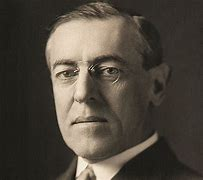
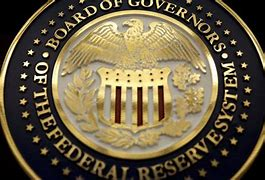

title:: 069 Woodrow Wilson: Idealist

- ## 069 Woodrow Wilson: Idealist
- ## pure
  collapsed:: true
	- VOA Learning English presents America's Presidents.
	- Today we are talking about Woodrow Wilson. He served two terms, from 1913 to 1921, and led the United States through the first World War.
	- Wilson might have seemed an unlikely war president. He was a university professor before he entered politics.
	- And, when the conflict began in Europe in 1914, Wilson strongly rejected the idea of the U.S. getting involved. He even campaigned for his second term on the slogan "He kept us out of the war."
	- But Wilson's idealism eventually made him believe the U.S. must enter the conflict. He famously said, "The world must be safe for democracy."
	- He spent the last months of his presidency fighting to create a league of nations that would prevent future wars.
	- Wilson did not succeed in that effort. But the effects of his presidency are still seen today in both the domestic and foreign affairs of the United States.
	- ## Early life
	- Woodrow Wilson was born in the state of Virginia in 1856 and grew up in the South.
	- Wilson's father was a Protestant Christian minister who supported the views of the Confederacy during the Civil War.
	- Wilson's mother had been born in England but raised in the United States. She was reportedly warm and loving, especially to her husband and four children.
	- Wilson's early life was marked by poor health and a passion for learning. His education included tutoring by Confederate soldiers, classes with his father, a year at Davidson College, a bachelor's degree from the school now called Princeton, one year of law school, and a doctoral degree in history and political science from the University of Johns Hopkins.
	- He remains, so far, the only president with a Ph.D.
	- Wilson's academic interests were in government, and how it could be most effective. Even as a young man, he supported the idea of a strong executive, either a prime minister or a president.
	- He wrote a number of books, including a biography of George Washington, and a history of the United States. He also taught popular classes at several colleges, including Bryn Mawr in Pennsylvania, Wesleyan in Connecticut, and Princeton in New Jersey.
	- In time, Wilson became the president of Princeton. He made major reforms to the school until some faculty and alumni resisted his efforts.
	- Wilson had always been interested in political power. The Democratic Party in New Jersey became interested in Wilson when they were looking for a candidate with an honest public image.
	- In truth, party officials believed he would be a weak leader whom they could influence. Wilson surprised them by winning the seat as New Jersey governor easily, and then rejecting their efforts to control him.
	- He went on to pass major reform legislation in New Jersey that reduced corruption and protected the rights of workers. His actions drew the attention of Democratic Party leaders seeking a candidate for president in 1912.
	- ## Presidency: first term
	- Voters did not overwhelmingly choose Wilson in 1912. Although he did well in the Electoral College, he earned only a little more than 40 percent of the popular vote. Other votes were mostly divided between two former presidents, Theodore Roosevelt and William Taft.
	- Yet Wilson quickly asserted authority over Congress and pushed through a number of laws aimed at dramatic reform.
	- Historian Kendrick Clements at the University of South Carolina says Wilson had a strongly progressive vision.
	- He was interested in "expanding economic opportunity for people at the bottom of society and eliminating special privileges enjoyed by the richest and most powerful members of society."
	- One of Wilson's most important acts was to create a new federal agency called the Federal Reserve Board. It still regulates American banks, credit, and money supply. He also created the Federal Trade Commission to ensure fair business practices, and the Department of Labor to protect workers' rights.
	- And he supported laws to reduce working hours for railroad employees, bar child labor, and offer government loans to farmers.
	- But even during Wilson's busy lawmaking, the threat of world war demanded his attention. Wilson had declared that the U.S. would remain neutral in the growing conflict between the Allied and Central Powers.
	- One of his reasons was that people in the U.S. were immigrants from the countries that were at war. Wilson did not want the conflict to divide Americans.
	- However, he permitted international trade, including with Britain and France. As a result, many believed the U.S. was favoring those countries.
	- In 1915, a German submarine sank a British ship called the Lusitania and killed more than 100 Americans on board.
	- Wilson protested several times to Germany about the sinking. He warned that the U.S. would not accept another such aggression. But two years later, Germany attacked U.S. commercial ships. It also invited Mexico to enter into an alliance against the United States.
	- At the beginning of Wilson's second term in office, he asked Congress to declare war on Germany.
	- ## Presidency: second term
	- The U.S. entered World War I on the side of the Allied Powers. The additional support came at an important time. American soldiers were able to help resist German troops in France.
	- In time, Germany asked for an armistice – an agreement to stop fighting.
	- Following the war, Wilson had a grand vision for how to gain lasting peace in Europe. In a speech known as "Fourteen Points," he proposed that the countries that had won the war not punish Germany.
	- Wilson also wanted European colonies to rule themselves, and other areas be given immediate independence.
	- Most importantly, Wilson suggested a League of Nations that would guarantee the member countries' independence and safety.
	- But few world leaders agreed with his plan completely.
	- Even in the U.S., many Republican lawmakers in Congress resisted Wilson's idea for a League of Nations. Some strongly objected to any treaty that would limit the country's independence. Others did not want the country to be involved in world issues at all.So Wilson began a trip across the U.S. to raise public support for the League of Nations. He traveled more than 15,000 kilometers in 22 days and gave 29 speeches.
	- Wilson's doctors warned him that the trip was hard on his health. But Wilson was firm about pressuring Senate Republicans to adopt the agreement.
	- Finally, he collapsed from exhaustion. Shortly after, he suffered a major stroke. Although he recovered somewhat, he remained partly paralyzed. He rarely appeared in public again.Instead, Wilson communicated to Congress through his wife. When Republicans changed the treaty to deal with their concerns, Wilson told his supporters to reject it.
	- In the end, the U.S. never did join the League of Nations.
	- When a new president, Warren Harding, was sworn-in in 1921, Edith and Woodrow Wilson retired to a house in Washington, D.C. Three years later, the former president died quietly there, finally at peace.
- ---
- ## def
	- VOA Learning English presents America's Presidents.
	- Today we are talking about Woodrow Wilson. He served two terms, from 1913 to 1921, and led the United States /through the first World War.
		- > ▶ Woodrow Wilson
		  
	- Wilson might have seemed an unlikely war president. He was a university professor /before he entered politics.
	- And, when the conflict began in Europe in 1914, Wilson strongly rejected the idea /of the U.S. getting involved. He even campaigned for his second term /on the slogan "He kept us out of the war."
	- But Wilson's idealism /eventually made him believe /the U.S. must enter the conflict. He famously said, "The world must be safe for democracy."
		- > ▶ idealism (n.)the belief that a perfect life, situation, etc. can be achieved, even when this is not very likely 理想主义
		  /( philosophy 哲 ) the belief /that our ideas are the only things /that are real /and that we can know about 唯心主义；唯心论；观念论；理念论
	- He spent the last months of his presidency /fighting to create a league of nations /that would prevent future wars.
	- Wilson did not succeed /in that effort. But the effects of his presidency /are still seen today /in both the domestic and **foreign affairs** of the United States.
	- ## Early life
	- Woodrow Wilson was born /in the state of Virginia in 1856 /and grew up in the South.
	- Wilson's father was a Protestant Christian minister /who supported the views of the Confederacy /during the Civil War.
		- > ▶ protestant :   /ˈprɑːtɪstənt/ a member of a part of the Western Christian Church that separated from the Roman Catholic Church in the 16th century 新教教徒（16世纪脱离罗马天主教）
		- ((6257cdcb-fb0b-4472-8949-cf8aa36b57cd))
	- Wilson's mother had been born in England /but raised in the United States. She was reportedly warm and loving, especially to her husband and four children.
	- Wilson's early life /was marked by poor health /and a passion for learning. His education included /tutoring by Confederate soldiers, classes with his father, a year at Davidson College, **a bachelor's degree** /from the school now called Princeton, one year of law school, and **a doctoral degree** in history and political science(n.) /from the University of Johns Hopkins.
		- > ▶ passion n. [ CU ] a very strong feeling of love, hatred, anger, enthusiasm, etc. 强烈情感；激情 /[ sing. ] ( formal ) a state of being very angry 盛怒；激愤
		  + /~ (for sth) a very strong feeling of liking sth; a hobby, an activity, etc. that you like very much 酷爱；热衷的爱好（或活动等）
		  + /~ (for sb) a very strong feeling of sexual love 强烈的爱（尤指两性间的）
		- > ▶ bachelor : ( usually Bachelor ) a person who has a Bachelor's degree (= a first university degree) 学士
		  /a man who has never been married 未婚男子；单身汉
		  => 来自拉丁词bacilum, 杆，棍。原指旧时骑士跟班，持一根木棍跟随骑士学习。
		- > ▶ doctoral (a.) [ only before noun ] connected with a doctorate 博士的；博士学位的
		- > ▶ science (n.) [ U ] knowledge about the structure and behaviour of the natural and physical world, based on facts that you can prove, for example by experiments 科学；自然科学
		  + / [ sing. ] a system for organizing the knowledge about a particular subject, especially one concerned with aspects of human behaviour or society （尤指人文、社会）学科，学
		- 他所受的教育包括: 接受邦联士兵的辅导，跟随父亲上课，在戴维森学院(Davidson College)学习一年，在现在的普林斯顿大学(Princeton)获得学士学位，在法学院学习一年，并在约翰霍普金斯大学(University of Johns Hopkins)获得历史和政治学博士学位。
	- He remains, so far, the only president with a Ph.D.
		- > ▶ Ph.D 哲学博士
	- Wilson's academic interests /were in government, and how it could be most effective. Even as a young man, he supported the idea /of a strong executive, **either** a prime minister **or** a president.
		- 威尔逊的学术兴趣在于政府，以及如何使政府最有效。甚至在他年轻的时候，他就支持一个强有力的行政机构，要么是总理，要么是总统。
	- He wrote a number of books, including a biography of George Washington, and a history of the United States. He also taught popular classes /at several colleges, including Bryn Mawr in Pennsylvania, Wesleyan in Connecticut, and Princeton in New Jersey.
		- 他还在几所大学, 教授(v.)受欢迎的课程
	- In time, Wilson became the president of Princeton. He **made** major reforms **to** the school /until some faculty(n.) and alumni(n.) /resisted his efforts.
		- > ▶ faculty (n.) a department or group of related departments in a college or university （高等院校的）系，院
		  -> the Faculty of Law 法学院
		  + /( often **the faculty** ) [ CU ] ( NAmE ) all the teachers of a particular university or college （某高等院校的）全体教师
		  + /[ Cusually pl. ] any of the physical or mental abilities /that a person is born with 官能；天赋
		  -> She retained her mental faculties (= the ability to think and understand) until the day she died. 她直到临终那天一直保持着思维和理解能力。
		- > ▶ alumni  (n.)  /əˈlʌmnaɪ/ [ pl. ] ( especially NAmE ) the former male and female students of a school, college or university （统称）校友，毕业生
		  => alumnus的复数，-i,拉丁语阳性格复数后缀。alumnus（男毕业生）和alumna（女毕业生）。这两个单词都来自拉丁语，词根为alere（滋养、抚养）。
		- 他对学校进行了重大改革，直到一些教员和校友反对他的努力。
	- Wilson had always been interested in political power. The Democratic Party in New Jersey /became interested in Wilson /when they were looking for a candidate /with an honest public image.
	- In truth, party officials believed /he would be a weak leader /whom they could influence. Wilson surprised them /by winning the seat as New Jersey governor easily, and then rejecting their efforts /to control him.
	- He went on /to pass(v.) major reform legislation in New Jersey /that reduced corruption /and protected the rights of workers. His actions /drew the attention of Democratic Party leaders /seeking a candidate for president in 1912.
	- ## Presidency: first term
	- Voters did not overwhelmingly choose Wilson in 1912. Although he did well /in the Electoral College, he earned only a little more than 40 percent of the popular vote. Other votes were mostly divided /between two former presidents, Theodore Roosevelt and William Taft.
		- 1912年，选民并没有以压倒性数量地来选择威尔逊。虽然他在选举团中表现不错，但他只获得了40%多一点的普选选票。
	- Yet Wilson quickly **asserted authority** over Congress /and **pushed through** a number of laws /aimed at dramatic reform.
		- > ▶ assert (v.) [ VN ] to make other people /recognize your right or authority to do sth, by behaving firmly and confidently 维护自己的权利（或权威）
		  -> to assert your independence/rights 维护独立╱权利
		  + /to state clearly and firmly that /sth is true 明确肯定；断言
		  + ~ yourself:  to behave in a confident and determined way /so that other people pay attention to your opinions 坚持自己的主张；表现坚定
		- 然而，威尔逊迅速确立了对国会的权威，并推动通过了一系列旨在进行重大改革的法律。
	- Historian Kendrick Clements /at the University of South Carolina says /Wilson had a strongly progressive vision.
		- 威尔逊有着强烈的进步愿景。
	- He was interested in "expanding economic opportunity /for people at the bottom of society /and eliminating **special privileges** /enjoyed by the richest and most powerful members of society."
		- 他关心的是“为社会底层的人扩大经济机会，消除社会中最富有和最有权势的人所享有的特权”。
	- One of Wilson's most important acts was /to create a new **federal agency** /called **the Federal Reserve Board**. It still regulates American banks, credit, and money supply. He also created **the Federal Trade Commission** /to ensure **fair business practices**, and the Department of Labor /to protect workers' rights.
		- > ▶ Federal Reserve Board
		  
		- 威尔逊最重要的举措之一, 是创建一个新的联邦机构，称为联邦储备委员会。它仍然监管着美国的银行、信贷和货币供应。他还成立了联邦贸易委员会(Federal Trade Commission), 来确保公平的商业行为，并成立了劳工部(Department of Labor), 来保护工人的权利。
	- And he supported laws /to reduce working hours /for railroad employees, bar(v.) child labor, and **offer**(v.) government loans **to** farmers.
		- 禁止使用童工
	- But even during Wilson's busy lawmaking, the threat of world war /demanded his attention. Wilson had declared that /the U.S. would remain neutral(a.) /in the growing conflict /between the Allied and Central Powers.
		- > ▶ neutral  (a.) not supporting or helping either side in a disagreement, competition, etc. 中立的；持平的；无倾向性的
		  + / deliberately not expressing any strong feeling 中性的；不含褒贬义的
		- > ▶ Central Powers : N-PLURAL (before World War I) Germany, Italy, and Austria-Hungary after they were linked by the Triple Alliance in 1882 (第一次世界大战前)德国、意大利和奥匈帝国的三国同盟
		- 但即使在威尔逊忙于立法期间，世界大战的威胁也引起了他的注意。威尔逊曾宣布，美国将在同盟国和轴心国之间日益激烈的冲突中, 保持中立。
	- One of his reasons was that /people in the U.S. /were immigrants from the countries that were at war. Wilson did not want the conflict to divide Americans.
	- However, he permitted international trade, including with Britain and France. As a result, many believed /the U.S. was favoring those countries.
		- > ▶ favour (v.) to prefer one system, plan, way of doing sth, etc. to another 较喜欢；选择
		  + /to treat sb better than you treat other people, especially in an unfair way 优惠；特别照顾；偏袒
		  -> The treaty seems to favour the US. 这个条约似乎偏向美国。
	- In 1915, a German submarine sank(v.) a British ship /called the Lusitania /and killed more than 100 Americans on board.
	- Wilson **protested** several times **to** Germany /about the sinking. He warned that /the U.S. would not accept another such aggression. But two years later, Germany attacked U.S. commercial ships. It also invited Mexico /to enter into an alliance /against the United States.
		- ((62319d24-63d2-4391-a5f1-ba755ae6b05d))
	- At the beginning of Wilson's second term in office, he asked Congress /to declare war on Germany.
	- ## Presidency: second term
	- The U.S. entered World War I /on the side of **the Allied Powers**. The additional support came /at an important time. American soldiers were able to help resist(v.) **German troops** in France.
	- In time, Germany **asked for** an armistice – an agreement to stop fighting.
		- > ▶ armistice /ˈɑːrmɪstɪs/  (n.) [ sing. ] a formal agreement /during a war /to stop fighting /and discuss making peace 休战；停战；休战条约；停战协定
		  => arm, 武装，战斗。词根st, 站立，停止。
	- Following the war, Wilson had a grand vision /for how to gain **lasting peace** in Europe. In a speech /known as "Fourteen Points," he proposed that /the countries that had won the war /not punish Germany.
		- 战后，威尔逊对如何在欧洲获得持久和平, 有一个宏伟的愿景。在一场名为“14点”的演讲中，他提议，赢得战争的国家不应惩罚德国。
	- Wilson also wanted European colonies /to rule themselves, and other areas /be given immediate independence.
		- 威尔逊还希望欧洲殖民地自治，其他地区立即获得独立。
	- Most importantly, Wilson suggested **a League of Nations** /that would guarantee(v.) the member countries' independence and safety.
		- > ▶ guarantee (v.) to promise to do sth; to promise sth will happen 保证；担保；保障
		  + /to agree to be legally responsible for sth or for doing sth 承诺对…负法律责任；为…作保
		  -> to guarantee a bank loan 为银行贷款作保
	- But few world leaders /agreed with his plan completely.
	- Even in the U.S., many Republican lawmakers in Congress /resisted Wilson's idea /for a League of Nations. Some **strongly objected(v.) to** any treaty /that would limit the country's independence. Others did not want the country /to be involved in world issues at all.So Wilson began a trip across the U.S. /to raise public support for the League of Nations. He traveled more than 15,000 kilometers in 22 days /and gave 29 speeches.
	- Wilson's doctors warned him that /the trip was hard on his health. But Wilson was firm about **pressuring** Senate Republicans /**to adopt** the agreement.
		- > ▶ **be hard on sb/sth** : to be likely to hurt or damage sth 可能损伤，可能损坏（某物）
	- Finally, he collapsed from exhaustion. Shortly after, he suffered **a major stroke**. Although he recovered somewhat, he remained partly paralyzed. He rarely appeared in public again.Instead, Wilson communicated to Congress /through his wife. When Republicans changed the treaty /to deal with their concerns, Wilson told his supporters /to reject it.
		- 最后，他疲惫地倒下了。不久之后，他遭受了严重的中风。虽然他恢复了一些，但仍然部分瘫痪。他很少再公开露面了。相反，威尔逊通过妻子与国会进行了沟通。当共和党人为了解决他们的担忧而修改条约时，威尔逊告诉他的支持者拒绝接受条约。
	- In the end, the U.S. never did join **the League of Nations**.
	- When a new president, Warren Harding, was sworn-in in 1921, Edith and Woodrow Wilson /retired to a house in Washington, D.C. Three years later, the former president died quietly there, finally at peace.
- ---
- Woodrow Wilson
	- 他的主张被后人称为威尔逊主义。
	- 迄今为止，他是唯一拥有哲学博士头衔的美国总统（法律博士衔除外）.
	- 第一个任期
		- 在第一个任期中，威尔逊支持民主党控制的议会通过:
			- -> **联邦储备**法案（**Federal Reserve** Act），
			- -> 克莱顿**反托拉斯**法案（Clayton **Antitrust Act**），
			- -> 联邦**农田贷款**法案（Federal **Farm Loan** Act），
			- -> 还通过新的收入法, 在联邦一级开征收入税，以及建立联邦贸易委员会。
		- 但他同时因为支持在联邦政府机构中实施种族隔离，导致大批黑人员工被解职，而遭到当时民权团体的批评。
		-
	- 第二个任期
		- 1916年美国总统选举勉强胜出后，威尔逊第二个任期的中心议题是第一次世界大战。尽管他在竞选时打出“他让我们远离战争”（he kept us out of the war）的口号，美国的中立政策却未能持久。德国经外交秘书阿瑟·齐默尔曼发送电报给墨西哥，声称若两国结盟，德国将帮助墨西哥重新获得被美国占领之北方数州。
		- -> 他于1917年发动美国历史上首次实际有效的征兵，通过建立自由公债（Liberty Bonds）, 筹集数十亿战争资金，
		- -> 设立战争工业委员会（War Industries Board），促进工会运动，
		- -> 通过史密斯-莱佛法案（Smith-Lever Act）监督农业和食品生产，
		- -> 控制铁路运输，
		- -> 通过首个联邦级致幻药物取缔法案，
		- -> 并镇压反战运动。
		- -> 此外, 在他的任期内, 普遍实现妇女选举权。
		- 战后, 他发表十四点和平原则，从中阐述他所认为的能够避免世界再遭战火的新世界秩序。
		- 十四点和平原则, 其中包括:
			- 签订公开条约，杜绝秘密外交。
			- 建立国际联合机构。
		- 1919年赴巴黎筹建国际联盟以及拟定凡尔赛条约，并尤其关注自战败帝国中建立新国家的问题。后主要由于他对创建国联的贡献，于1920年被授予1919年度的诺贝尔和平奖。
		- 他在与共和党控制的参议院围绕美国加入国联一事, 而进行激烈斗争时，因中风而昏倒。由于拒绝妥协，威尔逊最终未能使加入国联案在参院通过。尽管没有美国的加入，国联还是于1920年成立。
		- **威尔逊所秉持的国际主义，也被后人称为“威尔逊主义”，主张美国登上世界舞台来为民主而战斗，支持众小民族（如波兰）建立民族国家。这成为以后美国外交政策中一个颇有争议的理念(被其他国家污蔑为"干涉他国内政")，为理想主义者所效仿，却为现实主义者所排斥。**
		- 大卫·肯尼迪（David Kennedy）认为，即使历经富兰克林·罗斯福、亨利·基辛格等现实主义者做过的一些调整，美国的外交政策自1914年以来都一直遵循着威尔逊理想主义。
	-