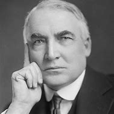

title:: 070 Warren Harding: Damaged

- ## 070 Warren Harding: Damaged
- ## pure
  collapsed:: true
	- VOA Learning English presents America's Presidents.
	- Today we are talking about Warren Harding. He was the 29th president of the United States.
	- Harding was very different from the 28th president, Woodrow Wilson.
	- Wilson supported change; Harding promised "a return to normalcy."
	- Wilson took steps to protect American workers; Harding often worked to protect business owners.
	- Wilson was slow in supporting voting rights for women, and in accepting African-American people as equal to whites. Harding supported women's suffrage and civil rights for African-Americans.
	- Yet both men were popular during their years in office.
	- Today, however, historians usually think of Wilson as one of America's best presidents. But Harding is remembered as one of the worst.
	- ## Early life
	- Warren Harding was the eighth president from the state of Ohio. His parents were both doctors.
	- Harding spoke about having a happy childhood, growing up on a farm with his brothers and sisters. Some of his favorite early activities were performing in a band.
	- Later, Harding – along with two friends – bought a newspaper. The paper became successful for several reasons.
	- Harding was kind to his employees and shared the company's profits with them. He also tried not to publish stories that criticized politics or politicians from any party. Finally, he married a woman who had an excellent head for business.
	- Florence Kling Harding led the newspaper's circulation department. She also helped to direct her husband's political career.
	- In time, Warren Harding became a state senator, a lieutenant governor of Ohio, and then a member of the U.S. Senate. He especially liked being a senator – and many of the other lawmakers liked him.
	- One reason is because Harding rarely took a controversial position on any issue.
	- Instead, he accepted most of the ideas of the Republican Party. He was also good-looking and had an excellent speaking voice.
	- These qualities helped earn him the Republican presidential nomination in 1920. A few months later, he easily won the national election.
	- ## Presidency
	- President Harding took office shortly after World War I ended. He promised to make Americans feel calm again, and also improve the nation's prosperity. Two of Harding's goals were to support business and to limit immigration.
	  He succeeded on both issues. His administration reduced taxes for big businesses and wealthy people. It also increased tariffs -- taxes on foreign imports.
	- And the Harding administration put in place new rules on immigration. The rules made it easier for immigrants from northern Europe to enter the country, but harder for immigrants from Russia, eastern and central Europe.
	- Harding also took steps to improve the effectiveness of the federal government.
	- But his administration is remembered mostly for its problems.
	- At the beginning of his term, Harding reportedly told friends that the job of being president was too much for him. He appeared to want to do well, and he worked hard. But he turned over most of the responsibility to his friends in the cabinet.
	- A few were very able. But some were dishonest. They abused their positions to gain wealth for themselves and their families.
	- One of the most famous examples of corruption during Harding's administration is known as the Teapot Dome Scandal.
	- The name "Teapot Dome" comes from a rock in the state of Wyoming. The rock looked like a teapot. Scientists correctly believed that oil could be found in the ground underneath it.
	- At the time, the U.S. navy depended on oil to fuel its ships. So, the federal government claimed the land in case the navy needed to use the oil in an emergency.
	- But a cabinet official who was a friend of Harding took control of the land. He gave a private company permission to search for oil on it in exchange for a large amount of money.
	- Some lawmakers became suspicious. So they opened an investigation.
	- In time, lawyers proved the act of corruption. Harding's friend was the first person to be found guilty of a crime while serving as a cabinet official.
	- But President Harding did not live to see his friend go to jail.
	- The investigation was just beginning when Harding took a trip to the West Coast to campaign for his policies.
	- Some say that Harding was also trying to escape the problems in his administration. He reportedly told one reporter that worrying about what his friends were doing kept him awake at nights.
	- During the trip, Harding showed signs of not being in good health. Doctors thought he could have food poisoning or pneumonia. He was taken to a hotel in San Francisco, California. For a day, he appeared to be feeling better.
	- He was sitting up in bed. And then suddenly, his body shook and collapsed. He died instantly.
	- Reports at the time differed on the cause of Harding's death. Some even said that his wife poisoned the president to protect him from being punished for the wrongdoing in his administration.
	- But most historians think that he had long suffered from heart failure, and was struck by a heart attack. He was 57.
	- ## Legacy
	- Millions of Americans mourned over Warren Harding's death. They stood beside railroad tracks as his body traveled from California back to Washington, DC.
	- The following year, Florence Harding also died. She and her husband are buried together under a grand memorial in their hometown in Ohio.
	- But in the years after his death, Harding's public image worsened. More corruption scandals in his administration came to light. And some historians have criticized him for not having a clear idea about how he wanted to lead the country.
	- In 1927, a woman published a book saying she had a long, but secret relationship with Harding, both before and during his presidency. She also said he was the father of her daughter. Genetic testing has confirmed her claim.
	- More than 30 years after her book was published, a lawyer discovered love letters from Harding to a different woman. They confirmed that he had a long romantic affair with the wife of one of his friends. Harding had also been married at the time.
	- These reports, as well as the corruption during his administration, damaged Harding's public image. But he also seemed to know that he would not be remembered as one of the best occupants of the White House.
	- Instead, he tried to be likable and modest. He called himself "a man of limited talents" who was "not fit for the office" of president.
- ---
- ## def
	- VOA Learning English presents America's Presidents.
	- Today we are talking about Warren Harding. He was the 29th president of the United States.
		- > ▶ Warren Harding
		  
	- Harding was very different from the 28th president, Woodrow Wilson.
	- Wilson supported change; Harding promised "a return to normalcy(n.)."
		- > ▶ normalcy N-UNCOUNT Normalcy is a situation in which everything is normal. 常态
	- Wilson took steps /to protect American workers; Harding often worked /to protect business owners.
	- Wilson was slow /in supporting **voting rights** for women, and in accepting African-American people /as equal to whites. Harding supported **women's suffrage**(n.) and **civil rights** for African-Americans.
		- > ▶ suffrage (n.) [ U ] the right to vote in political elections 选举权；投票权
		  -> **universal suffrage** (= the right of all adults to vote) 普选权
		  -> **women's suffrage** 妇女的选举权
		  => 这个单词来自拉丁语suffragium（投票、投票权），该词由sub（下面，在这里变为suf，与后面的f一致）+fragor（碰撞、叫喊、喧闹）构成，意思是在底下大声喊叫，通过声音来表示赞同，就像我们现在举手表示赞同一样。
		  还有一种说法认为，fragor表示碎瓦片，意思是用碎瓦片来进行投票。
		  不管是叫喊声还是碎瓦片，fragor都与frangere（=英语中的break）有关，而frangere正是英语词根frag（=break）的来源.
		- 威尔逊在支持妇女投票权, 和接受非裔美国人与白人平等方面, 行动迟缓。哈丁支持非洲裔美国人的"妇女选举权"和"民权"。
	- Yet both men were popular /during their years in office.
	- Today, however, historians usually **think of** Wilson **as** one of America's best presidents. But Harding is remembered as one of the worst.
	- ## Early life
	- Warren Harding was the eighth president /from the state of Ohio. His parents were both doctors.
	- Harding **spoke about** having a happy childhood, growing up on a farm /with his brothers and sisters. Some of his favorite early activities /were performing in a band.
		- > ▶ speak (v.) ~ of/about sth/sb : to mention or describe sth/sb 提起；讲述
		- 哈丁说他有一个快乐的童年，和他的兄弟姐妹在农场长大。他最喜欢的早期活动, 是在乐队里表演。
	- Later, Harding – along with two friends – bought a newspaper. The paper became successful /for several reasons.
	- Harding was kind to his employees /and shared the company's profits with them. He also tried /not to publish stories /that criticized politics or politicians from any party. Finally, he married a woman /who had an excellent head for business.
		- 哈丁对他的员工很好，并与他们分享公司的利润。他还试图不发表批评政治或任何政党政客的文章。最后，他娶了一个很有商业头脑的女人。
	- Florence Kling Harding /led the newspaper's **circulation department**. She also helped /to direct her husband's political career.
		- > ▶ circulation  [ U ] the passing or spreading of sth from one person or place to another 传递；流传；流通
		  + /[ Cusually sing. ] the usual number of copies of a newspaper or magazine that are sold each day, week, etc. （报刊）发行量，销售量
		  ->  circulation department 发行部
	- In time, Warren Harding /became a state senator, **a lieutenant governor** of Ohio, and then /a member of the U.S. Senate. He especially liked being a senator – and many of the other lawmakers liked him.
		- > ▶ lieutenant  /luːˈtenənt/   ( in compounds 构成复合词 ) an officer just below the rank mentioned 仅低于…官阶的官员
		  -> a lieutenant colonel 中校
		  + /a person who helps sb who is above them in rank or who performs their duties when that person is unable to 副职官员；助理官员；代理官员
		  + /an officer of middle rank in the army, navy, or air force （陆军）中尉；（海军或空军）上尉
		  => 来自古法语lieu tenant,替代，副职，lieu,地方，tenant,占用，引申词义代替，副职官员，陆军中尉等。
	- One reason is because /Harding rarely took a controversial position /on any issue.
		- > ▶ controversial (a.)causing a lot of angry public discussion and disagreement 引起争论的；有争议的
		  -> a highly controversial topic 颇有争议的话题
		  => contro-反对,相反 + -vers-转 + -ial形容词词尾
		- 一个原因是哈丁很少在任何问题上, 采取有争议的立场。
	- Instead, he accepted most of the ideas of the Republican Party. He was also good-looking /and had an excellent speaking voice.
	- These qualities /helped earn him /the Republican presidential nomination in 1920. A few months later, he easily won the national election.
	- ## Presidency
	- President Harding took office shortly /after World War I ended. He promised to make Americans feel calm again, and also improve the nation's prosperity. Two of Harding's goals were /to support business /and to limit immigration.
		- 他承诺让美国人再次感到平静，并促进国家的繁荣。
	- He succeeded /on both issues. His administration reduced taxes /for big businesses and wealthy people. It also increased tariffs -- taxes on foreign imports.
		- 为大企业和富人减税,  它还提高了进口关税。
	- And the Harding administration /**put in place** new rules on immigration. The rules made it easier for immigrants from northern Europe /to enter the country, but harder /for immigrants from Russia, eastern and central Europe.
		- id:: 626117e7-4d19-47a3-a515-d6de9831694c
		  > ▶ **in place**
		  (1) ( also into ˈplace ) in the correct position; ready for sth 在正确位置；准备妥当
		  -> Carefully lay each slab in place. 要仔细铺好每一块石板。 
		  (2) working or ready to work 在工作；准备就绪
		  -> All the arrangements are now in place for their visit. 他们来访的一切都安排就绪了。 
		  (3) ( NAmE )
		  = on the spot at spot n. (3)
	- Harding also took steps /to improve the effectiveness of the federal government.
	- But his administration /is remembered mostly for its problems.
	- At the beginning of his term, Harding reportedly told friends that /the job of being president /was too much for him. He appeared to want to do well, and he worked hard. But he **turned over** most of the responsibility /**to** his friends in the cabinet.
		- > ▶  too much for 太多；太难；非……力所能及
		- > ▶ **turn sth over to sb**
		  to give the control of sth to sb 把…移交给（他人管理）
		  -> He **turned** the business /**over to** his daughter. 他把这个企业交给了女儿管理。
		- 但他把大部分责任都交给了他在内阁的朋友。
	- A few were very able. But some were dishonest. They abused their positions /to gain wealth for themselves and their families.
		- 滥用职权
	- One of the most famous examples of corruption /during Harding's administration /is known as the Teapot Dome Scandal.
		- > ▶ scandal (n.) [ CU ] behaviour or an event /that people think is morally or legally wrong /and causes public feelings of shock or anger 丑行；使人震惊的丑事；丑闻
	- The name "Teapot Dome" /comes from a rock in the state of Wyoming. The rock looked like a teapot. Scientists correctly believed that /oil could be found in the ground underneath it.
	- At the time, the U.S. navy /depended on oil /to fuel its ships. So, the federal government claimed the land /**in case** the navy needed to use the oil /in an emergency.
	- But a cabinet official /who was a friend of Harding /**took control of** the land. He gave a private company permission /**to search for** oil on it /**in exchange for** a large amount of money.
	- Some lawmakers became suspicious. So they opened an investigation.
	- In time, lawyers proved the act of corruption. Harding's friend was the first person /to be found guilty of a crime /while serving as a cabinet official.
		- > ▶ prove (v.) V-LINK If something proves to be true or to have a particular quality, it becomes clear after a period of time that it is true or has that quality. 证明是
		- 律师及时证明了腐败行为。哈丁的朋友是第一个在担任内阁官员期间被判有罪的人。
	- But President Harding did not live to see his friend go to jail.
	- The investigation was just beginning /when Harding took a trip to the West Coast /to campaign for his policies.
		- > ▶ policy N-VAR A policy is a set of ideas or plans that is used as a basis for making decisions, especially in politics, economics, or business. 政策 /方针
		- 当...时，调查才刚刚开始。
	- Some say that /Harding was also trying to escape the problems in his administration. He reportedly told one reporter that /`主` **worrying about** what his friends were doing `谓` kept him awake at nights.
		- 有人说Harding也在试图逃避他的政府的问题。据报道，他告诉一名记者，担心朋友们在做什么让他晚上睡不着。
	- During the trip, Harding showed signs of /not being in good health. Doctors thought /he could have **food poisoning** or pneumonia. He was taken to a hotel /in San Francisco, California. For a day, he appeared to be feeling better.
		- > ▶ poisoning (n.)the fact or state of having swallowed or absorbed poison 中毒；服毒 /毒害；毒杀；投毒
		- ((62566800-8b6c-498f-b0a6-ee7824a3c31b))
	- He was sitting up in bed. And then suddenly, his body shook and collapsed. He died instantly.
	- Reports at the time /differed on the cause of Harding's death. Some even said that /his wife poisoned the president /to protect him from being punished /for the wrongdoing in his administration.
	- But most historians think that /he had long suffered from heart failure, and was struck by a heart attack. He was 57.
	- ## Legacy
	- Millions of Americans **mourned over** Warren Harding's death. They stood beside railroad tracks /as his body traveled from California /back to Washington, DC.
	- The following year, Florence Harding also died. She and her husband /are buried together /under a grand memorial /in their hometown in Ohio.
	- But in the years /after his death, Harding's public image worsened. More corruption scandals /in his administration /came to light. And some historians have criticized him /for not having a clear idea about /how he wanted to lead the country.
	- In 1927, a woman published a book /saying she had a long, but secret relationship with Harding, **both** before **and** during his presidency. She also said /he was the father of her daughter. **Genetic testing** has confirmed her claim.
		- 基因检测证实了她的说法。
	- More than 30 years /after her book was published, a lawyer discovered **love letters** from Harding to a different woman. They confirmed that /he had a long romantic affair with the wife of one of his friends. Harding had also been married at the time.
		- > ▶ love letter (n.) a letter that you write to sb telling them that you love them 情书
	- These reports, **as well as** the corruption during his administration, damaged Harding's public image. But he also seemed to know that /he would not be remembered as one of the best occupants of the White House.
		- > ▶ occupant (n.) a person who lives or works in a particular house, room, building, etc. （房屋、建筑等的）使用者，居住者 /（汽车等内的）乘坐者，占用者
	- Instead, he tried to be likable and modest. He called himself "a man of limited talents" who was "not **fit for** the office" of president.
		- > ▶ talent  [ CU ] ~ (for sth) a natural ability to do sth well 天才；天资；天赋
		  + /[ UC ] people or a person with a natural ability to do sth well 有才能的人；人才；天才
		- 他称自己“才华有限”，“不适合当总统”。