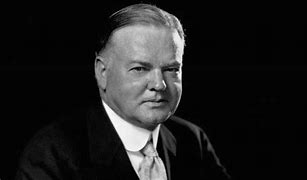

title:: 072 Herbert Hoover: Blamed

- ## 072 Herbert Hoover: Blamed
- ## pure
  collapsed:: true
	- VOA Learning English presents America's Presidents.
	- Today we are talking about Herbert Hoover. He took office in 1929.
	- Hoover was president for the early years of what Americans call the Great Depression. During those years, the United States economy slid into a severe recession.
	- Many banks and businesses failed. At times, nearly one in four people in the U.S. workforce were unemployed. Millions of people lost their homes and savings.
	- Hoover did not cause the depression. The conditions had been in place before he took office.
	- But many Americans blamed Hoover for their suffering. They believed he permitted the economic crisis to continue – and even deepen – during his time in office.
	- ## Early life
	- Herbert Hoover was born in a small house in the state of Iowa. His parents were Quakers. Their religion valued simplicity, hard work, equality among people, and peaceful resolution of conflict.
	- Hoover and his brother and sister were influenced by these beliefs, even after their parents died.
	- By the time young Herbert Hoover was nine, he was an orphan. He moved to the state of Oregon, in the Pacific Northwest, and lived with an uncle.
	- Hoover did not thrive in that situation. Reports say that he usually kept to himself. And he did not do particularly well in school.
	- Yet one official from Stanford University liked what he saw in the young man – hard work and a desire to learn new things. At the time, Stanford University was just getting established. It admitted Hoover into its first class.
	- Hoover had to work hard at Stanford, both in class and to earn money to pay tuition. But the experience brought many benefits.
	- Hoover studied geology, and went on to work as a mining engineer. The job led to positions in Australia, China and other parts of the world. He became an internationally-known expert on mining. He also wrote a leading textbook on mining.
	- These experiences, along with good business investments, led to great wealth for Hoover.
	- At Stanford, he also met the woman who would become his wife. Her name was Lou Henry. She was the first woman from Stanford to complete a study program with a degree in geology.
	- The Hoovers went on to have two sons.
	- ## Humanitarian work
	- During World War I, the Hoovers' lives changed dramatically. The family was living in London when the war began. U.S. government officials asked Hoover to organize an evacuation effort for American tourists who were in Europe. In only a few weeks, Hoover's committee succeeded.
	- Later, he helped get food and supplies to people in Belgium.
	- As a result, Hoover earned a public image as a smart, skilled humanitarian.
	- When the United States entered World War I, President Woodrow Wilson asked Hoover to lead the government's Food Administration.
	- In that position, Hoover led an effort to change Americans' behavior in order to support the war effort. He asked them to limit the kinds of food they ate and goods they bought.
	- The effort was, for the most part, successful. Americans called their moves to limit their consumption "to Hooverize."
	- Hoover went on to organize programs to aid other countries, including Russia. He also helped parts of the U.S. recover after terrible flooding.
	- And, as secretary of commerce, he pushed businesses, researchers, and government officials to work together. Hoover aimed to reduce "boom and bust" cycles and keep the U.S. economy healthy.
	- In all his efforts, Hoover urged Americans to choose to participate. He did not believe in using government requirements to force cooperation.
	- Instead, he supported "individualism" – the idea that Americans must protect the qualities of creativity, equal opportunity, and service to others.
	- Hoover's beliefs were popular with many Americans at the time – and with many Americans today.
	- In the election of 1928, Hoover easily won the presidency. He promised to continue leading the country down the path of prosperity.
	- ## Presidency
	- When Hoover took office in 1929, he said, "I have no fears for the future of our country. It is bright with hope."
	- That was in March.
	- In October, the U.S. stock market crashed. Thousands of investors lost their savings.
	- The event was part of a sharp downturn in the economies of the United States and of many other countries.
	- At first, Hoover believed the downturn would pass. But as time went on, the situation grew worse. Businesses could not expand their workforce. Farmers could not afford to harvest their crops. Everyday people had too little money to pay for housing costs and, in some cases, food. And then banks across the country began to fail.
	- President Hoover worked hard to fix the problems. He tried many approaches: creating government agencies, urging private and public groups to cooperate, and working to balance the federal budget.
	- But Hoover did not want to use federal money to provide direct aid to Americans. He worried that such actions would make people dependent on the government, and reduce people's individual power and morale.
	- Nor did he want to use the federal government to try to control the economy. Government intervention, he said, would lead to socialism, and eventually destroy the country's founding beliefs.
	- Instead, Hoover tried to support states and businesses indirectly and urged people to find ways to help one another.
	- Yet many lawmakers and members of the public rejected Hoover's measures as insufficient, and even cruel.
	- Some used his name differently than they had before he took office. Now, they called the dirty shelters where hungry and homeless people lived "Hoovervilles."
	- And they called men's empty pockets "Hoover flags."
	- Although Hoover tried to persuade Americans that he was protecting their interests in the long run, voters refused to elect him for a second term.
	- Instead, they overwhelming chose a president who promised an activist federal government and a hopeful "new deal" for Americans.
	- ## Legacy
	- After they left the White House, the Hoovers retired to their home in Palo Alto, California.
	- Lou Henry Hoover died in 1944. But Hoover lived 20 more years, many of them working for the public good. He helped international relief efforts, advised the U.S. government, and led committees to reform the presidency.
	- Hoover also commented on later presidents and their policy decisions. He was especially critical of government programs set up to provide aid and intervention in Americans' lives.
	- Until his death from cancer at the age of 90, Hoover remained committed to his beliefs. He spoke for limiting the power of the federal government and for supporting freedom of opportunity for individuals.
	- But in the eyes of many Americans, Hoover is linked to the failure of the federal government to lessen the Great Depression.
- ---
- ## def
	- VOA Learning English presents America's Presidents.
	- Today we are talking about Herbert Hoover. He took office in 1929.
		- > ▶ Herbert Hoover
		  
	- Hoover was president for the early years of what Americans call the Great Depression. During those years, the United States economy /slid into a severe recession.
	- Many banks and businesses failed. At times, nearly **one in four** people in the U.S. workforce /were unemployed. Millions of people /lost their homes and savings.
		- > ▶ workforce : all the people who work for a particular company, organization, etc. 全体员工 /all the people in a country or an area who are available for work （国家或行业等的）劳动力，劳动大军，劳动人口
	- Hoover did not cause(v.) the depression. The conditions had been in place /before he took office.
	- But many Americans blamed Hoover /for their suffering. They believed /he permitted the economic crisis to continue – and even deepen – during his time in office.
	- ## Early life
	- Herbert Hoover was born /in a small house in the state of Iowa. His parents were Quakers. Their religion valued(v.) simplicity, hard work, equality among people, and peaceful resolution(n.) of conflict.
		- > ▶ Quaker (n.) a member of the Society of Friends, a Christian religious group /that meets without any formal ceremony /and is strongly opposed to violence and war 贵格会教徒，公谊会教徒 （属于基督教派，废除礼仪，反对暴力和战争）
		  => 基督教分支Religious Society of Friends的别称。来自quake,颤抖，即在上帝前颤抖之意，来自该教创始人对其教徒的警告和规劝”tremble at the Word of the Lord”.
		- > ▶ resolution [ Using. ] the act of solving or settling a problem, disagreement, etc. （问题、分歧等的）解决，消除
		  + /[ C ] a formal statement of an opinion /agreed on by a committee or a council, especially by means of a vote 决议；正式决定
		  + /~ (to do sth) a firm decision to do or not to do sth 决心；决定
		- 他们的宗教重视简单、努力工作、人与人之间的平等, 以及和平解决冲突。
	- Hoover and his brother and sister /were influenced by these beliefs, even after their parents died.
	- By the time /young Herbert Hoover was nine, he was an orphan. He moved to the state of Oregon, in the Pacific Northwest, and lived with an uncle.
		- 小赫伯特·胡佛9岁时成了孤儿。
	- Hoover did not thrive in that situation. Reports say that /he usually kept to himself. And he did not do particularly well in school.
		- > ▶ thrive (v.)[ V ] to become, and continue to be, successful, strong, healthy, etc. 兴旺发达；繁荣；蓬勃发展；旺盛；茁壮成长
		- 胡佛在那种情况下没有很好的茁壮成长。报道称他通常不与人交往。他在学校的表现也不是特别好。
	- Yet one official from Stanford University /liked what he saw in the young man – hard work /and a desire to learn new things. At the time, Stanford University was just getting established. It admitted Hoover into its first class.
		- 然而，斯坦福大学的一位官员很喜欢他在这个年轻人身上看到的东西——努力工作和学习新事物的渴望。当时，斯坦福大学刚刚成立。它允许胡佛进入第一个班级。
	- Hoover had to work hard at Stanford, **both** in class **and** to earn money to pay tuition. But the experience /brought many benefits.
	- Hoover studied geology, and went on /to work as a mining engineer. The job led to positions in Australia, China and other parts of the world. He became an internationally-known expert /on mining. He also wrote a leading textbook /on mining.
		- > ▶ geology [ U ] the scientific study of the earth, including the origin and history of the rocks and soil of which the earth is made 地质学
	- These experiences, along with good business investments, led to great wealth for Hoover.
	- At Stanford, he also met the woman /who would become his wife. Her name was Lou Henry. She was the first woman from Stanford /to complete a study program /with a degree in geology.
	  id:: 5bfc82f9-0b39-4d2f-a204-96f81ead9f65
		- > ▶ study program 研究项目, 研究大纲, 调查计划
		- 她是第一个从斯坦福大学获得地质学学位的女性。
	- The Hoovers went on /to have two sons.
	- ## Humanitarian work
	- During World War I, the Hoovers' lives(n.) changed dramatically. The family was living in London /when the war began. U.S. government officials asked Hoover to organize an evacuation effort /for American tourists /who were in Europe. In only a few weeks, Hoover's committee succeeded.
		- > ▶ humanitarian (a.) [ usually before noun ] concerned with reducing suffering and improving the conditions that people live in 人道主义的（主张减轻人类苦难、改善人类生活）；慈善的
		- > ▶ evacuation  n. 撤离，疏散；（粪便等的）排泄；排空，清除
		- > ▶ tourist : a person who is travelling or visiting a place for pleasure 旅游者；观光者；游客
		- > ▶ committee  N-COUNT-COLL A committee is a group of people who meet to make decisions or plans for a larger group or organization that they represent. 委员会
	- Later, he helped /get food and supplies to people in Belgium.
		- > ▶ Belgium n. 比利时（西欧国家，首都布鲁塞尔 Brussels）
	- As a result, Hoover earned a public image as a smart, skilled humanitarian.
	- When the United States /entered World War I, President Woodrow Wilson asked Hoover to lead the government's Food Administration.
		- > ▶ Food Administration 食品管理局
	- In that position, Hoover led an effort /to change Americans' behavior /in order to support the war effort. He asked them to limit the kinds of food they ate /and goods they bought.
		- 在那个职位上，胡佛努力改变美国人的行为，以支持战争。他要求他们限制吃的食物和买的商品的种类。
	- The effort was, for the most part, successful. Americans called their moves(n.) to limit their consumption /宾补 "to Hooverize."
		- 美国人把他们限制消费的举措, 称为“胡佛化”。
	- Hoover went on /to organize programs /to aid other countries, including Russia. He also helped parts of the U.S. recover /after terrible flooding.
		- 他还帮助美国的部分地区, 在严重的洪灾后进行恢复。
	- And, as **secretary of commerce**, he pushed businesses, researchers, and government officials /to work together. Hoover aimed to reduce "boom and bust" cycles /and keep the U.S. economy healthy.
		- > ▶ bust (v.)(n.) to break sth 打破；摔碎 /( especially NAmE ) to make sb lower in military rank as a punishment （使）降级，降低军阶
		  -> The lights are busted. 灯泡被砸碎了。
		- > ▶ boom and bust 繁荣与萧条, 繁荣与崩溃, 大起大落
		- 胡佛的目标是减少“繁荣和萧条”的周期，保持美国经济的健康。
	- In all his efforts, Hoover urged Americans to choose to participate. He did not believe in /using government requirements to force(v.) cooperation.
		- 胡佛尽其所能，敦促美国人选择参与。他不相信利用政府的要求来强迫合作。
	- Instead, he supported "individualism" – the idea /that Americans must protect the qualities of creativity, equal opportunity, and service to others.
		- > ▶ individualism  (n.) **the belief** /that individual people in society /should have the right /to make their own decisions, etc., rather than be controlled by the government 个人主义；个人至上
		  + /**the quality** of being different from other people /and doing things in your own way 个性；独特的气质
		- 相反，他支持“个人主义”，即美国人必须保护创造力、平等机会, 和为他人服务的品质。
	- Hoover's beliefs were popular with many Americans at the time – and with many Americans today.
	- In the election of 1928, Hoover easily won the presidency. He promised /to continue leading the country /down the path of prosperity.
		- 他承诺继续带领国家走上繁荣之路。
	- ## Presidency
	- When Hoover took office in 1929, he said, "I have no fears /for the future of our country. It is bright with hope."
	- That was in March.
	- In October, the U.S. stock market crashed. Thousands of investors /lost their savings.
	- The event was part of a sharp downturn /in the economies of the United States /and of many other countries.
		- > ▶ downturn (n.) ~ (in sth) a fall in the amount of business that is done; a time when the economy becomes weaker （商业经济的）衰退，下降，衰退期
		  -> a downturn in sales/trade/business 销量╱贸易╱营业额下降
	- At first, Hoover believed /the downturn would pass. But as time went on, the situation grew worse. Businesses could not expand their workforce. Farmers could not afford to harvest(v.) their crops. Everyday people had too little money to pay for housing costs and, in some cases, food. And then banks across the country /began to fail.
		- > ▶ harvest (v.) [ V VN ] to cut and gather a crop; to catch a number of animals or fish to eat 收割（庄稼）；捕猎（动物、鱼）
		  + /[ V VN ] to cut and gather a crop; to catch a number of animals or fish to eat 收割（庄稼）；捕猎（动物、鱼）
	- President Hoover /worked hard to fix the problems. He tried many approaches: creating government agencies, urging private and public groups /to cooperate, and working to balance the federal budget.
		- 他尝试了许多方法:创建政府机构，敦促私人和公共团体合作，努力平衡联邦预算。
	- But Hoover did not want to use federal money /**to provide** direct aid **to** Americans. He worried that /such actions would make people dependent on the government, and reduce people's individual power and morale.
	- Nor did he want to use the federal government /to try to control the economy. `主` Government intervention, he said,`谓`  would lead to socialism, and eventually destroy the country's founding beliefs.
		- > ▶ socialism [ U ] a set of political and economic theories /based on the belief /that everyone has an equal right /to a share of a country's wealth /and that the government should own and control the main industries 社会主义
		- 他也不想利用联邦政府来控制经济。他说，政府的干预将导致社会主义，并最终摧毁这个国家的建国信念。
	- Instead, Hoover tried **to support** states and businesses **indirectly** /and urged people to find ways /to help one another.
		- 相反，胡佛试图间接地来支持各州和企业，并敦促人们找到相互帮助的方法。
	- Yet many lawmakers and members of the public /rejected Hoover's measures /as insufficient, and even cruel.
		- > ▶ insufficient (a.)~ (to do sth) |~ (for sth) : not large, strong or important enough for a particular purpose 不充分的；不足的；不够重要的
		- 然而，许多立法者和公众成员反对胡佛的措施，认为其不够充分，甚至残忍。
	- Some **used** his name **differently**/ than they had before he took office. Now, they called the dirty shelters /where hungry and homeless people lived /宾补 "Hoovervilles."
		- 一些人在使用他的名字的方法上, 就与他在上任前不同了。现在，他们把饥饿和无家可归的人住的肮脏的庇护所, 称为“胡佛村”。
	- And they called men's empty pockets /宾补 "Hoover flags."
		- 他们把男人的空口袋叫做“胡佛旗”。
	- Although Hoover tried to persuade Americans that /he was protecting their interests /in the long run, voters refused to elect him for a second term.
		- > ▶ **in the long run** 从长远来看, 从长远说来
		- > ▶ run [ C ] a trip by car, plane, boat, etc., especially a short one /or one that is made regularly （尤指短程或定期，乘交通工具的）旅程，航程
		  -> They took the car out **for a run**. 他们乘汽车出去旅行。
		  + /[ sing. ] the ~ of sth : the way /things usually happen; the way /things seem to be happening /on a particular occasion 态势；状况；趋势；动向
		  -> Wise scored in the 15th minute /against **the run of play** (= although the other team had seemed more likely to score) . 怀斯在比赛进行到15分钟的时候出人意料地得分。
		- 尽管胡佛试图说服美国人，他是在保护他们的长远利益，但选民们拒绝选举他连任。
	- Instead, they overwhelming chose(v.) a president /who **promised** an activist federal government /and a hopeful "new deal" /**for** Americans.
		- > ▶ new deal : N the domestic policies of Franklin D. Roosevelt for economic and social reform 新政; 罗斯福进行的经济和社会改良国家政策
	- ## Legacy
	- After they left the White House, the Hoovers retired to their home /in Palo Alto, California.
	- Lou Henry Hoover died in 1944. But Hoover lived 20 more years, many of them /working for **the public good**. He helped international **relief efforts**, advised the U.S. government, and led committees to reform the presidency.
		- > ▶ public good 公益事业
		- 其中许多年都在为公众服务。他帮助国际救援工作，为美国政府提供建议，并领导委员会改革总统职位。
	- Hoover also **commented on** later presidents /and their policy decisions. He was especially **critical(a.) of** ①government programs /set up to provide aid /and ②intervention in Americans' lives.
		- > ▶ **critical (a.) ~ (of sb/sth)** : expressing disapproval of sb/sth and saying what you think is bad about them 批评的；批判性的；挑剔的
		  + /extremely important because a future situation will be affected by it 极重要的；关键的；至关紧要的
		- 胡佛还评论了后来的总统和他们的政策决定。他尤其批评政府"为美国人的生活提供援助和干预"的项目。
	- Until his death from cancer /at the age of 90, Hoover remained **committed to** his beliefs. He **spoke for** limiting the power of the federal government /and **for** supporting freedom of opportunity for individuals.
		- > ▶ **commit (v.) ~ (to sb/sth)** : to be completely loyal to one person, organization, etc. or give all your time and effort to your work, an activity, etc. 忠于（某个人、机构等）；全心全意投入（工作、活动等）
		  + /**~ sb/yourself (to sth/to doing sth)** :[ often passive ] to promise sincerely that you will definitely do sth, keep to an agreement or arrangement, etc. 承诺，保证（做某事、遵守协议或遵从安排等）
		- 直到他90岁死于癌症，胡佛仍然坚持他的信仰。他主张限制联邦政府的权力，支持个人的机会自由。
	- But in the eyes of many Americans, Hoover is linked to the failure of the federal government /to lessen the Great Depression.
	-