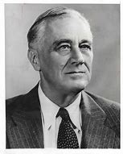

title:: 073 Franklin D. Roosevelt: Powerful

- ## 073 Franklin D. Roosevelt: Powerful
- ## pure
  collapsed:: true
	- VOA Learning English presents America's Presidents.
	- Today we are talking about Franklin Delano Roosevelt. He was related to an earlier president with same last name, Theodore Roosevelt. Many Americans call Franklin Roosevelt by the first letter of each word in his full name: FDR.
	- When FDR took office, the United States was in a severe economic depression. The previous president, Herbert Hoover, had tried to improve the economy, but his efforts had failed.
	- FDR defeated Hoover in the election of 1932. He won, in part, by promising what he called a "new deal" for Americans.
	- Voters did not know what FDR's "new deal" meant exactly, but many liked his message of hope.
	- Voters also did not know how much FDR would change the country. He remained in office for 12 years – the longest of any U.S. president – and led the country through the Great Depression and most of World War II.
	- Along the way, he changed the way government affected Americans' lives, and the job of the U.S. president.
	- ## Early life
	- Franklin Roosevelt was born on a large estate in New York, about 140 kilometers outside New York City. He was the only child of wealthy parents.
	- His mother and father made sure he had an excellent education. As a young man he attended a private high school, and then Harvard College in Massachusetts. He also studied law at Columbia University in New York.
	- Young FDR was not an excellent student, however. He was interested in many things outside the classroom, including politics and girls.
	- Two of FDR's interests came together in a young woman named Anna Eleanor Roosevelt, who went by the name Eleanor. She was the niece of a politician FDR greatly respected: President Theodore Roosevelt.
	- On the day when Franklin and Eleanor Roosevelt were married, Theodore Roosevelt attended the ceremony. In fact, he walked with his niece in front of the guests to her future husband.
	- Franklin and Eleanor Roosevelt went on to have six children, although one died as a baby.
	- While Eleanor Roosevelt raised the children, Franklin Roosevelt directed his attention to politics.
	- He left a job in a law office to serve in the New York state senate. In time, he was offered a job in the federal government as an assistant secretary of the Navy.
	- FDR enjoyed the job, but he continued seeking other political positions. He tried unsuccessfully for a seat in the U.S. Senate, but did get nominated by the Democratic Party to be its vice presidential candidate in 1920.
	- Although he and his partner lost the race, FDR seemed like he was in a good position for major political success.
	- But then something unexpected happened.
	- ## Illness and return to politics
	- When he was 39 years old, FDR suffered major health problems. One day he started to feel a pain in his back. The following day his legs grew tired. Then his skin became sensitive.
	- By the end of the week, both his legs were paralyzed. He could not move from the waist down. He remained paralyzed for the rest of his life.
	- The next years were difficult for the Roosevelts. Eleanor and the children helped care for FDR. And he worked hard to recover some of his strength and physical abilities, especially by exercising.
	- While he remained hopeful about his condition, FDR worried about his political career. He did not think the public would accept a leader who could not even walk by himself. So he took several measures.
	- He created a small wheelchair that would not get too much attention. It was made from a dining room chair, with wheels instead of legs.
	- He refused to let photographers take pictures of him being carried or struggling to move, and he found a way to appear as if he were walking. He used a cane or the arm of a partner to balance, and then he swung his hips to make his legs move forward.
	- Using this method, FDR "walked" to the stage at the 1924 Democratic National Convention. He used the event to nominate the governor of New York for president.
	- That man's bid did not succeed. But FDR showed himself to still be an able politician.
	- Four years later, FDR himself was elected governor of New York. He held the position in the early years of the country's economic crisis.
	- In 1932, FDR was a candidate for president. He took the unusual step of appearing in person at the Democratic convention to accept his party's nomination.
	- His campaign was such a success that the Democrats took not only the White House, but majorities in both the U.S. Senate and House of Representatives.
	- The strength of the Democratic Party in Congress would help FDR become one of the most powerful presidents the country had ever seen.
	- Next week we will continue our story of FDR and his presidency.
- ---
- ## def
	- VOA Learning English presents America's Presidents.
	- Today we are talking about Franklin Delano Roosevelt. He was related to an earlier president with same last name, Theodore Roosevelt. Many Americans **call** Franklin Roosevelt /**by** the first letter of each word /in his full name: FDR.
		- > ▶  Franklin Delano Roosevelt
		  
		- 许多美国人以富兰克林·罗斯福的全名中每个单词的首字母, 来称呼他:FDR。
	- When FDR took office, the United States was in a severe economic depression. The previous president, Herbert Hoover, had tried to improve the economy, but his efforts had failed.
	- FDR defeated Hoover in the election of 1932. He won, in part, by promising what he called a "new deal" for Americans.
	- Voters did not know /what FDR's "new deal" meant exactly, but many liked(v.) his message of hope.
	- Voters also did not know /how much FDR would change the country. He remained in office /for 12 years – the longest of any U.S. president – and led the country /through the Great Depression and most of World War II.
	- Along the way, he changed the way /government affected Americans' lives, and the job of the U.S. president.
		- 在这个过程中，他改变了政府影响美国人生活的方式.
	- ## Early life
	- Franklin Roosevelt was born /on a large estate in New York, about 140 kilometers outside New York City. He was the only child of wealthy parents.
		- > ▶ estate  [ C ] a large area of land, usually in the country, that is owned by one person or family （通常指农村的）大片私有土地，庄园
		  + /( law 律 ) [ CU ] all the money and property that a person owns, especially everything that is left when they die 个人财产；（尤指）遗产
	- His mother and father /made sure he had an excellent education. As a young man /he attended a private high school, and then Harvard College in Massachusetts. He also studied law /at Columbia University in New York.
	- Young FDR was not an excellent student, however. He was interested in many things outside the classroom, including politics and girls.
	- Two of FDR's interests came together in a young woman named Anna Eleanor Roosevelt, who went by the name Eleanor. She was the niece of a politician /FDR greatly respected: President Theodore Roosevelt.
		- > ▶ go by : ( of time 时间 ) ( of time 时间 ) to pass 流逝；过去
		  -> Things will get easier as time goes by . 随着时间的推移情况会有所改善。
	- 罗斯福的两个兴趣集中在一个名叫安娜·埃莉诺·罗斯福的年轻女子身上，她被称为埃莉诺。她是深受罗斯福尊敬的政治家西奥多·罗斯福总统的侄女。
	- On the day /when Franklin and Eleanor Roosevelt were married, Theodore Roosevelt attended the ceremony. In fact, he **walked** with his niece /in front of the guests /**to** her future husband.
	- Franklin and Eleanor Roosevelt /went on /to have six children, although one died /as a baby.
	- While Eleanor Roosevelt raised the children, Franklin Roosevelt /**directed** his attention **to** politics.
	- He left a job in a law office /to serve in the New York state senate. In time, he was offered a job in the federal government /as **an assistant secretary** of the Navy.
		- 助理部长
	- FDR enjoyed the job, but he continued seeking other political positions. He tried unsuccessfully for a seat in the U.S. Senate, but did get nominated by the Democratic Party /to be its vice presidential candidate in 1920.
	- Although he and his partner /lost the race, FDR **seemed like** /he was in a good position /for major political success.
		- 虽然他和他的搭档输了，但罗斯福似乎处于有利的位置，可以在政治上取得重大成功。
	- But then /something unexpected happened.
	- ## Illness and return to politics
	- When he was 39 years old, FDR suffered major health problems. One day /he started to feel a pain in his back. The following day /his legs grew tired. Then his skin became sensitive.
		- > ▶ tired (a.) feeling that you would like to sleep or rest; needing rest 疲倦的；疲劳的；困倦的
	- By the end of the week, both his legs were paralyzed. He could not move /from the waist down. He remained paralyzed /for the rest of his life.
		- 他腰部以下动弹不得。
	- The next years were difficult for the Roosevelts. Eleanor and the children helped **care for** FDR. And he worked hard /to recover some of his strength and physical abilities, especially by exercising.
	- While he remained hopeful about his condition, FDR worried about his political career. He did not think /the public would accept a leader /who could not even walk by himself. So he took several measures.
	- He created a small wheelchair /that would not get too much attention. It was made from a dining room chair, with wheels instead of legs.
		- 用轮子代替了腿。
	- He refused to let photographers take pictures of him **being carried** or struggling to move, and he found a way /to appear **as if** he were walking. He used a cane or the arm of a partner /to balance, and then he swung his hips /to make his legs move forward.
		- > ▶ cane  [ C ] a piece of cane or a thin stick, used to help sb to walk 竹杖；藤杖；手杖
		- 他拒绝让摄影师拍他被抬着或挣扎着移动的照片，他找到了一种看起来像在走路的方式。他用手杖或同伴的手臂, 来保持自己的平衡，然后他摆动臀部使腿向前移动。
	- Using this method, FDR "walked" to the stage /at the 1924 Democratic National Convention. He used the event /to nominate the governor of New York /for president.
		- 他利用这次活动, 提名纽约州州长为总统候选人。
	- That man's bid /did not succeed. But FDR showed himself /to still be an able politician.
		- > ▶ bid (n.)(v.)  出（价）；（尤指拍卖中）喊价 / ~ (for sth)(NAmE) ~ (on sth) to offer to do work or provide a service for a particular price, in competition with other companies, etc. 投标
		  + /[ V to inf ] ( used especially in newspapers 尤用于报章 ) to try to do, get or achieve sth 努力争取；企图获得
	- Four years later, FDR himself was elected governor of New York. He held the position /in the early years of the country's economic crisis.
	- In 1932, FDR was a candidate for president. He took the unusual step of /appearing **in person** /at the Democratic convention /to accept his party's nomination.
		- 亲自出现在
	- His campaign was **such** a success /**that** the Democrats took **not only** the White House, **but** majorities /in both the U.S. Senate and House of Representatives.
		- 他的竞选是如此成功，以至于民主党不仅赢得了白宫，而且在美国参众两院都获得了多数席位。
	- The strength of the Democratic Party in Congress /would help FDR become one of the most powerful presidents /the country had ever seen.
	- Next week /we will continue our story of FDR /and his presidency.
	-