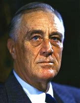

- ## 074 Franklin Roosevelt: Powerful (Part 2)
- ## pure
  collapsed:: true
	- VOA Learning English presents America's Presidents.
	- Today we are talking about Franklin Delano Roosevelt. Earlier we told about his rise to power, and his health problems. When he was 39 years old, FDR – as he was often called – became paralyzed from the waist down. He was never able to walk independently again.
	- But that did not prevent him from becoming one of the country's most powerful presidents.
	- ## Presidency: The Great Depression and the New Deal
	- When FDR took office, the United States was in a severe economic depression. Many farmers were not able to sell their crops for profit. Banks across the country had failed. A number of Americans lost their savings and their homes. And more than 25% of the workforce did not have a job.
	- Yet when FDR took office in 1933, he told people, "The only thing we have to fear is fear itself."
	- When Americans think of FDR, they often think of that statement. It showed his spirit of hope and confidence for which he became known.
	- Americans also remember FDR for the way he began his presidency. In his first 100 days, he signed more than 70 bills into law. Some led to major changes in the country. They helped calm the country's banking industry, provided federal aid directly to farmers and the unemployed, and created public works programs.
	- The acts formed the base of what FDR and others called the New Deal.
	- Some New Deal programs – including the Civilian Conservation Corps and the Tennessee Valley Authority – created government-funded jobs. In addition to providing a paycheck for workers, the programs were meant to improve and care for the country's natural resources. For example, workers planted trees, made roads, and built dams and power plants.
	- Americans continue to experience the effects of these programs today.
	- FDR is also remembered for the way he communicated with the public. At that time, as many as 90% of Americans owned a radio. So, from time to time, FDR spoke to the public on radio broadcasts that became known as "fireside chats."
	- The term created an image of the president sitting comfortably near a fireplace, talking informally with a few close friends. In fact, FDR gave these talks from his office in the White House. But his voice was warm, and he spoke in an easy, conversational way to listeners, whom he called "my friends."
	- The combination of FDR's hope, energy, and affectionate concern for everyday Americans made him popular with many voters. He was re-elected easily in 1936.
	- But FDR had critics, too. Some pointed out that many of his programs failed. They cost a lot of money or were simply not effective.
	- Others said that FDR's policy of massive government intervention was not American. It restricted capitalism and the free market.
	- Still others observed that FDR's programs did not help everyone equally. Many New Deal programs aimed to put young, white American men to work. Women, racial minorities, and older Americans were often overlooked.
	- Critics and supporters alike also noted that FDR greatly expanded the power of the presidency. He added a number of full-time positions to the executive branch of government. And he took on the power of Congress to make laws.
	- Even the Supreme Court found that FDR had, in some cases, gone too far. It ruled that some of his actions were illegal.
	- FDR worried that the Supreme Court would block many of his other New Deal programs, too. So he proposed a rule. It would give the president power to appoint six new members to the nine-member court. His appointments would almost certainly make sure that his New Deal programs could continue.
	- Many historians point to FDR's efforts at "court-packing" as one of the most extreme examples of his attempts to expand presidential power.
	- But Congress did not accept FDR's proposal. Nine justices remained on the Supreme Court.
	- However, those justices went on to approve FDR's actions anyway. They supported programs such as Social Security, which was set up to help older adults, disabled people, and others who needed support; and the Wagner Act, which permitted workers to organize in a trade union.
	- While these efforts and other programs were important parts of FDR's reform efforts, they did not stop the Great Depression. None of the New Deal programs really did. The economy continued to struggle.
	- ## Presidency: Declaration of war
	- For several years, the president had been warning lawmakers and other Americans about the political forces in Japan, Germany, and Italy. Leaders in those countries supported nationalist movements and had already invaded or taken control of other areas.
	- By 1941, more than 30 countries were involved in the conflict.
	- Many Americans had wanted the U.S. to remain neutral. They regretted becoming involved in World War I. For years, they had taken steps to prevent another major international conflict. Lawmakers had even banned the U.S. government from selling or giving weapons to warring countries.
	- But FDR believed World War II was different. He believed that Germany was the clear aggressor and needed to be stopped.
	- So, in the 1930s, FDR received permission from Congress to provide weapons to the countries opposing Germany. After Germany took control of France, FDR received permission to give direct military aid to Britain.
	- In addition, FDR began preparing the U.S. military for war.
	- On December 7, 1941, Japanese forces bombed American ships at the U.S. Navy base in Pearl Harbor, Hawaii. More than 2,400 Americans died at Pearl Harbor, and more than 1,700 were wounded.
	- The day after Pearl Harbor was attacked, Congress quickly approved FDR's request to declare war against Japan.
	- Three days later, Germany and Italy declared war on the United States. American lawmakers responded in kind. The U.S., which had remained neutral for many years, was now completely involved in World War II.
	- ## Presidency: World War II
	- During the war, FDR directed much of his attention to what would happen after the fighting stopped. He wanted to create an international order that would improve peace and cooperation. To that end, he helped organize 26 countries into a group he called the United Nations.
	- FDR also believed that the world's future security depended, in large part, on cooperation between the U.S. and the Soviet Union. He worked hard to create friendly relations with the Soviet leader, Joseph Stalin.
	- Stalin, FDR, and British prime minister Winston Churchill all famously met at the Russian town of Yalta.
	- There, the three men discussed plans to bring World War II to an end. They decided to demand that Germany surrender unconditionally. They also talked about diplomatic relations after the war ended.
	- At the time, many Americans believed the Yalta conference was a success. Soviet officials agreed to enter the war against Japan. In return, U.S. officials said the Soviet government could re-gain control over parts of Northeastern China. Soviet officials also agreed to let countries in Eastern Europe hold free elections, and to share rights to veto U.N. decisions.
	- In the eyes of many Americans, the Yalta agreement showed that the United States and the Soviet Union would be able to cooperate.
	- ## Legacy
	- FDR did not live to see the effects of the Yalta agreement, or even the end of the conflict.
	- He had been president for 12 years. A few weeks before the Yalta Conference, he had been sworn-in yet again.
	- FDR had already served longer than any U.S. president. All others before him had followed the custom set by the first president, George Washington. They had served no more than two terms.
	- In the winter of 1944, FDR was beginning his fourth term. But people close to him said he did not look well. Doctors also warned Roosevelt that his health was suffering.
	- So, in April, FDR went to a warm water resort in Georgia where he often rested and recovered his strength. There, he suffered a cerebral hemorrhage. In other words, his brain began to bleed.
	- World leaders, including Stalin and Churchill, said they were shocked he had died. Many Americans felt the same. They stood alongside train tracks as his body was carried from Georgia to his childhood home in New York.
	- He is buried there, at Hyde Park. In 1962, his wife Eleanor died and was buried next to him.
	- Today, Franklin and Eleanor Roosevelt are important figures in U.S. history. Many programs from the New Deal are still in effect now. FDR also changed the position of president into an active, powerful leader who legally intervenes in the economy and seems to have a personal relationship with Americans.
	- And Eleanor Roosevelt developed a strong voice of her own. Her humanitarian efforts and work on behalf of civil rights and women's rights have given her a legacy independent from her husband.
	- Both admirers and critics point to the Roosevelts' influence as evidence of their strong feelings about the couple.
- ---
- ## def
	- VOA Learning English presents America's Presidents.
	- Today we are talking about Franklin Delano Roosevelt. Earlier /we told about his rise to power, and his health problems. When he was 39 years old, FDR – as he was often called – became paralyzed /from the waist down. He was never able to walk independently again.
		- > ▶ Franklin Delano Roosevelt
		  
	- But that did not prevent him from becoming one of the country's most powerful presidents.
	- ## Presidency: The Great Depression and the New Deal
	- When FDR took office, the United States /was in a severe economic depression. Many farmers /were not able to sell their crops for profit. Banks across the country /had failed. A number of Americans /lost their savings and their homes. And more than 25% of the workforce /did not have a job.
	- Yet when FDR took office in 1933, he told people, "The only thing we have to fear /is fear itself."
	- When Americans **think of** FDR, they often **think of** that statement. It showed his spirit of **hope and confidence** /for which he became known.
	- 这显示了他的希望和信心, 这些精神，他因此而出名。
	- Americans also remember FDR /for the way he began his presidency. In his first 100 days, he signed more than 70 bills into law. Some led to major changes in the country. They helped calm the country's banking industry, provided federal aid /directly to farmers and the unemployed, and created public works programs.
		- 美国人还记得罗斯福刚就任总统的方式。... 其中一些导致了国家的重大变化。他们帮助稳定了国家的银行业，直接向农民和失业者提供联邦援助，并建立了公共工程项目。
	- The acts formed(v.) the base of what **FDR and others** called **the New Deal**.
		- 这些法案, 构成了罗斯福和其他人所谓的“新政”的基础。
	- Some **New Deal** programs – including **the Civilian Conservation Corps** and the Tennessee **Valley Authority** – created government-funded jobs. **In addition to** providing a paycheck for workers, `主` the programs `系` were meant to improve(v.) and **care for** the country's natural resources. For example, workers planted(v.) trees, made roads, and built(v.) dams and power plants.
		- > ▶ the Civilian Conservation Corps 民间的资源保护组织
		- > ▶ valley (n.)an area of low land between hills or mountains, often with a river flowing through it; the land that a river flows through 谷；山谷；溪谷；流域
		- > ▶ paycheck  N-COUNT Your paycheque is a piece of paper /that your employer gives you /as your wages or salary, and which you can then cash at a bank. You can also use paycheque /as a way of referring to your wages or salary. 工资支票; 工薪
		  
		- 一些新政项目——包括平民保护队和田纳西流域管理局——创造了政府资助的就业机会。除了为工人提供工资，这些项目还旨在改善和保护国家的自然资源。例如，工人们植树、修路、修建水坝和发电厂。
	- Americans continue to experience the effects of these programs today.
	- FDR is also remembered /for the way he communicated with the public. At that time, **as many as** 90% of Americans /owned a radio. So, from time to time, FDR spoke to the public on radio broadcasts /that became known as "fireside chats."
		- > ▶ broadcast (v.)(n.) a radio or television programme 广播节目；电视节目
		- > ▶ fireside  [ usually sing. ] the part of a room beside the fire 炉边
	- The term /created an image of the president /sitting comfortably near a fireplace, talking informally with a few close friends. In fact, FDR gave these talks /from his office in the White House. But his voice was warm, and he **spoke** in an easy, conversational way **to** listeners, whom he called "my friends."
	- The combination of FDR's hope, energy, and affectionate(a.) concern for everyday Americans /made him popular with many voters. He was re-elected easily in 1936.
		- > ▶ affectionate  (a.) showing caring feelings and love for sb 表示关爱的
	- But FDR had critics, too. Some pointed out that /many of his programs failed. They cost a lot of money /or were simply not effective.
	- Others said that /FDR's policy of massive government intervention /was not American. It restricted capitalism and the free market.
		- 还有人说, 罗斯福的大规模政府干预政策, 不是美国风格的。它限制了资本主义和自由市场。
	- Still others observed that /FDR's programs did not help everyone equally. Many New Deal programs /aimed **to put** young, white American men **to work**. Women, racial minorities, and older Americans /were often overlooked.
	- Critics and supporters alike also noted that /FDR greatly expanded the power of the presidency. He **added** a number of full-time positions **to** the executive branch of government. And he **took on the power of** Congress /to make laws.
		- 批评者和支持者都指出，罗斯福极大地扩大了总统的权力。他为政府行政部门增加了一些全职职位。他还掌握了国会制定法律的权力。
	- Even the Supreme Court found that FDR had, in some cases, gone too far. It ruled that some of his actions were illegal.
	- FDR worried that /the Supreme Court would block(v.) many of his other New Deal programs, too. So he proposed a rule. It would give the president power /**to appoint** six new members **to** the nine-member court. His appointments /would almost certainly make sure /that his New Deal programs could continue.
	- Many historians **point to** FDR's efforts at "court-packing" **as** one of the most extreme examples /of his attempts to expand presidential power.
		- 许多历史学家指出，罗斯福试图扩大总统权力的最极端的例子之一, 就是“法庭包装”。
	- But Congress did not accept FDR's proposal. Nine justices /remained on the Supreme Court.
	- However, those justices /went on /to approve FDR's actions anyway. They supported(v.) programs /such as Social Security, which was set up /to help older adults, disabled people, and others /who needed support; and the Wagner Act, which permitted workers /to organize in a trade union.
		- 然而，这些法官还是批准了罗斯福的行动。
	- While these efforts and other programs /were important parts of FDR's reform efforts, they did not stop the Great Depression. None of the New Deal programs really did. The economy continued to struggle.
		- 虽然这些努力和其他计划是罗斯福改革努力的重要组成部分，但它们并没有阻止大萧条。没有一个新政计划真的做到了。经济依然在继续挣扎。
	- ## Presidency: Declaration of war
	- For several years, the president had been **warning** lawmakers and other Americans **about** the political forces in Japan, Germany, and Italy. Leaders in those countries /supported nationalist movements /and had already invaded or taken control of other areas.
		- > ▶ nationalist :  ( sometimes disapproving ) a person who has a great love for and pride in their country; a person who has a feeling that their country is better than any other 民族主义者；怀有本民族优越感者 /a person who wants their country to become independent 国家主义者
	- By 1941, more than 30 countries /were involved in the conflict.
	- Many Americans /had wanted the U.S. /to remain neutral. They regretted /becoming involved in World War I. For years, they had taken steps /to prevent another major international conflict. Lawmakers **had even banned** the U.S. government **from** selling or giving weapons to warring countries.
		- > ▶ warring  (a.) [ only before noun ] involved in a war 战争的；交战的；敌对的
		- 许多美国人希望美国保持中立。他们后悔卷入了第一次世界大战。多年来，他们一直采取措施防止另一场重大国际冲突。议员们甚至禁止美国政府向交战国家出售或提供武器。
	- But FDR believed /World War II was different. He believed that /Germany was the clear aggressor /and needed to be stopped.
		- > ▶ aggressor (n.) a person, country, etc. that attacks first 侵略者；挑衅者
	- So, in the 1930s, FDR received permission from Congress /to provide weapons to the countries /opposing Germany. After Germany took control of France, FDR received permission /to give direct military aid /to Britain.
		- > ▶ oppose (v.) to disagree strongly with sb's plan, policy, etc. and try to change it or prevent it from succeeding 反对（计划、政策等）；抵制；阻挠
		  + /[ VN ] to compete with sb in a contest （在竞赛中）与…对垒，与…角逐
		- 罗斯福获得了国会的许可，向反对德国的国家提供武器。在德国控制法国之后，罗斯福获得了直接向英国提供军事援助的许可。
	- In addition, FDR began preparing the U.S. military for war.
	- On December 7, 1941, Japanese forces /bombed American ships /at the U.S. **Navy base** in Pearl Harbor, Hawaii. More than 2,400 Americans died /at Pearl Harbor, and more than 1,700 were wounded.
	- The day after Pearl Harbor was attacked, Congress quickly approved FDR's request /to declare war against Japan.
	- Three days later, Germany and Italy /declared war on the United States. American lawmakers /responded **in kind**. The U.S., which **had remained neutral** for many years, was now completely **involved in** World War II.
		- ((6260c4be-6bf8-4c48-8a14-456458f1da9b))
	- ## Presidency: World War II
	- During the war, FDR **directed** much of his attention **to** what would happen /after the fighting stopped. He wanted to create **an international order** /that would improve peace and cooperation. **To that end**, he helped organize 26 countries into a group /he called the United Nations.
		- > ▶ To that end 为了那个目的
	- FDR also believed that /the world's future security **depended**, in large part, **on** cooperation /between the U.S. and the Soviet Union. He worked hard /to create friendly relations with the Soviet leader, Joseph Stalin.
	- Stalin, FDR, and British prime minister Winston Churchill /all famously met /at the Russian town of Yalta.
	- There, the three men /discussed plans /to bring World War II to an end. They decided /to demand(v.) that /Germany surrender unconditionally. They also talked about diplomatic relations /after the war ended.
	- At the time, many Americans believed /the Yalta conference was a success. Soviet officials agreed /to enter the war against Japan. In return, U.S. officials said /the Soviet government could re-gain control over parts of Northeastern China. Soviet officials also agreed /to let countries in Eastern Europe /hold free elections, and to share rights to veto U.N. decisions.
	- In the eyes of many Americans, the Yalta agreement showed that /the United States and the Soviet Union /would be able to cooperate.
	- ## Legacy
	- FDR did not live to see the effects of the Yalta agreement, or even the end of the conflict.
	- He had been president for 12 years. A few weeks /before the Yalta Conference, he had been sworn-in yet again.
	- FDR had already served longer than any U.S. president. All others before him /had followed the custom /set by the first president, George Washington. They had served no more than two terms.
	- In the winter of 1944, FDR was beginning his fourth term. But people close to him said /he did not look well. Doctors also warned Roosevelt that /his health was suffering.
	- So, in April, FDR went to a warm water resort(n.) in Georgia /where he often rested and recovered his strength. There, he suffered **a cerebral hemorrhage**. In other words, his brain began to bleed.
		- > ▶ resort [ C ] a place where a lot of people go on holiday/vacation 旅游胜地；度假胜地
		  + /~ to sth : the act of using sth, especially sth bad or unpleasant, because nothing else is possible 诉诸；求助；采取
		  -> There are hopes that /the conflict can be resolved /without resort to violence. 冲突有望不需要诉诸武力而得到解决。
		- > ▶ cerebral : /səˈriːbrəl/  relating to the brain 大脑的；脑的
		  -> a cerebral haemorrhage 脑出血
		  + /( formal ) relating to the mind rather than the feelings 理智的；智力的 SYN intellectual
		  -> His poetry is very cerebral. 他的诗富涵理性。
		  => 来自词根cereb,脑，词源同horn, 角，头。
		- > ▶ hemorrhage  /ˈhemərɪdʒ/ N-VAR A haemorrhage is serious bleeding inside a person's body. 严重内出血  
		  + /V-I If someone is haemorrhaging, there is serious bleeding inside their body. 内出血
		- > ▶ cerebral hemorrhage [内科] 脑出血；大脑出血
		- 于是，4月，罗斯福去了乔治亚州的一个温暖的水上度假村，他经常在那里休息，恢复体力。在那里，他得了脑出血。换句话说，他的大脑开始流血。
	- World leaders, including Stalin and Churchill, said /they were shocked he had died. Many Americans felt the same. They stood alongside train tracks /as his body was carried /from Georgia to his childhood home in New York.
	- He is buried there, at Hyde Park. In 1962, his wife Eleanor died /and was buried next to him.
	- Today, Franklin and Eleanor Roosevelt /are important figures in U.S. history. Many programs from the New Deal /are still in effect now. FDR also **changed** the position of president **into** an active, powerful leader /who legally intervenes(v.) in the economy /and seems to have a personal relationship with Americans.
		- ((6230164d-c724-44bd-bb13-1aa531300c9d))
		- 罗斯福还改变了总统的地位，成为一个积极的、强有力的领导人，他通过法律干预经济，似乎与美国人有私人关系。
	- And Eleanor Roosevelt /developed a strong voice of her own. Her humanitarian efforts /and work on behalf of civil rights and women's rights /have given her a legacy independent from her husband.
		- 埃莉诺·罗斯福发展出了自己强有力的声音。她的人道主义努力以及为民权和妇女权利所做的工作，给了她一份独立于她丈夫的遗产。
	- Both admirers and critics /**point to** the Roosevelts' influence **as** evidence of their strong feelings about the couple.
		- 仰慕者和批评者都指出，罗斯福夫妇的影响力证明了他们对这对夫妇拥有着强烈的感情。
- ---
- Franklin Roosevelt
	- 第32任美国总统. 他远房堂兄西奥多·罗斯福是第26任美国总统，故中文经常称呼富兰克林·罗斯福为“小罗斯福”总统。
	- 他是美国1920至1930年代经济危机和第二次世界大战的中心人物之一。从1933年至1945年间，连续出任四届美国总统，且是唯一连任超过两届的美国总统。
	- 在1930年代经济大萧条期间，罗斯福推行新政, 以提供失业救济与复苏经济. 虽然直到第二次世界大战爆发为止，美国的经济仍未能完全复苏，但是他所发起的一些计划，如联邦存款保险公司（FDIC）、田纳西河谷管理局（TVA）以及证券交易委员会（SEC）等，仍继续在国家的商贸中扮演重要角色。
	- 除此之外，在其任内设立的一些制度，包括社会安全系统和全国劳资关系委员会（NLRB）等等，仍然保留至今。
	- 罗斯福对塑造二战战后世界秩序发挥了关键作用，其影响力在雅尔塔会议及联合国的成立中, 尤其明显。
	- 1945年4月12日，罗斯福因脑溢血在乔治亚州逝世，死后由当时的美国副总统哈里·杜鲁门接任美国总统。
	- 罗斯福被认为是美国历史上最伟大的总统之一，美国在线曾于2005年举办“最伟大的美国人”票选活动，富兰克林·德拉诺·罗斯福, 被选为美国最伟大的人物中的第十位。
	-
	- 1787年制宪会议前后，美国对总统任期及能否连选连任问题, 进行了深入讨论，最终宪法正文未规定总统限任制。华盛顿、杰斐逊等做出榜样，任满两届，即告退休，形成了“总统任期不超过两届”这一不成文的传统。
	- 1933年至1945年，罗斯福连续四次担任总统，打破了这一传统。1947年，美国国会通过宪法第二十二条修正案，以法律的形式确立了“总统任期不超过两届”的传统，该修正案于1951年最终生效。
-