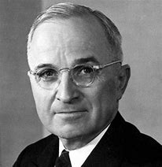

title:: 075 Harry Truman: Atomic

- ## 075 Harry Truman: Atomic
- ## pure
  collapsed:: true
	- VOA Learning English presents America's Presidents.
	- Today we are talking about Harry S. Truman. He became president of the United States in 1945, a few weeks before the end of World War II in Europe.
	- Truman took office after Franklin Roosevelt died suddenly of a cerebral hemorrhage.
	- Roosevelt had been president for 12 years. But Truman was new to the position of vice president. Two other men had earlier served in the office under Roosevelt.
	- On April 12, 1945 – less than three months after he became vice president – Truman was called to the White House. There, Roosevelt's wife, Eleanor, told Truman about her husband's death. Truman was quickly sworn-in as president.
	- Shortly after the ceremony, the secretary of war privately told Truman about a secret project involving American scientists. They were building an extremely destructive atomic bomb.
	- Historians debate whether Truman already knew about the project, or whether the information was a complete surprise.
	- In either case, the new president had to decide whether to use the weapon, which he called "the most terrible bomb in the history of the world."
	- ## Early life
	- Harry Truman came from simple beginnings. He was born in the state of Missouri. He, his parents, a brother and a sister lived in the town of Independence.
	- As a boy, Harry Truman helped his father on the family's farm, but he did not enjoy the work. And he could not play sports because he could not see very well; from the time he was a child, Truman wore eyeglasses.
	- So he developed his interests in reading and music. He was an especially good piano player.
	- Truman was also a good student, but his parents did not have enough money to send him to a four-year college.
	- Instead, Truman worked in a number of jobs, including as a bank clerk, mining company operator, and partner in an oil business.
	- When the United States became involved in World War I, Truman decided to re-join the National Guard. His guard unit became part of the U.S. Army, and Truman earned a position as a captain.
	- Truman experienced real success in the military. He was an able soldier and leader, and he and his troops fought in battle. When the war ended, Truman kept both the feeling of self-confidence and the friendships with the other solders he had formed.
	- One of Truman's first acts after the war was to get married. He married a woman from his hometown. They had been romantically linked for a long time. Her name was Elizabeth Wallace, but she was called Bess. The Trumans remained happily married for more than 50 years and had a daughter named Mary Margaret.
	  In the first years after the war, Harry Truman opened a men's clothing shop with a friend from the military. But the shop – called a haberdashery -- eventually failed.
	- Truman soon found a new line of work. An operative from the Democratic Party asked Truman to be a candidate for a position as a judge.
	- Truman won the seat, as well as a public reputation for being an honest, effective public servant.
	- In time, Truman successfully won election to a seat in the U.S. Senate. For the most part, he earned a good public image there, too. He supported the social programs of President Roosevelt, and he tried to prevent big businesses or large labor unions from misusing public money.
	- Both voters and Democratic officials liked Truman enough to accept him as the party's vice presidential candidate in 1944. Truman performed well as a candidate, but he did not have a close relationship with Roosevelt or play much of a part in his government.
	- Yet in a few weeks, following Roosevelt's death, Truman was leading the country.
	- ## Presidency
	- Truman faced a number of difficult decisions during his two terms as president. Many of them involved foreign policy. His actions helped shape the second half of the 20th century.
	- In his first months after taking office, Truman watched the end of World War II in Europe.
	- He then had to decide how to deal with the war in the Pacific. Japan did not want to accept the Allied forces' demand for total surrender. And Truman did not want to extend the war.
	- So he approved using the atomic bomb on Japan. Truman directed the secretary of war to drop the weapon on military targets and try to reduce civilian deaths. But the destruction was still terrible.
	- An estimated 192,000 people died in the attack or the effects of the bomb in Hiroshima. Most of the city was destroyed.
	- Three days later, the U.S. military dropped another atomic bomb, this time on the city of Nagasaki. More than 70,000 people died instantly.
	- The emperor of Japan called the weapon "a new and most cruel bomb." He agreed to his country's surrender on August 14, 1945. World War II came to an end.
	- Truman and his government quickly had to make other decisions about how to react to the new international situation. One of the most pressing concerns was the Soviet Union.
	- Soviet officials sought to expand their influence around the country's borders, especially in Eastern Europe, Turkey and Iran. Truman and other U.S. officials believed those moves threatened American interests. The United States supported democracy and capitalism. It did not want the Soviet Union's form of communism to spread.
	- So Truman's government put in place two measures to answer the Soviet Union's influence.
	- One was a policy known as the Truman Doctrine. It promised American support to Greece, Turkey and other democratic nations against authoritarian forces. The measure was a new step for the United States. In the past, the country had tried to avoid conflicts that did not directly involve it.
	- Under Truman, the U.S. government was committed to helping "free peoples" anywhere by improving their living conditions.
	- A second measure came to be called the Marshall Plan, after Truman's secretary of state, George Marshall. Marshall wanted the United States to invest a large amount of money in rebuilding Europe after World War II. Because the Soviet Union controlled much of Eastern Europe, the money eventually went to improving the market economy of Western Europe.
	- The office of the historian at the State Department notes that one effect of the Marshall Plan was to introduce foreign aid programs as an official part of U.S. foreign policy.
	- Truman also sought to guarantee peace and contain communism in other ways. He supported the United Nations, which was officially launched during his presidency.
	- And he negotiated a military alliance among Western, democratic nations. The group became known as the North Atlantic Treaty Organization, or NATO.
	  Military alliances became especially important in 1950 when communist forces in North Korea invaded South Korea. The U.N. agreed to send troops to help South Korea -- although many of the troops were American, and they were led by an American general.
	- Fighting in the Korean War lasted until 1953. As many as 5 million people died in the conflict. Neither side gained much territory.
	- But the Korean War had other effects. It fueled the Cold War between communist and democratic forces. It showed the U.S. would really defend other countries against authoritarian forces. It sharply increased Americans' spending on the defense industry.
	- And it helped make President Truman very unpopular.
	- Many Americans believed Truman was losing the battle against communism. During his presidency, the Soviet Union successfully tested a nuclear weapon, and China officially became a communist country under Mao Zedong.
	- Some U.S. lawmakers even accused Truman's government of protecting communist spies. Senator Joseph McCarthy was the most famous of these critics. He launched investigations against thousands of U.S. government employees, as well as movie actors and directors in Hollywood.
	- McCarthy did not have evidence that these people were secretly working for the Soviet Union. But his campaign helped fuel the public's concerns over communism, a fear that came to be called the Red Scare.
	- Truman grew tired of the accusations, as well as other political battles. He decided not to seek re-election in 1952.
	- Instead, he retired with his wife to their home in Missouri.
	- ## Legacy
	- At first, many Americans had mixed emotions about Truman's presidency. For the most part, they did not support the Korean War. And they remained suspicious that his government had included communist supporters.
	- But Truman's public reputation rose over time. He became known as a down-to-earth person who would and could fight if needed. His supporters liked to say, "Give ‘em Hell, Harry."
	- Truman is also remembered for taking some steps toward ensuring equal rights for all Americans. Truman supported the racial desegregation of the military and banned racial discrimination in the civil service.
	- But Truman is probably best remembered for the difficult decisions he made during his presidency, especially the one to drop atomic bombs on Japan. To the end of his life, he accepted responsibility for the decision and did not apologize for it.
	- Truman died of natural causes at the age of 88. His remains are buried at his presidential library in Independence, Missouri.
- ---
- ## def
	- VOA Learning English presents America's Presidents.
	- Today we are talking about Harry S. Truman. He became president of the United States in 1945, a few weeks before the end of World War II in Europe.
		- > ▶  Harry S. Truman
		  
	- Truman took office /after Franklin Roosevelt **died** suddenly **of** a cerebral hemorrhage.
	- Roosevelt had been president for 12 years. But Truman was new to the position of vice president. Two other men had earlier served in the office under Roosevelt.
	- On April 12, 1945 – less than three months /after he became vice president – Truman was called to the White House. There, Roosevelt's wife, Eleanor, **told** Truman **about** her husband's death. Truman was quickly sworn-in as president.
	- Shortly after the ceremony, the secretary of war /privately **told** Truman **about** a secret project /involving American scientists. They were building an extremely destructive **atomic bomb**.
	- Historians debate /whether Truman already knew about the project, or whether the information was a complete surprise.
	- In either case, the new president had to decide /whether to use the weapon, which he called "the most terrible bomb /in the history of the world."
	- ## Early life
	- Harry Truman /came from simple beginnings. He was born /in the state of Missouri. He, his parents, a brother and a sister /lived in the town of Independence.
	- As a boy, Harry Truman helped his father /on the family's farm, but he did not enjoy the work. And he could not play sports /because he could not see very well; from the time he was a child, Truman wore eyeglasses.
	- So he developed his interests /in reading and music. He was an especially good piano player.
	- Truman was also a good student, but his parents /did not have enough money /to send him to a four-year college.
	- Instead, Truman worked in a number of jobs, including /as a bank clerk, mining company operator, and partner in an oil business.
		- 杜鲁门做过很多工作，包括银行职员、采矿公司经营者, 和石油公司合伙人。
	- When the United States /became involved in World War I, Truman decided to re-join the National Guard. His guard unit /became part of the U.S. Army, and Truman earned a position as a captain.
		- > ▶ unit (n.) a single thing, person or group that is complete by itself /but can also form part of sth larger 单独的事物（或人、群体）；单位；单元
		  -> The cell is the unit /of which all living organisms are composed. 细胞是构成一切生物的单位。
		- 杜鲁门决定重新加入国民警卫队。他的警卫部队, 成为美国陆军的一部分，杜鲁门获得了上尉的职位。
	- Truman experienced real success /in the military. He was an able soldier and leader, and he and his troops /fought in battle. When the war ended, Truman kept **both** the feeling of self-confidence **and** the friendships with the other solders he had formed.
		- 杜鲁门在军队中获得了真正的成功。他是一个有能力的士兵和领袖，他和他的部队打过仗。战争结束后，杜鲁门既保持了自信，又与其他士兵建立了友谊。
	- One of Truman's first acts /after the war /was to get married. He married a woman from his hometown. They had been romantically linked /for a long time. Her name was Elizabeth Wallace, but she was called Bess. The Trumans remained happily married /for more than 50 years /and had a daughter named Mary Margaret.
		- 他们已经恋爱很长时间了。
	- In the first years after the war, Harry Truman opened a men's clothing shop /with a friend from the military. But the shop – called a haberdashery -- eventually failed.
		- > ▶ haberdashery   /ˈhæbərdæʃəri/   [ U ] ( old-fashioned ) ( NAmE ) men's clothes 男子服装
		  /[ C ] a shop/store or part of a shop/store /where haberdashery is sold 缝纫用品店（或柜台）；男子服装店（或柜台）
		  
	- Truman soon found a new line of work. An operative from the Democratic Party /asked Truman to be a candidate for a position as a judge.
		- > ▶ line  [ sing. ] a type or area of business, activity or interest 行业；活动的范围
		  -> My line of work /pays pretty well. 我的职业报酬颇丰厚。
		  + /[ C ] a type of product 种类；类型
		  -> Some lines /sell better than others. 有些品种的货物销售得好些，有些则较差。
		- > ▶ operative : an intelligence operative 情报人员 / ( especially NAmE ) a person who does secret work, especially for a government organization 密探；（尤指政府的）特工人员
		  + /( technical 术语 ) a worker, especially one who works with their hands 工作人员；（尤指）技术工人，操作员
	- Truman won the seat, **as well as** a public reputation /for being an honest, effective public servant.
		- 杜鲁门赢得了席位，同时也赢得了诚实、高效的公仆声誉。
	- In time, Truman successfully won election to a seat in the U.S. Senate. For the most part, he earned a good public image there, too. He supported **the social programs** of President Roosevelt, and he **tried to prevent** big businesses or large labor unions **from** misusing public money.
	- Both voters and Democratic officials /liked Truman enough /to accept him as the party's vice presidential candidate in 1944. Truman performed well /as a candidate, but he did not have a close relationship with Roosevelt /or play much of a part in his government.
	- Yet in a few weeks, following Roosevelt's death, Truman was leading the country.
	- ## Presidency
	- Truman faced a number of difficult decisions /during his two terms as president. Many of them /involved foreign policy. His actions /helped shape the second half of the 20th century.
	- In his first months /after taking office, Truman watched the end of World War II in Europe.
	- He then had to decide /how to deal with the war in the Pacific. Japan did not want to accept the Allied forces' demand /for total surrender. And Truman did not want to extend the war.
	- So he approved /using the atomic bomb on Japan. Truman **directed** the secretary of war /**to drop** the weapon **on** military targets /and try to reduce civilian deaths. But the destruction was still terrible.
	- An estimated 192,000 people died in the attack or the effects of the bomb in Hiroshima. Most of the city was destroyed.
	- Three days later, the U.S. military dropped another atomic bomb, this time /on the city of Nagasaki. More than 70,000 people died instantly.
	- The emperor of Japan /called the weapon "a new and most cruel bomb." He agreed to his country's surrender /on August 14, 1945. World War II came to an end.
	- Truman and his government /quickly had to make other decisions about /how to react to the new international situation. One of the most pressing concerns /was the Soviet Union.
		- > ▶ pressing (a.) needing to be dealt with immediately 紧急的；急迫的 SYN urgent
		  + /difficult to refuse or to ignore 难以推却的；不容忽视的
		  -> a pressing invitation 难以推却的邀请
	- Soviet officials /sought to expand their influence /around the country's borders, especially in Eastern Europe, Turkey and Iran. Truman and other U.S. officials believed /those moves threatened American interests. The United States /supported democracy and capitalism. It did not want the Soviet Union's form of communism /to spread.
		- 苏联官员试图扩大其在周边国家的影响力，特别是在东欧、土耳其和伊朗。
	- So Truman's government /put **in place** two measures /to answer the Soviet Union's influence.
		- ((626117e7-4d19-47a3-a515-d6de9831694c))
	- One was a policy /known as the Truman Doctrine. It **promised** American support **to** Greece, Turkey and other democratic nations /against authoritarian forces. The measure was a new step /for the United States. In the past, the country had tried to avoid conflicts(n.) /that did not directly involve it.
		- ((6243cc60-8bee-4809-a76b-f8cc7f4c6bf5))
		- > ▶ authoritarian (a.) believing that /people should obey authority and rules, even when these are unfair, and even if it means that /they lose their personal freedom 威权主义的；专制的
		- 因此杜鲁门政府采取了两项措施来应对苏联的影响。
		- 一项政策被称为杜鲁门主义。它承诺美国支持希腊、土耳其和其他民主国家反对独裁势力。这项措施是美国迈出的新一步。在过去，该国试图避免与它没有直接关系的冲突。
	- Under Truman, the U.S. government was committed to /helping "free peoples" anywhere /by improving their living conditions.
		- 在杜鲁门的领导下，美国政府致力于帮助任何地方的“自由人民”，改善他们的生活条件。
	- A second measure /came to be called the Marshall Plan, after Truman's secretary of state, George Marshall. Marshall wanted the United States /to invest a large amount of money /in rebuilding Europe /after World War II. Because the Soviet Union controlled much of Eastern Europe, the money eventually went to improving **the market economy** of Western Europe.
		- 由于苏联控制了东欧的大部分地区，这些资金最终被用于改善西欧的市场经济。
	- The office of the historian at the State Department /notes that /one effect of the Marshall Plan /was **to introduce** foreign aid programs /**as** an official part of U.S. foreign policy.
		- 马歇尔计划的一个效果, 是把对外援助项目, 作为美国外交政策的正式组成部分。
	- Truman also sought /to guarantee(v.) peace /and contain(v.) communism /in other ways. He supported the United Nations, which was officially launched /during his presidency.
		- 杜鲁门还试图以其他方式, 保证和平和遏制共产主义。他支持在他担任总统期间正式成立的联合国。
	- And he negotiated **a military alliance** /among Western, democratic nations. The group became known as /the North Atlantic Treaty Organization, or NATO.
		- 他与西方民主国家谈判, 建立了军事联盟。该组织后来被称为北大西洋公约组织(NATO)。
	- **Military alliances** became especially important in 1950 /when communist forces in North Korea /invaded South Korea. The U.N. agreed to send troops /to help South Korea -- although many of the troops were American, and they were led by an American general.
	- Fighting in the Korean War /lasted until 1953. As many as 5 million people died /in the conflict. Neither side /gained much territory.
	- But the Korean War /had other effects. It fueled the Cold War /between communist and democratic forces. It showed /the U.S. would really **defend** other countries **against** authoritarian forces. It sharply increased Americans' spending /on the defense industry.
	- And it helped make President Truman very unpopular.
	- Many Americans believed /Truman was losing the battle against communism. During his presidency, the Soviet Union successfully tested a nuclear weapon, and China officially became a communist country /under Mao Zedong.
	- Some U.S. lawmakers even **accused** Truman's government **of** protecting communist spies. Senator Joseph McCarthy was the most famous of these critics. He launched investigations against thousands of U.S. government employees, **as well as** movie actors and directors in Hollywood.
		- 一些美国议员, 甚至指责杜鲁门政府保护共产主义间谍。参议员约瑟夫·麦卡锡, 是这些批评者中最著名的。他对数千名美国政府雇员, 以及好莱坞的电影演员和导演, 展开了调查。
	- McCarthy did not have evidence /that these people were secretly working for the Soviet Union. But his campaign /helped fuel the public's concerns over communism, a fear /that came to be called the Red Scare.
		- 这种恐惧, 后来被称为红色恐慌。
	- Truman grew tired of the accusations, **as well as** other political battles. He decided not to seek re-election in 1952.
	- Instead, he **retired** with his wife **to** their home in Missouri.
	- ## Legacy
	- At first, many Americans had mixed emotions about Truman's presidency. For the most part, they did not support the Korean War. And they remained suspicious /that his government had included communist supporters.
		- 在很大程度上，他们不支持朝鲜战争。他们仍然怀疑他的政府是否包括共产主义支持者。
	- But Truman's public reputation /rose over time. He became known as a down-to-earth person /who would and could fight /if needed. His supporters liked to say, "Give ‘em Hell, Harry."
		- > ▶ **down-to-earth**  ADJ If you say that someone is down-to-earth, you approve of the fact that they concern themselves with practical things and actions, rather than with abstract theories. 脚踏实地的
		- > ▶ em  : pron. 他们（等于 them）
		- 但杜鲁门的公众声誉, 随着时间的推移而提高。他以脚踏实地而闻名，如果需要，他会也能够战斗。他的支持者喜欢说:“让他们见鬼去吧，哈利。”
	- Truman is also remembered /for taking some steps /toward ensuring **equal rights** for all Americans. Truman supported **the racial desegregation** of the military /and banned **racial discrimination** in the civil service.
		- > ▶ desegregation n. 废止种族歧视
		- 人们还记得杜鲁门为确保所有美国人的平等权利, 而采取的一些措施。杜鲁门支持在军队中废除种族隔离，并禁止在公务员中存在种族歧视。
	- But Truman is probably best remembered /for the difficult decisions /he made during his presidency, especially the one /to drop atomic bombs on Japan. To the end of his life, he accepted responsibility for the decision and /did not apologize for it.
	- Truman **died of** natural causes /at the age of 88. His remains /are buried at his presidential library in Independence, Missouri.