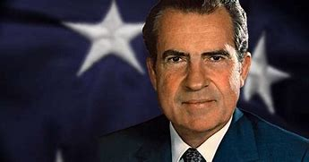
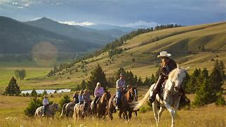
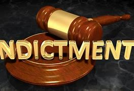

title:: 078 Richard Nixon: Resigned

- ## 078 Richard Nixon: Resigned
- ## pure
  collapsed:: true
	- VOA Learning English presents America's Presidents.
	- Today we are talking about Richard Nixon.
	- Nixon is well-known to many Americans for one reason: he was the only president to resign from the position. Facing possible legal action by Congress, Nixon left office early in his second term.
	- Nixon's early political career was marked by success. He also had some noteworthy achievements during his White House years. And he attained his goal of moving the government in a more conservative direction.
	- In his later years, Nixon and his supporters tried to reclaim his place as an expert on international affairs. But for many Americans, the name "Nixon" remains linked to distrust of national leaders, abuse of power, and political wrongdoing.
	- ## Early life
	- Richard Nixon had a difficult early life. He was the second of five sons in a Quaker family. His parents owned a lemon ranch in California, near the city of Los Angeles.
	- But the family struggled financially. And two of Richard's brothers died – one as a small child, and one as a young adult.
	- In time, his parent's business failed, and the Nixons moved to a nearby town. The parents and children all worked at a filling station that sold fuel and other products.
	- Despite the many hours he worked at the store, Richard Nixon was a top student in high school. He was offered financial aid to attend Harvard University, but the family needed even more money to send him there.
	- Instead, he attended a local college, where he became the student body president, joined a debate team, acted in the theater, and played football. Nixon went on to law school at Duke University in North Carolina.
	- Even with his impressive background, he did not get the jobs he sought at the Federal Bureau of Investigation – the FBI – or top law offices. So he returned the California town where he grew up and began working as a lawyer.
	- There, he married another actor at the community theater. Her name was Thelma Ryan, but she was called Pat. The Nixons went on to have two daughters, Tricia and Julie.
	- In 1942, Nixon accepted a job with the federal government in Washington, DC. He did not stay in the position long. After the United States entered World War II, Nixon joined the Navy. He served as an officer in the Pacific.
	- When he returned to the U.S., Republican Party officials asked him to be a candidate for Congress. Nixon agreed. He won two terms in the House of Representatives, and then a seat in the U.S. Senate.
	- Two years later, Dwight Eisenhower, the Republican presidential candidate, asked Nixon to be his vice president. The two men won in an electoral landslide, and in 1953 Nixon took office as vice president. He was only 40 years old, the second-youngest vice president in U.S. history.
	- ## Early political career
	- Nixon's early political career is remembered for several reasons. One is how quickly he rose to high government office.
	- Another is for his part in the Alger Hiss case in the late 1940s. Hiss was a top official in the State Department. He was accused of being a Communist in the 1930s and 1940s, and of passing information about the U.S. government to Soviet spies. Hiss denied the accusations.
	- The case was big news in the United States. It showed the clash between people who believed Hiss was falsely accused as a way to discredit liberal policies, and people who believed the government was protecting communist sympathizers.
	- Nixon was in the second group. He was part of the investigation against Hiss and pushed for his indictment. Nixon's efforts succeeded, and Hiss went to jail for almost four years. Later, Nixon said that the case was one of the reasons for his rise to power.
	- Nixon also earned national attention with an event that has become known as the Checkers speech. It happened in 1952, when Nixon was running for vice president.
	- Some reporters accused Nixon of corruption. They said he was accepting money and gifts from wealthy donors in exchange for his political support.
	- Nixon went on television to deny the claims personally. At the time, Americans were not used to seeing politicians speaking directly to the public. Yet Nixon spoke informally and emotionally, from what appeared to be a home.
	- He explained his family's finances. He said he did not accept campaign donations for personal benefit.
	- But, he added, there was one exception. A supporter had once given the Nixon children a black and white dog they called Checkers. Nixon said he refused to return his daughters' pet.
	- The public – and Republican Party officials – loved the speech. Nixon appeared warm and likable. Middle-class Americans especially said they could relate to him. Most forgot the claims against him. And Nixon's political career was saved. During the following eight years, he served as vice president in the Eisenhower administration.
	- But then Nixon's luck turned. In 1960, Nixon lost as a presidential candidate to John F. Kennedy. He blamed, in part, the media. Then in 1962, he lost his efforts to be governor of California.
	- Nixon said he was retiring from politics. He famously told reporters, "You won't have Nixon to kick around anymore."
	- Yet seven years later, he was in the White House. It was one of the most memorable comebacks in U.S. political history.
	- ## Presidency
	- When Nixon took office in 1969, some Americans thought the country was in crisis.
	- The economy was not doing well. Race riots had been erupting in big cities. Many people were still trying to recover from the violence of a year earlier. Civil rights leader Martin Luther King Junior and President John F. Kennedy's brother Robert had both been shot and killed.
	- Pollution of the environment was becoming a major political issue. Women were pressing for equal rights. And many Americans continued to protest American involvement in Vietnam.
	- Nixon took action. During his first years in office, he supported reforms and rules to improve the economy; protect the environment; increase workplace and other opportunities for women; support civil rights; and, in his words, bring "peace with honor" in Vietnam.
	- But, for the most part, Nixon did not have the support of Congress to enact legislation. So he expanded the power of the presidency to carry out his goals.
	- He is remembered especially for three foreign policy moves. In 1972, he visited China, with which the U.S. government had tense relations since the Chinese Communist Party took power.
	- As the Alger Hiss case showed, Nixon was strongly anti-communist. But he made establishing diplomatic relations between the two sides possible again.
	- He also visited the Soviet Union, and was the first U.S. president to visit Moscow. Nixon and the Soviet leader, Leonid Brezhnev, agreed to limit the growth of nuclear arms. Their actions helped ease tensions at a time when U.S. officials were worried about the expansion of communism.
	- And Nixon did succeed in reaching a peace agreement with North Vietnamese leaders. In 1973, American troops slowly began to leave the country, although fighting there continued.
	- Nixon's foreign policy achievements helped him in the 1972 election campaign. His first presidential election had been extremely close; the second he won by one of the widest electoral vote margins in U.S. history.
	- ## Watergate
	- Even though he was popular with voters, Nixon had been concerned about his political future. Nixon was so worried that, before the election, he created a secret team to prevent any damaging information from reaching the media. Later, its job expanded to include investigating any information that might hurt his public image.
	- About five months before Election Day, five men broke into the opposition party's headquarters at the Watergate, a hotel and office complex, in Washington, DC.
	- The team had already stolen copies of secret campaign documents. Now, in the middle of the night, the men were trying to add listening equipment to the telephones – in other words, spy on the opposition.
	- But a security guard became suspicious and called the police. The men were caught and arrested.
	- When the story came to light, Nixon publicly denied that any White House officials were involved in the crime.
	- But in time, the public learned that Nixon was lying. In fact, he assisted with payments to the men who were arrested.
	- And he tried to use the Central Intelligence Agency to block an FBI investigation of the crime. Nixon knew that the Watergate break-in was only part of the illegal or questionable acts he could be held responsible for.
	- Later, people connected with Nixon told investigators that the president had taped everything that happened in his office.
	- Investigators demanded the tapes. They would prove how much Nixon knew about the illegal operations.
	- The president refused. He dismissed the lead investigator. Two other Justice Department officials resigned in protest.
	- A new investigator was appointed, and the U.S. Supreme Court ordered Nixon to release the tapes.
	- At the same time, the House of Representatives voted to remove Nixon from office. They charged him with obstructing justice, abusing his power, covering up a crime, and violating the Constitution.
	- Finally, Nixon released the tapes. But before the Senate could hold a trial – in which the president would almost certainly be found guilty – Richard Nixon resigned. He left the White House the following day.
	- ## Legacy
	- Nixon lived for 20 more years. He wrote a number of books, traveled, spent time with his family, and offered foreign policy advice to other leaders. He continued to deny that he had done anything criminal as president; instead, Nixon said he had made bad decisions.
	- And he did not go to trial. The next president, Gerald Ford, used his power to pardon Nixon "for all offenses against the United States."
	- But Nixon's image was permanently damaged. Most people found evidence in the tapes that Nixon knew about a related series of crimes commonly known as "Watergate."
	- They also found that some of his public statements were dishonest. They said he made them to forward his own political goals, not to further the public good.
	- As a result, Nixon's place in U.S. history is generally thought to be a troubled one. To be sure, he made a number of positive accomplishments, both within the U.S. and internationally.
	- But his presidency left the country shaken. When Ford replaced him as president, he said to Americans, "Our long national nightmare is over."
- ---
- ## def
	- VOA Learning English presents America's Presidents.
	- Today we are talking about Richard Nixon.
		- > ▶ Richard Nixon
		  
	- Nixon is well-known to many Americans for one reason: he was the only president to resign from the position. Facing possible **legal action** by Congress, Nixon left office early in his second term.
		- 尼克松为许多美国人所熟知的一个原因是:他是唯一一位辞职的总统。由于面临国会可能采取的法律行动，尼克松在第二任期早期就离职了。
	- Nixon's early political career /was marked by success. He also had some noteworthy achievements /during his White House years. And he attained his goal /of moving the government /in a more conservative direction.
		- > ▶ noteworthy (a.) deserving to be noticed or to receive attention /because it is unusual, important or interesting 值得注意的；显著的；重要的
		- 尼克松早期的政治生涯以成功为标志。他在白宫任职期间, 也取得了一些值得注意的成就。他实现了向更保守的方向发展的目标。
	- In his later years, Nixon and his supporters /tried to reclaim his place /as an expert on international affairs. But for many Americans, the name "Nixon" /remains linked to distrust of national leaders, abuse of power, and political wrongdoing.
		- > ▶ reclaim (v.) ~ sth (from sb/sth) : to get sth back /or to ask to have it back /after it has been lost, taken away, etc. 取回；拿回；要求归还
		  + /~ sb (from sth) to rescue sb from a bad or criminal way of life 挽救；感化；使纠正；使悔过自新
		  + /~ sth (from sth) to make land /that is naturally too wet or too dry suitable /to be built on, farmed, etc. 开垦，利用，改造（荒地）
		- 在他的晚年，尼克松和他的支持者试图恢复他作为国际事务专家的地位。但对许多美国人来说，“尼克松”这个名字仍然与不信任国家领导人、滥用权力和政治错误联系在一起。
	- ## Early life
	- Richard Nixon had a difficult early life. He was the second of five sons /in a Quaker family. His parents owned a lemon ranch(n.) in California, near the city of Los Angeles.
		- > ▶ ranch  (n.) a large farm, especially in N America or Australia, where cows, horses, sheep, etc. are bred 牧场，大农场（尤指北美或澳大利亚的）
		  => 来自古法语 ranger, 扎寨，安营，安置，来自 rang,排列，布置，词源同 range,rank.
		  
	- But the family struggled financially. And two of Richard's brothers died – one as a small child, and one as a young adult.
	- In time, his parent's business failed, and the Nixons moved to a nearby town. The parents and children /all worked at **a filling station** that sold fuel and other products.
		- > ▶  filling station = petrol station 加油站
		- 父母和孩子都在加油站工作，销售燃料和其他产品。
	- Despite the many hours he worked at the store, Richard Nixon was a top student in high school. He was offered **financial aid** /to attend Harvard University, but the family needed even more money to send him there.
		- 他获得了进入哈佛大学的经济资助.
	- Instead, he attended a local college, where he became the **student body** president, joined a debate team, acted in the theater, and played football. Nixon went on to **law school** at Duke University in North Carolina.
		- > ▶  student body  : N-COUNT A student body is all the students of a particular college or university, considered as a group. (某所大学的)全体学生
		- 在那里他成为了学生会主席，加入了辩论队，在剧院表演，踢足球。尼克松后来去了北卡罗来纳州的杜克大学法学院。
	- Even with his impressive background, he did not get the jobs /he sought at **the Federal Bureau of Investigation** – the FBI – or top law offices. So he returned the California town where he grew up /and began working as a lawyer.
		- 即使他有令人印象深刻的背景，他也没有得到他想要的在联邦调查局或高级律师事务所的工作。
	- There, he married another actor /at the community theater. Her name was Thelma Ryan, but she was called Pat. The Nixons went on /to have two daughters, Tricia and Julie.
		- ((623196ed-fcf1-449d-b09d-c5e44b3dbe1b))
	- In 1942, Nixon accepted a job /with the federal government in Washington, DC. He did not stay in the position long. After the United States entered World War II, Nixon joined the Navy. He served as an officer in the Pacific.
	- When he returned to the U.S., Republican Party officials /asked him to be a candidate for Congress. Nixon agreed. He won two terms /in the House of Representatives, and then a seat in the U.S. Senate.
	- Two years later, Dwight Eisenhower, the Republican presidential candidate, asked Nixon to be his vice president. The two men won in an electoral /landslide, and in 1953 Nixon took office as vice president. He was only 40 years old, the second-youngest vice president in U.S. history.
	- ## Early political career
	- Nixon's early political career /is remembered for several reasons. One is how quickly he rose to high government office.
	- Another is for his part in the Alger Hiss case /in the late 1940s. Hiss was a top official in the State Department. He **was accused of** being a Communist in the 1930s and 1940s, and **of** passing information about the U.S. government to Soviet spies. Hiss denied the accusations.
		- 另一个是他在20世纪40年代末阿尔杰·希斯一案中的角色。希斯是美国国务院的高级官员。他被指控在20世纪30年代和40年代是共产主义者，并向苏联间谍传递有关美国政府的信息。希斯否认了这些指控。
	- The case was big news in the United States. It showed the clash /**between** people who believed Hiss was falsely accused /as a way to discredit(v.) liberal policies, **and** people who believed the government was protecting communist sympathizers.
		- > ▶ falsely  adv. 错误地；虚伪地；不实地
		- > ▶ discredit (v.)to make people stop respecting sb/sth 败坏…的名声；使丧失信誉；使丢脸
		  -> The photos were deliberately taken /to discredit the President. 这些蓄意拍摄的照片旨在败坏总统的名声。
		  + /to make people stop believing that sth is true; to make sth appear unlikely to be true 使不相信；使怀疑；使不可置信
		- > ▶ sympathizer : a person who supports or approves of sb/sth, especially a political cause or party 赞同者；支持者
		- 这个案子在美国是大新闻。它显示了两派之间的冲突，一派认为, 希斯被错误地指控, 来作为诋毁"自由主义政策"的手段;另一派则认为, 政府是在保护共产主义同情者。
	- Nixon was in the second group. He was part of the investigation against Hiss and pushed for his indictment. Nixon's efforts succeeded, and Hiss went to jail for almost four years. Later, Nixon said that /the case was one of the reasons for his rise to power.
		- > ▶ indictment (n.) [ U ] ( especially NAmE ) the act of officially accusing sb of a crime 控告；起诉 /刑事起诉书；公诉书
		  + /~ (of/on sb/sth) a sign that a system, society, etc. is very bad or very wrong （制度、社会等的）衰败迹象，腐败迹象
		  -> The poverty in our cities /is a damning indictment of modern society. 我们的城市中贫民的苦况是现代社会的一大败象。
		  => 词根词缀： in-朝,向 + -dict-说,讲→诉说 + -ment名词词尾
		  
		- 尼克松属于第二组。他参与了对希斯的调查，并推动了对他的起诉。
	- Nixon also earned national attention /with an event /that has become known as the Checkers speech. It happened in 1952, when Nixon was running for vice president.
		- > ▶ checkers  : N a game for two players using a checkerboard and 12 checkers each. The object is to jump over and capture the opponent's pieces 西洋棋
		  
		- > ▶ Checkers speech
		  跳棋演讲是政治家利用电视媒体, 直接向选民发出吁请的一个早期典型例子，但之后也有数次遭到嘲弄和贬低。**“跳棋演讲”一词也成为政治家发表煽情演说的代名词。**
	- Some reporters **accused** Nixon **of** corruption. They said /he was accepting money and gifts from wealthy donors /in exchange for his political support.
	- Nixon went on television /to deny the claims personally. At the time, Americans were not used to seeing politicians /speaking directly to the public. Yet Nixon spoke informally and emotionally, from what appeared to be a home.
		- 尼克松在一个似乎像家一样的地方，发表了非正式而充满感情的讲话。
	- He explained his family's finances. He said /he did not accept campaign donations /for personal benefit.
	- But, he added, there was one exception. A supporter had once given the Nixon children a black and white dog /they called Checkers. Nixon said /he refused to return his daughters' pet.
	- The public – and Republican Party officials – loved the speech. Nixon appeared warm and likable. Middle-class Americans especially said /they could **relate to** him. Most forgot the claims against him. And Nixon's political career was saved. During the following eight years, he served as vice president /in the Eisenhower administration.
		- > ▶ **RELATE TO STH/SB**
		   (2) to be able to understand /and have sympathy with sb/sth 能够理解并同情；了解；体恤 SYN empathize with
		  -> Many adults can't relate to children. 许多成年人并不了解儿童的想法。
		  (1) to be connected with sth/sb; to refer to sth/sb 涉及；与…相关；谈到
		  -> We shall discuss the problem /as it relates to our specific case. 我们应针对我们的具体情况来讨论这个问题。
		- 他们可以与他产生共鸣。
	- But then Nixon's luck turned. In 1960, Nixon **lost** as a presidential candidate **to** John F. Kennedy. He blamed, in part, the media. Then in 1962, he lost his efforts /to be governor of California.
		- Nixon said /he was retiring from politics. He famously told reporters, "You won't have Nixon /to kick around anymore."
		  > ▶ **kick sb around** :
		  ( informal ) to treat sb in a rough or unfair way 粗暴地对待某人；虐待；凌辱
		- 他曾对记者说过一句著名的话:“你们再也不会有尼克松任你们摆布了。”
	- Yet seven years later, he was in the White House. It was one of the most memorable comebacks /in U.S. political history.
	- ## Presidency
	- When Nixon took office in 1969, some Americans thought /the country was in crisis.
	- The economy was not doing well. Race riots had been erupting /in big cities. Many people were still trying to recover from the violence of a year earlier. Civil rights leader Martin Luther King Junior /and President John F. Kennedy's brother Robert /had both been shot and killed.
	- Pollution of the environment /was becoming a major political issue. Women were pressing for equal rights. And many Americans continued to protest **American involvement** in Vietnam.
	- Nixon took action. During his first years in office, he supported reforms and rules /to improve the economy; protect the environment; increase workplace and other opportunities for women; support civil rights; and, in his words, bring "peace with honor" in Vietnam.
	- But, for the most part, Nixon did not have the support of Congress /to enact legislation. So he expanded the power of the presidency /to carry out his goals.
		- 在很大程度上，尼克松没有得到国会的支持来颁布立法。因此，他扩大了总统的权力来实现他的目标。
	- He is remembered /especially for three foreign policy moves. In 1972, he visited China, with which the U.S. government had tense relations /since the Chinese Communist Party took power.
	- As the Alger Hiss case showed, Nixon was strongly anti-communist. But he made establishing diplomatic relations /between the two sides /possible again.
		- 正如阿尔杰·希斯事件所显示的那样，尼克松是强烈的反共主义者。但他使双方重新建立外交关系成为可能。
	- He also visited the Soviet Union, and was the first U.S. president to visit Moscow. Nixon and the Soviet leader, Leonid Brezhnev, agreed /to limit the growth of nuclear arms. Their actions helped ease tensions /at a time /when U.S. officials were worried about the expansion of communism.
	- And Nixon did succeed /in reaching a peace agreement with North Vietnamese leaders. In 1973, American troops slowly began to leave the country, although fighting there continued.
	- Nixon's foreign policy achievements /helped him /in the 1972 election campaign. His first presidential election /had been extremely close; the second /he won /by one of the widest **electoral vote** margins /in U.S. history.
		- 他的第一次总统选举时, 他和竞争对手的选票数非常接近; 但第二次竞选时, 他则以美国历史上最大的选举人票数差额, 而获胜。
	- ## Watergate
	- Even though he was popular with voters, Nixon had been concerned about his political future. Nixon was so worried that, before the election, he created a secret team /**to prevent** any damaging information **from** reaching the media. Later, its job expanded to include investigating any information /that might hurt his public image.
		- 以防止任何破坏性的信息到达媒体。
	- About five months /before Election Day, five men broke into the opposition party's headquarters /at the Watergate, a hotel and office complex, in Washington, DC.
	- The team had already stolen copies of secret campaign documents. Now, in the middle of the night, the men were trying **to add** listening equipment **to** the telephones – in other words, spy(v.) on the opposition.
	- But a security guard /became suspicious /and called the police. The men were caught and arrested.
	- When the story came to light, Nixon publicly denied that /any White House officials were involved in the crime.
	- But in time, the public learned that /Nixon was lying. In fact, he assisted with payments to the men who were arrested.
	- And he tried to use the Central Intelligence Agency /to block an FBI investigation of the crime. Nixon knew that /the Watergate break-in /was only part of the illegal or questionable acts /he could be held responsible for.
	- Later, people connected with Nixon /told investigators that /the president had taped(v.) everything /that happened in his office.
		- > ▶ tape (v.) to record sb/sth on magnetic tape using a special machine 把…录在磁带上
		- 后来，与尼克松有联系的人告诉调查人员，总统已经录下了他办公室里发生的一切。
	- Investigators demanded the tapes. They would prove how much Nixon knew about the illegal operations.
		- 调查人员索要了录像带。他们将证明尼克松对非法行动有多了解。
	- The president refused. He dismissed the lead investigator. Two other Justice Department officials /resigned in protest.
		- ((6255290d-c6d0-4975-b5e3-5f1e914163aa))
	- A new investigator was appointed, and the U.S. Supreme Court /ordered Nixon to release the tapes.
		- 一名新的调查人员被任命，美国最高法院命令尼克松公开录音带。
	- At the same time, the House of Representatives /voted to remove Nixon from office. They charged him /with obstructing(v.) justice, abusing his power, covering up a crime, and violating the Constitution.
	- Finally, Nixon released the tapes. But before the Senate could hold a trial – in which the president would almost certainly be found guilty – Richard Nixon resigned. He left the White House /the following day.
	- ## Legacy
	- Nixon lived for 20 more years. He wrote a number of books, traveled, spent time with his family, and **offered** foreign policy advice **to** other leaders. He continued to deny that /he had done anything criminal as president; instead, Nixon said /he had made bad decisions.
		- 他继续否认自己担任总统期间做过任何犯罪行为;相反，尼克松说他做了错误的决定。
	- And he did not go to trial. The next president, Gerald Ford, used his power /to pardon(v.) Nixon "for all offenses against the United States."
		- > ▶ pardon (v.) [ VN ] to officially allow sb who has been found guilty of a crime to leave prison and/or avoid punishment 赦免；特赦
		  + /~ sb (for sth/for doing sth) to forgive sb for sth they have said or done (used in many expressions when you want to be polite) 原谅（表示礼貌时常用的词语）
	- But Nixon's image was permanently damaged. Most people found evidence in the tapes /that Nixon knew about a related series of crimes /commonly known as "Watergate."
	- They also found that /some of his public statements were dishonest. They said /he made them to forward(v.) his own political goals, not to further(v.) the public good.
		- > ▶ forward (v.) [ VN ] ( formal ) to help to improve or develop sth 促进；有助于…的发展；增进 SYN further
		- > ▶ further (v.) [ VN ] to help sth to develop or be successful 促进；增进
		- 他们还发现他的一些公开声明是不诚实的。他们说他做这些是为了实现自己的政治目标，而不是为了增进公众利益。
	- As a result, Nixon's place in U.S. history /is generally thought to be a troubled one. To be sure, he made a number of positive accomplishments, **both** within the U.S. **and** internationally.
		- > ▶ troubled (a.) ( of a person 人 ) worried and anxious 忧虑的；烦恼的；不安的
		  + /( of a place, situation or time 地方、局势或时间 ) having a lot of problems 麻烦多的；混乱的；扰乱的
		- 可以肯定的是，他在美国国内和国际上都取得了一些积极的成就。
	- But his presidency /left the country shaken. When Ford replaced him as president, he said to Americans, "Our long national nightmare is over."
		- 我们长期的国家噩梦结束了