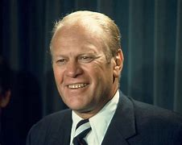
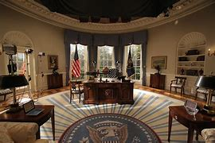

title:: 079 Gerald Ford: Unelected

- ## 079 Gerald Ford: Unelected
- ## pure
  collapsed:: true
	- VOA Learning English presents America's Presidents.
	- Today we are talking about Gerald Ford. Ford was the 38th president, but he was never elected to the position.
	- Instead, an unusual series of events brought him there.
	- Many historians have described Ford as a good man facing a difficult situation. He tried to fix a troubled economy, end United States' involvement in Vietnam, and show people that the U.S. government could continue to operate after a crisis.
	- Critics from the two main political parties had problems with Ford's efforts. And voters did not elect him president when they had the chance in 1976.
	- But he is remembered in American history for making many voters feel better about their elected officials.
	- ## Early life
	- When he was born, the future president was given his father's name: Leslie Lynch King.
	- But the boy's father was abusive. His mother separated from him a short time after their son was born. She asked a court for permission to cancel their marriage. Her request was quickly approved.
	- She and the boy moved from the Midwestern state of Nebraska to Michigan. In a few years, the mother married a man named Gerald Ford. The couple had three sons together.
	- The new family was warm and loving. In time, the oldest boy officially took his step-father's name and became Gerald Rudolph Ford, Junior. He was called Jerry for short.
	- Growing up, Jerry Ford was a well-liked person and a good student. He was also a top football player. He was named the most valuable player on his team at the University of Michigan. After finishing college, he was offered work with professional football teams.
	- But Ford wanted to continue his education instead. He accepted coaching positions for the football and boxing teams at Yale University in Connecticut. In time, he attended the law school there.
	- Ford's path to politics was similar to that of other presidents during that period. He worked at a law office in his home state. He fought in World War II. He married.
	- Ford's wife was Elizabeth Bloomer. Her friends called her Betty. She had been a dancer and worked as a fashion model. The Fords went on to have four children.
	- When Gerald Ford was 35 years old, he launched his political career. The Republican Party chose him as its candidate for a seat in the U.S. House of Representatives.
	- Ford was elected to represent his home area of Grand Rapids, Michigan. But unlike many other politicians, he did not move on to the Senate or become governor of a state. Instead, he stayed in the House of Representatives for 25 years.
	- The job of congressman was, in many ways, a good choice for Ford. He was well-liked by many voters and other lawmakers. He could help different groups come to agreement. He took increasingly important positions on political issues, and in time became the top person in his party in the House.
	- Ford was a strong supporter of Republican presidents. In the 1968 election, Ford advocated for Richard Nixon. Ford liked Nixon's plans for the United States, as well as his efforts to improve relations with China and the Soviet Union.
	- Both Ford and Nixon were re-elected to their positions in 1972.
	- But by then, major problems had come to light in Nixon's administration.
	- ## An unusual path to the White House
	- One problem in the early 1970s related to Nixon's vice president, Spiro Agnew. Agnew had been vice president since 1969. Five years later, officials found evidence that he had accepted money from contractors, both while Maryland's governor and as vice president.
	- In answer, Agnew resigned from the vice presidency.
	- Normally, voters elect a vice president along with a president every four years. But by coincidence, the U.S. Constitution had recently been updated to say what happens if the country needs a vice president unexpectedly. It states that the president has to nominate someone for the position. Then, a majority of lawmakers in Congress must agree.
	- So, in 1973, Nixon nominated Gerald Ford to take Agnew's position. Nixon was not especially close to Ford. But, he knew a majority of lawmakers would likely accept him as vice president.
	- They did.
	- However, Ford did not serve in the position long. In eight months, another unexpected event put him in the Oval Office.
	- ## Presidency
	- In August 1974, President Richard Nixon resigned from office. He was the first president to do so.
	- As a result, the vice president, Gerald Ford, became president.
	- Ford was sworn-in as president on August 9, 1974. Then he spoke to the nation on television. He said, "My fellow Americans, our long national nightmare is over." He told people, "Our Constitution works. Our great republic is a government of laws and not men."
	- The public had understandably lost a good deal of faith in government officials, and especially in Richard Nixon. Ford wanted to re-establish their trust.
	- But a few weeks after taking office, Ford used his presidential powers to pardon Nixon. The pardon meant that Nixon would never face a criminal trial or, if found guilty, punishment for his actions.
	- Ford said he believed pardoning Nixon would help Americans begin to recover from their painful experience with the former president.
	- But instead, the move angered many people. They believed that Nixon should be held responsible. They also lost some of their trust in Ford.
	- In addition to these political troubles, Ford faced other difficult issues. The American economy was struggling. His administration had to deal with unemployment, inflation and the lasting effects of an energy crisis. The high price of oil imports came at a time when Americans were using more and more gasoline.
	- Ford took steps aimed at improving the economy. But critics said he was not consistent. Some criticized him for increasing government spending and cutting taxes; others criticized him for reducing government spending and raising taxes.
	- Ford also oversaw the withdrawal of Americans from Vietnam. An earlier agreement had brought a ceasefire to groups in South Vietnam, North Vietnam, and Communist forces. The U.S. officially withdrew its combat troops in 1973. But the fighting restarted.
	- Ford asked Congress to approve military and humanitarian aid for the area. But U.S. lawmakers did not approve the full amount. And in time, they cut military aid.
	- In 1975, Communist forces began to take control of Saigon, the capital of South Vietnam.
	- Ford ordered all remaining Americans in the country to leave, along with any South Vietnamese who were connected to the United States.
	- He said that, as far as Americans were concerned, the Vietnam War was finished.
	- Americans did not appear to blame Ford for the troubling end of the country's involvement in Vietnam. And some recognized that the country's economic and energy problems had started long before he became president.
	- But, in general, Ford did not have the support of Congress. And many voters did not forgive him for pardoning Nixon.
	- In 1976, Ford officially campaigned for president for the first time.
	- He won his party's nomination in a close race against Ronald Reagan, the former governor of California.
	- But he lost the general election to the Democratic candidate, who said one of his best qualities was that he did not have experience in the federal government.
	- The argument appeared persuasive to many voters, who still did not appear to be enthusiastic about the government. In the 1976 election, nearly half of all people who were legally able to vote chose not to.
	- Ford left the presidency graciously. He said that, because he had not planned to be president, he was thankful for the unexpected opportunity.
	- ## Legacy
	- Although Ford said he was ready to retire from politics, he continued to be active in public life. He advised others on government affairs, published books, and sat on boards and committees.
	- His wife, Betty Ford, also left a lasting effect on the public.
	- As first lady, she had spoken about her experience with breast cancer.
	- After her husband left the presidency, she also spoke openly about her battle with alcohol and drug abuse.
	- In 1982, Betty Ford co-founded the Betty Ford Center in California to help people get treatment for drug addiction.
	- She announced her husband's death in 2006. Gerald Ford died of heart disease at the age of 93.
	- By that time, most the public had accepted that one of Ford's biggest achievements was to help the country recover after Nixon resigned. President Bill Clinton gave Ford a Presidential Medal of Freedom for his efforts.
	- And even Jimmy Carter, who beat Ford in the 1976 presidential election, began his inauguration speech by thanking Ford. Carter said, "For myself and for our Nation, I want to thank my predecessor for all he has done to heal our land."
- ---
- ## def
	- VOA Learning English presents America's Presidents.
	- Today we are talking about Gerald Ford. Ford was the 38th president, but he was never elected to the position.
		- > ▶  Gerald Ford
		  
	- Instead, an unusual series of events /brought him there.
	- Many historians have described Ford as a good man /facing a difficult situation. He tried to fix a troubled economy, end United States' involvement in Vietnam, and show people that /the U.S. government could continue to operate after a crisis.
	- Critics from the two main political parties /had problems with Ford's efforts. And voters did not elect him president /when they had the chance in 1976.
		- 来自两大政党的批评人士, 对福特的努力提出了质疑。1976年，选民本有机会选他当总统，但他们没有选他。
	- But he is remembered in American history /for making many voters feel better /about their elected officials.
		- 但他在美国历史上被铭记，因为他让许多选民对他们选出的官员感觉更好。
	- ## Early life
	- When he was born, the future president /was given his father's name: Leslie Lynch King.
	- But the boy's father was abusive(a.). His mother separated from him /a short time after their son was born. She **asked** a court **for** permission to cancel their marriage. Her request was quickly approved.
		- > ▶ abusive (a.) ( of behaviour 行为 ) involving violence 虐待的
		  + /( of speech or of a person 言语或人 ) rude and offensive; criticizing rudely and unfairly 辱骂的；恶语的；毁谤的
		- 他的母亲, 在其儿子出生后不久, 就和丈夫分开了。她请求法院允许取消他们的婚姻。
	- She and the boy /moved **from** the Midwestern state of Nebraska **to**  Michigan. In a few years, the mother married a man named Gerald Ford. The couple had three sons together.
	- The new family was warm and loving. In time, the oldest boy officially took his step-father's name /and became Gerald Rudolph Ford, Junior. He was called Jerry for short.
		- > ▶   step-father : N-COUNT Someone's stepfather is the man who has married their mother after the death or divorce of their father. 继父
		- 他被简称为杰瑞。
	- Growing up, Jerry Ford was a well-liked person /and a good student. He was also a top football player. He was named the most valuable player /on his team at the University of Michigan. After finishing college, he **was offered** work **with** professional football teams.
		- 他被评为球队最有价值球员。大学毕业后，他得到了职业足球队的工作机会。
	- But Ford wanted to continue his education instead. He accepted coaching positions /for the football and boxing teams at Yale University in Connecticut. In time, he attended the **law school** there.
		- 但福特想继续他的教育。他接受了位于康涅狄格州的耶鲁大学足球队和拳击队的教练职位。后来，他进入了那里的法学院。
	- Ford's path to politics /was similar to that of other presidents during that period. He worked at a law office /in his home state. He fought /in World War II. He married.
	- Ford's wife was Elizabeth Bloomer. Her friends called her Betty. She had been a dancer /and worked as a fashion model. The Fords went on /to have four children.
	- When Gerald Ford was 35 years old, he launched his political career. The Republican Party chose him as its candidate /for a seat in the U.S. House of Representatives.
	- Ford was elected /to represent his home area of Grand Rapids, Michigan. But unlike many other politicians, he did not move on to the Senate /or become governor of a state. Instead, he stayed in the House of Representatives for 25 years.
	- The job of congressman /was, in many ways, a good choice for Ford. He was well-liked(a.) by many voters and other lawmakers. He could help different groups /come to agreement. He took increasingly important positions on political issues, and in time /became the top person in his party /in the House.
		- > ▶  well-liked : ADJ liked by many people; popular 受人喜爱的; 受欢迎的
		- 他能帮助不同的团体达成一致。他在政治问题上的地位越来越重要，并最终成为共和党在众议院的最高领导人。
	- Ford was a strong supporter of Republican presidents. In the 1968 election, Ford advocated for Richard Nixon. Ford liked Nixon's plans for the United States, as well as his efforts /to improve relations with China and the Soviet Union.
		- > ▶ advocate /ˈædvəkeɪt/ (v.) ( formal ) to support sth publicly 拥护；支持；提倡
	- Both Ford and Nixon /were re-elected to their positions in 1972.
	- But by then, major problems **had come to light** /in Nixon's administration.
		- > ▶ come to light : 
		  to become known to people 为人所知；变得众所周知；暴露
	- ## An unusual path to the White House
	- One problem in the early 1970s /related to Nixon's vice president, Spiro Agnew. Agnew had been vice president since 1969. Five years later, officials found evidence /that he had accepted money from contractors, **both** while Maryland's governor **and** as vice president.
		- > ▶ contractor :  a person or company /that has a contract /to do work or provide goods or services for another company 承包人；承包商；承包公司
		- 五年后，官员们发现了他在担任马里兰州州长和副总统期间, 收受承包商钱财的证据。
	- In answer, Agnew resigned from the vice presidency.
	- Normally, voters elect a vice president **along with** a president /every four years. But by coincidence, the U.S. Constitution had recently been updated /to say /what happens if the country needs a vice president unexpectedly. It states that /the president has to nominate someone for the position. Then, a majority of lawmakers in Congress /must agree.
		- 一般情况下，选民每四年选举一次总统和副总统。但巧合的是，美国宪法最近更新了，规定了如果国家意外需要一位副总统该怎么办。它规定总统必须提名一个人来担任这个职位。然后，国会的大多数议员必须同意。
	- So, in 1973, Nixon nominated Gerald Ford /to take Agnew's position. Nixon was not especially close to Ford. But, he knew /a majority of lawmakers would likely accept him as vice president.
	- They did.
	- However, Ford did not serve /in the position long. In eight months, another unexpected event /put him in the Oval Office.
		- > ▶ oval  (a.)(n.) shaped like an egg 椭圆形的；卵形的
		  ▶ Oval Office : the office of the US President in the White House （美国白宫的）椭圆形办公室，总统办公室
		  + /a way of referring to the US President and the part of the government that is controlled by the President （美国）总统及政府行政部门
		  
	- ## Presidency
	- In August 1974, President Richard Nixon /resigned from office. He was the first president to do so.
	- As a result, the vice president, Gerald Ford, became president.
	- Ford was sworn-in as president /on August 9, 1974. Then he spoke to the nation /on television. He said, "My fellow Americans, our long national nightmare is over." He told people, "Our Constitution works. Our great republic(n.) /is a government of laws /and not men."
		- > ▶ republic (n.) a country /that is governed by a president and politicians /elected by the people /and where there is no king or queen 共和国；共和政体
		- 我们伟大的共和国是法治政府，而不是人治政府。
	- The public /had understandably lost(v.) a good deal of faith /in government officials, and especially in Richard Nixon. Ford wanted to re-establish(v.) their trust.
		- > ▶ understandably (ad.) in a way that seems normal and reasonable in a particular situation 可以理解地；正常地；合乎情理地
	- But a few weeks /after taking office, Ford used his presidential powers /to pardon(v.) Nixon. The pardon meant that /Nixon would never face a criminal trial or, if found guilty, punishment for his actions.
	- Ford said /he believed `主` pardoning Nixon `谓` would help Americans begin to recover from their painful experience /with the former president.
	- But instead, the move angered(v.) many people. They believed that /Nixon should be held responsible. They also lost some of their trust in Ford.
	- **In addition to** these political troubles, Ford faced other difficult issues. The American economy was struggling. His administration had to deal with unemployment, inflation and the lasting effects /of an energy crisis. The high price of oil imports /came at a time /when Americans were using more and more gasoline.
	- Ford took steps /aimed at improving the economy. But critics said /he was not consistent(a.). Some **criticized** him **for** increasing **government spending** and cutting taxes; others **criticized** him **for** reducing **government spending** and raising taxes.
		- > ▶ consistent. (a.) ( approving ) always behaving in the same way, or having the same opinions, standards, etc. 一致的；始终如一的
		  -> a consistent approach to the problem 解决问题的一贯方法
		  + /happening in the same way and continuing for a period of time 连续的；持续的
		- 福特采取了旨在改善经济的措施。但批评人士表示，他的立场并不一致。一些人批评他增加了政府开支和减了税; 还有人批评他减少了政府开支和增加了税收。
	- Ford also oversaw /the withdrawal of Americans from Vietnam. An earlier agreement **had brought** a ceasefire **to** groups in South Vietnam, North Vietnam, and Communist forces. The U.S. officially withdrew its combat troops in 1973. But the fighting restarted.
		- 福特还监督了美国人从越南撤军。此前，南越、北越和共产党军队达成停火协议。美国于1973年正式撤出作战部队。
	- Ford asked Congress /to approve military and humanitarian aid /for the area. But U.S. lawmakers /did not approve the full amount. And in time, they cut military aid.
	- In 1975, Communist forces /began **to take control of** Saigon, the capital of South Vietnam.
	- Ford ordered all remaining Americans in the country /to leave, along with any South Vietnamese /who were connected to the United States.
	- He said that, **as far as** Americans **were concerned**, the Vietnam War was finished.
		- > ▶ **as/so far as I am concerned**
		  used to give your personal opinion on sth 就我而言
		  -> As far as I am concerned, you can do what you like. 就我而言，你想干什么就可以干什么。 
		  ▶  **as/so far as sb/sth is concerned  | as/so far as sb/sth goes**
		  used to give facts or an opinion about a particular aspect of sth 就…而言
		- 对美国人来说，越南战争已经结束。
	- Americans did not appear **to blame** Ford /**for** the troubling end of the country's involvement in Vietnam. And some recognized that /the country's economic and energy problems /had started long /before he became president.
	- But, in general, Ford did not have the support of Congress. And many voters /did not forgive him for pardoning Nixon.
	- In 1976, Ford officially campaigned for president /for the first time.
	- He won his party's nomination /in a close race /against Ronald Reagan, the former governor of California.
		- 他在与加州前州长罗纳德·里根的激烈竞争中, 赢得党内提名。
	- But he **lost** the general election **to** the Democratic candidate, who said /one of his best qualities was that /he did not have experience in the federal government.
		- 但他在大选中输给了民主党候选人，后者说, 自己的优点之一是没有联邦政府的经验。
	- The argument appeared persuasive(a.) to many voters, who still did not appear /to be enthusiastic about the government. In the 1976 election, nearly half of all people who were legally able to vote /chose not to.
		- > ▶ persuasive (a.) able to persuade sb to do or believe sth 有说服力的；令人信服的
		- 这个论点在许多选民看来很有说服力，但他们似乎对政府并不热心。在1976年的选举中，几乎有一半的合法选民选择不投票。
	- Ford left the presidency graciously. He said that, because he had not planned to be president, he was thankful /for the unexpected opportunity.
		- graciously 和蔼地, 优雅地, 有风度地
	- ## Legacy
	- Although Ford said /he was ready to retire from politics, he continued to be active in public life. He **advised** others **on** government affairs, published books, and sat on boards and committees.
		- 他为其他人提供政府事务方面的建议，出版书籍，并担任董事会和委员会成员。
	- His wife, Betty Ford, also left a lasting effect /on the public.
		- 他的妻子贝蒂·福特也给公众留下了持久的影响。
	- As first lady, she had spoken about her experience with **breast cancer**.
		- > ▶ breast （女子的）乳房 / 胸部；胸脯
		- 她讲述了自己患乳腺癌的经历。
	- After her husband left the presidency, she also **spoke openly about** her battle with alcohol and drug abuse.
	- In 1982, Betty Ford co-founded(v.) the Betty Ford Center in California /to help people get treatment for drug addiction.
	- She announced her husband's death in 2006. Gerald Ford **died of** heart disease /at the age of 93.
	- By that time, most the public had accepted that /one of Ford's biggest achievements was /to help the country recover(v.) after Nixon resigned. President Bill Clinton /gave Ford a Presidential Medal of Freedom /for his efforts.
	- And even Jimmy Carter, who beat Ford in the 1976 presidential election, began his inauguration speech /by thanking Ford. Carter said, "For myself and for our Nation, I want to thank my predecessor /for all he has done to heal our land."
		- > ▶ inauguration n. 就职典礼；开幕式；开创
		- > ▶ predecessor  n. 前任，前辈；（被取代的）原有事物，前身
- ---
- Gerald Ford
	- 1974年8月9日, 理查德·尼克松辞职后, 福特继任美国总统。他是美国历史上唯一一位未经选举就接任副总统以及总统的人。他与他的副总统纳尔逊·洛克菲勒, 是美国历史上仅有的两位并无经过选举, 就接任的总统和副总统。