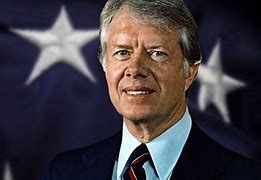

title:: 080 Jimmy Carter: Outsider

- ## 080 Jimmy Carter: Outsider
- ## pure
  collapsed:: true
	- VOA Learning English presents America's Presidents.
	- Today we are talking about Jimmy Carter. His given name was James, but he liked to be called Jimmy.
	- Carter was elected president in 1976. Until he campaigned for the office, few Americans knew who he was.
	- But Carter said his lack of experience with the federal government made him the best candidate. After witnessing years of problems in the White House, many voters appeared to agree with him.
	- However, Carter's inexperience also became a problem. Some of the issues he faced were complex and, at times, they seemed overwhelming.
	- After only one term, Carter failed to get re-elected.
	- But in time, his public image improved. His years after leaving the White House are generally considered more successful than his time in office.
	- ## Early life
	- Jimmy Carter was born in the southern state of Georgia. He was the oldest of four children. His father was a businessman. His mother was a nurse. The family owned a store, as well as a peanut farm and warehouse.
	- Although the businesses did well, Jimmy Carter grew up very modestly. His family's house did not have electricity or running water.
	- But he was hardworking and wanted to be successful. As a boy, he saved enough money to buy four houses. He earned more money by renting them to other people.
	- He also decided to attend college at the United States Naval Academy. And in time, he did so.
	- Carter was an excellent student. And he became a fine Naval officer. As a midshipman, Carter worked on one of the country's first nuclear submarines. He later taught nuclear engineering to other crewmembers.
	- But Carter's promising career in the Navy ended after only seven years.
	- His father was dying. And the family farm was in trouble.
	- Carter, his wife, Rosalynn, and their three sons, decided to return to Georgia and try to save it.
	- The first years back on the farm were difficult. But in time, the business became successful again.
	- Carter began to turn his attention to other issues. He became involved in his church, local school, hospitals and libraries. When he had a chance to compete for a position in the state senate, he took it.
	- As a politician, Carter developed an image as an independent thinker who tried to save the government money. He also acted and spoke strongly against racial discrimination.
	- In Georgia at the time, many voters did not agree with Carter's support of racial equality. In 1966, even his own Democratic Party did not choose him to be its candidate to represent Georgia in the U.S. Senate.
	- So Carter began campaigning for the office of state governor instead. In 1970, he was elected. As Georgia's governor, Carter was known as a social and political reformer.
	- However, historian Robert Strong notes that Carter did not always work well with others in his party.
	- Strong teaches at Washington and Lee University in Lexington, Virginia. He writes that some Georgia lawmakers believed Carter was "arrogant." He could appear to think he was morally right, and they were morally wrong.
	- Carter's difficulty in getting along with other officials proved to be one of the problems he would later face.
	- But in the presidential election of 1976, many Americans seemed to like this quality. The little-known governor from Georgia defeated the sitting president, Gerald Ford.
	- Carter won, in part, by saying that he was different than other politicians. He was, he said, a Washington outsider.
	- Then suddenly, Carter was the biggest insider of all: the American president.
	- ## Presidency
	- One of the things Carter wanted to do was change the image of the president.
	- Earlier leaders, such as Richard Nixon and Lyndon Johnson, had increased the power of the presidency. Nixon had also been shown to be dishonest, and resigned from office.
	- Carter promised never to lie to the American people. And on the day of his swearing-in as president, he purposefully tried to keep things simple. He walked to the White House from the U.S. Capitol building instead of riding in the back of an automobile.
	- His wife, Rosalynn, wore clothes that she had worn in public before. The National First Ladies' Library notes that her choice of clothing sent a message of "an old American value of thrift – or respecting money, and not spending it needlessly."
	- What she wore was meaningful because the country was going through difficult economic times. The Carters wanted to show that the new government would work to cut costs. They also wanted to show that they were there to help the American people, not enjoy the powers of the White House.
	- But in the end, the Carter administration received poor ratings in surveys of public opinion.
	- President Carter had trouble dealing with U.S. lawmakers, even when his party was in control of Congress. One result was that Carter could not advance many of his ideas for legislation. He appeared ineffective.
	  Many historians point out that, in fact, Carter had a number of successes. He helped reduce the country's dependence on foreign oil. He took steps to make the federal government more efficient, and to improve the environment. He appointed a number of women and racial minorities to top government jobs -- an important move at a time when many were pressing for women's rights and civil rights. And, in many cases, Carter supported human rights causes, both in the United States and around the world.
	- But the public generally did not see Carter for his successes. Instead, many Americans blamed him for the country's economic problems.
	- Some also disliked the way he spoke to them. In one speech, Carter blamed the country's troubles on what he called a crisis of confidence. Some listeners were offended.
	- He also decided that the U.S. would not attend the 1980 Olympic Games in Moscow. The move was meant to punish the Soviet Union for its involvement in Afghanistan. But many Americans believed the move mostly hurt young American Olympians.
	- The administration also faced other problems. The president was never accused of wrongdoing. But other high-level officials were. So was the president's brother, Billy. As a result, Jimmy Carter's public image for honesty suffered.
	- Then came the Iran hostage crisis.
	- ## Iran hostage crisis
	- The conflict between the United States and Iran had a long history. One part involved the Shah of Iran. The U.S. government had supported his rise to power, partly because American interests wanted to control Iran's oil.
	- But the Shah severely abused his power. Many Iranians resisted. Some wanted a leader who would more closely obey Islamic teachings.
	- In 1979, under pressure from those Iranians and others, the Shah fled the country. By now, he was suffering from cancer.
	- So, as a humanitarian act, President Carter permitted the Shah to come to the United States for medical treatment.
	- The move made many Iranians angry. In protest, a group of students seized the U.S. embassy in Tehran, the capital of Iran. They took 90 people, including 66 Americans, hostage.
	- Carter worked hard to get the hostages released. He tried diplomatic negotiations and economic restrictions.
	- But his efforts did not work.
	- Finally, he tried a secret military operation. He sent eight helicopters and a team of special forces to enter the embassy and rescue the hostages.
	- But that operation failed, too. The weather was bad. Three of the helicopters crashed. Eight Americans were killed.
	- And the public's approval of Jimmy Carter dropped even more.
	- After 444 days, the remaining hostages were released. In exchange, the U.S. government agreed to end some of its economic sanctions against Iran and promised not to interfere in the country's affairs.
	- None of the hostages had been seriously hurt. But the crisis was the final blow to Carter's presidency. A few months before they were released, his effort to seek re-election failed.
	- ## Legacy
	- As president, Carter did not meet the high expectations he had set for himself. And he faced some unusually difficult situations. His presidency also suffered from his problems communicating effectively with Congress, the media, and the American people.
	- But his four years as president did leave several marks on the office. For one, he showed that the U.S. president could help other nations and sides resolve their disputes.
	- Carter's best-known success as president was his help negotiating the Camp David Accords.
	- The accords were a peace agreement between Egypt and Israel. Carter led the talks at Camp David in Maryland.
	- Carter's efforts to protect human rights overseas also influenced the foreign policy of later presidents.
	- In time, his work as a defender of human rights has become his most important legacy.
	- Several years after leaving the presidency, he founded the Carter Presidential Center at Emory University in Atlanta, Georgia. The center "seeks to prevent and resolve conflicts, enhance freedom and democracy, and improve health."
	- In addition to his work there, Carter has helped build houses for people who need them, written books, and negotiated with world leaders to take steps toward peace.
	- In 2002, Carter received the Nobel Peace Prize for his efforts.
- ---
- ## def
	- VOA Learning English presents America's Presidents.
	- Today we are talking about Jimmy Carter. His given name was James, but he liked to be called Jimmy.
		- > ▶ Jimmy Carter
		  
	- Carter was elected president in 1976. Until he campaigned for the office, few Americans knew who he was.
	- But Carter said /his lack of experience with the federal government /made him the best candidate. After witnessing(v.) years of problems in the White House, many voters appeared to agree with him.
		- > ▶ witness [ VN ] to see sth happen (typically a crime or an accident) 当场看到，目击（尤指罪行或事故）
		  + /[ VN ] to be the place, period, organization, etc. in which particular events take place 是发生…的地点（或时间、组织等）；见证
	- However, Carter's inexperience /also became a problem. Some of the issues he faced /were complex and, at times, they seemed overwhelming.
	- After only one term, Carter failed to get re-elected.
	- But in time, his public image improved. His years after leaving the White House /are generally considered more successful /than his time in office.
	- ## Early life
	- Jimmy Carter was born /in the southern state of Georgia. He was the oldest of four children. His father was a businessman. His mother was a nurse. The family owned a store, **as well as** a peanut farm and warehouse.
	- Although the businesses did well, Jimmy Carter grew up very modestly. His family's house did not have electricity or running water.
		- 他家的房子没有电，也没有自来水。
	- But he was hardworking /and wanted to be successful. As a boy, he saved enough money to buy four houses. He earned more money /by **renting** them **to** other people.
	- He also decided /to attend college at the United States Naval Academy. And in time, he did so.
		- 美国海军学院
	- Carter was an excellent student. And he became a fine Naval officer. As a midshipman, Carter worked /on one of the country's first nuclear submarines. He later **taught** nuclear engineering **to** other crewmembers.
		- > ▶ midshipman : a person /training to be an officer in the navy 海军军官候补生；海军学校学员
		  => 比喻用法，因军校学员站在船中间执勤而得名。
	- But Carter's promising(a.) career in the Navy /ended after only seven years.
		- > ▶ promising (a.) showing signs of being good or successful 有希望的；有前途的；有出息的
	- His father was dying. And the family farm was in trouble.
	- Carter, his wife, Rosalynn, and their three sons, decided to return to Georgia /and try to save it.
	- The first years back on the farm /were difficult. But in time, the business became successful again.
	- Carter began to turn his attention to other issues. He became involved in his church, local school, hospitals and libraries. When he had a chance /**to compete for** a position in the state senate, he took it.
		- 他投身于教堂、当地学校、医院和图书馆。当他有机会竞争州参议院的职位时，他抓住了机会。
	- As a politician, Carter developed an image as an independent thinker /who tried to save the government money. He also acted and spoke strongly /against racial discrimination.
		- 独立思考的人
	- In Georgia at the time, many voters did not agree with Carter's support of racial equality. In 1966, even his own Democratic Party /did not choose him to be its candidate /to represent Georgia in the U.S. Senate.
	- So Carter began campaigning for the office of state governor instead. In 1970, he was elected. As Georgia's governor, Carter was known as a social and political reformer.
		- 所以卡特转而开始竞选州长。
	- However, historian Robert Strong notes that /Carter did not always work well with others in his party.
	- Strong teaches(v.) at Washington and Lee University in Lexington, Virginia. He writes that /some Georgia lawmakers believed /Carter was "arrogant(a.)." He could appear to think he was morally right, and they were morally wrong.
		- > ▶ arrogant (a.) behaving in a proud, unpleasant way, showing little thought for other people 傲慢的；自大的
		- > ▶ appear (v.) ( not used in the progressive tenses 不用于进行时 ) to give the impression of being or doing sth 显得；看来；似乎
		  -> She appeared to be in her late thirties. 看样子她快四十岁了。
		  -> It appears that /there has been a mistake. 看来有一个差错。
		- 一些乔治亚州议员认为卡特“傲慢自大”。他似乎认为自己在道德上是对的，而他们在道德上是错的。
	- Carter's difficulty /in **getting along with** other officials /proved to be one of the problems /he would later face.
		- > ▶ get along with 与……和睦相处；取得进展
	- But in the presidential election of 1976, many Americans seemed to like this quality. The little-known governor from Georgia /defeated the sitting president, Gerald Ford.
	- Carter won, in part, by saying that /he was different than other politicians. He was, he said, a Washington outsider.
	- Then suddenly, Carter was the biggest insider of all: the American president.
		- 突然之间，卡特成了最大的圈内人:美国总统。
	- ## Presidency
	- One of the things Carter wanted to do /was change the image of the president.
	- Earlier leaders, such as Richard Nixon and Lyndon Johnson, had increased the power of the presidency. Nixon had also been shown to be dishonest, and resigned from office.
	- Carter promised /never to lie to the American people. And on the day of his swearing-in as president, he purposefully tried to keep things simple. He walked to the White House /from the U.S. Capitol building /**instead of** riding in the back of an automobile.
		- > ▶ purposefully  adv. 有目的地；自觉地
	- His wife, Rosalynn, wore clothes /that she had worn /in public before. The National First Ladies' Library notes that /her choice of clothing /sent a message of "an old American value of thrift – or respecting(v.) money, and not spending it needlessly."
		- > ▶ needless (a.) needless death or suffering is not necessary /because it could have been avoided 不必要的；可以避免的
		  -> Many soldiers died needlessly. 许多战士白白地牺牲了。 
		  -> The process was needlessly slow. 进程过于缓慢了。
		- 国家第一夫人图书馆指出，她选择的服装传达了“美国人节俭的传统价值观——尊重金钱，不要不必要地花钱。”
	- What she wore was meaningful /because the country was going through difficult economic times. The Carters wanted to show that /the new government would work to cut costs. They also wanted to show that /they were there /to help the American people, not enjoy the powers of the White House.
	- But in the end, the Carter administration /received poor ratings /in surveys of public opinion.
		- 但最终，卡特政府在民意调查中得到了很差的评价。
	- President Carter had trouble /dealing with U.S. lawmakers, even when his party was in control of Congress. One result was that /Carter could not advance(v.) many of his ideas for legislation. He appeared ineffective.
	- Many historians point out that, in fact, Carter had a number of successes. He helped reduce the country's dependence on foreign oil. He took steps /to make the federal government more efficient, and to improve the environment. He **appointed** a number of women and racial minorities **to** top government jobs -- an important move /at a time /when many were pressing(v.) for women's rights and civil rights. And, in many cases, Carter supported human rights causes, **both** in the United States **and** around the world.
		- > ▶ **press (v.) ~ sb (for sth) |~ sb (into sth/into doing sth)** : to make strong efforts to persuade or force sb to do sth 催促；敦促；逼迫 SYN push urge
		  -> The bank is pressing us for repayment of the loan. 银行正在催我们偿还贷款。
		- 这在许多人迫切要求妇女权利和公民权利的时候, 这是一个重要举措。
	- But the public /generally did not see Carter for his successes. Instead, many Americans **blamed** him **for** the country's economic problems.
	- Some also disliked the way he spoke to them. In one speech, Carter **blamed** the country's troubles **on** what he called a crisis of confidence. Some listeners were offended.
		- 在一次演讲中，卡特将国家的困境归咎于他所谓的信任危机。一些听众被冒犯了。
	- He also decided that /the U.S. would not attend the 1980 Olympic Games in Moscow. The move was meant to punish the Soviet Union for its involvement in Afghanistan. But many Americans believed /the move mostly hurt young American Olympians.
	- The administration also faced other problems. The president **was never accused of** wrongdoing. But other **high-level officials** were. So was the president's brother, Billy. As a result, Jimmy Carter's public image for honesty /suffered.
		- 总统从未被指控有不当行为, 但其他高层官员却被指控了。总统的哥哥比利也是如此。结果，吉米·卡特诚实的公众形象受损。
	- Then came the Iran hostage crisis.
	- ## Iran hostage crisis
	- The conflict between the United States and Iran /had a long history. One part involved the Shah of Iran. The U.S. government had supported his rise to power, partly because American interests /wanted to control Iran's oil.
		- > ▶ hostage (n.) a person who is captured and held prisoner by a person or group, and who may be injured or killed if people do not do what the person or group is asking 人质
		- > ▶ shah   /ʃɑː/   the title of the kings of Iran in the past 沙（旧时伊朗国王的称号）
	- But the Shah /severely abused his power. Many Iranians resisted. Some wanted a leader /who would more closely obey Islamic teachings.
		- 一些人想要一个更严格遵守伊斯兰教义的领导人。
	- In 1979, under pressure from those Iranians and others, the Shah fled the country. By now, he was suffering from cancer.
	- So, as a humanitarian act, President Carter /permitted the Shah /to come to the United States /for medical treatment.
	- The move /made many Iranians angry. In protest, a group of students /seized the U.S. embassy in Tehran, the capital of Iran. They **took** 90 people, including 66 Americans, **hostage**.
		- 他们劫持了90人作为人质
	- Carter worked hard /to get the hostages released. He tried dipl**omatic negotiations** and **economic restrictions**.
	- But his efforts did not work.
	- Finally, he tried a secret military operation. He sent eight helicopters /and a team of special forces /to enter the embassy /and rescue the hostages.
	- But that operation failed, too. The weather was bad. Three of the helicopters crashed. Eight Americans were killed.
	- And the public's approval of Jimmy Carter /dropped even more.
	- After 444 days, the remaining hostages were released. In exchange, the U.S. government /agreed to end some of its economic sanctions against Iran /and promised not to interfere in the country's affairs.
	- None of the hostages had been seriously hurt. But the crisis /was the final blow to Carter's presidency. A few months before they were released, his effort to seek re-election failed.
		- 但这场危机, 是对卡特总统任期的最后一击。
	- ## Legacy
	- As president, Carter did not meet the high expectations /he had set for himself. And he faced some unusually difficult situations. His presidency also suffered from his problems /**communicating(v.) effectively with** Congress, the media, and the American people.
		- 卡特没有达到他为自己设定的高期望。... 在总统任期内，他与国会、媒体和美国人民的有效沟通也存在问题。
	- But his four years as president /did leave several marks on the office. For one, he showed that /the U.S. president could help other nations and sides /resolve their disputes.
		- 他表明美国总统可以帮助其他国家和各方, 解决争端。
	- Carter's best-known success as president /was his help negotiating(v.) the Camp David Accords.
		- > ▶ accord (n.) a formal agreement between two organizations, countries, etc. 协议；条约
		- 卡特作为总统最著名的成就是他帮助谈判了《戴维营协议》。
	- The accords were a peace agreement /between Egypt and Israel. Carter **led the talks** /at Camp David in Maryland.
		- 主持了会谈。
	- Carter's efforts to protect human rights overseas /also influenced the foreign policy of later presidents.
	- In time, his work as a defender of human rights /has become his most important legacy.
	- Several years /after leaving the presidency, he founded(v.) the Carter Presidential Center /at Emory University in Atlanta, Georgia. The center "seeks to prevent and resolve conflicts, enhance freedom and democracy, and improve health."
	- **In addition to** his work there, Carter has helped build houses for people who need them, written books, and negotiated with world leaders /to take steps toward peace.
	- In 2002, Carter received the Nobel Peace Prize for his efforts.
- ---
- Jimmy Carter
	- 他早年一直在军队中服役，曾任佐治亚州州长，1976年代表民主党当选总统。
	- 在任期间，卡特创建了两个新的内阁部门，能源部和教育部。
	- 卸任后，卡特积极参与调停各种战争及人质危机的斡旋工作，反对美国小布什政府攻打伊拉克。2002年获得诺贝尔和平奖。
	- 卡特16岁中学毕业后，进入美国佐治亚州立西南大学读了一年工科，然后转入乔治亚理工学院。1943年父亲的好友、众议员斯芬·佩斯说情，把他保送进美国海军在安那波利斯的美国海军官校.
	- 由于卡特父亲去世，他决定退役还乡继承父业.
	- 卡特关心和参与当地的社会活动。他广泛地与群众接触，尽量扩大联系面，逐渐成为普兰斯镇的头面人物。1970年，被称为“乡下佬”的卡特竞选成功，成为佐治亚州第76届州长。
	- 这一系列做法，为卡特树立了“最有成就的州长”的形象。按当时该州的法律，州长只能任期一届，但4年州长任期期满时，他已有了一段可以用来竞选总统的资历。
	- 卡特在总统任期内，力求加强其平易近人的形象，出现在公众场合时，穿着及言谈均不拘形式，不时举行记者招待会，并避免总统的排场。
	- 然而尽管民主党在参众两院均占有绝对多数席位，卡特雄心勃勃的社会、行政、经济改革方案还是在国会受到阻力，特别是受保守派民主党人与共和党人联合阻挡他的法案通过，这导致多次短暂的美国政府停摆。保守派认为他未能彰显和恢复美国社会价值，如堕胎合法化问题的处理（他接受最高法院堕胎合法化的判决），自由派则认为他无所作为。由于不能将其理想抱负变成现实，到1978年时，他最初树立起来的声望便逐渐消失。