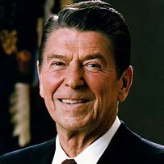

title:: 081 Ronald Reagan: Communicator

- ## 081 Ronald Reagan: Communicator
- ## pure
  collapsed:: true
	- VOA Learning English presents America's Presidents.
	- Today we are talking about Ronald Reagan. He was president for two terms, and served from 1981 to 1989. Before that, he was the governor of California, worked as an actor and led a labor union.
	- As president, Reagan is credited for changing the direction of the country. He tried to establish a feeling of confidence in the American people.
	- Although not everyone profited equally from his policies, the president rarely suffered in public opinion polls. Reagan was called the "Great Communicator" because he was able to connect with many Americans, and to speak persuasively about conservative values.
	- He is remembered warmly by many Republican Party politicians and voters especially.
	- ## Early life
	- Ronald Reagan is often linked to California and the American West. But he was born and raised in Illinois, in the center of the United States.
	- His father sold shoes, and his mother mostly took care of Ronald and his older brother, Neil. The entire family supported the Democratic Party, especially President Franklin Roosevelt.
	- While the boys were growing up, the Reagans did not have much money, and the father suffered from alcoholism.
	- But Ronald was energetic and took part in many activities.
	- He played football and basketball; ran on the track team; swam; acted in plays; led student groups; wrote for school newspapers and yearbooks; and worked several jobs to help pay for his education and support his parents.
	- He attended Eureka College in Illinois, and completed his studies in 1932.
	- One of his first jobs out of college was as a sports announcer for a radio station. He had an appealing voice and a natural way of talking that was a good fit for radio.
	- Reagan was also good-looking, and a dependable worker. In time, he was offered a chance to act in movies and moved to California.
	- During his acting career, Reagan made more than 50 films. He also married actress Jane Wyman and had two children with her. But after several years, the relationship ended. Their marriage ended in divorce.
	- Four years later, Reagan married another actress. Her name was Anne Robbins, but she was called Nancy Davis. They also had two children.
	- As he was starting his second family, Reagan began another part of his career. He served as host of a popular television series about the American West. He also became president of a labor union, the Screen Actors Guild. It represented actors, announcers, and others working in the film and television industry.
	- During that time, Reagan's political beliefs changed. He increasingly supported conservative ideas. During public appearances, he often spoke in support of business interests. He also expressed concern that the federal government was limiting Americans' freedom.
	- The message was well-received by many Americans. Although the Democratic Party was in power for most of the 1960s, a number of Americans were becoming increasingly conservative.
	- Reagan won national recognition in 1966 when he successfully ran for governor of California as a Republican. In 1970, voters re-elected him to the position.
	- But Reagan had set his sights on the presidency. He sought the Republican nomination in both 1968 and 1976.
	- Finally, in 1980, he won the office. By that time, he had already had several careers, as well as a long life. At age 69, he was the oldest person until then to be elected president.
	- ## Presidency
	- When Reagan took office, he made improving the U.S. economy his highest concern. One way to do that, he believed, was to reduce the influence of the federal government.
	- He wanted especially to cut some of the government programs that former president Lyndon Johnson had put in place to help poor people. Reagan believed that cutting taxes – especially on big businesses – would help strengthen the economy, and in time help everyone.
	- In a speech after taking office, Reagan noted that, "Government is not the solution to our problem; government is the problem."
	- At first, the economy continued to struggle. But in a few years, Reagan's policies appeared to work. Unemployment dropped, the stock market rose, and many industries grew quickly. Americans often remember Reagan's presidency as a time of economic growth.
	- Not everyone benefited equally, however. Reagan's critics observed that his policies largely helped people who were already wealthy. The divide between rich and middle-class Americans increased during Reagan's presidency.
	- And Reagan did not reduce government spending in all areas. In fact, he sharply increased military spending.
	- One result was a large national debt. Another result, Reagan's supporters say, was a quicker end to the Cold War.
	- One of Reagan's major foreign policy goals was to end the stand-off with the Soviet Union. He believed that building up the U.S. military was the best way to pressure the Soviets to reach an agreement on arms control.
	- Reagan also spoke out strongly against communism. In his second term, he famously appealed to the new Soviet leader, Mikhail Gorbachev, to tear down the Berlin Wall. For some, the wall was a sign of communism.
	- Many historians say Reagan's policies worked. For sure, Reagan and Gorbachev improved relations between their countries. And in time, the Soviet leadership permitted the Berlin Wall to come down.
	- ## Assassination attempt and Iran-Contra scandal
	- In addition to the economy and the Cold War, Reagan is often remembered for his likable personality. He spoke easily with the public, often had a positive message about the country, and usually appeared cheerful.
	- He won even more public approval after a man with mental problems tried to kill him.
	- The bullets seriously injured several people nearby, and just missed Reagan's heart.
	- Yet, shortly after he was shot, the president joked with his wife and with his doctors. Opinion polls showed that the recovered president was more popular than ever.
	- Reagan's political image also survived a scandal known as Iran-Contra. In brief, Congress found that a number of government officials secretly sold U.S. weapons to Iran as part of a deal to free hostages. Then, the officials used some of the money to help rebels in Nicaragua.
	- The actions violated congressional rules. They also challenged Reagan's promise that he had not traded weapons for hostages.
	- The president apologized for any part he had played in the events. Polls showed that, in general, the American public accepted his apology and continued to trust him.
	- Unlike most U.S. presidents, who lose public support during their terms, Reagan finished his time in office as he had taken it – with the support of more than half of Americans.
	- ## Legacy
	- Reagan retired to his home in California with his wife, Nancy. For several years, he wrote about his life and helped organize his presidential library.
	- But in a few years, the former president announced that he suffered from Alzheimer's. The disease affects people's ability to think, remember, and express themselves.
	- Soon, Reagan disappeared from public life. He died in 2004.
	- But he is well-remembered as an able politician who could work effectively with many people. He is also remembered – by both supporters and critics – for being a powerful voice for conservative ideas and traditional values.
	- His influence extended beyond his two terms. Later generations of leaders and voters called themselves Reagan Republicans.
- ---
- ## def
	- VOA Learning English presents America's Presidents.
	- Today we are talking about Ronald Reagan. He was president for two terms, and served from 1981 to 1989. Before that, he was the governor of California, worked as an actor and led a labor union.
		- > ▶ Ronald Reagan
		  
	- As president, Reagan is credited for changing the direction of the country. He tried to establish a feeling of confidence /in the American people.
		- ((626205b5-6665-4379-98ed-e231f20edaa7))
	- Although not everyone profited equally /from his policies, the president rarely suffered /in public opinion polls. Reagan was called the "Great Communicator" /because he was able to connect with many Americans, and to speak persuasively about conservative values.
		- > ▶ communicator (n.)a person who communicates sth to others 沟通的人；交流者
		- > ▶ persuasively  adv. 令人信服地；口才好地
		- 里根被称为“伟大的沟通者”，因为他能够与许多美国人建立联系，并能令人信服地谈论保守的价值观。
	- He is remembered warmly /by many Republican Party politicians and voters especially.
	- ## Early life
	- Ronald Reagan is often linked to California and the American West. But he was born and raised in Illinois, in the center of the United States.
	- His father sold shoes, and his mother mostly took care of Ronald and his older brother, Neil. The entire family supported the Democratic Party, especially President Franklin Roosevelt.
		- 他的母亲主要照顾...
	- While the boys were growing up, the Reagans did not have much money, and the father suffered from alcoholism.
		- > ▶ alcoholism [ U ] the medical condition caused by drinking too much alcohol regularly 酒精中毒; 酗酒
	- But Ronald was energetic and took part in many activities.
	- He played football and basketball; ran on the track team; swam; acted in plays; led student groups; wrote for school newspapers and yearbooks; and worked several jobs /to help pay for his education and support his parents.
		- > ▶  track team 田径队
		- > ▶ yearbook 年鉴；年刊 /（每年出版的）校刊；学校年刊
	- He attended Eureka College in Illinois, and completed his studies in 1932.
	- One of his first jobs out of college /was as a sports announcer /for a radio station. He had an appealing voice /and a natural way of talking /that was a good fit for radio.
		- > ▶ announcer （广播、电视的）广播员，播音员，节目主持人
		- 他有一副动人的嗓音, 和一种很适合广播的自然的说话方式。
	- Reagan was also good-looking, and a dependable worker. In time, he was offered a chance /to act in movies /and moved to California.
		- 里根也很帅，是个可靠的员工。
	- During his acting career, Reagan made more than 50 films. He also married actress Jane Wyman /and had two children with her. But after several years, the relationship ended. Their marriage ended in divorce.
		- > ▶ divorce (n.)(v.)离婚
		  =>  di-旁 + vorc(-vers-)转 + -e → 把丈夫或妻子转出通道
	- Four years later, Reagan married another actress. Her name was Anne Robbins, but she was called Nancy Davis. They also had two children.
	- As he was starting his second family, Reagan began another part of his career. He served as host of a popular television series /about the American West. He also became president of a labor union, the Screen Actors Guild. It represented actors, announcers, and others /working in the film and television industry.
		- > ▶ guild N-COUNT A guild is an organization of people who do the same job. 同业公会
		- 他曾担任一部关于美国西部的流行电视连续剧的主持人。他还成为了工会——美国演员工会(Screen Actors Guild)的主席。
	- During that time, Reagan's political beliefs(n.) changed. He increasingly supported conservative ideas. During public appearances, he often spoke /in support of business interests. He also expressed concern /that the federal government was limiting Americans' freedom.
		- 在公开露面时，他经常发表支持商业利益的讲话。
	- The message was well-received by many Americans. Although the Democratic Party was in power /for most of the 1960s, a number of Americans were becoming increasingly conservative.
	- Reagan won national recognition in 1966 /when he successfully ran for governor of California as a Republican. In 1970, voters re-elected him to the position.
		- > ▶ recognition  [ sing.U ] ~ (that...): the act of accepting that sth exists, is true or is official 承认；认可
		  -> There is a general recognition /of the urgent need for reform. 人们普遍认识到迫切需要改革。 
		  + /[ U ] ~ (for sth) :public praise and reward for sb's work or actions 赞誉；赏识；奖赏
		  -> She gained only minimal recognition /for her work. 她的工作仅仅得到极少的赞誉。
		- 1966年，里根作为共和党人成功竞选加州州长，赢得了全国的认可。1970年，选民再次选举他担任该职位。
	- But Reagan had **set his sights /on** the presidency. He sought the Republican nomination in both 1968 and 1976.
		- > ▶ **set your sights on sth/on doing sth** :
		  to decide that you want sth and to try very hard to get it 以…为奋斗目标；决心做到
		  -> She's set her sights on getting into Harvard. 她决心要上哈佛大学。
		- 但里根的目标是当总统。1968年和1976年，他都曾寻求共和党提名。
	- Finally, in 1980, he won the office. By that time, he had already had several careers, **as well as** a long life. At age 69, he was the oldest person until then /to be elected president.
		- 到那时，他已经有了好几种职业，而且年龄也很大。
	- ## Presidency
	- When Reagan took office, he **made** improving the U.S. economy 宾补 his highest concern. One way to do that, he believed, was to reduce the influence of the federal government.
	- He wanted especially /to cut some of the government programs /that `主` former president Lyndon Johnson /`谓` had put in place /to help poor people. Reagan believed that /cutting taxes – especially on big businesses – would help strengthen the economy, and in time /help everyone.
		- 他特别想削减前总统林登·约翰逊实施的帮助穷人的政府计划。里根认为，减税——特别是对大企业减税——将有助于加强经济，并最终帮助每个人。
	- In a speech /after taking office, Reagan noted that, "Government is not the solution to our problem; government is the problem."
	- At first, the economy continued to struggle. But in a few years, Reagan's policies appeared to work. Unemployment dropped, the stock market rose, and many industries grew quickly. Americans often **remember** Reagan's presidency **as** a time of economic growth.
	- Not everyone benefited equally, however. Reagan's critics observed that /his policies largely helped people /who were already wealthy. `主` The divide between rich and middle-class Americans `谓` increased /during Reagan's presidency.
	- And Reagan did not reduce(v.) government spending /in all areas. In fact, he sharply increased military spending.
		- > ▶ increase  (v.) /ɪnˈkriːs/  ~ (sth) (from A) (to B) |~ (sth) (by sth): to become or to make sth greater in amount, number, value, etc. （使）增长，增多；增加
	- One result was a large national debt. Another result, Reagan's supporters say, was a quicker end /to the Cold War.
	- One of Reagan's major foreign policy goals /was to end the stand-off(n.) with the Soviet Union. He believed that /building up the U.S. military /was the best way /to pressure the Soviets to reach an agreement on arms control.
		- > ▶  stand-off (n.) ~ (between A and B) : a situation in which no agreement can be reached （双方）僵持局面
		- 他认为，增强美国军队, 是迫使苏联达成军备控制协议的最佳方式。
	- Reagan also spoke out strongly /against communism. In his second term, he famously **appealed to** the new Soviet leader, Mikhail Gorbachev, **to tear down** the Berlin Wall. For some, the wall was a sign of communism.
		- > ▶ appeal : (v.) [ V ] ~ (to sb) (for sth) :to make a serious and urgent request 呼吁；吁请；恳求
		  + /~ (to sth) : to try to persuade sb to do sth /by suggesting that /it is a fair, reasonable, or honest thing to do 启发；劝说；打动
		  + /[ V ] ~ (to sb/sth) (against sth) : to make a formal request to a court or to sb in authority for a judgement or a decision to be changed 上诉；申诉
		- > ▶ **tear sth down** : to pull or knock down a building, wall, etc. 拆毁，拆除（建筑物、墙等）
	- Many historians say /Reagan's policies worked. For sure, Reagan and Gorbachev /improved relations between their countries. And in time, the Soviet leadership /permitted the Berlin Wall to come down.
	- ## Assassination attempt and Iran-Contra scandal
	- **In addition to** the economy and the Cold War, Reagan is often remembered /for his likable personality. He spoke easily with the public, often had a positive message about the country, and usually appeared cheerful.
		- 里根经常因为他可爱的个性而被人记住。他很容易与公众交谈，经常传递有关国家的积极信息，通常表现得很高兴。
	- He won even more public approval /after a man with mental problems /tried to kill him.
	- The bullets /seriously injured several people nearby, and just missed Reagan's heart.
		- > ▶  just missed 刚好错过
	- Yet, shortly after he was shot, the president joked with his wife and with his doctors. Opinion polls showed that /the recovered president was more popular than ever.
	- Reagan's political image `谓` also survived a scandal /known as Iran-Contra. In brief, Congress found that /a number of government officials /secretly **sold** U.S. weapons **to** Iran /as part of a deal /to free hostages. Then, the officials used some of the money /to help rebels in Nicaragua.
		- 里根的政治形象也从伊朗门丑闻中幸存下来。... 然后
	- The actions violated congressional rules. They also challenged Reagan's promise /that he had not traded(v.) weapons for hostages.
		- 这些行为违反了国会规定。
	- The president apologized for any part /he had played in the events. Polls showed that, in general, the American public /accepted his apology /and continued to trust him.
	- Unlike most U.S. presidents, who lose public support /during their terms, Reagan finished his time in office /as he had taken it – with the support of more than half of Americans.
		- 里根以他上任时的方式, 结束了他的任期——得到了超过一半美国人的支持。
	- ## Legacy
	- Reagan retired to his home in California with his wife, Nancy. For several years, he wrote about his life /and helped organize his presidential library.
	- But in a few years, the former president announced that /he suffered from Alzheimer's. The disease affects people's ability to think, remember, and express themselves.
		- > ▶ Alzheimer n. 阿尔茨海默病（等于Alzheimer’s disease）
	- Soon, Reagan disappeared from public life. He died in 2004.
	- But he is well-remembered as an able politician /who could work effectively with many people. He is also remembered – by both supporters and critics – for being a powerful voice /for conservative ideas and traditional values.
	- His influence /extended beyond his two terms. Later generations of leaders and voters /called themselves Reagan Republicans.
- ---
- Ronald Reagan
	- 1937年，开启其演艺生涯。里根后被推举为美国影视演员协会主席，他在其主席任期内坚决地贯彻反共主义，并致力根除共产主义对美国演艺界的影响。
	- 1964年，里根为共和党总统候选人戈德华发表“抉择时刻”演说，此举为这位刚踏入政坛的政治新人赢得了全国的关注，顺势成为当时新保守主义的代言人。
	- 在赢得一定的支持者后，里根于1966年当选为加州州长。
	- 里根在1980年的选战中, 当选为美国总统。里根推行的经济政策，将所得税降低了25%、减少通货膨胀、降低利率、扩大军费开支、增加政府赤字和国债，排除税赋规则的漏洞，继续对商业行为撤销管制. 使美国经济在历经1981－1982年的急剧衰退后，于1982年开始了非常茁壮的经济成长，到他任期结束并一直持续。
	- 他始终强调, **他对于联邦政府在处理问题上的能力, 抱持着怀疑态度，尤其是在经济问题方面。他的解决方式是撤回政府的干涉并减少税率和商业管制，以此让自由市场机制能自动修正所面临的问题。**他在就职典礼那天说道：“**政府并不是解决问题的方法，政府本身才是问题所在。**”
	- 在对外政策上，他大幅度扩张军备，对苏联的政策则由原本的围堵改为直接的对抗。里根在政治意识形态上贯彻了反共主义与民主资本主义。
	- 1989年里根离任时的支持率为68%，使他同富兰克林·罗斯福, 及之后的比尔·克林顿, 并列成为近现代史上, 离任时拥有最高支持率的总统。
	-
	- 里根由于他在表达概念时的口才, 和带有的独特情感, 而被誉为“伟大的沟通者”。这些口才技巧来自于他担任演员、电视和广播节目主持人、和政治家时逐渐培养的经验.
	- 盖洛普民意测验做了一次谁是最受欢迎的美国总统的调查。罗纳德·里根得到最高的87%支持，接下来依序是约翰·肯尼迪、德怀特·艾森豪威尔, 和富兰克林·德拉诺·罗斯福。**里根在接下来每年的许多民调测验中, 继续被选为是最好的美国总统之一。**