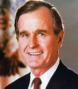

title:: 082 George H.W. Bush: Cautious

- ## 082 George H.W. Bush: Cautious
- ## pure
  collapsed:: true
	- VOA Learning English presents America's Presidents.
	- Today we are talking about George Herbert Walker Bush.
	- Before he became president in 1989, Bush had a lot of experience in government.
	- He spent four years in the United States House of Representatives, worked as the U.S. ambassador to the United Nations, and led the Central Intelligence Agency, or CIA. Then, for eight years, he was vice president under Ronald Reagan.
	- Interestingly, in U.S. history, a person serving as vice president rarely becomes president after the sitting president leaves office at the end of his term.
	- Before George H.W. Bush, the last time such an event happened was in 1836. At that time, Martin Van Buren took office after the two-term presidency of Andrew Jackson.
	- Yet neither Bush nor Van Buren was able to successfully deal with some of the problems facing the country during their years in office, or to persuade voters to elect them for a second term.
	- While many people respect Bush for his foreign policy successes, his years in office are also remembered as a time of economic problems and social unrest.
	- ## Early Life
	- George Bush was born into a wealthy family in Massachusetts, and raised in a Connecticut town near New York City. He had three brothers and a sister.
	- Their father was a business leader who became a U.S. senator. Their mother was active doing public service work. The family employed servants, but Mrs. Bush did not want her children's privileged position to make them think they were special. Instead, she taught them to work hard and help others.
	- When he was a young man, George Bush moved away from home to attend a private high school in Massachusetts. There, he played baseball and soccer, and was elected student body president.
	- On his 18th birthday, Bush joined the U.S. Navy. For three years, he fought in World War II. At the time, he was the youngest pilot in the Navy, and earned a medal for bravery.In early 1945, he married a young woman he had met at a dance. Her name was Barbara Pierce.
	- After the war, she and George moved to Connecticut, where he studied economics at Yale University and played on the school's baseball team.
	- In time, they moved to the southern state of Texas. George Bush worked in the oil industry, and became president of a company that sold oil drilling equipment.
	- George and Barbara Bush mostly raised their four sons and one daughter in the Houston, Texas area. Another daughter died of cancer when she was a child.
	- In time, George Bush decided to follow his father's example and enter politics. He became a Republican Party official. Then he was elected to the U.S. Congress, representing part of Houston.
	- Despite having a home in Texas, opponents and the public connected Bush with the East Coast and the upper class. That image created some problems for Bush in the presidential election of 1980.
	- By then, he had held other high offices in the federal government, and had been successful as the head of the CIA.
	- But voters liked another Republican candidate, former California governor Ronald Reagan. Many Americans remembered Reagan from his days in movies and on television.
	- When Reagan was nominated as the party's candidate for president, he asked Bush to be vice president. For eight years, Bush held the office, and worked closely with Reagan on foreign policy and other issues.
	- In 1988, Bush finally won the presidency in his own right.
	- ## Presidency
	- On entering the White House, the new president promised to continue many of Reagan's policies of limited government. While he was a candidate, Bush often said that, if elected, he would not raise taxes.
	- Bush also said that he wanted the United States to be "a kinder and gentler" nation. He wanted especially to support community organizations in their efforts to reduce crime, homelessness, and drug abuse.
	- He also signed legislation to help people with disabilities, and to protect the environment.
	- But Bush faced a number problems.
	- One was a large budget deficit, created in part by increased military spending during the Reagan years.
	- Another were disputes in Congress with the Democratic Party.
	- And another was a banking crisis. After years of problems in the savings and loan industry, more than 1,000 small financial institutions failed. In time, Congress agreed to spend billions of dollars to help the industry recover.
	- And President Bush had to break his promise not to raise taxes. He pointed out that he needed to balance the budget; however, many Americans and some members of his own party felt betrayed.
	- The economic troubles helped create a mood of unrest in the country. The feeling was strengthened by events around the world.
	- Soon after Bush took office, the Chinese government launched a campaign to stop protests in Beijing's Tiananmen Square.
	- A few months later, the Berlin Wall came down. The wall separated East and West Germany. Many considered its collapse to be the end of the Soviet Union's control of Eastern Europe.
	- At the same time, the leader of Panama, Manuel Noriega, was threatening Americans. He was also accused of supporting drug traffickers and the drug trade in the United States.
	- Bush answered all the events in a calm, cautious way. He tried to keep good relations with China and the Soviet Union. In time, he ordered military action in Panama, and U.S. troops ousted Noriega.
	- Supporters praised Bush's cool head and way of doing things. But critics questioned Bush's decisions. Some said he went too far. Others said he did not go far enough.
	- The same criticisms and support were repeated during the Gulf War against Iraq. In brief, Iraqi leader Saddam Hussein ordered his forces to invade and occupy Kuwait. Bush and other world leaders created an international coalition to seek a diplomatic solution.
	- When diplomacy failed, U.S. troops led international air strikes against Iraq. Coalition forces also attacked on the ground.
	- In a few weeks, the Iraqi leadership agreed to a ceasefire.
	- Some criticized Bush for letting Saddam Hussein stay in power. But the American public largely approved of Bush's actions. He won praise for helping create an international coalition to answer the Iraqi occupation.
	- The effort showed what some called a "New World Order." The U.S. and Soviet Union had even worked successfully together.
	- Yet, soon after the end of the Gulf War, Bush failed in his efforts at re-election. The U.S. economy had entered a recession. And Bush was not able to connect effectively with voters, even though those who knew him personally said Bush was a kind, gentle person. One of his last acts as president was to write a note for the candidate who had beat him, wishing him well.
	- ## Legacy
	- George H.W. Bush retired to his home in Texas with his wife, Barbara. They also have a house in Maine.
	- Bush often urged Americans to help others in their community. He put his words into action by volunteering with his church and supporting a local hospital.
	- On his 90th birthday, Bush did something unusual to test his image as a cautious person. He celebrated by going sky diving.
	- For many, Bush is remembered for his connection to other presidents. He is often linked to the Reagan years. Compared to Reagan, Bush is usually considered a less conservative leader, as well as a less charismatic one.
	- By the 21st century, historians began comparing the former president Bush with another president: his son, George Walker Bush, who took office eight years after his father left it.
- ---
- ## def
	- VOA Learning English presents America's Presidents.
	- Today we are talking about George Herbert Walker Bush.
		- > ▶ George H.W. Bush
		  
	- Before he became president in 1989, Bush had a lot of experience in government.
	- He spent four years /in the United States House of Representatives, worked as the U.S. ambassador to the United Nations, and led the Central Intelligence Agency, or CIA. Then, for eight years, he was vice president under Ronald Reagan.
	- Interestingly, in U.S. history, a person serving as vice president /rarely becomes president /after the sitting president leaves office /at the end of his term.
		- 有趣的是，在美国历史上，在任总统任期结束后，担任副总统的人很少能成为总统。
	- Before George H.W. Bush, the last time /such an event happened /was in 1836. At that time, Martin Van Buren took office /after the two-term presidency of Andrew Jackson.
	- Yet neither Bush nor Van Buren /was able to successfully deal with some of the problems facing the country /during their years in office, or to persuade voters /to elect them for a second term.
		- 然而，布什和范布伦都未能成功地处理他们执政期间国家面临的一些问题，也未能说服选民选举他们连任。
	- While many people /respect Bush for his foreign policy successes, his years in office /are also remembered as /a time of economic problems and social unrest.
	- ## Early Life
	- George Bush was born into a wealthy family in Massachusetts, and raised in a Connecticut town near New York City. He had three brothers and a sister.
	- Their father was a business leader who became a U.S. senator. Their mother was active doing public service work. The family employed servants, but Mrs. Bush did not want her children's privileged(a.) position /to make them think they were special. Instead, she taught them to work hard and help others.
		- > ▶ privileged  (a.) ( sometimes disapproving ) having special rights or advantages that most people do not have 有特权的；受特别优待的
	- When he was a young man, George Bush moved away from home /to attend a private high school in Massachusetts. There, he played baseball and soccer, and was elected(v.) **student body** president.
		- > ▶ soccer = football
	- On his 18th birthday, Bush joined the U.S. Navy. For three years, he fought in World War II. At the time, he was the youngest pilot in the Navy, and earned a medal for bravery.In early 1945, he married a young woman he had met at a dance. Her name was Barbara Pierce.
		- > ▶ pilot 飞行员；（飞行器）驾驶员
	- After the war, she and George moved to Connecticut, where he studied economics at Yale University /and played on the school's baseball team.
		- > ▶ Connecticut 州名
	- In time, they moved to the southern state of Texas. George Bush worked in the oil industry, and became president of a company that sold oil drilling equipment.
		- > ▶ drilling  n. 钻孔；训练
	- George and Barbara Bush /mostly raised their four sons and one daughter in the Houston, Texas area. Another daughter died of cancer /when she was a child.
	- In time, George Bush decided to follow his father's example /and enter politics. He became a Republican Party official. Then he was elected to the U.S. Congress, representing part of Houston.
		- > ▶ Houston n. 休斯顿（美国得克萨斯州港市）
	- Despite having a home in Texas, opponents and the public **connected** Bush **with** the East Coast and the upper class. That image created some problems for Bush /in the presidential election of 1980.
	- By then, he had held other high offices /in the federal government, and had been successful as the head of the CIA.
	- But voters liked another Republican candidate, former California governor Ronald Reagan. Many Americans **remembered** Reagan **from** his days in movies and on television.
	- When Reagan was nominated as the party's candidate for president, he asked Bush to be vice president. For eight years, Bush held the office, and worked closely with Reagan /on foreign policy and other issues.
	- In 1988, Bush finally won the presidency in his own right.
	- ## Presidency
	- On entering the White House, the new president promised to continue many of Reagan's policies of limited government. While he was a candidate, Bush often said that, if elected, he would not raise taxes.
	- Bush also said that /he wanted the United States to be "a kinder and gentler" nation. He wanted especially /to support community organizations /in their efforts /to reduce crime, homelessness, and drug abuse.
		- > ▶ kinder  adj. 更友好的
		- > ▶ gentler adj. 优雅的，温和的
		- 他特别希望支持社区组织为减少犯罪、无家可归和滥用毒品所做的努力。
	- He also signed legislation /to help people with disabilities, and to protect the environment.
		- ((6231393a-ac8f-4b0c-ba6e-4b86733ddea1))
	- But Bush faced a number problems.
	- One was a large budget deficit, created /in part by increased military spending during the Reagan years.
		- > ▶ deficit (n.) ( economics 经 ) the amount by which money spent or owed is greater than money earned in a particular period of time 赤字；逆差；亏损
		  -> a budget/trade deficit 预算赤字；贸易逆差
		  => de-, 不，非，使相反。-fic, 做，词源同defect, efficient. 即没做好，出现赤字的。
	- Another were disputes(n.) /in Congress with the Democratic Party.
		- 另一个是在国会中与民主党的争论。
	- And another was a banking crisis. After years of problems in the savings and loan industry, more than 1,000 small financial institutions failed. In time, Congress agreed to spend billions of dollars to help the industry recover.
	- And President Bush had to break his promise not to raise taxes. He pointed out that /he needed to balance the budget; however, many Americans and some members of his own party /felt betrayed.
	- The economic troubles helped create **a mood of unrest** in the country. The feeling was strengthened by events around the world.
		- > ▶ unrest (n.) [ U ] a political situation in which people are angry and likely to protest or fight 动荡；动乱；骚动
	- Soon after Bush took office, the Chinese government launched a campaign /to stop protests in Beijing's Tiananmen Square.
	- A few months later, the Berlin Wall came down. The wall separated East and West Germany. Many considered(v.) its collapse /to be the end of the Soviet Union's control of Eastern Europe.
	- At the same time, the leader of Panama, Manuel Noriega, was threatening Americans. He **was also accused of** supporting drug traffickers and the drug trade in the United States.
		- > ▶ trafficker (尤指毒品的) 非法买卖者
	- Bush answered all the events /in a calm, cautious way. He tried to keep good relations with China and the Soviet Union. In time, he ordered military action in Panama, and U.S. troops ousted Noriega.
		- ((6264a635-a16f-4180-af63-990b3b567d6f))
		- 美国军队推翻了诺列加。
	- Supporters praised Bush's **cool head** and way of doing things. But critics questioned(v.) Bush's decisions. Some said he went too far. Others said he did not go far enough.
		- 支持者称赞布什的冷静头脑和做事方式。但批评人士质疑布什的决定。
	- The same criticisms and support were repeated /during the Gulf War against Iraq. In brief, Iraqi leader Saddam Hussein /ordered his forces to invade and occupy Kuwait. Bush and other world leaders /created an international coalition to seek a diplomatic solution.
		- > ▶ coalition : [ C+sing./pl.v. ] a group formed by people from several different groups, especially political ones, agreeing to work together for a particular purpose （尤指多个政治团体的）联合体，联盟
		  + /[ U ] the act of two or more groups joining together 联合；结合；联盟
		- 同样的批评和支持, 在伊拉克海湾战争中反复出现。
	- When diplomacy failed, U.S. troops led international air strikes against Iraq. Coalition forces also attacked on the ground.
		- 当外交努力失败后，美国军队领导了对伊拉克的国际空袭。
	- In a few weeks, the Iraqi leadership agreed to a ceasefire.
	- Some criticized(v.) Bush for letting Saddam Hussein stay in power. But the American public /largely approved of Bush's actions. He won praise /for helping create an international coalition to answer the Iraqi occupation.
	- The effort showed /what some called a "New World Order." The U.S. and Soviet Union /had even worked successfully together.
		- 这一努力展示了一些人所说的“世界新秩序”。
	- Yet, soon after the end of the Gulf War, Bush failed /in his efforts at re-election. The U.S. economy had entered a recession. And Bush was not able **to connect** effectively **with** voters, even though `主` those who knew him personally `谓` said Bush was a kind, gentle person. One of his last acts as president /was **to write** a note **for** the candidate /who had beat him, wishing(v.) him well.
		- > ▶ recession  经济衰退；经济萎缩
		  + /[ U ] ( formal ) the movement backwards of sth from a previous position 退后；撤回
		- 但海湾战争结束后，布什再次竞选失败。美国经济已经进入衰退。布什无法有效地与选民沟通，尽管那些认识他的人说布什是一个善良、温柔的人。作为总统，他的最后一项行动是给击败他的候选人写一封信，祝他好运。
	- ## Legacy
	- George H.W. Bush retired to his home in Texas with his wife, Barbara. They also have a house in Maine.
	- Bush often urged Americans to help others in their community. He **put his words into action** /by volunteering with his church /and supporting a local hospital.
		- 他把自己的话付诸行动，在教堂做志愿者，并支持当地一家医院。
	- On his 90th birthday, Bush did something unusual /to test(v.) his image as a cautious(a.) person. He celebrated /by going **sky diving**.
		- > ▶ cautious  (a.) ~ (about sb/sth) |~ (about doing sth) : being careful about what you say or do, especially to avoid danger or mistakes; not taking any risks 小心的；谨慎的
		- > ▶  sky diving 跳伞运动
		- 在90岁生日那天，布什做了一件不寻常的事, 来考验他谨慎的性格形象。他以跳伞来庆祝。
	- For many, Bush is remembered for his connection to other presidents. He is often linked to the Reagan years. Compared to Reagan, Bush is usually considered a less conservative leader, as well as a less charismatic one.
		- > ▶ charismatic (a.) having charisma 有超凡魅力的；有号召力（或感召力）的
		  + /( of a Christian religious group 基督教宗教团体 ) believing in special gifts from God; worshipping in a very enthusiastic way 蒙受神恩的；有特恩的；虔诚崇拜的
	- By the 21st century, historians began **comparing** the former president Bush **with** another president: his son, George Walker Bush, who took office /eight years after his father left it.
- ---
- George Herbert Walker Bush
	- 美国政治家，第41任美国总统。历任美国副总统、美国国会众议员、美国驻北京联络处主任、中央情报总监。他常被人称为老布什（Bush Senior），以区别其长子、第43任美国总统小布什（Bush Junior）。
	- 1988年美国总统选举，承接罗纳德·里根的光环而压倒性当选总统。布什总统任内最为人知的政绩，莫过于1991年海湾战争。然而，因国内的经济问题，布什于1992年美国总统选举中败于比尔·克林顿，谋求连任失败。
	-
	- 布什在18岁的生日当天加入了美国海军.
	- 19459月退伍进入耶鲁大学攻读经济学，1948年获经济学学士学位。
	- 毕业后移居南部的得克萨斯州，加入石油探勘业。1951年与其他人合作创办布什－奥弗比石油开发公司。
	- 布什从政生涯始于1964年，当时他是得克萨斯州哈里斯**县共和党大会主席**。]
	- 1966年他当选为**国会众议员**，曾任众议院筹款委员会委员。
	- 1970年**竞选参议员失败**后，1971年至1973年，他出任**美国常驻联合国代表**。
	- 1973年至1974年，任**共和党全国委员会主席**。
	- 1974年至1975年，任美国驻北京联络处主任。
	- 1976年至1977年，出任**中央情报局局长兼负责人**。(他也是目前唯一曾任中情局长的总统。)
	- 1977年，民主党的吉米·卡特就任总统后，他离开政坛，担任过赖斯**大学副教授**，并返回得克萨斯州**经商**。他同时还是达拉斯、伦敦、休斯敦等地第一国际银行和一些公司的董事，也是哈特基金会会长。
	- 1980年布什**参选总统**，但在初选中败给前加州州长罗纳德·里根。此后他答应担任里根的副手，两人拍挡参选并最终取得胜利，其后布什在里根任职总统期间担任了八年的**副总统**。
	- 1985年7月13日里根因健康问题需接受手术，布什期间接替了里根的工作，成为了**代总统**。这是美国历来第一个副总统暂代总统的职务。
	- 布什于1988年美国总统选举，终于能代表共和党, 参加该年的总统大选。入主白宫.
	- 布什任美国**总统**期间，正值是冷战结束之时，两德统一，苏联解体，以及东欧脱离社会主义制度。
	- 1989年2月，刚刚就任美国总统的布什, 访问了中国.
	-
	- 布什上任面对的第一个经济问题就是财政赤字。由于过去和前苏联进行军备竞赛，大幅增加国防预算. 老布什认为解决的良方是减少政府开支，但在以民主党控制的国会之压力下，布什最终只能选择加税来解决赤字问题。但这一举动违反了他的竞选承诺：在1988年参选时老布什曾说：“听好了，不加税”。
	- 在布什任内，美国还曾经历过一段长六个月的经济衰退，失业率跳升至高位，使美国联邦政府福利开支大为增加。
	- 布什称他比较喜欢处理外交政策，多于国内经济问题。这一番话被外界视为布什爱打仗却漠视经济的证据。在1992年美国总统选举中，代表民主党出战的比尔·克林顿就以一句贴中刻下美国处境的标语攻击布什：“问题是经济，笨蛋！”最终，布什因国内经济萧条而败给克林顿，结束共和党12年执政。
	- 西方及美国民众对老布什的普遍评价是正面的.