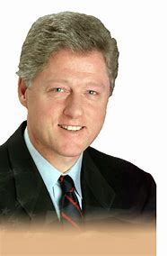

title:: 083 Bill Clinton: Survivor

- ## 083 Bill Clinton: Survivor
- ## pure
  collapsed:: true
	- VOA Learning English presents America's Presidents.
	- Today we are talking about William Jefferson Clinton – better known as Bill Clinton.
	- Clinton took office in 1993, and was re-elected in 1996. In many ways, historians consider his time in office a success. The economy expanded, and the country was largely at peace.
	- But Clinton had some notable failures, too. He could not persuade Congress to accept a plan to reform the nation's health care system.
	- And, in his second term, the House of Representatives took steps to remove him from office. But the Senate decided not to act.
	- Clinton finished his second term with high approval ratings. Yet he is also remembered for being only the second U.S. president to be impeached.
	- ## Early life
	- Bill Clinton came from a town with a memorable name: Hope. He grew up there, and in another nearby town in the Southern state of Arkansas.
	- For most of his early life, Bill was raised by his grandmother and his mother, both nurses. His father had died in a car accident before he was born.
	- People who knew Bill as a young man remember him as very intelligent, charming with people, and talented in music. His mother told him he would be president one day.
	- Sure enough, Clinton pursued activities that would lead to a political career. He attended college at Georgetown University in Washington, DC, where he studied international affairs; led student government groups; and took a position as a clerk in the U.S. Senate.
	- He went on to study at Oxford University in England on a prestigious Rhodes Scholarship.
	- Then he graduated from law school at Yale University. There, he met another student who would be his wife, Hillary Rodham. The two went on to have one child together, a daughter named Chelsea.
	- After finishing his studies, Clinton returned to his home state of Arkansas and pursued political office. At 32, he became one of the youngest governors ever in the country.
	  Two years later, he was voted out of office, and -- as historian Russell Riley notes -- he became the youngest former governor.
	- And that is how a good deal of Clinton's political career continued: in a pattern of successes and failures.
	- His successes often came as a result of his centrist policies, which appealed to people of different political beliefs. He also was an effective public speaker and, to many, a likable, charismatic person who seemed to care deeply about others.
	- But, his critics pointed out, Clinton also appeared to make many decisions simply for political advantage. And he sometimes tried to please so many people that he pleased no one.
	- Following a series of increasingly national roles – as well as a series of setbacks – Clinton campaigned for president in 1992. At first, he did not do well in the campaign. He was young and not well-known. He also suffered from reports that he had relationships with women who were not his wife.
	- But in time, Clinton began winning primary contests. Reporters called him the "Comeback Kid." He earned a public image as a politician who could survive problems.
	- In the general election, Clinton competed against the sitting president, Republican George H.W. Bush. The two men also faced an unusually strong third-party candidate named Ross Perot.
	- On Election Night, Clinton prevailed. Because Americans had split their votes among three major candidates, Clinton earned less than 50% of the popular vote. But he won enough electoral votes to become the next U.S. president.
	- ## Presidency
	- The people who worked on Bill Clinton's presidential campaign adopted an informal motto. They said, "It's the economy, stupid." In other words, campaign officials believed that most Americans cared primarily about how a president's policies would affect their financial concerns.
	- So, President Clinton quickly set about making a series of economic changes. They included raising taxes on wealthier Americans and cutting spending to help poorer Americans.
	- In a few years, the U.S. budget deficit was gone, the federal government had a surplus, and the country's financial situation was strong and healthy – although not everyone approved of the steps Clinton took to get there, or believed he should get all the credit.
	- Early in his first term, Clinton sought an additional reform he believed would help voters' financial concerns: affordable health insurance for all Americans. Most people in the U.S. either bought private health insurance or did not have any insurance to help pay for medical costs. Clinton wanted to find a way for the U.S. government to support Americans' health-related expenses.
	- He appointed his wife, first lady Hillary Clinton, to lead a healthcare reform effort. Hillary Clinton, a lawyer, had led a similar effort to reform education in Arkansas when her husband was governor there.
	- But some lawmakers in Congress – as well as some voters – rejected her efforts. The reform effort failed.
	- Clinton also struggled in some early foreign policy moves. He withdrew American troops from Somalia after their humanitarian efforts there turned into a bloody military struggle.
	- He was also criticized for failing to intervene quickly in the genocide in Rwanda, where hundreds of thousands of people were killed.
	- Later, Clinton won praise for some of his foreign policy. His government helped restore the elected president in Haiti after a coup. It also helped negotiate peace agreements in Bosnia and Ireland. And it cooperated with NATO to intervene in the Kosovo area and stop attacks on Albanians there.
	- In general, Clinton believed the U.S. had an important role to play in maintaining peace and protecting human life around the world. At the same time, he did not want to use too many American resources to do so. He aimed to cooperate with other nations, and to set moderate goals.
	- As usual, Clinton adopted an approach that was not too extreme on one side or another.
	- ## Impeachment
	- During most of his time as president, Clinton had been under investigation. Federal judges had appointed a special counsel, named Kenneth Starr, to find out if the president had committed any crimes related to financial investments before he took office.
	- During the investigation, Starr learned that the president had been having a sexual relationship with a young woman who worked in the White House. Starr asked Clinton about the affair under oath.
	- Later, Starr accused Clinton of lying about his relationship with the woman. Starr said that Clinton had also tried to prevent others from telling the truth about some of his activities.
	- In time, the president publicly admitted the relationship, and he apologized to voters and his family. But he said he had not lied or told anyone else to lie for him.
	- Lawmakers in the House of Representatives did not accept Clinton's defense. They advanced two articles of impeachment.
	- Lawmakers in the U.S. Senate then considered the case. It is their job to examine the evidence and decide whether to remove a president from office. A majority did not believe the actions Clinton was accused of were serious violations against the country. They voted to acquit Clinton of the charges and permit him to continue as president.
	- ## Legacy
	- In the U.S., a president can serve only two full terms. After his second, Bill Clinton and his wife settled in a town outside New York City. In time, Hillary Clinton became the U.S. senator from New York, as well as a secretary of state and the Democratic Party's candidate for president.
	- Bill Clinton, like many other U.S. presidents, wrote about his experiences and helped develop his presidential library. He also worked on humanitarian, health, and economic issues with his family's organization, the Clinton Foundation.
	- For many, Clinton's time in office is remembered as a mixed experience. The economy was at one of its strongest in U.S. history. Most people could find jobs, and many Americans bought homes for the first time. In the mid-1990s especially, the Internet and other new developments created a technology boom.
	- In addition, Clinton was an effective public speaker, and he inspired new groups of people to support his Democratic Party. Many voters approved of his appointments of women and minorities to positions of power in his government. They also liked the steps he took to reduce the use of handguns, protect the environment, and provide paid time off work for some people to care for themselves or their families.
	- But both Democrats and Republicans found fault with some of Clinton's efforts. And even his supporters note that the president had to spend much of his time in office answering charges of wrongdoing.
- ---
- ## def
	- VOA Learning English presents America's Presidents.
	- Today we are talking about William Jefferson Clinton – better known as Bill Clinton.
		- > ▶ William Jefferson Clinton
		  
	- Clinton took office in 1993, and was re-elected in 1996. In many ways, historians consider his time in office 宾补 a success. The economy expanded, and the country was largely at peace.
	- But Clinton had some notable failures, too. He could not persuade Congress to accept a plan /to reform the nation's health care system.
	- And, in his second term, the House of Representatives **took steps** to remove him from office. But the Senate decided not to act.
	- Clinton finished his second term /with high approval ratings. Yet he is also remembered for being only the second U.S. president to be impeached.
		- 他也因为是第二位被弹劾的美国总统, 而被人们铭记。
	- ## Early life
	- Bill Clinton came from a town with a memorable name: Hope. He grew up there, and in another nearby town /in the Southern state of Arkansas.
		- > ▶ memorable (a.) ~ (for sth) : special, good or unusual and therefore worth remembering or easy to remember 值得纪念的；难忘的
	- For most of his early life, Bill was raised by his grandmother and his mother, both nurses. His father had died in a car accident before he was born.
	- People who knew Bill as a young man /remember him as very intelligent, charming with people, and talented in music. His mother told him /he would be president one day.
	- Sure enough, Clinton pursued activities /that would lead to a political career. He attended college at Georgetown University in Washington, DC, where he studied international affairs; led **student government** groups; and took a position as a clerk /in the U.S. Senate.
		- > ▶ student government 学生会；学生自治
		- 毫无疑问，克林顿从事的活动将导致政治生涯。他在华盛顿特区的乔治敦大学(Georgetown University)学习国际事务;领导学生会组织;并在美国参议院担任职员。
	- He went on /to study at Oxford University in England /on a prestigious(a.) Rhodes Scholarship.
		- > ▶ prestigious  (a.) [ usually before noun ] respected and admired as very important or of very high quality 有威望的；声誉高的
		- id:: 626622a2-c10b-42c7-aadf-b5356f2cd858
		  > ▶ scholarship 奖学金
		  + /[ U ] the serious study of an academic subject /and the knowledge and methods involved 学问；学术；学术研究
		  -> a magnificent work of scholarship 学术巨著
		- 他获得了著名的罗德奖学金，前往英国牛津大学学习。
	- Then he graduated from law school at Yale University. There, he met another student who would be his wife, Hillary Rodham. The two went on /to have one child together, a daughter named Chelsea.
	- After finishing his studies, Clinton returned to his **home state** of Arkansas /and pursued political office. At 32, he became one of the youngest governors /ever in the country.
	  Two years later, he **was voted out of** office, and -- as historian Russell Riley notes -- he became the youngest former governor.
		- > ▶ **vote sb out | vote sb out of/off sth** : to dismiss sb from a position by voting 投票免去…的职务
		  -> He was voted out of office. 经投票他被免去了职务。
	- And that is `主` how **a good deal of** Clinton's political career `谓` continued: in a pattern of successes and failures.
		- > ▶ deal : a good/great ~ much; a lot 大量；很多
		  -> They spent **a great deal of money**. 他们花了大量的钱。
		  -> I'm feeling a good deal better. 我感觉好多了。
		- 克林顿的政治生涯大部分都是这样延续的:有成功也有失败。
	- His successes /often came **as a result of** his centrist(n.) policies, which **appealed to** people of different political beliefs. He also was an effective public speaker and, to many, a likable, charismatic person /who seemed **to care** deeply **about** others.
		- > ▶ centrist (n.) a person with political views that are not extreme （政治上的）中间派，温和派
		- 他的成功往往是由于他的中立政策，这吸引了不同政治信仰的人。他也是一个有效的公众演说家，对许多人来说，他是一个可爱的，有魅力的人，似乎很关心别人。
	- But, his critics pointed out, Clinton also appeared to make many decisions **simply for** political advantage. And he sometimes tried to please(v.) **so** many people /**that** he pleased no one.
		- > ▶ simply (ad.)  used to emphasize how easy or basic sth is （强调简单）仅仅，只，不过
		  + /used to introduce a summary or an explanation of sth that you have just said or done （引出概括或解释）不过，只是
		  -> I don't want to be rude, **it's simply that** /we have to be careful who we give this information to. 我不是有意无礼，只不过这份资料给谁我们必须很慎重。
		- 克林顿做的许多决定似乎只是为了政治利益。有时他想取悦太多的人，结果却一个人也没取悦。
	- Following a series of increasingly national roles – **as well as** a series of setbacks – Clinton campaigned for president in 1992. At first, he did not do well in the campaign. He was young and not well-known. He also suffered from reports /that he had relationships with women who were not his wife.
		- > ▶ setback (n.) a difficulty or problem that delays or prevents sth, or makes a situation worse 挫折；阻碍
		- 在担任了一系列日益重要的国家角色之后——也经历了一系列挫折——克林顿于1992年竞选总统。
	- But in time, Clinton began winning primary contests. Reporters called him the "Comeback Kid." He earned a public image as a politician /who could survive problems.
		- > ▶ primary (a.) [ usually before noun ] main; most important; basic 主要的；最重要的；基本的
		  + /[ usually before noun ] developing or happening first; earliest 最初的；最早的
		  -> The disease is still in its primary stage. 这病尚处于初始阶段。
		- 克林顿开始赢得初选。
	- In the general election, Clinton **competed against** the sitting president, Republican George H.W. Bush. The two men /also faced an unusually strong third-party candidate /named Ross Perot.
	- On Election Night, Clinton prevailed(v.). Because Americans had split their votes /among three major candidates, Clinton earned less than 50% of the popular vote. But he won enough electoral votes /to become the next U.S. president.
		- > ▶ prevail (v.) ~ (against/over sb)  : ( formal ) to defeat an opponent, especially after a long struggle （尤指长时间斗争后）战胜，挫败
		  -> Fortunately, common sense prevailed. 幸而理智占了上风。
		  + /~ (in/among sth) : to exist or be very common at a particular time or in a particular place 普遍存在；盛行；流行
		  => pre-,在前，领先，-vail,价值，.力量，词源同avail,value.即在力量上超过，胜利，引申词义盛行，流行等。
	- ## Presidency
	- The people /who worked on Bill Clinton's presidential campaign /adopted an informal motto. They said, "It's the economy, stupid." In other words, campaign officials believed that /most Americans cared primarily about /how a president's policies would affect their financial concerns.
		- > ▶ motto (n.)a short sentence or phrase /that expresses the aims and beliefs of a person, a group, an institution, etc. and is used as a rule of behaviour 座右铭；格言；箴言
		  => 来自意大利语motto,格言，来自拉丁语muttire,说，咕哝，词源同mutter,mot,motet.
		- 为比尔·克林顿的总统竞选工作的人, 采用了一个非正式的竞选口号。
	- So, President Clinton quickly **set about** making a series of economic changes. They included **raising taxes** on wealthier Americans /and **cutting spending** to help poorer Americans.
		- > ▶ **set about sth** : [ no passive ] to start doing sth 开始做；着手做
		  -> We need to set about /finding a solution. 我们得着手寻找一个解决办法。
	- In a few years, the U.S. **budget deficit** was gone, the federal government had a surplus, and the country's financial situation /was strong and healthy – although not everyone **approved of** the steps /Clinton took to get there, or believed /he should get all the credit.
		- ((6260b123-a67a-4a08-907c-4c629b36394c))
		-
		- 在几年内，美国的预算赤字消失了，联邦政府有了盈余，国家的财政状况强劲而健康——尽管不是每个人都赞同克林顿为实现这一目标所采取的步骤，或者认为他应该得到所有的功劳。
	- Early in his first term, Clinton sought an additional reform /he believed would help voters' financial concerns: affordable health insurance /for all Americans. Most people in the U.S. /**either** bought private health insurance /**or** did not have any insurance to help pay for medical costs. Clinton wanted to find a way /for the U.S. government /to support Americans' health-related expenses.
	- He appointed his wife, first lady Hillary Clinton, to lead a healthcare reform effort. Hillary Clinton, a lawyer, had led a similar effort /to reform education in Arkansas /when her husband was governor there.
	- But some lawmakers in Congress – **as well as** some voters – rejected her efforts. The reform effort failed.
	- Clinton also struggled in some early foreign policy moves. He withdrew American troops from Somalia /after `主` their humanitarian efforts there `谓` **turned into** a bloody military struggle.
		- ((621d9f5d-aa5a-4957-9007-70008cbb8a0a)
		  在索马里的人道主义行动演变成一场血腥的军事斗争后，他将美国军队撤出索马里。
	- He **was also criticized for** failing to intervene quickly /in the genocide in Rwanda, where hundreds of thousands of people were killed.
		- > ▶ genocide  [ U ] the murder of a whole race or group of people 种族灭绝；大屠杀
		  -> geno-, 种族。-cide, 杀。
	- Later, Clinton won praise /for some of his foreign policy. His government helped restore the elected president in Haiti /after a coup. It also helped negotiate(v.) peace agreements in Bosnia and Ireland. And it cooperated with NATO /**to intervene in** the Kosovo area /and stop attacks on Albanians there.
	- In general, Clinton believed /the U.S. had an important role to play /in maintaining peace /and protecting human life around the world. At the same time, he did not want to use too many American resources to do so. He aimed /to cooperate with other nations, and to set moderate goals.
	- As usual, Clinton **adopted an approach** /that was not too extreme /on one side or another.
	- > ▶ 一如既往，克林顿采取了一种不太极端的方式。
	- ## Impeachment
	- During most of his time as president, Clinton had been under investigation. Federal judges had appointed a special counsel, named Kenneth Starr, to find out /if the president had committed any crimes /related to financial investments /before he took office.
	- During the investigation, Starr learned that /the president had been having a sexual relationship with a young woman /who worked in the White House. Starr asked Clinton about the affair /under oath.
		- ((6264b368-d2cf-4467-9315-9c66dff6ccd3))
	- Later, Starr **accused** Clinton **of** lying about his relationship with the woman. Starr said that /Clinton had also **tried to prevent** others **from** telling the truth about some of his activities.
	- In time, the president publicly admitted(v.) the relationship, and he **apologized to** voters and his family. But he said /he had not lied /or told anyone else to lie for him.
	- Lawmakers in the House of Representatives /did not accept Clinton's defense. They advanced two articles of impeachment.
		- > ▶ article : ( law 律 ) a separate item /in an agreement or a contract （协议、契约的）条款，项
		  -> Article 10 of the European Convention guarantees free speech. 《欧洲公约》第10条保障言论自由。
	- Lawmakers in the U.S. Senate /then considered the case. It is their job /to examine the evidence /and decide whether to remove a president from office. A majority did not believe `主` the actions Clinton was accused of `系` were serious violations against the country. They voted **to acquit**(v.) Clinton **of** the charges /and permit him to continue as president.
		- > ▶ **acquit (v.) ~ sb (of sth)** : to decide and state officially in court that sb is not guilty of a crime 宣判…无罪
		  -> The jury **acquitted** him **of** murder. 陪审团裁决他谋杀罪不成立。 
		  OPP convict
		  + /**~ yourself well, badly, etc**. : ( formal ) to perform or behave well, badly, etc. 表现好（或坏等）
		  -> He acquitted himself brilliantly in the exams. 他在考试中表现出色。
		  => 前缀ac-同ad-, 去，往。quit, 离开，词源同quiet。即无罪释放。
		- 大多数人不认为克林顿被指控的行为, 是对国家的严重侵犯。他们投票宣布克林顿无罪，允许他继续担任总统。
	- ## Legacy
	- In the U.S., a president can serve only two full terms. After his second, Bill Clinton and his wife /settled in a town /outside New York City. In time, Hillary Clinton became the U.S. senator from New York, **as well as** a secretary of state and the Democratic Party's candidate for president.
	- Bill Clinton, like many other U.S. presidents, wrote about his experiences /and helped develop his presidential library. He also worked on humanitarian, health, and economic issues /with his family's organization, the Clinton Foundation.
	- For many, Clinton's time in office /is remembered as a mixed experience. The economy was at one of its strongest /in U.S. history. Most people could find jobs, and many Americans bought homes for the first time. In the mid-1990s especially, the Internet and other new developments /created a technology boom.
	- In addition, Clinton was an effective public speaker, and he inspired(v.) new groups of people /to support his Democratic Party. Many voters **approved of** his appointments of women and minorities /to positions of power in his government. They also liked the steps /he took to reduce the use of handguns, protect the environment, and **provide** paid time off work **for** some people /to care for themselves or their families.
		- > ▶ **paid time off** 带薪休假. 缩略词“PTO”
		  -> After one year, you get seven days of **paid time off**. 工作满一年，你会有七天支薪的休假日。
		- 此外，克林顿是一个有效的公众演说家，他鼓舞了新的群体支持他的民主党。许多选民支持他任命妇女和少数族裔担任政府要职。他们也喜欢他采取的措施，包括减少手枪的使用，保护环境，为一些人提供带薪休假，以照顾自己或家人。
	- But both Democrats and Republicans /found fault with some of Clinton's efforts. And even his supporters note that /the president had to spend much of his time in office /answering charges of wrongdoing.
		- > ▶ fault [ U ] ~ (that...)~ (for doing sth) the responsibility for sth wrong that has happened or been done 责任；过错；过失
		  + / a bad or weak aspect of sb's character 弱点；缺点
		- 但民主党和共和党, 都对克林顿的一些努力提出了批评。就连他的支持者也指出，总统不得不在办公室里花很多时间, 来回应对他不当行为的指控。
- ---
- Bill Clinton
	- 克林顿以65%的民意支持率结束任期，创下了55年来二战后美国总统离任最高支持率纪录。
	- 在美国在线于2005年举办的票选活动《最伟大的美国人》中，克林顿被选为美国最伟大的人物第七位。
	-
	- 借助奖学金，克林顿进入华盛顿哥伦比亚特区的乔治敦大学埃德蒙·A·沃尔什**外交学院**学习并在1968年获得学士学位。在校期间，克林顿担任了**参议员**J·威廉·富布赖特的**助理文员**。
	- 在有“全球本科生诺贝尔奖”之称的罗德奖学金资助下，克林顿前往英国**牛津大学学习政治学**.
	- 从牛津大学毕业后，克林顿进入耶鲁大学**法学院**学习，并在1973年获得**法律博士**学位.
	- 在阿肯色大学教了几年法律之后，1976年克林顿当选为阿肯色**州总检察长**，并在1978年首次当选该州**州长**，当时他也是美国最年轻的州长（32岁）。
	- 他的第一个州长任期是在艰难中度过的，面对了重重难题，在非常大的反对声中作出了种种改革。1980年克林顿在第一个任期满后就连任失利，被共和党人弗兰克·德沃德·怀特（Frank Durward White）取代。在下台后，克林顿反思了自己政治生涯上的失败。他与强大的商业利益集团建立起了新的关系，并修补了与州政府部门的关系。其妻希拉里, 作为律师的她, 又在许可的范围内暗暗建立起自己的政治势力。
	- 1982年克林顿宣布出山再次竞选州长，终于再度当选州长，并且连续执政10年，直到1992年竞选总统。克林顿在担任阿肯色州州长期间已经被看作是民主党内的明日之星，各方都相信他有朝一日一定会竞选总统。他曾担任民主党的州长协会主席，并以这个身份第一次踏入全国的政治舞台.
	- 尽管遭遇了第一次的打击，克林顿还是决定参加1992年的总统选举，挑战寻求连任的总统老布什。
	- 1992年7月9日，在党内初选中获胜的克林顿, 选择了参议员艾伯特·戈尔作为他的竞选伙伴。最初许多人都批评这项选择十分不智，因为戈尔就来自于与阿肯色州接壤的田纳西州，两州皆在南方，违反了正副总统候选人来自不同区域的传统选战策略。但是现在回想起来，许多人认为戈尔在1992年的选举中也是克林顿获胜的关键因素之一，因为两人的年轻特质给予了选民一个清新的印象。
	- 克林顿最终赢得了1992年选举的胜利，这主要是因为他的竞选策略专注于国内议题，特别是当时陷入低谷的美国经济。他的竞选总部曾经张贴出一句非常著名的标语：“笨蛋，问题是经济！”（"It's the economy, stupid!"）。
	- 而克林顿的对手却主要攻击他的人格缺陷，包括他在越南战争期间逃避兵役，吸食大麻的问题和女性的绯闻以及几起有问题的商业交易。这些指控虽然没能阻止克林顿当选为总统，却在保守派人士中间掀起了反克林顿浪潮。
	-
	- **1993年克林顿一上任便试图大刀阔斧的按照左派理想来改造社会。他向富裕阶层增税并开展各种大政府计划.**
	- 奢侈税的开征原意是要向富人征税，结果却事与愿违，导致皮草和游艇等高价商品销售下跌，侵蚀中产阶级销售员的收入，使中产不满。
	- 最严重的是**美国医疗改革制度的尝试，改革的目标是要推广强制性的政府垄断的健康保险**，该计划受到美国国内的竭力反对；同时美国民间社会的意识型态普遍崇尚自由主义、个人主义、反国家主义，有人视健保制度为共产主义化身。
	- 克林顿委派了同样在政治上雄心勃勃的他的妻子**希拉里, 主导一个委员会负责策划健保改革。**当时民主党掌握国会参众两院和白宫，理论上有机会通过任何民主党愿意通过的法案。**但是希拉里领导的委员会没有征询外界的意见，包括其他民主党人士，而只是闭门研议出一套改革方案，结果是，健保改革牵涉盘根错节千丝万缕的利害得失，委员会最后提出的健保改革法案连民主党的国会议员都不支持，不但整个改革计划完全失败，其所引发的社会反弹连带导致民主党在1994年的期中选举惨败，丧失了长达四十年对参众两院的控制权，共和党大获全胜。**
	- 共和党革命后，纽特·金里奇成为新任的美国众议院院长，金里奇其后成为克林顿此后任期最强劲的政治对手。
	-
	- 尽管他一系列丑闻多多，克林顿依然有着极高民望，如**拉链门事件后仍有七成美国人支持克林顿。其主要原因是克林顿在任内有一定政绩，尤其是他在任内创造了美国长期经济繁荣**，并使美国高科技行业的飞速发展，奠定今日美国高科技大国的地位。
	- 克林顿的政绩得到多少公众肯定，有客观的评估数据。1999年，美国公共有线电视台C-SPAN对将近六十位历史学者进行访问，**请他们在包括领导能力、经济成就、与国会的关系、道德号召力等十个项目内为历任美国总统评分，并计算综合排名。克林顿的综合排名为21，在42位总统当中恰恰是中等，**落后他的前任老布什（排名第20）。这个评鉴结果与其后的另外几次评鉴活动大约是一致的；在包含克林顿的六次总统评鉴排名活动中，克林顿的平均排名为20.67。