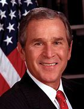

title:: 084 George W. Bush: Wartime President

- ## 084 George W. Bush: Wartime President
- ## pure
  collapsed:: true
	- VOA Learning English presents America's Presidents.
	- Today we are talking about George Walker Bush. He took office in 2001 as the 43rd president.
	  He has a similar name to another president -- his father, George Herbert Walker Bush.
	- To simplify things, Americans sometimes call the younger Bush "43," or simply "W." Here we will just call him Bush.
	- Because Bush is a recent president, historians have not reached a broad agreement on his time as a leader.
	- But he will surely be remembered for facing one of the biggest challenges to any president: the attacks against the U.S. on September 11, 2001.
	- ## Early life
	- George Bush was born in the northeast state of Connecticut. But his parents soon moved to the southwest state of Texas. George grew up there and considered Texas home.
	- The Bush family had a long background in politics. Bush's grandfather was a senator. His father held many public offices. In some ways, George was prepared for a career in politics, too.
	- He went to the same private boarding school as his father. Then, like his father and grandfather, George went to Yale for college. He also worked on several political campaigns. But he said he did not consider pursuing politics.
	- Instead, he earned a degree in business at Harvard and took a job in an oil company in Texas. In time, he founded his own oil business.
	- And he married Laura Welch, who was a teacher and librarian in their hometown. They had twin daughters named Barbara and Jenna.
	- In these years as a young adult, Bush began to make some changes. He began attending a Christian church regularly. He decided to stop drinking alcohol because it was creating problems in his personal life. And he turned his attention to politics.
	- Bush lost the first election in which he competed, a race to become a member of Congress. So, for a while, he focused on business investments and helping his father's political career.
	- But in 1992, his father lost re-election to the presidency. And the younger Bush saw a chance to enter politics himself again. In 1994, Bush ran for governor of Texas. To many people's surprise, he won.
	- Four years later, he was overwhelmingly re-elected. Many voters liked his image as, what he called, a "compassionate conservative." In other words, he wanted to use traditional Republican ideas about government to help society.
	- Following two successful terms as governor, Bush turned his attention to the presidency. In 2000, he competed against the vice president at the time, Al Gore. The winner was not announced until more than a month following the election – usually, the winner is announced within hours.
	- Both sides disputed the process of counting votes in the state of Florida. Finally, the U.S. Supreme Court ruled on the process. The Court ordered state officials to stop re-counting votes. Bush's lead stood.
	- ## Presidency
	- Bush entered office expecting to bring many of the ideas he pursued in Texas to the entire nation. For example, as president he permitted religious groups to receive government funding, and set national standards for public schools.
	- These moves were popular with many voters. But they also challenged some American traditions: the separation of church and state, and the ability of public schools to govern themselves.
	- For many presidents, these policies might have created a legacy. But early in Bush's term, he faced a crisis that defined much of his time in office.
	- Hijackers linked to the al-Qaeda group seized four airplanes on September 11, 2001. They purposely crashed two planes into the twin towers of the World Trade Center in New York City, eventually killing more than 2,700 people.
	- Another plane was flown into the Pentagon, the country's military headquarters outside of Washington, DC. About 200 people died there.
	- The fourth plane was aimed at another important target. But passengers fought the hijackers. The plane lost control and crashed in a field in Pennsylvania. All 44 people on board died there.
	- President Bush was visiting an elementary school in Florida that morning. He learned about the attacks while he was reading with the children.
	- At the end of the day, Bush spoke to the nation. He said the U.S. would answer both the terrorist groups and the countries that permitted terrorist groups to thrive.
	- Over the next years, Bush took a number of actions to create a new national security strategy. They included creating a Department of Homeland Security, making changes to the country's intelligence operations, and reforming the U.S. military.
	- He also sent U.S. forces into Afghanistan to destroy terrorist networks there. Bush was especially targeting the person who had designed the September 11 terrorist attacks, Osama bin Laden.
	- The struggle in Afghanistan was successful at first, but continued throughout Bush's time in office. And bin Laden was not captured while Bush was president.
	- In 2003, Bush opened another front on what some called the "war on terror." He and other government officials said the leader of Iraq, Saddam Hussein, was developing weapons that could kill many people. They said Hussein – and his connections to terrorist groups – threatened Americans and people in other countries.
	- Hussein did not agree to leave Iraq. So U.S. and British forces launched bombs at targets in the country's capital. Additional troops destroyed what was left of the targets. Hussein was quickly overthrown.
	- But the weapons of mass destruction were not found.
	- For the rest of Bush's presidency, U.S. forces remained in Iraq. Bush promised that Americans would stabilize the country and help Iraqis create a democratic government.
	- ## Legacy
	- The presidency of George W. Bush is too recent to understand its impact. But there is some evidence of the public's reaction at the time.
	- Bush received some of the highest ratings of any president. In the weeks following the September 11 attacks, 90 percent approved of his leadership.
	- He was re-elected in 2004. But his popularity steadily decreased .
	- At the end of his second term, he had one of the lowest public approval ratings of any president: 33 percent.
	- The U.S. economy had entered a recession. More Americans disagreed especially with his decision to invade Iraq. And some criticized his government for responding too slowly after Hurricane Katrina struck New Orleans and the country's Gulf Coast.
	- Since Bush left the White House in 2009, his approval ratings have – like those of many presidents – risen again. He has mostly avoided public appearances. Instead, he has enjoyed playing sports, helping charities, and reading U.S. history.
	- He also began a new hobby: painting. He has created portraits of dozens of veterans to honor their service in the military.
- ---
- ## def
	- VOA Learning English presents America's Presidents.
	- Today we are talking about George Walker Bush. He took office in 2001 as the 43rd president.
		- > ▶ George Walker Bush
		- 
	- He has a similar name to another president -- his father, George Herbert Walker Bush.
	- To simplify things, Americans sometimes call the younger Bush "43," or simply "W." Here we will just call him Bush.
		- 为了简化问题
	- Because Bush is a recent president, historians have not reached a broad agreement /on his time as a leader.
	- But he will surely be remembered /for facing one of the biggest challenges to any president: the attacks against the U.S. /on September 11, 2001.
	- ## Early life
	- George Bush was born /in the northeast state of Connecticut. But his parents soon moved to the southwest state of Texas. George grew up there /and considered Texas 宾补 home.
		- 把德克萨斯当作自己的家。
	- The Bush family had a long background in politics. Bush's grandfather was a senator. His father held many public offices. In some ways, George was prepared for a career in politics, too.
		- 布什家族有很长岁月的从政背景。
	- He went to **the same** private boarding school **as** his father. Then, like his father and grandfather, George went to Yale for college. He also worked on several political campaigns. But he said /he did not consider pursuing politics.
		- > ▶ boarding (n.) the arrangement by which school students live at their school, going home during the holidays （学生的）寄宿
		- 他和他父亲上的是同一所私立寄宿学校。
	- Instead, he earned a degree /in business at Harvard /and took a job in an oil company in Texas. In time, he founded his own oil business.
	- And he married Laura Welch, who was a teacher and librarian in their hometown. They had twin daughters named Barbara and Jenna.
		- > ▶ librarian : a person who is in charge of or works in a library 图书馆馆长；图书管理员
	- In these years as a young adult, Bush began to make some changes. He began attending a Christian church regularly. He decided to stop drinking alcohol /because it was creating problems in his personal life. And he turned his attention to politics.
	- Bush lost the first election /in which he competed, a race /to become a member of Congress. So, for a while, he focused on business investments /and helping his father's political career.
	- But in 1992, his father lost re-election to the presidency. And the younger Bush saw a chance to enter politics himself again. In 1994, Bush **ran for** governor of Texas. To many people's surprise, he won.
		- > ▶run for  竞选
	- Four years later, he was overwhelmingly re-elected. Many voters liked his image as, what he called, a "compassionate conservative(n.)." In other words, he wanted to use **traditional Republican ideas** about government /to help society.
		- > ▶ compassionate  (a.) feeling or showing sympathy for people who are suffering 有同情心的；表示怜悯的
		- ((62316f64-7feb-43b1-a425-ce70b0eba349))
		- 许多选民喜欢他所谓的“富有同情心的保守派”的形象。换句话说，他想利用传统的共和党政府理念来帮助社会。
	- Following two successful terms as governor, Bush **turned** his attention **to** the presidency. In 2000, he competed against the vice president at the time, Al Gore. The winner was not announced /until more than a month following the election – usually, the winner is announced within hours.
		- 成功连任两届州长后，布什把注意力转向了总统竞选。2000年，他与当时的副总统阿尔·戈尔(Al Gore)竞争。获胜者是在选举结束一个多月后才宣布的，通常获胜者会在几个小时内宣布。
	- Both sides disputed the process of counting votes /in the state of Florida. Finally, the U.S. Supreme Court /**ruled(v.) on** the process. The Court /ordered(v.) state officials /to stop re-counting votes. Bush's lead stood(v.).
	- ## Presidency
	- Bush entered office /expecting **to bring** many of the ideas he pursued in Texas **to** the entire nation. For example, as president /he permitted religious groups /to receive government funding, and set national standards for public schools.
		- 布什上任时, 希望把他在德克萨斯州推行的许多思想, 推广到全国。例如，作为总统，他允许宗教团体接受政府资助，并为公立学校制定国家标准。
	- These moves were popular with many voters. But they also challenged some American traditions: the separation of church and state, and the ability of public schools /to govern(v.) themselves.
		- 但它们也挑战了一些美国传统: 政教分离，以及公立学校自我管理的能力。
	- For many presidents, these policies might have created a legacy. But early in Bush's term, he faced a crisis /that defined much of his time in office.
		- > ▶ define [ VN ]to describe or show sth accurately 阐明；明确；界定
		  + / to show clearly a line, shape or edge 画出…的线条；描出…的外形；确定…的界线；界定
	- Hijackers linked to the al-Qaeda group /seized four airplanes /on September 11, 2001. They purposely **crashed** two planes /**into** the twin towers of the World Trade Center /in New York City, eventually killing more than 2,700 people.
		- > ▶ hijacker : a person who hijacks a plane or other vehicle 劫机者；劫持交通工具者；劫持者
		- > ▶  al-Qaeda  基地组织（著名恐怖主义组织领袖为拉登）
	- Another plane was flown into the Pentagon, the country's military headquarters /outside of Washington, DC. About 200 people died there.
	- The fourth plane **was aimed at** another important target. But passengers fought(v.) the hijackers. The plane lost control /and crashed in a field in Pennsylvania. All 44 people on board died there.
	- President Bush was visiting **an elementary school** in Florida that morning. He learned about the attacks /while he was reading with the children.
		- > ▶ elementary (a.) in or connected with the first stages of a course of study 初级的；基础的
		  + /of the most basic kind 基本的
		  ▶ **elementary school** : ( also informal ˈgrade school ) (in the US) a school for children between the ages of about 6 and 12 （美国）小学
	- At the end of the day, Bush spoke to the nation. He said /the U.S. would answer **both** the terrorist groups **and** the countries /that permitted terrorist groups to thrive.
	- Over the next years, Bush took a number of actions /to create a new national security strategy. They included creating a Department of Homeland Security, making changes to the country's intelligence operations, and reforming the U.S. military.
		- 在接下来的几年里，布什采取了一系列行动，制定了新的国家安全战略。这些措施包括创建国土安全部，改变国家的情报运作，改革美国军队。
	- He also sent U.S. forces into Afghanistan /to destroy terrorist networks there. Bush was especially targeting the person /who had designed the September 11 terrorist attacks, Osama bin Laden.
	- The struggle in Afghanistan was successful /at first, but continued throughout Bush's time in office. And bin Laden was not captured /while Bush was president.
	- In 2003, Bush opened another front /on what some called the "war on terror." He and other government officials said /the leader of Iraq, Saddam Hussein, was developing weapons /that could kill many people. They said /`主` Hussein – and his connections to terrorist groups – `谓` threatened Americans and people in other countries.
		- > ▶ front (n.) [ Cusually sing. ] an area where fighting takes place during a war 前线；前方 /[ C ] a particular area of activity 活动领域；阵线
		  -> Things are looking unsettled /on the economic front. 经济战线上的情况显得不稳定。
	- Hussein did not agree to leave Iraq. So U.S. and British forces /launched bombs at targets in the country's capital. Additional troops destroyed what was left of the targets. Hussein was quickly overthrown.
		- 美国和英国军队向该国首都的目标发射了炸弹。增援部队摧毁了剩下的目标。侯赛因很快就被推翻了。
	- But the weapons of mass destruction /were not found.
	- For the rest of Bush's presidency, U.S. forces remained in Iraq. Bush promised that /Americans would stabilize the country /and help Iraqis create a democratic government.
	- ## Legacy
	- The presidency of George W. Bush /is **too** recent **to** understand its impact. But there is some evidence of the public's reaction /at the time.
		- 乔治·w·布什(George W. Bush)担任总统的时间太短，还无法客观评估(理解)其影响。但有证据表明当时公众的反应。
	- Bush received some of **the highest ratings** of any president. In the weeks following the September 11 attacks, 90 percent **approved of** his leadership.
	- He was re-elected in 2004. But his popularity /steadily decreased .
		- 但他的声望却在稳步下降。
	- At the end of his second term, he had one of the lowest public approval ratings of any president: 33 percent.
	- The U.S. economy had entered a recession. More Americans **disagreed** especially **with** his decision to invade Iraq. And some **criticized**(v.) his government **for** responding too slowly /after Hurricane Katrina struck(v.) New Orleans and the country's Gulf Coast.
		- ((62301d87-59d1-4a31-9fa4-ba8225a8b894))
		- > ▶ Hurricane (n.) a violent storm with very strong winds, especially in the western Atlantic Ocean （尤指西大西洋的）飓风
		- 一些人批评他的政府, 在卡特里娜飓风袭击新奥尔良和墨西哥湾海岸后, 反应太慢。
	- Since Bush left the White House in 2009, his approval ratings **have** – like those of many presidents – **risen** again. He has mostly avoided public appearances. Instead, he has enjoyed playing sports, helping charities, and reading U.S. history.
	- He also began a new hobby: painting. He has created portraits of dozens of veterans /to honor their service in the military.
		- > ▶ portrait (n.) a painting, drawing or photograph of a person, especially of the head and shoulders 肖像；半身画像；半身照 
		  + /a detailed description of sb/sth 详细的描述；描绘
		  =>  por(pro-)前 + trait(-tract-)拉
		- 他为数十名退伍军人创作了肖像，以纪念他们在军队的服役。
- ---
- George W. Bush
	- 布什在2001年1月20日就职在担任总统之前，于1995年至2000年间担任第46任得克萨斯州州长。
	- 布什家族很早就开始投入共和党以及美国政治，布什的父亲是之前曾担任第41任总统的乔治·赫伯特·沃克·布什，他的弟弟杰布·布什也曾担任佛罗里达州的州长。
	- 2001年时曾主导帮助中国大陆进入世界贸易组织。
	- 任内布什推行了1.3兆元的减税计划、医疗保险和社会福利体制的改革，同时也推行了社会保守主义的政策，例如禁止晚期堕胎的法案、以及反对承认同性婚姻的联邦法案提议。而同时布什政府在反恐战争的正当性、关塔那摩湾拘押中心事件、虐囚门事件、以及飓风卡特里娜救灾工作的处置上遭遇到众多批评，执政民调认可度在911事件之后也有逐渐下滑的趋势。
	- 在美国在线于2005年举办的票选活动《最伟大的美国人》中，时任美国总统的布什被选为美国最伟大的人物第6位.
	-
	- 布什毕业时正值越战的高潮，他选择加入了国民警卫队的空军. 在1973年9月，为赶上哈佛大学开学时间，布什获得荣誉退伍的资格.
	- 布什在1975年获得了哈佛大学**工商管理硕士（MBA）**学位（使他成为第一个有MBA学位的总统），毕业后布什开始从事得州的石油产业。
	- 1978年，布什投入竞选得州的众议员. 落败. 选战过后布什回到了得州，他在1989年4月购买了一部分得州游骑兵棒球队的股份，并且担任了球队的合伙管理人长达5年。 与得州游骑兵球队的关系使布什的媒体曝光度和名声逐渐增加，也使他获得越来越多公众和商业团体的支持。
	- 随着布什父亲在1988年当选总统，共和党人之间也推测布什是否会参与1990年的州长选举.
	- 随着他辞去游骑兵队管理者和拥有人的身份，布什宣布他将会参选1994年的州长选举，同年他的弟弟杰布也投入竞选佛罗里达州的州长。**布什轻易赢得了共和党提名，他面临的对手是民主党籍**的时任州长安·理查德（Ann Richards），当时理查德支持度和名声极高，使布什的选情相当不乐观。
	- 在**州长**任内，布什成功的推行了司法制度改革、增加教育资金、提高公立学校的教学品质门槛、并且改革了执法部门体制。
	-
	- 1998年，布什以接近69%选票的压倒性胜利当选连任，成为第一名在四年任期制下连任两届的得州州长（1975年前得州州长任期只有2年），亦是首位成功连任的共和党州长。**身为当时最受欢迎的美国州长之一，媒体和共和党内部都将布什视为是非常可能出线2000年选举的总统候选人。**布什在当选州长连任后, 便表达了参选总统的意愿，不久后就宣布他正式角逐参选，很快他便成为共和党提名候选人中, 最领先以及竞选募款最多的一人。
	- 布什获得高达38个州的共和党州议员的背书。在赢得了艾奥瓦州的提名初选后，布什却意外的在新罕布什尔州的初选中, 遭到亚利桑那州参议员约翰·麦凯恩击败。
	-
	- 当布什就任总统时，他的民调认可度大约将近50%。在发生举国震惊的911恐怖袭击事件之后，布什的认可度跃升到高过85%，并且在攻击后四个月里维持80-90%的比例。自从那时之后布什在处理国内和国外政策上的民调认可度就持续下跌，到2006年已经跌至大约40%了，使他创下历史上美国总统认可度的最低纪录之一。在2006年11月5日进行的民调中，布什的执政认可度则停留在32%。