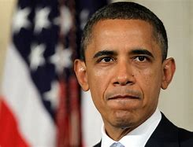

title:: 085 Barack Obama: African-American

- ## 085 Barack Obama: African-American
- ## pure
  collapsed:: true
	- VOA Learning English presents America's Presidents.
	- Today we are talking about Barack Obama.
	- He first took office in 2009 and was re-elected in 2012. Because his presidency is so recent, this program will not try to offer a historical perspective.
	- But one part of his legacy is already clear. Obama is the United States' first African-American president. His father was a black man from Kenya; his mother was a white American from the Midwestern state of Kansas.
	- For many Americans, Obama's presidency was an important symbol in a country that permitted black people to be enslaved.
	- And, even after the U.S. Constitution officially banned slavery in 1865, African-Americans have been extremely under-represented in the U.S. government.
	- By 2009, only five African-Americans had ever served in the U.S. Senate – and Obama was one of them.
	- Even many people who did not vote for Obama said his election to the country's highest office made them proud or hopeful. A public opinion survey immediately after Election Day found that two-thirds of Americans believed that the country's racial conflicts could be resolved.
	- ## Early life
	- Obama's parents met as students at the University of Hawaii. His father had won a scholarship to study economics. His mother went on to earn a degree in math there, as well as a graduate degree.
	- The two married and had a son, whom they named after his father: Barack Hussein Obama, Jr.
	- But the couple soon separated. The older Barack Obama returned to Kenya, where he later died in a car accident.
	- Barack's mother went on to marry another man. He was from Indonesia. The family moved to Jakarta, and the couple had a daughter named Maya.
	- When Barack was 10, his mother sent him back to Hawaii to live with her parents. She wanted him to get a good education. Barack finished high school in Hawaii, then went on to Occidental College in Los Angeles.
	- After two years, he transferred to Columbia University in New York. There, he completed a degree in political science.
	- But Obama said the best education he received was in one of his first jobs. He worked as a community organizer in Chicago. He helped people who lived in public housing put pressure on the city government to improve their conditions.
	- Obama later said the work showed him how important it was to understand the legal process. So he entered Harvard Law School.
	- Over the next years, Obama worked as a lawyer, wrote a book about his experience as a person of mixed race, and married Michelle Robinson, a woman he worked with at a law firm.
	- She and Barack Obama settled in Chicago and had two daughters, Malia and Sasha.
	- When he was in his mid-30s, Obama began his political career. He was elected three times to the Illinois state senate. After 10 years there, he won a seat in the U.S. Senate in a landslide victory.
	- That same year, Obama attended the Democratic National Convention – the meeting where the party officially nominates a presidential candidate. Obama was not one of the candidates. But the Democrats asked him to make an important speech.
	- In it, Obama famously talked about how his life story was an American story. He said he was confident the U.S. could overcome its divisions and achieve unity.
	- "There's not a liberal America and a conservative America," he said. "...There's not a black America and white America and Latino America and Asian America. There's a United States of America."
	- Only four years later, Obama would be elected its 44th president.
- ---
- ## def
	- VOA Learning English presents America's Presidents.
	- Today we are talking about Barack Obama.
		- > ▶ Barack Obama
		  
	- He first took office in 2009 and was re-elected in 2012. Because his presidency is so recent, this program will not try to offer a historical perspective.
	- But one part of his legacy is already clear. Obama is the United States' first African-American president. His father was a black man from Kenya; his mother was a white American from the Midwestern state of Kansas.
	- For many Americans, Obama's presidency was an important symbol in a country that permitted black people to be enslaved.
		- 奥巴马的总统任期, 是一个曾经允许黑人被奴役的国家, 改变的重要象征。
	- And, even after the U.S. Constitution /officially banned slavery in 1865, African-Americans have been extremely under-represented in the U.S. government.
		- 非洲裔美国人在美国政府中的代表性, 仍然极度不足。
	- By 2009, only five African-Americans had ever served in the U.S. Senate – and Obama was one of them.
	- Even many people who did not vote for Obama /said `主` his election to the country's highest office `谓` made them proud or hopeful. A public opinion survey(n.) immediately after Election Day /found that /two-thirds of Americans believed that /the country's racial conflicts(n.) could be resolved.
	- ## Early life
	- Obama's parents met as students at the University of Hawaii. His father had won a scholarship to study economics. His mother went on /to earn a degree in math there, as well as a graduate degree.
		- ((626622a2-c10b-42c7-aadf-b5356f2cd858))
		- > ▶ graduate:  (v.)(n.) ( NAmE ) a person who has completed their school studies 毕业生
		  + /~ (in sth) : a person who has a university degree 大学毕业生；学士学位获得者.
		  graduate degree 包括硕士学位和博士学位，但主要指硕士学位。
	- The two married and had a son, whom /they named after his father: Barack Hussein Obama, Jr.
	- But the couple soon separated. The older Barack Obama returned to Kenya, where he later died in a car accident.
	- Barack's mother went on to marry another man. He was from Indonesia. The family moved to Jakarta, and the couple had a daughter named Maya.
	- When Barack was 10, his mother sent him back to Hawaii to live with her parents. She wanted him to get a good education. Barack finished high school in Hawaii, then went on to Occidental College in Los Angeles.
	- After two years, he transferred to Columbia University in New York. There, he completed a degree in political science.
	- But Obama said /the best education he received /was in one of his first jobs. He worked as a community organizer in Chicago. He helped people who lived in public housing /**put pressure /on** the city government /to improve their conditions.
		- 他帮助住在公共住房的人向市政府施加压力，要求改善他们的条件。
	- Obama later said /the work showed him /how important it was to understand the legal process. So he entered Harvard Law School.
	- Over the next years, Obama worked as a lawyer, wrote a book about his experience as a person of mixed race, and married Michelle Robinson, a woman he worked with at a law firm.
	- She and Barack Obama settled in Chicago /and had two daughters, Malia and Sasha.
	- When he was in his mid-30s, Obama began his political career. He was elected three times to the Illinois state senate. After 10 years there, he won a seat in the U.S. Senate /in a landslide victory.
	- That same year, Obama attended the Democratic National Convention – the meeting /where the party officially nominates(v.) a presidential candidate. Obama was not one of the candidates. But the Democrats asked him to make an important speech.
	- In it, Obama famously talked about /how his life story was an American story. He said he was confident /the U.S. could overcome(v.) its divisions /and achieve(v.) unity.
	- "There's not a liberal America and a conservative America," he said. "...There's not a black America and white America /and Latino America and Asian America. There's a United States of America."
		- 奥巴马说他的人生故事是一个美国故事。他说，他相信美国能够克服分歧，实现团结。
		  “没有自由的美国和保守的美国，”他说。＂...美国没有黑人和白人、拉丁美洲人和亚洲人之分。这是一个美利坚合众国。”
	- Only four years later, Obama would be elected its 44th president.
- ---
- Barack Obama
	- 奥巴马生于美国夏威夷州火奴鲁鲁.
	- 在1983年从哥伦比亚大学毕业之后，他在芝加哥做一名社区活动组织者。
	- 1988年奥巴马进入哈佛**法学院**，在那成为哈佛法律评论的第一名非裔总编辑。
	- 毕业后他成为一名民权律师，并从1997年至2004年在芝加哥大学法学院任**宪制性法律教授**。
	- 1997年当选伊利诺**州参议员**，并担任职务直至2004年参选**联邦参议员**。同年因意想不到的参议员初选胜利，在民主党全国代表大会上发表主题演讲, 和以绝对优势胜出参议员选举，成为全美知名的政治人物。
	- 2007年2月10日，他正式宣布参加2008年美国总统选举，同年6月击败同为参议员的希拉里·克林顿赢得民主党初选，并在总统选举中击败共和党的约翰·麦凯恩获得胜利。
	- 之后在2012年总统选举中击败共和党的米特·罗姆尼获得连任。2009年10月9日，奥巴马获颁诺贝尔和平奖。
	- 2017年1月，奥巴马以60%的民意支持率结束任期。