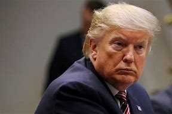
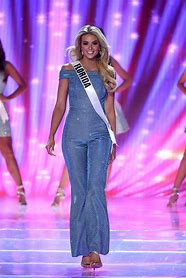

title:: 086  Donald Trump: Unusual

- ## 086  Donald Trump: Unusual
- ## pure
  collapsed:: true
	- VOA Learning English presents America's Presidents.
	- Today we are talking about Donald Trump. He was elected in 2016. Because his presidency is so new, this program will not discuss his time in office.
	- Instead, it will discuss his early life.
	- And it will note a few ways that Trump's background is unusual compared to most U.S. presidents.
	- ## Early life
	- Donald Trump was born in Queens, a borough of New York City. He was the fourth child. He had two brothers and two sisters.
	- His mother had been born in Scotland. His father, whose relatives were German, became a successful businessman in New York.
	- Donald and his two brothers helped their father in the family business. At the time, the business was called Elizabeth Trump and Son, after his grandmother and father. The work related to building, buying, and managing property.
	- By his own telling, young Donald often created trouble in school. So when he was 13 years old, his parents sent him to a military-style school.
	- Donald said that, for the most part, he enjoyed the experience. Other students there remembered him as a good baseball player, as popular with girls, and as someone who wanted to succeed.
	- Trump went on to college first at Fordham University in New York, and then at the University of Pennsylvania. He earned a degree in economics.
	- He was also already investing in real estate. After he graduated, Trump quickly returned to New York City and his career.
	- In time, he became the head of the family business. He re-named it the Trump Organization. As its president, Trump developed and put his name on luxury buildings, casinos, hotels, and golf courses around the world.
	- Later, he became linked to the entertainment industry, too. He became a part owner of beauty pageants, hosted a television show, and wrote a book about how to succeed in business.
	- During these years, Trump also married three times and divorced twice. The media wrote especially about his first and second marriages because he openly had a relationship with his second wife while he was married to his first.
	- In 2005, he married Melania Knauss, a former model from Slovenia. She is only the second first lady who was not born in the United States. The first was Louisa Adams, who came from Britain in 1801.
	- All together, Trump has three sons and two daughters.
	- Because Trump has been a public figure for most of his life, many Americans were familiar with him before he ran for president.
	- To some, he is linked to success in business and branding.
	- To others, notes journalist Jackie Calmes, he is linked to debt and legal battles.
	- But, until he officially entered the 2016 campaign as a Republican candidate, few linked him to politics.
	- Trump is unusual among past presidents in that he had never worked in the government before. Nor has Trump served in the military. Only Presidents Taylor, Grant, and Eisenhower had no previous government experience; however, they had all been generals.
	- During the campaign for president, other candidates spent money to buy advertising. But Trump spread his message on free television, radio and social media.
	- Trump won the Republican nomination over 16 candidates. He went on to defeat Democratic nominee Hillary Clinton to win the presidency.
	- Trump is the oldest person ever to take office. He was 70 years old when he was sworn in.
	- He is also one of the richest.
	- And Trump is unusual in how he communicates with the public. As president, he continues to use Twitter to communicate his thoughts directly to anyone who wants to follow him.
	- Many earlier presidents also used changes in technology to interact with the public. Woodrow Wilson was the first to hold press conferences regularly with reporters. Franklin Roosevelt famously spoke to Americans on the radio. John F. Kennedy – and later Richard Nixon – are credited with using television to their advantage.
	- But these episodes were often planned in advance. Trump has said he likes Twitter because he can share his thoughts immediately. And, he adds, the media and the public respond immediately, too.
	- While the long-term effects of Trump's presidency are not yet known, he will likely be remembered in part for his direct and unscripted style of communication.
- ---
- ## def
	- VOA Learning English presents America's Presidents.
	- Today we are talking about Donald Trump. He was elected in 2016. Because his presidency is so new, this program will not discuss his time in office.
		- > ▶ Donald Trump
		  
	- Instead, it will discuss his early life.
	- And it will note a few ways /that Trump's background is unusual compared to most U.S. presidents.
		- 它还会指出，与大多数美国总统相比，特朗普的背景在一些方面不同寻常。
	- ## Early life
	- Donald Trump was born in Queens, a borough of New York City. He was the fourth child. He had two brothers and two sisters.
		- > ▶ borough (n.) /ˈbɜːroʊ/   a town or part of a city that has its own local government 自治市镇；（城市）行政区
		  => 英语单词borough与burg、burgh同源。西方好多城市都以burg或burgh结尾，如汉堡（Hamburg）、爱丁堡（Edinburgh）、匹兹堡（Pittsburgh）。burg或burgh就是“城镇”的意思，不过和city或town不同，**burg或burgh指的是带碉堡的城市**，也就是说，它们在成为城市之前其实就是一座要塞或一座城堡。borough在英语中表示“自治市”。自治市的自治权是打仗打下来的，所以这些城市自然要修筑碉堡来保卫自己。
	- His mother had been born in Scotland. His father, whose relatives were German, became a successful businessman in New York.
	- Donald and his two brothers helped their father in the family business. At the time, the business was called Elizabeth Trump and Son, after his grandmother and father. The work related to building, buying, and managing property.
	- By his own telling, young Donald often created trouble in school. So when he was 13 years old, his parents sent him to a military-style school.
	- Donald said that, for the most part, he enjoyed the experience. Other students there remembered him as a good baseball player, as popular with girls, and as someone who wanted to succeed.
	- Trump went on to college /first at Fordham University in New York, and then at the University of Pennsylvania. He earned a degree in economics.
	- He was also already investing in real estate. After he graduated, Trump quickly returned to New York City and his career.
	- In time, he became the head of the family business. He re-named it the Trump Organization. As its president, Trump developed and put his name on luxury buildings, casinos, hotels, and golf courses around the world.
		- ((6260e5db-a0bf-47dc-bc57-d5dd5eac8422))
	- Later, he became linked to the entertainment industry, too. He became a part owner of beauty pageants, hosted a television show, and wrote a book about how to succeed in business.
		- > ▶ pageant  /ˈpædʒənt/  穿古代服装的游行；再现历史场景的娱乐活动 
		  + /( NAmE ) a competition for young women in which their beauty, personal qualities and skills are judged 选美比赛
		  + /~ (of sth) ( literary ) something that is considered as a series of interesting and different events 内容繁杂有趣的场面；盛大华丽的情景
		  -> life's rich pageant 丰富的人生画卷
		  => 来自page,页码，书页，-ant,名词后缀。比喻用法。
		  
	- During these years, Trump also married three times and divorced twice. The media wrote especially about his first and second marriages /because he openly had a relationship with his second wife /while he was married to his first.
	- In 2005, he married Melania Knauss, a former model from Slovenia. She is only the second first lady who was not born in the United States. The first was Louisa Adams, who came from Britain in 1801.
	- All together, Trump has three sons and two daughters.
	- Because Trump has been a public figure for most of his life, many Americans were familiar with him before he ran for president.
	- To some, he is **linked to** success in business and branding.
	- To others, notes(v.) journalist Jackie Calmes, he is linked to debt and legal battles.
		- 记者杰基·卡尔梅斯指出，对其他人来说，他与债务和法律纠纷有关。
	- But, until he officially entered the 2016 campaign as a Republican candidate, few linked him to politics.
	- Trump is unusual among past presidents /**in that** he had never worked in the government before. Nor has Trump served in the military. Only Presidents Taylor, Grant, and Eisenhower /had no previous government experience; however, they had all been generals.
		- > ▶ in that 因为,由于,在于
		- 特朗普也没有在军队服役。只有泰勒、格兰特和艾森豪威尔总统, 没有从政经验;然而，他们都是将军。
	- During the campaign for president, other candidates spent money to buy advertising. But Trump spread his message /on free television, radio and social media.
	- Trump won the Republican nomination over 16 candidates. He went on to defeat Democratic nominee Hillary Clinton /to win the presidency.
	- Trump is the oldest person ever /to take office. He was 70 years old /when he was sworn in.
	- He is also one of the richest.
	- And Trump is unusual /in how he **communicates with** the public. As president, he continues to use Twitter /**to communicate** his thoughts **directly to** anyone who wants to follow him.
	- Many earlier presidents also used changes in technology /to interact with the public. Woodrow Wilson was the first /to hold press conferences regularly /with reporters. Franklin Roosevelt famously spoke to Americans on the radio. John F. Kennedy – and later Richard Nixon – are credited with using television /to their advantage.
		- 许多早期总统也利用新科技的变化, 来与公众互动。伍德罗·威尔逊是第一个定期与记者举行新闻发布会的人。富兰克林·罗斯福, 对美国人民发表了著名的广播讲话。约翰·f·肯尼迪(John F. Kennedy), 以及后来的理查德·尼克松(Richard Nixon), 都被认为利用了电视的优势。
	- But these episodes /were often planned(v.) in advance. Trump has said /he likes Twitter /because he can share his thoughts immediately. And, he adds, the media and the public /respond(v.) immediately, too.
		- 但这些情节通常是提前计划好的。... 他补充说，媒体和公众也会立即做出反应。
	- While the long-term effects of Trump's presidency /are not yet known, he will likely be remembered /in part for his direct and unscripted style of communication.
		- > ▶ unscripted (a.) ( of a speech, broadcast, etc. 讲演、广播等 ) not written or prepared in detail in advance 无底稿的；未详细准备的
		- 虽然特朗普总统任期的长期影响尚不清楚，但他可能会因为直接和即兴的沟通风格而被人们记住。
- ---
- Donald Trump
	- 唐纳德·特朗普出生并成长于纽约州纽约市皇后区，为特朗普集团前任董事长兼总裁及特朗普娱乐公司的创办人，在全世界经营房地产、赌场和酒店。1996年至2015年间，特朗普旗下拥有美国小姐和环球小姐选美比赛，还在2004年至2015年间主持了NBC的一档电视真人秀系列节目《学徒》。
	- 部分评论将他的政治立场描述民粹主义、贸易保护主义和民族主义。**他是美国历史上最富有以及第一个先前没有担任过任何军职或公职的总统，**也是获胜者获得较少普选票而当选的美国总统的人.
	- 特朗普政治立场反复，过去曾多次转换党籍.
	- 特朗普2015年6月16日宣布以共和党人身份参选. 民调发现特朗普的支持者多数来自共和党主力的白人男性, 及底层劳工，为各种经济自由贸易协定和移民相关法案的主要反对者，尤其反对让非法移民拥有居留权.
	- 特朗普和民主党候选人希拉里, 在竞选过程中多次互相人身攻击. 时任美国国务卿约翰•克里评论道: “从未想象过总统大选辩论的关注点并不在实际问题上”。
	- 特朗普比克林顿获得更少的普选票，使他成为第五位输掉普选却成为总统的人.