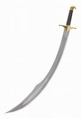

title:: ①a +暂时的adj. 客体, ②the +长久状态的adj. 客体

- ==a +  adj.(暂时的, 非固有的情形)  n.==
  ==the +  adj.(长久性质的)  n.==
	- **a split** Supreme Court内部意见分歧的最高法院 <- ==有分歧, 只是暂时的, 所以该adj. 前面用 a==
	  **the mostly silver-haired** Supreme Court多数大法官都是满头银丝的最高法院。 <- ==头发发白了, 是长久的状态, 所以该 adj. 前面用 the.==
	- **A subdued** Assistant District Attorney. <- 心情不好只是暂时的, 前就用 a
		- ▶ subdued (a.) /səbˈduːd/ ( of a person 人 ) unusually quiet, and possibly unhappy 闷闷不乐的；抑郁的；默不做声的 /(光线或色彩 )柔和的 /( of sounds 声音 ) not very loud 压低的；小声的
		  id:: 6203705a-5a3c-4750-95f8-77c92e102b3a
		  => 来自拉丁语 subducere,拉走，拉下，来自 sub-,在下，-duc,拉，引导，词源同 deduce,deduct. 引申诸相关比喻义。
		  -> a subdued conversation 小声的谈话
		-
- 但如果在 "暂时性性质"的adj. 前面, 还有别的表示"长久固有性质"的adj.，则依然要用the。
  background-color:: #264c9b
	- a stunned world.
	  **the entire(a.) stunned** world举世惊愕的人们 <- entire是"固有性质", 前就要用 the.
		- ▶ entire  /ɪnˈtaɪər/ (a.)whole 全部的；整个的；完全的
		  -> I wasted **an entire day** on it. 我为此浪费了整整一天。
	-
- 事实上, 一个 adj. 到底是用来表达"暂时的性质", 还是"长久固有的性质", 没有一定的标准. 全看说话人的内涵意思.
  background-color:: #264c9b
	- ... led by **a middle-aged** Nikita Khrushchev... 中年人赫鲁晓夫所指挥的… <- 表示年龄的adj. , 是长久的状态, 前面要用the。 但为什么这里用了 a ? 因为作者是想暗示出, 他后来老年时, 会有另一番不同的生涯。
	- A lean yellow scimitar of a moon <- 本来表示唯一事物, 前要用 the. 但作为月亮一时而非经常的表现，这里句首就用了a而不是the.
		- ▶ scimitar /ˈsɪmɪtərˌˈsɪmɪtɑːr/（多为东方人所用的）短弯刀
		  collapsed:: true
			- {:height 89, :width 69}
			-
	-
	-
-