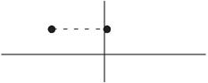
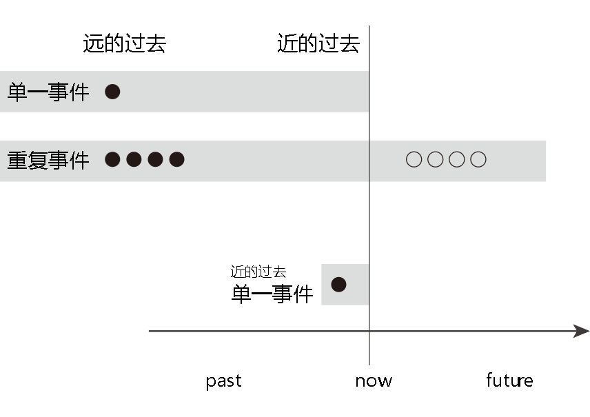
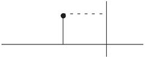

title:: 3. 过去时间点A已经结束的事件, 后果影响到了时间点B

-
- 某一个短暂事件, 是在过去发生并结束的，但它产生的影响, 却一直到现在还存在. 即: 事件虽然在A时间点已经结束，但它的影响“延续”到B时间点.
  background-color:: #264c9b
	- 这个"单一事件"可以看作是"重复事件"的特例——事件只发生了一次，而没有多次重复。
	- 
- ---
- 这个短暂动作, 有两个变量:
  background-color:: #264c9b
  (1)发生的时间, 距离现在, 是远还是近? 
  (2)发生的次数, 是只一次, 而是重复了多次?
	- 就可以分成三种情形:
	- |"以前"的这件事件, 都对"现在"产生了影响|事件只发生一次|事件重复了多次|
	  |发生的时间, 离现在"近"|He has just been fired.（他刚刚被开除了。——近的过去单一事件）||
	  |发生的时间, 离现在"远"|He has been fired before.（他以前被开除过。——“远的过去”单一事件）|He has been fired three times. 到目前为止，他已经被开除过三次了。|
	- {:height 307, :width 404}
- ==所以, **我们可以把"完成时"的这种意思, 称为“单一事件”完成时. 以区别于前面说过的 “延续事件”完成时, 和“重复事件”完成时意思。**==
	- 
	- 图中黑点表示: 过去某一时刻发生的动作；虚线表示 : 过去发生的动作对现在有影响。
	- #+BEGIN_QUOTE
	  一个衣着前卫的摩登女郎，有一天她身穿吊带背心，脚蹬一双拖鞋就去了音乐厅。门口的检票员看她这身装束就很礼貌地拒绝让她进场：
	  "Miss, NO ADMISSION WITH SLIPPERS."（小姐，穿拖鞋是不准进剧场的。）
	  
	  这位小姐听完之后立即脱掉拖鞋并提在手中，说道：
	  "Really? Then I will go in barefootedly."（哦，是吗？那我就光脚进去！）
	  
	  这时，这位目瞪口呆的检票员惊叫道：
	  "Oh, my god! Fortunately, **I have not told her** NO ADMISSION WITH A VEST."（天啊！幸好我刚才没有对她说穿背心不准进！**） <- 检票员说的是 have not told, 就是强调了“过去”的行为对“现在”造成的影响. 同时,told 是个短暂动作(单一事件,而非延续事件), 不具有"重复发生多次"的意思。**
	  → **如果他用 did not tell，就只是在陈述过去“没有告诉”这个事实，而对现在的结果没有任何影响。**
	  #+END_QUOTE
-
- ==**“单一事件”完成时表示的“对现在有影响”，从句子的字面本身是反映不出来的，而是与说话语境密切相关，表现出一种“言外之意”。**==
  background-color:: #264c9b
	- > David **has fallen in love**.
	  -> has fallen是一个短暂动作，不表示延续或重复，所以这句是“单一事件”完成时。
	  "单一事件完成时"是用来表达该事件(陷入爱河)对"现在"造成的影响的, **什么影响呢? 句子没有明说, 这就是它带有的言外之意.**
	- > "**What have I done wrong**?" Mr. Odds asked himself. "**Have I driven** on the wrong side of the road? **Has there been** some trouble at the bank? **Have I forgotten** to pay an important bill?"
	  "Hello, Uncle," said the policeman, "My name’s Mark."
	  欧兹先生心想：“我做错什么了吗？是开车逆行了？是银行工作中出了问题？还是某个重要的账单我忘了付钱？”
	  “你好，舅舅，”那位警察说道，“我是麦克。”
	  -> **欧兹先生怀疑自己做错的四件事(短暂事件), 并非是“延续”和“重复”发生到现在的. 所以"单一事件完成时"强调的是"过去事件对现在的影响"：警察为什么会来找他。**这一影响从上述四个完成时句子本身是看不出来的，要靠语境或背景情况来知道。
- ---
- 事件在过去发生, 这个"过去"的时间点, 可近可远.
  background-color:: #264c9b
  → "近的过去"（near past）比如几分钟前,
  → "远的过去"（distant past）比如几个月前.
	-
	- “较近的过去”事件, 对"现在"的影响, 一般具有以下特点: 1.所造成的现在结果, 往往是"直接具体", 或依然"清晰可见"的 2.因为"最近"才发生, 所以具有"最新热点新闻"的效果.
		- Look! **Somebody has spilt(v.) milk on the carpet**. <-对现在造成的“清晰后果”是：地毯被弄脏了，毯上现在还有牛奶渍。
		- **The car has arrived**. 车子到了。
		- **Who's taken my chair**? 谁拿走了我的椅子?
		- Saddam Hussein **has been captured alive** in his hometown of Tikrit. 萨达姆被抓时，各大媒体立即在新闻报道中这样说.
	-
	- 如果说话人没有给出明确的动作发生时间, 那么这动作时间, 就既可能是"离现在进"的, 也可能是"远"的了.
	  background-color:: #787f97
		- > She **has been to** the bank.
		  由于没有言明确切的发生时间, 所以这句话可以有两种理解:
		  → 可以理解成**"较近的"过去事件**——“她**刚去过**这家银行”。
		  → 可以理解成**"较远的"过去事件**——“她**以前去过**这家银行”
		- > **Have you asked** your little brother to do the dishes?
		  由于没有明确的时间, ask 发生的时间就存在两种可能性:
		  → ask是"近的过去" : 你(刚刚)让你弟弟把碗刷了(把饭做了)吗?
		  → ask是"远的过去" : 你(以前)有没有让你弟弟刷过碗(做过饭)?
		- #+BEGIN_QUOTE
		  He has been fired.  <- 没有给出明确的发生时间. 所以该句话有两种理解:
		  
		  → 理解成“远的过去”事件 : 即表示“过去的经历”：他**以前曾被**开除过。 = He has been fired before. **远的过去的“他被开除过”只是说明他过去的经历，并不表示他现在没工作.**
		  
		  → 理解成“近的过去”事件 : 他**刚被**开除了。= He has just been fired.
		  这一“最近被开除事件”导致对现在的直接影响就是“他失业了”。
		  #+END_QUOTE
		-
	- 如果给出明确的时间 :
	  background-color:: #787f97
		- 较远的过去：ever（英文意思是any time between the past and the present，表示“曾经”，一般指较远的过去时间）；before；
			- A: **Have you ever worked in a restaurant**?
		- 较近的过去：yet，already，lately, recently；
			- A: Have you found a job yet? 你找到工作了吗？
			  B: No, not yet. 还没有。
			  或 Yes. **I've found a job already**. 是的，我已经找到工作了。 ← 在肯定句中，用already代替yet表示“已经”.
		- 更近的过去：just，表示“刚刚”，常与完成时态连用。
			- A: Would you like something to eat? 你想吃点什么吗？
			  B: No, thanks. **I've just had dinner**. 不了，谢谢。我刚吃过饭（现在不饿）。
-
-