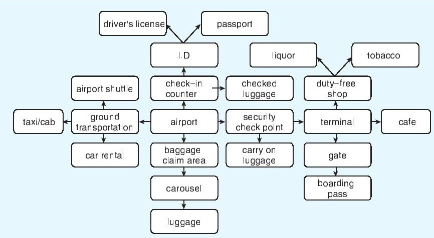
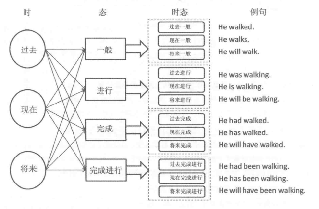
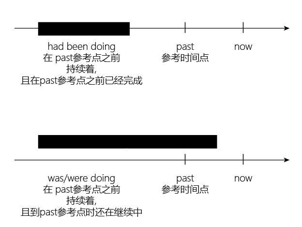
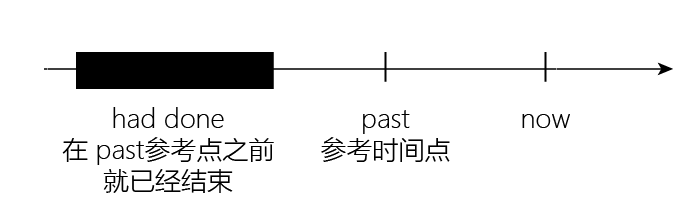
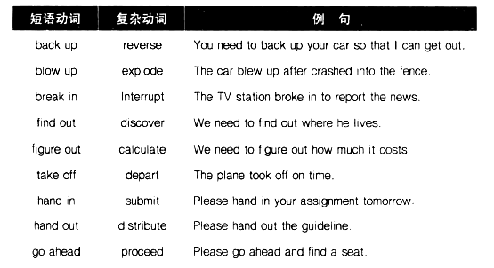
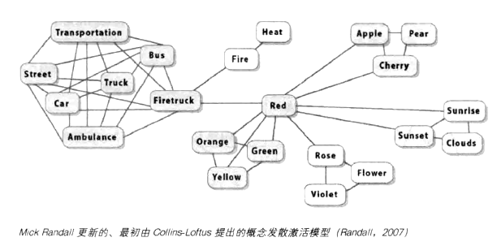
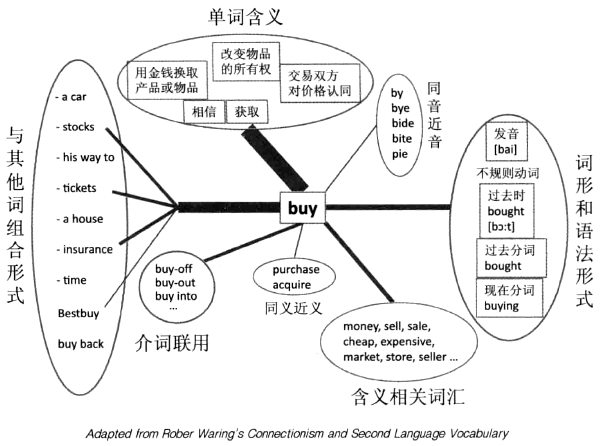

-
- ## 词汇
	- 根据省力原则，英语单词的使用频率越高，单词的含义越丰富，一词多义的现象越严重。
	- 记单词的方式: 最好的信息取出方式，决定于这些信息最初是被如何存入的。
	  background-color:: #264c9b
		- ==**你对记忆的单词能否有效地使用，决定于你最初是用什么方式把这些单词记住的。**== #important
			- 优秀的记忆，依赖于我们初次接触它时的 兴趣和注意力的强度。
		- Michael Lewis在《实用语言教学技巧》一书中，把外语词汇教学的八种最常用技巧这样按顺序列了出来：
		  collapsed:: true
			- -> 使用图片Use pictures
			  -> 使用实物Use real objects
			  -> 示范Demonstrate
			  -> 表演Mime
			  -> 定义Define
			  -> 举例Exemplify
			  -> 使用同义词Use synonyms
			  -> 翻译Translate
			-
		- 错误的记错单词方式: 用稀奇古怪的"联想记忆法"(比如谐音), 其缺点非常明显:
		  collapsed:: true
			- **引入了一大堆作为联想的"中介", 会干扰你对英语词汇的快速直接理解. 事实上, 要养成英语思维, 就是要避免依赖外语和母语之间的翻译, 及"中介"的存在!**
			- 联想记忆也很难处理大量单词, 超过上百个后, 就很难操作了. (这也是"记忆宫殿"记忆方法的局限性)
			- 可以说, 市面上出现的所有的单词联想方式, 都是早已被研究过的，各种方式的利弊也早已被做过大量的实验和研究。
			  因此从20世纪70年代开始，大家研究的热情逐渐降低，这种单词记忆方法, 就不再被广泛地建议使用了.
			-
		-
	- 下面的这些, 不要放在一起学!
	  background-color:: #264c9b
		- **对于有"多重含义"的单词的学习方式 -> 单词在哪个背景下, 就学它在该背景下的唯一那个意思.**
		  collapsed:: true
			- 很多英语单词的含义很多,  其含义, 主要由与其搭配的其他词汇和语境来决定. 这个特点, 就令脱离背景的“背单词” , 成为错误的方式.
			- ==一次只根据该单词出现时的文字背景，学习这个单词在当前使用条件下的这一个含义，而不去同时关注它的其他含义和其他解释.== #important
			- **要通过句子, 来理解单词在此语境中的特定含义, 而不是相反过来学. 单词不应该孤立地学习，要放在它出现的文字背景中去学习掌握.**
			  collapsed:: true
				- > matter这个词有几十种含义，很难同时记住如此多的含义. 但如果是通过真实的词汇组合"It doesn't matter." "What is the matter?" "in a matter of minutes" "organic matter in water" "no matter what you do..."等来学习，这些含义不但容易记忆，且对含义的理解也会非常准确到位。
			- 英语中的介词, 往往不能与汉语直接对应，或很难直接翻译. 所以介词不能简单理解其含义，而应主要靠与其搭配的单词组合, 来学习.
		- **要把动词不规则变化的每种变化形式, 都当作"独立的一个单词"来对待**，而不要反过来 -- 学了主词形式，然后推导其变化形式。
		- **长相比较接近的新单词们，不要混在一起学!**
		  collapsed:: true
			- > 比如, Germany 和 German 两个单词长得又很像，非常容易产生混淆。**解决的办法是, 两个词不在同一时间学习。**
			  最好是先学Germany“德国”，并且了解这个词的不同组合 : made in Germany, go to Germany, study in Germany等等。
			  在间隔比较长的时间之后，再引入German这个词以及它的关联用法，如 German beer, German car,  He speaks German (他会说德语), Her husband is German (她老公是德国人).
			  此时Germany这个词早已十分熟悉，混淆的可能性自然大幅度降低。
			- > **对一些含义容易混淆的词汇，单独去记忆各自的词组, 也会非常有效.** 如 pull the plug“拔（电源）插头”，pull the trigger“扣（枪的）扳机”，pull yourself together“控制你自己的情绪”，pull over“路边停车”；push the car“推车”，push the button“按电钮”，don't push your luck“见好就收（不要推运气）”，push-up“ 俯卧撑（推-起）”。
		- 新的同类词, 不要放在一起学!
		  collapsed:: true
			- 有关“星期”和“月份”的单词，应该拆开来学.
			- 推荐的方式: 将不同的星期词, 结合在它们固定使用的一些句子中，记忆效果也明显会好些。如先记英语俗语：Easy like Sunday morning. 或者顺口溜：Thank God it's Friday.（TGIF）
			- 研究发现, 只有表示"数字"的单词是例外的：one, two, three, four, five, …… 应该放在一起学习。
		- 对"同音词"和"多音词" -> 也是一次只掌握当下这一个发音的一个词.
		  collapsed:: true
			- 不要把多个同音词放在一起, 来一边比较一边来学习。反而会造成混淆.
			-
		-
	- 对于词频在5000以上的词汇, 可以先当作知识来对待(即采取"背单词"的手段), 之后再在各种文章中, 来熟悉它们.
	  background-color:: #264c9b
		- 语义联络图: 就是发现某段文字中关键单词, 与其他单词之间的有机联系. 整段文字的主题单词, 一般是被安排在示意图的最核心，然后通过箭头, 指向从核心词汇发出的分支概念词汇。
		  collapsed:: true
			- 比如, 从核心词happiness出发，分支可以是vacation, parties, friends, family等，进一步还连接到skiing, thanksgiving dinner。
			- 比如, 某段对旅客到机场乘机的流程说明文章中的关联词汇，可以通过语义联络这样连接：
				- 
				- 比如baggage和luggage两个单词, 近义, 放在一起学容易混淆。**但它们在上面的文字背景中是被事件的流程、动作或逻辑关系串联起来的，这样做, 两者之间的学习和记忆不但不互相干扰，反而相互支持**，跟把同类单词并列在一起学习或记忆的情况完全不同。
			- 很多研究认为，在所有不单纯依靠文字解释的单词教学手段中，语义联络可以算最有用的一种了（Hague,1987）。
			- 语义联络只是学习的辅助工具。当熟悉了这种形式以后，听或读外语的时候就不需要每次都认真地把词义关系图画出来了，而是在读和听的过程中，自然就会注意到词义之间的有机联系，会对有关联的词汇加以注意和回顾。**久而久之，在大脑中逐渐形成了一系列相关词汇概念的有机连接，跟语义联络非常类似。**比如pollution一词的词义连接单词局部网络如下图：
				- {:height 184, :width 295}
			- 以植物的生长概念为核心的词汇含义, 关联搭配立体网络:
				- {:height 349, :width 299}
				-
		- 所以, 单词学习是个全面的立体的"多军种协同战役"，而不是一个单词一个单词逐一攻破的游击战。
		- **抽象词汇一般需要借助其他具象词汇的解释**，但困难在于, 汉语语言中, 很难准确表达很多英语的抽象词汇.
		-
	- 被研究证实的, 好的记忆方式
	  background-color:: #264c9b
		- "单词卡片"（flash card）的学习效果，往往比"单词表"的学习效果好。
		- 实验中, 三种对记忆有支持作用的环节, 分别是：
		  collapsed:: true
		  background-color:: #787f97
			- 1.**突出。在介绍新词和新物品时，预先告诉小朋友们，下一个玩具很特殊。**（"The next toy is special."）
			- 2.重复。在引入新词的过程中，**分别用多种不同的形式，自然地令生词出现在描述中。**比如：“咱们来量一下这个koba的长度。” “Koba多长呀？”（"Let's measure this koba.How long is koba"）
			- 3.复述。**让小朋友们复述生词。**“你会说koba吗？”（"Can you say koba"）
			-
		- 记忆的时间间隔 -- "等间距时间"学习最好
		  background-color:: #793e3e
		  collapsed:: true
			- 即 : 用所谓的艾宾浩斯曲线的"前密后疏"的学习节奏，不如"等距间隔"学习效果好。
			- 等间距学习，每次的学习间隔, 是多少为好?
				- 研究发现，学习间隔长短的选择，取决于该记忆内容在学习停止多长时间后, 需要使用。这个学习停止后的记忆保持时间长短, 叫作“记忆保持期”（retention interval），简称R.I。
				- -> ==**如果R.I短，比如一天以内和小时级范围内，那么最佳学习间隔是：学习间隔≈R.I×1.0。**==
				  collapsed:: true
					- > 比如学习停止后1小时后就需要考试，那么学习间隔，就选为1个小时；
					  如果是学习停止一天以后需要考试，那用每天复习一次的节奏(Cepeda,2009）
				- -> ==**如果R.I长，比如在学习完成后, 几天以上这个时间范围, 需要使用记忆内容，那最佳间隔是：学习间隔≈R.I×0.1。**==
				  collapsed:: true
					- > 比如在最后一次学习完成30天后, 需要使用记忆内容，那间隔为每3天一复习为好（Cepeda,2009）。
					-
					-
				- 如果明天就要考试用上了，今天才开始临时抱佛脚，该怎么办？
				  collapsed:: true
					- 先用阅读和诵读等被动方式, 输入学习内容20分钟，
					  然后停止学习, 立即去进行“手眼协调”的文体活动，比如投篮、手工、画画、弹琴等10分钟，总之不能与学习相关。
					  活动完之后，立即再次投入学习，这次是用总结和背诵等主动输出的方法, 学习20分钟. 
					  然后再次停止学习, 去做文体活动10分钟，回来后再次重复前两步. 
					  如此反复进行（Paul Kelley,2005）。
				- ==**如果希望记忆保持得长久，分散学习的“间隔时间”越长越好。** -- 间隔56天==
				  collapsed:: true
					- {:height 439, :width 275}
				- ==**要重复学多少次呢? -- 至少7次**==
				  collapsed:: true
					- 这跟学习材料的难度有很大的关系。
					- 对外语单词这种难度内容的记忆，各项研究显示，**如果需要达到长期效果，那么包括首次学习在内的6次重复学习是最低限度**（Crothers and Suppes,1967），以**7次为比较理想**（Kachroo,1962）。
					- 即: 在对生词的初次学习后，以56天一个周期为间隔进行复习，共进行7次复习。
					- 但, 56天时间太长不易控制，把"学习间隔"缩短, 控制在一天以上、几天或一两周内, 这种尺度都是比较理想的。
	-
	-
	- 介词 -> 表达“方位, 空间位置关系”含义
	  background-color:: #787f97
		- 具体使用哪个介词，取决于所表达的前景F, 与背景G之间的关系。
		  collapsed:: true
			- ||F和G的空间关系|即F对应的G是|
			  |--|--|--|
			  |at|零维|一个点|
			  |on|一维|一条线|
			  |on|二维|一个平面|
			  |in|三维|一个三维容器|
		- 如, at(一个点), on(在二维的一个面上), in(在三维里面)
		  collapsed:: true
			- > 把人当作F(前景),人所处的环境当作G(背景), 则:
			  + I am **at** school.我在上学。（零维，学校表示一个概念）
			  + I am **at** the school.我在学校。（零维，学校表示位置，是一个点）
			  + I am **on** the school playground.我在学校操场上。（二维，操场是个平面）
			  + I am **in** the classroom.我在教室里。（三维，教室是个三维的容器）
			- > I am **at** the hotel.（零维，宾馆是个点，表示位置，用at）<- at是表示零维的相对空间关系，只要是想表达在宾馆这个概念而不是想具体说明在宾馆里的某个特定位置，把宾馆看作一个抽象的点。
			  I am **on** the second floor of the hotel.（二维，二楼是个平面，我在平面上，用on）
			  I am **in** the hotel.（三维，宾馆是个三维容器，我在容器里面，用in）
			- > He is **at** the hospital. <- at是表述他现在的位置在医院
			  He is **in** the hospital. <- 英语中, in the hospital 往往表示 "生病入院". 所以为了表示你只是在医院里面, 就要改用  I am **inside** the hospital.
			- Your wife is **on the line**.你老婆在线上（来电话找你）。<- 把人作为F,表示“人”在一维G"线"line上.
			- He lives **on the border of** two cities.他住在两个城市的交界处。
			- His life is **on the line**. My job is **on the line**. 说生命或工作“悬于一线”，自然是“很危险”的意思。<- 人站在线上，显然站不稳.
		- -> **G的活动性越强，以及对F的控制程度越高，越倾向于成为三维容器，用in。**
		  collapsed:: true
		  -> **F的活动性越强，受到G的控制度越低，越倾向于处在二维平面上，用on。**
			- One bird **in the hand** is worth two birds **in the bush.** 一鸟在手, 胜过二鸟在林
			- > He keeps a gun **at hand**. <- 枪在一个固定点（零维），手要用枪时必须去它所在的固定地点去拿
			  He has a lot of guns **on hand**. <- 手头
			  He has a gun **in his hand**. <- 手对枪的控制度最高，手成了三维容器，用in。手中
			- > What is **on your mind**? <- 比较倾向于头脑中刚冒出来的念头，是念头F的主动性高，头脑G的控制度低。你在想啥呢？
			  What is **in your mind**? <- 倾向于经过时间思考后的想法，是头脑G的控制力高。 你是咋想的呢？
			- > He is **on the market**. <- “他”F对“市场”G的控制度高，受到“市场”的制约少，自己主动去找且自信找到工作的机会很高。
			  He is **in the market**. <- “他”对“市场”的控制度较低，“市场”中的竞争因素等对此人制约比较大。一般来说他已经找了一段工作还没找到，或现在虽然有工作却不如意，一直在寻找更好的工作。
			- He **put** his house **on the market** last year, now the house has been **in the market** for a while.
	-
	- 英语中的外来词
	  background-color:: #787f97
	  collapsed:: true
		- 以法语和拉丁语单词为最多. 注意发音。**这些外来词汇的发音方式，大部分是元音仍保留外语发音，特别是法语词**，并且越是常用词越是这种情况。
		- 外来单词中的辅音，普遍用英语的发音方式，但**原来在外语中不发音的辅音，英语中也不发，重音位置也要遵守外来语的原始位置。**比如法语单词结尾t 和s 通常不发音，名词重音普遍在后面等，在英语中也要如此。
		- 英语中的拉丁文，主要应用于法律、政治、学术、医学等领域。如 per capita 按人头算。
		- 英语中的法语词，主要在餐饮、娱乐、文化、政治和社交场合。
		- 来自德语的词汇，主要跟哲学、社会学和教育相关，数量不多。
		- 来自汉语的词汇，应用范围非常窄，多半和食物有关，很多还是来自广东话的发音。
		- 日语词，以武术和食品为主。
		-
	- 对"脏话词汇"的纯净版
	  background-color:: #787f97
	  collapsed:: true
		- fucking 变成了freaking ，比如Have you lost your freaking mind? **It's freaking cold**!
		- hell 变成了heck ，比如What the heck?
		- damn 变成了darn ，比如: Darn it ! That was darn good !
		- shit 变成了shoot. 比如Oh shoot ! I lost my wallet.
		- 其实汉语也纯净版，比如"我靠"  "牛叉"。
- ---
- ## 时态
	- **说话中的时态错误, 主要原因是: 说英语时, 没有养成"英语的思考方式"习惯，而是使用了"汉语的思考方式"。**
	  collapsed:: true
		- 人在说话的时候，不同的语言, 会导致人对现实世界有不同的概念化认知方式(Pinker ， 1989) .
		- **说外语, 你不是在简单地学一种新的说话形式， 而是不可避免地在使用一种新的思考方式。** #important
		- 说话时, 整个词句编码过程的自动化程度很高，并不需要思考语法结构。
		- 说不同语言的人, 在思考方式上的差异，主要体现在①对事物的概念化方式, 和②信息归类方式上。
		- 比如, 说英语的人在对动作和事件的思考中，需要对时间信息进行归类;而大部分亚洲的语言思考中, 动作并不带有时间概念信息.
		-
		- 是什么决定了在句子选择动词时, 用过去时bought ，而不是用原形buy 呢? ^^**对句中动词使用什么"时态"的决定, 是在第一步的"概念形成"中, 即在"想说什么"的阶段, 就已经明确了, 而不是等到第二步的"词句编码模块"中才去考虑的.**^^ #important
		- **也就是说，选择词汇之前，"买"的动作"发生于过去"的概念，已经被思考过并包含在"语前信息"中了。这样随后第二个模块的"语句构成器", 才会"知道"要从头脑词库中选用bought 这个单词形式. 而不是先选择单词buy ，然后再根据语法规则进行时态变位。这是个关键点.**  而这也正是中国学生常犯的错误 -- 他们在学说英语的第一个步骤"形成概念"时，使用的是汉语的思考方式， 即动作的思考中不带时间性。 #important
		-
		- **说英语的人，在概念中就已经把"过去","现在"和"将来" ，使用"间隔分段" (segmented) 的方式进行概念化思考，每个动作的发生, 都要归类于某个具体时间分段中.** 每个时间分段的跨度较小，动词发生具体时间概念较精细.
			- 
		- 研究发现，英语水平高的中国同学，在对动作时间的思考方式上发生了变化，甚至在理解汉语的时候，也出现了关注"动作发生具体时间"的思考习惯.
		- > 对比研究发现，说英语的人头脑中 is kicking 所指代的这个动作的持续, 比说汉语的人头脑中" 正在踢"所指代的时间跨度要长。英语中is kicking 是描述了"整个持续一段时间的动作过程"，而汉语的" 正在踢"，在时间概念上, 则是一个动作的"快照"，并不表达"运动的过程"。汉语中的"正在"，强调的是"当下发生"，并不具有英语"进行态"的"动作延续, 和事件发展变化过程"的概念。
		-
	- 所谓时态，是由"时" ( tense) 和"态" (aspect)两个概念组成的.
	  background-color:: #264c9b
		- 动词的"时"，描述的是动作在时间轴上发生的具体位置( Iocation) 。
		  background-color:: #787f97
		  collapsed:: true
			- 严格说, 英语只有两个"时"，即"过去时"和"非过去时".
		- 动词的"态"，是动作发生和发展的"当前装状" (shape) . "态"跟动作发生的具体时间并没有直接关系。
		  background-color:: #787f97
		  collapsed:: true
			- 英语的"态"主要有三个: "一般态"(simple) , "进行态" (progressive) 和"完成态" (perfect) 。
			  但在同一个动作中，"完成"和"进行"两个态可以同时具备，所以又分离出了一个独立的"完成进行态" (perfect progressive) ，变成了四个常用的态。
		- "4态"组合"3时"后, 就有12种时态
		  background-color:: #787f97
		  collapsed:: true
			- 
			- ||核心含义|
			  |--|--|
			  |现在时(present tense)|当前/近期的真实性 (immediate factuality) |
			  |过去时(past tense) |是行动"遥远感" (sense of remoteness) 的概念|
			  |表将来 (future tense)|对行动的"预言" (prediction) |
			  |***|***|
			  |一般态(simple aspect) |动作已经是处于"不允许继续发展的完整体"状态了(complete whole, not allowing for further development. )|
			  |进行态(progressive aspect)|行动还处于"未完成的、临时的和继续的" (incomplete, temporary and ongoing) 的状态|
			  |完成态(perfect aspect) |表明行动"是在过去发生的, 但其影响持续到此刻"，即"回顾此刻之前" (retrospectively referring to a time prior to now) 的含义|
	-
	- 对事件进行报道或描述，到底选用哪种时态，没有严格规定，完全只取决于作者的选择 --  选用不同的时态, 会给读者产生不同的阅读感受。
	  background-color:: #793e3e
	-
	- 一般态
	  background-color:: #264c9b
		- 一般态 + 过去时 = did : 含义为"不发展变化的完整体+遥远感"，即"巳经结束的遥远行动"。
		  background-color:: #497d46
		  collapsed:: true
			- 一旦意识到行动符合"已结束的遥远行动"的含义，就可以使用 did 的形式。
			  background-color:: #787f97
				- > + **He worked in the library** for two years. 他**以前**在图书馆工作了两年。<- 时态含义反映出，"在图书馆工作两年"**是个不再改变的历史，他现已不在图书馆工作了。**
				  + **He wrote a book** last year. 去年他写了一本书。<- 时态含义反映出，**写书的行动已经结束，在过去某个具体时间书写完了。**
			- ==**可以利用"过去时"的遥远感含义，能让语言变得间接和婉转，会感觉比使用 "现在时"的形式有礼貌。**==
				- > + **Did you want** a receipt?
				  + **I was calling to inform you** a change in your flight schedule.
				  -> 这两句话都是"当前"正在跟对方说的话，描绘的也是"现在的事情"。就是用过去时来表委婉. 
				  所以服务人员在向顾客询问和告知顾客信息时，经常会使用 did 而不是 do。
			- **在请求对方做事情的时候，过去时的遥远感, 也被用来让语言因为不直接而显得更礼貌。**
				- > **Could you** open the window? 并非表示过去的事情，而是比Can you open the window? 更间接和客气。
			- **如果再想更加礼貌一些，就只能在"过去时"之外再加上"假设"，来进一步增加遥远的程度了.**
				- > **If you could** open the window, that would be nice.
				-
		-
		- 一般态 + 现在时 = do/ does : 含义为"当前/近期真实性+不允许发展变化的完整体"。即"不变的近期事实"。
		  background-color:: #497d46
		  collapsed:: true
			- 例
				- >  + He **works in the library**.  <- 时态含义反映出，他的这份工作是个稳定的长期取位，即"不变化的事实"。
				  + He **lives in New York**.  <- 目前的不变事实，表明他的长期固定住址, 是纽约，尽管此时此刻他本人不一定在纽约。
				  + He **speaks English**. 他会说英语。/他平时说英语。<- 不变的当前/近期事实，表示说英语是他的能力或习惯，但他此刻并不一定正在说英语。
			-
			- 用这种时态来描绘一系列动作，会给人带来很强的" 当前" 和"真实" 的感受。
			  background-color:: #793e3e
			  collapsed:: true
				- 所以, 在**体育解说**中，就使用 do/does。
				  collapsed:: true
					- > 如"David **gets** the rebound, **passes** the ball **to** Johnny. Johnny **shoots** - and **misses** again . The team **is losing** momentum. "
					  -> 严格地讲，David 抢到篮板球, 并把球传给Johnny ，已经是发生过的事情了，按理是可以使用"过去时"的: David **got** the rebound and /then **passed** the ball **to** Johnny . **但如果使用"过去时"，则会让听众感觉是很久以前发生的事情， 一下子就失去了"现场"效果。**
					  -> **如果都换成"现在进行时"** David **is passing** the ball **to** Johnny ... **听众的观察点则被安置到了动作过程中，会感觉这个球还没传到队友手中。**
					  所以, 除非是**某个动作或状态, 能够持续比较长的时间，在动作"持续性"和"未完成性"的含义概念带动下，才应该使用"一般进行时态"。**
				- "现在时"带有现场感，所以在**讲笑话和写剧本**时，也会用"do /does"时态，以给人带来生动的体验感。
				- 在**学术论文**中, 为了强调这些研究所得到的"规律发现", 对当下也是成立的.  所以都会使用 "do /does"时态.
				  collapsed:: true
					- > The largest study to date, ... **finds that** those who regularly **drink coffee** -- either decaf or regular -- **have a lower risk of** overall death than nondrinkers.
					  -> 作者描述的调查研究, 显然发生在过去. 但他为了凸显这个所发现的规律, 对现在依然有效, 就使用了"现在时". 以凸显"在当前也具有真实性"意味.
				- "事件新闻报道"中, 如果描述的是过去的事, 就要用"过去时". 读者也自然会把这个事情, 当作"发生于过去的事件"来对待。然而近年来, 在小说中使用"现在时", 却多起来了. 目的依然是:
				  collapsed:: true
					- > He **opens the door** and **stands back** to let me in. **I gaze at him** once more...  
					  目的是 : 用"现在时"来描写女主角走进男主角卧室的过程，具有"身临其境感"和期待感。
					- > Now's my chance to finish him off. I **stop** midway up the horn
					  and **load** another arrow, but just as **I'm about to** let it fly, I **hear** Peeta cry out...
					  用"现在时", 来让读者感觉事情正在发生，结局还无法预知。
					-
			-
			- ==使用时态时, **最关键的要点在于 --  只要符合"现在时"时态的语意，它就能够被用于描绘其他时间状态的行动，而并不一定局限于表达"现在"发生的事情。**== 比如, 可用于表述"将来"的情况. #important
			  background-color:: #793e3e
				- 未来的行动, 如果是客观的、"既定的"行程、"固定不变的"计划，就符合了"不变的当前/近期事实"的含义，就要使用 do/does。
				  background-color:: #787f97
				  collapsed:: true
					- > + The English class **starts at 9 am tomorrow.** (课表**已经定了，不能变**)
					  + The train **leaves at 8 pm tonight**. (火车时刻表**已经定了**)
					  + **When do we** board the train? (**已经安排好了**行程)
					  + The new  movie **releases Friday** . (电影上映时间**早就计划好了**)
				- 在条件从句中(如 when, after, before, as soon as, until , if), 表达未来的行动，通常要用 do/does。
				  background-color:: #787f97
				  collapsed:: true
					- **不难发现，尽管是描述尚未发生的将来的事情，但在从句中这个的"前提条件"(计划好的), 是符合了"不变的当前/近期事实"的含义，所以要用"一般现在时"。** 而主句表达的是"愿望"，自然要用将来时. ( "一般现在"的将来，当然是"一般将来"啦)。
					- 换言之:  条件为真, 即符合"一般现在时"含义, 就可以用 do/does.
					- > I will go home /**when** the class **ends**. <- 主句 I will go home 是一般将来时，表示为愿望而不是事实。**从句 when the class ends 是一般现在时，表式"以不变的事实"作为条件.**
					- > + You will feel better **after you drink some water**.
					  + I will start c∞king **as soon as I get home.**
					  + He will finish the report **before he leaves.**
					  + The car will stop **when there is a red light.**
					  + The plane will not take off **unless** the pilot **gets a permission** from the control tower.
					  + She won't get her drivers' license **until she passes the driving test**.
					  + I will go **if you go, too.**
					  + I will **if I can**.
				- 上面这用"现在时"表示"将来事件"的例句，如果全部使用"将来时"，语法上是正确的，但含义却会有所不同。
				  id:: 622169f7-8135-4186-8a10-c1e388e17631
		-
		- 一般态 + 将来时 : 时态含义为"预言+完整的未来的行动"。使用将来时，更倾向于表达说话人的"主观意愿"，而没有"客观的, 不会发生变化的当前事实"的概念，所以是不同的含义。
		  background-color:: #497d46
		  collapsed:: true
			- > **I will go to meet Jim** at the airport tomorrow. <- 预言. **只表达我单方面的想法**，但很可能对方Jim 还不知道这个安排, 或者还没同意这个约定，事情的变数就比较大，不如"I am
			  meeting Jim at the airport. "的确定性高。
			  **I am going to meet Jim** at the airport. <- 预言
			- > **I will leave** tomorrow. <- 也只表达"主观愿望"，而不是当下就进入了准备离开的客观状态，确定性和离开的决心, 都比"**I am leaving** tomorrow. "弱。
			- **事实上, will 这个助动词, 本身就是"愿望"的含义.** 所以带有will 的句子，就带有很强的"==主观愿望=="的含义。
			- **而be going to 是"现在的决定或情况的延续，从==客观上==将导致发生这个行动"，而不单纯是"主观愿望"实现的。所以从含义上来讲， ==be going to 指代的行动会发生的确定性，比be doing 低，但比will 高==。**
				- > + **He will become** a famous writer.
				  + **He is going to become** a famous writer. <- **be going to 更加客观，所以同样是作为预言，说话人用 be going to, 意思就是表明"发生的可能度"要比  will 高.**
			-
	-
	-
	- 进行态 doing
	  background-color:: #264c9b
		- 有些动作, 是瞬间完成的(如 flash , flick , clap, click), 它们的进行态, 表达的是什么意思? -- 表示"重复进行了多次", 相当于"不停地", "连续地".
		-
		- 进行态 + 过去 = was/were doing : 含义为"遥远感+ 可发展变化的" 含义。即"某个结束了的过程" 。
		  background-color:: #497d46
		  collapsed:: true
			- did 和 had done, 如果用来描述"发展变化的行动"，即成为具有"进行态"的 was/were doing 和 **had been doing(该进行着的动作, 在过去某参考点之前, 就已经完成)**. 此时"遥远感" 的含义仍存在，只是换成了从内部角度来观察"延续进行着"的行动。
				- > **He was working** in the library a year ago. 一年前他正在图书馆工作。<- 在某个遥远的时间段呢， 他在图书馆持续工作， 该状态已结束。
			- 比较 had been doing 和 was/were doing
			  background-color:: #787f97
			  collapsed:: true
				- had been doing 可以简单理解为"过去了的 过去进行时"。
					- > **I had been cleaning my room** when you **called** me yesterday. 你昨天给我打电话之前，我一直在打扫着我的房间。<- 即, **昨天你来电话时， 我已经打扫完了。** 在过去参考点之前, 已经完成.
					  > **I was cleaning my room** when you **called** me yesterday. 你昨天给我打电话的时候，我正在打扫着我的房间。<- **昨天你来电话时， 我正在打扫中， 还没打扫完。**
					- {:height 311, :width 406}
					- 上面这两句话的差别，正是通过时态含义反映出来的。
					  was/were doing 是某个过去行动的过程，从句when you called 这个事件，打断了当时 那个正在进行的行动(在…时，我正在…)。
					  而 had been doing 则是表示 when you called 这个时间点之前的, "某个过去行动"的 持续状态(在… 之前，我一直在…)。
		-
		- 进行态 + 现在 = be doing : 含义为"当前真实性+不完整的、允许有限发展变化的状态"。即"发展变化中的当前/近期事实"。
		  background-color:: #497d46
		  collapsed:: true
			- 例
			  collapsed:: true
				- He **is working** in the library. <- 时态含义反映出，他在图书馆工作的性质是发展可变的，可能是个临时工作。
				- The earth **is moving around the sun** (now) 地球正在围绕太阳转。<- 从时态含义的角度来说，这个句子不是在描述真理和自然现象，而是在讲述当前的一个正在发展过程中的行动。
				- He **is living in New York** (now). <- 是会变化的目前事实。虽然他此时住在纽约，但可能是短期行为。
				- He **is speaking English** . 他此，刻正在讲英语。<- 一个发展变化的行动。说英语是个短期行为，可能不久就会转成说其他的语言。
			- 对"决定了"且"进入准备实施状态"的未来行动，可以用 be doing.
			  background-color:: #787f97
			  因为某个未来的计划，从现在这一刻起已经进入了不以主观愿望而改变的实施状态，即已经成为了事实。进入了准备阶段，必然是需要经历一个发展变化的过程，所以符合"现在时"和"进行态"的含义。
				- > 		* **I'm meeting Jim** at the airport. <- 我俩已经说好了这个安排, 不见不散。
				  		* I am leaving tomorrow. 下了决心非走不可
				  		* **We're having a staff meeting** next Monday. 开定了，谁也不能改时间!
				  		* I am getting a new iPhone! 买定了, 谁也别拦着我!
				- ((622169f7-8135-4186-8a10-c1e388e17631))
		-
		- 进行态 + 将来 = will be doing : 含义是"预言+发展变化的状态" 。
		  background-color:: #497d46
		  collapsed:: true
			- **相对 will do 来说, will be doing 带有更大的不确定性.**
			  background-color:: #787f97
			  collapsed:: true
				- > **We will be offering** a computer programming course this summer. <- 预言一个发展状态的行动，带有一定的变数。如, 本例中, 课程可能会取消.
				-
			- ==**跟使用 "过去时" 来增加遥远感, 而显得礼貌 的情况类似，will be doing 也由于其"不确定性", 能通过降低将来事件的确定性, 来让话语更婉转礼貌, 给别人留有改变的余地.**==
			  collapsed:: true
				- 心理学家, 对这种使用方式的解释是: **故意用"将来时"来暗示: 在事情的发展进程中, 会考虑到对方的意见，让听者感觉, 某个计划貌似是可以根据自己的意愿来调整的**( Pinker, 2007) 。
				- **在服务行业，经常能见到在介绍产品和服务项目时，有大量使用 will be doing 的现象。**
				  collapsed:: true
					- > 比如服务生会说: 
					  + **We will be offering** three kind of bread. 
					  + **The chef will be preparing it** on a freshly baked potato.
					  + **How will you be paying for your bill**?
			-
	-
	- 完成态 done
	  background-color:: #264c9b
		- 完成态 + 过去 = had done : 含义为"遥远感+回顾之前"，即"过去时的过去时", "在那之前结束的行动"。
		  background-color:: #497d46
		  collapsed:: true
			- **had done 也是带有"结束的遥远行动"这一含义，与 did 不同的，是增加了一个"过去的时间参考点"。**同样是结束的遥远行动，一旦增加了某个"过去时间"作为参考点，即成了比过去概念更过去的行动，就引导出了 had done。
			- {:height 101, :width 347}
			  collapsed:: true
				- > **He had worked in a library** for two years **before** he became a famous writer. 在他成为知名作家之前，他在图书馆工作了两年。 在某个过去的时间参考点之前，他的行动状态为在图书馆工作。
				- > **I had written** a book **before** he moved to New York City.
				  他在搬去纽约之前, 写了一本书。
				  他搬到纽约, 是个过去的遥远行动，但"搬家之前写书"这个更加过去的遥远行动, 已经结束了。
				- > + **The thieves had already gone** when the police **arrived**. 贼逃跑的时间，比警察到来的时间更早，即警察来时，贼早就跑了。
				  + **The police had already  arrived** when the thieves **fled the scene**. 警察赶到现场的时间，比贼逃跑的时间更早，即贼从警察眼皮底下跑了。
				- 上面两个例句中，had done 描述的行动，发生时间, 是比从句中 did 行动更往前，所以是"过去时的过去时"。
				-
			- 听到 had done, 脑袋里就要马上意识到 还有一个 did 时间参考点会存在!
			  background-color:: #793e3e
				- ==**既然  had done 是表达"过去时的过去时"，那么我们在听到以 had done 开头的句子时，听到前半句，马上就要在头脑中期待, 之后会有某个"过去时刻"的时间参考点出现。最典型的是当听到类似 I had done sth. ... 的时候， 头脑中就开始预估后面跟着的是 when sth. happened 之类的时间描述。这种预估习惯的养成, 能大大加快对后半句话的理解速度和准确度。**==
				-
		-
		- 完成态 + 现在 = have done : 虽然名字中带有"现在"，然而行动的时间概念, 却是发生于"过去". 含义，是现在时"当前真实"加上完成态"回顾此刻之前"。既"当前"又"回顾". 
		  background-color:: #497d46
		  collapsed:: true
			- 例
				- He **works in the library**.  <- 时态含义反映出，他的这份工作是个稳定的长期取位，即"不变化的事实"。
				- He lives in New York.  <- 目前的不变事实，表明他的长期固定住址, 是纽约，尽管此时此刻他本人不一定在纽约。
				- He speaks English. 他会说英语。/他平时说英语。<- 不变的当前/近期事实，表示说英语是他的能力或习惯，但他此刻并不一定正在说英语。
			-
			- **==have done 是在描绘过去的行动. 这个过去的行动, 允许有"结束"与"未结束"两个不同的情况，相当于出现了两种不同的态.== 之前我们学习的各种时态形式，都是具有单一的态，要么是描述行动"完整"的状态(比如 did) ，要么是行动"发展进行"的状态(比如was/were doing). 而 have done, 包含了这两种状态的可能性.**
				-
				- 第一种情况: 延续的行动
				  background-color:: #787f97
				  collapsed:: true
					- > **He has lived in New York City** for two years. 他在纽约住了两年了。
					  -> **从现在这个时刻回顾过去， 住纽约是个发生于过去的行动， 但该行动一直发展和持续到现在，并未结束。因为行动带有持续状态，所以使用形式上就会配合标注时间长度的词汇和短语，比如 for two years**，或"since October 1, 2014" 等。
					- **既然是一直延续的行动，那么在行动的状态思考上，不成"进行态"了吗? 这种情况下的确是可以这样认为。** 所以 He **has lived** in New York City **for two years**.  和 He **has been living** in New York City **for two years**.  这两种表达方式，对行动的发生时间和状态，在概念思考上是非常类似的。
					- ==**对于仍在持续的未结束的行动，即可认为能用时间长度衡量的概念，可以引导出描绘时间的具体词汇和for ， since 等连接词。**==
					- **尽管 "He has lived..." 在语气上侧重时间长短， 而 He has been living..." 更带有行动的体验感, 和侧重阐述发展过程，但在实际使用中，** 特别是对live ， know , own 等本身就有状态特征的动词来说，**两种表达可以认为是能够互换的，并没有实质的差别。**
					- 所以对于 have done 描绘"未完成的行动"，大家在时间概念思考上, 把它当作"起始于过去,但一直在持续发展的行动"，即 have been doing来对待，反而能更准确地体会出它的实际特点。
					-
				- 第二种情况:完成的行动
				  background-color:: #787f97
				  collapsed:: true
					- > He **has written** a book. 他写了一本书。 <- **回顾写书这个发生于过去，且已经结束的行动。written a book 是个遥远的且完整的行动，在时间和状态的概念思考上，跟"一般过去时"几乎完全一致，区别只是这种表达并没有明确时间点。**
					- **所以在实际使用中，特别是美式英语中， He wrote a book. 也跟 He has written a book. 的表达应用差不多，两者只存在一些微小的差异:  ==have done 更强调过去的行动的"结果影响"， did 强调过去发生的"行动本身".==**
					- **have done 是"从当前时刻, 回顾过去某个不确定的时间完成的事情"，==不能明确行动开始和结束的具体时间，也不能衡量行动持续的时间长度，所以不能与时间词连用.==** 不能说  He **has written** a book ~~last year~~.   也不能说 He **has written** a book ~~for a year~~.
					- **而 did 则可以确定行动发生的时间**，可以说 He **wrote** a book **last year**.
					- 简单地说，在描绘"过去已结束"的行动上，把have done 在时间的概念思考上, 等同于did，能更准确地体会它的实际特点。
					-
					- 对于已经结束的行动，又可以进而分化为两类。
					- 第一类是: 结束的行动, 表示"经历". 
					  background-color:: #787f97
						- 表达经历类型的行动，近似于汉语中带"…·过"这个副词的句式。比如"一起同过窗， 一起扛过枪， 一起喝过酒， 一起分过赃" "和某人有过不正当关系" 。这种情况下，一般可以带有before ， ever, never 等副词。
					- 第二类是: 结束的行动, 表示"结果".
					  background-color:: #787f97
					  collapsed:: true
						- **have done 强调的是过去行动的"结果"，did 强调的是该"行动的本身"。**
						- > + **I have cleaned my room**...  so I want to watch TV now. 我打扫完我的房间了**(强调一下这个结果) ，所以现在我可以看电视了吧。**
						  + I **cleaned** my room 我打扫了我的房间。(不强调结果，现在并没什么条件要讲)
						- > **I have eaten already**... so I am not hungry now. I do not want to eat now 我吃过了/我吃完饭了。(所以现在不饿)
						  I **ate** already. (讲个事实而已，没引申跟现在的关系)
						- > **I have seen that movie**... so I don't want to watch it again ! ( 我看过这个电影了， 所以换个别的片子看吧)
					-
					-
				- **理解 have done 的时候，1.首先是要在时间的概念思考上, 建立"过去"的概念。2.接下来是根据具体行动的性质，判断是属于哪种状态分支: 是"在过去就结束了"的行动，还是"仍在持续未结束"的行动。** 但美式英语中，有对这两者合流的趋势, 即统一使用 did.
					- > **I have lost** my keys. <- 英国人认为, 这表明说话人钥匙丢了后现在还没找到(即影响到现在). 而"I lost my keys. " 则只能说明丢过钥匙，现在有可能找到了。
					-
				-
	-
	- 过去时 done
	  background-color:: #264c9b
	  collapsed:: true
		- > 一次儿童绑架案, 母亲说: My children **wanted** me, they **needed** me. 使用的是动词的一般过去时needed ， wanted。而根据常理, 被绑架的孩子们应该是"现在"最需要他们的母亲。但这位母亲却使用了过去时 needed 和 wanted，其时态含义表示"孩子们现在已经无法需要她了"，暗示出她知道他们已经死了。 
		  而孩子父亲说的是"They are OK. 使用的是"一般现在时"，表现出对事件的时间思考完全不同。
-
-
- ## 对谓语动作, 做补充说明 :
  collapsed:: true
	- Mary asked him **to open the door**.
		- 谓语动词是ask ，随后事件中的主体他(him) ，无论做什么或何时做，都肯定只能是发生在ask 动作之后。而to do 的形式，在含义上就带有"将来发生"的特征，符合动作和事件发生的时间先后顺序.
	- > Mary saw him **open the door**. <- 表明**整个事件的全过程, 被完整地看到。**
	  Mary saw him **opening the door**. <- 表示**只看到了事件发生过程的片段， 没看到全过程**，对门最终是否被打开，不能下结论。
	  I saw smoke **coming out of the chimney**. <- 一些具有延续性或重复性的动词，和本身比较难以用"完整过程"来表述的动词，使用-ing 的形式比较普遍。
	- Mary saw he **opened the door**.
		- <- 此句的含义是Mary 看出是他开的门，并没有看到他开门。**门已经被打开了(opened) ， opened 用的是过去时，并不是跟saw 同时发生的，所以Mary 是从迹象和证据推测是他开的门**，但并没有亲眼见到他开门。
		- 另外注意: **这里 saw 后用了 he, 而没用him, 这就表明, 其实这句是个带that 的从句的简略形式**，原形是Mary saw **that** he opened the door .
		- <- **因为是that 从句， 事件动词发生相对独立，所以从句动词的时态, 是由其在从句中的含义决定的， 跟主动词是否为感官动词无关。**此处用的是opened 。
		- 在实际交流使用中，此句应该省略that。在什么情况下省略that 呢? 
		  **越是使用频率高的词汇和词汇搭配， 越会在使用中被删减缩节。**所以高频词汇， 普遍为单音节词， 如 think ，see ， know 等， 后面的that 通常都省掉。
		  **而低频词， 通常也是多音节词， 比如 imagine, reckon , suspect 等， 普遍不省略that.** 所以会说:
		  **Mary suspected that** he opened the door .
		  **Mary foresees that** he will open the door.
		  **Mary imagined that** he had opened the door.
		-
	- Mary suggested he **open the door**.
		- 主句的谓语suggested 后面用了主格he, 而不是 宾格him, 可以知道,  he是从句的主语. 这句话同样省略了 that.  不过, 由于suggest 不是高频词且是多音节词，所以that 不省略的情况反而更普遍。所以大多数情况下是Mary **suggested that** he open the door.
		  另外,  open 用了动词原形， 表明open前面还有省略, 这里省略了should. 
		  完整的话语为: Mary suggested that **he (should) open the door**.
		- 实际使用中should 应该要省略掉，只有在说话者, 想表达"委婉"的语气时, 才保留 should. 在实际使用中， should 通常是不出现的:
		  **He suggested that** I (should) be on time.
		  He suggested that I (shouId) not waste money.
		  **He demanded that** his money (should) be returned.
		  **He preferred that** she (should) stay home.
		  **He recommended that** she (should) get some help
		-
		-
-
-
- ---
- ## 虚拟语气
	- 虚拟语气的概念思考，跟 did 和 had done 的关系最紧密。
	- 狭义来讲， 虚拟语气主要是指带有if 的各种条件句。根据假设条件的不同(就是if 后面的内容) ，虚拟语气可以分为三种情况:
	-
	- 1."如果" 类条件句
	  background-color:: #264c9b
	  collapsed:: true
		- 条件句中的行动, 发生的确定性高=当前真实感含义=现在时
		  background-color:: #793e3e
		- 比如天气预报说明天会下雨，==**我们可以认为下雨的可能性很高，就可以把对明天下雨的假设, 当作事实来对待，就能使用"现在时"来表达**==:
		- > **If it rains tomorrow**, we will stay at home.
		- > **If he gets the offer**, he will accept it. 他是否已经收到录取信，这个事情我们并不知道. 但我们把这个事情当作"事实"来假设，就用一般现在时。
		- 可见从含义角度讲，真实条件句, 更关心真实性，而不是发生的时间性。
		- 这个所谓的"真实条件句的虚拟语气"，其实就是我们在"一般现在时"中讲过的条件句( if ， before, when, after, until ... ) ,  句子使用的语法形式完全一样。把**条件当作事实，尽管事情可能已经发生或者还未发生，也都要用"一般现在时"。**而主句中表达的事件, 是在条件事件之后发生的，所以主句会比条件句向未来推一个时态，就自然是"将来时"。
		- id:: 62218777-21e6-42f9-a152-6107c9afca7a
		  > 女: "老公，你这次去欧洲出差，给我买个爱马仕包包嘛。"
		  男:  I will buy one **if I have time**. <- **这种一般现在时的回答, 表示事情会发生的真实度很高。你这样说得跟真的似的**，人家期望值也很高。
		-
	- 2."如果真的"类条件句
	  background-color:: #264c9b
	  collapsed:: true
		- 条件句中的行动, 发生的确定性不高=遥远感含义=过去时
		  background-color:: #793e3e
		- 如果确定性不高呢?天气预报说明天要下雨，==**但"如果真的"不下雨呢?。这时就要把不下雨当成是一个希望不大、距离现实比较"遥远" 的事情对待。所以不论是此时发生, 还是在将来才可能发生，都要使用带有遥远感含义的"一般过去时".**==
		- > **If** it **did not rain** tomorrow, we **would** go to the park. <- **主句go to the park ，是在条件句这个"一般过去时" did not rain 之后才发生，当然用过去的将来时，即would go。<- 即，主从两部分都要降时态.**
		- **这种假设方式，有时可以理解为: 假设跟"现在的情况"相反.**
			- > **If I were** a millionaire, **I would** buy a yacht. <- 他现在不是百万富翁. 这个假设
			  与现实不相符。
		- 但有时, 仅表达说话者认为, 这件事情离现在比较遥远, 或可能性不高, 并非100%不可能发生.
		  background-color:: #787f97
			- > 一个小孩说 **If I became** a millionaire , I **would** buy a yacht. <- 小孩有无限的可能性
			  > **If he got** the offer, he **would** accept it. <- 说话者认为他接到录取信的可能性不高，但仍然有可能会发生。
			- > 女: "老公，你这次去欧洲出差，给我买个爱马仕包包嘛!" 
			    推脱: I **would** buy one **if I had time**. " <- ==**作为条件，此处是说将来的事情，但使用"过去时"的形式，把条件变为"遥远"的情况了. 真实感降低。虽然仍然有一定的发生可能性，并没有完全拒绝人家。但这样说的效果，就是在提前打预防针，我虽然没拒绝你，但你的期望值不要太高。**==
			- 比较: ((62218777-21e6-42f9-a152-6107c9afca7a))
			- **What if I told you... "假如我要是告诉你..."，就是个典型的利用过去时的"遥远感", 来与现实拉开距离.**
			  > **What if I told you that** you are living in a dream world. 如果我跟你说,你是生活在梦想的世界中(你会怎样想) (黑客帝国伪台词)
			-
		-
	- 3."如果当初"类条件句
	  background-color:: #264c9b
	  collapsed:: true
		- 条件句中的行动, 在过去可能发生的时机已过=遥远感+回顾之前=过去完成时
		  background-color:: #793e3e
		- 一个应该发生在过去的事件却并没有发生，即, 用"如果当初"来设想, 事情如果曾经发生，结果会如何。这种"回顾+遥远感", 即"完成时"(have done)与"过去时"(did)的结合，当然要用 had done.
		- **条件句是用 had done, 主句的内容是在条件之后才发生的, 那么 had done 的"将来时" 就是 would have done (<- 其实是 would + had done, 只是因为would 后面的词要用原形, 所以就变成了would have done).**
		- > **If she had worked harder**, she **would have passed the exam**. <- 后悔之前没有努力。假如当初努力了，情况会不一样。但现在想努力已经晚了，不可能改变过去，只能"回顾+遥远的假设"。
		- > 质问:你说这次去欧洲出差，为什么没给我买爱马仕?
		  辩解: **I would have bought** one /**if I had had time**. <- 前后都降时态，即都取反，句子中所说的事实为假.
		-
	-
	-
-
- ---
- ## 听 --  学英语的第一件事 -- 听力先行
	- 音标: 推荐 Adrian Underhill 设计的音标表.
	- 听单词上
	  background-color:: #264c9b
	  collapsed:: true
		- 研究发现, "边听边看", 比"只看不听", 要有效的多. 同时提供声音与图像, 记忆会更牢
		  background-color:: #793e3e
			- 就是在给出一个外语单词发音的同时，让学生看到这个声音所指代的物品的图像。
			- ^^**学名词(n.) -> 看清图片1秒后, 再播放声音朗读. **^^ 注意图片上不要写上单词拼写本身 #important
			- ^^**学动词(v.) -> 先播放声音朗读, 在头脑中短期声音记忆尚未消失之前, 即在1-2秒后, 再显示图片**^^. 图片上不要写上单词拼写本身. #important
			  collapsed:: true
				- 不管是成人还是儿童，**先听到某个动词(v.)，然后分析和观察当时的场景，从紧接着发生的事件中, 去猜测说话人的意图**，要比先发生这个事件, 然后再给出表示这个动作的词汇的学习效果要好得多（Baldwin,1991）。
				- 原因是: 动词需要明白动作指代概念的"时间延续性", 和概念中对象之间的"因果关系"。所以对动词的学习来说, 用视频的方式, 及真人做动作示范,  比静态的图片更有效.
				- ^^**网上的英语视频，有很多都对学习动词(v.)非常适合. 比如, 教如何做某个东西的视频: 如何做某道菜，如何修车，如何化妆等等. 里面能学会一大堆新词。视频里介绍完工具之后，就开始介绍安装程序，即一系列的动作描述。我们只需关心每句话中的核心动词, 及共同使用到的相关介词即可。**^^
					- > 如: "To begin,**apply** some plumber's putty **into** the grooves on the plate. Then **aline** the plate **over** the sink holes..." 
					  首先，在盘子的凹槽上, 涂上一些水管工用的油灰。然后把盘子对准水槽孔…
				- 解说视频一般都是先解说后做动作。哈，这又是刚好符合了我们对语言中动词学习的要求。
			- 但图片必须符合以下要求:
				- 1.指代必须明确, 不意思模棱两可
				  collapsed:: true
					- 
					- 左边的第一个图像显然指代模糊。到底是想表达骑自行车的人，
					  自行车运动，还是自行车？还是野外活动？第三张照片的指代相对来说最清楚.
					- 所以图片一定要去掉不必要的“背景”和“干扰信息”。
				- collapsed:: true
				  2. 物体本身的复杂程度, 细节不能太复杂
					- 过于精细复杂的图像, 会降低人的辨识速度、信息确认能力, 以及对图像的记忆牢固度。
					- {:height 143, :width 183}
					- 这个自行车已经简化得比较到位了。但如果再继续简化，过于抽象，反而会增加辨别的难度.
					- 简化的图片, 也不能带有其他干扰性的信息. 
					  比如，如果想表示“碗”这个单词，那么碗中的食物和勺子, 就是不应出现的东西。
					- **照片相对于白描图来说，优点是画面生动鲜明，缺点是图像的信息量过多，分散了注意力，所以还要进行一些处理, 去掉或模糊掉照片上的不必要细节，以降低眼睛接受的信息量。**
				-
		- ==**"抄写"和"一边听一边写"的记忆效果，不如"只去听"的效果好。**==
		  collapsed:: true
			- 有些同学喜欢听写外语，尽管这种做法是可以的，但一定要清楚: 这个过程中"写"的目的，只是为了通过与原文核对, 来检查自己听得是否正确，而不是通过"听写"这种操作方式来学习或增强记忆。
		-
	- 听句子上
	  background-color:: #264c9b
	  collapsed:: true
		- ==**英语的能力最核心体现就是“听”，“听力不好”就可以认为是英语整体不好，而并非只是一项缺陷。**== #important
		- 推荐的听力材料:
			- 美国之音
			  background-color:: #787f97
			  collapsed:: true
				- 比较理想的一个材料，是《美国之音》英语学习节目（learningenglish.voanews.com）中的特殊英语（special English），或称慢速英语。 https://learningenglish.voanews.com/
				- 《美国之音》英语学习节目, 主题涉及面之广泛，材料之丰富，质量之好，水平之高，是绝大部分商业外语教学机构都无法相比的。
				- **学单词，就是要对同一个主题反复啰嗦效果才好。最理想的学习状态，是使用多个具有同样主题内容的材料，让同样的词汇和词汇搭配以稍微不同的形式再次出现，这样会令印象更加深刻。**-- 《美国之音》英语教学中包括了科技、时事、教育、社会、人文和经济等非常丰富的各种主题版块.
			- 技能教学视频
			  background-color:: #787f97
			  collapsed:: true
				- 很多教学视频, 带有同步滚动的原文字幕. 使用中, 比较正确的做法是分三步：
				- 第一步: 先不看字幕听一遍。
				- 第二步: 边听边看字幕进行确认，找出听错或没听懂的词汇来学习。
				- 第三步: ==**不看字幕再听，能做到完全听懂后, 就可以往下进行了。<- 达到"完全听懂"的目的, 是为了以后不要常常回头来补漏洞. 所以要一次性过关, 把基础一步步打踏实, 再往前走. 步步为营.**== #important
				-
		- 通过慢速英语, 只有对句子中单词的正确读音, 非常熟悉后，并且对这些单词经常搭配使用的词汇, 也熟悉后, 才能顺利听懂正常语速, 及快速英语中的 连读和吞音.
			- 连读现象:
			  collapsed:: true
				- 任何语言 在实际说的时候，大部分的词汇都是连成一片的，中间并不带有空隙。其实on our website, o nower webs ite和onourwebsite, 听起来都是完全一样的。那我们是如何听出来, 说的是on our website这几个单词的呢？原因在于:
				- 1.我们对on, our和website这几个单词的独立发音非常熟悉
				- 2.nower和ite这两个不是有意义的单词发音, 或可能是非常罕见的单词, 出现的概率极低
				- 3.on our website这几个单词经常高频一起出现，我们很熟悉。
				- 因此在我们听起来，就感觉好像这几个单词之间有明显的边界似的，但这其实只是一种“幻觉”（illusion）。
				- 我们听到语句中的一串声音后，因为跟我们头脑中的某些声音印象相符，于是我们就在头脑中幻想出单词之间的空隙。而当你听一个完全不懂的外语时，你根本无法分辨出单词之间的空隙.
				- **所以, 熟悉独立单词的读音, 和逐步提高综合能力的最佳途径之一，就是听清晰、慢速的英语。要把每一个词汇和搭配组合, 常用句式, 听得滚瓜烂熟, 词汇句式边界记得非常清楚.**
			-
	- 辨别出句子中的主语名词和谓语动词，是理解句子的关键。
	  background-color:: #264c9b
	  collapsed:: true
		- 大量最新科学研究都发现，跟幼儿说叠字、讲儿语，不但不阻碍幼儿的语言发展，而且能加速和促进幼儿的语言开发。而刻意不跟孩子说叠字和儿语，才是会阻碍儿童的语言发展。
		- **跟幼儿说儿语，对幼儿的语言开发, 有多方面的帮助: 提高幼儿对语言的注意力，实现对语言的词汇分割，话语区分，语音分类，语音识别，词组边界识别，语素单元识别，词汇识别等功能。**帮助最为显著的方面，还是在生词的学习方面( Ma, GoIinkoff, Houston and Hirsh-Pasek, 2011) 。
		- ==**叠字能帮助儿童辨识出句子中, 最核心含义的词汇。在学习语言的初期，辨别出句子中的主语名词和谓语动词，是理解句子的关键。**== 把句子中关键的 n., v., adj. 等换成叠词，自然有助于幼儿的语言发展。
		- 缺乏"听"和"说儿语"的条件，正是成年人学习外语, 比幼儿学习语言困难的重要因素之一。
		-
		-
		-
	- 对复杂长句的理解过程
	  background-color:: #264c9b
		- 因为受短期记忆容量限制，语句的理解，是不可能等全句听完或读完, 才开始解读句子，而基本上是每次只能处理当前听到或读到的一个短语长度的信息内容，然后立即把当前单元内容解码转换成概念，上传到概念思考模块中去理解，同时要开始处理下一个短语单元的内容。所以句式是实时理解的，是不可能思考语法规则的，越是长句越如此。
		- ==**所以, 造成我们一次没有"读通理解"的主要原因, 是对"分段信息"没有顺利解码, 和迅速形成概念. 所以, 对长句, 不要再去用"寻找句子核心成分主谓宾"的短期行为, 而要重点关注句子中, 每个分段内容的理解和概念生成.**==
		- 对句子的分段, 没有一定的标准, 可长可短.
		- 总之，无论句子多长，只要熟悉"短语单元段"中的词汇的自由搭配和固定搭配形式，以及"短语单元段"之间通常的衔接形式，整体句子就会以词汇含义为核心，在顺序出现的概念带动下，分段逐渐增长生成，并不需要思考显性的语法规则。
		  听读理解是上面这个过程的反方向流程，所以也不必屏蔽掉修饰成分，先去确认句子主谓宾主成分，更不必分析这个长句中带有的"从句、插入语、介词短语和独立主格结构"什么什么的语法标签。
	- 即便是到了高级阶段，听力仍然不应该放松. 平时仍然可以把听力作为最主要的学习手段。
		- 推荐美国名校公开课、可汗学院、Coursera 和TED 论坛演讲等音频、文字同时具备的学习材料。比如优秀公开课的共同特点， 是无论语言还是教学内容，都非常容易理解。
		- 可汗学院每一堂课短的几分钟，长的十几分钟就讲完了。比如下面这一节世界历史课，视频长度8 分30 秒，全文1500 单词左右。大家采用先听讲后读文字、先通读文字后听讲，或是听一句读一句都可以。
		-
	- 你遇到的英语问题, 都可以在下面两个网站上, 搜到回答
	  background-color:: #793e3e
		- https://english.stackexchange.com/
		- https://forum.wordreference.com/
	-
		-
		-
		-
- ---
- ## 说 -- 在初期和中期阶段,  "说英语"的能力不需要去培养 -- 以免出现你一直在重复错误的英语说法, 量变成质变, 导致石化现象。
	- 在外语学习的早期不应该强调"说外语"的能力，因为"听"的能力, 会逐渐转化为"说"的能力（Bradlowet al.，1997;Rvachew,1994）。
	  background-color:: #264c9b
	  collapsed:: true
		- **要让声音在脑中反复回荡, 增强对整段声音的感觉能力与记忆力. 即, 最关键的是通过听力在头脑中留下大量声音印象.** #important
		- 大家在听到一个外语单词的声音后，不要马上出声模仿，而**要用“默想”的方式，让这个声音在“耳中”多次回响。**这种做法不但有助于培养外语内语能力，而且**能锻炼我们对外语声音的短期记忆力，**使我们能即时记忆相对较长的一串外语声音，同时能使其在大脑的声音回路（phonological loop）中保留更长的时间。语言学家早就发现，**在短期记忆的声音回路中能够保持外语声音的能力的强弱，跟最终的外语能力高低非常相关。**
		- 比如, 你以前听到过“请恕我直言”这个说法"with all due respect..."，此时想表达这个概念，就有可能**会想起这个短语的英语声音，甚至是最初听到说这句话的人的声音和语调**，内语的声音自然就能引导你说出这个句子了.
		- **母语是英语的人来说，听到两个词中的第一个词，头脑中经常就会自然冒出第二个词，或者是很快就反应出第二个词。**外语水平越高的人，对这种联系的反应速度越快，联系出来的搭配词汇数量越多。所以这种能力直接体现出一个学生外语内语能力的高低。
		-
		- 背课文, 是个非常有效的学习方式，但是否是个好的学习方式，就因人而异了。因为背诵每篇课文都会耗费很多时间，而要背很多篇才会起作用. 建议大家尽量去背诵当代名人的演讲、现代的著名短文, 或自己教材中的课文，而不要去背诵历史年代比较久远的文章。
		-
	- 错误可能被固化的现象:
	  background-color:: #264c9b
	  collapsed:: true
		- 如果作为被动知识在头脑中停留的时间不够，学生在没有真正明白这些词汇的时候, 就去使用它们, 东拼西凑地使用非常不适当的词汇来尝试表达, 做的越多, 便越会在头脑中形成错误的词汇网络. 最终量变成质变, 很容易就提前出现"石化（fossilization）现象". (就如同错误的自己瞎练羽毛球, 错误动作被固话后, 就很难纠正过来).
		- 石化现象一旦出现，语言中存在的各种错误和坏习惯，是今后任何教学和更正手段都无法纠正的（Pinker,1994）。
		-
	- 套正确句式
	  background-color:: #264c9b
	  collapsed:: true
		- 当达到了2000单词量时，==**尽量使用自己熟悉的句子形式(即牛童所说的"句式套子")、有把握的词汇和词汇组合，千万不要随意进行造句或词汇堆砌。**== #important
		- 这能避免: 1. 虽然语法正确, 但词汇用错, 句意荒谬. 2. 意思虽然老外能理解, 但不符合正宗英语的说法习惯, 听起来特别扭. 3. 歧义句.
		- **讲母语的人在说话的时候，并不是在使用语法进行开放式地重新组织词汇成为新句子，而更多的是在调用语言中, 针对某种场景的习惯表达方式, 和词汇的组合搭配。这也正是为什么讲母语的人, 说话听起来很“地道”的主要原因。反之，如果使用正确的语法规则去组合词汇，造出的句子, 几乎都是“不地道”的表述。** #important
		- **所以,是人们从日常话语中, 提炼出大致存在的规律, 是“举三百返一”. 即从大量真实输入中发现少量的可以称之为"规律"的东西. 而绝不是倒过来.  绝不能举一反三。(学语言是归纳推理，而不是演绎推理)**
		- 所以, **外语学习完全需要大量的听说、阅读和写作实践. 教师在课堂教学上只是一个向导和顾问，大量的工夫应该花在课堂之外。**
		-
		- 对一些自己在英语交流中最可能会用到的固定表达方式，以及中国同学最容易出错的地方，则更加需要提前做好准备。
		  如: **问"一个单词如何拼写?"时, 地道的句子套子是: How do you spell...**
	- 词汇块(词组, 句式)
	  background-color:: #264c9b
	  collapsed:: true
		- 头脑中数量众多的词汇块(词组, 句式)，主要是通过对交流语言, 和整段文字的大量接触, 自然获得的，并非主要来源于把这些词汇组合单独拿出来进行分析总结或背诵。
		- ==**我们对大量的常用搭配，都应该尽量将其作为整体来学习，而不是分析其语法形式。**==
		- > 如:  Here it comes. 
		  Here it goes. 
		  It comes to my attention, 
		  It goes without sayying ， 
		  It takes,
		  It smells... , 
		  it stinks, 
		  it sucks, 
		  it woks， 
		  it rhymes with , 
		  he does, 
		  she likes, 
		  he loves,
		  who knows, 
		  who cares, 
		  who wants... ，
		  says who, 
		  that sounds  good/interesting
		  it doesn't mean
		  if... were ever 如果真的去……
		  I was wondering if... 不知是否能……?
		  It would be great if... 如果能……就太好了
		  **If I were you , I'd..  <- 这种常用的虚拟语气句式时，说话者根本不思考语法，而是将其作为一个整块直接调取使用。只有这样，才能做到流利而准确。**...
		- ==**念熟后, 主谓单复数一致就不用去想了，已经捆绑在一起了，就能脱口而出而不会出错**.==
		-
		- 英语中各种短语、成语和比喻，其中的单词都是高频词，但搭配在一起时要把它们当成一个整块的词汇单元对待， 而不能从内部简单词汇出发去猜测其整体含义.
		- 英语交流中, 短语动词的使用非常普遍。母语是英语的人, 倾向于使用短语动词, 而不用具有相同含义的复杂动词. 如:
			- He was burned out.他累坏了。而不说 He was exhausted.
			  He has passed out.他昏倒了。而不说. He has fainted .
			  He **made it up**. 他瞎编的。而不说 He **fabricated** it.
			  He **looked it up** . 他查找了它。而不说: He **searched** it.
		- 短语动词, 或复杂动词的选择，有时可以看作是随意的日常交流, 与正规的书面表达之间的使用偏好。如:
			- 
		- 短语动词在英语中数量巨大，高达一万多个。
		- 在听力中, 应关注常用词汇搭配.
		-
		- ==**说话输出时, 是以短语作为基本单元的。短语既是思考中"概念生成"的基本单位，同时又是语句构成的基本单位.短语单元段生成的显著特征, 就是"高速度"和"高度自动化". 这也是保障说话流利的一个最重要的前提条件.**==
		-
		- 短语单元段, 大致分为两种类型:
		  background-color:: #497d46
			- 1.临时进行词汇"组合", 而生成的"自由短语";
			  background-color:: #787f97
				- "冠词+n."组成的名词短语。
				  background-color:: #49767b
				  collapsed:: true
					- 不带冠词的单数名词: 指抽象概念的该物体. 带上冠词, 才是具体指.
					  collapsed:: true
						- He **played a game of cat and mouse** with the police. <- 猫鼠游戏没有冠词, 非具体指.
						- **Man always remember love** because of romance only ( Marlboro) <- 万宝路的广告. 男人总是因为浪漫而记住爱 . 这里的man 不是具体指某一个男人, 而只是笼统的男人概念.
						  一旦具体落实为真人，就必须说成 a man , the man ，或 this man , men. (**复数形式前可以不用冠词，是因为复数本身具有"具体值"的功能**)
						- When **a man loves a woman** , spend his very last dime. <- "尽管"一个男人"不知是说谁，但对他行为描述太具体了，已不是抽象概念了，所以必须加冠词。
						- We made him **captain of the team**. <- 这里的captain 队长一词，是代表职位的概念**，并非具体的某个人，所以不能要冠词。**
						  反之，如果带了冠词， the captain 就是指具体的某个人.
						- Shark! 有鲨鱼!  <- 没带冠词，说的是这里出现了鲨鱼(笼统概念) .
						  **A shark** is coming close to you! <- 有冠词, 就是具体化指出了正在游向你的某条鲨鱼.
					- 对于专有名词，比如人名、地名，因为其本身必然是"具体指代"某人某处，所以不用加冠词。比如人名Mary ， John ，专有地名London ， California.
					- 但**如果是用政体概念，表示具体的国家的名称，就需要加"冠词"把这种概念具体化。**比如: The United States, The United Kingdom , The People's republic of China。
					- 一些"不可数名词"之前是否带有冠词，也非常能反映出是具体实物, 还是抽象概念。
						- **He spilled the milk** over the table. <- 特指某个具体的牛奶. 比如是某个杯子中的，或者是我昨天刚买的那个牛奶.
						  **He spilled milk** over the table. <- 非具体指.
					- 某国人或某国语(Chinese， English , Spanish , French) 
					  -> **带冠词: 是具体化的人，**
					  -> **不带冠词: 是国籍和语言文化等抽象概念。**
						- I speak Chinese. <- 不带冠词, 指抽象的语言, 文化
						  I am **a Chinese** (我是一个中国人)是"具体指"中国的人。
						  I am **Chinese**  (我是中国人) 指的是国籍和文化背景。
					- god 是否要冠词呢?如果God 是指那个唯一的万能的造物主，就不用冠词了(一般要用大写)。
					  如果只是指某个普通神仙，比如灶王爷(the kitchen god, the stove god) ，就要带冠词。
				- adj. + n.
				  background-color:: #49767b
				  collapsed:: true
					- 一个n.如果需有多个adj.在修饰时,  adj.的排序, 其实在我们的思考过程中, 自然就已经解决了 -- **在概念思考中, 会自动地把最能代表事物的本质特征, 那个adj. 放在更接近 n.的位置上.**
					- 英语中也有adj.顺序固化的习惯性说法， 如: French red wine.  a red Italian sports car.
					-
				-
			- 2.不进行临时组合，直接从记忆中"调用"的, 经常使用的"固定短语".
			  background-color:: #787f97
			  collapsed:: true
				- **母语英语的人, 说话时, 句子中的大部分内容, 都不是在说的时候临时进行组合, 而是从记忆中直接调取的固定词汇组合.**
				- 在母语是英语的人的头脑中，高频"词汇块"的地位跟"单一词汇"相同。英语是母语的人，掌握的固定词汇组合的数量有上万个，与独立单词的数量差不多(Jackendoff ， 1995) 。
				- 中国人讲英语, 产生Chinglish 的主要原因之一, 就是孤立地背诵词汇, 而缺乏词汇块，造成词汇之间缺乏正确的搭配关系。
				- 词汇块并不一定是各种固定的短语，**只要是使用频率高的词汇搭配形式，都可以认为是词汇块。**当我们大量听和阅读真实语言文字后，其中一些经常搭配使用的诸如 I don't know. / I Can / I have a... / if I were you , I'd... / I was wondering if... 等
				- 典型的句式， 比如虚拟语气等句子， 由于长期大量使用， 很多结构搭配已经固化为词汇块了。最典型的就是"If I were you , I'd..." "If I could.. ., I would..." "Had I/ he/ she known..." , "What if I told you.. . " 等。**整体输出即可, 而不需要去考虑时态. 事实上它都已经帮你打包好了.**
		- 对英语中词汇的“预估”和“猜测”能力差，也是造成语言理解速度慢的主要原因。
		-
	-
	- 说话, 是对概念分段思考和处理的. 前一段输出出去后, 再思考下一段的语言组织.
	  background-color:: #264c9b
	  collapsed:: true
		- 人说话时, 是不可能去考虑整体句子结构的. 因为在说句子前一部分的时候，根本不知道后一部分会使用什么词汇和什么句子结构。所以整句的完成, 必定是一个自动化局部衔接的过程。
		- "分段"就是把要表达的内容，分为多个信息量较小的段(chunk) ，分步进行加工处理.  前一个段的内容在第一个模块(概念生成)处理完毕后，立即传递(pass) 到第二个模块(词句编码)进行处理，随即再传送到下一个(发音输出)模块中，变成语言声音立即说出。说出去后, 工作记忆区中就清空了这个"段"，这样才可以继续处理下一个段的内容。
		- 所以, 说话, 其实是对每次只能关注和处理当前少量内容的"局部加工"操作。
		- As a hardcore **cheesecake lover**, Mary was very excited about /==the news== /that she heard earlier /on the radio /that morning /==regarding== `主` a famous **French bakery**, which sells cheesecakes /that are made of low-fat chocolate chip **cookie dough** 生面团, `谓` has just opened at a new location /that is very close to the club /she goes to every weekend /where she plays poker 扑克牌游戏 with her former co-workers.
		-
		- **那么每一段间的输出顺序, 是怎样的呢? 分输出的顺序，大部分是符合人大脑中, 概念生成中, 概念产生的顺序的。即, 你先想到什么(哪一段), 就先输出什么(那一段).** 即, 你先想强调哪一事物, 就先说它. 然后再考虑它与动作是主动还是被动的关系.
		-
		- 《中式英语之鉴》的作者Joan Pinkham 说过: 英语句子表达的逻辑构成特点, 跟汉语有很大区别。普通英语的特点, 是以动词为基础，含义非常清晰; 而中国同学习惯了汉语句式， 所以在写英语时喜欢堆积大量的名词，烦琐、啰嗦, 且语义含糊。
			-
	- 前置思考习惯:
	  collapsed:: true
		- 说英语的人 已经养成习惯, 他们长年累月地、每天成百上千次地"考虑"他们要说明的事物是"一个"还是"多于一个" 。为了主谓一致.
		-
		-
		-
		-
		-
	- 人思考时, 对概念的"网络激活机制"
	  background-color:: #264c9b
	  collapsed:: true
		- 请你用最快速度地大声重复这句话:  红鸡公尾巴灰， 灰鸡公尾巴红。
		- 嘉宾: "红... 灰鸡巴..."   然后就没有然后了。
		- 怎么会不自觉地突然开黄腔呢? 原来这是语言表达的"发散激活"机制在捣乱。**思维过程并不是只"考虑"符合表达概念的具体某一个词汇，而是把与这个概念紧密相关的多个相关词汇，都下意识地自动同时"考虑"到.** "鸡巴" 这个词不但使用频率高，与"鸡公"和"尾巴"既有含义联系又谐音，这样就受到了含义、使用频率和谐音的三重影响，造成表达时这个词的激活率(被称为Luce's ratio) 高得爆表了.
		- ==**如果想破解这个坑，必须想办法阻止敏感词激活的发生。比如提前在头脑概念中把"鸡公"一词换成"济公"，就不会激活敏感词，你就可以放心大胆地快速响亮地连说几遍"红济公尾巴灰，灰济公尾巴红"，保证不会出问题，且别人听不出来你换了词。**==
		-
		- **词汇在大脑中，本身就是以网络的形式存储的! 每个词在网络中与其他词汇的链接强度决定了这个词汇发散激活的方式.** 发散激活有产生一定口误的副作用，但它也保障了交流时的说话速度和流利性。
		- ==**发散激活,帮助了说话中, 概念表达的顺序自然产生. 简言之, 就是是"发散激活"帮我们"联想到"接下来要说什么.**==
		- 因为 "相关的概念"在人的大脑中, 是呈网状链接起来的. 如下图, 当red 概念被激活时，相关词汇网络中与red 相关的多个概念都被同时激活。与red 相关度越高或日常使用频率越高的词，激活程度越高。
		- 
		- ==**比如我们要表达某人考试"不及格"，通过发散, 激活了相同或相近含义的多种不同表达方式，比如总结性的"失败";婉转的"没通过"和"发挥失常";诙谐的"挂了"自虐的"栽了"等。 我们会根据表达的对象和情景，实时地选择最适当的表达方式 -- 或选委婉的说法, 或直接的说法。**==
		- ==**我们头脑中的相关词汇网络越发达,  就越能发散激活更多的表达形式. 无论是说母语还是外语，如果你感觉, 表达时措辞困难或"词不达意"，通常并非是源于你掌握的词汇量少，而首先是因为你概念层的词汇网络激活程度低。**==
		- ==**每一个被激活的单词，都是一个被激活的词汇网络中的节点(node) 。该词汇网络不但包含了该词汇的各种语法形式，还包括了与其高度相关的词汇和高频搭配使用的词汇。**==说话时能够"想到"下面要说的内容， 以及在诸多备选词汇中挑选出"最适合"的词汇，主要依靠的是发散激活机制。
		- 比如下面这个buy 作为节点的示意图:
		- {:height 306, :width 436}
		-
		- 研究发现，语言能力越弱，阅读能力越低的人，反而是在阅读中主动去有意识地进行词汇的联想，而**缺乏下意识的词汇自然发散激活，结果造成阅读速度就越低** (Posner and Snyder, 1975) 。
		- **不能把常用的高频词汇, 当成孤立的单元来对待，而必须结合词汇出现的文字背景和与其他词汇的搭配组合来进行学习。如果是用纯记忆的方式背会了很多单词， 这些词汇在头脑中就是"一盘散沙"，并没有建立起相关的词义网络，说英语时就很难出现引发语义的发散激活. (所以, 千万别单纯背单词, 而要背"组块", 对低频词同样如此)**
		-
		-
	-
	- ---
	- ## 读 --
	-
		- 高频词:
		  background-color:: #264c9b
			- 研究发现，对不同类型文字的选用，对学习效果的影响主要表现在:  核心词汇搭配使用的语义可理解度; 文章领域、体裁和写作风格; 背景文字难度, 和生词、难词出现的密集程度等.
			- 用听力来学习.
			  background-color:: #787f97
			- 美国大学教材
			  background-color:: #787f97
			  collapsed:: true
				- 美国的大学专业教材，比如大学本科使用的数理化、历史、地理、心理学、计算机、工程技术、管理、财务、金融和经济等专业, 所使用的教科书, 或教学参考书。
				- 英文专业教材, 很适合学外语者阅读, 英文其词汇基本使用的是5000常用词汇. 专业词数量非常有限, 通常也只有一两百个. (医学, 生物 , 化学领域的专业词稍多些).
				- 美国大学专业教材的写作宗旨，都是把读者当作完全没有背景知识的零起点学员来传授知识， 所以非常通俗易懂, 方便阅读.
				- 英文原版大学教材，具有以下特点:
					- 生词的词汇量比例不高，且生词主要都出现在一些特定的领域内。所以, 只要掌握5000个单词, 再加上 570 个学院词汇，就能相对从容地应对大学课本和专业书籍。
					- 生词在整部书中各个章节中反复出现。能让我们从感性和理性等多层面深度, 掌握生词的含义和用法。
					- 句子一般都不长，且结构紧凑，很少使用多层嵌套的从句。因为作者的目的是让读者学会概念而, 非欣赏文学， 所以即便存在各种比喻手法，表达也都非常直白和形象， 并没有因晦涩难懂而让读者有太多猜测和想象的空间。
					- 文章的文体和叙述方式整部书保持一致。
				- **原版专业教材中的低频词出现比例偏低，对阅读能力的提高有帮助. 之后, 我们再来通过其他方式处理低频词.**
			-
		- 低频词: 用背诵突击来实现. 然后大量阅读原著来巩固.
		  background-color:: #264c9b
			- **频率在5000之后的低频词, 对其的学习, 主要来自阅读, 而不是听力或对话.**
			  collapsed:: true
				- 美国学生在阅读中, 通过"碰到一个学一个"的自然学习方式，词汇增长速度是平均每年1 千多个主词。而 用这种从背景文字中碰到生词学生词的学习方式，需要对每个词重复学习6 次, 才是最低限度. 所以实际上至少要读几百部小说的文字总量，且对其中碰到的大部分生词都不能放过，才能实现掌握这一万多个低频词的要求。
				- 所以很多中国同学单词量达到5000后, 又读了很多英文书或教程，仍然感觉词汇增长缓慢，实际上主要原因是阅读量远远不够! 显然采用这种学习路线是很难取得成功的。所以在现阶段，必须采用特殊的突击学习方式。
				- 从学习进度规划看，这些词汇也是必须速战速决。**因为出现频率过低，如果不尽快拿下，就很难在实际运用中巩固，学习效果会很难保持。**前5000 个常用单词的学习，也许耗费了我们几年的时间。但**这12000 不常用单词的学习，我们却可以先把单词拿出来对词义进行突击学习 -- 背单词 (用词根词缀法)，在几个月内实现一飞冲天式的突破，然后再回到原文中去慢慢进行巩固和体会词汇的实际应用。**
				- 学而不用则废，很多靠突击达到上万单词量并考过了GRE 的中国留学生， 考完试后就再也去不管这些词汇，结果几年后词汇量就又退回到5000 左右的水平了。而此刻最直接、最有效率的方式，就是阅读。
				- **在词汇量只有5000的阶段，只适合读经过简化改写的、降低了难度的课文。而当花费几个月时间突击了1 万个低频词后，所以此时进行阅读不但可以加快速度，而且还有精力去关注词汇的形式和使用方式。**而阅读我们感兴趣的原文材料，则更是成了我们学习的巨大推动力。
				- **突击了1 万个低频词后，**我们就有条件阅读原版英语了。此时我们在大部分阅读材料中**碰到生词的机会，从只有5000 词汇量时的11% , 降低到了只有2% 左右。**
			-
			- 原著的选择
			  background-color:: #497d46
				- 原版的大学教材尽管适合阅读理解，但并不适合巩固低频词汇。该选择什么类型的材料来帮助提高和巩固低频词汇呢?
				- 英语学习类教材, 如<新概念英语>:
				  background-color:: #787f97
				  collapsed:: true
					- 篇幅短, 文章主题广泛, 可以广泛接触不同的文化背景，不同性质和类型的生词，适应不同写作特点和叙述方式，但内容主题没有连贯性，阅读起来比较无趣。
				- 专题读物: 小说, 科普读物
				  background-color:: #787f97
				  collapsed:: true
					- 指具有一定长度、以同一写作风格, 围绕同一主题而编写的读物。比如各种小说、科普书、社科书、影视剧本、专业课本等。
					- 小说: 趣味性强 , 但写于七十五年以前的小说，基本不建议选用。而大部分"英文名著"写作时间都在这个范围内。原因是: 大部分名著不适合外语学习 -- 大部分名著, 用词陈旧, 偏词比例高, 写作风格古板过时, 其中大量引证写作当时的文化和历史背景知识, 很多连母语人士读起来也感到困难.
					- 大部头名著普遍难度都过高，但其中也有少数例外。如海明威的小说, 语言通俗易懂, 低频词使用得极少, 就很适合阅读.
					- **科普读物是非常合适的英语阅读材料.**
					- **原版英文的报纸和杂志(比如Wall Street Journal , New York Times, Time, Economist) 等，普遍难度偏高,** 建议大家在实践大量阅读的初期不必去读。**杂志中只有科普类(比如Discovery ， National Geography , Scientific American) 的难度比较适中**，有兴趣的同学可以多读。
					-
				- 蓝思阅读分级体系
				  background-color:: #787f97
				  collapsed:: true
					- 如何判断小说的难度? 在 https://lexile.com/ 网站上，可以检索到大部分英语读物的阅读难度评估值。**lexile 值越高, 难度越成人化.**
					- https://hub.lexile.com/find-a-book/search
					- 蓝思是最早被广泛应用的英文阅读分级体系，是一种用来衡量学生阅读水平和标识书籍难易程度的标准。
					-
					-
						-
						-
						-
	-
	-
- ---
- ## 写
	-
	- 对正确输出内容的准备，最有效的练习方式就是写作。英语写作一定要寻求指导，不要自己乱写。
	  网上的英语写作课堂非常多。比如下面普渡大学的写作培训教程.
	- https://owl.purdue.edu/
	-
	-
-
-
-
-