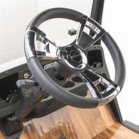
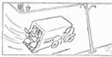
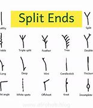
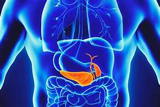

title:: Justice: What's the Right Thing to Do? 01

- This is a course about justice. We begin with a story.
	- > ▶  course [ C ] ~ (in/on sth) a series of lessons or lectures on a particular subject （有关某学科的系列）课程，讲座
- Suppose you're the driver of a trolley(n.) car
	- > ▶ trolley /ˈtrɑːli/   :  = tram /træm/ ( tram·car ) ( both BrE ) ( US [ "street·car", "trol·ley" ] ) a vehicle driven by electricity, that runs on rails along the streets of a town and carries passengers 有轨电车
	  => 来自苏格兰词 tram,一种在煤井矿道运煤的小推车，可能来自荷兰语方言 tram,木柱，车把手， 词源不详。后用于指有轨电车。
	  
- Your trolley car is hurtling(v.) down the track at 60 Mph.
	- > ▶ hurtle  /ˈhɜːrtl/  [ V + adv./prep. ] to move very fast in a particular direction （向某个方向）飞驰，猛冲
- At the end of the track, you notice five workers are working on the track.
- You try to stop, but you can't. your brakes(n.) don't work.
- You feel desperate, because you know /if you crash into these five workers /they will all die
- but to soon /you know that's for sure. so you feel helpless
- until you notice, there is /off to the right, a **side track**
	- > ▶ side track 旁轨, 侧线
	  
- at the end of that track
- There's a worker working on the track
- your steering wheel works(v.)
	- > ▶ steering (n.) the machinery in a vehicle that you use to control the direction it goes in （车辆等的）转向装置
	  
	- > ▶ steer (v.)to control the direction in which a boat, car, etc. moves 驾驶（船、汽车等）；掌控方向盘 
	  + /to take control of a situation and influence the way in which it develops 操纵；控制；引导
	  -> He managed to steer(v.) the conversation away from his divorce. 他设法把话题从他离婚一事上引开。
	- 你的方向盘还没有失灵
- so you can turn the trolley car, if you want to, onto the side track
- killing the one, but sparing the five
	- > ▶ spare (v.) [ usually passive ] ~ sb/sth (from sth) : ( formal ) to allow sb/sth to escape harm, damage or death, especially when others do not escape it 饶恕；赦免；放过；使逃脱
- Here's our first question? what's the right thing to do. what would you do?
- Let's take a poll.
	- 让我们来做一次投票
- How many would turn the trolley car /onto the side track. Raise your hands.
- How many wouldn't? How many would go straight ahead
- A handful of people would. A vast majority would turn
	- > ▶ handful (n.) [ sing. ] ~ (of sb/sth) : a small number of people or things 少数人（或物） /一把（的量）；用手抓起的数量
- Let's hear first. Now we need to begin to investigate the reasons /why you think is the right thing to do. Let's begin with those in the majority
- Who would turn /to go onto the side track
- Why would you do it? Would would be your reason?
- Who is willing to volunteer a reason?
- Because it cann't be right to kill five people /when you could only kill one person instead
- it wouldn't be right to kill five /if you could only kill one person instead
- That's a good reason
- Who else? Does anybody agree with that reason?
- I think it's the same reason on the 9/11
- we **regard** the people who flew the plane into Pennsylvania field **as** heros
- because they chose to kill the people on the plane, and not kill more people in the building
- So the principle there /is the same as 9/11 to tragic circumstance
	- > ▶ circumstance [ Cusually pl. ] the conditions and facts that are connected with and affect a situation, an event or an action 条件；环境；状况
- Better to kill one /so that five can live
- Is that the reason most of you have /those will turn?
- Let's hear now /from those in the minority, those wouldn't turn
- I think /that's the same type of mentality /that justify(v.) genocide and totalitarianism
	- > ▶ mentality (n.) the particular attitude or way /of thinking of a person or group 心态；思想状况；思想方法
	- > ▶ genocide (n.) [ U ] the murder of a whole race or group of people 种族灭绝；大屠杀
	- > ▶ totalitarianism   /toʊˌtæləˈteriənɪzəm/  N-UNCOUNT Totalitarianism is the ideas, principles, and practices of totalitarian political systems. 极权主义
	  => total,全部的，-itarian,缩写自 authoritarian,极权主义者。
- in order to save one type of race, you **wipe out** the other
- So what would you do /in this case?
- To avoid the horror of genocide
	- > ▶ horror (n.) [ U ] a feeling of great shock, fear or disgust 震惊；恐惧；厌恶
	  -> Her eyes were wide with horror. 她吓得目瞪口呆。 
	  + /the ~ of sth : the very unpleasant nature of sth, especially when it is shocking or frightening （某事物）令人厌恶的性质；（尤指）震惊性，恐怖性
- you would crash into the five and kill them
	- Presumedly yes
	  > ▶  presume V-T If you presume that something is the case, you think that it is the case, although you are not certain. 推测
	  ->  "Had he been home all week?"—"I presume so."   “他整个星期都在家吗？”—“我想是。”
- Ok. Who else? That's a brave answer. Thank you
- Let's consider another trolley car case
- and see whether those of you in the majority
- why would here to the principle, better one should die /so that five should live
	- 为什么在这种情况下，你的原则是牺牲一人来救活5人
- This time you're not the driver of the trolley car, you're an onlooker(n.)
	- onlooker (n.) a person who watches sth that is happening but is not involved in it 旁观者
- You're standing on a bridge, overlooking a trolley car track
- down the track /come the trolley car. At the end of the track are five workers.
- the brakes don't work
- the trolley car is about to careen(v.) into the five and kill them
	- > ▶ careen (v.) [ Vadv./prep. ] ( of a person or vehicle 人或车辆 ) to move forward very quickly /especially in a way that is dangerous or uncontrolled （尤指危险或失控地）猛冲，疾驶
	  
	  => 本义将船倾斜，将龙骨外露进行修补，来自拉丁词carina, 龙骨，词源同hard. 后受career影响，词义主要用于疾驰。
- and now you're not the driver
- you really feel helpless
- until you notice standing next to you
- leaning over the bridge is a very fat man
- and you could give him a shove
	- > ▶ shove (v.) to push sb/sth in a rough way 猛推；乱挤；推撞
	  -> The crowd was **pushing and shoving** to get a better view. 人们挤来挤去，想看得清楚点儿。
	  + /to put sth somewhere roughly or carelessly 乱放；随便放；胡乱丢；随手扔
	  => 来自 PIE skeubh, 推，挤，词源同 shovel,shuffle.可能相关于 PIE skek,摇动，晃动，词源同 shake,shock.
- he would fall over the bridge onto the track
- right in the way of the trolley car
- he would die but he would spare the five
- now how many would push the fat man over the bridge. Raise your hands
- How many wouldn't? Most people wouldn't
- Here's the obvious question
- **What became of** the principle?
	- > ▶ **WHAT BECAME, HAS BECOME, WILL BECOME OF SB/STH?**
	  used to ask what has happened or what will happen to sb/sth （遭遇）如何；（结果）怎么样
	  -> I dread to think /**what will become of them** /if they lose their home. 我不敢设想他们如果无家可归将会怎么样。
- Better to save five lives /even if it means to sacrifice one
- **What became of** the principle /that almost everyone endorse in the first case
	- > ▶ endorse (v.) to say publicly that you support a person, statement or course of action （公开）赞同，支持，认可 /（在支票背面）签名，背书
	  => en-, 进入，使。-dors, 背，见dorsal. 财务术语，即在背后签字。
	- 在第一种情况下, 大多数人选择杀掉旁路上的那1个工人, 来挽救列车上的5个人. 第二种情况下, 大多数人不会杀掉(从桥上推下去)1个人, 来挽救列车上的5人. 同样是拿1换5,  但在这两种环境下却行动不一致, 是相矛盾的, 为什么?
- I need to hear from someone /who's in the majority /in both cases
- How do you explain /the differences between the two
- The second one /I guess involves **an act of choice of** pushing the person down
- That person himself /would otherwise not have been involved in the situation /at all
	- 那个胖子原本不牵涉到这宗事故里
- To choose /on his behalf, I guess, **involve** him **in** something /that he otherwise would escape, I guess, is more than **in** what you have /in the first case /where the three parties, the driver, the two sets of workers /are already in the situation
	- > ▶ **ON BEHALF OF SB  | ON SB'S BEHALF**
	  (1) as the representative of sb or instead of them 代表（或代替）某人
	  -> On behalf of the department I would like to thank you all. 我谨代表本部门感谢大家。
- But the guy /working on the track off the side /he didn't choose to sacrifice his life any more **than** the fat man did, did he?
- That's true. But he's on the track
- This guy is on the bridge
- Go ahead. You can come back if you want.
- All right. It's a hard question. You did very well
- Who else can find a way of reconciling(v.) the reaction in the majority /in these two cases
	- > ▶ reconcile   /ˈrekənsaɪl/  (v.) ~ sth (with sth) : to find an acceptable way /of dealing with two or more ideas, needs, etc. that seem to be opposed to each other 使和谐一致；调和；使配合
	  + /~ sb/yourself (to sth): to make sb/yourself accept an unpleasant situation because it is not possible to change it 将就；妥协
	  =>  re-再 + con-共同 + cile召集,cile来源于拉丁语calare(宣布,召集) → 再召集在一起,使其言归于好。
- I guess, in the first case /we have the one worker and the five.
- It's choice /between those two. And you've to make certain choice.
- people are gonna die /because of the trolley car, not necessarily because of your direct action.
- the trolley car is run away /and then you're making a **split second** choice.
	- > ▶  **split second** : a very short moment of time 瞬间；刹那
	  ->  Their eyes met /for a split second . 在一刹那间，他们的目光交汇在了一起。
	- > ▶ split (n.)(v.)  ~ (between A and B) |~ (with sb/sth):  a disagreement that divides a group of people or makes sb separate from sb else 分歧；分裂；分离
	  -> a damaging split /within the party leadership 党的领导层内部不利的分歧现象
	  + /a long crack or hole made when sth tears 裂缝；裂口
	  + (v.) ~ (sth) (into sth) to divide, or to make sth divide, into two or more parts 分开，使分开（成为几个部分）
	  
- whereas **pushing** the fat man **over** /is an actualized murder /on your part
	- > ▶ whereas  : used to compare or contrast two facts （用以比较或对比两个事实）然而，但是，尽管
	- > ▶ actualized  现行的 /实现，实施（actualize 的过去式和过去分词）
	- > ▶ **on the part of sb | on sb's part** : made or done by sb 由某人所为
	  -> It was an error on my part. 那是我的过失。
- you've **control(v.) over** that /whereas you may not control over the trolley car.
	- 我认为, 在第一个案例中, 是个二选一的问题. 你必须做出明确的选择. 即必定会有人因为刹车失灵的电车而牺牲掉, 这和你选择做什么(直接行为), 没有必然联系. 电车是不会停的, 你需要在一瞬间做出判断. 而在第二个案例中, 你推那个胖子下去, 则是因你的主观行为造成的谋杀, 而你对你的行动, 是可以做出控制的. 但你对电车是无能为力的. 所以我认为这两个是有着细微差别的情景.
- so I think /it's slightly different situation.
-
- All right. Who has a reply? That's good. Who want to reply? Is there a way out of this?
	- > ▶ Is there a way out of difficulty? 有摆脱困境的办法吗?
	-
- I don't think that's a very good reason. because you choose to... either way you have to choose
- who dies because you either choose to turn and kill the person,
- which is an act of conscious thought to turn,
- or you choose to push the fat man over
- which is also an active, conscious action.
	- > ▶ conscious (a.) able to use your senses and mental powers to understand what is happening 神志清醒的；有知觉的；有意识的
	  + /[ not before noun ] ~ of (doing) sth |~ that : aware of sth; noticing sth 意识到；注意到
- So either way, you're making a choice.
-
- Do you want to reply?
-
- I'm not really sure that that's the case. It just still seems kind of different.
- The act of actually pushing someone over onto the tracks /and killing him, you are actually killing him yourself. You're pushing him with your own hands.
- You're pushing him /and that's different than steering(v.) something /that is going to cause death into another...
- You know, it doesn't really sound right /saying it now.
	- 现在说起来可能听着不那么对
- No, no. It's good. It's good. What's your name?
- Andrew.
- Andrew. Let me ask you this question, Andrew.
- Yes.
- Suppose standing on the bridge next to the fat man, I didn't have to push him, suppose he was standing over a trap door /that I could open /by turning a steering wheel like that. Would you turn?
	- > ▶ trap   （捕捉动物的）陷阱，罗网，夹，捕捉器
- For some reason, that still just seems more wrong.
- Right?
- I mean, maybe if you accidentally like leaned into the steering wheel /or something like that.
- But... Or say that /the car is hurtling towards a switch /that will drop the trap. Then I could agree with that.
	- > ▶ drop  (v.) to fall or allow sth to fall by accident （意外地）落下，掉下，使落下 /（故意）降下，使降落，使落下
	- 或者说, 那辆车在急速驶向一个能打开这个盖子的开关, 那样我会赞成牺牲胖子
- That's all right. Fair enough.
	- > ▶ fair (a.) ~ (to/on sb) : acceptable and appropriate in a particular situation 合理的；恰当的；适当的
	  -> To be fair , she behaved better than we expected. 说句公道话，她表现得比我们预期的要好。
	  + /~ (to sb) : treating everyone equally and according to the rules or law （按法律、规定）平等待人的，秉公办事的，公正的
- It still seems wrong in a way /that it doesn't seem wrong
	- 它只是在某种程度上看起来是错的，而不是真的错的
- in the first case to turn, you say.
- And in another way, I mean, in the first situation, you're involved directly with the situation. In the second one, you're an onlooker as well.
- All right.
- So you have the choice of becoming involved or not /by pushing the fat man.
- All right. Let's **forget** for the moment **about** this case.
- That's good. Let's imagine a different case.
- This time you're a doctor in an emergency room
- and six patients come to you.
	- 来了六个病号
- They've been in a terrible trolley car wreck.
	- > ▶ wreck : a car, plane, etc. that has been very badly damaged in an accident （事故中）遭严重毁坏的汽车（或飞机等）
- Five of them sustain moderate injuries, one is severely injured, you could spend all day /caring for the one severely injured victim. But in that time, the five would die.
	- 5死换1活
- Or you could look after the five, restore them to health /but during that time, the one severely injured person would die.
	- 1死换5活
- How many would save the five? Now as the doctor,
- how many would save the one?
- Very few people, just a handful of people.
- Same reason, I assume. One life versus five?
-
- Now consider another doctor case.
- This time, you're a transplant surgeon and you have five patients, each in desperate need of an organ transplant /in order to survive.
	- > ▶ transplant (v.)(n.) ~ sth (from sb/sth) (into sb/sth): to take an organ, skin, etc. from one person, animal, part of the body, etc. and put it into or onto another 移植（器官、皮肤等）
	- > ▶  desperate (a.) feeling or showing that you have little hope and are ready to do anything without worrying about danger to yourself or others （因绝望而）不惜冒险的，不顾一切的，拼命的 
	  + /~ (for sth)~ (to do sth) needing or wanting sth very much 非常需要；极想；渴望
- One needs a heart, one a lung, one a kidney, one a liver, and the fifth a pancreas.
	- > ▶ liver 肝脏
	- > ▶ pancreas : an organ near the stomach that produces insulin and a liquid that helps the body to digest food 胰；胰腺
	  => pan-,全部，所有，-kreas,肉，生肉，词源同raw,crude.因胰腺全部由肉组成而得名。
	  
- And you have no organ donors. You are about to see them die.
- And then it occurs to you that in the next room
- there's a healthy guy who came in for a check-up.
- And he's – you like that – and he's taking a nap,
	- > ▶ nap （日间的）小睡，打盹
- you could go in very quietly, yank out the five organs,
	- > ▶ yank (v.) [ usually + adv./prep. ] ( informal ) to pull sth/sb hard, quickly and suddenly 猛拉；猛拽
	  ->  Liz yanked at my arm. 利兹猛地拉了一下我的胳膊。
- that person would die, but you could save the five.
- How many would do it? Anyone? How many?
- Put your hands up /if you would do it.
- Anyone in the balcony?
	- > ▶ balcony 阳台 /（剧院的）楼厅，楼座
- I would.
- You would? Be careful, don't lean over too much.
- How many wouldn't? All right. What do you say?
- Speak up in the balcony,
- you who would yank out the organs. Why?
- I'd actually like to explore(v.) /a slightly alternate possibility of just taking the one of the five /who needs an organ /who dies first /and using their four healthy organs to save the other four.
	- 其实我想探索一下其他的替代方案. 在五个需要器官移植的人中, 谁第一个死了 就用他剩下的那4个健康器官, 去救其他四个人.
- That's a pretty good idea. That's a great idea
- **except for the fact that** you just wrecked the philosophical point.
	- > ▶ point : ( usually the point ) [ C ] the main or most important idea in sth that is said or done 重点；要点；核心问题
	- 只是你刚刚破坏了我们正在讨论的哲学问题 (即改换了要讨论的问题, 替换成了另一个问题)
- Let's step back /from these stories and these arguments
- to notice a couple of things about the way /the arguments have begun to unfold.
- > ▶ couple  [ sing.+sing./pl.v. ] ~ (of sth) a small number of people or things 几个人；几件事物 SYN a few
  -> a couple of minutes 几分钟
- Certain moral principles /have already begun to emerge /from the discussions we've had.
	- 某种道德原则, 在我们之前的对话中逐渐显现出来
- And let's consider /what those moral principles look like.
- The first moral principle /that emerged in the discussion /said `主` the right thing to do, the moral thing to do /`谓` depends on the consequences /that will result from your action.
- **At the end of the day**, better /that five should live /even if one must die.
	- > ▶  At the end of the day 最终；到头来；不管怎么说 (注意: 这个短语的含义不是指“在一天结束的时候”)
- Consequentialist moral reasoning /**locates**(v.) morality **in** the consequences of an act, in the state of the world /that will result from the thing you do.
	- > ▶ Consequentialist  结果主义, 后果论者
	- 在结果主义道德伦理中, 他们认为, 做某件事道德与否, 取决于行为的结果 , 取决于你所做事情的后果
- But then we went a little further, we considered those other cases
- and people weren't so sure about **consequentialist moral reasoning**.
	- 进一步 我们考虑了另一些案例, 在这种情况下, 人们无法确信"结果主义道德伦理"正确与否.
- When people hesitated /to push the fat man over the bridge /or to yank out the organs of the innocent patient, people gestured(v.) toward reasons /**having to do with** the intrinsic quality of the act itself, consequences be what they may. People were reluctant.
	- > ▶ gesture (v.) ~ (for/to sb) (to do sth) :to move your hands, head, face, etc. as a way of expressing what you mean or want 做手势；用手势表示；用动作示意
	  -> She gestured for them to come in. 她示意让他们进来。
	- > ▶ have to do with v.与…有关；干；相干
	  -> What does this have to do with me ? 这和我又有什么关系？
	- > ▶ intrinsic (a.) ~ (to sth) belonging to or part of the real nature of sth/sb 固有的；内在的；本身的
	- 他们会考虑这个行为本身的原因, 而非行为导致的结果. (人们指向了与行为本身的"内在性"有关的原因，以及可能的后果。)
- People thought it was just wrong, categorically wrong,
- to kill a person, an innocent person,
- even for the sake of saving five lives.
- At least people thought that in the second version
- of each story we considered.
- So this points to a second categorical way of thinking about moral reasoning.
- Categorical moral reasoning locates morality
- in certain absolute moral requirements,
- certain categorical duties and rights, regardless of the consequences.
- We're going to explore in the days and weeks to come
- the contrast between consequentialist and categorical
- moral principles.
- The most influential example of consequential moral reasoning
- is utilitarianism, a doctrine invented
- by Jeremy Bentham, the 18th century
- English political philosopher.
- The most important philosopher of categorical moral reasoning
- is the 18th century German philosopher Immanuel Kant.
- So we will look at those two different modes
- of moral reasoning, assess them,
- and also consider others.
- If you look at the syllabus, you'll notice that we read
- a number of great and famous books,
- books by Aristotle, John Locke, Immanuel Kant, John Stewart Mill,
- and others.
- You'll notice too from the syllabus
- that we don't only read these books
- we also take up contemporary political, and legal controversies
- that raise philosophical questions. We will debate equality and inequality,
- affirmative action, free speech versus hate speech, same sex marriage,
- military conscription, a range of practical questions. Why?
- Not just to enliven these abstract and distant books
- but to make clear, to bring out what's at stake
- in our everyday lives, including our political lives,
- for philosophy.
- And so we will read these books and we will debate these issues,
- and we'll see how each informs and illuminates the other.
- This may sound appealing enough, but here I have to issue a warning.
- And the warning is this, to read these books
- in this way as an exercise in self knowledge,
- to read them in this way carries certain risks,
- risks that are both personal and political,
- risks that every student of political philosophy has known.
- These risks spring from the fact that philosophy teaches us
- and unsettles us by confronting us with
- what we already know.
- There's an irony. The difficulty of this course consists in the fact
- that it teaches what you already know.
- It works by taking what we know from familiar unquestioned settings
- and making it strange.
- That's how those examples worked, the hypotheticals with which we began,
- with their mix of playfulness and sobriety.
- It's also how these philosophical books work.
- Philosophy estranges us from the familiar,
- not by supplying new information but by inviting and provoking
- a new way of seeing but, and here's the risk,
- once the familiar turns strange, it's never quite the same again.
- Self knowledge is like lost innocence, however unsettling you find it
- it can never be un-thought or un-known.
- What makes this enterprise difficult but also riveting
- is that moral and political philosophy is a story and you don't know
- where the story will lead.
- But what you do know is that the story is about you.
- Those are the personal risks. Now what of the political risks?
- One way of introducing a course like this would be to promise you
- that by reading these books and debating these issues,
- you will become a better, more responsible citizen
- you will examine the presuppositions of public policy,
- you will hone your political judgment,
- you will become a more effective participant in public affairs.
- But this would be a partial and misleading promise.
- Political philosophy, for the most part,
- hasn't worked that way.
- You have to allow for the possibility that political philosophy
- may make you a worse citizen rather than a better one
- or at least a worse citizen before it makes you a better one,
- and that's because philosophy is a distancing,
- even debilitating activity.
- And you see this going back to Socrates, there's a dialogue,
- the Gorgias, in which one of Socrates' friends, Callicles,
- tries to talk him out of philosophizing.
- Callicles tells Socrates "Philosophy is a pretty toy
- if one indulges in it with moderation
- at the right time of life. But if one pursues it further than one should,
- it is absolute ruin."
- "Take my advice," Callicles says, "abandon argument.
- Learn the accomplishments of active life,
- take for your models not those people who spend
- their time on these petty quibbles but those who have a good livelihood
- and reputation and many other blessings."
- So Callicles is really saying to Socrates "Quit philosophizing, get real,
- go to business school."
- And Callicles did have a point. He had a point because philosophy
- distances us from conventions, from established assumptions,
- and from settled beliefs.
- Those are the risks, personal and political.
- And in the face of these risks,
- there is a characteristic evasion.
- The name of the evasion is skepticism, it's the idea...
- well, it goes something like this... we didn't resolve once and for all
- either the cases or the principles we were arguing when we began
- and if Aristotle and Locke and Kant and Mill
- haven't solved these questions after all of these years,
- who are we to think, that we here in Sanders Theatre,
- over the course of a semester, can resolve them?
- And so, maybe it's just a matter of each person having his or her own
- principles and there's nothing more to be said about it,
- no way of reasoning.
- That's the evasion, the evasion of skepticism,
- to which I would offer the following reply.
- It's true, these questions have been debated for a very long time
- but the very fact that they have recurred and persisted
- may suggest that though they're impossible in one sense,
- they're unavoidable in another.
- And the reason they're unavoidable, the reason they're inescapable
- is that we live some answer to these questions every day.
- So skepticism, just throwing up your hands and giving up on moral reflection
- is no solution.
- Immanuel Kant described very well the problem with skepticism
- when he wrote "Skepticism is a resting place
- for human reason, where it can reflect upon
- its dogmatic wanderings, but it is no dwelling place
- for permanent settlement."
- "Simply to acquiesce in skepticism," Kant wrote,
- "can never suffice to overcome the restlessness of reason."
- I've tried to suggest through these stories
- and these arguments some sense of the risks
- and temptations, of the perils and the possibilities.
- I would simply conclude by saying that the aim of this course
- is to awaken the restlessness of reason and to see where it might lead.
- Thank you very much.
- Like, in a situation that desperate, you have to do what you have to do to survive.
- You have to do what you have to do?
- Yeah. You got to do what you got to do, pretty much.
- If you've been going 19 days without any food, you know,
- someone just has to take the sacrifice.
- Someone has to make the sacrifice and people can survive.
- Alright, that's good. What's your name?
- - Marcus.  - Marcus, what do you say to Marcus?
- Last time, we started out last time
- with some stories, with some moral dilemmas
- about trolley cars and about doctors
- and healthy patients vulnerable to being victims
- of organ transplantation.
- We noticed two things about the arguments we had,
- one had to do with the way we were arguing.
- We began with our judgments in particular cases.
- We tried to articulate the reasons or the principles lying behind
- our judgments.
- And then confronted with a new case,
- we found ourselves reexamining those principles,
- revising each in the light of the other.
- And we noticed the built in pressure
- to try to bring into alignment our judgments
- about particular cases and the principles
- we would endorse on reflection.
- We also noticed something about the substance
- of the arguments that emerged from the discussion.
- We noticed that sometimes we were tempted to locate
- the morality of an act in the consequences, in the results,
- in the state of the world that it brought about.
- And we called this consequentialist moral reasoning.
- But we also noticed that in some cases,
- we weren't swayed only by the result.
- Sometimes, many of us felt, that not just consequences
- but also the intrinsic quality or character
- of the act matters morally.
- Some people argued that there are certain things
- that are just categorically wrong even if they bring about
- a good result, even if they saved five people
- at the cost of one life.
- So we contrasted consequentialist moral principles with categorical ones.
- Today and in the next few days, we will begin to examine
- one of the most influential versions of consequentialist moral theory.
- And that's the philosophy of utilitarianism.
- Jeremy Bentham, the 18th century
- English political philosopher gave first the first clear
- systematic expression to the utilitarian moral theory.
- And Bentham's idea, his essential idea,
- is a very simple one.
- With a lot of morally intuitive appeal,
- Bentham's idea is the following,
- the right thing to do, the just thing to do
- is to maximize utility.
- What did he mean by utility?
- He meant by utility the balance of pleasure over pain,
- happiness over suffering.
- Here's how he arrived at the principle of maximizing utility.
- He started out by observing that all of us,
- all human beings are governed by two sovereign masters,
- pain and pleasure.
- We human beings like pleasure and dislike pain.
- And so we should base morality, whether we're thinking about
- what to do in our own lives or whether as legislators or citizens,
- we're thinking about what the laws should be.
- The right thing to do individually or collectively is to maximize,
- act in a way that maximizes the overall level of happiness.
- Bentham's utilitarianism is sometimes summed up
- with the slogan
- "The greatest good for the greatest number."
- With this basic principle of utility on hand,
- let's begin to test it and to examine it
- by turning to another case, another story, but this time,
- not a hypothetical story, a real life story,
- the case of the Queen versus Dudley and Stevens.
- This was a 19th century British law case
- that's famous and much debated in law schools.
- Here's what happened in the case. I'll summarize the story
- then I want to hear how you would rule,
- imagining that you were the jury.
- A newspaper account of the time described the background.
- A sadder story of disaster at sea was never told
- than that of the survivors of the yacht, Mignonette.
- The ship floundered in the South Atlantic,
- 1300 miles from the Cape.
- There were four in the crew, Dudley was the captain,
- Stevens was the first mate, Brooks was a sailor,
- all men of excellent character or so the newspaper account tells us.
- The fourth crew member was the cabin boy,
- Richard Parker, 17 years old.
- He was an orphan, he had no family,
- and he was on his first long voyage at sea.
- He went, the news account tells us,
- rather against the advice of his friends.
- He went in the hopefulness of youthful ambition,
- thinking the journey would make a man of him.
- Sadly, it was not to be. The facts of the case
- were not in dispute.
- A wave hit the ship and the Mignonette went down.
- The four crew members escaped to a lifeboat.
- The only food they had were two cans of
- preserved turnips, no fresh water.
- For the first three days, they ate nothing.
- On the fourth day, they opened one
- of the cans of turnips and ate it.
- The next day they caught a turtle.
- Together with the other can of turnips,
- the turtle enabled them to subsist for the next few days.
- And then for eight days, they had nothing.
- No food. No water.
- Imagine yourself in a situation like that,
- what would you do? Here's what they did.
- By now the cabin boy, Parker, is lying at the bottom
- of the lifeboat in the corner
- because he had drunk seawater against the advice of the others
- and he had become ill and he appeared to be dying.
- So on the 19th day, Dudley, the captain,
- suggested that they should all have a lottery,
- that they should draw lots to see who would die
- to save the rest.
- Brooks refused. He didn't like the lottery idea.
- We don't know whether this was
- because he didn't want to take the chance
- or because he believed in categorical moral principles.
- But in any case, no lots were drawn.
- The next day there was still no ship in sight
- so Dudley told Brooks to avert his gaze
- and he motioned to Stevens that the boy, Parker,
- had better be killed.
- Dudley offered a prayer, he told the boy his time had come,
- and he killed him with a pen knife,
- stabbing him in the jugular vein.
- Brooks emerged from his conscientious objection
- to share in the gruesome bounty.
- For four days, the three of them fed
- on the body and blood of the cabin boy.
- True story. And then they were rescued.
- Dudley describes their rescue in his diary with staggering euphemism.
- "On the 24th day, as we were having our breakfast,
- a ship appeared at last."
- The three survivors were picked up by a German ship.
- They were taken back to Falmouth in England
- where they were arrested and tried.
- Brooks turned state's witness. Dudley and Stevens went to trial.
- They didn't dispute the facts. They claimed they had
- acted out of necessity, that was their defense.
- They argued in effect better that one should die
- so that three could survive. The prosecutor wasn't swayed
- by that argument.
- He said murder is murder, and so the case went to trial.
- Now imagine you are the jury. And just to simplify the discussion,
- put aside the question of law, let's assume that you as the jury
- are charged with deciding whether what they did
- was morally permissible or not.
- How many would vote 'not guilty',
- that what they did was morally permissible?
- And how many would vote 'guilty',
- what they did was morally wrong?
- A pretty sizeable majority.
- Now let's see what people's reasons are and let me begin with those
- who are in the minority.
- Let's hear first from the defense of Dudley and Stevens.
- Why would you morally exonerate them?
- What are your reasons? Yes.
- I think it's... I think it is morally reprehensible
- but I think that there is a distinction
- between what's morally reprehensible and what makes someone
- legally accountable.
- In other words, as the judge said,
- what's always moral isn't necessarily against the law
- and while I don't think that necessity justifies theft
- or murder or any illegal act, at some point your degree
- of necessity does, in fact, exonerate you from any guilt.
- Okay. Good. Other defenders. Other voices for the defense.
- Moral justifications for what they did. Yes.
- Thank you. I just feel like
- in the situation that desperate, you have to do
- what you have to do to survive.
- You have to do what you have to do.
- Yeah, you've got to do what you've got to do.
- Pretty much. If you've been going
- 19 days without any food, you know, someone just has to take the sacrifice,
- someone has to make the sacrifice and people can survive.
- And furthermore from that, let's say they survive
- and then they become productive members of society
- who go home and start like a million charity organizations
- and this and that and this and that.
- - I mean they benefited everybody in the end.  - Yeah.
- So, I mean I don't know what they did afterwards,
- they might have gone and like, I don't know,
- - killed more people, I don't know. Whatever but.  - What?
- Maybe they were assassins.
- What if they went home and they turned out to be assassins?
- What if they'd gone home and turned out to be assassins? Well...
- You'd want to know who they assassinated.
- That's true too. That's fair. That's fair. I would want to know
- who they assassinated.
- All right. That's good. What's your name?
- - Marcus.  - Marcus. All right.
- We've heard a defense, a couple of voices
- for the defense.
- Now we need to hear from the prosecution.
- Most people think what they did was wrong. Why?
- - Yes.  - One of the first things that I was thinking was
- they haven't been eating for a really long time
- maybe they... they're... they're mentally like affected and so
- then that could be used as a defense,
- a possible argument that they weren't
- in the proper state of mind, they weren't making decisions
- they might otherwise be making.
- And if that's an appealing argument that... that you have to be
- in an altered mindset to do something like that,
- it suggests that people who find that argument convincing
- do think that they were acting immorally.
- But what do you... I want to know
- what you think. You defend them.
- - No, no, no.  - I'm sorry, you vote to convict, right?
- Yeah, I don't think that they acted in a morally
- appropriate way.
- And why not? What do you say,
- here's Marcus, he just defended them.
- He said... you heard what he said.
- Yes.
- Yes.
- That you've got to do what you've got to do
- - in a case like that. What do you say to Marcus?  - Yeah.
- That there's no situation that would allow
- human beings to take the idea of fate or
- the other people's lives in their own hands,
- that we don't have that kind of power.
- Good. Okay. Thank you.
- And what's your name?
- Britt.
- - Britt. Okay. Who else? What do you say? Stand up.  - Yes.
- I'm wondering if Dudley and Stevens had asked Richard Parker's... for Richard Parker's
- consent in you know, dying, if that would exonerate them
- from... from an act of murder and if so,
- is that still morally justifiable?
- That's interesting. All right. Consent.
- Wait wait, hang on. What's your name?
- Kathleen.
- Kathleen says suppose they had that,
- what would that scenario look like?
- So in the story Dudley is there, pen knife in hand,
- but instead of the prayer or before the prayer,
- he says "Parker, would you mind?"
- "We're desperately hungry",
- as Marcus empathizes with, "we're... we're desperately hungry.
- - You're not going to last long anyhow."  -Yeah. You can be a martyr.
- "Would you be a martyr? How about it Parker?"
- Then, then, what do... what do you think? Would it be morally justified then?
- - I don't think...  - Suppose... suppose Parker in his semi-stupor says "Okay."
- I don't think it would be morally justifiable but I'm wondering if...
- - Even then, even then it wouldn't be?  - No.
- You don't think that even with consent
- it would be morally justified?
- Are there people who think, uh, who want to take up
- Kathleen's consent idea and who think that
- that would make it morally justified?
- Raise your hand if it would, if you think it would.
- That's very interesting. Why would consent
- make a moral difference? Why would it? Yes.
- Well, I just think that if he was making
- his own original idea and it was his idea
- to start with, then that would be
- the only situation in which I would see it
- being appropriate in any way because that way
- you couldn't make the argument that he was pressured,
- you know it's three-to-one or whatever the ratio was.
- - Right.  - And I think that if he was making a decision
- to give his life and he took on the agency
- to sacrifice himself which some people
- might see as admirable and other people might disagree
- with that decision.
- So if he came up with the idea,
- that's the only kind of consent we could have
- confidence in morally then it would be okay.
- Otherwise, it would be kind of coerced consent
- under the circumstances, you think.
- Is there anyone who thinks that even the consent of Parker
- would not justify their killing him? Who thinks that? Yes.
- Tell us why. Stand up.
- I think that Parker would be killed with the hope
- that the other crew members would be rescued so there's no
- definite reason that he should be killed
- because you don't know when they're going to get rescued
- so if you kill him, it's killing him in vain,
- do you keep killing a crew member until you're rescued
- and then you're left with no one because someone's going
- to die eventually?
- Well, the moral logic of the situation seems to be that,
- that they would keep on picking off the weakest maybe,
- one by one, until they were rescued.
- And in this case, luckily, they were rescued when three at least
- were still alive. Now, if Parker did give his consent,
- would it be all right, do you think or not?
- - No, it still wouldn't be right.  - And tell us why
- it wouldn't be all right.
- First of all, cannibalism, I believe, is morally incorrect
- so you shouldn't be eating human anyway.
- So cannibalism is morally objectionable as such so then,
- even on the scenario of waiting until someone died,
- still it would be objectionable.
- Yes, to me personally, I feel like it all depends
- on one's personal morals and like we can't sit here and just,
- like this is just my opinion, of course other people
- are going to disagree, but...
- Well we'll see, let's see what their disagreements are
- and then we'll see if they have reasons that can
- persuade you or not.
- Let's try that. All right.
- Now, is there someone who can explain,
- those of you who are tempted by consent,
- can you explain why consent makes such
- a moral difference?
- What about the lottery idea? Does that count as consent?
- Remember at the beginning, Dudley proposed a lottery,
- suppose that they had agreed to a lottery,
- then how many would then say it was all right?
- Suppose there were a lottery, cabin boy lost,
- and the rest of the story unfolded, then how many people would say
- it was morally permissible?
- So the numbers are rising if we had a lottery.
- Let's hear from one of you for whom the lottery
- would make a moral difference. Why would it?
- I think the essential element, in my mind,
- that makes it a crime is the idea that they decided
- at some point that their lives were more important than his,
- and that, I mean, that's kind of the basis for really any crime.
- Right? It's like my needs, my desires are more important
- than yours and mine take precedent.
- And if they had done a lottery where everyone consented
- that someone should die and it's sort of like they're all
- sacrificing themselves to save the rest.
- Then it would be all right?
- - A little grotesque but...  - But morally permissible?
- - Yes.  - And what's your name?
- - Matt.  - So Matt, for you,
- what bothers you is not the cannibalism
- but the lack of due process.
- I guess you could say that.
- Right? And can someone who agrees with Matt say a little bit more
- about why a lottery would make it, in your view, morally permissible.
- Go ahead.
- The way I understood it originally was that
- that was the whole issue is that the cabin boy
- was never consulted about whether or not
- something was going to happen to him,
- even with the original lottery whether or not
- he would be a part of that, it was just decided
- that he was the one that was going to die.
- Right, that's what happened in the actual case.
- Right.
- But if there were a lottery and they'd all agreed to the procedure,
- you think that would be okay?
- Right, because then everyone knows that there's going to be a death,
- whereas the cabin boy didn't know that this discussion was even happening,
- there was no forewarning for him to know that
- "Hey, I may be the one that's dying."
- All right. Now, suppose everyone agrees
- to the lottery, they have the lottery, the cabin boy loses,
- and he changes his mind.
- You've already decided, it's like a verbal contract.
- You can't go back on that, you've decided,
- the decision was made.
- If you know that you're dying for the reason of others to live.
- If someone else had died, you know that you would
- consume them so...
- Right. But then you could say, "I know, but I lost".
- I just think that that's the whole moral issue
- is that there was no consulting of the cabin boy
- and that's what makes it the most horrible
- is that he had no idea what was even going on.
- That had he known what was going on,
- it would be a bit more understandable.
- All right. Good. Now I want to hear...
- so there are some who think it's morally permissible
- but only about 20%, led by Marcus.
- Then there are some who say the real problem here
- is the lack of consent, whether the lack of consent
- to a lottery, to a fair procedure or, Kathleen's idea,
- lack of consent at the moment of death.
- And if we add consent, then more people are willing
- to consider the sacrifice morally justified.
- I want to hear now, finally, from those of you
- who think even with consent, even with a lottery,
- even with a final murmur of consent by Parker,
- at the very last moment, it would still be wrong.
- And why would it be wrong? That's what I want to hear. Yes.
- Well, the whole time I've been leaning off towards
- the categorical moral reasoning and I think that there's a possibility
- I'd be okay with the idea of a lottery
- and then the loser taking into their own hands to kill themselves
- so there wouldn't be an act of murder,
- but I still think that even that way, it's coerced.
- Also, I don't think that there is any remorse,
- like in Dudley's diary, "We're eating our breakfast,'
- it seems as though he's just sort of like, you know,
- the whole idea of not valuing someone else's life.
- So that makes me feel like I have to take the...
- You want to throw the book at him when he lacks remorse
- or a sense of having done anything wrong.
- Right.
- So, all right. Good. Are there any other defenders
- who say it's just categorically wrong, with or without consent?
- Yes. Stand up. Why?
- I think undoubtedly the way our society is shaped
- murder is murder.
- Murder is murder in every way
- and our society looks at murder down on the same light
- and I don't think it's any different in any case.
- Good. Let me ask you a question. There were three lives at stake versus one.
- Okay.
- The one, the cabin boy, he had no family,
- he had no dependents, these other three had families
- back home in England, they had dependents,
- they had wives and children. Think back to Bentham.
- Bentham says we have to consider
- the welfare, the utility, the happiness of everybody.
- We have to add it all up so it's not just numbers,
- three against one, it's also all of those
- people at home.
- In fact, the London newspaper at that time and popular opinion
- sympathized with them, Dudley and Stevens,
- and the paper said if they weren't motivated
- by affection and concern for their loved ones at home
- and their dependents, surely they wouldn't have done this.
- Yeah and how is that any different
- from people on a corner trying, with the same desire
- to feed their family. I don't think it's any different.
- I think in any case, if I'm murdering you
- to advance my status, that's murder,
- and I think that we should look at all that
- in the same light instead of criminalizing
- certain activities and making certain things
- seem more violently savage when in the same case,
- it's all the same, it's all the same act and mentality that goes
- into murder, necessity to feed your family so...
- Suppose it weren't three, suppose it were 30? 300?
- One life to save 300? Or in wartime? 3000?
- Suppose the stakes are even bigger.
- Suppose the stakes are even bigger?
- I think it's still the same deal.
- You think Bentham is wrong to say the right thing to do
- is to add up the collective happiness?
- You think he's wrong about that?
- I don't think he's wrong but I think murder is murder
- in any case.
- Well, then Bentham has to be wrong.
- If you're right, he's wrong.
- Okay, then he's wrong. I'm right.
- All right. Thank you. Well done. All right.
- Let's step back from this discussion and notice how many objections
- have we heard to what they did?
- We heard some defenses of what they did.
- The defenses had to do with necessity, their dire circumstance and,
- implicitly at least, the idea that numbers matter.
- And not only numbers matter but the wider effects matter,
- their families back home, their dependents.
- Parker was an orphan, no one would miss him.
- So if you add up, if you try to calculate the balance
- of happiness and suffering, you might have a case
- for saying what they did was the right thing.
- Then we heard at least three different types of objections.
- We heard an objection that said what they did
- was categorically wrong, like here at the end,
- categorically wrong, murder is murder,
- it's always wrong even if it increases the overall
- happiness of society, a categorical objection.
- But we still need to investigate why murder is categorically wrong.
- Is it because even cabin boys have certain fundamental rights?
- And if that's the reason, where do those rights come from
- if not from some idea of the larger welfare
- or utility or happiness?
- Question number one. Others said a lottery
- would make a difference, a fair procedure Matt said,
- and some people were swayed by that.
- That's not a categorical objection exactly.
- It's saying everybody has to be counted as an equal
- even though at the end of the day, one can be sacrificed
- for the general welfare.
- That leaves us with another question to investigate.
- Why does agreement to a certain procedure,
- even a fair procedure, justify whatever result flows
- from the operation of that procedure?
- Question number two. And question number three,
- the basic idea of consent. Kathleen got us on to this.
- If the cabin boy had agreed himself, and not under duress, as was added,
- then it would be all right to take his life to save the rest
- and even more people signed on to that idea.
- But that raises a third philosophical question:
- What is the moral work that consent does?
- Why does an act of consent make such a moral difference,
- that an act that would be wrong,
- taking a life without consent, is morally permissible with consent?
- To investigate those three questions, we're going to have to read
- some philosophers.
- And starting next time, we're going to read Bentham
- and John Stuart Mill, utilitarian philosophers.
- Don't miss the chance to interact online
- with other viewers of Justice. Join the conversation,
- take a pop quiz, watch lectures you've missed
- and learn a lot more. Visit JusticeHarvard.org.
- it's the right thing to do.
- Funding for this program is provided by...
- Additional funding provided by...