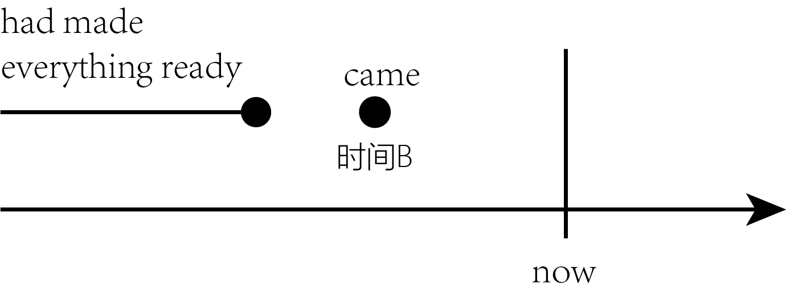

title:: “单一事件(短暂动作)”在过去时间B之前已经结束 → 但对时间B有后果影响 : had done

- 表示: 一个动作(通常是短暂动作)或状态, 在过去的某一时间B之前已经开始，并在B之前即告结束，而没有持续到B时刻。用 had done
  background-color:: #264c9b
-
	- She **had made everything ready** before I **came**.
	  在我来之前，她已经把一切都准备好了。
	  -> made的动作在came之前已经完成，故用" had done " had made。
	  {:height 108, :width 334}
	- Her baby **had fallen asleep** when she **went into the room**.
	  fall的动作在went之前已经完成，故用 had done.
	- I **had just poured myself a cup of tea** when the phone rang. When I came back from answering it, the cup **was empty**. Somebody **had drunk the tea** or **thrown it away**.
	  我刚刚给自己倒了一杯茶，这时电话铃响了。于是我去接电话，接完电话回来的时候，发现杯子空了。有人已经把茶喝了或者是倒掉了。
	  → 在过去的动作rang之前, pour的动作已经完成，故用" had done " had poured。
	  → 在过去的状态was empty之前, drink和throw的动作已经完成，故两者都用" had done " had drunk 和（had）thrown。
	-