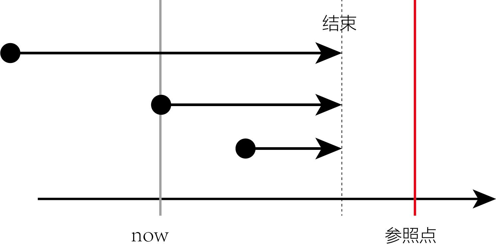

-
- 事件在将来时间B之前已经结束, 但对时间B有后果影响
- 表示在将来某一时刻B 之前开始的动作，到B之前, 已经完成。
- {:height 160, :width 362}
-
	- We **will have finished our exam** by the end of **next week**. 到下个周末为止，我们就将完成考试了。
	- I will graduate in July. I will see you in September. **By the time I see you, I will have graduated**. 到我见到你的时候，我将已经毕业了。
	- **By the year 2050**, scientists probably **will have discovered** a cure for cancer. 到2050年时，科学家们可能就会找到治愈癌症的方法。
	-