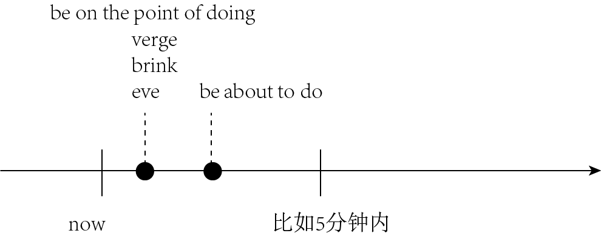

title:: 将来 + 眼前立马就要发生 ← 1.be on the point/verge/brink/eve of doing; 2.be about to do

- 即将发生的动作（比如通常在5分钟之内就会发生）
- {:height 205, :width 498}
-
-
- be about to do 即将
  background-color:: #264c9b
  ← 用来==表示即将发生的动作（比如通常在5分钟之内就会发生），意思是“正要，马上就要”。==
	- The train **is about to leave**. 火车马上就要开了。
	- Sally has her hand on the doorknob. She **is about to open the door**. 萨莉握住门把手，正要开门。
	-
- be on the point/verge/brink/eve of doing 眨眼间就要
  background-color:: #264c9b
  ← 这一结构与be about to do的意思差不多，但==其动作发生的时间比 be about to do 还要快一些。==
	- ▶ brink :
	  /brɪŋk/  (n.)  ==the ~ (of sth)== : if you are ==on the brink of sth==, you are almost in a very new, dangerous or exciting situation （新的、危险的，或令人兴奋的处境的）边缘，初始状态 /（峭壁、河岸等的）边沿，边缘
	  -> on the brink of collapse/war/death/disaster 濒于崩溃╱战争╱死亡╱灾难
	- ▶ eve :
	   （尤指宗教节假日的）前夜，前夕 /evening 傍晚；黄昏
	  -> on the eve of the election 在选举前夕
	-
	- He was **on the point of killing himself** /when she stepped into his room. 她走进房间时，看见他正要自杀。
	- The child **was on the verge of laughing**, but he held back. 这孩子差一点笑出声来，但还是忍住了。
-